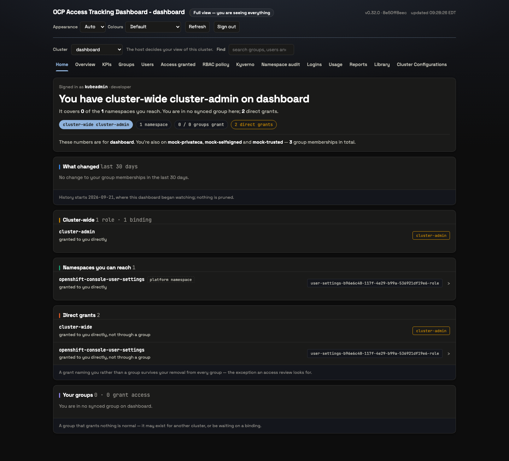
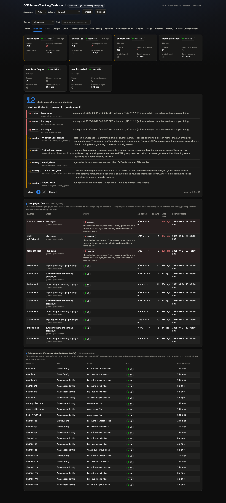
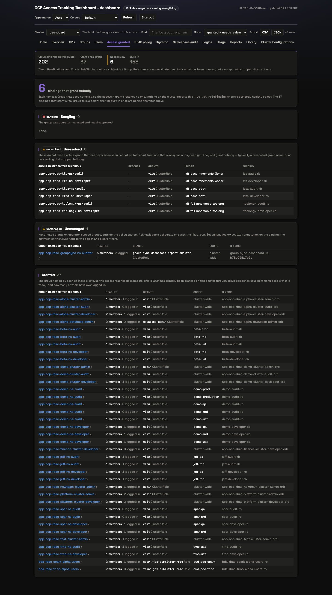
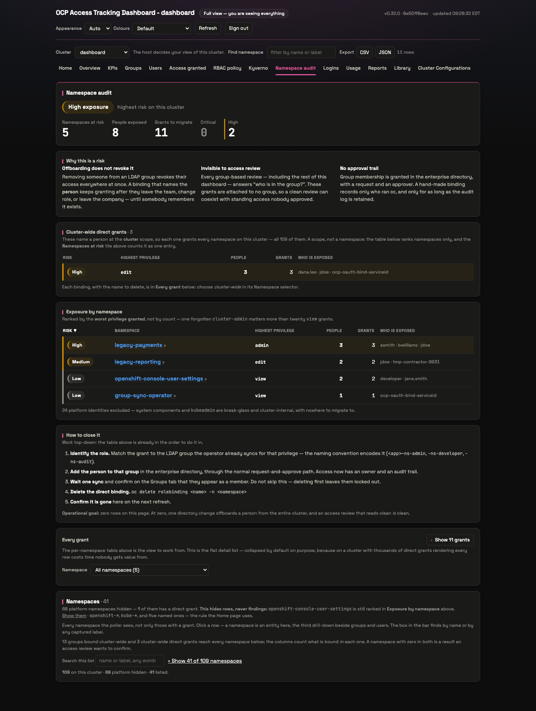
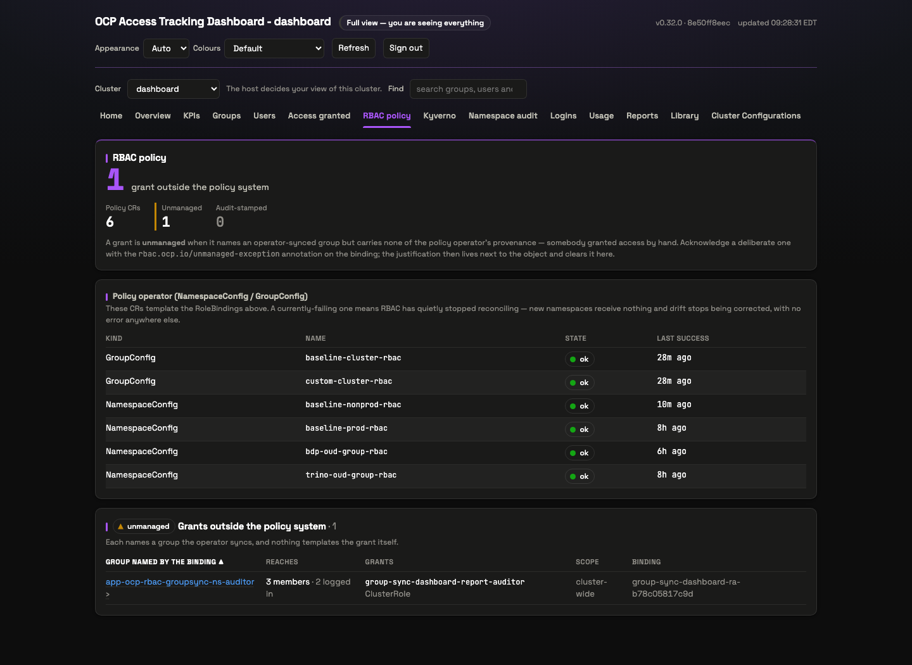
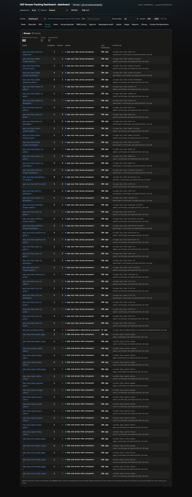
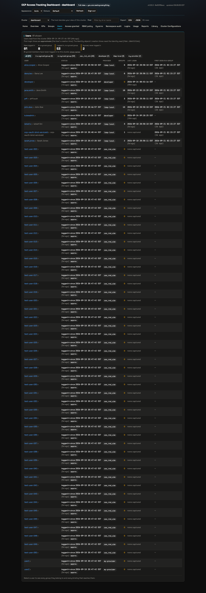
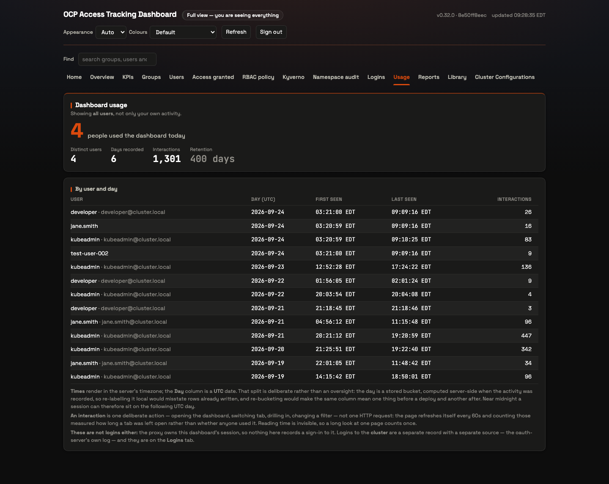
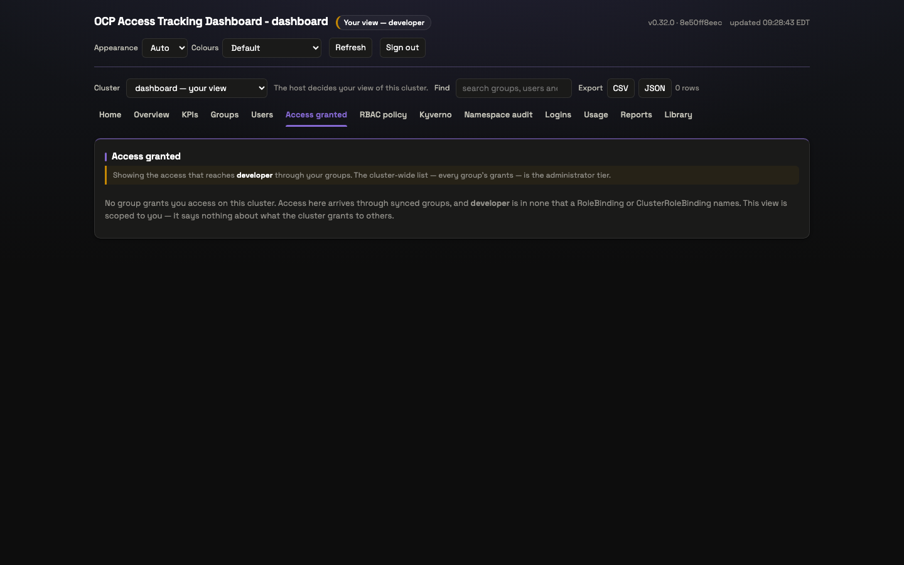
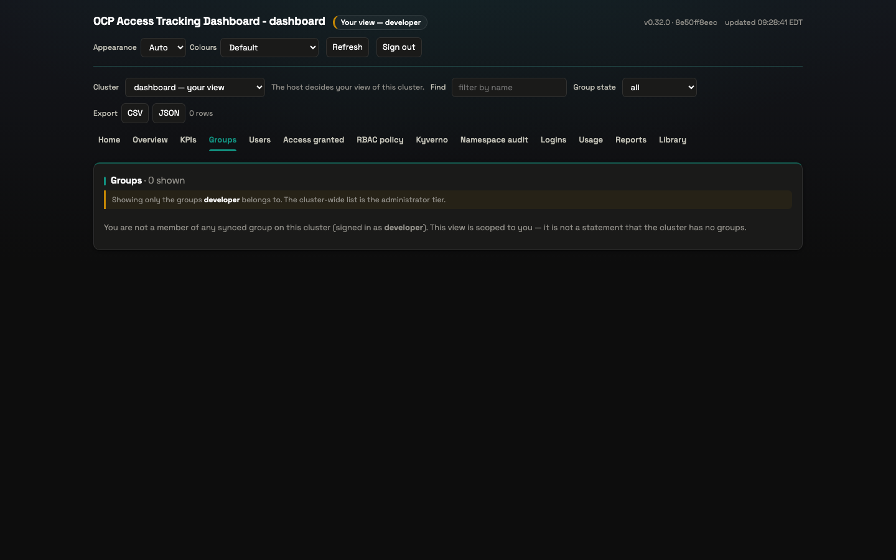

# OCP Access Tracking Dashboard

Read-only observability for the
[redhat-cop group-sync-operator](https://github.com/redhat-cop/group-sync-operator).
It observes; it never creates or edits a GroupSync CR.

Everything it surfaces is an *absence* — and absences are what a human scanning `oc get`
output does not notice. None of these raise an event or a failed reconcile:

| Failure | How it presents without this |
|---|---|
| A RoleBinding names a Group that does not exist | nothing — the binding looks healthy and grants nobody |
| Group synced but empty | nothing — a blank USERS column |
| CR not honouring its schedule | nothing until you diff timestamps by hand |
| A group silently stopped being refreshed | nothing — the CR still reports success |
| A user quietly dropped out of a group | nothing — no event, no log |
| A CR whose schedule is unparseable | nothing — it simply never runs again |
| A NamespaceConfig stopped reconciling | nothing — RBAC silently stops being templated, and both its conditions stay `True` |
| A RoleBinding names a **person** instead of a group | nothing — and it survives offboarding, because removing them from LDAP revokes nothing |
| A hand-made grant on an operator-synced group | nothing — it looks identical to one the policy system produced |

On the reference cluster it finds **9 RoleBindings granting `admin`, `view` and `edit` to
groups that have never existed** — access reaching nobody, in three namespaces, which
`oc get rolebinding` reports as perfectly healthy.

## What it looks like

Captured from a running deployment, not a mockup — every number below is what the dashboard
read off the cluster. [`## What it shows`](#what-it-shows) describes each tab in full.

**Home** — where every reader lands: who you are on the selected cluster, what changed for you,
and the rule that decided your view, on the line beside the cluster selector (*The host decides
your view of this cluster.*). Here kubeadmin, with cluster-wide `cluster-admin` on the host and
2 grants made to them directly rather than through a group.



**Overview** — every joined cluster's health, the GroupSync and policy CRs, and the computed
alerts across the fleet. Here six clusters and 12 alerts: three GroupSync schedules that have
stopped firing, six for grants bound to a person rather than an enterprise-managed group — on the
host, 11 such grants across 5 namespaces, 3 granting `admin` or `cluster-admin` — and three for
groups synced with zero members.



**Access granted** — every group-subject binding, classified. 202 of them: 37 grant a real group,
6 name a group that has never existed and therefore grant nobody, 1 grants a synced group from
outside the policy system (the one the RBAC policy tab lists), and 158 are built-in groups, which
are expected and filtered out by default.



**Namespace audit** — bindings that name a *person*, ranked per namespace by the worst privilege
granted there rather than by count, because one forgotten `cluster-admin` outranks twenty `view`
grants.



**RBAC policy** — the policy operator's CRs beside the provenance of the bindings they template,
and the grants that have none. Here 6 policy CRs, all reconciling, and 1 grant outside the
policy system: the ClusterRoleBinding this chart renders for its default auditor group
(`rbacAuditors`), giving `app-ocp-rbac-groupsync-ns-auditor` the dashboard's report-auditor
role — no policy CR templates it, so the tab lists it.



**Groups** — all 62, with the CR that owns each one, member count, grants, refresh age and
source DN. None is empty and none is unattributed on this cluster; the Group state filter finds
them when there are. The Find box narrows the list as you type.



**Users** — everyone who has logged in to the cluster: one row per OpenShift `User` object, which
the cluster creates at a person's first login and never before. Each row says when they first
logged in, through which identity provider, how many synced groups they hold (zero is allowed and
highlighted: logged in, no synced access), and their last captured login. Synced members who have
never logged in are not rows; they are one line, by count, with the names a click away. Type part
of an id or a name to filter; chips narrow by membership and by provider.



**Logins** — every login attempt against the cluster's own OAuth server: who, when, and why a
failure failed, to the extent the record supplies a cause. Read from the oauth-server audit log on the control-plane nodes
(`loginCapture.source: audit-log`) — no Debug verbosity, and history back to the rotated files;
the tab says what period it can account for rather than implying it saw everything.


**Usage** — who used the dashboard, one row per user per UTC day, self-scoped by default.



### The same dashboard, to someone who is not an administrator

Every image above is an administrator's view. An ordinary reader sees their own groups, their own
grants — the Access granted tab shows them the bindings that reach them through their groups — and
their own sign-ins, and the two tabs that report on the cluster rather than on them (Overview, RBAC
policy) are refused outright — a named refusal, never a blank page, because an empty audit tab
reads as a healthy cluster.



The header pill says which view you are in, so "nothing looks different" and "you are seeing
everything" are distinguishable from the screen. Same deployment, same tab — the Groups tab
shows `developer`, who is in no synced group here, 0 groups and says the view is scoped to them,
not that the cluster has none, where an administrator sees 62.



Who counts as an administrator is a SubjectAccessReview the operator chooses, not a list of
names — see [`docs/guides/ACCESS_CONTROL.md`](docs/guides/ACCESS_CONTROL.md).

<sub>Regenerate with
[`local-development/capture-screenshots.py`](local-development/capture-screenshots.py), which
drives a real browser through the OAuth login and refuses to write an image for any page that
raised a JavaScript error or rendered an API error. Both sets come from the same script against
the same deployment — the administrator's into `docs/screenshots/`, an ordinary reader's into
`docs/screenshots/self/` via `--login-user` and `--provider`.</sub>

## Layout

| Where | What |
|---|---|
| [Documentation index](docs/README.md) | operator guides first, followed by development guides and records |
| [`docs/CHANGELOG.md`](docs/CHANGELOG.md) | what each application and chart release changed, newest first |
| [`docs/guides/reference-architecture.md`](docs/guides/reference-architecture.md) | **start here to operate or extend it** — components, poll and request flow, data model, concurrency, security, and the reason behind each deliberate constraint |
| [`docs/reports/`](docs/reports/README.md) | the eleven standard reports — what each shows, its parameters, and how to schedule them by cadence across clusters |
| [`charts/group-sync-dashboard/`](charts/group-sync-dashboard/README.md) | the Helm chart — how you deploy it, and every value |
| [`local-development/`](local-development/README.md) | the application, tests and build tooling |
| [`local-development/API.md`](local-development/API.md) | every endpoint, what each field means, the ones routinely misread |

Reading it from outside the cluster, and extending it:

| Document | What |
|---|---|
| [`docs/guides/api-access.md`](docs/guides/api-access.md) | calling `/api` with `curl` or Postman — the token exchange, and the two Postman defaults that break it |
| [`docs/guides/api-contract.md`](docs/guides/api-contract.md) | the seven rules a new endpoint must satisfy, each enforced by a test — and how to cite code from a document |
| [`docs/guides/updating-vendored-assets.md`](docs/guides/updating-vendored-assets.md) | refreshing the Swagger/ReDoc bundles and the fonts, and why they live in git |

Design notes, for the decisions that are not obvious from the code:

| Document | What |
|---|---|
| [`docs/design/storage-coupling.md`](docs/design/storage-coupling.md) | why SQLite, the storage seam, and what a second backend would have to satisfy |
| [`docs/design/unmanaged-audit-design.md`](docs/design/unmanaged-audit-design.md) | unmanaged-grant discovery, its invariants, and the live-cluster measurement that removed the write path |
| [`docs/design/DESIGN_session_and_signout.md`](docs/design/DESIGN_session_and_signout.md) | the 4-hour session cap and the sign-out button — and the four measurements that made the design this small, including why there is no `-cookie-refresh` and why sign-out cannot revoke the token |
| [`docs/guides/image-vulnerability-scan.md`](docs/guides/image-vulnerability-scan.md) | the CVE position, what is reachable, and what a rebuild cannot fix |
| [`docs/design/DESIGN_supply_chain.md`](docs/design/DESIGN_supply_chain.md) | the image signature, SBOM and provenance, the chart attestation, and why none of it has a key |
| [`docs/guides/TUTORIAL_ca_trust_hashed_directory.md`](docs/guides/TUTORIAL_ca_trust_hashed_directory.md) | tutorial: how OpenSSL's hashed CA directory works, and the injected, hand-made, cert-manager and Kyverno ways to trust a CA in a pod — every step run on CRC |
| [`docs/guides/TUTORIAL_mermaid_diagrams.md`](docs/guides/TUTORIAL_mermaid_diagrams.md) | tutorial: how the diagrams are derived from code, written in Mermaid, checked in half a second and rendered in CI — with two built from scratch |
| [`docs/design/DESIGN_reporting_service.md`](docs/design/DESIGN_reporting_service.md) | the report service: eleven access-review reports as HTML and PDF/A from a separate pod, its data path, its tickets |
| [`docs/design/namespace-report-design.md`](docs/design/namespace-report-design.md) | superseded — per-namespace and access-review reports as HTML/PDF from a separate report service; the definitive answer on `--openshift-sar` |
| [`docs/specs/README.md`](docs/specs/README.md) | **the feature programme** — sixty-one specifications, starting from the original thirteen modules, each specified with its complete code before any is implemented, one GitHub issue and milestone each, released strictly one at a time; the index, the version ladder and the definition of done |

## Install

```bash
helm install group-sync-dashboard charts/group-sync-dashboard \
  --namespace group-sync-dashboard --create-namespace
```

For anything you will upgrade later, put the release's configuration in a file and pass it
every time — see [`environments/`](environments/README.md):

```bash
helm upgrade --install group-sync-dashboard charts/group-sync-dashboard \
  -n group-sync-dashboard -f environments/crc.yaml
```

Helm resets to chart defaults the moment `-f` or `--set` is given, keeping only what that
invocation passed, so `--set` is **not** additive across upgrades. Measured on this chart: a
later `helm upgrade --set logLevel=DEBUG` silently dropped an unrelated feature switch and
reported success.

That is enough. The host is derived from the cluster's own apps domain, the image comes from
a public registry, the OAuth proxy is on by default, and the dashboard observes the cluster
it runs on using the pod's projected ServiceAccount token — which kubelet rotates and the app
re-reads every poll, so there is no long-lived credential to mint or expire.

Every value is documented in
[`charts/group-sync-dashboard/values.yaml`](charts/group-sync-dashboard/values.yaml). The
ones most likely to matter:

| Value | Default | Why you would change it |
|---|---|---|
| `oauthProxy.enabled` | `true` | **Leave it on.** With it off the route is unauthenticated and the dashboard exposes group membership |
| `route.enabled` / `ingress.enabled` | `true` / `false` | A Route the router names `<release>.<apps domain>` — no host at render time, so it deploys under ArgoCD, Flux and plain `helm template` with no per-cluster value. Plain Kubernetes: Route off, Ingress on, and give it `ingress.host` |
| `route.host` | derived | Set it only to pin the hostname, e.g. a second release in another namespace |
| `clusters` | the local cluster | Add entries to observe others |
| `trustedCA.*` | injected on | Corporate CAs for external clusters — see below |
| `persistence.enabled` | `true` | Leave on. The accumulated history cannot be re-fetched |
| `config.backup.enabled` | `true` | Leave on. The only protection for that history, though it lands on the same volume |
| `config.userActivity.visibility` | `self` | `all` lets everyone see everyone's dashboard usage. It is identifiable personnel data |
| `config.unmanagedAudit.mode` | `log` | `log` publishes each hand-made grant it finds to the pod log; `off` silences that log only. Writes nothing either way — see below |
| `monitoring.serviceMonitor.enabled` | `true` | Needs the Prometheus Operator CRDs (OpenShift ships them); on with `monitoring.prometheusRule.enabled` and the GrafanaDashboard CR since chart 0.36.0 — the chart README’s "Prerequisites — the Grafana and Observe integration" |
| `replicaCount` | `1` | Leave at 1. Above one, each pod keeps its own database and history diverges — see the chart README's Scaling section |
| `config.pollIntervalSeconds` | `60` | Poll cadence, and the error bar on "when did this person lose access?" |
| `logLevel` | `INFO` | `DEBUG` \| `INFO` \| `WARNING` \| `ERROR` \| `CRITICAL`, and nothing else. Controls the app's own logging; login capture reads audit logs at default OAuth verbosity. See the [chart README](charts/group-sync-dashboard/README.md#dashboard-log-verbosity--loglevel). |

## Authentication

`oauthProxy.enabled=true` puts cluster login in front of the dashboard, as a sidecar.

For the **UI**, it is authentication, not authorization: anyone who can log into the cluster
can view. That is the OpenShift provider's documented default. Set `oauthProxy.sar` to a
SubjectAccessReview if you need to restrict who may open it at all.

Be precise about what that exposes, because an earlier version of this paragraph was not.
It said the dashboard "shows nothing a user could not already read with `oc get groups`".
That is true of the Groups tab and of nothing else. The dashboard reports the cluster's whole
RBAC **binding** surface — every ClusterRoleBinding and RoleBinding, the role each grants,
and which subjects hold it — which reading Groups does not give you. Treat UI access as
equivalent to cluster-wide RBAC read, and set `oauthProxy.sar` accordingly if that is not
who you want looking.

The **API** is gated properly. `oauthProxy.apiTokenAccess.enabled` lets a bearer token read
`/api`, and the delegated review demands `list clusterrolebindings` cluster-wide — the honest
floor for that data. Verified: an identity without it gets `403` where it would otherwise have
read every binding on the cluster. See [`docs/guides/api-access.md`](docs/guides/api-access.md).

Turning the proxy on also switches the Route (or Ingress) to `reencrypt`, binds the app to `127.0.0.1`
so the proxy cannot be bypassed from inside the cluster, and moves the probes behind
`skip-auth-regex` — all handled by the chart.

The proxy image is `registry.redhat.io/openshift4/ose-oauth-proxy-rhel9:v4.15`, an explicit
version rather than a tag whose digest tracks the cluster's release payload. It needs
registry.redhat.io credentials, which a cluster's global pull secret normally already carries;
`values.yaml` records how to check and how to fall back to the internal imagestream.

## Trusting corporate CAs

External clusters are usually signed by a corporate CA that is absent from the default trust
store. Without it, verification fails and the cluster renders as **unreachable** — a TLS
problem that presents as an outage. Two sources, either or both:

```yaml
trustedCA:
  injected:
    enabled: true          # OpenShift fills this from proxy/cluster.spec.trustedCA
  existingConfigMap:
    enabled: false         # a ConfigMap you create yourself
    name: enterprise-ca
    key: ca-bundle.crt
```

**Injected** needs nothing from you: an empty ConfigMap labelled
`config.openshift.io/inject-trusted-cabundle: "true"` is populated by the network operator
with the system trust store merged with the cluster's configured CA. Measured on a stock
cluster: 148 certificates.

**existingConfigMap** is for a CA the cluster has never been told about — a partner's
internal CA, a lab signer, an external cluster outside your corporate bundle:

```bash
oc create configmap enterprise-ca --from-file=ca-bundle.crt=/path/to/ca.pem \
  -n group-sync-dashboard
```

It is deliberately not templated from values: certificates put in `values.yaml` end up in
git, in `helm get values`, and in any CI log that echoes them.

A cluster entry naming its own `caBundleFile` always wins — that is a specific statement
about what it trusts, and silently widening it would be the wrong kind of helpful.

## Monitoring

`/metrics` serves Prometheus exposition; the chart ships a ServiceMonitor and twenty alerting
rules (three only with reporting on, two only where the off-volume backup CronJob renders; both are
the default), both on by default (they need the Prometheus Operator CRDs, which OpenShift ships), and
a Grafana dashboard (a sidecar-labelled ConfigMap, `monitoring.grafanaDashboard`, plus a
`GrafanaDashboard` CR where the cluster serves grafana-operator's API) that follows the
ServiceMonitor's switch by default — see `docs/specs/SPEC_B3_grafana_dashboard.md`.

Cardinality is bounded deliberately: the application's label names are `branch`, `change`,
`cluster`, `commit`, `component`, `finding`, `groupsync`, `kind`, `namespace`, `node`, `origin`,
`outcome`, `provider`, `report`, `schedule`, `severity`, `source`, `state`, `status`,
`subject_kind`, `table`, `threshold`, `tier` and `version`, never a group or a user. That is a scale concern — 500 groups must not mean 500 series — and a
disclosure one, since `/metrics` is unauthenticated so a ServiceMonitor can reach it.

`gsd_groupsync_last_sync_timestamp_seconds` is a unix timestamp rather than a precomputed age
or boolean, so the threshold lives in the alert where it can be seen and tuned:

```promql
(time() - gsd_groupsync_last_sync_timestamp_seconds) > 7200
```

The alert worth knowing about is `GroupSyncDashboardNotPolling`. It catches a dead poll loop,
which the health endpoints structurally cannot: `/healthz` is unconditional and `/readyz`
only reads the store, so both stay green while the dashboard serves frozen data.

Two more cover SQLite, and are the other failures where the pod stays Ready and nothing else
looks wrong. `GroupSyncDashboardWalGrowing` catches a write-ahead log that is not being
checkpointed — checkpoints yield to open readers, so a steady read load can starve them, and
the WAL grows until the volume fills while the database file stays small.
`GroupSyncDashboardWalDisabled` catches WAL never having engaged: it is requested at startup
but a filesystem without working shared memory (NFS, EFS, SMB) refuses it silently, and reads
then block on every write.

Five more are `GroupSyncOverdue`, `DanglingRoleBinding`,
`GroupSyncClusterUnreachable`, `GroupSyncDashboardConfigReconcileError` (a `NamespaceConfig`
or `GroupConfig` has stopped reconciling, so RBAC is no longer being templated) and
`GroupSyncDashboardDirectUserGrants` (grants that still name a person — a migration backlog,
deliberately given a one-hour `for` so it is visible without paging anyone). The chart README
lists all twenty with their thresholds.

## Building and shipping

```bash
cd local-development
cp .env.example .env && chmod 600 .env && $EDITOR .env
./build-and-push-external.sh --update-values     # build, push, pin the tag into values.yaml
helm upgrade --install group-sync-dashboard ../charts/group-sync-dashboard -n group-sync-dashboard
```

Images are tagged `<version>-<git-sha>`, the commit is stamped into the image and served at
`/api/version`, and the build refuses a dirty tree unless you pass `--allow-dirty`. All of
that exists because "the image was built before the fix and deployed after it" happened here,
and nothing revealed it.

Full detail, including CRC-specific traps, in
[`local-development/README.md`](local-development/README.md).

### Publishing from `main`

[`.github/workflows/publish.yml`](.github/workflows/publish.yml) runs **that same script** on
every merge to `main` that changes an image input, and commits nothing back to this repository:
the `<version>-<sha>` tag every time, the `:<version>` alias only when a human moved
`version` in `pyproject.toml`. With `SUPPLY_CHAIN_SBOM` and `SUPPLY_CHAIN_SIGNING` on (the unset default), its SBOM is kept as
an artifact, and on `main` the pushed digest is signed and attested — keyless, under GitHub's OIDC
identity — with the SBOM attached. How an
operator checks all of that: [`charts/group-sync-dashboard/docs/HELM_DOWNLOAD_AND_INSTALL.md`](charts/group-sync-dashboard/docs/HELM_DOWNLOAD_AND_INSTALL.md);
the release model: [`docs/guides/RELEASING.md`](docs/guides/RELEASING.md).

Configure once, under **Settings → Secrets and variables → Actions**:

| | Name | Value |
|---|---|---|
| **Secret** | `REGISTRY_USERNAME` | Quay robot account, e.g. `ephico2real+github_ci` |
| **Secret** | `REGISTRY_PASSWORD` | that robot's token — not a personal password |
| Variable (optional) | `REGISTRY` | defaults to `quay.io` |
| Variable (optional) | `REGISTRY_NAMESPACE` | defaults to `ephico2real` |
| Variable (optional) | `SUPPLY_CHAIN_SBOM` | `false` turns the SBOM job off; unset means on |
| Variable (optional) | `SUPPLY_CHAIN_SIGNING` | `false` turns image signing, SBOM attestation and provenance off — for a runner without egress to the Sigstore services; unset means on |
| Variable (optional) | `CI_UI_TESTS` | `false` turns the browser-test job in `ci.yml` off; unset means on |

The names deliberately match what the script already reads from `.env`, so one name means one
thing locally and in CI. Registry and namespace are **variables, not secrets** — they are not
sensitive, and as secrets they would be masked in exactly the logs where you want to see which
registry a run pushed to.

**Re-running a commit names the same source.** The tag embeds the commit sha, so the same tag can
only ever mean the same source; a re-run re-pushes it, possibly with different bytes (floating
bases, `dnf update`), so pin `image.digest` when the bytes must not move. The aliases are server-side copies
of that manifest, so no tag can end up naming different content than the digest that was signed.

Credentials are never put on a command line — `secrets` go to the step's `env` and the script
pipes the password to `podman login --password-stdin`. That is also why the workflow checks for
the secrets in a step rather than in a job `if:`: per
[GitHub's docs](https://docs.github.com/en/actions/how-tos/write-workflows/choose-what-workflows-do/use-secrets),
"secrets cannot be directly referenced in `if:` conditionals".

## What it shows

Up to 14 tabs, in the order drawn by
`local-development/gsd/static/index.html#function renderFilters`.
The server decides the reader's tier: the wide audit view, the self-scoped view, the separate
Usage tier, and the cluster-admin tier. Cluster-data scope can differ by selected cluster;
Reports and Library use the host's wide tier. These checks and the deployment overrides live
in `local-development/gsd/api.py#build_app`; the page renders the returned scope.

**Home** — every reader's own identity, access and recent changes on the selected cluster
(`local-development/gsd/static/index.html#function homePage`).

**Overview** — cluster health, GroupSync and policy CRs, and computed alerts. The wide tier
sees the cluster audit; a self-scoped reader gets a named refusal
(`local-development/gsd/static/index.html#function overviewPage`,
`local-development/gsd/static/index.html#function render`).

**KPIs** — dashboard and report-service resource use, backup health, fleet access posture
and activity trends. The tab is shown only to the cluster-admin tier
(`local-development/gsd/static/index.html#function kpiPage`,
`local-development/gsd/static/index.html#function clusterAdmin`).

**Groups** — groups, their members, membership history and grants. The wide tier sees all;
self-scoped readers see only their own groups
(`local-development/gsd/static/index.html#function groupsPage`,
`local-development/gsd/static/index.html#const SCOPE_BANNER`).

**Users** — OpenShift User objects, first login, identity provider, synced-group count and
last captured login; synced members without a User object are counted separately.
The wide tier sees everyone; self-scoped readers see their own row
(`local-development/gsd/static/index.html#function usersPage`,
`local-development/gsd/static/index.html#const SCOPE_BANNER`).

**Access granted** — group-subject bindings classified as healthy, dangling, unresolved,
built-in or unmanaged for the wide tier; bindings reaching the reader through their groups
for the self-scoped tier
(`local-development/gsd/static/index.html#function bindingsPage`).

**RBAC policy** — NamespaceConfig and GroupConfig CRs and binding provenance, for the wide
tier; self-scoped readers get a named refusal
(`local-development/gsd/static/index.html#function policyPage`).

**Kyverno** — policy-report results and their changes, for the wide tier; self-scoped readers
get a named refusal. The page distinguishes a disabled module from absent reports
(`local-development/gsd/static/index.html#function kyvernoPage`).

**Namespace audit** — direct user grants ranked by privilege and scope, plus namespaces.
The wide tier sees the audit; self-scoped readers see their own grants and reachable namespaces
(`local-development/gsd/static/index.html#function nsAuditPage`,
`local-development/gsd/api.py#build_app`).

**Logins** — captured login attempts and their outcomes. The wide tier sees all; self-scoped
readers see attempts recorded under their own username
(`local-development/gsd/static/index.html#function loginsPage`,
`local-development/gsd/static/index.html#const SCOPE_BANNER`).

**Usage** — dashboard use per user per UTC day and report-generation history. Requires an
authenticated OAuth-proxy identity; readers see their own rows unless they pass the separate
Usage or cluster-admin tier, or `config.userActivity.visibility` is `all`
(`local-development/gsd/static/index.html#function usagePage`,
`local-development/gsd/api.py#build_app`).

**Reports** — report catalogue, generation and a link to reporting status, schedules and
history. Shown when reporting is enabled; requires the host's wide tier, with a named refusal
for self-scoped readers (`local-development/gsd/static/index.html#function reportsPage`).

**Library** — generated reports, grouped by schedule and report, with run details and downloads.
Shown when reporting is enabled; requires the host's wide tier, with a named refusal for
self-scoped readers (`local-development/gsd/static/index.html#function libraryPage`).

**Cluster Configurations** — configured and discovered clusters, their credentials' status,
trust settings and discovery findings, with management controls when writes are enabled.
The tab is shown only to the cluster-admin tier
(`local-development/gsd/static/index.html#function clusterConfigPage`,
`local-development/gsd/static/index.html#function clusterAdmin`).

Binding views show direct bindings; role rules are not evaluated
(`local-development/gsd/static/index.html#Direct bindings only`).

## What it writes

The dashboard remains read-only on the Groups, GroupSync CRs and bindings it observes.
Unmanaged-grant auditing defaults to `log`; `off` silences it. The old `annotate` mode no
longer patches bindings: Kubernetes privilege-escalation prevention refused that patch
(`charts/group-sync-dashboard/values.yaml#unmanagedAudit:`,
`charts/group-sync-dashboard/templates/rbac.yaml#privilege-escalation prevention`).
Its own state is written in these places:

- **Dashboard data volume.** SQLite stores observed cluster, group, user, binding and policy
  state, accumulated sync, membership, binding and login history, capture cursors, dashboard
  usage, report-run records and daily KPIs (`local-development/gsd/store.py`). Backups and
  report snapshots are database copies (`local-development/gsd/store.py#Store.backup`,
  `local-development/gsd/store.py#Store.snapshot`); schema upgrades keep a pre-upgrade copy
  (`local-development/gsd/store.py#PRE_UPGRADE_DIR`). Fleet credential-gate and ping state also
  has a file backstop beside the database (`local-development/gsd/fleetstate.py#FileBackstop`).
  The chart mounts the data PVC here when persistence is enabled
  (`charts/group-sync-dashboard/templates/deployment.yaml#mountPath: /data`,
  `charts/group-sync-dashboard/templates/pvc.yaml`).
- **Report artefact volume.** The report service writes each run's manifest and generated
  JSON, HTML, PDF or optional CSV files, subject to retention
  (`local-development/gsd/reporting/artifacts.py`). It reads dashboard snapshots through a
  read-only data mount and writes to its separate artefact PVC when
  `reporting.persistence.enabled` is on, or an ephemeral volume otherwise
  (`charts/group-sync-dashboard/templates/report-deployment.yaml#mountPath: /artifacts`,
  `charts/group-sync-dashboard/templates/report-pvc.yaml`).
- **Leases in the release namespace.** Leader election creates and updates its Lease when
  enabled (`local-development/gsd/leader.py#LeaderElector`); fleet authentication maintains
  one Lease per fleet account for claims, credential gating and ping bookkeeping
  (`local-development/gsd/fleetstate.py#FleetLease`). The chart grants those writes through
  a namespace Role (`charts/group-sync-dashboard/templates/rbac.yaml#-leases`).
- **Cluster Secrets behind the writes switch.** With `clusterConfig.secrets.enabled` and
  `clusterConfig.secrets.writes.enabled`, the app creates, updates and deletes labelled
  cluster Secrets in its own namespace: add, rotate and delete, plus credential lookup and
  onboarding reconciliation (`local-development/gsd/clusterconfig/writer.py`). The API's
  management routes require the cluster-admin tier (`local-development/gsd/api.py#build_app`).
  The Kubernetes grant covers Secrets in that namespace; label checks are enforced by the app
  (`charts/group-sync-dashboard/templates/cluster-secrets-rbac.yaml`).
- **Deletions from the page.** With `housekeeping.enabled` (on by default), authenticated
  cluster-admin readers can delete finished report runs and older backup, pre-upgrade and
  pre-restore copies. The newest copy of each kind is protected; queued and running reports
  cannot be deleted. Bulk cleanup previews the set before confirmation
  (`charts/group-sync-dashboard/values.yaml#housekeeping:`,
  `local-development/gsd/api.py#build_app`, `local-development/gsd/housekeeping.py`,
  `local-development/gsd/reporting/artifacts.py#RunInFlight`).

Beyond its own state, it creates SubjectAccessReviews to decide each reader's tier
(`local-development/gsd/kube.py`), questions the API server answers and stores nowhere, and a fleet
account's session logs in to its remote cluster and revokes that token when done
(`local-development/gsd/fleetlogin.py`).

## Two things to know before reading a screen

**The API keeps no history.** A CR carries one timestamp and each Group carries one of its
own, so timelines and membership changes are *accumulated* by polling. An empty timeline
means this dashboard has not seen a sync yet — not that the operator never synced.

**`ReconcileError` is sticky.** The operator never clears it on a later success, so a healthy
CR carries both `ReconcileSuccess` and `ReconcileError` at `status: True` indefinitely. An
error counts as current only when its `lastTransitionTime` is newer than the success's;
reading the condition's status alone would paint a healthy CR permanently red.

## Reading it across a fleet

The dashboard deploys **per cluster** and publishes its own API at a predictable hostname, so
an aggregator does not have to host or store anything — it reads each cluster and composes:

```bash
read -rs GSD_PASSWORD && export GSD_PASSWORD
local-development/cluster-report.py \
  --clusters prod,staging,dev --domain example.com --ldap-user svc-reporter
```

Credentials are exchanged for a short-lived token against each cluster's own OAuth server —
the same PKCE sequence `oc login -u -p` performs — so no `oc` and no kubeconfig are involved.
One exchange per cluster, because an OpenShift token is issued by one cluster and meaningless
to another. A cluster that cannot be reached appears in the report as `UNREACHABLE` rather
than silently missing.

Requires `oauthProxy.apiTokenAccess.enabled` and a calling account with cluster-wide RBAC
read. Recipes for `curl` and Postman: [`docs/guides/api-access.md`](docs/guides/api-access.md).

## Not built yet

Effective-permission expansion and log-scrape enrichment.

Per-cluster authorization for the multi-cluster case shipped in 0.19.0 as `clusters[].visibility` /
`clusters[].identity` (`docs/guides/ACCESS_CONTROL.md` §11); deploying per cluster and aggregating through
the API, as above, still removes the identity question rather than answering it.
