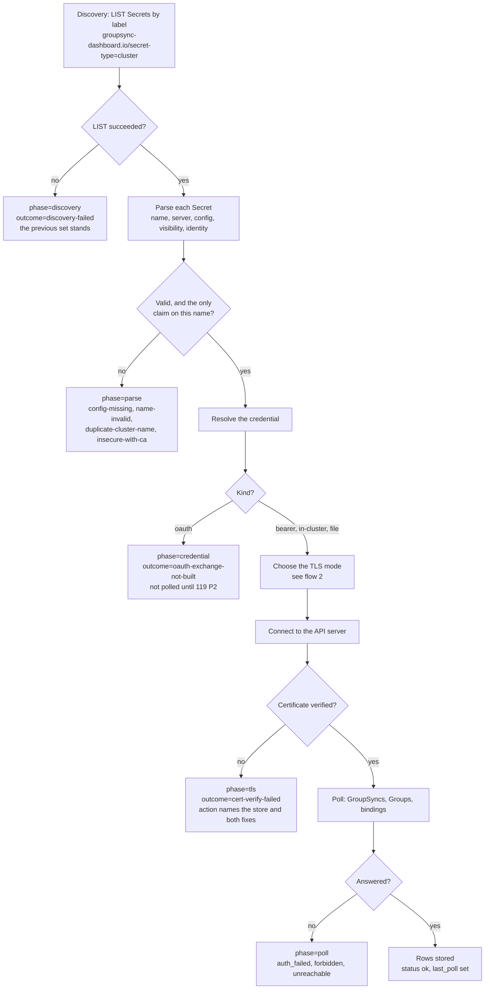
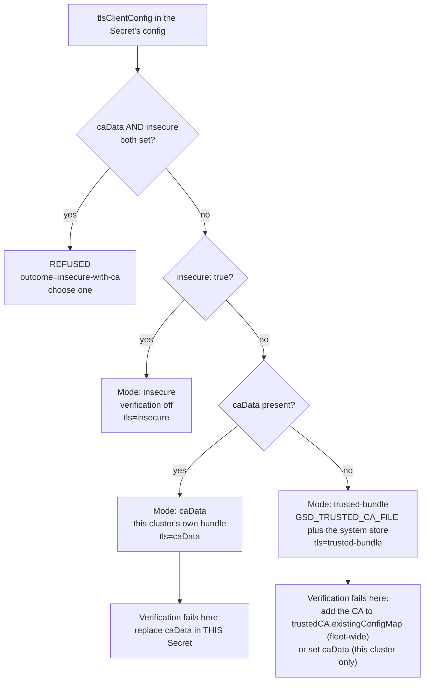
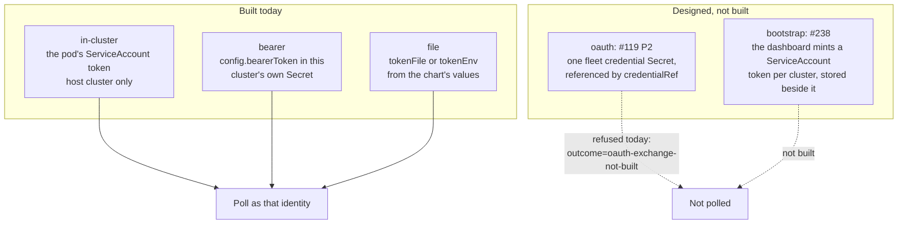

# How a cluster connects — the four flows

The cluster-configuration module (#230) decides, for every cluster in the fleet, three things a
reader eventually has to ask about: where its configuration came from, what authenticates it, and
what its API server's certificate is checked against. This document is the picture of those
decisions.

**Each flow is drawn twice, and that is deliberate.** The mermaid renders on GitHub and in the docs
site; the ASCII twin beside it is what survives a terminal, a `kubectl logs` paste, a support ticket
and an email to somebody who cannot open the repository. They are the same decision points, not a
picture and a caption — if you change one, change the other.

The log lines quoted throughout are the real vocabulary (`gsd/clusterconfig/events.py`, #245): every
failure carries `phase=`, `outcome=`, `action=` and `detail=`, so a line in the log and a row on the
Cluster Configurations tab are two renderings of one fact.

---

## 1. The connection path

Discovery to poll, with every point that can refuse. A refusal is never an exception that stops the
other clusters: it is a **finding** on the tab and a `WARNING` in the log, and the rest of the fleet
keeps polling.



```text
  LIST Secrets by label ────────────► [FAIL] phase=discovery  outcome=discovery-failed
   groupsync-dashboard.io/                   the previous set stands; nothing is retired
   secret-type=cluster
          │ ok
          ▼
  Parse each Secret ───────────────► [FAIL] phase=parse       config-missing, name-invalid,
   name / server / config /                                    duplicate-cluster-name,
   visibility / identity                                       insecure-with-ca
          │ valid
          ▼
  Resolve the credential ──────────► [STOP] phase=credential  outcome=oauth-exchange-not-built
   bearer | in-cluster | file                                  (username+password: #119 P2)
          │
          ▼
  Choose the TLS mode  (flow 2)
          │
          ▼
  Connect ─────────────────────────► [FAIL] phase=tls         outcome=cert-verify-failed
          │ verified                                           action names the store AND both fixes
          ▼
  Poll ────────────────────────────► [FAIL] phase=poll        auth_failed | forbidden | unreachable
          │ answered
          ▼
  Rows stored, status=ok

  Every [FAIL] is a finding on the tab and one WARNING line, never an exception that
  stops the other clusters. Read the phase first: it tells you how far it got.
```

---

## 2. The three TLS modes

The operator's ruling of 2026-09-20: trust is one of three, and naming two at once is refused rather
than silently resolved. The decision is made **per cluster**, from that cluster's own `config`.



```text
                 tlsClientConfig
                        │
        ┌───────────────┴───────────────┐
        │ caData AND insecure both set? │
        └───────────────┬───────────────┘
                 yes ───┴─── no
                  │           │
          REFUSED             ▼
   outcome=insecure-      insecure: true? ──yes──►  MODE: insecure
        with-ca                  │                  verification off
     "choose one"                no                 tls=insecure
                                 ▼
                          caData present?
                       ┌─────────┴─────────┐
                     yes                   no
                      │                     │
              MODE: caData          MODE: trusted-bundle
       this cluster's own bundle    GSD_TRUSTED_CA_FILE + system store
           tls=caData                     tls=trusted-bundle
              │                                 │
   if verification fails:            if verification fails:
   replace caData in THIS            add the CA to trustedCA.existingConfigMap
   cluster's Secret                  (whole fleet), OR set caData (this cluster)
```

The last row is why the failure line separates the two: **the fix depends on the mode in force.** A
cluster on the shared bundle is repaired fleet-wide; a cluster pinning its own CA is repaired alone;
a cluster already running `insecure` cannot be failing verification at all.

---

## 3. The credential modes

What authenticates the dashboard to a cluster, and **which object holds the secret** — the question
that decides who can rotate it and what a compromise costs.



```text
  BUILT TODAY                          WHERE THE SECRET LIVES
  ───────────────────────────────────  ─────────────────────────────────────────
  in-cluster   the pod's SA token      mounted by Kubernetes; rotated by the kubelet
               (host cluster only)

  bearer       config.bearerToken      THIS cluster's own Secret, one per cluster
                                       rotate: edit that Secret

  file         tokenFile / tokenEnv    the chart's values and a mounted file

  DESIGNED, NOT BUILT
  ───────────────────────────────────  ─────────────────────────────────────────
  oauth        #119 P2                 ONE fleet credential Secret, referenced by
               username + password     credentialRef; rotate once for the fleet
                                       today: refused, outcome=oauth-exchange-not-built

  bootstrap    #238                    a token the dashboard MINTS per cluster and
               minted SA token         stores in its own labelled Secret, never in git
                                       re-minted at 80% of its life

  A bearer token is minted BY a cluster, so it lives IN that cluster's Secret.
  A username and password reach the whole fleet, so they live in ONE credential
  Secret that many clusters reference.
```

---

## 4. The tier gate on the surface

Who may see and change this, per the rulings of 2026-09-20 (#230, #239). **Each level asks its own
SubjectAccessReview and composes nothing**: RBAC is additive, and the SAR is the action's own
question, so whoever passes it can do the same thing with `oc` — the dashboard's ServiceAccount
performing the write grants nobody a permission they lack.


```text
   reader
     │
     ▼
   SAR: get secrets -n <dashboard ns>
     │                    │
     no                  yes
     │                    │
     ▼                    ▼
  no tab at all      clusterconfig:view
  (by URL: the       the tab, every cluster, its source,
   refusal card)     credential KIND, TLS mode, findings
                          │
                          ▼
                     SAR: create secrets -n <dashboard ns>
                          │                    │
                          no                  yes
                          │                    │
                          ▼                    ▼
                    read-only          clusterconfig:manage
                    no Create/Rotate/   writes the labelled Secret,
                    Delete/Test         rotates, deletes
                    (YAML twin shown)

  MEASURED (CRC, 2026-09-20): the pure auditor persona — the chart's
  report-auditor role alone — answers NO to both questions, because
  cluster-reader carries no rule covering secrets at all. A reader who
  DOES pass holds namespace admin/edit and can write that Secret with
  `oc` regardless, so the gate is honest rather than decorative.
```

---

## Reading the log against these pictures

```
gsd.clusterconfig INFO  discovery cycle=7 namespace=gsd seen=4 accepted=3 refused=1 added=ocp-east
gsd.clusterconfig INFO  cluster-resolved cycle=7 cluster=ocp-east source=secret:gsd-cluster-ocp-east
                        credential=bearer tls=trusted-bundle visibility=self-only identity=none enabled=true
gsd.poller        WARN  cluster-unreachable phase=tls outcome=cert-verify-failed
                        action="add the CA to the chart's trustedCA.existingConfigMap (fleet-wide), or set
                        tlsClientConfig.caData on this cluster's Secret (this cluster only)"
                        cluster=ocp-east source=secret:gsd-cluster-ocp-east tls=trusted-bundle
                        store=/etc/pki/ca-trust/extracted/pem/tls-ca-bundle.pem detail="ConnectError: [SSL: …]"
```

`phase=` places the failure on flow 1; `tls=` places it on flow 2; `credential=` places it on flow 3.
A cycle that changes nothing logs nothing, so a line in the log always means something happened —
`grep 'cycle=7'` gives one cycle's whole story, `grep 'cluster=ocp-east'` gives one cluster's.
