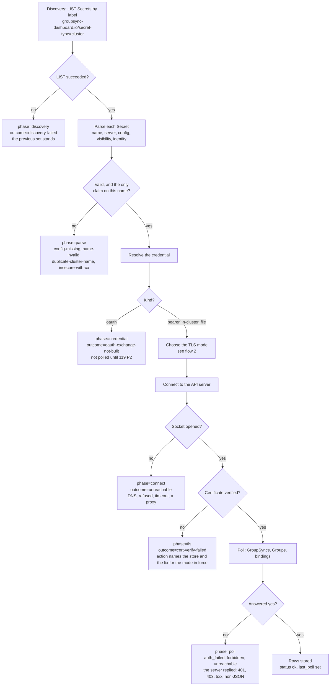
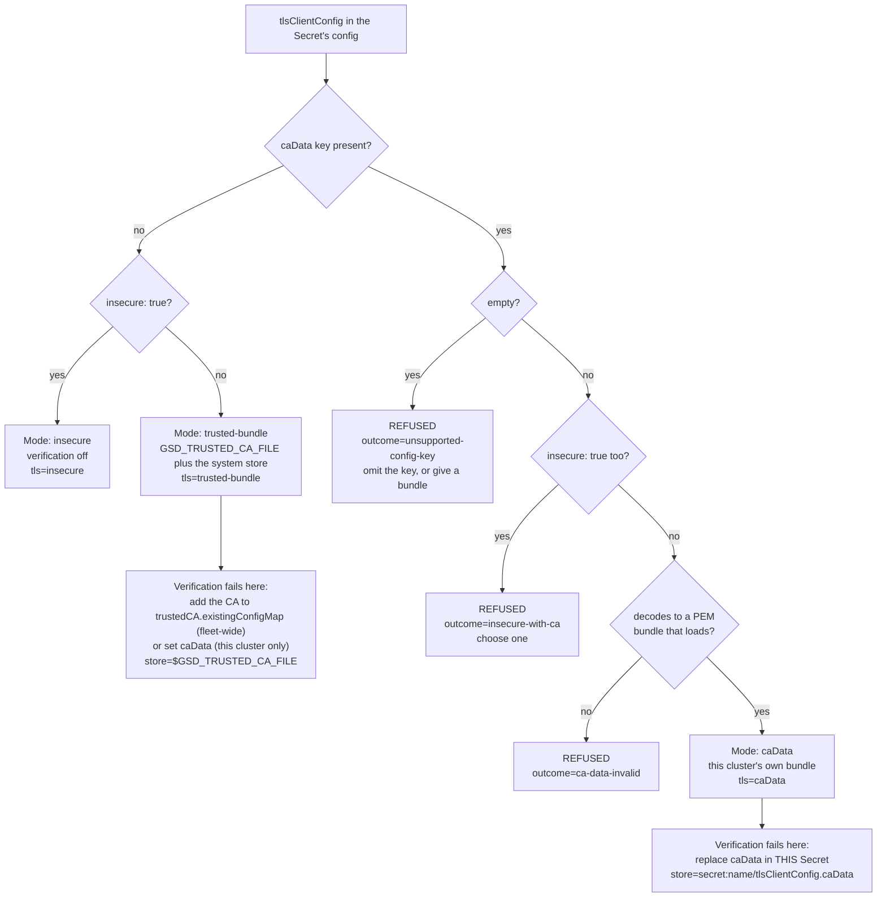
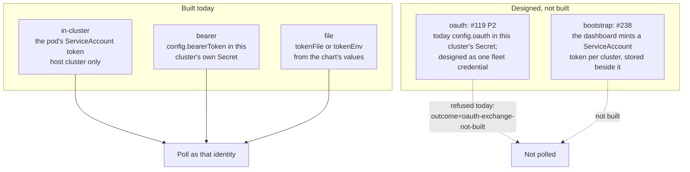
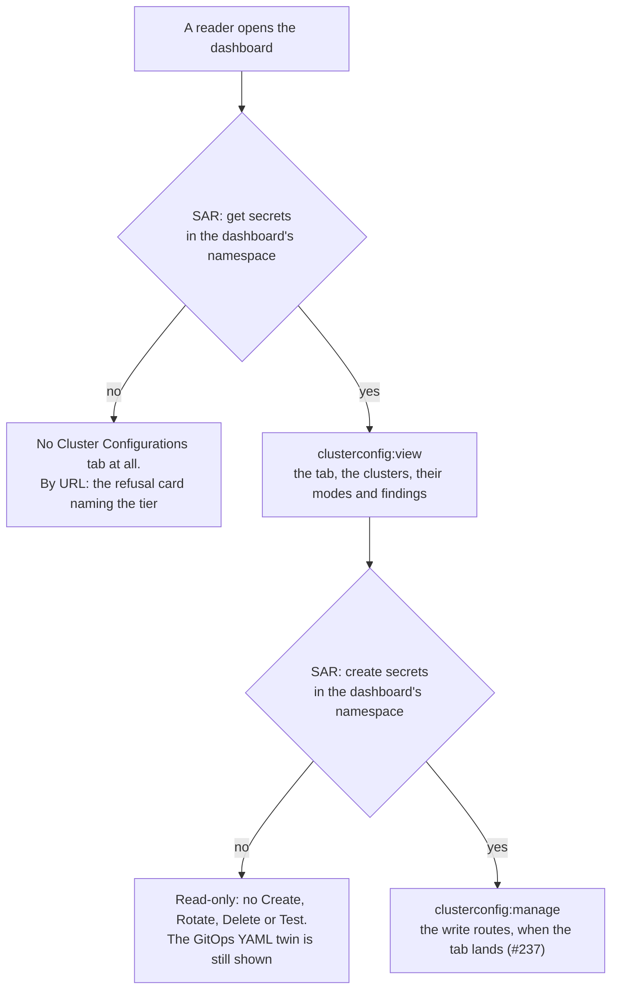

# How a cluster connects — the four flows

The cluster-configuration module (#230) decides, for every cluster in the fleet, three things a
reader eventually has to ask about: where its configuration came from, what authenticates it, and
what its API server's certificate is checked against. This document is the picture of those
decisions.

**Each flow is drawn twice, and that is deliberate.** The mermaid renders on GitHub and in the docs
site; the ASCII twin beside it is what survives a terminal, a `kubectl logs` paste, a support ticket
and an email to somebody who cannot open the repository. They are the same decision points, not a
picture and a caption — if you change one, change the other.

The log lines quoted throughout are the real vocabulary (`gsd/clusterconfig/events.py`, #245): every
failure carries `phase=`, `outcome=`, `action=` and `detail=`, so a line in the log and a row on the
Cluster Configurations tab are two renderings of one fact.

---

## 1. The connection path

Discovery to poll, with every point that can refuse. A refusal is never an exception that stops the
other clusters: it is a **finding** on the tab and a `WARNING` in the log, and the rest of the fleet
keeps polling.



```text
  LIST Secrets by label ────────────► [FAIL] phase=discovery  outcome=discovery-failed
   groupsync-dashboard.io/                   the previous set stands; nothing is retired
   secret-type=cluster
          │ ok
          ▼
  Parse each Secret ───────────────► [FAIL] phase=parse       config-missing, name-invalid,
   name / server / config /                                    duplicate-cluster-name,
   visibility / identity                                       insecure-with-ca
          │ valid
          ▼
  Resolve the credential ──────────► [STOP] phase=credential  outcome=oauth-exchange-not-built
   bearer | in-cluster | file                                  (username+password: #119 P2)
          │
          ▼
  Choose the TLS mode  (flow 2)
          │
          ▼
  Connect ─────────────────────────► [FAIL] phase=connect     outcome=unreachable
          │ socket opened                                      DNS, refused, timeout, a proxy
          ▼
  Verify the certificate ──────────► [FAIL] phase=tls         outcome=cert-verify-failed
          │ verified                                           action names the store AND the fix
          ▼                                                    for the mode in force (flow 2)
  Poll ────────────────────────────► [FAIL] phase=poll        auth_failed | forbidden | unreachable
          │ answered yes                                       the server REPLIED: 401, 403, 5xx,
          ▼                                                    non-JSON — nothing about the socket
  Rows stored, status=ok

  Every [FAIL] is a finding on the tab and one WARNING line, never an exception that
  stops the other clusters. Read the phase first: it tells you how far it got.
  connect vs tls vs poll is decided by WHO WROTE THE MESSAGE: a transport error this
  process built (`ConnectError: …`) is connect or tls; anything the remote answered
  is poll, whatever its body says.
```

---

## 2. The three TLS modes

The operator's ruling of 2026-09-20: trust is one of three, and naming two at once is refused rather
than silently resolved. The decision is made **per cluster**, from that cluster's own `config`, in
the order the parser asks it — the **key** `caData` is looked for first, because an empty one is a
malformed declaration and not an absent key (review of #235).



```text
                 tlsClientConfig
                        │
                 caData KEY present?
                        │
            no ─────────┴───────── yes
            │                       │
     insecure: true?             empty? ──yes──► REFUSED outcome=unsupported-config-key
      │           │                 │                    "omit the key, or give a bundle"
     yes          no                no
      │           │                 │
  MODE:      MODE:           insecure: true too? ──yes──► REFUSED outcome=insecure-with-ca
  insecure   trusted-bundle         │                              "choose one"
  verifi-    GSD_TRUSTED_CA_FILE    no
  cation     + system store         │
  off        tls=trusted-bundle   decodes to a PEM bundle
  tls=            │               that loads? ──no──► REFUSED outcome=ca-data-invalid
  insecure        │                 │
                  │                yes
                  │                 │
                  │           MODE: caData
                  │           this cluster's own bundle
                  │           tls=caData
                  │                 │
   if verification fails:      if verification fails:
   add the CA to               replace caData in THIS cluster's Secret
   trustedCA.existingConfigMap store=secret:<name>/tlsClientConfig.caData
   (whole fleet), OR set
   caData (this cluster)
   store=$GSD_TRUSTED_CA_FILE
```

A cluster that comes from the chart's **values** rather than a Secret has two more modes, and the log
prints them in the same `tls=` field: `tls=caBundleFile` (a `caBundleFile:` path in `clusters[]`) and
`tls=serviceAccount` (that path being the pod's own SA CA). Neither is reachable from a Secret, so
neither is on the flow above; for both, `store=` names the file itself and the fix is to point it at
the CA that signs that cluster's API server.

The last row is why the failure line separates the two: **the fix depends on the mode in force.** A
cluster on the shared bundle is repaired fleet-wide; a cluster pinning its own CA is repaired alone;
a cluster already running `insecure` cannot be failing verification at all.

---

## 3. The credential modes

What authenticates the dashboard to a cluster, and **which object holds the secret** — the question
that decides who can rotate it and what a compromise costs.



```text
  BUILT TODAY                          WHERE THE SECRET LIVES
  ───────────────────────────────────  ─────────────────────────────────────────
  in-cluster   the pod's SA token      mounted by Kubernetes; rotated by the kubelet
               (host cluster only)

  bearer       config.bearerToken      THIS cluster's own Secret, one per cluster
                                       rotate: edit that Secret

  file         tokenFile / tokenEnv    the chart's values and a mounted file

  DESIGNED, NOT BUILT
  ───────────────────────────────────  ─────────────────────────────────────────
  oauth        #119 P2                 TODAY: config.oauth {username, password} in this
               username + password     cluster's own Secret — parsed, then refused with
                                       outcome=oauth-exchange-not-built (no exchange yet).
                                       DESIGNED: one fleet credential Secret referenced by
                                       credentialRef, rotated once for the fleet.

  bootstrap    #238                    a token the dashboard MINTS per cluster and
               minted SA token         stores in its own labelled Secret, never in git
                                       re-minted at 80% of its life

  A bearer token is minted BY a cluster, so it lives IN that cluster's Secret.
  A username and password reach the whole fleet, so they live in ONE credential
  Secret that many clusters reference.
```

---

## 4. The tier gate on the surface

Who may see and change this, per the rulings of 2026-09-20 (#230, #239). **Each level asks its own
SubjectAccessReview and composes nothing**: RBAC is additive, and the SAR is the action's own
question, so whoever passes it can do the same thing with `oc` — the dashboard's ServiceAccount
performing the write grants nobody a permission they lack.



```text
   reader
     │
     ▼
   SAR: get secrets -n <dashboard ns>
     │                    │
     no                  yes
     │                    │
     ▼                    ▼
  no tab at all      clusterconfig:view
  (by URL: the       the tab, every cluster, its source,
   refusal card)     credential KIND, TLS mode, findings
                          │
                          ▼
                     SAR: create secrets -n <dashboard ns>
                          │                    │
                          no                  yes
                          │                    │
                          ▼                    ▼
                    read-only          clusterconfig:manage
                    no Create/Rotate/   the write routes, when the
                    Delete/Test         tab lands (#237). The gate
                    (YAML twin shown)   exists on main today; the
                                        routes it guards do not yet.

  MEASURED (CRC, 2026-09-20): the pure auditor persona — the chart's
  report-auditor role alone — answers NO to both questions, because
  cluster-reader carries no rule covering secrets at all. A reader who
  DOES pass holds namespace admin/edit and can write that Secret with
  `oc` regardless, so the gate is honest rather than decorative.
```

---

## Reading the log against these pictures

```
gsd.clusterconfig INFO  discovery cycle=7 namespace=gsd seen=4 accepted=3 refused=1 added=ocp-east
gsd.clusterconfig INFO  cluster-resolved cycle=7 cluster=ocp-east source=secret:gsd-cluster-ocp-east
                        credential=bearer tls=trusted-bundle visibility=self-only identity=none enabled=true
gsd.poller        WARN  cluster-unreachable phase=tls outcome=cert-verify-failed
                        cluster=ocp-east source=secret:gsd-cluster-ocp-east tls=trusted-bundle
                        store=/etc/pki/ca-trust/extracted/pem/tls-ca-bundle.pem
                        action="add the CA to the chart's trustedCA.existingConfigMap (fleet-wide), or set
                        tlsClientConfig.caData on this cluster's Secret (this cluster only)"
                        detail="ConnectError: [SSL: CERTIFICATE_VERIFY_FAILED] certificate verify failed …"
```

The field order is the code's, not a choice made for the page: what and where (`phase`, `outcome`),
then which (`cluster`, `source`, `tls`, `store`), then the fix, then the evidence — `detail` is the
only field that can run to hundreds of characters, so it goes last.

`phase=` places the failure on flow 1; `tls=` places it on flow 2; `credential=` places it on flow 3.
A cycle that changes nothing logs nothing, so a line in the log always means something happened —
`grep 'cycle=7'` gives one cycle's whole story, `grep 'cluster=ocp-east'` gives one cluster's.
