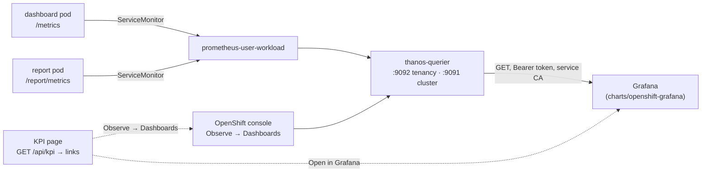

# DESIGN — the Grafana and Observe integration, as implemented

How the KPI page's two doors out (#157) were made real on 2026-09-19: the console's **Observe →
Dashboards** door, auto-discovered; and the **Open in Grafana** door, backed by a Grafana the new
`charts/openshift-grafana` chart deploys (#162) and the board the app chart provisions into it (#161).
Every claim below is one the session measured on the lab's CRC (OpenShift 4.22.7, grafana-operator
v5.24.0); the captures and the measurements are in `reports/2026-09-19_grafana-observe-162-161/`.

Two products, one page: the page renders whatever `GET /api/kpi` serves under `links`, and each door
appears only when its target exists — prose, not a dead button, otherwise.

---

## 1. The data path underneath both doors

Neither door is worth anything unless the KPI series exist in the cluster's monitoring stack. That
took three switches, in this order:

1. **User-workload monitoring on** — once per cluster, cluster-admin, the one prerequisite nothing in
   a chart can do for you:

   ```sh
   oc -n openshift-monitoring create configmap cluster-monitoring-config \
     --from-literal=config.yaml='enableUserWorkload: true'
   ```

   Sixty seconds later `openshift-user-workload-monitoring` runs `prometheus-user-workload-0` and
   `thanos-ruler-user-workload-0`. (The old reference machine ran no Prometheus at all, which is why
   the chart's ServiceMonitor and rules default to off under the 0.14.0 rule.)

2. **The app chart's ServiceMonitor and PrometheusRule on** — `environments/crc.yaml` sets
   `monitoring.serviceMonitor.enabled: true` and `monitoring.prometheusRule.enabled: true`. The
   user-workload Prometheus scrapes both pods' `/metrics`; the KPI module's families (#156 —
   `gsd_process_*{component}`, `gsd_volume_disk_*`, `gsd_membership_changes_total`,
   `gsd_login_attempts_total`) arrive with the labels `namespace="group-sync-dashboard"` and
   `prometheus="openshift-user-workload-monitoring/user-workload"`.

3. **Thanos serves them** — the Thanos querier in `openshift-monitoring` federates the platform and
   user-workload Prometheus instances, and it is the only thing Grafana talks to.



---

## 2. The Observe door — discovered, scoped to the pod's namespace

### 2.1 What the link is

The console's monitoring plugin renders the same Grafana-JSON dashboards the platform ships, and the
one a team wants for its own project is **Kubernetes / Compute Resources / Namespace (Workloads)**:

```text
https://<console>/monitoring/dashboards/dashboard-k8s-resources-workloads-namespace
    ?project-dropdown-value=<namespace>&namespace=<namespace>&type=ALL_OPTION_KEY
```

The parameters are the plugin's own, read from its source (openshift/monitoring-plugin, read through
the GitHub API on 2026-09-19):

| Parameter | Where the plugin reads it | Meaning |
|---|---|---|
| `project-dropdown-value` | `web/src/shared/constants/query-params.ts` — `OpenshiftProject = 'project-dropdown-value'` | the console's project selector |
| `namespace`, `type` | `web/src/features/legacy-dashboards/hooks/useLegacyDashboards.ts` — every dashboard variable is read by its name: `params.get(v.name)` | the board's own template variables |
| `ALL_OPTION_KEY` | `web/src/features/legacy-dashboards/utils/utils.ts` — `MONITORING_DASHBOARDS_VARIABLE_ALL_OPTION_KEY = 'ALL_OPTION_KEY'` | the "All" option of a variable |

The dashboard id exists on 4.22 as the ConfigMap
`openshift-config-managed/grafana-dashboard-k8s-resources-workloads-namespace`.

### 2.2 What is discovered, and how

Two values make that URL, and the pod learns both without a grant of its own:

- **The console's URL.** The console-operator publishes it in
  `openshift-config-managed/console-public` (`data.consoleURL`), and a Role in that namespace grants
  `get` on exactly that ConfigMap to `system:authenticated`. Measured: the dashboard's own
  ServiceAccount token reads `https://console-openshift-console.apps-crc.testing`.
  `ClusterClient.console_url` (`local-development/gsd/kube.py`) GETs
  `/api/v1/namespaces/openshift-config-managed/configmaps/console-public` with the cluster's token
  and returns the URL only when it is `https://…`; a 403, a 404 or any other shape is `None`.
- **The pod's namespace.** `own_namespace()` in `local-development/gsd/api.py` reads the
  ServiceAccount mount `/var/run/secrets/kubernetes.io/serviceaccount/namespace` — the same source
  the leader election uses — or `GSD_NAMESPACE` outside a cluster.

Discovery runs on the **host cluster's poll thread** once a cycle (`Poller._discover_console` in
`local-development/gsd/poller.py`): only the host's thread asks, because the console the reader is
signed in to is the host's, and a failure is logged and leaves the last value — it never stops the
poll. The value lands in `RuntimeSignals` (`note_console_url` / `console_url`).

### 2.3 Precedence and the page

`kpi_links()` in `local-development/gsd/api.py` builds `links` for `GET /api/kpi`:

- `console` = the chart's `console.url` when set, else the discovered URL — an operator-set value wins
  (a console the cluster does not publish, or a different one);
- `observe` = the URL above, the namespace URL-quoted;
- when there is no console at all, no `observe` key — the page renders the prose "the console's URL
  could not be discovered; set `console.url` to link them" instead of a button.

The page (`local-development/gsd/static/index.html`, `kpiPage`) uses `links.observe` verbatim,
escaped into the `href`, `target="_blank" rel="noopener"`. The chart's `console.url` defaults to
`""`, documented as "discovered".

---

## 3. The Grafana door — a chart that deploys Grafana, a CR that hands it the board

### 3.1 Why a second chart (`charts/openshift-grafana`)

Issue #162's reasoning, kept: install order is a hard constraint (a `GrafanaDashboard` CR cannot be
applied before the operator's CRD exists), installing an operator needs OLM rights the app install
should not demand, Grafana's cadence and blast radius differ from the app's, and any team should be
able to reuse it. The chart names no application; its tests grep for `group-sync` and `gsd` in every
template, value and note.

### 3.2 The one-shot install

Helm resolves every kind in a release before it applies anything, so a `Grafana` CR in the manifest
is refused while the operator's CRDs are absent — hooks cannot fix that, they run after resolution.
The chart therefore ships copies of the four CRDs it and its consumers use under `crds/`
(`Grafana`, `GrafanaDatasource`, `GrafanaDashboard`, `GrafanaFolder`, harvested from the installed
v5.24.0 with `oc get crd … -o json`, status and managed fields stripped). Helm installs `crds/` first,
only when absent, never upgrades or deletes them; OLM then installs the operator and adopts the
identical CRDs. Measured on CRC: after the hand-installed operator was deleted (CRDs left behind), a
single `helm install grafana charts/openshift-grafana -n group-sync-dashboard` brought the operator's
CSV to `Succeeded` and the instance up.

What renders, in Argo sync-wave order:

| Wave | Object | Note |
|---|---|---|
| −2 | `OperatorGroup` (own namespace) | only with `operator.install`; `operatorGroup.create: false` reuses the namespace's existing one — OLM allows one per namespace |
| −1 | `Subscription` grafana-operator, channel `v5`, `community-operators` | v5.24.0's CSV supports OwnNamespace, SingleNamespace, MultiNamespace and AllNamespaces (measured on the CSV), so both install shapes are real |
| 0 | ServiceAccount `<name>-thanos` + its token Secret, the `view` RoleBinding, the service-CA ConfigMap, the NetworkPolicy, the wait Job's Role/RoleBinding | release-managed, no hooks |
| 1 | `Grafana` CR | labelled `app.kubernetes.io/instance: <release>` (+ `grafana.labels`) — what every selector uses |
| 2 | `GrafanaDatasource` | selects the instance by those labels |
| 3 | the wait Job | `helm.sh/hook: post-install,post-upgrade` and an Argo `Sync` hook |

The **wait Job** (`templates/41-wait-job.yaml`) blocks `helm install` until the CSV is `Succeeded`
(when installed here), the Grafana CR reports `status.stage/stageStatus = complete/success` with a
ready replica, and the datasource's `DatasourceSynchronized` condition is `True` — each failure names
what to inspect. Its first run on CRC failed on `remaining: unbound variable` (a `${remaining}` where
`$(remaining)` was meant, under `set -u`); fixed the same hour.

### 3.3 Thanos access, least privilege

| `thanos.scope` | Port | Sees | Authorised by | Objects outside the namespace |
|---|---|---|---|---|
| `namespace` (default) | 9092, the tenancy port | this namespace's metrics: every query carries `namespace=<release namespace>` (`jsonData.customQueryParameters`) | a `view` RoleBinding **in the release's namespace**, created by the chart | none |
| `cluster` | 9091 | every metric on the cluster | a RoleBinding to `cluster-monitoring-view` **in `openshift-monitoring`** | that RoleBinding — privileged, for a central observability Grafana |

**Measured, and not in the reference architecture:** the tenancy port's kube-rbac-proxy authorises the
HTTP method as the RBAC verb. Grafana's default POSTed query came back
`403 Forbidden (user=system:serviceaccount:group-sync-dashboard:grafana-openshift-grafana-thanos,
verb=create, resource=pods)`. The datasource sets `httpMethod: GET`, which is `get pods`, which
`view` grants; after that the datasource's health reads `Successfully queried the Prometheus API`.

### 3.4 TLS and the token — nothing in a manifest

The datasource verifies thanos-querier's certificate against OpenShift's **service CA**, injected by
the service-ca operator into a ConfigMap the chart annotates
(`service.beta.openshift.io/inject-cabundle: "true"` → key `service-ca.crt`), read through
`valuesFrom` into `secureJsonData.tlsCACert` with `tlsAuthWithCACert: true`. The bearer token comes
the same way from the ServiceAccount's token Secret into `secureJsonData.httpHeaderValue1`. The
rendered YAML carries neither, a rotation of either reaches Grafana with no render, and
`tlsSkipVerify` — the reference architecture's shortcut — appears nowhere (a test asserts it).

### 3.5 The instance, the Route, the NetworkPolicy

- Admin credentials: the operator's generated `<name>-admin-credentials` unless
  `grafana.admin.existingSecret` names a Secret from your secret manager.
- `grafana.route.enabled: false` by default; `true` renders an edge-terminated Route the router names
  (or `grafana.route.host`).
- The NetworkPolicy admits the router namespace (`policy-group.network.openshift.io/ingress`) and
  same-namespace pods on 3000, nothing else. **Measured:** the operator labels the instance's pods
  `app: <Grafana name>`, not `<name>-grafana` — the first draft's selector matched no pod and
  protected nothing, silently. With the right selector, `curl` from the dashboard pod (same
  namespace) answers 200 and a probe pod in `openshift-gitops` times out.

### 3.6 The board, provisioned (#161)

The app chart already shipped the board as a ConfigMap (`grafana_dashboard: "1"`, for sidecars). With
`monitoring.grafanaDashboard.cr.enabled: true` it also renders the `GrafanaDashboard` CR that hands
that ConfigMap to grafana-operator v5 (`configMapRef`), selecting the instance by
`monitoring.grafanaDashboard.cr.instanceSelector` and binding the board's `DS_PROMETHEUS` input
through `spec.datasources[]`. Off by default, because the CR's kind must exist before the release
renders — it is for a cluster where the operator (this chart, or a platform team's) already runs.

**Measured, the second thing the reference architecture did not say:** the operator substitutes
`datasources[].datasourceName` **verbatim** into the panels' `datasource.uid` fields. Bound by the
datasource's *name* ("OpenShift Thanos"), the board rendered in the browser — Grafana's frontend
falls back to a name lookup — but its query API answered `Data source not found`. The binding
therefore takes the **uid** (`openshift-thanos`, the chart's `thanos.datasource.uid`), and both
charts' READMEs say so.

The board itself gained six KPI panels for #156's families, each with the KPI page's amber mark:
memory and CPU as a share of the cgroup limit (80 %), the throttled share of scheduler periods (1 %),
membership changes and login attempts per hour, the volume's disk (80 %). The process panels
aggregate `max by (component)` so a pod restart does not multiply the series — the first render
showed three "dashboard" lines from three pod generations in thirty minutes.

### 3.7 The door

`grafana.url` (and `grafana.dashboardUid`) in the app chart's values make the door: the page builds
`<url>/d/<uid>?from=now-30d&to=now`, plus `&var-cluster=<id>` when exactly one cluster is served.
Both values are validated at load as an absolute `http(s)://` base without query or fragment — a
`javascript:` value reached the href in review and now refuses the render. On the lab,
`environments/crc.yaml` points at the `openshift-grafana` release's Route.

---

## 4. What CRC runs now, and how to verify it

```sh
export KUBECONFIG=~/.kube/crc.kubeconfig
oc get pods -n openshift-user-workload-monitoring                 # prometheus-user-workload-0, thanos-ruler-user-workload-0
oc get servicemonitor,prometheusrule -n group-sync-dashboard       # two ServiceMonitors, one PrometheusRule
oc get grafana,grafanadatasource,grafanadashboard -n group-sync-dashboard
oc extract secret/grafana-openshift-grafana-admin-credentials -n group-sync-dashboard --to=-
H=$(oc get route grafana-openshift-grafana-route -n group-sync-dashboard -o jsonpath='{.spec.host}')
curl -sk -u "admin:<password>" "https://$H/api/datasources/uid/openshift-thanos/health"   # {"status":"OK"}
oc exec -n group-sync-dashboard deploy/group-sync-dashboard -c dashboard -- \
  curl -s -H "X-Forwarded-User: kubeadmin" http://127.0.0.1:8080/api/kpi | jq .links
```

The last command answers the four links the page renders — `grafana`, `grafana_dashboard_uid`,
`console` (discovered) and `observe` (the namespace-workloads board).

## 5. Records

- The chart's consumer README: `charts/openshift-grafana/README.md` — install order, the one
  prerequisite, attaching a dashboard, every value.
- The review of PR #209 (Grok, Codex, OB3): `docs/REVIEW_grafana_and_observe.md`, when it lands.
- Evidence: `reports/2026-09-19_grafana-observe-162-161/README.md`.
- The reference architecture this improves on: `docs/openshift-grafana-reference-architecture.md`
  on the `grafana-integration` branch (not merged; two of its recipes — `tlsSkipVerify: true` and a
  POSTing datasource — are the ones measurement overturned).
