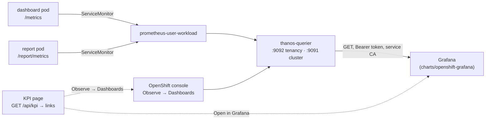

# DESIGN — the Grafana and Observe integration, as implemented

How the KPI page's two doors out (#157) were made real on 2026-09-19: the console's **Observe →
Dashboards** door, auto-discovered; and the **Open in Grafana** door, backed by a Grafana the new
`charts/openshift-grafana` chart deploys (#162) and the board the app chart provisions into it (#161).
Every claim below is one the session measured on the lab's CRC (OpenShift 4.22.7, grafana-operator
v5.24.0); the captures and the measurements are in `reports/2026-09-19_grafana-observe-162-161/`.

Two products, one page: the page renders whatever `GET /api/kpi` serves under `links`, and each door
appears only when its target exists — prose, not a dead button, otherwise.

---

## 1. The data path underneath both doors

Neither door is worth anything unless the KPI series exist in the cluster's monitoring stack. That
took three switches, in this order:

1. **User-workload monitoring on** — once per cluster, cluster-admin, the one prerequisite nothing in
   a chart can do for you:

   ```sh
   oc -n openshift-monitoring create configmap cluster-monitoring-config \
     --from-literal=config.yaml='enableUserWorkload: true'
   ```

   Sixty seconds later `openshift-user-workload-monitoring` runs `prometheus-user-workload-0` and
   `thanos-ruler-user-workload-0`. (The old reference machine ran no Prometheus at all, which is why
   the chart's ServiceMonitor and rules default to off under the 0.14.0 rule.)

2. **The app chart's ServiceMonitor and PrometheusRule on** — `environments/crc.yaml` sets
   `monitoring.serviceMonitor.enabled: true` and `monitoring.prometheusRule.enabled: true`. The
   user-workload Prometheus scrapes both pods' `/metrics`; the KPI module's families (#156 —
   `gsd_process_*{component}`, `gsd_volume_disk_*`, `gsd_membership_changes_total`,
   `gsd_login_attempts_total`) arrive with the labels `namespace="group-sync-dashboard"` and
   `prometheus="openshift-user-workload-monitoring/user-workload"`.

3. **Thanos serves them** — the Thanos querier in `openshift-monitoring` federates the platform and
   user-workload Prometheus instances, and it is the only thing Grafana talks to.



---

## 2. The Observe door — discovered, scoped to the pod's namespace

### 2.1 What the link is

The console's monitoring plugin renders the same Grafana-JSON dashboards the platform ships, and the
one a team wants for its own project is **Kubernetes / Compute Resources / Namespace (Workloads)**:

```text
https://<console>/dev-monitoring/ns/<namespace>?dashboard=dashboard-k8s-resources-workloads-namespace
```

The namespace rides in the **path**, and that is the whole point. The first form shipped on
2026-09-19 was the admin-perspective URL with the namespace in the query string
(`/monitoring/dashboards/<board>?project-dropdown-value=<ns>&namespace=<ns>&type=ALL_OPTION_KEY`),
taken from the plugin's own parameter names; it rendered for kubeadmin and showed a non-admin
"Project: All Projects" with every graph on *Bad Request*. Measured the same day (Playwright, the
CRC `developer` user given `view` on the namespace, the last-used project primed to All Projects):

| door URL | project selector | the graphs' `query_range` sent | result |
|---|---|---|---|
| `/monitoring/dashboards/<board>?project-dropdown-value=<ns>&…` | All Projects | `namespace=` absent | "An error occurred" (400) |
| `/dev-monitoring/ns/<ns>?dashboard=<board>` | the namespace | `namespace=<ns>` | renders |

Why, from the 4.22 sources (read through the GitHub API, `release-4.22`):

- A reader without cluster-wide `get prometheuses/api` (every non-admin) is routed through the
  console's **tenancy** proxy (`/api/prometheus-tenancy/…`), whose prom-label-proxy refuses a request
  with no `namespace=` parameter: `The "namespace" query parameter must be provided` (measured on
  thanos-querier :9092 with a lab user's token — that is the "Bad Request"). A cluster-admin goes
  through `/api/prometheus/…`, where the parameter is never needed — which is why kubeadmin never
  saw the failure.
- The plugin's **graph panels take that parameter from the console's project selector**, not from the
  board's `$namespace` variable: `web/src/components/query-browser.tsx` — `const [namespace] =
  useActiveNamespace();` → `buildPrometheusUrl({… namespace …})`. `project-dropdown-value` only
  templates the PromQL (`useLegacyDashboards.ts`, `getAllVariables`); it never moves the selector.
- The selector is set from a `/ns/<name>` **path** segment or, failing that, the user's last-used
  project (`console-app/src/providers/detect-context/namespace.ts` — `getNamespace(pathname)`, then
  `getValueForNamespace(preferred, last, …)`; the stored value is `console.lastNamespace` in the
  user's `openshift-console-user-settings` ConfigMap). kubeadmin's happened to be
  `group-sync-dashboard`, which made the first form *look* right on this lab.
- `/dev-monitoring/ns/<ns>?dashboard=<board>` is the plugin's namespaced route
  (`MpCmoLegacyDevDashboardsPage`; `QueryParams.Dashboard`): the console sets the selector from the
  path, then the plugin redirects to the admin form with `project-dropdown-value`, `namespace` and
  `type=ALL_OPTION_KEY` filled — the final URL is the one above, with the selector already right.

The dashboard id exists on 4.22 as the ConfigMap
`openshift-config-managed/dashboard-k8s-resources-workloads-namespace` (labelled
`console.openshift.io/odc-dashboard: "true"`, which is what keeps it in the list once a project is
selected). A reader still needs `get pods` in the namespace — the tenancy proxy's SubjectAccessReview —
so a `view` grant on the release namespace is the precondition for anyone who is not cluster-admin.

### 2.2 What is discovered, and how

Two values make that URL, and the pod learns both without a grant of its own:

- **The console's URL.** The console-operator publishes it in
  `openshift-config-managed/console-public` (`data.consoleURL`), and a Role in that namespace grants
  `get` on exactly that ConfigMap to `system:authenticated`. Measured: the dashboard's own
  ServiceAccount token reads `https://console-openshift-console.apps-crc.testing`.
  `ClusterClient.console_url` (`local-development/gsd/kube.py`) GETs
  `/api/v1/namespaces/openshift-config-managed/configmaps/console-public` with the cluster's token
  and returns the URL only when it is `https://…`; a 403, a 404 or any other shape is `None`.
- **The pod's namespace.** `own_namespace()` in `local-development/gsd/api.py` reads the
  ServiceAccount mount `/var/run/secrets/kubernetes.io/serviceaccount/namespace` — the same source
  the leader election uses — or `GSD_NAMESPACE` outside a cluster.

Discovery runs on the **host cluster's poll thread** once a cycle (`Poller._discover_console` in
`local-development/gsd/poller.py`): only the host's thread asks, because the console the reader is
signed in to is the host's, and a failure is logged and leaves the last value — it never stops the
poll. The value lands in `RuntimeSignals` (`note_console_url` / `console_url`).

### 2.3 Precedence and the page

`kpi_links()` in `local-development/gsd/api.py` builds `links` for `GET /api/kpi`:

- `console` = the chart's `console.url` when set, else the discovered URL — an operator-set value wins
  (a console the cluster does not publish, or a different one);
- `observe` = the URL above, the namespace URL-quoted;
- when there is no console at all, no `observe` key — the page renders the prose "the console's URL
  could not be discovered; set `console.url` to link them" instead of a button.

The page (`local-development/gsd/static/index.html`, `kpiPage`) uses `links.observe` verbatim,
escaped into the `href`, `target="_blank" rel="noopener"`. The chart's `console.url` defaults to
`""`, documented as "discovered".

---

## 3. The Grafana door — a chart that deploys Grafana, a CR that hands it the board

### 3.1 Why a second chart (`charts/openshift-grafana`)

Issue #162's reasoning, kept: install order is a hard constraint (a `GrafanaDashboard` CR cannot be
applied before the operator's CRD exists), installing an operator needs OLM rights the app install
should not demand, Grafana's cadence and blast radius differ from the app's, and any team should be
able to reuse it. The chart names no application; its tests grep for `group-sync` and `gsd` in every
template, value and note.

### 3.2 The one-shot install

Helm resolves every kind in a release before it applies anything, so a `Grafana` CR in the manifest
is refused while the operator's CRDs are absent — hooks cannot fix that, they run after resolution.
The chart therefore ships copies of the four CRDs it and its consumers use under `crds/`
(`Grafana`, `GrafanaDatasource`, `GrafanaDashboard`, `GrafanaFolder`, harvested from the installed
v5.24.0 with `oc get crd … -o json`, status and managed fields stripped). Helm installs `crds/` first,
only when absent, never upgrades or deletes them; OLM then installs the operator and adopts the
identical CRDs. Measured on CRC: after the hand-installed operator was deleted (CRDs left behind), a
single `helm install grafana charts/openshift-grafana -n group-sync-dashboard` brought the operator's
CSV to `Succeeded` and the instance up.

What renders, in Argo sync-wave order:

| Wave | Object | Note |
|---|---|---|
| −2 | `OperatorGroup` (own namespace) | only with `operator.install`; `operatorGroup.create: false` reuses the namespace's existing one — OLM allows one per namespace |
| −1 | `Subscription` grafana-operator, channel `v5`, `community-operators` | v5.24.0's CSV supports OwnNamespace, SingleNamespace, MultiNamespace and AllNamespaces (measured on the CSV), so both install shapes are real |
| 0 | ServiceAccount `<name>-thanos` + its token Secret, the `view` RoleBinding, the service-CA ConfigMap, the NetworkPolicy, the wait Job's Role/RoleBinding | release-managed, no hooks |
| 1 | `Grafana` CR | labelled `app.kubernetes.io/instance: <release>` (+ `grafana.labels`) — what every selector uses |
| 2 | `GrafanaDatasource` | selects the instance by those labels |
| 3 | the wait Job | `helm.sh/hook: post-install,post-upgrade` and an Argo `Sync` hook |

The **wait Job** (`templates/41-wait-job.yaml`) blocks `helm install` until the CSV is `Succeeded`
(when installed here), the Grafana CR reports `status.stage/stageStatus = complete/success` with a
ready replica, and the datasource's `DatasourceSynchronized` condition is `True` — each failure names
what to inspect. Its first run on CRC failed on `remaining: unbound variable` (a `${remaining}` where
`$(remaining)` was meant, under `set -u`); fixed the same hour.

### 3.3 Thanos access, least privilege

| `thanos.scope` | Port | Sees | Authorised by | Objects outside the namespace |
|---|---|---|---|---|
| `namespace` (default) | 9092, the tenancy port | this namespace's metrics: every query carries `namespace=<release namespace>` (`jsonData.customQueryParameters`) | a `view` RoleBinding **in the release's namespace**, created by the chart | none |
| `cluster` | 9091 | every metric on the cluster | a RoleBinding to `cluster-monitoring-view` **in `openshift-monitoring`** | that RoleBinding — privileged, for a central observability Grafana |

**Measured, and not in the reference architecture:** the tenancy port's kube-rbac-proxy authorises the
HTTP method as the RBAC verb. Grafana's default POSTed query came back
`403 Forbidden (user=system:serviceaccount:group-sync-dashboard:grafana-openshift-grafana-thanos,
verb=create, resource=pods)`. The datasource sets `httpMethod: GET`, which is `get pods`, which
`view` grants; after that the datasource's health reads `Successfully queried the Prometheus API`.

### 3.4 TLS and the token — nothing in a manifest

The datasource verifies thanos-querier's certificate against OpenShift's **service CA**, injected by
the service-ca operator into a ConfigMap the chart annotates
(`service.beta.openshift.io/inject-cabundle: "true"` → key `service-ca.crt`), read through
`valuesFrom` into `secureJsonData.tlsCACert` with `tlsAuthWithCACert: true`. The bearer token comes
the same way from the ServiceAccount's token Secret into `secureJsonData.httpHeaderValue1`. The
rendered YAML carries neither, a rotation of either reaches Grafana with no render, and
`tlsSkipVerify` — the reference architecture's shortcut — appears nowhere (a test asserts it).

### 3.5 The login: the cluster's, not Grafana's

The first cut used Grafana's own login form with the operator-generated admin — the reference
architecture's "add OAuth later" order — and the operator's first click from the KPI page landed on a
username/password prompt. That is not the end state. `grafana.auth.mode: openshift` (the default)
puts an `openshift/oauth-proxy` sidecar in front of Grafana, the same proxy the dashboard runs:

- the operator's ServiceAccount is the OAuth client (`serviceaccounts.openshift.io/oauth-redirectreference.primary`
  names the chart's Route, so the redirect follows whatever host the router assigns);
- `-openshift-sar` gates entry — by default "may `get` the release's namespace", the `view` role and
  above, the same people the namespace-scoped datasource serves (`grafana.auth.oauthProxy.sar` for
  another review);
- the proxy hands Grafana the identity as `X-Forwarded-User`; Grafana's `auth.proxy` trusts that
  header **from 127.0.0.1 only** (`whitelist`) — the sidecar shares the pod's network namespace, so
  a same-namespace caller on Grafana's own port cannot forge a user (**measured:** a forged header
  from the dashboard pod on 3000 answers 401);
- the login form is off; the identity matching `GF_SECURITY_ADMIN_USER` (`grafana.auth.adminUser`,
  `kubeadmin` on the lab) is Grafana's server admin, everyone else signs up as Viewer.

**Measured, the click path:** the KPI page's door → the proxy's 302 to `oauth-openshift` → the
cluster login → OpenShift's one-time consent for the service-account client (every SA OAuth client
prompts once per user) → Grafana as `login: kubeadmin, isGrafanaAdmin: true`; the second visit goes
straight in.

Two Services exist on purpose: the operator's `<name>-service:3000` (Grafana itself, where the
operator provisions through the admin credentials — the `<name>-admin` Secret the chart generates
once and keeps) and the chart's `<name>-proxy:8443` (the service CA signs its certificate; the
reencrypt Route fronts it). In-cluster, both names resolve; only the proxy is a door. The
NetworkPolicy admits the router namespace on 8443 only, and same-namespace pods (the operator; a
platform operator elsewhere goes under `networkPolicy.extraFrom`) on 3000 and 8443. **Measured:** the
operator labels the pods `app: <Grafana name>`, not `<name>-grafana` — the first draft's selector
matched no pod and protected nothing; with the right one a probe from `openshift-gitops` times out.

`grafana.auth.mode: grafana` keeps Grafana's own form and the operator's edge Route, for a cluster
without the OpenShift OAuth server.

### 3.5b After a restart

Grafana's database is an `emptyDir` unless `grafana.persistence.enabled` is on, so the pod restart
the auth change caused emptied it, and the datasource and the board were gone until the operator's
next resync re-applied them — **measured:** ten minutes of "No data" at the operator's default. The
chart sets `thanos.datasource.resyncPeriod: 2m` and the app chart's CR `resyncPeriod: 2m`; a
consumer's own `GrafanaDashboard` should do the same, or turn persistence on where a StorageClass
exists.

### 3.6 The board, provisioned (#161)

The app chart already shipped the board as a ConfigMap (`grafana_dashboard: "1"`, for sidecars). With
`monitoring.grafanaDashboard.cr.enabled: true` it also renders the `GrafanaDashboard` CR that hands
that ConfigMap to grafana-operator v5 (`configMapRef`), selecting the instance by
`monitoring.grafanaDashboard.cr.instanceSelector` and binding the board's `DS_PROMETHEUS` input
through `spec.datasources[]`. Off by default, because the CR's kind must exist before the release
renders — it is for a cluster where the operator (this chart, or a platform team's) already runs.

**Measured, the second thing the reference architecture did not say:** the operator substitutes
`datasources[].datasourceName` **verbatim** into the panels' `datasource.uid` fields. Bound by the
datasource's *name* ("OpenShift Thanos"), the board rendered in the browser — Grafana's frontend
falls back to a name lookup — but its query API answered `Data source not found`. The binding
therefore takes the **uid** (`openshift-thanos`, the chart's `thanos.datasource.uid`), and both
charts' READMEs say so.

The board itself gained six KPI panels for #156's families, each with the KPI page's amber mark:
memory and CPU as a share of the cgroup limit (80 %), the throttled share of scheduler periods (1 %),
membership changes and login attempts per hour, the volume's disk (80 %). The process panels
aggregate `max by (component)` so a pod restart does not multiply the series — the first render
showed three "dashboard" lines from three pod generations in thirty minutes.

### 3.7 The door

The page builds `<url>/d/<uid>?from=now-30d&to=now`, plus `&var-cluster=<id>` when exactly one
cluster is served. `grafana.dashboardUid` defaults to the shipped board's uid (it is fixed in the
JSON); `grafana.url` set wins and is validated at load as an absolute `http(s)://` base without
query or fragment — a `javascript:` value reached the href in review and now refuses the render.

`grafana.url` **empty means discovered** (chart 0.36.0, the operator's "it just works" of
2026-09-19), the same shape as the console: the host cluster's poll thread lists the Routes carrying
`grafana.discovery.selector` in the pod's own namespace (`ClusterClient.route_url`;
`Poller._discover_doors`) and takes the one match — `https://<host>` when the Route has TLS, None
for zero or several matches (two Grafanas in a namespace is a choice for `grafana.url`) or a Route
without TLS. The default selector is the `openshift-grafana` chart's own `app.kubernetes.io/name`
label, which its Route carries in both login modes (the operator-created edge Route gets the chart's
labels through the CR's `route.metadata`). The read needs `get`/`list` on routes in that one
namespace — a namespaced Role and RoleBinding the app chart renders while discovery is on, nothing
cluster-scoped. As with the console, a failed rediscovery never blanks a door already known, and a
door with neither a URL nor a discovery renders prose. The lab sets nothing: `environments/crc.yaml`
inherits the defaults and the door resolves to the `grafana` release's Route.

---

### 3.8 The one prerequisite, surfaced by the chart

User-workload monitoring cannot be a chart's to switch on (`cluster-monitoring-config` is the
platform's, shared with every other monitoring setting), so the chart *verifies and reports* it
(the operator, 2026-09-19: "it is just a job that runs to verify, and then the OpenShift engineers
enable it"): the wait Job resolves `prometheus-user-workload.openshift-user-workload-monitoring.svc`,
a Service the cluster-monitoring-operator creates only when user-workload monitoring is on — a DNS
lookup, so no grant in any namespace (measured from a namespace-only pod on 4.22: resolves when on;
`getent` exits 2 for a Service that does not exist) — and logs ON, or OFF with the exact command.
It never fails the install on it, and nothing needs re-installing once the engineers run the
command. The first draft read `cluster-monitoring-config` through an opt-in Role in
`openshift-monitoring` and failed the install when the key was absent; that made the check a
cluster-admin step in a namespace the consumer does not own, and a failed install for a
prerequisite the consumer cannot fix. A `lookup` in NOTES could not do this either: Helm turns a
forbidden lookup into a failed install (measured on CRC as a namespace-only identity).

## 4. What CRC runs now, and how to verify it

```sh
export KUBECONFIG=~/.kube/crc.kubeconfig
oc get pods -n openshift-user-workload-monitoring                 # prometheus-user-workload-0, thanos-ruler-user-workload-0
oc get servicemonitor,prometheusrule -n group-sync-dashboard       # two ServiceMonitors, one PrometheusRule
oc get grafana,grafanadatasource,grafanadashboard -n group-sync-dashboard
oc extract secret/grafana-openshift-grafana-admin -n group-sync-dashboard --to=-      # Grafana's own admin (kubeadmin)
H=$(oc get route grafana-openshift-grafana -n group-sync-dashboard -o jsonpath='{.spec.host}')
curl -sk -o /dev/null -w '%{http_code} %{redirect_url}\n' "https://$H/"                 # 302 to oauth-openshift
oc exec -n group-sync-dashboard deploy/group-sync-dashboard -c dashboard -- \
  curl -s -u "kubeadmin:<password>" http://grafana-openshift-grafana-service:3000/api/datasources/uid/openshift-thanos/health   # {"status":"OK"}
oc exec -n group-sync-dashboard deploy/group-sync-dashboard -c dashboard -- \
  curl -s -H "X-Forwarded-User: kubeadmin" http://127.0.0.1:8080/api/kpi | jq .links
```

The last command answers the four links the page renders — `grafana` (discovered from the Route),
`grafana_dashboard_uid`, `console` (discovered) and `observe` (the namespace-workloads board). The
gate's verdict on the prerequisite:
`oc logs -n group-sync-dashboard job/grafana-openshift-grafana-wait | grep 'user-workload monitoring'`.

## 5. Records

- The chart's consumer README: `charts/openshift-grafana/README.md` — install order, the one
  prerequisite, attaching a dashboard, every value.
- The review of PR #209 (Grok, Codex, OB3): `docs/REVIEW_grafana_and_observe.md`, when it lands.
- Evidence: `reports/2026-09-19_grafana-observe-162-161/README.md`.
- The reference architecture this improves on: `docs/openshift-grafana-reference-architecture.md`
  on the `grafana-integration` branch (not merged; two of its recipes — `tlsSkipVerify: true` and a
  POSTing datasource — are the ones measurement overturned).
