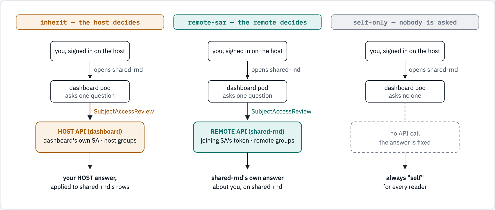
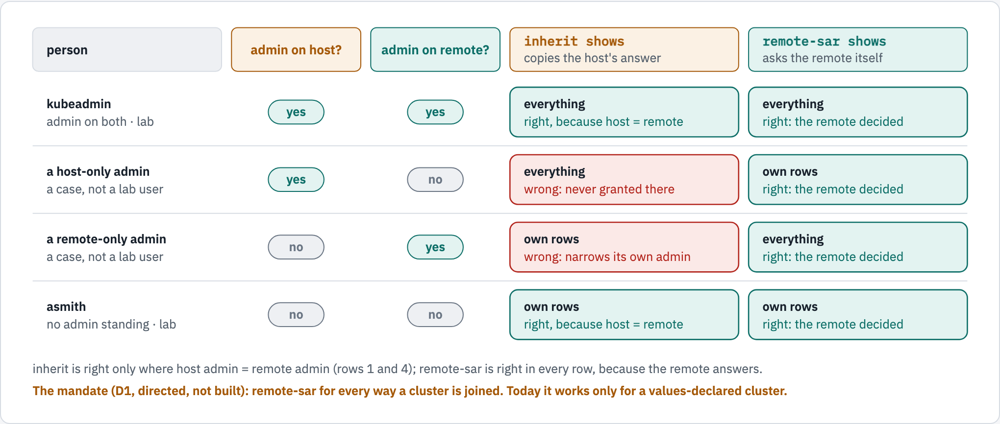
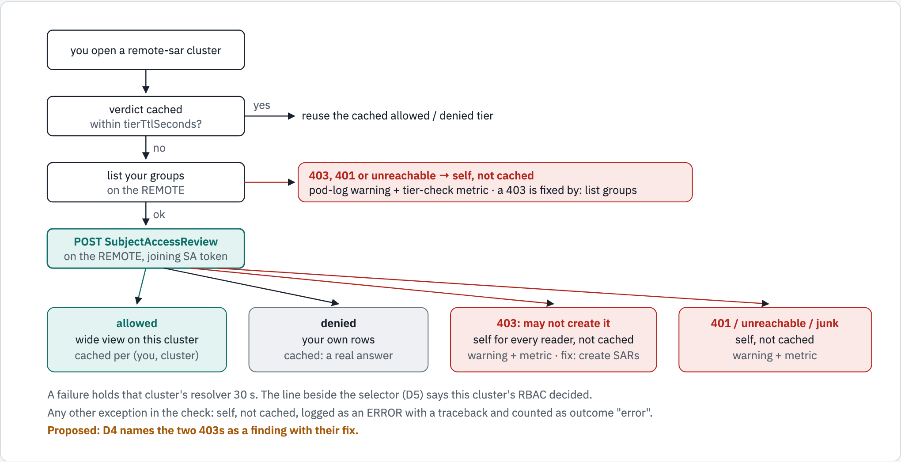

# Remote cluster access — who decides a reader's tier, and who may join a cluster

| | |
|---|---|
| Status | **Proposed.** D1, D2 (`remote-sar` + `same-as-host` is the standard for every way a cluster is joined), D3, D6 and D7 directed by the operator; D4's fail-closed fallback directed, its named finding recommended; D5 and D8 open (§8) |
| Date | 2026-09-23 |
| Scope | the per-cluster visibility policy (`clusters[].visibility`, `clusters[].identity`) for every cluster the dashboard polls that is not its host, and who may join or rejoin such a cluster |
| Relates to | `docs/ACCESS_CONTROL.md` §11 (per-cluster authorisation, D2 of the 2026-09 programme), #307, #322 (the cluster-admin tier), #316 (Rejoin) |

## 1. Summary

On the lab, `kubeadmin` is `cluster-admin` and sees everything on the host cluster, `dashboard`. On `shared-rnd` and
`shared-qa` it sees only its own rows. Both remotes resolve to `visibility=self-only identity=none` (the pod's
`cluster-resolved` log line), so **nobody is asked** whether a reader may see them wide.

The remote could answer that question itself. The token the dashboard already holds for `shared-rnd` can ask
`shared-rnd`'s own RBAC, and it answers correctly for every reader measured (§5). The dashboard cannot use that
answer for these two clusters because `remote-sar`, the policy that asks the remote, is refused for any cluster
declared through a Secret, and both are (§6).

This document defines the two policies that grant a wide view on a remote, `inherit` and `remote-sar`, shows how
each decides, and records the decisions that make `remote-sar` + `same-as-host` the standard for every way a cluster
is joined. It also defines who may join or rejoin a cluster (§7): D7 (directed, not built) makes a person's join or
Rejoin a cluster-admin action checked on the host. Today the tab's writes ask only `create secrets` in the dashboard's
namespace, and the automatic lookup is started by configuration, not by a person.

## 2. The three answers the dashboard can give today

The sign-in is always on the host, through the oauth-proxy. What differs is **which API is asked** whether the
reader may see a cluster's data wide. The question is the one `visibility.adminSar` asks: *may this person
`list clusterrolebindings`?*

<!-- markdownlint-disable MD033 -->
<picture>
  <source media="(prefers-color-scheme: dark)" srcset="diagrams/remote-cluster-access/policies-who-decides.dark.png">
  <source media="(prefers-color-scheme: light)" srcset="diagrams/remote-cluster-access/policies-who-decides.light.png">
  
</picture>
<!-- markdownlint-enable MD033 -->

*Figure 1. Only the middle row differs. `inherit` never contacts the remote about the reader; `remote-sar` asks the
remote with the credential the dashboard already holds for it; `self-only` asks nobody. The example is `shared-rnd`;
today it can take only the first or the third column, because a Secret-declared cluster is refused `remote-sar` (§6).*

```text
            inherit                     remote-sar                    self-only
   reader signed in on the host   reader signed in on the host   reader signed in on the host
              |                            |                             |
        dashboard pod                dashboard pod                 dashboard pod
              | SubjectAccessReview        | SubjectAccessReview         :  (no call)
              v                            v                             v
   HOST API — dashboard's own SA  REMOTE API — joining SA token   the answer is fixed
   host groups                    the reader's remote groups
              |                            |                             |
   the host answer, applied to    the remote's own answer        "self" for every reader
   the remote's rows              about the reader
```

## 3. The two models, defined

| | `inherit` + `same-as-host` | `remote-sar` + `same-as-host` |
|---|---|---|
| **Who is asked** | the **host** API, by the dashboard's own ServiceAccount | the **remote** API, with the token that joined the cluster |
| **The question** | may the reader `list clusterrolebindings` on the host? | may the reader's username `list clusterrolebindings` on that remote? |
| **The reader's groups** | read from the host's Group objects | read from the remote's Group objects (`local-development/gsd/kube.py#ClusterClient.fetch_groups_of_user`) |
| **identity** | **no effect on the tier.** Under `inherit` identity is not consulted: the host's decision applies, and self rows are keyed by the host username. `same-as-host` only documents intent. | **load-bearing.** The host username is sent to the remote, so it must name the same person there. The chart refuses `remote-sar` without `same-as-host`. |
| **Remote RBAC needed** | none; a read-only token is enough | the joining ServiceAccount needs `create subjectaccessreviews` and `list groups` on the remote |
| **Correct when** | one team administers the fleet, so host admin = remote admin by policy | the reader's OpenShift username names them on the remote too: readers are matched by `User` name (D3) |
| **Risk** | a host admin sees a remote's bindings and people wide with no standing on that remote: a policy decision, made per cluster | the match is by username alone (D3): the remote's RBAC for that name decides |

<!-- markdownlint-disable MD033 -->
<picture>
  <source media="(prefers-color-scheme: dark)" srcset="diagrams/remote-cluster-access/inherit-vs-remote-sar-outcomes.dark.png">
  <source media="(prefers-color-scheme: light)" srcset="diagrams/remote-cluster-access/inherit-vs-remote-sar-outcomes.light.png">
  
</picture>
<!-- markdownlint-enable MD033 -->

*Figure 2. What each policy shows on a remote cluster. "Admin" means passing the wide-tier question, `list
clusterrolebindings`, on that cluster. kubeadmin and asmith are measured on the lab (§5); the two middle rows are
cases that follow from the rule in `viewer_scope`: `inherit` applies the host's decided tier, `remote-sar` the
remote's own review. The wrong rows are why `remote-sar` is the standard (D1, D2).*

| Person | Admin on host? | Admin on remote? | What `inherit` shows on the remote | What `remote-sar` shows |
|---|---|---|---|---|
| kubeadmin | yes | yes | everything | everything |
| a host-only admin | yes | no | everything (**wrong**: never granted there) | own rows |
| a remote-only admin | no | yes | own rows (**wrong**: narrows the remote's own admin) | everything |
| asmith | no | no | own rows | own rows |

`self-only` (nobody is wide) and `hidden` (polled, never served) are unchanged by this document.

## 4. How `remote-sar` decides

<!-- markdownlint-disable MD033 -->
<picture>
  <source media="(prefers-color-scheme: dark)" srcset="diagrams/remote-cluster-access/remote-sar-decision-flow.dark.png">
  <source media="(prefers-color-scheme: light)" srcset="diagrams/remote-cluster-access/remote-sar-decision-flow.light.png">
  
</picture>
<!-- markdownlint-enable MD033 -->

*Figure 3. Today every path except "allowed" narrows, which is the fail-closed direction. Allowed and denied are
cached; failures are not. A failure at either remote call reaches only the pod log and the tier-check metric, and
the reader sees the same generic narrowed view for every one. Today this flow runs only for a values-declared
`remote-sar` cluster (§6). Naming the failure (D4) and saying which rule decided (D5) are proposals (§8).*

```text
 reader opens a remote-sar cluster
   -> verdict cached within visibility.tierTtlSeconds?  -- yes --> reuse it
   -> no: list the reader's groups on the REMOTE
        403 / 401 / unreachable  -> self, not cached; WARNING + tier-check metric  (a 403's fix: list groups)
   -> POST SubjectAccessReview on the REMOTE, with the joining ServiceAccount's token
        allowed                  -> wide view on this cluster     (cached per reader and cluster)
        denied                   -> the reader's own rows         (cached: a real answer)
        403 (may not create)     -> self for every reader, not cached; WARNING + metric  (the fix: create SARs)
        401 / unreachable / junk -> self, not cached; WARNING + metric
   any other exception           -> self, not cached; ERROR with a traceback + metric outcome "error"
```

Both remote calls sit in one `except ClusterError` in `local-development/gsd/kube.py#TierResolver`. Every fresh check
records its outcome on the tier-check metric: `allowed`, `denied`, or the failure (`forbidden` for a 403,
`auth_failed` for a 401, `unreachable` for a transport failure or an unparseable answer). Only a failure also logs a
WARNING ("failing closed to the self view for this request"), and a failure is not cached. Any other exception answers
self the same way, logged as an ERROR with its traceback and counted as `error`.
`GroupSyncDashboardVisibilityChecksFailing` alerts when failing outcomes persist
(`charts/group-sync-dashboard/templates/monitoring.yaml#GroupSyncDashboardVisibilityChecksFailing`). Nothing on the
page names the cause.

| Outcome | Reader sees | Cached | What the page says today | Proposed |
|---|---|---|---|---|
| allowed | the wide view on this cluster | yes, per (reader, cluster) | the scope pill reads *Full view — you are seeing everything*; the selector adds no suffix and no self banner shows | D5: *this cluster says you may see everything* |
| denied | own rows | yes: a real answer | the scope pill reads *Your view — &lt;user&gt;*, the cluster selector appends " — your view", and the five views that carry a self banner (groups, users, access, logins, grants: `SCOPE_BANNER` in `local-development/gsd/static/index.html`) show their generic one | D5: *this cluster says: your own rows* |
| 403 listing the reader's groups | own rows, for every reader | no | the same generic text as denied | D4: a finding naming the fix, grant `list groups`; D5: *this cluster cannot check access* |
| 403 creating the review | own rows, for every reader | no | the same generic text | D4: a finding naming the fix, grant `create subjectaccessreviews`; D5: the same sentence |
| 401 at either call: the joining token is invalid or expired | own rows, for every reader | no | the same generic text | D5: *this cluster cannot check access* |
| unreachable, unparseable, or any other error | own rows | no | the same generic text | D5: *this cluster could not be asked just now* |

## 5. Measured on the lab, 2026-09-23

The remote's own answer, asked with the token the dashboard holds for `shared-rnd` (a `SubjectAccessReview` for
`list clusterrolebindings`, naming the user and the user's groups on that cluster):

| Reader | Answer | Why |
|---|---|---|
| `kubeadmin` | **allowed** | ClusterRoleBinding `kubeadmin` → `cluster-admin` |
| `jane.smith` | **allowed** | the auditor-tier binding (`group-sync-dashboard-ra-…`, #312) |
| `asmith` | denied | no admin or auditor standing |
| `tmp-contractor-9931` | denied | no admin or auditor standing |

What the joining ServiceAccounts may do on the remote (`oc auth can-i … --as=system:serviceaccount:…`):

| Joining ServiceAccount | create subjectaccessreviews | list groups | get users | list clusterrolebindings |
|---|---|---|---|---|
| `group-sync-dashboard-cluster-poller` (`shared-rnd`) | yes | yes | yes | yes |
| `shared-qa-poller` (`shared-qa`) | yes | yes | yes | yes |

Both are bound to the ClusterRole `group-sync-dashboard-cluster-poller`, which carries those verbs.

What the fleet account and two controls may do on the remote (`oc auth can-i … --as=<user>`):

| Check | fleet account `ocp-oauth-bind-serviceid` | `asmith` | a user that does not exist |
|---|---|---|---|
| `get` the token Secret `group-sync-dashboard-cluster-poller-token` in `group-sync-operator` | yes | no | no |
| `list secrets` in `group-sync-operator` | no | no | no |
| `create subjectaccessreviews` | yes | no | no |
| `create selfsubjectaccessreviews` | yes | yes | yes |
| `list groups` | yes | no | no |
| `update clusterrolebindings` | **no** | no | no |

The fleet account holds two bindings, both labelled `helm.sh/chart: group-sync-operator-helm-0.14.0` on the lab (that
chart's source is not in this repository): the Role
`group-sync-dashboard-cluster-poller-token-reader` in `group-sync-operator` (`get` on the token Secret by name,
`create serviceaccounts/token` and `get serviceaccounts` on the poller ServiceAccount), and the ClusterRoleBinding
`group-sync-dashboard-cluster-poller`, which binds it to the poller's ClusterRole beside the poller ServiceAccount.
The Role lets it either read the token the Secret already holds (`get`, which #284 ships) or mint a fresh one
with the TokenRequest API (`create serviceaccounts/token`, #238, not built). Either way the dashboard keeps a poller
ServiceAccount token, and that token's rights on the remote are the ClusterRole `group-sync-dashboard-cluster-poller`.
The fleet account is not cluster admin. `create selfsubjectaccessreviews` comes from `system:basic-user`, which every authenticated
user holds. The built-in `admin` ClusterRole grants every verb on `secrets`, `get`, `list` and `watch` among them, and
nothing on `clusterrolebindings`, so a namespace admin of `group-sync-operator` can read the token Secret.

**Why the lab's behaviour changed.** Until 2026-09-22, `shared-rnd` was a hand-made Secret with `visibility: inherit`
and `identity: same-as-host` (`docs/examples/cluster-secret-shared-rnd.redacted.yaml`). #307 replaced it with a
`saTokenLookup` stanza in `environments/crc.yaml` that deliberately declares no visibility, so it took the default,
`self-only`, and the host's cluster-admin stopped being wide there. `shared-qa` is a hand-made Secret from #310's
testing with no visibility key, so it has always been `self-only`.

The commands, re-runnable against the lab with a kubeadmin session:

```sh
# the policy each cluster resolved to
oc logs -n group-sync-dashboard deploy/group-sync-dashboard -c dashboard | grep cluster-resolved

# what the joining ServiceAccount may do on the remote
oc auth can-i create subjectaccessreviews.authorization.k8s.io \
  --as=system:serviceaccount:group-sync-operator:group-sync-dashboard-cluster-poller

# what the fleet account, and any user, may do on the remote
oc auth can-i get secret/group-sync-dashboard-cluster-poller-token -n group-sync-operator --as=ocp-oauth-bind-serviceid
oc auth can-i update clusterrolebindings.rbac.authorization.k8s.io --as=ocp-oauth-bind-serviceid
oc auth can-i create selfsubjectaccessreviews.authorization.k8s.io --as=asmith

# the remote's own answer, with the token the dashboard holds (read from gsd-cluster-shared-rnd);
# for a reader who is wide through a Group, such as jane.smith, put that Group's name in "groups"
curl -sk -H "Authorization: Bearer $TOKEN" -H 'Content-Type: application/json' -X POST \
  https://api.crc.testing:6443/apis/authorization.k8s.io/v1/subjectaccessreviews \
  -d '{"apiVersion":"authorization.k8s.io/v1","kind":"SubjectAccessReview","spec":{"user":"kubeadmin","groups":[],
       "resourceAttributes":{"group":"rbac.authorization.k8s.io","resource":"clusterrolebindings","verb":"list"}}}'
```

## 6. What is supported today

| How the cluster was joined | `inherit` | `remote-sar` | `self-only` | `hidden` |
|---|---|---|---|---|
| a `clusters:` stanza in values, with a bearer token | yes | yes | yes | yes |
| a Secret created on the Cluster Configurations tab | yes | **refused** | yes | yes |
| `saTokenLookup` (the lookup writes a Secret) | yes | **refused** | yes | yes |

**Why refused.** The per-cluster `TierResolver` that asks a remote (`local-development/gsd/kube.py#TierResolver`) is
built **once, at start-up**, from the values list (`local-development/gsd/api.py#remote_resolvers`). A cluster
declared through a Secret appears **at runtime**, from discovery, and never gets one. The Secret parser refuses
`remote-sar` for that reason (`local-development/gsd/clusterconfig/parser.py`: *"remote-sar for a Secret-sourced
cluster is S2"*), and the chart refuses it beside `saTokenLookup`
(`charts/group-sync-dashboard/templates/_helpers.tpl`: *"remote-sar is not yet accepted from a Secret (SPEC_S1)"*).
The way clusters are now joined is exactly the way that cannot ask the remote.

## 7. How a cluster is joined, and who may join it

Joining is one exchange: log in to the remote with a username and password, read the poller ServiceAccount's token
from `group-sync-operator`, revoke the login, and store the token on the host as `gsd-cluster-<name>`. From then on
that token authenticates every call the dashboard makes to the remote, with the rights of the ClusterRole
`group-sync-dashboard-cluster-poller`. Today only the
fleet account performs it, automatically, when a stanza or a Secret declares `saTokenLookup: true`
(`local-development/gsd/fleetlookup.py#lookup`, run by the poller on the leader, or on the sole replica when election
is off; more replicas without election are refused). Rejoin (#316) is the same
exchange started by a person with their own credentials. It is not built: the tab accepts only a pasted bearer token
and refuses a username and password with `oauth-exchange-not-built`
(`local-development/gsd/clusterconfig/writer.py#validate`).

<!-- markdownlint-disable MD033 -->
<picture>
  <source media="(prefers-color-scheme: dark)" srcset="diagrams/remote-cluster-access/joining-a-cluster.dark.png">
  <source media="(prefers-color-scheme: light)" srcset="diagrams/remote-cluster-access/joining-a-cluster.light.png">
  
</picture>
<!-- markdownlint-enable MD033 -->

*Figure 4. Both ways in converge on the same remote steps. Step 3 reads the token the Secret already holds (#284);
minting a fresh one with the TokenRequest API, which the same Role allows, is #238. The fleet account is configuration, not a person, and is
not cluster admin (§5). A person's Rejoin would be gated twice: on the host before the password exists (D7), and on
the remote once it does (D8). Dashed boxes are proposed and not built.*

```text
 HOST    saTokenLookup: true (a values stanza or a Secret), automatic
           -> clusterConfig.secrets.writes.enabled off -> refused (fleet-write-disabled), no password read
           -> the leader, or the sole replica, reads the fleet password (one host Secret, get by name)
           -> the credential gate: a password this target already refused is not sent again
 HOST    Rejoin (#316, not built), a person on the tab
           -> clusterAdminSar on the host (D7): update clusterrolebindings?  no -> no Rejoin control
           -> the person's own username and password, typed now, never stored
 REMOTE  1 log in as that account: discovery -> /oauth/authorize (basic auth) -> 302 with a token
             refused once the password is on the wire -> terminal, not retried
 REMOTE  2 (D8, proposed, Rejoin only) SelfSubjectAccessReview: update clusterrolebindings?
             no -> refuse and revoke; the fleet account skips this step
 REMOTE  3 GET group-sync-operator/group-sync-dashboard-cluster-poller-token, by name
             absent, wrong type, wrong owner annotation, invalidated or empty -> a named finding
 REMOTE  4 revoke the login's own token: tried once on every path; a failed revoke is logged, not fatal
 HOST    5 write gsd-cluster-<name> as the dashboard's ServiceAccount (the write switch was checked first)
 HOST    6 joined: the poller's token authenticates every later call, with the rights of the ClusterRole
             group-sync-dashboard-cluster-poller; once D1 lands, under remote-sar the same token asks
             the remote about each reader (Figure 3)
```

**Why a person's gate starts on the host.** On a first join the dashboard holds no credential on that cluster, so
before a password is presented the only RBAC it can ask about the person is the host's: `clusterAdminSar`, `update
clusterrolebindings` (D7, #322). A Rejoin may still hold a working poller token, and once D1 lands that token could
ask the remote about the person's host username (§4). It would still say nothing about the credential just typed; that
is D8's check, made with the new login's own token. Rejoin exists for a token that has stopped working (#316), so the
host's answer is the one that is always available.

Row by row:

| Action | Who may start it today | After D7 (#322) | Asked where | Credential that crosses |
|---|---|---|---|---|
| Declare `saTokenLookup` | whoever writes the release's values, or a labelled Secret in its namespace (GitOps) | unchanged | nobody: it is configuration | none |
| The lookup itself (the join) | the poller, automatically: the leader, or the sole replica without election (more replicas without election are refused) | unchanged | the remote, as the fleet account | the fleet password; once refused, not re-sent to that target by this process (`local-development/gsd/fleetlookup.py#CredentialGate`) |
| Add a cluster on the tab | `clusterConfigManageSar`: `create secrets` in the dashboard's namespace, which a namespace admin passes | `clusterAdminSar`: `update clusterrolebindings` on the host | the host | a pasted bearer token |
| Rotate, delete, test | the same namespace-level check | `clusterAdminSar` | the host | a pasted token, or none |
| Rejoin (#316) | not built | `clusterAdminSar`, then D8 on the remote | the host, then the remote | the person's own username and password, once, never stored |
| See a joined remote wide | the cluster's policy (`self-only` on both lab remotes) | `remote-sar` + `same-as-host`, the standard (D2) | the remote, with the poller's token | none: the token is already held |

## 8. Decisions

| | Decision | Options | Status |
|---|---|---|---|
| **D1** | Support `remote-sar` for every way a cluster is joined | build the remote resolver when discovery finds the cluster, rebuild it when the Secret's credential changes, drop it when the cluster is retired; accept `remote-sar` from a Secret and from a `saTokenLookup` stanza | **Directed** by the operator: *"we need to have both supported and clearly defined"*, and the mandate of 2026-09-23: *"this is what I want: remote-sar for whatever method the cluster was joined"* |
| **D2** | The default for a newly joined remote | `self-only` (today) or `remote-sar` | **Directed**: `remote-sar` + `same-as-host` is the standard. The operator: *"we should be looking up user's permission on the remote host to determine their access … unless the service account that joined the remote cluster doesn't have the right permissions"*, and *"I agree with your recommendation to build out remote-sar + same-as-host as our standard"* |
| **D3** | What "the same person" means under `remote-sar` | the reader's OpenShift username, the `User` object's name | **Directed**: every reader is matched by that name, with no identity-provider distinction. The operator: *"this is all OpenShift and everyone appears as a user … just focus on the users that you see in OpenShift users."* It is what `remote-sar` already does for a values-declared cluster (the review names the host username, and the groups are read from the remote's Group objects), so it needs no code. |
| **D4** | When the joining ServiceAccount may not ask | silent self, or self with a named finding | **Directed**: fall back to self (fail closed). Its named finding is recommended, not built: on the Cluster Configurations tab and under the cluster selector, with the grant that fixes it (`list groups` or `create subjectaccessreviews`) |
| **D5** | Say which rule decided the reader's view of a cluster | one line under the cluster selector: *the host decides* · *this cluster says you may see everything* · *this cluster says: your own rows* · *this cluster cannot check access* · *this cluster is self-only* | **Open**, recommended. The missing reason is why the lab's narrowing looked like a defect. |
| **D6** | The lab until D1 ships | `inherit` + `same-as-host` on `shared-rnd` now, or `self-only` until D1 lands and `remote-sar` after | **Directed**: no `inherit` stopgap. `inherit` would copy the host's answer to the remote rather than ask it, which is the model the mandate replaces (D1). `shared-rnd` and `shared-qa` stay `self-only` until D1 ships, then take `remote-sar` + `same-as-host`. |
| **D7** | Who may join or rejoin a cluster with a username and password | the host's `clusterAdminSar` (`update clusterrolebindings`, #322), or today's `create secrets` in the dashboard's namespace | **Directed**: cluster admin on the host. The operator: *"This is a strictly cluster admin role. We can only check for who has cluster admin on dashboard … because we cannot determine or infer if a user is a cluster admin on a remote cluster if the cluster is not joined."* |
| **D8** | Confirm a Rejoin credential on the remote | none; or one `SelfSubjectAccessReview` with the login's own token (`update clusterrolebindings`, #322's cluster-admin question), refusing and revoking on no | **Open**, recommended for Rejoin only. It enforces D7's rule with the remote's own RBAC once a credential exists and needs no new grant (`system:basic-user`). The login's token is `user:full` (`docs/DESIGN_session_and_signout.md`), so the review answers with the person's own RBAC and groups, with no group lookup. It refuses a namespace admin of `group-sync-operator`, whom the `admin` role lets read the token Secret (§5). Like #322's, the question is a threshold: `cluster-admin` passes it, and so would any other role that grants the verb. The fleet account skips it. |

## 9. Consequences of the directed decisions

- **Code (D1, D2):** a `TierResolver` per `remote-sar` cluster owned by the discovery registry instead of built once
  in `create_app`; keyed by cluster and rebuilt when the cluster's credential or trust changes; the parser and the
  chart stop refusing `remote-sar` for Secret-declared clusters. The parser, once it accepts `remote-sar`, must
  refuse it without `identity: same-as-host`, as `local-development/gsd/config.py#load_settings` already does for
  values: `viewer_scope` keys self rows by the host username. A finding code for D4's two 403s.
- **Default:** a new remote with no `visibility` resolves to `remote-sar` with `identity: same-as-host`, matching
  every reader by OpenShift username (D3).
- **Join and Rejoin (D7, D8):** the tab's writes move from `clusterConfigManageSar` to `clusterAdminSar` (#322).
  Rejoin (#316) is gated the same way, and with D8 it asks one `SelfSubjectAccessReview` on the remote with the
  login's token before reading the token Secret, revoking the login on a refusal.
- **RBAC:** none added by this chart. The joining ServiceAccount on each remote needs `create subjectaccessreviews`
  and `list groups`; the ClusterRole the operator chart already binds to it carries both (§5). A remote that lacks
  them degrades to D4's self, never to a wider view. D8 needs nothing: `system:basic-user` already grants
  `create selfsubjectaccessreviews`.
- **Tests:** a Secret-declared `remote-sar` cluster asks the remote; a credential change rebuilds its resolver; each
  403 yields self and the finding; an `inherit` cluster never contacts the remote about the reader; the parser
  refuses `remote-sar` without `same-as-host`; a namespace admin (`create secrets` in the dashboard's namespace, no
  `update clusterrolebindings`) is refused the tab's writes; with D8, a Rejoin credential that may not `update
  clusterrolebindings` on the remote is refused and its login revoked before any Secret is read.

## 10. How this composes with the cluster-admin tier (#322)

Passing `clusterAdminSar` will grant every tier **the host decides**, and per-cluster policies still apply (the
operator, 2026-09-23; #322 is directed and not built). Under this design: on `inherit` clusters a host cluster-admin is wide; on `remote-sar` clusters the
remote's own answer about the reader stands, because being admin on the host is not proof on another cluster; on
`self-only` and `hidden` clusters nothing changes. #322's Rejoin row is D7: the host will decide who may start one,
and D8, if accepted, lets the remote refuse a credential that does not pass the same question there.

The name `clusterAdminSar` in this document is #322's: `update clusterrolebindings` on the host.
`docs/specs/SPEC_T1_tier_model.md` used the same name for the Cluster Configurations tab's two namespace-level checks
(`get` and `create secrets`); #322 replaces that meaning.

## Diagram sources

The figures are rendered from `docs/diagrams/remote-cluster-access/source.html`, one hand-authored page (inline
SVG, light and dark palettes), at twice the pixel density: open it in a browser, set `data-theme` on the root element
to `light` or `dark`, and screenshot each `.fig-scroll` element. The pictures depict the decision points in §2, §3,
§4 and §7, and the text twins beside them carry the same points. If one of those sections changes, change the picture,
its twin and the page together. The images use `<picture>` with `prefers-color-scheme`, the form GitHub documents
for theme-aware images
([GitHub's guide](https://github.blog/developer-skills/github/how-to-make-your-images-in-markdown-on-github-adjust-for-dark-mode-and-light-mode/));
the older `#gh-dark-mode-only` fragments are deprecated
([community discussion 16910](https://github.com/orgs/community/discussions/16910)).
