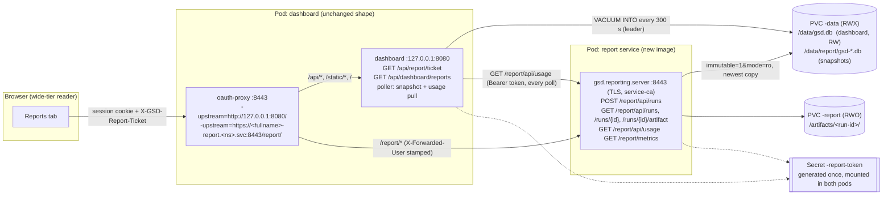
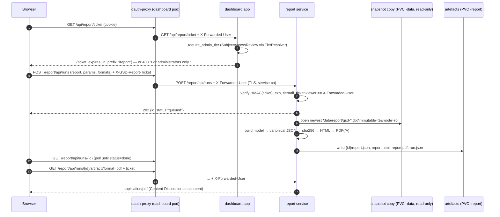
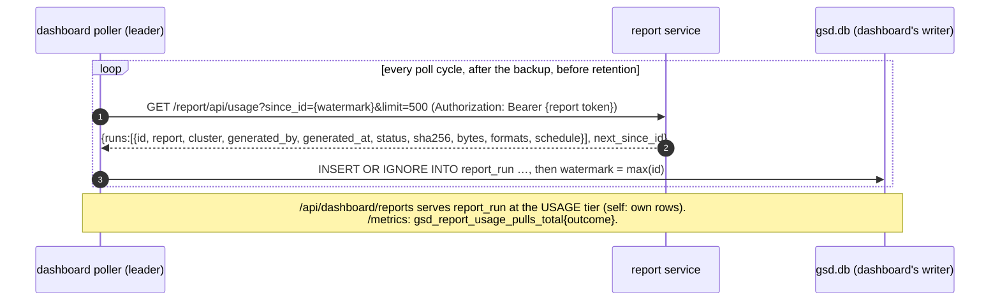

# The report service — design record

**Status: built (application 0.18.0, chart 0.20.0).** The maintained record of how reporting works:
the architecture, the data path, the authentication between the two pods, the PDF library and the
report catalogue — sections 3 to 7 of `docs/specs/SPEC_C3_reporting_microservice.md`, kept here so
the design survives the spec's retirement. Where the two differ, the code is the source and this file
is corrected. The implementation cites:

- the service's HTTP API — `local-development/gsd/reporting/server.py#build_report_app`
- the read-only view over a `VACUUM INTO` copy — `local-development/gsd/reporting/snapshot.py#Snapshot`
- the ticket the dashboard mints and the service verifies — `local-development/gsd/reporting/ticket.py#verify`
- the dashboard's copy for the report pod — `local-development/gsd/store.py#Store.snapshot`
- the dashboard's pull of the service's usage — `local-development/gsd/poller.py#Poller._pull_report_usage`
- the report pod — `charts/group-sync-dashboard/templates/report-deployment.yaml`
- the image — `local-development/Containerfile.report`

Two things the spec body says that implementation changed, both recorded in the spec's orchestrator's
notes: fpdf2 2.8.8 requires an explicit heading style on a table with a heading row (the renderer sets
the bold face), and the npm package that carries DejaVu Sans 2.37 is versioned `2.37.3`.

---

## 3. Architecture

Two pods, one chart, one source tree, two images.



### 3.1 The sequence: trigger → dashboard → report service → data → artefact → download



### 3.2 The usage pull



### 3.3 Two images, one version

The reporting image is built from **this repository's `local-development/` context** by `Containerfile.report`, installs the same `gsd` wheel plus the `report` extra (`fpdf2`, `Jinja2`, `MarkupSafe`), and is tagged `<appVersion>-<sha>` by the same `build-and-push-external.sh` (`local-development/build-and-push-external.sh#IMAGE_NAME`, `#CONTAINERFILE` — both already environment-selectable). The chart resolves it through `gsd.reportImage`, which falls back to `.Chart.AppVersion` exactly as `gsd.image` does (`templates/_helpers.tpl#gsd.image`). CI builds it in the same `publish` job as the dashboard's image, right after it, under the same release decision, records its digest as a second pair of job outputs, and catalogues, signs and attests it through the same two jobs as a second matrix leg — one definition for both images (`DESIGN_supply_chain.md#D10`); its SBOM is the workflow artifact `sbom-report-<sha>`.

**Why not "its own version number".** The report service opens the dashboard's SQLite snapshot and reads its schema; the classification SQL it reuses is the dashboard's (`local-development/gsd/store.py#_FINDING_CASE`). Two independently numbered images would let the schema and the reader drift by a release; one appVersion for both makes "the reporting image that matches this dashboard" a tautology, and `tests/test_chart_versions.py#test_appversion_equals_the_application_version` already holds appVersion to `pyproject.toml`. The image **is** independently versioned in the sense the issue meant — its own name, its own tag stream, its own scan gate, its own proof — but the number is the application's. The header's "reporting image 0.1.0" is therefore superseded; recorded as operator question 1.

## 4. Data path decision — how the report service gets the dashboard's data

The operator's expectation, verbatim: *"I am also sure that reporting service will also have access to the database running in the group sync pod."* It does — to a **consistent, read-only copy of it, refreshed on the binding cadence**, which is the only form of "access to the database" that is safe across two pods. The ranking:

| Rank | Option | Verdict | Why |
|---|---|---|---|
| **1 — chosen** | **(b) a read-only snapshot copy** the dashboard produces with `VACUUM INTO` into `/data/report/` on its own PVC, which the report pod mounts **read-only** (`persistentVolumeClaim.readOnly: true` and `volumeMounts[].readOnly: true`, the B1 pattern) and opens with `file:…?immutable=1&mode=ro` | safe, complete, cheap | `VACUUM INTO` "takes a read transaction for the duration, so the output is a single consistent snapshot even while the poller writes" (`local-development/gsd/store.py#Store.backup`). Measured here on the store's own code: the output's `PRAGMA journal_mode` is `delete` (no `-wal`/`-shm` side files can ever be wanted), `immutable=1` opens it read-only with no locking, and a write is refused ("attempt to write a readonly database"). The copy is a **whole database**, so every table the catalogue needs is there, including the history tables no API endpoint exposes in report shape. One reader, one file, zero coordination with the writer. |
| 2 | (a) the report service reads through the dashboard's HTTP API over the cluster Service, forwarding the proxy identity | rejected | The dashboard's Service targets the **proxy** (`templates/service.yaml#targetPort: oauth-proxy`) and the app binds loopback (`templates/deployment.yaml#Bind loopback only`), so a machine caller must pass the proxy — a bearer token through `-openshift-delegate-urls` (`apiTokenAccess`, default off) for an identity that then needs a tier of its own. Every read would also be recorded as dashboard use (`local-development/gsd/api.py#record_dashboard_use`), the reports would be bounded by the API's paging and shapes (R3), and eleven reports would mean dozens of round trips per run each taking its own snapshot — the torn-read problem `@consistent` exists to prevent (`local-development/gsd/api.py#consistent`), reintroduced across HTTP. |
| 3 | (c) mount the ReadWriteMany data volume and open the **live** `gsd.db` read-only | **unsafe — rejected** | WAL "requires all processes to share a small amount of memory and processes on separate host machines obviously cannot share memory with each other" (SQLite WAL documentation, Sources). A read-only WAL open needs write access to the `-shm` file or the directory (SQLite `c3ref/open`), so "read-only" is not read-only; and `immutable=1` on a file that changes "might return incorrect query results and/or SQLITE_CORRUPT errors" (SQLite URI documentation). The default volume is RWX, which in practice is often NFS, where the dashboard itself already refuses WAL (`local-development/gsd/store.py#Store.__init__`, `charts/group-sync-dashboard/values.yaml#WATCH THE FILESYSTEM UNDERNEATH`). Two hosts on one live SQLite file is the exact case the chart's `Recreate` guard exists to prevent (`templates/deployment.yaml#strategy=RollingUpdate is unsafe`). |

### 4.1 Freshness, stated on every report

A snapshot is as fresh as its stamp. The leader writes one every `reporting.snapshot.intervalSeconds` (default 300, the binding cadence — `values.yaml#bindingIntervalSeconds` is 300 too) from `Poller._after_poll` (`local-development/gsd/poller.py#Poller._after_poll`), **after** `maintain()` and beside `_maybe_backup()`, on the poll thread — the same rule `backup()` states: "Called from the POLL THREAD only … doing that from a request handler would put a user's page behind it." Worst-case staleness is one poll interval plus one snapshot interval, and every report prints `data as of <snapshot stamp> (taken N minutes before generation; bindings refresh every 300 s)` in its provenance block, beside the last poll's outcome.

Reporting requires a `ReadWriteMany` data claim (the chart default). `ReadWriteOncePod` cannot be mounted by both pods; `ReadWriteOnce` is refused as well, because a required pod affinity from the report pod to the dashboard only holds at the moment the report pod is scheduled and is ignored afterwards — replacing only the dashboard can separate the pods across nodes and make the single-node attachment fail, which would block the dashboard's own rollout. The guard in `gsd.reportingGuards` refuses both modes by name.

### 4.2 Why not the existing backups

`config.backup` copies land in `/data/backup` every six hours (`values.yaml#backupIntervalHours`). Six hours is a backup cadence, not a report cadence; a reader who clicks "Generate" after fixing a binding expects the fix on the page. The snapshot is a second use of the same mechanism with its own directory and cadence, and it does **not** participate in the retention gate (`local-development/gsd/poller.py#Poller._prune_history` reads `_backup_state`, which only `_maybe_backup` sets).

### 4.3 Cost, measured

On this machine, against the store's real code (`Store.backup`), a synthetic database of 61.4 MB — 200,000 `group_member`, 300,000 `membership_event`, 20,000 `rbac_group_binding` rows, ten to a hundred times the reference cluster — took **3.2 s** to `VACUUM INTO` a 58.2 MB copy. At reference scale the file is a few megabytes and the copy is tens of milliseconds. The copy holds a read transaction, not the write lock, so the poller's next write is not blocked; readers of the live database are unaffected (WAL). Two copies are kept (`reporting.snapshot.keep`), so the report service always has a complete file to open while the next is being written; the writer writes `gsd-<stamp>.db` under a `.tmp` name and renames it, so the report service never sees a partial file.

### 4.4 Schema compatibility

The report service refuses a snapshot whose `PRAGMA user_version` is **greater** than the migration level it was built with (`gsd.store._MIGRATIONS`), with a 503 naming both numbers — a newer dashboard beside an older report image. One appVersion for both images (§3.3) makes that a transient of a rolling upgrade, never a steady state. An **older** snapshot (fewer migrations) is read; the catalogue's queries only touch tables that exist since migration 8 or earlier, plus the two migration-11 tables, whose absence a report treats as "not read" (the same tri-state the coverage note already speaks).

## 5. Auth between the pods, and how the wide tier is enforced end to end

### 5.1 The route into the report service is the oauth-proxy, not a second Route

The report service is **not exposed** by a Route of its own. The dashboard pod's oauth-proxy gains a second upstream: `-upstream=https://<fullname>-report.<namespace>.svc:8443/report/` beside the existing `-upstream=http://127.0.0.1:8080` (`templates/deployment.yaml#-upstream=http://127.0.0.1:8080`). openshift/oauth-proxy routes between upstreams by the **path** the upstream URL carries — measured in its source: `path := u.Path`, then `u.Path = ""` before the reverse proxy is built, `serveMux.Handle(path, proxy)`, and the request path is passed through unchanged (`req.URL.Opaque = req.RequestURI`). Every request the proxy forwards, to either upstream, carries `X-Forwarded-User` / `X-Forwarded-Email` set by the proxy after authentication (`setRequestHeader(req, "X-Forwarded-User", session.User)`). So `/report/**` reaches the report service **only** through the same login the dashboard has, with the same identity header, and the report service's `/report/healthz`, `/report/readyz` and `/report/metrics` are **not** in `oauthProxy.skipAuthRegex` — they are reached on the report Service directly by kubelet and Prometheus, never through the Route.

Routing is Go's `http.ServeMux` (`oauthproxy.go`: `path := u.Path`, `u.Path = ""`, `serveMux.Handle(path, proxy)`): the longer registered pattern wins, so `/report/` beats `/`, and the request path is forwarded unchanged (`req.URL.Opaque = req.RequestURI`), which is why the report process listens on `/report/**`. A request for `/report` **without** the trailing slash is proxied to neither upstream: ServeMux answers `301` to `/report/`, and that follow-up reaches the report Service. `-pass-user-headers` defaults to true in the shipped image (`local-development/gsd/activity.py` records the measurement; the chart passes no flag), so every authenticated upstream request carries `X-Forwarded-User`. `-upstream-ca` is defined on oauth-proxy `master` and is **not** assumed present on `ose-oauth-proxy-rhel9:v4.15` until §12's pre-flight prints the flag; if it does not, `reporting.tls.enabled=false` runs plain HTTP on the pod network behind the NetworkPolicy, ticket unchanged (operator question 6).

### 5.2 The tier is decided once, by the dashboard, and carried as a ticket

The report service holds **no cluster credential and no RBAC** (its ServiceAccount has no bindings and `automountServiceAccountToken: false`), so it cannot run the SubjectAccessReview that decides the tier (`local-development/gsd/kube.py#TierResolver`) and must not duplicate it. The dashboard decides, the way it already does for `/bindings/findings`, and hands the decision to the browser as a **ticket**:

- `GET /api/report/ticket` on the dashboard calls `require_admin_tier(request)` (`local-development/gsd/api.py#require_admin_tier`) — a refusal is the same 403 with the same "For administrators only." sentence — and returns `{"ticket": "<payload>.<sig>", "expires_in": 300, "prefix": "/report"}`. The payload is `{"v":1,"viewer":<X-Forwarded-User>,"tier":"all","iat":…,"exp":…,"nonce":…}`; the signature is HMAC-SHA256 with the shared token (§5.3). It is a **pure function of the request** — no store write, no file, no network beyond the tier check `whoami` already makes — so it satisfies "a GET on the dashboard must not cause work" in the sense R6 protects: nothing is created, rendered or stored.
- The browser sends the ticket on **every** request to `/report/**` as `X-GSD-Report-Ticket`. The report service verifies the signature, the expiry, `tier == "all"`, and that `viewer` **equals the proxy-stamped `X-Forwarded-User` on that request** — the ticket is bound to the session identity it was minted for, so a captured ticket is useless from another session. A custom header also makes the `POST` a non-simple request, which is the CSRF defence.
- With `visibility.enabled=false` every authenticated reader is wide (`local-development/gsd/api.py#viewer_scope` returns `TIER_ALL` when restrictions are off), so every reader can generate — the existing semantics, stated. With the proxy off the chart refuses to render (§2).

A **self-tier reader cannot fetch a report through the internal name**: they cannot obtain a ticket (403 at `/api/report/ticket`), the report service refuses every `/report/api/*` request without a valid ticket or the service credential, and the NetworkPolicy (§5.4) means a self-tier reader's own workloads elsewhere on the cluster cannot reach the report pod's port at all.

### 5.3 The service credential

One Secret, `<fullname>-report-token`, generated once and reused across upgrades by the `lookup` pattern of `templates/oauth-secret.yaml#lookup` (a regenerated token would invalidate every outstanding ticket and the poller's pull for one restart — harmless, but the pattern exists and is used). It is mounted read-only in the dashboard container (`/etc/gsd/report/token`, to sign tickets and to authenticate the usage pull), in the report container (to verify both), and in the schedule Jobs (to trigger runs). Presented as `Authorization: Bearer <token>`, compared in constant time, it is the **service principal**: it may list runs, create runs (`generated_by` becomes `schedule:<name>` or `service`) and read `/report/api/usage`. It is never sent to a browser.

### 5.4 Transport and reach

- **TLS** (`reporting.tls.enabled`, default true): the report Service carries `service.beta.openshift.io/serving-cert-secret-name: <fullname>-report-tls`; uvicorn serves with that certificate; the proxy verifies with `-upstream-ca=/etc/gsd/service-ca/service-ca.crt`, a mount of the `openshift-service-ca.crt` ConfigMap (the same CA the ServiceMonitor uses, `templates/monitoring.yaml#openshift-service-ca.crt`), and the dashboard's usage pull verifies with the same file. `-upstream-ca` is defined in openshift/oauth-proxy's `main.go` ("paths to CA roots for the Upstream (target) Server (may be given multiple times, defaults to system trust store)") and is absent from its README; **pre-flight check** before the PR opens: `oc exec deploy/<name> -c oauth-proxy -- /usr/bin/oauth-proxy --help 2>&1 | grep upstream-ca` on the shipped `ose-oauth-proxy-rhel9:v4.15`. If the shipped binary lacks it, `reporting.tls.enabled=false` is the recorded fallback (plain HTTP on the pod network, the ticket and the NetworkPolicy unchanged) and the values comment says so.
- **NetworkPolicy** (`reporting.networkPolicy.enabled`, default true): ingress to the report pod on 8443 only from pods carrying `gsd.selectorLabels` in the release namespace (the dashboard pod, whose proxy container makes the connection), from the schedule Job pods (`app.kubernetes.io/component: report-schedule`), and — only with `monitoring.serviceMonitor.enabled` — from the namespaces in `reporting.networkPolicy.monitoringNamespaces` (default `openshift-user-workload-monitoring`, `openshift-monitoring`). Egress is not restricted (the report pod makes no outbound call; a policy on egress would be documentation, not control).
- **Identity headers**: the report service believes `X-Forwarded-User` for exactly one purpose — matching it against the ticket's `viewer`. It never grants anything on the header alone.

### 5.5 What the report service enforces, in one table

| Request | Credential required | Check |
|---|---|---|
| `GET /report/healthz`, `/report/readyz`, `/report/metrics` | none | reachable only on the report Service (NetworkPolicy); no names in metrics |
| `GET /report/api/reports` (catalogue) | ticket | signature, exp, tier=all, viewer match |
| `GET /report/api/runs`, `GET /report/api/runs/{id}`, `GET …/artifact` | ticket **or** service token | as above; the service token sees every run |
| `POST /report/api/runs` | ticket **or** service token | as above; `generated_by` = ticket viewer, or `schedule:<name>`/`service` |
| `GET /report/api/usage` | **service token only** | a viewer never reads the usage feed; the dashboard serves it at the usage tier |
| `GET /report/api/snapshot` | ticket or service token | — |

### 5.6 Scheduled runs

A `reporting.schedules[]` entry renders a CronJob on the **report image** whose one container runs `python3.14 -m gsd.reporting.trigger --report <name> --cluster <id> [--param k=v]… --wait`, posting to the report Service with the service token over TLS (CA from the same ConfigMap mount). It writes nothing but the artefact; nothing is mailed (the parked design's question A: "somewhere to put the file and someone to send it to" — the artefact store is the "somewhere"; sending is out of scope and recorded in operator question 4). The Job pod carries `app.kubernetes.io/component: report-schedule` (never `gsd.selectorLabels` — the B1 lesson at `docs/specs/SPEC_B1_offsite_backup.md#Pod labels`).

## 6. The PDF library

### 6.1 The candidates, against the hardened image

`docs/DESIGN_hardened_image.md` §3: the runtime has no shell, no `dnf`, no `rpm` binary, user 65532; the builder (`hi/python:3.14-builder`) has `dnf` against one repository, `public-hummingbird-$basearch-rpms`. **Measured on 2026-09-05** on the locally pulled `registry.access.redhat.com/hi/python:3.14-builder` (3,514 packages available):

```
$ podman run --rm registry.access.redhat.com/hi/python:3.14-builder sh -c 'dnf -q list --available pango harfbuzz fontconfig glib2 fribidi dejavu-sans-fonts liberation-sans-fonts cairo gdk-pixbuf2'
Available packages
fontconfig.x86_64 2.18.3-1.hum1 public-hummingbird-x86_64-rpms
glib2.x86_64      2.89.3-1.hum1 public-hummingbird-x86_64-rpms
harfbuzz.x86_64   14.3.1-1.hum1 public-hummingbird-x86_64-rpms
$ … dnf -q list --available "pango*" "cairo*" "*fonts*" "fribidi*" "gdk-pixbuf*" "freetype*"
(no pango, cairo, fribidi or gdk-pixbuf package; the only font packages are xorg-x11-fonts-* bitmap/Type1 sets and langpacks-fonts-* metapackages)

Re-measure on the builder image at implementation with the same command. If `pango` has appeared in the Hummingbird repository, WeasyPrint becomes buildable and the row above must be rewritten; fpdf2 stays the choice unless the re-measure also shows a wheel named in §6.1 absent for the target interpreter, in which case pin the versions `pip download 'fpdf2==2.8.8' --only-binary=:all:` actually writes.
```

| Library | Needs at runtime | On Hummingbird | PDF/A | Verdict |
|---|---|---|---|---|
| WeasyPrint ≥ 53 | Pango, GLib, HarfBuzz, Fontconfig (Cairo and GDK-PixBuf no longer required since v53 — its install docs) | **Pango is not in the repository**; GLib and HarfBuzz are; no font packages | yes (`pdf_variant`) | **cannot be built on the hardened base** without a UBI9 fallback image — the current C3's operator question 3, now answered by measurement rather than asked |
| ReportLab | none (pure Python + Pillow) | fine | via `pdfa` utilities, partial | a low-level canvas API where every table and page break is hand layout; CVE-2023-33733 (`rl_safe_eval` sandbox bypass, RCE, fixed in 3.6.13) is a historically exploited surface class in exactly the HTML-attribute path a report would use; not chosen |
| xhtml2pdf | ReportLab + html5lib | fine | via ReportLab | inherits ReportLab's surface, adds an HTML/CSS subset; not chosen |
| Typst (`typst` PyPI 0.15.0) | a Rust binary in an abi3 manylinux wheel; no system libraries | fine | **all** PDF/A levels natively (`pdf_standards=["a-2b"]`) | strong typography, but a second markup language in the repository and a ~30 MB binary for tables of names; recorded as the alternative if typographic quality ever matters more than surface |
| Headless Chromium (Playwright) | hundreds of MB, a sandbox under an arbitrary UID | not serious (parked design §4) | no | rejected |
| **fpdf2 2.8.8** | **pure Python** (`py3-none-any`) + Pillow, fontTools, defusedxml — all with cp314 manylinux2014 wheels (downloaded here: `fpdf2-2.8.8-py3-none-any.whl`, `pillow-12.2.0-cp314-…manylinux2014_x86_64.whl`, `fonttools-4.64.0-cp314-…manylinux2014_x86_64.whl`, `defusedxml-0.7.1-py2.py3-none-any.whl`) | **nothing to install with dnf**; `libz.so.1` present in the runtime; Pillow's wheel bundles its own image libraries | PDF/A-1b, 2b, 2u, 3b, 3u, 4, 4e, 4f with **enforcement** (`enforce_compliance`) | **chosen** |
| **Jinja2 3.1.6** (templates note) | **pure Python** (`py3-none-any`) + MarkupSafe 3.0.3, whose C accelerator ships as a cp314 manylinux wheel | fine — nothing from dnf, nothing compiled under `--only-binary=:all:` | n/a (HTML) | **chosen for the HTML templates**; both BSD-3-Clause; versions as on PyPI 2026-09-05 |

### 6.2 fpdf2, measured

Installed in a scratch venv on this machine (`fpdf2 2.8.8`, Python 3.13.5):

- `DocumentCompliance` members: `PDFA_1B, PDFA_2B, PDFA_2U, PDFA_3B, PDFA_3U, PDFA_4, PDFA_4E, PDFA_4F`; `FPDF.__init__(orientation, unit, format, font_cache_dir, enforce_compliance)`; `add_output_intent`, `set_xmp_metadata` exist.
- Under `PDFA_2B`, a core font is refused: `PDFAComplianceError: Usage of base fonts is now allowed for documents compliant with PDF/A-2B. Use add_font() to embed a font file` (the library's message, typo included — "now" for "not").
- Under `PDFA_2B` with an embedded TrueType regular **and bold** face (a table's heading row uses the bold style: `FPDFException: Using font 'body' with emphasis 'B' in table headings require the corresponding font style to be added using add_font()`), a three-row table renders to a `%PDF-1.7` file carrying `/OutputIntent`, `/Metadata` with XMP `<pdfaid:part>2</pdfaid:part>` / `<pdfaid:conformance>B</pdfaid:conformance>`, and `/FontFile2` (the embedded font). 32,240 bytes.
- `footer()`, `alias_nb_pages()` and `page_no()` exist for "Page X of Y".
- Encryption under a PDF/A profile is refused by the enforcement.

Independent validation of the produced file against the ISO profile (veraPDF) is a **verification step** (§13), not something the library's own enforcement replaces; the Sources note it.

### 6.3 The font

PDF/A requires embedded fonts and the base ships none. **DejaVu Sans 2.37** (regular and bold, Bitstream Vera licence — free to embed and redistribute), vendored through `vendor-assets.sh` from the npm package `dejavu-fonts-ttf` with the same publisher-integrity verification the woff2 typefaces already get (`local-development/vendor-assets.sh#WHY npm AND NOT THE CDN`). Two files, ~1.4 MB in git, committed like the Swagger bundles so the build works offline. `fontTools` reads TTF; fpdf2 does not read woff2, so the existing Space Grotesk/JetBrains Mono woff2 files cannot serve here — the HTML rendering keeps the page's typefaces, the PDF uses DejaVu, and the provenance block names the font.

### 6.4 The PDF/A question, answered

`reporting.pdf.variant` defaults to `pdf/a-2b`: the recommended archival default for new documents (Sources), and what this catalogue produces has no attachments (which would call for 3b) and no accessibility structure tree (which 2a/3a would demand and fpdf2 does not implement). `pdf/a-3b` is offered for a records system that wants the canonical `report.json` **embedded** in the PDF (fpdf2's `embed_file` is permitted under 3b; the renderer embeds it when the variant is 3b/3u), `pdf/a-4` for PDF 2.0-based archives, `""` for a plain PDF. The variant is printed in the provenance block and stored on the run record, so an auditor knows what they hold.

## 7. The report catalogue

### 7.1 What the research says an access-review programme wants

Identity-governance products (SailPoint's certification campaigns) produce **campaign** artefacts — who reviewed what, when, the decision, the exceptions — plus **status/evidence reports** listing every access item with reviewer, identity, source and outcome; compliance guidance (SOC 2, ISO 27001 A.5.18/A.9.2.5, SOX) centres on **dormant** accounts (last login), **orphaned** accounts (subjects that no longer exist), **privileged** access reviewed more often and separately, **segregation of duties**, and evidence that names reviewer, timestamps and outcomes. Kubernetes-side RBAC tooling (`rbac-tool`, `rakkess`, `kubectl who-can`, `rbac-lookup`, kubescape) reports the **subject → role → namespace** matrix, **who can perform a verb**, **stale bindings whose subjects no longer exist** (20–40 % of bindings in field audits), and **overly permissive** grants; RHACS exports compliance evidence as CSV/PDF for auditors. Sources at the end.

### 7.2 What this data can and cannot say

The store has: Group objects and members with first/last seen (`group_state`, `group_member`), membership history (`membership_event`), GroupSync CRs and sync history (`groupsync_state`, `sync_event`, `reconcile_error`), User objects with providers and creation time (`ocp_user`), group-subject bindings **classified** (`rbac_group_binding` + `_FINDING_CASE`: dangling / unresolved / built_in / unmanaged / ok), direct-user bindings with the platform flag (`user_binding`), the policy operator's CRs (`operator_config_state`), the login gate (`cluster_access_group`), login attempts when capture is on (`login_event`), poll health (`poll_outcome`), and — with `rbac.namespaces` — Namespace objects (`cluster_namespace`, migration 11).

It does **not** have Role/ClusterRole rules (deliberately: `templates/rbac.yaml#roles/clusterroles are deliberately NOT requested`), so **no report evaluates effective permissions or "who can perform verb X on resource Y"**; every report says so verbatim ("direct bindings only; role rules are not evaluated — this is not an effective-permissions calculation", the caveat the parked design made mandatory, `docs/namespace-report-design.md` §6). The access matrix is by **role name**, with the four stock roles ranked (`cluster-admin > admin > edit > view`, the rank `user_bindings_by_namespace` already uses at `local-development/gsd/store.py#Store.user_bindings_by_namespace`). Verb-level reporting is the README's "Effective-permission expansion", not built, and named in operator question 5.

### 7.3 The catalogue

Every report shares the **provenance and coverage block** (§7.4). Inputs are run parameters; "reads" names snapshot tables; "switch" is the values key; all are wide-tier only and all carry the sha256 of their canonical data.

| # | Name (`report`) | Purpose | Inputs | Reads | Sections | Switch (default) |
|---|---|---|---|---|---|---|
| 1 | `namespace-access` | **The C3 report, kept.** Per-namespace: who is granted what, findings first | `namespaces` (≤ 50, `(cluster-scoped)` allowed), `include_members` (default false, recorded) | `rbac_group_binding`+classification, `user_binding`, `group_member`, `cluster_namespace(_status)` | per namespace: exists/observed line, findings summary, group bindings (finding, group, role, binding, reaches, members opt-in), direct-user grants; cluster-scoped section when requested | `reporting.reports.namespaceAccess.enabled` (true) |
| 2 | `access-matrix` | Subject × namespace × role matrix — the "who has access where" sheet | `subject_kind` (`all`/`groups`/`users`), `namespace_prefix` (optional) | `rbac_group_binding`, `user_binding`, `group_state` | matrix rows: subject, kind, namespace (or cluster-wide), role, binding, managed/unmanaged; totals per subject; the role-rank legend | `accessMatrix.enabled` (true) |
| 3 | `privileged-access` | Every subject holding `cluster-admin`/`admin`/`edit` cluster-wide or `cluster-admin` anywhere — the privileged-access review | `include_members` (default **true** here — a privileged review without names is not a review; recorded), `roles` (default the three) | `rbac_group_binding`, `user_binding`, `group_member`, `ocp_user` | grants by role rank; per group the roster with logged-in flag; direct users; findings | `privilegedAccess.enabled` (true) |
| 4 | `binding-findings` | RBAC hygiene: dangling, unresolved, unmanaged (with exceptions), direct-user grants, platform identities excluded and counted | none | `rbac_group_binding`+classification, `managed_group_seen`, `user_binding` | one table per finding tier with the classification's own definitions quoted; counts by tier; exceptions listed | `bindingFindings.enabled` (true) |
| 5 | `groups` | Group inventory and membership change | `include_members` (false), `window_days` (30) | `group_state`, `group_member`, `membership_event`, `groupsync_provider`, `managed_group_seen` | per group: provider, members, synced-at, cliff silence, bindings count; empty and unattributed lists; adds/removes in window; retention edge | `groups.enabled` (true) |
| 6 | `users` | User inventory: who has logged in, providers, manual accounts, group count, direct grants | `providers` filter (optional) | `ocp_user(_status)`, `group_member`, `user_binding` | users with identity; manual accounts; synced members without a User object; per-provider counts | `users.enabled` (true) |
| 7 | `login-activity` | Login attempts in a window: successes, failures by outcome and provider, refusal reasons | `window_days` (30), `user` (optional) | `login_event`, `login_capture_status`, `cluster_access_group`, `group_member` | totals by outcome; per-user table; rejected attempts resolved against the gate (`not_gated`/`no_record`/`membership_disagrees`, the vocabulary at `local-development/gsd/api.py#REFUSAL_NOT_GATED`); watching-since | `loginActivity.enabled` (**`""` = follow `loginCapture.enabled`**) |
| 8 | `dormant-access` | Access nobody uses: members of synced groups with no User object (never logged in), not in the login gate, and — with capture — no success in N days | `dormant_days` (90) | `group_member`, `ocp_user`, `cluster_access_group`, `login_event` (if present) | access without login (`store.access_without_login` semantics); login without access; never-logged-in members per group; last success older than N days (capture only) | `dormantAccess.enabled` (true) |
| 9 | `groupsync-health` | The sync pipeline: CR state, schedules, last sync, reconcile errors, sync history, policy-operator CR health | `window_days` (30) | `groupsync_state`, `groupsync_provider`, `reconcile_error`, `sync_event`, `operator_config_state`, `operator_config_presence`, `groupsync_presence`, `poll_outcome` | CR table with state (via `gsd.state.compute_state`), errors (current vs stale), sync counts and lag in window, NamespaceConfig/GroupConfig health | `groupsyncHealth.enabled` (true) |
| 10 | `compliance-snapshot` | One document for the ticket: counts, findings, coverage, health — the summary of 1–9 | none | all of the above (summaries) | KPIs; findings by tier; privileged grants count; dormant/orphan counts; login gate; sync health; **coverage** (what the evidence can and cannot attest); provenance | `complianceSnapshot.enabled` (true) |
| 11 | `access-certification` | A certification pack: per subject the access held, with decision columns for a reviewer | `campaign` (name), `due` (date), `reviewer` (name), `scope` (`groups`/`users`/`all`), `include_members` (true) | `group_member`, `rbac_group_binding`, `user_binding`, `ocp_user` | campaign header (recorded in provenance); per group: roster and bindings with Approve / Revoke / Comment columns; per direct user: the same; sign-off block | `accessCertification.enabled` (true) |

### 7.4 The provenance and coverage block (every report, page one)

Kept and extended from the parked design §6 and the predecessor C3 body's namespace-report builder (deleted; this file is the source): handling marking (`reporting.marking`, default `Handling: internal — access review evidence`; operator question 2); cluster id and API URL; **generated at** (UTC) and **generated by** (the ticket's viewer, "proxy-verified", or `schedule:<name>`); run id; the report service's version and commit (`gsd.__version__`, `GSD_GIT_COMMIT`, `dirty` when the stamp ends `-dirty`) — the same appVersion as the dashboard by construction (§3.3) — and the snapshot's schema level (`PRAGMA user_version`); **data as of** the snapshot stamp and its age at generation; last poll outcome and message (poll-failure banner when not `ok`); freshness split snapshot/accumulated with `history retained since` for the history tables (B2's `history_retained_since` semantics); users source (`ok`/`forbidden`/`pending`); login capture state; namespaces coverage (`ok`/`off`/`forbidden`/`pending`, attests absence only on `ok`); the direct-bindings caveat verbatim; `includes membership rosters: yes/no`; truncation banners; the **sha256 of the canonical data**; PDF variant and font (PDF only); `Page X of Y`.

### 7.5 Never in a report

Dashboard usage rows (`dashboard_user_activity`), user emails, raw error text that could carry secrets (`reconcile_error.message` and `operator_config_state.error_message` are **replaced** with "diagnostic text withheld — see the dashboard" the way the self tier replaces the alert detail, `local-development/gsd/api.py#SELF_ALERT_DETAILS`; a file that is emailed has no tier), `ldap_filter`, any cluster other than the one named.
