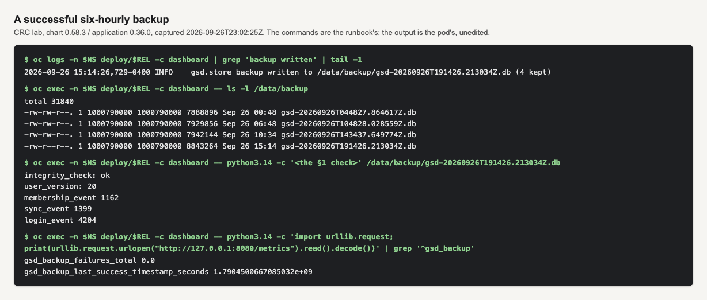
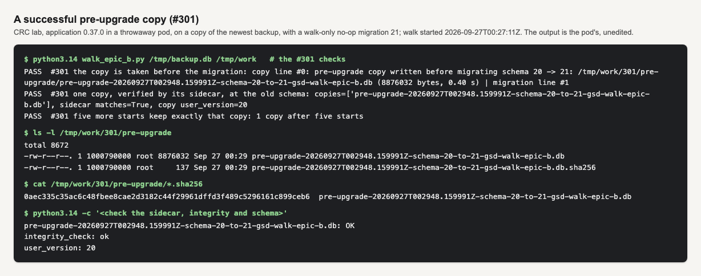
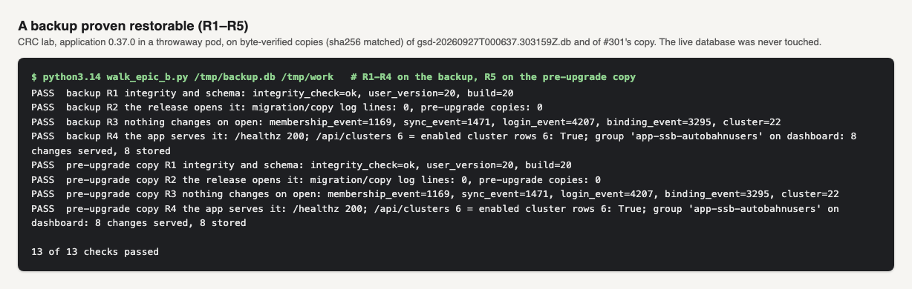

# Runbook — backing up and restoring the dashboard's history

The sync timeline and membership history exist only because this process observed them; the
cluster cannot replay them (`gsd/store.py#Store.backup`). Three copies exist:

* **on-volume** — `config.backup` writes `gsd-<UTC stamp>Z.db` under `config.backup.dir`
  (`/data/backup`) every `intervalHours`, keeping `keep` of them, on the data claim;
* **off-volume** — `backup.offsite` (off by default) copies the newest of those to a second
  claim or to object storage, with a `.sha256` sidecar, after an integrity check
  (`charts/group-sync-dashboard/scripts/offsite_backup.py#ship`);
* **pre-upgrade** — from the application release after 0.36.0, before a new image upgrades the database it
  writes the database as it was to `pre-upgrade/` beside it, with a `.sha256` sidecar, even when scheduled
  backups are disabled (§6).

Everything below uses only what the pod has: `sh`, `cat`, `ls`, `rm`, `chgrp`, `chmod`,
`python3.14` (`docs/DESIGN_hardened_image.md#What it changed for operators`). There is **no
`tar`**, so `oc cp` and `oc rsync` do not work against this image; bytes move with `cat` over
`oc exec`. Set `NS` and `REL` (the release's fullname, `oc get deploy -n $NS`) once:

```sh
NS=group-sync; REL=group-sync-dashboard
```

## What a successful backup looks like

Three pictures from the CRC lab (`reports/2026-09-26_epic-b-release/`). The first is the live dashboard pod. The second
and third come from a throwaway pod that worked on *copies* of a backup, not from the dashboard pod. Each shows the
pod's own output. The commands are below each picture, and lines not relevant to the picture are left out. `grep` and
`tail` run on your workstation; the pod has neither.

**The six-hourly backup (the live pod).** The log line names the file and how many are kept, and the listing shows
that many copies. The §1 check on the newest copy says `integrity_check: ok`, with a `user_version` equal to the
running app's. Failures are zero, and the last-success metric is the newest file's time. In this capture the metric
`1.7904500667085032e+09` is 2026-09-26T19:14:26.7Z, the same second as the file `gsd-20260926T191426.213034Z.db`. It
was taken at 23:02:25Z on application 0.36.0.



```sh
oc logs -n $NS deploy/$REL -c dashboard | grep 'backup written' | tail -1
oc exec -n $NS deploy/$REL -c dashboard -- ls -l /data/backup
oc exec -n $NS deploy/$REL -c dashboard -- python3.14 -c 'import urllib.request; print(urllib.request.urlopen("http://127.0.0.1:8080/metrics").read().decode())' | grep '^gsd_backup'
```

The picture's `<the §1 check>` block is §1's Python snippet, run on the newest file.

**The pre-upgrade copy (§6).** When a new image finds an older database, its startup log has
`pre-upgrade copy written before migrating schema <from> -> <to>: <file> (<bytes> bytes, <seconds> s)` before the
first `schema migration <to> applied` line. `pre-upgrade/` holds the copy and its `.sha256`. The copy matches its
sidecar, passes `integrity_check`, and keeps the old `user_version`:



```sh
oc exec -n $NS deploy/$REL -c dashboard -- ls -l /data/pre-upgrade
oc exec -n $NS deploy/$REL -c dashboard -- sh -c 'cat /data/pre-upgrade/*.sha256'
oc exec -n $NS deploy/$REL -c dashboard -- python3.14 -c "$(cat reports/2026-09-26_epic-b-release/walk/pre-verify.py)" /data/pre-upgrade
```

The picture was taken on a copy in a throwaway pod, with a test-only migration 21, so its paths are under
`/tmp/work/301/`. On the dashboard they are under `/data/pre-upgrade/`, or `/data/<pod-name>/pre-upgrade/` with more
than one replica. A database already at the image's schema has no `pre-upgrade/` directory, and that is correct.

**A backup proven restorable.** On copies in a throwaway pod, never on the live file:
- the released app opens the copy with no migration and no new copy;
- the row counts are the same before and after the open;
- with polling off, the app serves the copy's groups and their stored changes.

The picture shows these checks, R1 to R4, for the six-hourly backup and for the pre-upgrade copy. Its total, 13, also
counts the #305 and #301 checks, which are out of frame:



The recipe, as run on the lab. The pod mounts no volume, and the image has no `sleep`, so the pod waits in Python:

```sh
IMG=$(oc get deploy -n $NS $REL -o jsonpath='{.spec.template.spec.containers[0].image}')
oc run gsd-restore-check -n $NS --image=$IMG --restart=Never --overrides='{"spec":{"securityContext":{"runAsNonRoot":true,"seccompProfile":{"type":"RuntimeDefault"}},"containers":[{"name":"gsd-restore-check","image":"'$IMG'","command":["python3.14","-c","import time; time.sleep(1800)"],"securityContext":{"allowPrivilegeEscalation":false,"capabilities":{"drop":["ALL"]}}}]}}'
oc wait -n $NS pod/gsd-restore-check --for=condition=Ready --timeout=120s
B=$(oc exec -n $NS deploy/$REL -c dashboard -- python3.14 -c 'import glob; print(sorted(glob.glob("/data/backup/gsd-*.db"))[-1])')
oc exec -n $NS deploy/$REL -c dashboard -- cat "$B" | oc exec -i -n $NS gsd-restore-check -- sh -c 'cat > /tmp/backup.db'
oc exec -i -n $NS gsd-restore-check -- sh -c 'cat > /tmp/walk_epic_b.py' < reports/2026-09-26_epic-b-release/walk/walk_epic_b.py
oc exec -n $NS gsd-restore-check -- python3.14 -W ignore /tmp/walk_epic_b.py /tmp/backup.db /tmp/work
oc delete pod gsd-restore-check -n $NS
```

The script prints PASS or FAIL for each check, and exits 1 on any failure. Restoring onto the live database is §4, and
the scripted rollback is #302.

## 1. Verify a copy without restoring it

Any copy, anywhere. On the dashboard pod (on-volume copies):

```sh
oc exec -n $NS deploy/$REL -c dashboard -- ls -l /data/backup
oc exec -n $NS deploy/$REL -c dashboard -- python3.14 -c '
import sqlite3, sys
p = sys.argv[1]
c = sqlite3.connect(f"file:{p}?immutable=1", uri=True)
print("integrity_check:", c.execute("PRAGMA integrity_check").fetchone()[0])
print("user_version:", c.execute("PRAGMA user_version").fetchone()[0])
for t in ("membership_event", "sync_event", "login_event"):
    print(t, c.execute(f"SELECT COUNT(*) FROM {t}").fetchone()[0])
' /data/backup/gsd-20260904T061500.123456Z.db
```

Expected: `integrity_check: ok`, a `user_version` equal to the running app's latest migration,
and row counts that are plausible for the age of the copy.

In the CronJob's image the same check is one flag, and it also compares the sidecar:

```sh
oc create job -n $NS --from=cronjob/$REL-backup-offsite verify-$(date +%s) --dry-run=client -o json \
  | python3 -c '
import json, sys
job = json.load(sys.stdin)
job["metadata"].pop("ownerReferences", None)
c = job["spec"]["template"]["spec"]["containers"][0]
c["command"] = ["python3.14", "/scripts/offsite_backup.py", "--check", "/offsite/gsd-20260904T061500.123456Z.db"]
json.dump(job, sys.stdout)
' | oc apply -f -
oc wait -n $NS --for=condition=complete job/verify-<stamp> --timeout=180s && oc logs -n $NS job/verify-<stamp>
```

(`date` and `python3` here run on your workstation, not in the pod. With the `s3` destination
the CronJob's only container that runs the script is the init container, whose copy is under
`/stage` and is gone when the Job ends — verify an S3 copy after downloading it, §3.) Expected:
`integrity_check ok`, `sha256 …`, `sidecar matches`, `user_version …`, row counts.

Outside the cluster, with the copy downloaded (see §3): `sha256sum -c gsd-….db.sha256` and the
same Python snippet with `python3`.

## 2. Run the off-volume copy by hand

The destination claim is bound by the chart's one-shot bind Job when the module is enabled
(`oc get job -n $NS -l app.kubernetes.io/component=backup-offsite` shows it `Complete` under Helm;
under Argo CD it is a Sync hook and is gone once it succeeded), so `helm upgrade --wait` works and
an Argo sync turns healthy without waiting for the first scheduled run. If an upgrade ever fails part-way, the objects that revision created
are not owned by Helm until the next successful one renders them — delete them by label,
`oc delete cronjob,job,sa,cm -l app.kubernetes.io/component=backup-offsite`, for a clean slate; the
claim carries `helm.sh/resource-policy: keep` and is never removed that way.

```sh
oc create job -n $NS --from=cronjob/$REL-backup-offsite manual-$(date +%s)
oc logs -n $NS -l job-name=manual-<stamp> -f
```

Expected log:

```
copied /data/backup/gsd-….db -> /offsite/gsd-….db (NNN bytes, sha256 …)
integrity_check ok; user_version 9; membership_event rows N; sync_event rows M
pruned 0 older copies (keep=14)
```

A second run straight after says `already shipped: … matches its sidecar; nothing to copy`.
A failure prints `ERROR: <reason>` and the Job goes Failed — that is the signal the
`GroupSyncDashboardOffsiteBackupStale` alert reads. Under a `ReadWriteOnce` data volume a Job
that stays **Pending** means the dashboard is not running on any node (the pod is pinned to it).

Confirm the alert can see the Job (Prometheus / Thanos querier):

```
kube_cronjob_status_last_successful_time{namespace="group-sync",cronjob="group-sync-dashboard-backup-offsite"}
```

No series after a success means kube-state-metrics is not scraped into this Prometheus; the
`…Unobserved` alert will say so.

## 3. Get a copy out of the cluster

From the data claim or the offsite claim, via the running dashboard pod (on-volume) or a helper
pod (§4) that mounts the offsite claim:

```sh
oc exec -n $NS deploy/$REL -c dashboard -- cat /data/backup/gsd-….db > gsd-….db
sha256sum gsd-….db
```

From S3 use the CLI with a credential that holds `GetObject` — the backup credential should hold
`PutObject` alone and cannot read its own uploads. That is deliberate.

## 4. Restore

**The script, in recovery mode (#302).** With the release's pod in recovery mode (#303: `recovery.enabled: true`
in the release's values file), run `local-development/restore-db.sh --list` from your laptop, then
`local-development/restore-db.sh --from-version <ID>` with an ID it printed. It does what §4a and §4b do by hand,
for a scheduled backup, a pre-upgrade copy (§6) or a copy on the offsite claim when recovery mode mounts it: it
refuses a copy newer than the image, a sidecar that does not match and a failed `integrity_check`; it shows what the
restore discards and asks; it keeps the live set (`gsd.db` with its `-wal` and `-shm`) under
`/data/pre-restore/<stamp>/`; and it writes the copy under a temporary name, with `chgrp 0` and `chmod g=u`,
before it renames it onto `gsd.db`. It refuses unless the release's one pod is in recovery mode with at least ten
minutes of `recovery.ttl` left. The commands below stay as the fallback, and as the specification the script
implements (`docs/specs/SPEC_E3_restore_db.md`).

**Undo a restore.** The live set the script replaced is kept under `/data/pre-restore/<stamp>/`, and it is the way
back; a directory whose name ends in `.tmp` is a keep that never finished, not a set. Stay in recovery mode. The
kept set's committed rows may sit only in its `gsd.db-wal`, so fold it before anything copies it: in the recovery pod,
`oc exec -n $NS <pod> -c dashboard -- python3.14 -c 'import sqlite3, sys; c = sqlite3.connect(sys.argv[1]); c.execute("PRAGMA user_version"); c.close()' /data/pre-restore/<stamp>/gsd.db`
leaves that `gsd.db` whole and alone: SQLite folds the `-wal` into it and removes it with the `-shm`, and rolls a hot
`-journal` back. If a `-wal` or `-journal` with bytes is still beside it afterwards, something else has it open or
it is damaged; do not go on. Then restore it with §4a's commands, the kept `gsd.db` in place of the `gsd-….db` copy:
they run `integrity_check` on it, keep the current live set first, write it beside `gsd.db` under a temporary name,
and remove the current `-wal`, `-shm` and `-journal` before it takes the name. A kept `gsd.db` copied without the
fold can lack every row its `-wal` held.

The dashboard is the only writer and must be **stopped** first: two processes on one SQLite
file corrupt rather than error (`gsd/store.py#Store.__init__`).

**Recovery mode is the primary path (chart 0.60.0 and later, #303).** The dashboard pod keeps its spec and
its data volume but runs the chart's recovery script instead of the app
(`charts/group-sync-dashboard/scripts/recovery_mode.py`), so nothing opens `gsd.db`, and it stays up until
`recovery.ttl` (2h by default): a dropped `oc` session does not end it. It is a value like any other: set it
in this release's values file and roll it out through the release's deployment pipeline. Never with
`oc set env` or an edit of the Deployment: a GitOps tool such as Argo CD (selfHeal) reverts a hand edit.

1. **Turn it on, with the image you will restore under.** In the release's values file set
   `recovery.enabled: true` and `recovery.ttl` (for example `2h`, longer than the restore needs), and roll it
   out. For a rollback, set the older `image.tag` in the same change, so the restore runs under the image
   that will open the file.
2. **Wait for the recovery pod.** `oc get pods -n $NS -l app=$REL` shows `1/2` ready (`0/1` with the proxy
   off) and `Running`: the dashboard container is not ready, so the Service sends it nothing.
   `oc logs -n $NS deploy/$REL -c dashboard` starts with `RECOVERY MODE`, `the app is NOT running and no data
   is collected` and the TTL's end. With `backup.offsite` on its `pvc` destination, the offsite claim is at
   `/offsite`, read-only. The Deployment never reports available, so a pipeline step that waits for the
   rollout reports it failed; that is expected. A pipeline that rolls a failed rollout back on its own (Helm's
   `--rollback-on-failure` flag, `--atomic` in Helm 3, or an equivalent remediation) must not carry this
   change: the rollback turns recovery mode off by itself and starts the app on a file that may be half
   restored.
3. **Restore** with §4a or §4b, running their commands with `oc exec -n $NS deploy/$REL -c dashboard -- sh -c '…'`
   instead of `oc debug` or a helper pod. **Check the time left first** (the last `left` line of `oc logs`):
   at the TTL the script exits and every process in the container stops with it, a restore still running
   included, which leaves `gsd.db` half written. If the restore may not finish in time, extend first.
4. **More time?** At the TTL the script exits 1, the pod reads `CrashLoopBackOff`, and the log ends with how to
   extend or leave. Set a longer `recovery.ttl` (for example `4h`) in the values file and roll it out: the new
   pod counts it from its start. The change replaces the pod and ends any `oc exec` session in it; so does an
   eviction or a node drain, whose new pod also starts a new TTL. The time left is counted on the node's
   monotonic clock, so setting the wall clock back does not lengthen it; if the node restarts under the pod,
   the TTL counts as reached.
5. **Turn it off**, and verify with §4c: set `recovery.enabled: false` in the values file (keep a rollback's
   older `image.tag`) and roll it out. When the change is applied the recovery pod stops at once and the app
   starts on the restored file.

Nothing is recorded while recovery mode is on, and no rule says so: `GroupSyncDashboardNotPolling` reads a
gauge the stopped process no longer emits, so it returns nothing. With reporting on,
`GroupSyncDashboardReportSnapshotStale` (warning) fires after about 50 minutes, because the report service's
newest copy stops advancing. The TTL is the bound.

**Development and troubleshooting only:** with plain Helm and no pipeline, the same change is
`helm upgrade $REL <chart> -n $NS -f <values-file>`, with the chart reference and version the release already
runs (`helm list -n $NS`) and the release's complete values file, now carrying `recovery`.

**Without recovery mode** (the fallback, and any chart before 0.60.0), scale the writer to zero and use the
`oc debug` pod of §4a or the helper pod of §4b:

```sh
oc scale -n $NS deploy/$REL --replicas=0
oc wait -n $NS --for=delete pod -l app=$REL --timeout=120s
```

### 4a. From an on-volume copy

In recovery mode the dashboard pod already has the data claim: run the `sh -c '…'` body below with
`oc exec -n $NS deploy/$REL -c dashboard --` in place of `oc debug -n $NS deploy/$REL -c dashboard --`.
Otherwise, a helper pod with the data claim, from the Deployment's own template:

```sh
oc debug -n $NS deploy/$REL -c dashboard -- sh -c '
set -e
ls -l /data /data/backup
python3.14 -c "import sqlite3,sys; c=sqlite3.connect(\"file:\" + sys.argv[1] + \"?immutable=1\", uri=True); print(c.execute(\"PRAGMA integrity_check\").fetchone()[0])" /data/backup/gsd-….db
python3.14 -c "
import pathlib, time
keep = pathlib.Path(\"/data/pre-restore\") / time.strftime(\"%Y%m%dT%H%M%SZ\", time.gmtime())
for name in (\"gsd.db\", \"gsd.db-wal\", \"gsd.db-shm\", \"gsd.db-journal\"):
    live = pathlib.Path(\"/data\") / name
    if live.is_file():
        keep.mkdir(parents=True, exist_ok=True)
        (keep / name).write_bytes(live.read_bytes())
        print(\"kept\", live, \"under\", keep)
"
cat /data/backup/gsd-….db > /data/gsd.db.restore.tmp
chgrp 0 /data/gsd.db.restore.tmp && chmod g=u /data/gsd.db.restore.tmp
rm -f /data/gsd.db-wal /data/gsd.db-shm /data/gsd.db-journal
python3.14 -c "import os; os.replace(\"/data/gsd.db.restore.tmp\", \"/data/gsd.db\")"
ls -l /data
'
```

The live **set** is kept, not `gsd.db` alone: a writer killed before a checkpoint leaves committed rows only in
`gsd.db-wal`, and a kept `gsd.db` without it counted 0 of 500 such rows where the kept set counted 500 (#302).
The copy is written under a temporary name and renamed onto `gsd.db` once the old side files are gone, so a write
that fails (a full volume, a `gsd.db` the pod cannot write) stops before anything is removed.
`-wal`, `-shm` and `-journal` **must** go: they belong to the file that was there before, and SQLite would
replay a foreign WAL, or roll a foreign hot journal back, into the restored database. `chgrp 0` + `g=u` is the arbitrary-UID rule
OpenShift runs under: the next pod may get a different UID and reads through the root group
(`local-development/Containerfile#chgrp -R 0 /data`).

### 4b. From the off-volume claim

In recovery mode the dashboard pod mounts the offsite claim read-only at `/offsite` (with
`backup.offsite` on its `pvc` destination): skip the helper pod and run the `oc exec` body below against
`deploy/$REL -c dashboard`. Otherwise, a one-off pod mounting both claims (the `debug` pod has only the
data claim). There is no `sleep`; Python idles instead:

```yaml
apiVersion: v1
kind: Pod
metadata: {name: gsd-restore, namespace: group-sync}
spec:
  restartPolicy: Never
  securityContext: {runAsNonRoot: true, seccompProfile: {type: RuntimeDefault}}
  containers:
    - name: restore
      image: quay.io/ephico2real/group-sync-dashboard:0.15.0   # the running tag
      command: ["python3.14", "-c", "import time; time.sleep(3600)"]
      securityContext: {allowPrivilegeEscalation: false, readOnlyRootFilesystem: true, capabilities: {drop: ["ALL"]}}
      volumeMounts:
        - {name: data, mountPath: /data}
        - {name: offsite, mountPath: /offsite, readOnly: true}
  volumes:
    - {name: data, persistentVolumeClaim: {claimName: group-sync-dashboard-data}}
    - {name: offsite, persistentVolumeClaim: {claimName: group-sync-dashboard-backup-offsite}}
```

```sh
oc apply -f gsd-restore.yaml && oc wait -n $NS --for=condition=Ready pod/gsd-restore
oc exec -n $NS gsd-restore -- sh -c '
set -e
python3.14 /dev/stdin <<EOF
import hashlib, pathlib, sqlite3, time
p = pathlib.Path("/offsite/gsd-….db")
h = hashlib.sha256(p.read_bytes()).hexdigest()
assert h == p.with_name(p.name + ".sha256").read_text().split()[0], "sidecar mismatch"
c = sqlite3.connect(f"file:{p}?immutable=1", uri=True)
assert c.execute("PRAGMA integrity_check").fetchone()[0] == "ok"
print("copy verified", h)
keep = pathlib.Path("/data/pre-restore") / time.strftime("%Y%m%dT%H%M%SZ", time.gmtime())
for name in ("gsd.db", "gsd.db-wal", "gsd.db-shm", "gsd.db-journal"):
    live = pathlib.Path("/data") / name
    if live.is_file():
        keep.mkdir(parents=True, exist_ok=True)
        (keep / name).write_bytes(live.read_bytes())
        print("kept", live, "under", keep)
EOF
cat /offsite/gsd-….db > /data/gsd.db.restore.tmp
chgrp 0 /data/gsd.db.restore.tmp && chmod g=u /data/gsd.db.restore.tmp
rm -f /data/gsd.db-wal /data/gsd.db-shm /data/gsd.db-journal
python3.14 -c "import os; os.replace(\"/data/gsd.db.restore.tmp\", \"/data/gsd.db\")"
'
oc delete -n $NS pod/gsd-restore
```

For an S3 copy: download it (§3), then, in the helper pod, run the keep lines above, stream the copy in under the
temporary name — `cat gsd-….db | oc exec -i -n $NS gsd-restore -- sh -c 'cat > /data/gsd.db.restore.tmp'` — and
finish with the last four lines above: the ownership lines, the `rm -f /data/gsd.db-wal
/data/gsd.db-shm /data/gsd.db-journal` line, and the rename. The order matters: the copy is whole beside `gsd.db`
before anything of the old file is removed, and a `-wal` that outlives the file it belonged to would be replayed
into the restored database.

**Both claims RWO on different nodes?** The helper pod needs both attached; if it stays Pending,
the offsite claim is attached elsewhere (a Job still running — wait for it) or the classes are
node-local. Move the file via §3 instead.

### 4c. Bring it back and verify

In recovery mode, turn it off (§4, step 5) instead of the `oc scale` below: the app starts on the restored
file. The rest of this section is the same.

```sh
oc scale -n $NS deploy/$REL --replicas=1
oc rollout status -n $NS deploy/$REL
oc exec -n $NS deploy/$REL -c dashboard -- curl -s http://127.0.0.1:8080/api/version
```

Expected: `{"leader": true, "version": "0.15.0", …}` (with `oauthProxy.enabled` the app binds
loopback; `curl` from inside the pod is the honest check).

**The report pod stays NotReady until a new copy is written** after a restore from a newer image. The newest copy under
`/data/report` is the one the previous image wrote, and the report service refuses a snapshot newer than it
understands (`snapshot schema N is newer…`, `/report/readyz` 503). The leader's first poll after this start writes a
new copy (`gsd/poller.py#_maybe_report_snapshot`: at once on the first cycle, then every
`reporting.snapshot.intervalSeconds`), and when that write succeeds the report pod becomes Ready (measured by OB2's
composition review of Epics A and B). If it is still NotReady after the leader's first poll, no copy was written:
the leader's log says `report snapshot was not written` or `report snapshot failed`, and the next attempt waits a
full interval. Fix what that names (the volume's space or permissions) rather than waiting.

**A copy newer than the image is refused (#305).** When the restored file's `user_version` (§1) is
above the highest migration the running image carries, the dashboard does not start: the container
exits 1 before it binds its port, `oc rollout status` does not complete, and the last log line names
both numbers:

```sh
oc logs -n $NS -l app=$REL -c dashboard --previous --tail=1
```

```
gsd.store.StoreSchemaTooNew: database schema 21 is newer than this dashboard understands (20); restore a backup at or below schema 20 (docs/RUNBOOK_backup_restore.md §4; after an upgrade, the pre-upgrade copy in §6), or deploy the image that understands 21
```

The refusal comes before this image runs any of its own schema, migrations or seeds, so the
newer build's data is kept as it was. One physical change is possible: if the copy carries a committed
`gsd.db-wal`, SQLite folds it into `gsd.db` when the refusing connection closes (a checkpoint). That
changes the file's bytes, not its contents. Scale to 0
(§4) and either restore a copy whose `user_version` is at or below the second number, or deploy the
image that understands the first. A rollback to an older image without restoring the database first
stops the same way.

Then the counts, on the live file this time (a normal open, the pod's own connection is the writer):

```sh
oc exec -n $NS deploy/$REL -c dashboard -- python3.14 -c '
import sqlite3
c = sqlite3.connect("file:/data/gsd.db?mode=ro", uri=True)
for t in ("membership_event", "sync_event"):
    print(t, c.execute(f"SELECT COUNT(*) FROM {t}").fetchone()[0])
'
```

The numbers must equal the copy's (§1). The pod log shows `schema migration N applied` lines
only if the copy predates the running version, each after a line about the pre-upgrade copy (§6): the
copy that start wrote, or the one an earlier start of the same upgrade wrote; the first poll then
rebuilds every cache table.
`GET /api/clusters/<id>/membership-changes` should answer with the restored history and a
`retention` object.

**Retention after a restore.** If `config.retention` windows are on, the leader starts pruning
rows past the window 5,000 at a time on the first cycle after a successful backup. Restoring an
old copy to *read* its history is a reason to set both windows to `0` first.

## 5. Moving the data to a new claim (access mode change)

`accessModes` are immutable. Create the new claim (`persistence.existingClaim` pointing at it,
or a new release name), scale to zero, and copy `gsd.db` **only** — never `-wal`/`-shm` — with
the pattern in §4b (a helper pod with both claims), then §4c.

## 6. Pre-upgrade copies

A new image upgrades the database it finds at startup (its schema: the tables and columns) and cannot undo that
upgrade, so the database as it was before the upgrade is the only way back to the previous image. From the
application release after 0.36.0 the dashboard takes that copy itself (`gsd/store.py#_pre_upgrade_copy`, #301),
before the new image creates a table or runs a migration. A new database, or one already at the image's schema
version, needs no copy.

* **Where.** `pre-upgrade/` beside the database: `/data/pre-upgrade/` when there is one replica, or
  `/data/<pod-name>/pre-upgrade/` when `replicaCount` is greater than 1. It is written even when scheduled
  backups are disabled, and the six-hourly rotation, the offsite CronJob, the backup metric and the KPI size
  line never include it.
* **Name.** `pre-upgrade-<UTC stamp>-schema-<from>-to-<to>-<pod>.db`. The two numbers are database schema
  versions, not application versions, and `<pod>` is the pod that took the copy. `<from>` is the copy's schema:
  restore it under an image that understands that schema or a newer one; an older image refuses to start (§4c).
  The `.sha256` file beside it holds the checksum `sha256sum -c` verifies it with.
* **Verified before the upgrade.** Startup writes a temporary file, checks its schema version and its
  integrity, writes its checksum, saves both to disk, renames the copy into place, and only then upgrades.
* **Once per upgrade.** A later start of the same image, a restarted container or a replacement pod, does not
  copy again: a failed attempt has already committed this image's new tables and every migration before the
  one that failed, so a second copy would not be the database the previous image wrote. Its log says
  `pre-upgrade copy for schema <from> -> <to> not taken again: <file> already exists from an earlier attempt`.
  The same holds when you restore that copy and start the same image again: the copy already there is the
  database you restored. If the previous image ran on the restored database before you retry the upgrade, move
  the earlier `-to-<to>-` copy and its `.sha256` out of `pre-upgrade/` first (to `/data/pre-restore/`, for
  example), or the retry takes no copy of what that image wrote since.
* **Kept.** The copies of the newest three upgrades; an older one is removed only when a newer upgrade's copy
  has been written. `config.backup.keep` and the six-hourly rotation do not apply to them. Each takes about as
  much space as the database and counts against `persistence.size`.

The startup log names the copy before the first migration line, for example
`pre-upgrade copy written before migrating schema 19 -> 20: /data/pre-upgrade/pre-upgrade-….db (9973760 bytes, 0.12 s)`
and then `schema migration 20 applied: …`.

**When the copy cannot be written, the dashboard does not start.** That start upgrades nothing: the container
exits 1 before it binds its port. The last line of `oc logs -n $NS -l app=$REL -c dashboard --previous --tail=1`
names the reason and the directory, for example
`gsd.store.StorePreUpgradeCopyFailed: schema 19 -> 20: the pre-upgrade copy of /data/gsd.db could not be written to /data/pre-upgrade, so the database was not migrated: free space 40.0 MiB, database 120.0 MiB. …`.
Grow the claim or free space on it, or make the directory writable (the `oc debug` pod of §4a, `chgrp 0` and
`chmod g=u`), and the next start takes the copy and upgrades. Or deploy the previous image: a start that could
not write the copy changed nothing. A process killed while copying leaves only a temporary file, which the next
start removes.

**Using a copy.** Verify it with §1, reading `/data/pre-upgrade/<file>` instead of a backup; outside the
cluster, run `sha256sum -c <file>.sha256` from the directory that holds both files (§3). To go back to the
previous image, restore the copy with §4a from `/data/pre-upgrade/<file>` and deploy that image.
If the previous image then runs on the restored database, move the earlier `-to-<to>-` copy and its `.sha256` out of
`pre-upgrade/` before you upgrade again ("Once per upgrade" above), or the retry takes no copy of what that image
wrote since.
