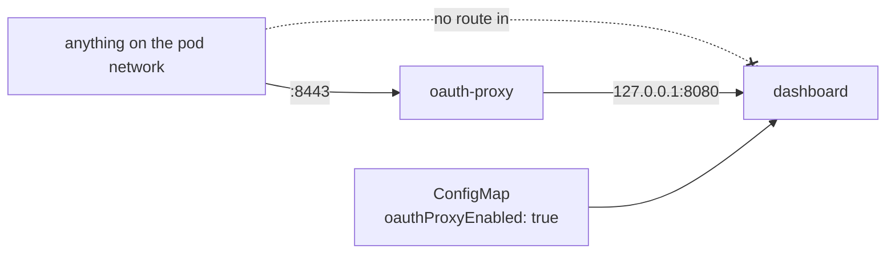
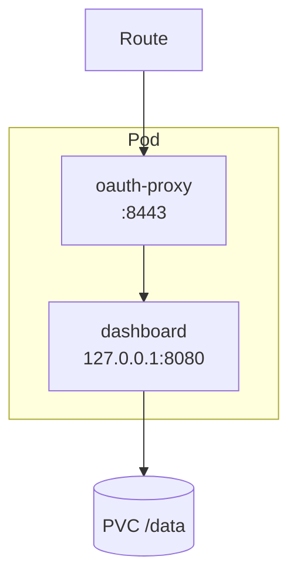
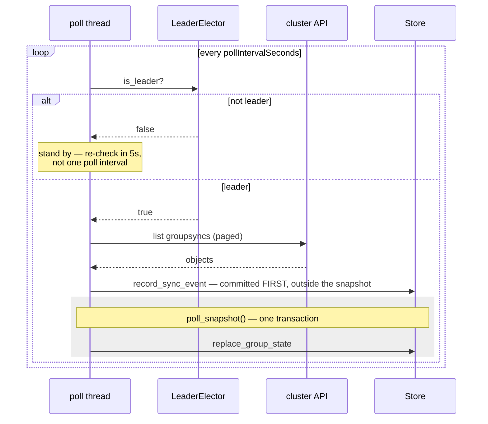
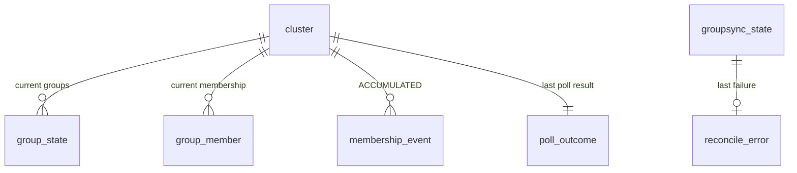
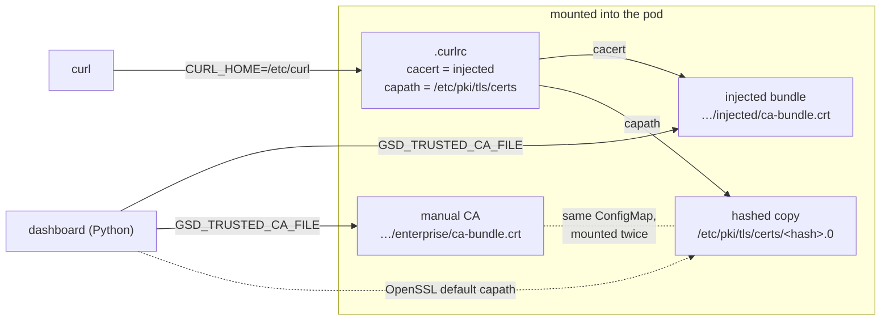
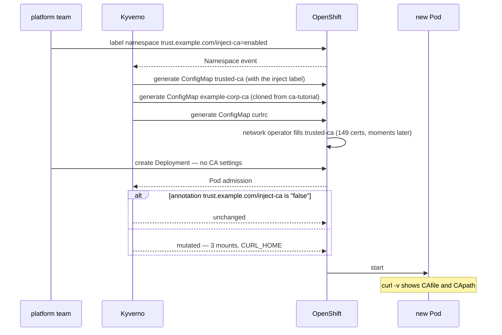

# Tutorial — Diagrams as code with Mermaid: how this repository draws, checks and renders them

For an engineer who can read a codebase and wants to draw it. This is the method behind the ten
diagrams in `reference-architecture.md`, the syntax those diagrams use, the mistakes that
actually broke one, and the two layers of automation that keep them rendering. Every diagram in
this tutorial was rendered with the same tool the repository's CI uses before it was committed.

What you will be able to do afterwards:

1. Decide *whether* a diagram earns its place, and which of the three kinds to draw.
2. Derive a diagram from code rather than from imagination, so it stays true.
3. Write flowcharts, sequence diagrams and entity-relationship diagrams in Mermaid.
4. Avoid the five constructs that silently break a render.
5. Check a diagram in half a second, render it in a minute, and know why CI does both.

---

## Part 1 — Why text, and where it renders

A diagram written as text lives next to the code, diffs in a pull request, and can be checked
by a machine. A diagram drawn in a tool lives in someone's account and is wrong three months
later. Mermaid is a small language for the first kind: a fenced code block that starts with
` ```mermaid ` and a renderer that turns it into an SVG.

Where the rendering happens matters, because it decides what you have to maintain:

| Where | What renders it | What you commit |
|---|---|---|
| GitHub (README, docs, issues, pull requests) | GitHub itself, natively, on the fly | the text only |
| A local preview | mermaid-cli (`mmdc`), a headless Chromium, or an editor plugin | the text only |
| A site generator, a PDF, a wiki without Mermaid | mermaid-cli in markdown mode writes SVG files and rewrites the blocks into image links | the text, and the images it generated |

This repository commits text only. Its docs are read on GitHub, which renders the blocks
natively, so no image ever needs generating. What *does* need doing is knowing the text renders
at all, which is Part 5.

---

## Part 2 — The method: how a diagram comes to be

Every diagram in this repository started as a question a reader would ask that prose answers
badly. The method is the same each time.

**1. Name the question.** One question per diagram. "How does a poll flow?" "Which objects does
the chart create, and what talks to what?" "What is stored, and what owns what?" A diagram that
answers two questions is two diagrams. If the question has a one-sentence answer, write the
sentence instead.

**2. Pick the kind by the shape of the answer.**

| The answer is about… | Kind | Starts with |
|---|---|---|
| who talks to whom, in what order, over time | sequence diagram | `sequenceDiagram` |
| what connects to what, what contains what, where a boundary is | flowchart | `flowchart LR` or `TB` |
| what is stored and how records relate | entity-relationship diagram | `erDiagram` |

Those three cover everything this repository has needed. Mermaid has a dozen more; reach for one
only when the question demands it.

**3. Take the actors and the edges from the code, not from memory.** This is the step that keeps a
diagram honest. For the poll-flow sequence diagram in `reference-architecture.md`, the
participants are the four things the code names — the poll thread, the `LeaderElector`, the
cluster API and the `Store` — and every arrow is a call that exists: `is_leader`
(`gsd/leader.py`), `record_sync_event` and `poll_snapshot` (`gsd/store.py`), called from
`poll_once` in `gsd/poller.py`. When the diagram says the sync event is committed *before* the
snapshot transaction, that is because the code says so, in a comment above the line, and the
diagram was drawn from that comment. Open the file, list the calls, draw the calls.

**4. Prune.** A diagram that shows everything shows nothing. Keep the actors the question needs
and cut the rest; twenty nodes is a lot, forty is a page nobody reads. If a branch is not part
of the answer, leave it out and let the prose say so.

**5. Label with the real names.** Node text should be what the reader will grep for:
`oauth-proxy`, `poll_snapshot()`, `group_member`. A label that paraphrases the code is a label
that drifts.

**6. Say what the reader should notice.** The sentence before or after the diagram points at the
one thing it exists to show — "the sync event is committed first, outside the snapshot" — so the
reader does not have to find it.

**7. Verify, then commit.** Part 5. A diagram that does not render is worse than none: it is an
error box where the answer should be, and nobody looks at diagrams often enough to notice.

---

## Part 3 — The three kinds, taught from this repository's own diagrams

### 3.1 Flowchart

The smallest diagram in the reference architecture, from section 7.2, drawn to show one fact:
nothing on the pod network can reach the application except through the proxy.



Line by line:

| Line | What it says |
|---|---|
| `flowchart LR` | a flowchart, laid out left to right (`TB` is top to bottom; `LR` reads better for pipelines, `TB` for hierarchies) |
| `ext["anything on the pod network"]` | a node with id `ext` and a quoted label. The id is what you refer to later; the label is what the reader sees. Quote labels that contain spaces, colons, parentheses or pipes |
| `-. "no route in" .-x` | a dotted edge with a label and a cross at the end: "this connection is refused" |
| `-->\|":8443"\|` | a solid arrow with a label in pipes; quote the label because it contains a colon |
| `proxy["oauth-proxy"] --> app["dashboard"]` | declaring a node inline with an edge is fine, and it can be declared once and reused by id |
| `<br/>` | a line break inside a label — the one piece of HTML the renderer keeps |

The shapes that mean something at a glance, all from the official syntax:

```text
id[rectangle]   id(rounded)   id([stadium])   id[[subroutine]]   id[(database)]
id((circle))    id{decision}  id{{hexagon}}   id[/parallelogram/]
```

Boundaries are drawn with `subgraph … end`. The deployment topology in section 8 uses one per
Kubernetes object so the reader sees what lives inside the pod, the namespace and the cluster:



`direction LR` inside a subgraph lays out its contents left to right while the outer diagram
stays top to bottom. Give every subgraph an id *and* a title, `subgraph pod["Pod"]`, so edges can
point at it by id.

### 3.2 Sequence diagram

The first lines of the poll-flow diagram from section 3, which shows a loop, a branch, a note
and a highlighted region:



| Construct | What it says |
|---|---|
| `participant T as poll thread` | a lane with a short id and a display name; declare them in the order you want them left to right |
| `T->>L: is_leader?` | a solid arrow with a head, a call; `-->>` is the dotted reply. The text after the colon is the message |
| `loop … end`, `alt … else … end`, `opt … end`, `par … and … end` | the control blocks; every one closes with `end` |
| `Note over T: …` and `Note over T,S: …` | a note above one lane or spanning two; `Note right of T:` is the other form |
| `rect rgb(238, 238, 238) … end` | a shaded region behind a group of messages — here, "these calls are one transaction" |
| `<br/>` | a line break in a message or note |

The message text is free text, and that is where the one bug this repository shipped lived
(Part 4).

### 3.3 Entity-relationship diagram

The data model from section 5, reduced to its shape:



Each line is `LEFT <cardinality>--<cardinality> RIGHT : "label"`. The symbols read as a picture
of the line's ends:

| Symbol at the left end | Symbol at the right end | Meaning |
|---|---|---|
| `\|o` | `o\|` | zero or one |
| `\|\|` | `\|\|` | exactly one |
| `}o` | `o{` | zero or more |
| `}\|` | `\|{` | one or more |

So `cluster ||--o{ group_state` reads "one cluster has zero or more group_state rows", and
`||--||` is one-to-one. `--` draws a solid, identifying relationship; `..` a dashed,
non-identifying one. Attributes can be listed in a block, `ENTITY { type name PK "comment" }`;
this repository leaves them out because the SQL schema is the source of truth and the diagram is
about ownership, not columns.

---

## Part 4 — The five things that break a render, from experience

Each of these either did break a diagram in this repository or was one edit away from doing so.
`tests/test_docs_diagrams.py` checks for them in half a second.

| Construct | What happens | Do this instead |
|---|---|---|
| a bare `;` in a note or message: `Note over T: stand by; re-check` | `;` ends a statement in Mermaid, so the note ended at the semicolon and everything after it was a parse error. **This one shipped**, and was found by a person looking at the page. | an em dash or a comma; inside a quoted flowchart label `;` is harmless |
| anything that looks like an HTML tag in a label: `token <why>` | labels pass through as HTML, so `<why>` is an unknown tag and vanishes without an error. The diagram renders with the word missing | `{why}` or a quoted label; `<br/>` is the intended exception |
| an unclosed quote: `ext["anything on the pod network]` | the rest of the diagram becomes one label | balance every `"`; the test counts them |
| the word `end` in lowercase inside a flowchart node label | it closes a subgraph that was never opened | `End`, `END`, or any other word |
| a label with `:`, `(`, `)` or `\|` and no quotes | the parser reads them as syntax | quote the label: `id["a: b (c)"]` |

Two more that do not break a render but do break a reader: a diagram with no sentence beside it
saying what to look at, and a diagram that drifted from the code because its labels paraphrased
instead of naming.

---

## Part 5 — The automation: two layers, and why both

### 5.1 The fast check — `tests/test_docs_diagrams.py`

It finds every ` ```mermaid ` block in every markdown file of the repository and checks the
constructs from Part 4, one test per block per rule. It runs with the rest of the suite in about
half a second and fails with the file, the line and the offending text:

```bash
cd local-development
.venv/bin/python -m pytest tests/test_docs_diagrams.py -q
```

It is not a parser; writing one to catch a class of bug would be worse than the bug. It also
asserts it found at least nine blocks, so a change to how blocks are written cannot silently
reduce the suite to nothing.

### 5.2 The ground truth — the `diagrams` CI job

`ci.yml` has a job that extracts every block into its own `.mmd` file and renders each one with
mermaid-cli. It is the only way to be sure, and it exists because the fast check was written
*after* the semicolon shipped. Three details in that job are worth knowing:

- mermaid-cli renders through a headless Chromium via Puppeteer. On `ubuntu-latest` Chromium
  cannot start its sandbox (Ubuntu 23.10+ restricts unprivileged user namespaces), and every
  render failed with "No usable sandbox!" — which reads exactly like nine broken diagrams and was
  zero. The job passes a Puppeteer config with `--no-sandbox`, which is safe there because the
  input is this repository's own markdown on a single-use runner.
- It counts the renders and fails if the count is zero, so a toolchain that cannot start can
  never read as a clean run.
- It asserts the extractor found at least nine diagrams, for the same reason the fast test does.

### 5.3 Doing the same on your machine

Render one diagram:

```bash
cat > /tmp/one.mmd <<'EOF'
flowchart LR
  a["write the text"] --> b["render it"] --> c["look at it"]
EOF
npx --yes @mermaid-js/mermaid-cli@11 -i /tmp/one.mmd -o /tmp/one.svg     # or .png, .pdf
```

Render every block in the repository exactly as CI does — the extractor is the same code:

```bash
cd "$(git rev-parse --show-toplevel)"
python3 - <<'EOF'
import pathlib, re
out = pathlib.Path("/tmp/mmd"); out.mkdir(exist_ok=True)
n = 0
for md in sorted(pathlib.Path(".").rglob("*.md")):
    if any(s in md.parts for s in (".venv", "node_modules", ".agents", ".claude")):
        continue
    for body in re.findall(r"```mermaid\n(.*?)```", md.read_text(), re.S):
        n += 1
        (out / f"{md.stem}-{n:02d}.mmd").write_text(body)
print(f"extracted {n} diagrams")
EOF
for f in /tmp/mmd/*.mmd; do
  npx --yes @mermaid-js/mermaid-cli@11 -i "$f" -o "${f%.mmd}.svg" >/dev/null 2>&1 && echo "ok    $f" || echo "FAIL  $f"
done
```

If Chromium refuses to start on your machine, the same `--no-sandbox` config CI uses works
locally: `echo '{ "args": ["--no-sandbox"] }' > /tmp/puppeteer.json` and add
`-p /tmp/puppeteer.json`.

To produce image files for a place that cannot render Mermaid, markdown mode rewrites the blocks
into image links and writes the SVGs beside the output:

```bash
npx --yes @mermaid-js/mermaid-cli@11 -i docs/reference-architecture.md -o /tmp/rendered.md
```

This repository does not commit those; GitHub renders the text.

### 5.4 Adding a diagram — the checklist

1. Write the question it answers in one sentence. If the sentence is the answer, stop.
2. Pick the kind (Part 2, step 2).
3. Open the code and list the actors and the calls or relations. Draw only those.
4. Write the block in the doc, with the sentence from step 1 beside it.
5. `pytest tests/test_docs_diagrams.py -q` — half a second.
6. Render it (5.3) and look at the SVG. Look at it: a render that succeeds can still be a
   diagram with a missing word (Part 4, row 2).
7. Commit. The `diagrams` job renders it again on the pull request.

---

## Part 6 — Two diagrams built from scratch, following the method

### 6.1 "How does a CA reach curl and the application in the pod?"

*Question.* After chart 0.10.0, a reader of `DESIGN_hardened_image.md` asks which file each
program in the pod reads to trust a certificate. *Kind:* what connects to what, so a flowchart.
*Actors and edges from the code:* `templates/deployment.yaml` mounts three things and sets two
variables; `templates/configmap-curlrc.yaml` names two stores; the application reads
`GSD_TRUSTED_CA_FILE` (`gsd/config.py`). Nothing else is drawn.



*What to notice:* the application and curl never share a variable, only files. That is the
sentence that goes beside the diagram. Note `&lt;hash&gt;` for the angle brackets: written
literally, `<hash>` would be dropped as an unknown tag (Part 4).

### 6.2 "What happens when a namespace opts in to the Kyverno policy?"

*Question.* The CA-trust tutorial's Part 3.5 has a policy with four rules; a reader wants the
order of events. *Kind:* who does what, in order, so a sequence diagram. *Actors from the
policy:* the person labelling the namespace, Kyverno, OpenShift's network operator, and the pod.
*Edges:* the four rules, in the order they fire.



*What to notice:* generation happens on the namespace, mutation on each pod, and the bundle is
filled after the ConfigMap exists — the window Part 4 of the CA tutorial describes.

Both diagrams were rendered with mermaid-cli before this file was committed, and the fast check
passed on them.

---

## Part 7 — Exercises

1. Draw "how a request reaches the API" for this repository as a sequence diagram, from
   `gsd/api.py`, in at most twelve messages. Compare with section 4 of the reference
   architecture afterwards, not before.
2. Take the release flow in section 8c and cut it to the six nodes a newcomer needs. Decide what
   the sentence beside it says.
3. Break a diagram on purpose in each of the five ways in Part 4, run the fast check, and see
   which ones it catches and what the renderer does with the ones it does not.

## Sources

- Mermaid syntax — [flowcharts](https://mermaid.js.org/syntax/flowchart.html),
  [sequence diagrams](https://mermaid.js.org/syntax/sequenceDiagram.html),
  [entity-relationship diagrams](https://mermaid.js.org/syntax/entityRelationshipDiagram.html):
  the shapes, arrows, blocks and cardinalities quoted above, and the `end` and `;` caveats.
- [mermaid-cli](https://github.com/mermaid-js/mermaid-cli): `mmdc -i … -o …`, markdown mode, the
  Puppeteer config file, and the `--no-sandbox` note for CI.
- GitHub renders Mermaid natively in markdown, issues and pull requests — the reason this
  repository commits text and no images ([GitHub's announcement and docs](https://github.blog/developer-skills/github/include-diagrams-markdown-files-mermaid/)).
- This repository: `tests/test_docs_diagrams.py` (the fast check and the bug that motivated it)
  and the `diagrams` job in `.github/workflows/ci.yml` (the render, the sandbox, the zero-count guard).
