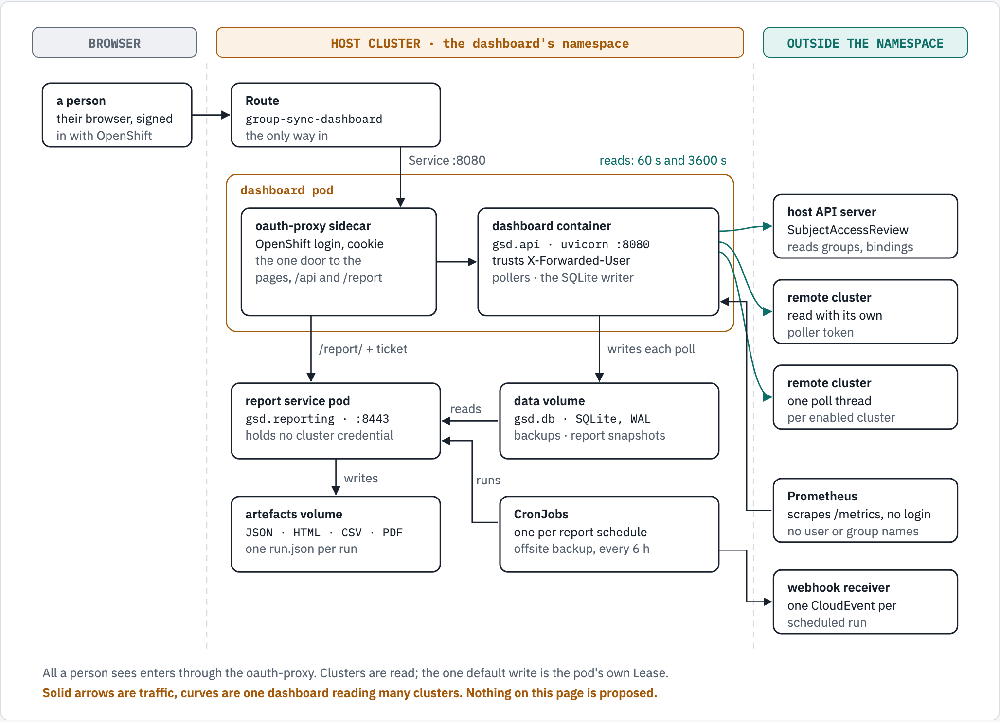
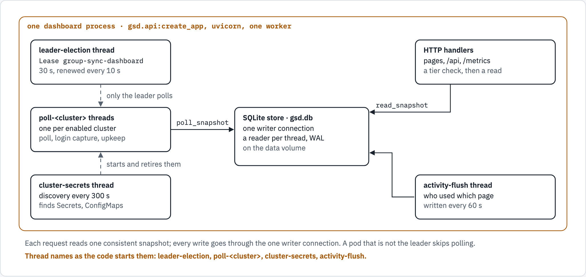
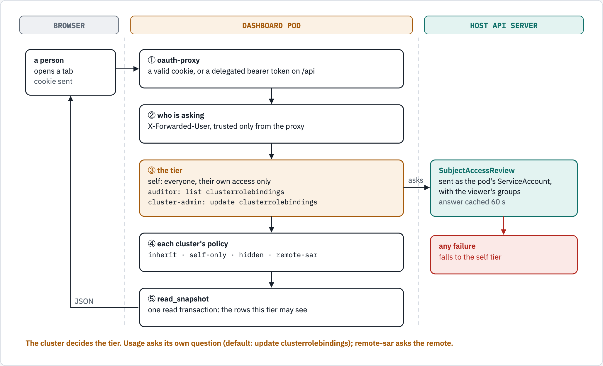
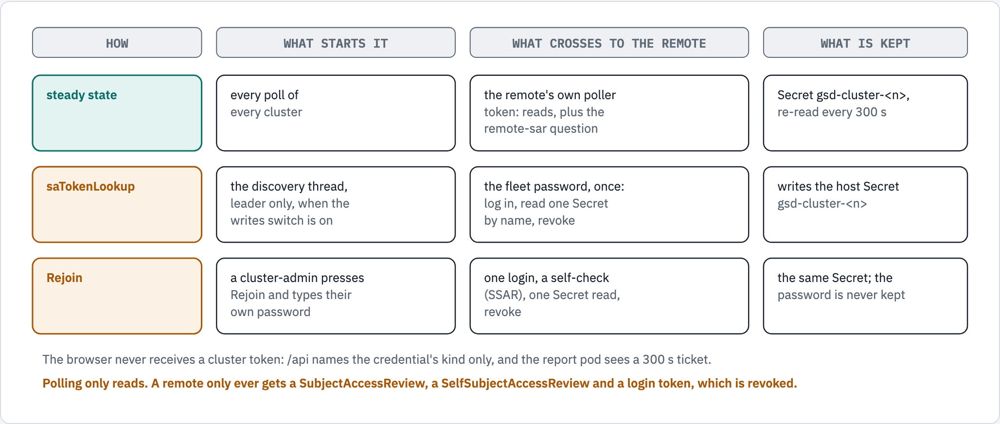

# How the OCP Access Tracking Dashboard works inside — the architecture in seven figures

| | |
|---|---|
| **Status** | Current: every figure draws shipped behaviour; nothing here is proposed |
| **Checked against** | Application 5.8.0, chart 0.70.12, on 2026-10-08 |
| **For** | Anyone who has to run, review or extend the dashboard and wants the picture before the detail |
| **Depth** | [reference-architecture.md](reference-architecture.md) holds the full reasoning; this guide is its map |

Each section is one figure, one claim. Every label was read from the code named under it; solid shapes are
behaviour the code has today. A text twin follows each figure for readers who cannot see images, and the two change
together.

---

## 1. The whole system

<!-- markdownlint-disable MD033 -->
<picture>
  <source media="(prefers-color-scheme: dark)" srcset="../diagrams/architecture/overview.dark.png">
  <source media="(prefers-color-scheme: light)" srcset="../diagrams/architecture/overview.light.png">
  
</picture>
<!-- markdownlint-enable MD033 -->

*Figure 1. Every component that runs in steady state, the one door a person comes through, and what each part reads
and writes. Not drawn: the recovery Deployment (0 replicas unless `recovery.enabled`), the `secretsMint` hook Job,
the PodDisruptionBudgets and the NetworkPolicy. Prometheus also scrapes the report service at `/report/metrics`.*

```text
BROWSER            HOST CLUSTER · the dashboard's namespace                     OUTSIDE THE NAMESPACE
a person ──HTTPS──▶ Route ──Service :8080──▶ dashboard pod
                                             ├ oauth-proxy sidecar ──▶ dashboard container ──reads──▶ host API server
                                             │      │                         │                ──reads──▶ each remote cluster
                                             │  /report/ + ticket       writes each poll       ◀─scrapes── Prometheus
                                             ▼      ▼                         ▼
                                   report service pod ◀──reads── data volume (gsd.db, backups, report snapshots)
                                             │ writes
                                             ▼
                                   artefacts volume (JSON · HTML · CSV · PDF, run.json)
                                   CronJobs ──runs──▶ report service pod;  CronJobs ──▶ webhook receiver
```

Where in the code:

- The Deployment, its oauth-proxy sidecar and the second upstream to `/report/`:
  `charts/group-sync-dashboard/templates/deployment.yaml`.
- The report service and its read-only mount of the data volume: `charts/group-sync-dashboard/templates/report-deployment.yaml`.
- One CronJob per report schedule: `charts/group-sync-dashboard/templates/report-cronjob.yaml`; the offsite backup:
  `charts/group-sync-dashboard/templates/backup-offsite.yaml`.
- The scrape targets: `charts/group-sync-dashboard/templates/monitoring.yaml`.

## 2. Inside the dashboard process

<!-- markdownlint-disable MD033 -->
<picture>
  <source media="(prefers-color-scheme: dark)" srcset="../diagrams/architecture/dashboard-process.dark.png">
  <source media="(prefers-color-scheme: light)" srcset="../diagrams/architecture/dashboard-process.light.png">
  
</picture>
<!-- markdownlint-enable MD033 -->

*Figure 2. The threads one dashboard process starts, and how they share one SQLite database: one writer, many
readers.*

```text
leader-election  Lease group-sync-dashboard, 30 s, renewed every 10 s   - - only the leader polls - ->  poll-<cluster> (one per enabled cluster)
cluster-secrets  discovery every 300 s                                  - - starts and retires them - ->  poll-<cluster>
poll-<cluster>   ──poll_snapshot──▶ SQLite store gsd.db (one writer connection, a reader per thread, WAL)
HTTP handlers    ──read_snapshot──▶ SQLite store
activity-flush   ──every 60 s────▶ SQLite store
```

Where in the code:

- Start-up builds the store, the elector, the poller and the recorder: `local-development/gsd/api.py#build_app`; the
  lifespan starts the threads: `local-development/gsd/api.py#create_app`.
- `leader-election`: `local-development/gsd/leader.py#LeaderElector`. `poll-<cluster>` and `cluster-secrets`:
  `local-development/gsd/poller.py#Poller`. `activity-flush`: `local-development/gsd/activity.py#ActivityRecorder`.
- One writer, per-thread readers, `poll_snapshot` and `read_snapshot`: `local-development/gsd/store.py`.

## 3. One poll cycle

<!-- markdownlint-disable MD033 -->
<picture>
  <source media="(prefers-color-scheme: dark)" srcset="../diagrams/architecture/poll-cycle.dark.png">
  <source media="(prefers-color-scheme: light)" srcset="../diagrams/architecture/poll-cycle.light.png">
  
</picture>
<!-- markdownlint-enable MD033 -->

*Figure 3. What one poll thread does each cycle, step by step, with the default intervals.*

```text
① leadership and the credential   not the leader: ask again in 5 s; self-login: use the session token
② poll_once (every 60 s)          GroupSync CRs, Groups, Users, Identities, OAuth → users and sync events commit
                                  first; the rest in one poll_snapshot transaction
③ login capture                   the oauth-server audit log via nodes/<n>/proxy, byte cursors, ≤ 8 MiB per node per cycle
④ upkeep, in this order           checkpoint, backup every 6 h (keep 4), retention, KPI rollup;
                                  then, leader only: report snapshot every 300 s, usage pull
⑤ refresh_bindings (every 3600 s) RoleBindings, ClusterRoleBindings, Namespaces, NamespaceConfig, GroupConfig, Kyverno
⑥ wait                            until 60 s after the cycle began (at least 1 s), then ① again
Beside the cycles: the cluster-secrets thread, every 300 s (discovery, saTokenLookup, the daily fleet ping).
```

Where in the code:

- The loop and its order: `local-development/gsd/poller.py#Poller._run_cluster`; the upkeep tail:
  `local-development/gsd/poller.py#Poller._after_poll`; the backup gate on event history:
  `local-development/gsd/poller.py#Poller._prune_history`.
- `local-development/gsd/poller.py#poll_once`, `local-development/gsd/poller.py#refresh_bindings`; login capture:
  `local-development/gsd/auditlog.py`.
- The defaults: `local-development/gsd/config.py#Settings` (`poll_interval_seconds`, `binding_interval_seconds`,
  `discovery_interval_seconds`, `backup_interval_hours`, `backup_keep`).

## 4. How a request is answered

<!-- markdownlint-disable MD033 -->
<picture>
  <source media="(prefers-color-scheme: dark)" srcset="../diagrams/architecture/request-path.dark.png">
  <source media="(prefers-color-scheme: light)" srcset="../diagrams/architecture/request-path.light.png">
  
</picture>
<!-- markdownlint-enable MD033 -->

*Figure 4. From the browser to the rows it may see: the proxy, the identity, the tier the cluster decides, the
cluster's policy, one read.*

```text
a person ─▶ ① oauth-proxy        a valid cookie, or a delegated bearer token on /api
           ② who is asking      X-Forwarded-User, trusted only from the proxy
           ③ the tier           self (everyone, their own access) · auditor: list clusterrolebindings ·
                                cluster-admin: update clusterrolebindings
                 ──asks──▶ host API: SubjectAccessReview, as the pod's ServiceAccount, with the viewer's groups,
                                     answer cached 60 s;  any failure ──▶ the self tier
           ④ each cluster's policy  inherit · self-only · hidden · remote-sar
           ⑤ read_snapshot      one read transaction: the rows this tier may see ──JSON──▶ the browser
```

Where in the code:

- The identity header and the tiers: `local-development/gsd/api.py#build_app` (`viewer_scope`,
  `require_admin_tier`); the SubjectAccessReview and its cache: `local-development/gsd/kube.py#TierResolver`.
- The per-cluster policies: `local-development/gsd/config.py#remote_policy`; the questions each tier asks:
  `charts/group-sync-dashboard/values.yaml` (`adminSar`, `usageAdminSar`, `clusterAdminSar`).
- The tiers from a reader's side: [ACCESS_CONTROL.md](ACCESS_CONTROL.md).

## 5. How a report is made

<!-- markdownlint-disable MD033 -->
<picture>
  <source media="(prefers-color-scheme: dark)" srcset="../diagrams/architecture/reporting.dark.png">
  <source media="(prefers-color-scheme: light)" srcset="../diagrams/architecture/reporting.light.png">
  
</picture>
<!-- markdownlint-enable MD033 -->

*Figure 5. Two ways in, one pipeline: a person's ticket or a schedule's token, a bounded queue, a read-only snapshot,
and documents on the artefacts volume.*

```text
a person (auditor tier) ─▶ browser, with a ticket (HMAC, 300 s, minted by the dashboard) ─┐
CronJob (trigger.py, the shared service token) ───────────────────────────────────────────┴▶ POST /report/api/runs
   ─▶ queue (at most 8) ─▶ report-worker ─▶ one run: ① newest snapshot, read-only ② assemble
                                                     ③ JSON, then HTML · CSV · PDF as asked
   data volume (report snapshot every 300 s, keep 2) ──reads──▶ one run ──▶ artefacts volume (files + run.json)
   CronJob, after --wait ─▶ webhook receiver: one CloudEvent per scheduled run
Retention: scheduled runs 90 days, the newest 2 per schedule and cluster kept longer; manual runs 3 days, at most 500.
```

Where in the code:

- The service and its two credentials: `local-development/gsd/reporting/server.py`; the ticket:
  `local-development/gsd/reporting/ticket.py`.
- The queue and the worker: `local-development/gsd/reporting/runs.py#RunManager`; the snapshot it opens:
  `local-development/gsd/reporting/snapshot.py`.
- Schedules and delivery: `local-development/gsd/reporting/trigger.py`; retention defaults:
  `local-development/gsd/reporting/config.py`.
- The eleven reports and what each answers: [the report catalogue](../reports/README.md).

## 6. Credentials and trust boundaries

<!-- markdownlint-disable MD033 -->
<picture>
  <source media="(prefers-color-scheme: dark)" srcset="../diagrams/architecture/credentials.dark.png">
  <source media="(prefers-color-scheme: light)" srcset="../diagrams/architecture/credentials.light.png">
  
</picture>
<!-- markdownlint-enable MD033 -->

*Figure 6. Three ways a cluster credential is obtained or used, what crosses to the remote cluster in each, and what
stays on the host. A fourth, userSelfLogin, polls with the fleet account's session token; the reference architecture
describes it.*

```text
HOW             WHAT STARTS IT                             WHAT CROSSES TO THE REMOTE                    WHAT IS KEPT
steady state    every poll of every cluster                the remote's own poller token: reads,         Secret gsd-cluster-<n>,
                                                           plus the remote-sar question                  re-read every 300 s
saTokenLookup   the discovery thread, leader only,         the fleet password, once: log in,             writes the host Secret
                when the writes switch is on               read one Secret by name, revoke               gsd-cluster-<n>
Rejoin          a cluster-admin presses Rejoin and         one login, a self-check (SSAR),               the same Secret; the
                types their own password                   one Secret read, revoke                       password is never kept
The browser never receives a cluster token. Polling only reads; a remote only ever gets a SubjectAccessReview, a
SelfSubjectAccessReview and a login token, which is revoked.
```

Where in the code:

- Each credential kind: `local-development/gsd/config.py#ClusterConfig`; requests: `local-development/gsd/kube.py#ClusterClient`.
- saTokenLookup: `local-development/gsd/fleetlookup.py` and `local-development/gsd/fleetlogin.py`; Rejoin:
  `local-development/gsd/rejoin.py`.
- The full decision record, with its own figures: [DESIGN_remote_cluster_access.md](../design/DESIGN_remote_cluster_access.md).

## 7. What is kept, and for how long

<!-- markdownlint-disable MD033 -->
<picture>
  <source media="(prefers-color-scheme: dark)" srcset="../diagrams/architecture/data-lifecycle.dark.png">
  <source media="(prefers-color-scheme: light)" srcset="../diagrams/architecture/data-lifecycle.light.png">
  
</picture>
<!-- markdownlint-enable MD033 -->

*Figure 7. The database, its copies, the report snapshot and the report runs, with each default retention.*

```text
gsd.db  current state (clusters, groups, users, bindings, namespaces) + history by type:
        sync 730 d · logins 400 d · dashboard use 400 d · Kyverno events 90 d · KPI rollup 730 d · membership kept
  ──copy──▶ local backups (every 6 h, keep 4) ──▶ offsite copy (CronJob every 6 h, a PVC or S3)
  ──copy──▶ report snapshot (every 300 s, keep 2) ──▶ report runs (scheduled: 90 d, newest 2 kept longer · manual: 3 d)
Sync, membership and Kyverno history waits for a successful backup; logins, dashboard use and KPI rows do not.
```

Where in the code:

- Retention defaults: `local-development/gsd/config.py#Settings`; the KPI rollup's:
  `local-development/gsd/kpi/rollup.py#KPI_DAILY_RETENTION_DAYS`.
- Backups and the report snapshot: `local-development/gsd/store.py`; pruning held until a backup:
  `local-development/gsd/poller.py#Poller._prune_history`; the prunes it does not hold:
  `local-development/gsd/logincapture.py#_prune`, `local-development/gsd/activity.py#ActivityRecorder.prune`,
  `local-development/gsd/kpi/rollup.py#prune`.
- Backup and restore for an operator: [the backup runbook](../../charts/group-sync-dashboard/docs/RUNBOOK_backup_restore.md).

---

## Diagram sources

The seven figures are rendered from one page, `docs/diagrams/architecture/source.html` (inline SVG, light and dark
palettes), by [diagram-kit](https://github.com/ephico2real2/diagram-kit) v0.2.4, which writes a PNG only when the page
passes its checks (a fallback font, a label past its box, text under 4.5:1 in either theme, a dashed arrow with no
label, sideways scroll at 375 px). From the repository root:

```sh
python3 -m venv .venv-diagrams
.venv-diagrams/bin/pip install "diagram-kit @ git+https://github.com/ephico2real2/diagram-kit@v0.2.4"
.venv-diagrams/bin/playwright install chromium
.venv-diagrams/bin/diagram-render docs/diagrams/architecture/source.html docs/diagrams/architecture \
  overview,dashboard-process,poll-cycle,request-path,reporting,credentials,data-lifecycle
```

If the code a figure draws changes, change the figure, its text twin and the page together, and render again.
