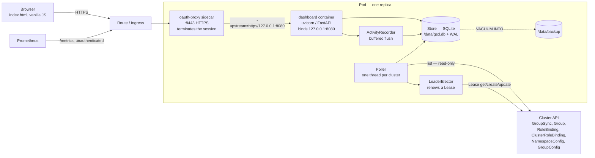
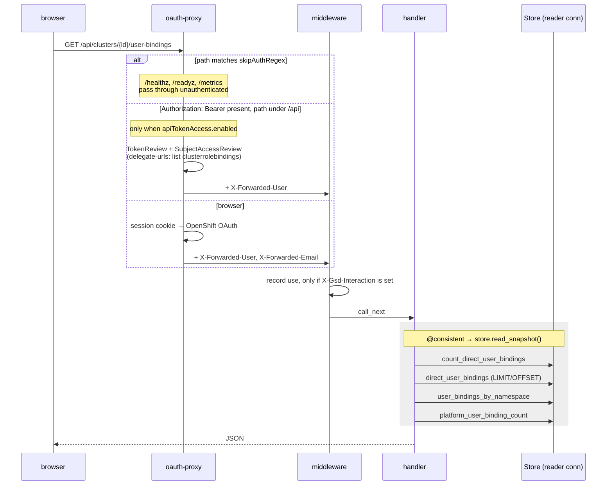
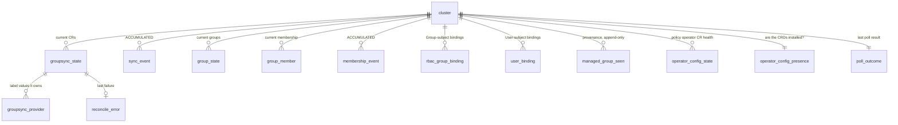
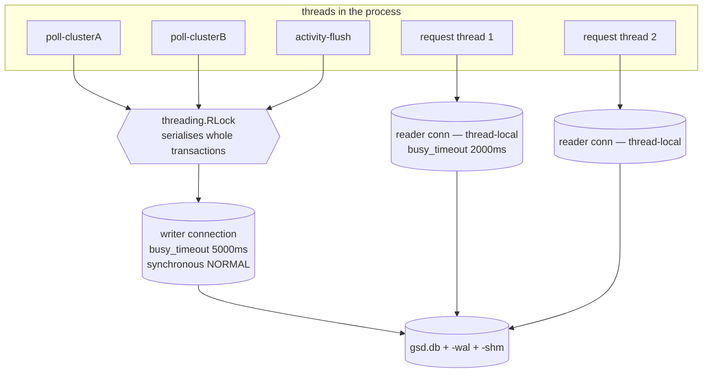
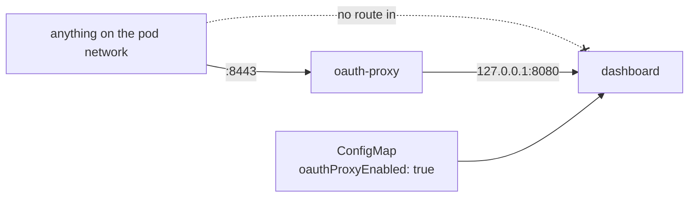
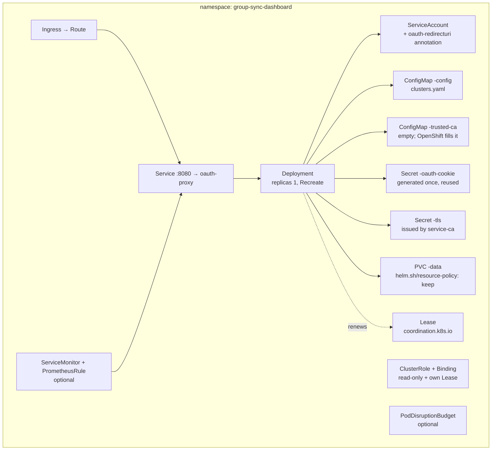
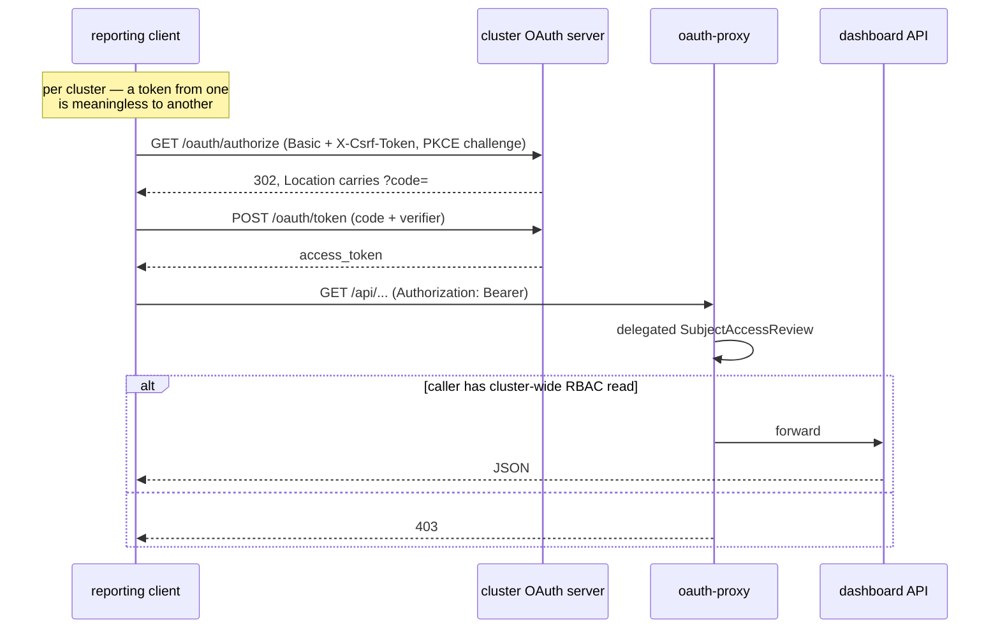

# Reference architecture

For someone who has to operate or extend this and has never seen it. It collects the
reasoning that is otherwise spread across code comments, `values.yaml` and the other
documents in this directory, and it says where each claim lives so you can check it.

Everything here was read out of the code on `feat/operator-config-health`. Where a choice
is non-obvious, the file and line that decides it is cited.

---

## 1. What this is

A read-only observer of two OpenShift operators and the RBAC they produce:

* the **group-sync-operator** (`redhatcop.redhat.io/v1alpha1 GroupSync`), which pulls LDAP
  groups into `user.openshift.io/v1 Group` objects, and
* the **namespace-configuration-operator** (`NamespaceConfig`, `GroupConfig` — same API
  group), which templates the RoleBindings that give those groups their access.

It polls both, plus every RoleBinding and ClusterRoleBinding, stores what it sees in SQLite
on a PersistentVolume, and serves a single-page UI and a JSON API over it.

**Everything it reports is an absence.** A RoleBinding whose Group subject does not exist
still looks healthy in `oc get rolebinding`. A group that stopped being refreshed still
belongs to a CR reporting success. A user who dropped out of a group produces no event and
no log line. None of these fire a reconcile error, so nothing upstream will tell you.

### What it is not

It does not evaluate role rules. Every binding view in this system is **direct bindings
only** — the roles' `rules` are never fetched or expanded, and the API says so in its own
payload (`gsd/api.py:365`). An incomplete effective-permission calculation would show
access as absent when it is not, and a false negative there closes an incident wrongly.

It does not create, edit or delete anything it observes — not a GroupSync CR, not a Group, not
a binding's subjects, its `roleRef` or its metadata. The ClusterRole carries no write verb at
any value of any chart setting (`templates/rbac.yaml:33-47`), and the only object the dashboard
writes anywhere is its own leader-election Lease. There was one write path, which labelled the
unmanaged grants it discovered; §7.3 is the live-cluster measurement that removed it.

---

## 2. Component map



The Lease arrow is the whole of the system's write surface, and the Lease is the dashboard's own
coordination object — not anything it reports on. Every arrow to the observed objects is a
`list`. §7.1.

### The Python modules

| Module | Responsibility |
|---|---|
| `gsd/config.py` | Load and validate `clusters.yaml`; resolve tokens and CA bundles on demand |
| `gsd/kube.py` | Read-only REST client; one `ClusterClient` per cluster; flattens API objects into views |
| `gsd/poller.py` | The poll loop; one thread per enabled cluster; leader-gated |
| `gsd/leader.py` | Lease acquisition and renewal against `coordination.k8s.io` |
| `gsd/store.py` | The only module containing SQL or the string `sqlite3` |
| `gsd/storage.py` | `StorageBackend` Protocol, and `open_backend()` — the one place an engine is named |
| `gsd/state.py` | Pure functions: cron maths, CR health, alert computation. No I/O |
| `gsd/audit.py` | The unmanaged-grant discovery plan: which bindings are findings, which are resolved, and the evidence for each. Pure decisions; the poller logs them |
| `gsd/activity.py` | Who used the dashboard, buffered in memory, flushed on an interval |
| `gsd/metrics.py` | Prometheus collector; reads the store at scrape time |
| `gsd/api.py` | FastAPI routes, the `@consistent` decorator, app assembly |
| `gsd/static/index.html` | The entire frontend — one file, no build step, strict CSP |

`gsd/state.py` and `gsd/audit.py` are deliberately I/O-free so their invariants are plain
unit tests (`gsd/audit.py:3-5`). That matters most for `audit.py`: nothing is written back to the
cluster, so the classification and the evidence cited for it are the entire product, and both are
testable without one (`gsd/audit.py:26-31`).

---

## 3. How a poll flows

One thread per enabled cluster (`gsd/poller.py:476`). Separate threads rather than a shared
sequential loop because a cluster that black-holes TCP would otherwise hold every other
cluster's data hostage for the length of the timeout (`gsd/poller.py:6-9`).

Two cadences on that one thread. Groups every `pollIntervalSeconds` (60s); bindings and
operator-config health every `bindingIntervalSeconds` (300s). Bindings are listed across
every namespace — roughly 154 paged requests at 100× the reference cluster's scale — and
they change on administrative action rather than on a sync schedule, so minute-level
freshness buys nothing (`gsd/config.py:181-190`).

```mermaid
sequenceDiagram
  participant T as poll thread
  participant L as LeaderElector
  participant K as cluster API
  participant S as Store

  loop every pollIntervalSeconds
    T->>L: is_leader?
    alt not leader
      L-->>T: false
      Note over T: stand by; re-check in 5s,<br/>not one poll interval
    else leader
      L-->>T: true
      T->>K: list groupsyncs (paged)
      T->>K: list groups (paged)
      K-->>T: objects
      T->>S: record_sync_event — committed FIRST, outside the snapshot
      rect rgb(238, 238, 238)
        Note over T,S: poll_snapshot() — one transaction
        T->>S: upsert_reconcile_error per CR
        T->>S: replace_groupsync_state
        T->>S: replace_group_state
        T->>S: record_managed_groups
        T->>S: sync_members → membership_event rows
        T->>S: record_poll(ok)
      end
      T->>S: maintain() — WAL checkpoint, poll thread only
      T->>S: backup() if due
    end
    alt binding refresh due
      T->>K: list rolebindings + clusterrolebindings (paged)
      T->>K: list namespaceconfigs + groupconfigs
      T->>S: replace_bindings, replace_user_bindings, replace_operator_configs
      opt unmanagedAudit.mode is log
        T->>S: all_bindings — classify, then log each finding
        Note over T,K: no call to K; nothing is written back
      end
    end
  end
```

Five things in that diagram are load-bearing.

**The whole cycle is one transaction** (`gsd/poller.py:164`, `gsd/store.py:469`). It used
to be nine, and any read landing mid-cycle saw a mixture — measured at 11,598 torn reads out
of 19,208. Worse, a cycle that died halfway could still stamp `record_poll(OK)` over
half-written state, which looks healthy. `record_poll` is now the last statement inside the
transaction, so `ok` is only true if everything above it committed.

**`record_sync_event` is deliberately outside it and committed first**
(`gsd/store.py:476-480`). Its uniqueness key is the operator's own
`lastSyncSuccessTime`, so a rollback loses an observation permanently rather than
re-deriving it next cycle. It is `INSERT OR IGNORE`, so committing early costs nothing and
repeats harmlessly.

**`membership_event` is inside it, and safe to be** (`gsd/store.py:482-485`). A membership
change self-heals: the next poll re-derives the identical change with a later `observed_at`,
degrading the timestamp by one poll interval — which is already the documented error bar on
"when did this person lose access?" (`charts/.../values.yaml:162-169`).

**A binding-refresh failure does not mark the cluster unreachable**
(`gsd/poller.py:230-236`). It needs RBAC the group poll does not, so a 403 here must not
blank out perfectly good group data. Logged, and retried next interval.

**A 200 without an `items` key is refused, not read as empty** (`gsd/kube.py:280-286`).
`payload.get("items") or []` turns a proxy error page or a JSON login redirect into an
authoritative empty result; the poll then deletes every group and writes a departure for
every member into append-only history, and reports `ok`. Measured: one such response wiped
60 groups and wrote 120 false `removed` events.

### Attributing a group to a CR

The operator labels each Group it creates `<groupsync-name>_<provider-name>`
(`group-sync-operator.redhat-cop.io/sync-provider`). The provider's name is in the CR spec;
the label is only observable on the Groups. `provider_keys_for` (`gsd/poller.py:34`)
reconciles the two: when the CR declares provider names it reconstructs the expected labels
and intersects them with what the Groups actually carry — reconstruction checked against
observation, rather than either alone. When the spec declares none it falls back to prefix
matching, awarding a label to the longest matching CR name.

Two CRs with the **same name in different namespaces** produce byte-identical labels, and no
amount of care resolves that — namespace appears nowhere in the label. `ambiguous_attribution`
(`gsd/poller.py:73`) detects the collision and the poller logs it rather than silently
attributing the groups to whichever CR was iterated first.

---

## 4. How a request flows



**`@consistent` is applied to multi-call handlers only** (`gsd/api.py:111-131`). Making the
poll atomic took torn reads from 60.38% to 3.00%, not to zero, because a handler that calls
the store six times issues six independent statements and a poll can commit between any two
of them. WAL gives each *statement* a consistent snapshot; it does not give a *sequence* of
statements the same one. Only an explicit read transaction does.

It is deliberately **not** applied to single-call handlers: a snapshot holds a WAL read-mark
and blocks checkpointing, so it is worth taking only where it buys consistency
(`gsd/store.py:512-519`). The wrapped function must be synchronous and must not stream,
yield or await — that would hold the snapshot for the life of the response rather than the
life of the query. `tests/test_read_snapshot_scope.py` enforces it.

The metrics collector faces the same trap from the other side and solves it explicitly:
`collect()` is a generator that prometheus_client drives lazily while writing the response,
so it gathers everything inside a snapshot, releases it, *then* yields (`gsd/metrics.py:51-68`).

**The usage middleware counts human actions, not requests** (`gsd/api.py:84-109`). The page
polls itself every 30s and each poll is several API calls; counting requests measured how
long a tab had been open, not whether anyone used the dashboard — one real session read 722.
The browser stamps `X-Gsd-Interaction` on exactly one request per user-initiated refresh
(`gsd/activity.py:56-66`). The three unauthenticated paths are excluded *explicitly* rather
than by assuming they arrive header-less, because they bypass the proxy and the caller
decides what headers they carry (`gsd/api.py:96-100`).

### The UI

One self-contained file, `gsd/static/index.html`, vanilla JS, no build step, strict CSP.
Six tabs (`index.html:761-766`):

| Tab | Reads | Shows |
|---|---|---|
| Overview | `/api/clusters`, `/api/alerts`, `/api/clusters/{id}/groupsyncs`, `/api/clusters/{id}/operator-configs` | cluster cards, computed alerts, CR list and detail, operator-config health |
| Groups | `/api/clusters/{id}/groups`, `.../groups/{name}`, `.../users/{name}` | every group; drill into members, first-seen, the change log, and the access it grants; reverse lookup per user |
| Access granted | `/api/clusters/{id}/bindings/findings` | every group-subject binding, classified `ok` / `dangling` / `unresolved` / `built_in` / `unmanaged` |
| RBAC policy | `/api/clusters/{id}/bindings/findings`, `.../operator-configs` | the policy operator's CR health beside the provenance of the bindings it templates |
| Namespace audit | `/api/clusters/{id}/user-bindings` | grants that name a person rather than a group, ranked per namespace by privilege; server-side paging, sortable columns, namespace selector |
| Usage | `/api/dashboard/activity` | who used the dashboard, per user per UTC day |

The `index.html` served at `/` carries `Cache-Control: no-cache, must-revalidate`
(`gsd/api.py:621-631`). Without it browsers apply heuristic caching to HTML and keep serving
the old page after a redeploy — the whole app is this one file, so a stale shell silently
disables every fix behind it.

The Namespace audit tab applies its namespace filter **server-side**
(`index.html:1964-1971`): the point of the filter is to stop shipping thousands of rows, and
a client-side filter still pays for every one of them over the wire and in the DOM.

---

## 5. Data model

Fifteen tables. The distinction that governs every operational decision in this system:

> **`sync_event` and `membership_event` are accumulated and cannot be re-fetched. Everything
> else is a cache the next poll rebuilds.**

The Kubernetes API keeps no history. A CR carries one timestamp and a Group carries one of
its own; the timeline exists only because this process observed it. Current state self-heals
within one poll. The timeline does not self-heal at all.



`dashboard_user_activity` is the fifteenth and belongs to no cluster — it is who used the
dashboard, which has no cluster dimension.

### The tables that are not obvious

**`managed_group_seen`** (`gsd/store.py:221-232`) is append-only and never replaced. It is
what separates "this binding's group broke" from "this binding names something that never
existed" — the whole point is that it outlives the Group object's disappearance.

**`groupsync_provider`** is a separate table rather than a column because a CR may declare
several providers and each produces its own label value. The single `provider_key` column it
replaced held only the first, so every group of every later provider had no owner and was
never staleness-checked (`gsd/store.py:67-73`).

**`group_member` is not wholly replaced each poll**, unlike `group_state` — `first_seen_at`
must survive, or "when did this user join?" resets on every cycle and answers nothing
(`gsd/store.py:114-115`).

**`operator_config_presence`** stores absence explicitly. "Operator not installed" and
"installed with zero CRs" are different truths, and the UI must not render "all healthy" for
a concept the cluster does not have. `fetch_operator_configs` returns `None` for the first
and `[]` for the second (`gsd/kube.py:423-459`).

**`dashboard_user_activity` is aggregated, not a page-view log** (`gsd/store.py:234-245`).
Aggregation bounds the table at users × days — a hundred people for three years is ~110k
rows — where a request log grows without limit. It also keeps this to "who uses this and
when", not "who looked at whose membership".

### Derived, never stored

CR state (`ok` / `late` / `overdue` / `unknown`), `next_expected`, `interval_seconds`,
`error_is_current` and every alert are computed at request time from `gsd/state.py`. Two
subtleties are worth knowing before reading a screen:

**`ReconcileError` is sticky.** The operator never clears it on a later success, so a healthy
CR carries both `ReconcileSuccess` and `ReconcileError` at `status: True` indefinitely. Only
the ordering of the transition times decides whether the error is current
(`gsd/state.py:110-123`). The same trick is needed for `NamespaceConfig`/`GroupConfig`.

**The state thresholds have a grace allowance.** Applied literally, `ok <= 1 interval` flaps:
a sync lands 3-14s after its cron minute and our poll adds up to one interval on top, so a
healthy CR's observed age exceeds one interval near the end of every cycle
(`gsd/state.py:75-107`). `scheduleGraceSeconds` shifts the boundary; it does not widen the
classes, and it must stay above `pollIntervalSeconds`.

### Binding classification

One SQL `CASE` decides all five tiers (`gsd/store.py:1180-1203`), in this order:

| Finding | Meaning |
|---|---|
| `dangling` | the group was observed operator-managed and is now absent — the binding grants nobody |
| `built_in` | `system:*` — a virtual group that authorises real access and has no object by design |
| `unresolved` | names a group never seen managed, so possibly one that has never existed |
| `unmanaged` | the group resolves and is synced, but no policy system manages this binding and no human has annotated an exception |
| `ok` | everything else |

Three tiers for broken resolution rather than one, because on the reference cluster 110 of
149 distinct Group subjects are built-in virtual groups. Lumping those in gives 119 findings
of which 9 matter, and a list that is 92% noise is one operators stop reading
(`gsd/store.py:1156-1159`).

`unmanaged` additionally requires that the cluster demonstrably *uses* the policy operator —
`EXISTS (… managed_source IS NOT NULL)`. Without that clause, every binding on a cluster
that has never heard of `config-source` labels would flag.

**Only `dangling` alerts** (`gsd/api.py:487-489`). `built_in` is normal, and `unresolved`
cannot be told apart from a group that simply has not synced yet, so alerting on either
produces noise that trains people to ignore the view.

### Bounded reads

Every list endpoint that can grow with the size of the directory rather than with something
the dashboard controls is bounded, and reports what it left out:

| Endpoint | Bound | Reports |
|---|---|---|
| `/api/clusters/{id}/users` | `limit`, default 1000, max 10000 | `truncated`, `count`, `limit` |
| `/api/clusters/{id}/user-bindings` | `limit` default 200, max 5000, plus `offset` | `total` (before the limit), `truncated`, `excluded_platform` |
| `.../groupsyncs/{name}/events` | `limit` default 200, max 2000 | `count` |
| `/api/clusters/{id}/membership-changes` | `limit` default 100, max 1000 | `count` |
| `/api/dashboard/activity` | `limit` default 500, max 5000 | — |

On `/user-bindings` the flat list is paged and the per-namespace rollup deliberately is not
(`gsd/api.py:400-406`). The rollup is one row per namespace, bounded by a number the cluster
already keeps small, and it is the view that answers "where is my exposure" — truncating it
would make the risk ranking a ranking of an arbitrary subset. Ordering is applied before the
limit, so a truncated page is the worst N rather than an arbitrary N (`gsd/store.py:1314-1319`).

---

## 6. Concurrency and storage

### Why SQLite rather than a database server

The system stores tens of thousands of rows, is read by a handful of operators, and is not
in anyone's request path. A database server would add an operational dependency, a second
failure domain, credentials to rotate and a network hop, in exchange for concurrency this
workload does not need. What it stores instead lives in a file on the same volume the pod
already has.

The cost is real and is the premise of the entire deployment shape: **SQLite is
single-writer, and its WAL coordinates through an `mmap`'d `-shm` file that assumes every
process is on one host.** One replica, `Recreate`, leader election, four Helm `fail` guards,
the RWX-versus-`ReadWriteOncePod` argument and the WAL-on-NFS alert all exist because of
that one sentence. `docs/storage-coupling.md` §3.4 is explicit that moving to Postgres would
make all of it dead weight — which is why the seam below exists but has not been used.

### The storage seam

`gsd/storage.py` declares `StorageBackend`, a `runtime_checkable` Protocol of everything the
application may ask of storage. `gsd/storage.py:204 open_backend()` is the one place in the
codebase that names an engine, and `gsd/api.py:41` is the one place a backend is
constructed. `Poller`, `DashboardCollector` and `ActivityRecorder` all receive the instance;
none creates one.

`tests/test_storage_seam.py` enforces it with an AST check per module: no driver import and
no SQL outside `store.py`, and `Store` must still satisfy the Protocol. Adding
`import sqlite3` to `api.py` now fails `test_no_module_imports_a_database_driver[api.py]`,
verified by making that edit.

Two engine-neutral operations keep the poller and the collector from knowing what the engine
is: `maintain()` — "do whatever periodic upkeep you need", which for SQLite is a WAL
checkpoint and for a server engine would be nothing — and `health()`, a dict namespaced
under the engine that produced it. The metric *names* still say `gsd_sqlite_*` deliberately:
they are accurate today and appear in shipped alert rules, so renaming them is an
operator-visible breaking change that belongs with an actual engine change
(`gsd/storage.py:31-35`).

The Protocol is structural, not nominal, and `runtime_checkable` checks method **names**,
not signatures. The conformance guarantee comes from running the existing test suite against
a new backend, not from the Protocol.

### One writer, one reader per thread



The deployment runs uvicorn with `--workers 1`, so there is one process — but the request
threads are real. Every handler in `api.py` is a plain `def`, not `async def`, which is what
makes them safe to hold a synchronous SQLite snapshot; Starlette runs those in a threadpool.
That is why the reader connection is thread-local and why `_depth()` counts per thread.

**Readers never take the write lock.** Before the split, exactly one read completed during a
0.92s bulk write on fast local storage. `/readyz` performs a read and the probe gives up at
5s, so on slower storage that made the pod go NotReady during a routine refresh while
`/healthz` stayed green (`gsd/store.py:600-616`).

**Readers get a shorter busy timeout than the writer** — 2000ms against 5000ms — for the
same reason: a reader inheriting the writer's budget would turn a moment of contention into
a failed probe and a restarted pod (`gsd/store.py:390-393`).

**`:memory:` is special-cased** to reuse the writer connection, because each connection to
`:memory:` is its own empty database. Tests use it; the deployment uses a file.

**Transaction depth is per thread, not per Store** (`gsd/store.py:398-401`). A plain
attribute was a real bug: one poller thread opening a snapshot made every *other* thread's
write join a transaction it does not own, which `sqlite3` reports as "bad parameter or other
API misuse".

**Nesting `_tx()` raises rather than silently committing** (`gsd/store.py:559-598`). `RLock`
is reentrant, so an inner `with self._conn` commits the shared transaction on exit and the
outer block's work survives its own rollback. Measured: an outer transaction wrote
`phase-one`, called one ordinary store method, then raised, and `phase-one` was still there.
Eleven call sites could reach it. `_write()` (`gsd/store.py:448`) is the deliberate join —
it participates in an ambient transaction if one is open — and is what lets `poll_snapshot()`
turn nine transactions into one without every store method growing a `conn` parameter.

**A leaked read snapshot fails loudly** (`gsd/store.py:543-550`). Left alone, that thread
would serve permanently stale data with no error at all — measured: a worker pinned to a
2,000-row view while the truth was 4,000.

### WAL, and how it fails

`PRAGMA journal_mode=WAL` returns the mode **actually in force**, which is not always the
one requested. On a filesystem without working shared memory or POSIX locks — NFS, EFS, SMB,
most network RWX storage — SQLite refuses the switch and stays in rollback-journal mode,
where a reader blocks for the whole duration of the writer's transaction. It does that
silently. The store reads the mode back, logs at ERROR, and exports it as
`gsd_sqlite_wal_enabled` (`gsd/store.py:407-425`).

Checkpointing is the other silent failure. SQLite auto-checkpoints past ~1000 pages, but
PASSIVE: it gives up the moment a reader holds an older snapshot. Under a steady trickle of
API reads "gives up" can be every single time, and the WAL then grows without bound while
the database file itself stays small — surfacing as a **full volume**, not a database error.
So the poller forces `wal_checkpoint(TRUNCATE)` past `walCheckpointMb`, from the poll thread
only, and counts busy results (`gsd/store.py:640-673`). A busy result every cycle is the
starvation case; `gsd_sqlite_checkpoint_busy_total` is how you would ever notice.

### Schema migrations

The implicit mechanism silently does nothing: the schema is applied with
`CREATE TABLE IF NOT EXISTS`, so on an existing database a column added to the `SCHEMA`
string never appears — the statement no-ops and the first `SELECT` naming the new column
crashes at runtime on upgraded deployments while working perfectly on fresh ones. Measured
before the fix, not assumed.

`PRAGMA user_version` is the cursor (`gsd/store.py:274-307`). Steps run in order, inside the
writer's transaction, at startup, before anything reads. Each must be safe on a database
that already has the change, because a fresh database gets the new `SCHEMA` and *then*
replays every migration against it — which for `ALTER TABLE ADD COLUMN` means tolerating
`duplicate column name`.

### Backups

`config.backup` is on by default and is the only protection for the one thing that cannot be
re-fetched. `VACUUM INTO` rather than a file copy: it takes a read transaction for the
duration, so the output is a single consistent snapshot even while the poller writes. Copying
`gsd.db` with a live WAL produces a torn file that opens without complaint and is missing
the newest commits — a backup that restores, which is the worst kind
(`gsd/store.py:682-703`).

Run from the poll thread only, the same rule as the checkpoint. `keep` bounds the directory.

**The honest limit:** backups land on the same PVC they protect. They cover corruption, a bad
migration and accidental deletion — not loss of the volume. Shipping them off it is a
CronJob mounting the same claim read-only; the dashboard deliberately does not grow
credentials for object storage.

---

## 7. Security model

### 7.1 The ServiceAccount is read-only

`templates/rbac.yaml` grants `get` and `list` and nothing else, except on the Lease it needs to
elect a leader:

| API group | Resources | Verbs |
|---|---|---|
| `redhatcop.redhat.io` | `groupsyncs` | get, list |
| `redhatcop.redhat.io` | `namespaceconfigs`, `groupconfigs` | get, list |
| `user.openshift.io` | `groups` | get, list |
| `rbac.authorization.k8s.io` | `rolebindings`, `clusterrolebindings` | get, list — only when `rbac.bindings` |
| `coordination.k8s.io` | `leases` | get, create, update — only when `leaderElection.enabled` |

No `watch`, and no write verb on anything the dashboard reports on. The Lease is its own
coordination object; it is the only thing in the cluster the ServiceAccount can change.

This is checkable rather than asserted, and it holds at every setting: `helm template` with
`config.unmanagedAudit.mode` set to `off`, `log`, `annotate`, an unrecognised word and empty
renders zero occurrences of `"patch"`. A conditional `patch` on `rolebindings` and
`clusterrolebindings` used to render here; `rbac.yaml:33-47` records why it is gone, so nobody
adds it back. §7.3 is the measurement.

`roles`/`clusterroles` are deliberately **not** requested, since role rules are never
evaluated. `rbac.yaml:51-54` is careful to record that this is a statement of intent and not
an isolation boundary: OpenShift binds `basic-user` to `system:authenticated`, which already
grants `get`/`list` on clusterroles to every authenticated identity including this one.

The `namespaceconfigs`/`groupconfigs` grant is kept **even on clusters that will never
install the operator**. The dashboard auto-detects the CRDs; with the grant, an absent CRD
returns 404 and is recorded as "absent" quietly. Without it the same call returns 403, which
is treated as a refresh failure and logs a warning every cycle (`templates/rbac.yaml:15-19`).

### 7.2 Authentication is the sidecar's job, and the app knows it cannot tell



With `oauthProxy.enabled=true` three things happen together, and all three are needed:

1. The Deployment overrides the container command to bind **127.0.0.1**
   (`templates/deployment.yaml:61-77`), so the app is not reachable on the pod network.
2. The Service targets the **proxy's** port, not the app's (`templates/service.yaml:21-27`),
   so the proxy is the sole way in and cannot be bypassed from inside the cluster.
3. The chart reports its own `oauthProxy.enabled` into the ConfigMap as `oauthProxyEnabled`
   (`templates/configmap.yaml:26`).

The third exists because **the app cannot detect its own sidecar, and must not infer
authentication from the presence of `X-Forwarded-User`** — that header is exactly what an
unauthenticated caller would set (`gsd/config.py:226-230`). So the chart states it, and:

* `/api/dashboard/activity` returns **403** when the flag is false, whatever headers arrive
  (`gsd/api.py:569-574`);
* `/api/whoami` reports `authenticated: false` even when a username is present
  (`gsd/api.py:532-544`);
* activity recording is off whenever the flag is false, regardless of what
  `userActivity.enabled` says, and the mismatch is logged at startup (`gsd/api.py:48-59`).

**Access model for the UI: authentication, not authorization.** Anyone who can log into the
cluster can view — the OpenShift provider's documented default. Set `oauthProxy.sar` to a
SubjectAccessReview to require a permission as well.

**What that exposes, stated precisely**, because an earlier version of this section was wrong.
It said the dashboard "shows nothing a user could not already read with `oc get groups`". That
holds for the Groups tab alone. The dashboard reports the cluster's entire RBAC **binding**
surface — every ClusterRoleBinding and RoleBinding, the role each grants, the subjects holding
it — which `oc get groups` does not reveal. The identical error in the API's delegated review
was a measured privilege escalation: an account with only `list groups` read all 229 bindings
on the reference cluster, including a `cluster-admin` ClusterRoleBinding, while `oc list
clusterrolebindings` told it *no*. Treat UI access as equivalent to cluster-wide RBAC read.

**The API is gated to match.** `oauthProxy.apiTokenAccess.enabled` admits bearer tokens on the
`/api` prefix, and its review demands `list clusterrolebindings` cluster-wide. See
[`api-access.md`](api-access.md).

**The multi-cluster caveat** is not solved: OAuth authenticates against the *hosting* cluster
only, so one instance holding several clusters' data can show a user membership from a
cluster they have no rights on.

Three paths bypass the proxy by design — `/healthz`, `/readyz`, `/metrics`
(`oauthProxy.skipAuthRegex`). The health paths must be there or kubelet receives a 302 to the
login page and kills a healthy pod. `/metrics` is there so a ServiceMonitor can scrape
without credentials, which is precisely why the collector emits counts and states only and
**never a group or user name** (`gsd/metrics.py:6-12`). A distinct-active-users gauge was
removed for the same reason: unlabelled is not anonymous enough to publish unauthenticated
(`gsd/metrics.py:170-176`).

`/api/dashboard/activity` defaults to **self-only**. The response is identifiable personnel
data — who was present, on which days, between which times — and the argument that carries
the rest of this dashboard ("you could read the groups with `oc` anyway") is true of group
membership and false of who looked at it (`gsd/api.py:552-565`). `visibility: all` restores
the older behaviour as an explicit choice. Anything unrecognised means `self`, never `all`
(`gsd/config.py:298-312`).

There is deliberately no "admins only" tier: doing it properly means a SubjectAccessReview
from the app on every read, which makes a personal-data query depend on API-server
availability.

### 7.3 Unmanaged-grant discovery, and why nothing is written back

`config.unmanagedAudit.mode` is `off` | `log`, default `off`. `off` runs no discovery code at
all; `log` publishes every finding to the pod log. Neither needs a write verb, and anything
unrecognised is treated as `off` (`gsd/config.py:265-295`).

There was an `annotate` mode. It labelled the bindings it classified `unmanaged` — a
`rbac.ocp.io/unmanaged: "true"` label to select on, plus detected-at and detected-by annotations
for the audit detail — so an operator could run `oc get rolebindings,clusterrolebindings -A -l
rbac.ocp.io/unmanaged=true`. Enabled on a live OpenShift cluster it logged `plan — stamp 4, heal
0`, and then 0 of the 4 landed.

**Kubernetes refuses this, and not in a way more RBAC can fix.** Privilege-escalation prevention
requires the writer of an RBAC object to already hold every permission that object grants, and a
metadata-only patch is not exempt. The API server enumerated what it wanted: 175 additional rule
sets to label a ClusterRoleBinding granting nothing but `view`, and a single wildcard rule
(`{APIGroups:[*], Resources:[*], Verbs:[*]}`, i.e. cluster-admin) for the one granting
`cluster-admin`. `oc auth can-i patch clusterrolebindings --as=<the ServiceAccount>` answered yes
throughout — the RBAC grant was correct and irrelevant, because the escalation check runs after
it.

So a "special role" for this is 175+ rules of Kubernetes internals per binding class, or
`escalate` on `rbac.authorization.k8s.io` (the verb that switches the check off — cluster-admin
under a smaller name), or cluster-admin outright. All three give a read-only auditing tool the
most privilege on precisely the most dangerous grants it exists to report. The mode, the two
client methods that patched (86 lines, `gsd/kube.py:226-237` records what and why) and the
conditional `patch` grant (`templates/rbac.yaml:33-47`) were removed together. The full evidence,
including the API server's own error text from the pod, is in `docs/unmanaged-audit-design.md`.

**The discovery is the deliverable.** In `log` mode the poller classifies from the rows the same
cycle just stored, and emits one summary at INFO (`gsd/poller.py:331-339`):

```
crc-local: unmanaged-grant discovery — 4 outside the policy system, 0 resolved since the
last cycle. Full detail: GET /api/clusters/crc-local/bindings/findings
```

then one line per finding at **WARNING** — the poller emits INFO for every routine `httpx` call,
so a finding at INFO is buried by the traffic around it, and a level is the one thing every log
pipeline can filter on (`gsd/poller.py:341-356`):

```
UNMANAGED GRANT DISCOVERED — crc-local: ClusterRoleBinding demo-cluster-admin-crb
(cluster-wide) grants cluster-admin to group app-ocp-rbac-demo-cluster-admin, outside the
policy system (no config-source label, no exception annotation)
```

The line names the role and the group because it has to stand alone as evidence. The old wording
was `WOULD stamp ClusterRoleBinding -/demo-cluster-admin-crb`, which framed the log as a
rehearsal for a write and told a reader nothing about why the object mattered. Only the groups
whose rows were classified `unmanaged` are cited: a binding can name two groups and be unmanaged
for one of them, and citing the managed one would send a reader to inspect a grant that is fine
(`gsd/audit.py:62-68`).

`maxPerCycle` (default 20) bounds how many findings are *listed* individually per 300s refresh.
The summary always reports the true total and the remainder is counted as "not yet listed" rather
than dropped, so a misclassification bug costs one screenful of log per cycle instead of the
whole cluster at once. Resolutions are never capped — a closed finding must not queue behind new
ones (`gsd/audit.py:70-74`).

A resolution is reported at INFO when an object carrying `rbac.ocp.io/unmanaged=true` stops being
classified `unmanaged`. The dashboard never applies that label; an admin or a CI job does. The
line therefore exists to tell whoever applied it that the finding is closed and their label is
now stale, and it names the `oc label` that removes it (`gsd/poller.py:358-374`).

**Suppressing a finding is a cluster-admin action on the object.** This is the replacement for
the write path, not a gap left by it:

```bash
oc annotate clusterrolebinding <name> \
  rbac.ocp.io/unmanaged-exception="approved in TICKET-123, break-glass access"
```

The classifier reads that annotation and stops classifying the binding as `unmanaged`
(`gsd/store.py:1188-1194`), so it leaves the log, the RBAC policy tab and the API together. The
justification lives next to the object it describes, and the acknowledgement is performed by
somebody who holds the privileges that object grants — which the dashboard deliberately does not.
Separation of duties, not a limitation.

**What the removal costs, stated plainly.** Nothing labels the objects, so `oc get -l
rbac.ocp.io/unmanaged=true` selects nothing unless somebody privileged applies the label
themselves, and there is no on-cluster record of when a hand-made grant was first seen — the
first-detection timestamp went with the annotations. Both answers now come from the dashboard:
the API, the RBAC policy tab, or the log history. An upgrade that still sets `mode: annotate` is
accepted and runs as `log`, with a warning naming the removal; it deliberately does not fall back
to `off`, which would take the findings away from the one cluster known to have asked for them
(`gsd/config.py:277-293`).

### 7.4 Credentials and trust

Tokens are never in the config data model and are never returned by the API
(`gsd/config.py:1-11`). They are re-read from the mounted file at the moment they are needed,
deliberately not cached: a mounted Secret is updated in place on rotation, and a long-lived
process that cached at startup would keep presenting the stale one until restarted
(`gsd/config.py:97-103`).

CA bundles come from up to two mounted sources, colon-separated in `GSD_TRUSTED_CA_FILE` like
`SSL_CERT_FILE`, and are **loaded in turn rather than concatenated into a temp file** — the
root filesystem is read-only and writing certificates to `/tmp` to work around that would put
them somewhere less controlled than where they started (`gsd/config.py:35-55`). The parsed
context is cached keyed on the env value, and a null result is deliberately *not* cached,
because the injected ConfigMap is populated asynchronously and can legitimately be absent for
the first moments of a pod's life.

A per-cluster `caBundleFile` always wins over the cluster-wide bundle. That is a specific
statement about what that cluster trusts, and silently widening it would be the wrong kind of
helpful (`gsd/config.py:148-150`).

The container runs non-root, with a read-only root filesystem, all capabilities dropped and
`RuntimeDefault` seccomp. Every SQLite connection — writer *and* every per-thread reader —
has extension loading disabled, which is connection state, so hardening only the writer would
leave every API request thread unprotected (`gsd/store.py:313-346`).

---

## 8. Deployment topology



### The four `fail` guards

`templates/deployment.yaml:1-12` refuses to render four combinations rather than deploying
something broken:

| Combination | Refused because |
|---|---|
| `replicaCount > 1` with `leaderElection.enabled=true` | above one replica each pod owns its own database, so a pod that loses the lease stops polling but keeps serving reads from a copy that never updates again — worse than no election |
| `replicaCount > 1` with a non-RWX volume | RWO binds one **node** and RWOP one **pod**, so the extra replicas stay Pending with no error on the Deployment |
| `ReadWriteOncePod` with `strategy: RollingUpdate` | deadlock — the incoming pod cannot schedule until the outgoing releases the claim, and RollingUpdate will not terminate the outgoing until the incoming is Ready |
| `replicaCount == 1` with persistence and `strategy: RollingUpdate` | at one replica both pods use `/data/gsd.db`, and two processes on one SQLite file corrupt rather than error. The guard above catches only RWOP, where the scheduler refuses the second pod anyway; the **default** RWX happily mounts twice and was therefore the dangerous case |

### The derived values

`strategy` (`templates/deployment.yaml:28`) — `Recreate` at one replica, `RollingUpdate`
above. Recreate exists so the outgoing and incoming pods never contend for one file; above
one replica each pod owns its own file, and keeping Recreate would take every replica down at
once on each upgrade, removing the availability that was the only point of scaling.

`persistence.accessMode` (`_helpers.tpl:121`) — empty derives `ReadWriteOncePod` at one
replica and `ReadWriteMany` above. `ReadWriteOnce` is deliberately a default for neither: it
binds one *node*, not one pod, so two pods on the same node can both open the same file — the
guarantee it appears to give is not the guarantee SQLite needs. The shipped default is an
explicit `ReadWriteMany`, which trades that enforced guarantee for one that only holds
because of Recreate, leader election and `busyTimeoutMs`.

`GSD_DB_PATH` (`templates/deployment.yaml:84-98`) — `/data/gsd.db` at one replica,
`/data/$(POD_NAME)/gsd.db` above. A shared *volume* with unshared *files* is safe; a shared
*file* is not.

`ingress.host` (`_helpers.tpl:73-95`) — derived from the cluster's published apps domain via
`lookup`. It cannot simply be omitted: a Route auto-generates its host, an Ingress does not,
and OpenShift's ingress-to-route controller silently creates **no Route at all** for a
hostless Ingress. A default install was therefore unreachable with nothing reporting an
error. `lookup` returns empty during `helm template`, so the fallback `fail`s loudly rather
than emitting a wrong host — which is why every `helm template` needs
`--set ingress.host=…`.

The oauth cookie secret (`templates/oauth-secret.yaml:12-20`) — generated once, then reused
across upgrades by `lookup`ing the existing Secret. Generating it inline in the container
args, as several published examples do, silently regenerates on every `helm upgrade` and logs
every user out.

### Probes

Both probes deliberately use a **5s** timeout, not the 1s default: on a host that suspends
and resumes, every in-flight probe fails with "context deadline exceeded" and liveness kills
a healthy process — observed here, and it cascaded into a ~4h outage
(`charts/.../values.yaml:122-126`).

The two periods are far apart because of what each costs when it is wrong. Readiness runs
every 15s: being wrong only removes the pod from the Service and it comes straight back.
Liveness runs every 300s: being wrong destroys in-flight state and forces a container
restart, and this process holds the only copy of accumulated history between checkpoints.
`failureThreshold` moved 6 → 2 with that period, because 6 failures at 300s is a thirty-minute
wait before a wedged pod restarts, which is not a health check.

Neither probe is gated on a reachable cluster (`gsd/api.py:607-614`). An unreachable cluster
is a thing this dashboard exists to *display*, so failing readiness for one would take it
down exactly when it has something to report.

That leaves a real gap, and it is covered in Prometheus rather than by kubelet: `/healthz` is
unconditional and `/readyz` only reads the store, so both stay green while the poll loop is
dead and the dashboard serves frozen data. `GroupSyncDashboardNotPolling` is the alert that
catches it.

### Leader election is best-effort, not a write fence

Read `gsd/poller.py:358-377` before relying on it. Leadership is checked once in
`_run_cluster` before `poll_once` is entered; nothing re-checks it during the writes that
follow, and nothing carries a fence token the store could reject. A pod that passes the check
and then pauses — CPU throttling, a stop-the-world GC, a partition — can lose the lease, have
another pod take over, and still complete every one of its writes on resume. Two pods can
also both believe they hold it for up to `renew_seconds`, because expiry is judged against
each pod's own clock.

**What it buys:** the ordinary cases — a scale-up, a slow `Recreate` rollover — do not
produce two steady-state pollers. **What it does not buy:** a guarantee that only one process
ever writes. That comes from the deployment shape: one replica, `Recreate`, one file.

Making it a true fence would mean every store write comparing a monotonic token inside the
same transaction, with a new leader advancing it first — a distributed-systems protocol
layered over SQLite, and not proportionate for a single-writer application whose primary
defence is that there is only one pod.

Two implementation details are worth knowing. Outside a cluster the elector assumes sole
instance and sets itself leader, rather than refusing to poll and looking broken in local
development (`gsd/leader.py:203-209`). And a non-leader re-checks every 5s rather than every
poll interval (`gsd/poller.py:27-31`): leadership is acquired asynchronously, so at startup
the poll thread reliably loses the race once, and sleeping a full interval then would make
the first poll a whole interval late.

### Scaling, and why the answer is "don't"

One replica is the recommendation. This polls every 60s and serves a handful of operators; it
is not in anyone's request path, and a node drain costs one missed poll that the next one
heals. A second replica buys HTTP uptime and pays for it in **divergent history** — each pod
only has the timeline since its own database existed, so the Service answers "when did this
user leave?" differently depending on which pod you reach. Current state converges within one
poll; `sync_event` and `membership_event` do not converge at all.

If you do raise it, `leaderElection.enabled` must be `false` and the volume must be RWX; the
chart refuses to render otherwise. `gsd_dashboard_*` and every count metric then become
per-pod facts, so aggregate with `max()` or filter on `gsd_leader`, never `sum()`
(`gsd/metrics.py:86-96`).

---

## 8a. Reading a fleet without hosting anything

The dashboard is deployed **per cluster**, and each one publishes its own API at a predictable
hostname. That makes an aggregator a *reader*, not a service: it holds no database, stores no
copy, and has nothing to keep in sync.

```
https://group-sync-dashboard.apps.<cluster>.<company-domain>/api
```



**The token exchange is PKCE authorization-code**, derived by capturing `oc login -u -p
--loglevel=8` rather than from documentation alone. Two details are load-bearing and silent
when wrong: `X-Csrf-Token` must be present for the server to issue a basic-auth challenge, and
redirects must **not** be followed, because the authorization code arrives in the 302's
`Location` header.

**What gates it.** `oauthProxy.apiTokenAccess.enabled` adds `-openshift-delegate-urls` for the
`/api` prefix — which upstream applies *only* to requests carrying a bearer token or client
certificate, so the browser cookie flow is untouched — and binds `system:auth-delegator` to the
**proxy's** ServiceAccount, because the proxy is the party calling TokenReview and
SubjectAccessReview. Callers do not need that role.

The review demands `list clusterrolebindings` cluster-wide. That is deliberately stricter than
it first was: gating on `list groups` was a measured privilege escalation, since `/api` reports
the whole binding surface rather than group membership. See §7.

Granting a reporting account is deliberately **not** a chart value. With the correct review the
required permission is cluster-wide RBAC read, so a Helm value that handed it out would let
anyone who can edit a values file grant themselves that read. Use the stock role through the
normal RBAC process, preferring a group so the directory can revoke it:

```bash
oc adm policy add-cluster-role-to-group cluster-reader <ldap-group-for-reporting>
```

`local-development/cluster-report.py` implements the whole sequence and renders a governance
report. It tries the direct path first and falls back to `oc port-forward` for a cluster where
`apiTokenAccess` is off, so the report is identical either way and the transport is not baked
into the content.

**Why this beats one instance watching many clusters.** A single instance authenticates against
its *hosting* cluster's OAuth only, so it can show a user membership from a cluster they hold no
rights on — the unsolved caveat in §7. Per-cluster deployment plus API aggregation removes it:
each cluster authorises its own readers, and the aggregator never sees more than the caller is
entitled to on that cluster.

## 8b. Time

**Stored and served times are UTC and end in `Z`.** Every write goes through
`datetime.now(UTC)`, so nothing about a deployment's configuration can shift what lands in the
database or what the API returns.

**Displayed times are the container's timezone**, set by `timezone` in the chart (default
`America/New_York`) and reported to the browser at `/api/version`. Conversion happens at the
very edge, in `Intl.DateTimeFormat`, so the data means one thing regardless of where it is read.
The zone label is resolved per instant rather than once, because the abbreviation depends on the
date being formatted — January is EST where July is EDT.

**Log lines carry the offset** (`%z`), so a line reading `17:31:31-0400` and a stored
`21:31:31Z` are visibly the same moment.

Two consequences worth knowing. `tzdata` must be installed for `TZ` to mean anything — UBI9
minimal strips `/usr/share/zoneinfo`, and with it absent Python reads `America/New_York` as a
POSIX spec with a zero offset, stamping a New York label on a UTC clock. And the Usage tab's
**Day** column is a stored UTC bucket, so near midnight a session sits on the following UTC day;
the page says so rather than leaving it to look like a bug.

## 9. The deliberate constraints, and the reason for each

| Constraint | Reason | Where |
|---|---|---|
| One replica | history is per-pod and cannot be merged; current state self-heals in one poll, the timeline never does | `values.yaml:29-51` |
| SQLite, not a server | no operational dependency, no second failure domain, and the workload does not need the concurrency | `docs/storage-coupling.md` §3.4 |
| `strategy: Recreate` at one replica | two processes on one SQLite file corrupt rather than error | `deployment.yaml:10-11` |
| Leader election on even at one replica | `Recreate` is not instantaneous, `kubectl scale` is one keystroke, a partitioned node leaves an old pod running | `gsd/leader.py:6-10` |
| Leader election is best-effort | a true fence is a distributed protocol over SQLite, disproportionate when the real defence is one pod | `gsd/poller.py:358-377` |
| Poll, don't watch | syncs are at most hourly; N persistent watches with reconnect handling and relist storms buys nothing over two list calls a minute | `gsd/poller.py:3-4` |
| Bindings on a slower cadence | listed across every namespace, ~154 paged requests at 100× reference scale, and they change on administrative action | `gsd/config.py:181-190` |
| Poll interval 60s, not slower | `observed_at` is the only timestamp a membership change has, so the interval *is* the error bar on "when did this person lose access?" | `values.yaml:162-169` |
| The whole poll is one transaction | 60.38% of concurrent reads were torn; a half-finished cycle could stamp `ok` over half-written state | `gsd/store.py:469-487` |
| `@consistent` on multi-call handlers only | a snapshot holds a WAL read-mark and blocks checkpointing, so take one only where it buys consistency | `gsd/api.py:111-131` |
| Readers on their own connections | one read completed during a 0.92s bulk write before the split; `/readyz` reads and the probe gives up at 5s | `gsd/store.py:600-616` |
| Metrics carry no group or user name | `/metrics` is unauthenticated so a ServiceMonitor can reach it, and names are membership data — plus 500 groups must not mean 500 series | `gsd/metrics.py:6-12` |
| Activity aggregated per user-day | bounds the table at users × days, and avoids keeping a record of which colleague read whose membership | `gsd/store.py:234-245` |
| Activity self-scoped by default | it is identifiable personnel data, and "you could read it with `oc` anyway" does not cover who looked | `gsd/api.py:552-565` |
| No write verb on anything the dashboard reports on | privilege-escalation prevention refuses a metadata patch on an RBAC object unless the writer already holds everything it grants: 4 planned, 0 landed, 175 rule sets demanded to label a `view` binding | `templates/rbac.yaml:33-47` |
| A finding is suppressed by an annotation on the object, not in the dashboard | the justification belongs next to the object, and the acknowledgement belongs to somebody who holds the privileges | `gsd/store.py:1188-1194` |
| Role rules are never expanded | an incomplete effective-permission answer is a false negative that closes an incident wrongly | `gsd/api.py:291-293` |
| `unresolved` and `built_in` never alert | built-ins are normal and `unresolved` cannot be told from a not-yet-synced group; alerting trains people to ignore the view | `gsd/api.py:487-489` |
| Every unbounded list is capped and says so | a silently truncated audit list is worse than a slow one | `gsd/api.py:296-316`, `400-406` |
| The PVC survives `helm uninstall` | it holds the only state the API cannot reproduce | `templates/pvc.yaml:10-16` |

---

## 10. Where to look when something is wrong

| Symptom | First thing to check |
|---|---|
| Dashboard shows stale data, pod is Ready | the poll loop. `gsd_cluster_last_poll_timestamp_seconds`, or `GroupSyncDashboardNotPolling`. Neither health endpoint can see this |
| Nothing is being polled at all, no errors | leader election. `oc get lease` — is anyone holding it? A malformed Lease body once stood a pod down forever with no symptom but data that stopped updating (`gsd/leader.py:132-140`) |
| API latency tracks the poll | WAL never engaged. `gsd_sqlite_wal_enabled == 0`, and an ERROR line at startup naming the path. Expected on NFS/EFS/SMB |
| Volume filling, database file small | checkpoint starvation. `gsd_sqlite_wal_bytes` rising with `gsd_sqlite_checkpoint_busy_total` |
| A cluster card says unreachable | usually TLS, not the token. An external cluster signed by a corporate CA absent from the trust store presents exactly as an outage. Check `trustedCA` |
| Groups vanished and departures were recorded | a 200 without `items` used to cause this and is now refused (`gsd/kube.py:280`). If it recurs, the guard's error text names the path and the `kind` |
| A CR's groups are attributed to the wrong CR | two GroupSyncs with the same name in different namespaces. The poller logs the collision; the label carries no namespace, so nothing can resolve it |
| Unmanaged findings show in the UI but nothing reaches the log | `unmanagedAudit.mode` is `off`, which runs no discovery code. The classification is in SQL and always populates the tab and the API; only the log lines are mode-gated. §7.3 |
| An approved exception keeps being reported | the annotation goes on the binding, not into the dashboard: `oc annotate <kind> <name> rbac.ocp.io/unmanaged-exception="<why>"`. Check the key spelling — the dashboard cannot write it for you. §7.3 |
| `oc get -l rbac.ocp.io/unmanaged=true` returns nothing | expected. Nothing labels the objects; the label is only ever applied by an admin or a CI job. §7.3 |
| A change was deployed and nothing changed | the browser cached the shell, or the image predates the fix. `GET /api/version` reports the commit, branch and whether the tree was dirty |

---

## 11. Extending it

**Adding a store method.** Put the SQL in `store.py` and nowhere else — `tests/test_storage_seam.py`
fails an AST check otherwise. Add the signature to the `StorageBackend` Protocol in
`storage.py`. If the method writes, use `_write()` so it joins an ambient transaction rather
than owning one; never call `_tx()` from inside another transaction.

**Adding an endpoint.** If it calls the store more than once, decorate it `@consistent`, and
keep the handler synchronous with no streaming, yields, awaits or network calls inside —
`tests/test_read_snapshot_scope.py` enforces that. If it returns a list that grows with the
size of the directory, give it a `limit` and report `total` and `truncated`; three layers of
this were unbounded until recently.

**Adding a metric.** Cardinality is bounded to per-cluster and per-CR. A label per group or
per user is both a scale problem and a disclosure one — `/metrics` is unauthenticated.

**Adding a value to the chart.** It must be threaded through `templates/configmap.yaml` into
`clusters.yaml`, read in `load_settings` (`gsd/config.py:339`), and land on `Settings`. Use
`_bool_setting` for booleans — `bool("false")` is `True`, so a plain cast turns every explicit
disable into an enable, silently and in the direction that grants rather than withholds
(`gsd/config.py:315-330`). Anything that widens access should fail safe on an unrecognised value,
following `_visibility_setting` (`gsd/config.py:298-312`). `_audit_mode_setting` is the same
pattern with one deliberate exception: the removed `annotate` downgrades to `log` rather than
`off`, because failing to `off` would silently take the findings away from a cluster whose
operator had asked for them (`gsd/config.py:277-293`).

**Naming.** There is precedent for a collision doing real damage: a new method named
`user_bindings` silently overrode the existing reverse-lookup one and broke two tests. The
two now say which question each answers — `user_bindings(cluster, user)` is "what does this
person reach through their groups", `direct_user_bindings(cluster)` is "which bindings name a
person directly" (`gsd/store.py:1294-1300`).

**Running the suite.** From `local-development/`, with the venv interpreter — the ambient one
has no dependencies and gives six meaningless collection errors:

```bash
cd local-development && .venv/bin/python -m pytest tests/ -q
```

`helm lint` and `helm template` run from the repository root, and `helm template` needs
`--set ingress.host=x.example.com` or the host guard fails the render deliberately.

---

## 12. Related documents

| Document | Covers |
|---|---|
| [`storage-coupling.md`](storage-coupling.md) | how the app talks to SQLite and what a real engine swap would cost |
| [`unmanaged-audit-design.md`](unmanaged-audit-design.md) | the discovery's invariants, and the live-cluster evidence that removed the write path |
| [`namespace-report-design.md`](namespace-report-design.md) | per-namespace PDF reports — **parked**, with the definitive answer on `--openshift-sar` |
| [`api-access.md`](api-access.md) | calling `/api` from outside: the token exchange, curl and Postman, and what the caller must be allowed to do |
| [`api-contract.md`](api-contract.md) | the rules a new endpoint must satisfy, each enforced by a test |
| [`updating-vendored-assets.md`](updating-vendored-assets.md) | refreshing the Swagger/ReDoc bundles and fonts, and why they are committed |
| [`image-vulnerability-scan.md`](image-vulnerability-scan.md) | the image scan and per-CVE reachability analysis |
| [`../charts/group-sync-dashboard/README.md`](../charts/group-sync-dashboard/README.md) | every chart value, scaling, storage, ArgoCD |
| [`../local-development/API.md`](../local-development/API.md) | endpoint-by-endpoint field reference |
