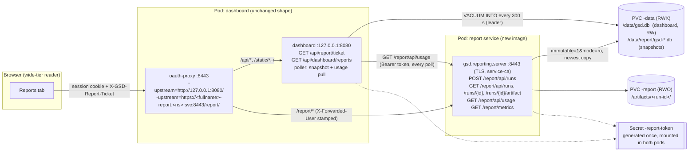
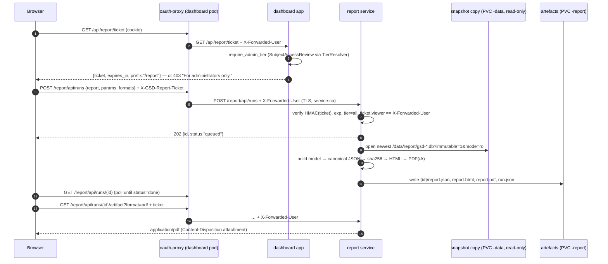
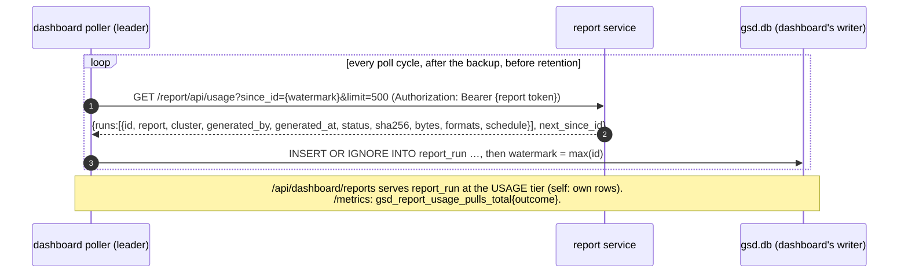

# SPEC C3 — Reporting as a microservice: the report service, its catalogue, and the dashboard's pull of its usage

| | |
|---|---|
| Programme | Feature programme 2026-09 — index and version ladder in `docs/specs/README.md` |
| Batch | C — product |
| Release | R6 — Reporting |
| Version on release | app 0.18.0, chart 0.20.0, report image at the same appVersion |
| Issue | [#67](https://github.com/ephico2real2/group-sync-dashboard/issues/67) |
| Status | specified |
| Source | design agent output, this session; written incrementally to one file, no seam |

## How to read this spec

Everything under "Design" is the design agent's text and complete code. It supersedes the "Design (verbatim)" section of the predecessor specification (deleted by the PR that added this file) in full, and keeps three things from it by name (the wide-tier gate, the sha256 data provenance, the print stylesheet) — see "Supersedes". Every claim about existing code is cited as `path#anchor`; every claim about a library, a repository or a platform is cited in "Sources" and, where it could be measured on this machine, was measured (the measurement is quoted where it is used). Schema migration numbers, version numbers and the issue text in the header are the orchestrator's; the body uses the ladder's numbers (app 0.18.0, chart 0.20.0, migration 11).

## Orchestrator's notes

- Written from the design agent's output of 2026-09-05 (Fable 5.1, 5,393 lines, 90 code blocks), which the operator commissioned to replace the "HTML core + loopback PDF sidecar" body: a report service in its own pods, reached over the internal Service name, with safe read access to the dashboard's database, its usage pulled by the dashboard, and the PDF libraries and report catalogue researched. The file replaces the predecessor C3 specification (renamed, index row updated); section 15 lists what it drops and what it keeps by name. The design's text was recovered from the agent's transcript after a reviewer task deleted the session scratchpad; the replayed file matches the agent's reported line and block counts exactly.
- Header aligned with the index row: "app 0.18.0, chart 0.20.0, report image at the same appVersion" — the design's own recommendation (its operator question 1) that the report image shares the application's version and tag scheme replaces the earlier "reporting image 0.1.0"; the operator has not yet confirmed it. The Issue and Status cells carry only what `tests/test_specs_index.py` compares; the re-title and re-body of #67 are done in the issue itself, per section 15.
- **Deviation to apply at implementation — a PodDisruptionBudget for the report Deployment.** Operator rule (2026-09-05, chart 0.14.0 review): "PDB when enabled only goes on the actual deployments of the group sync dashboard and on the new reporting service deployments only." The design has no budget for the report Deployment; add one, selecting `gsd.reportSelectorLabels` and nothing else (the schedule CronJob pods already carry neither selector set, which is what keeps a Job-owned pod out of the budget — the failure measured on the dashboard's own budget in the 0.14.0 review). Values, under `reporting:` after `networkPolicy:`:

  ```yaml
  # A budget on the one report replica governs drains, not availability, exactly as the dashboard's
  # (see podDisruptionBudget above): maxUnavailable: 1 lets a drain proceed; minAvailable: 1 blocks it.
  # Selects the report Deployment's pods only — never the schedule CronJob pods, whose owner has no
  # scale subresource and would fail the budget (SyncFailed, DisruptionAllowed=False).
  podDisruptionBudget:
    enabled: true
    maxUnavailable: 1
    minAvailable: ""
  ```

  Template `charts/group-sync-dashboard/templates/report-pdb.yaml` (complete file):

  ```yaml
  {{- if and (include "gsd.reportingEnabled" . | eq "true") .Values.reporting.podDisruptionBudget.enabled }}
  apiVersion: policy/v1
  kind: PodDisruptionBudget
  metadata:
    name: {{ include "gsd.reportName" . }}
    namespace: {{ .Release.Namespace }}
    labels: {{- include "gsd.reportLabels" . | nindent 4 }}
  spec:
    {{- if .Values.reporting.podDisruptionBudget.minAvailable }}
    minAvailable: {{ .Values.reporting.podDisruptionBudget.minAvailable }}
    {{- else }}
    maxUnavailable: {{ .Values.reporting.podDisruptionBudget.maxUnavailable | default 1 }}
    {{- end }}
    selector:
      matchLabels: {{- include "gsd.reportSelectorLabels" . | nindent 6 }}
  {{- end }}
  ```

  Chart README row, in the reporting table: `| \`reporting.podDisruptionBudget.enabled\` / \`.maxUnavailable\` / \`.minAvailable\` | \`true\` / \`1\` / \`""\` | the report Deployment's own budget; same semantics as the dashboard's |`. Test, added to `TestThePdbSelectsTheDeploymentOnly` in `local-development/tests/test_chart_pdb.py`:

  ```python
      def test_the_report_deployment_has_its_own_budget_and_no_cronjob_pod_matches_either(self):
          docs = _render("reporting.enabled=true", "reporting.schedules[0].name=weekly",
                         "reporting.schedules[0].cron=0 6 * * 1", "reporting.schedules[0].report=access-matrix")
          pdbs = [d for d in docs if d.get("kind") == "PodDisruptionBudget"]
          assert {d["metadata"]["name"] for d in pdbs} == {"t-group-sync-dashboard", "t-group-sync-dashboard-report"}
          report = _one(docs, "Deployment", "-report")
          report_pdb = _one(docs, "PodDisruptionBudget", "-report")["spec"]["selector"]["matchLabels"]
          assert _matches(report_pdb, report["spec"]["template"]["metadata"]["labels"])
          dashboard_pdb = _one(docs, "PodDisruptionBudget", "t-group-sync-dashboard")["spec"]["selector"]["matchLabels"]
          assert not _matches(dashboard_pdb, report["spec"]["template"]["metadata"]["labels"])
          for cron in (d for d in docs if d.get("kind") == "CronJob"):
              labels = cron["spec"]["jobTemplate"]["spec"]["template"]["metadata"]["labels"]
              assert not _matches(report_pdb, labels) and not _matches(dashboard_pdb, labels)
  ```

  (`_one(docs, "PodDisruptionBudget", "t-group-sync-dashboard")` must be given the exact-name form at implementation if the substring also matches the report budget — adjust the helper to prefer an exact name.)
- Section 2's default rule already matches chart 0.14.0's: every switch on unless it costs RBAC, a credential, a second image or a cluster-wide write; `rbac.namespaces` is the stated exception. Chart 0.14.0 added two more exceptions the reporting values must not contradict: `monitoring.*` stays off (the reference cluster runs no Prometheus; the report service's ServiceMonitor, if the body adds one, follows `monitoring.serviceMonitor.enabled`), and `oauthProxy.requestLogging` stays off (the proxy logs the full request URI) — the `/report/` upstream adds no logging of its own.
- Schema migration 11 and the version pair are per the index ladder; the body's "migration 11" already agrees.
- Corrections applied from the spec's adversarial review (PR #76, `docs/REVIEW_C3_spec.md`), in the body itself so the file stays the single source: (1) §8.17.2 `gsd.reportingGuards` included two value-returning helpers and would have printed `pdf/a-2b` and the catalogue list into both Deployment manifests — their output is now assigned away; (2) §8.17.6 the report Service carries `gsd.reportSelectorLabels` as well as `gsd.reportLabels`, because the ServiceMonitor selects Services by metadata labels and `gsd.reportLabels` names the dashboard; (3) §8.17.13's `monitoring.prometheusRule.for.reportPull/reportSnapshot` are written as a values block; (4) §8.7.3 `namespace_access.py` imports `KeyValues` and `Note`, which it constructs; (5) §5.1 states ServeMux's slashless-path redirect, the `-pass-user-headers` default and that `-upstream-ca` is unverified on the shipped tag; (6) §6.1 requires the Hummingbird `dnf list` re-measure at implementation; (7) §9.9/§9.11 name the test helpers that exist (`tests/test_chart_pdb.py` `_render`/`_one`/`_matches`; `test_chart_strategy.render` returns a tuple; no conftest); (8) §11's doc texts cite this file, not the deleted one.
- Corrections applied from Codex's pass on the same PR (`docs/REVIEW_C3_spec.md`): (9) §8.3 the ticket verifier bounds `iat` (30 s skew) and the lifetime (3600 s) — the original accepted a ticket minted by a clock far ahead for as long as that clock said; (10) §8.15.5 `_after_poll` re-checks leadership before the snapshot and before the usage pull, and §4.1 calls the check admission control, not a fence, which is what `poller.py` says of leadership; (11) §8 `principal()` answers an expired ticket with 401 so the browser's single re-mint (§9.11) works — §9.7 had said 403, contradicting §9.11; (12) the data claim must be `ReadWriteMany`: the RWO pod-affinity derivation is withdrawn (§2 row, §4.1, the guard, the report Deployment) because affinity is ignored after scheduling and a dashboard-only restart could strand the single-node claim with the report pod; the reference cluster's claim is RWX; (13) §10.2 builds and scans the report image's pack stage as the dashboard image's is, and keeps the Hummingbird-blindness check; (14) every code comment and doc text in the body cites this file's name; the predecessor is referred to without a path. The tests Codex supplied for (9)–(13) are in §9.
- Second review pass on the corrected head (Cursor; Codex recorded in `docs/REVIEW_C3_spec.md`): (15) the RWO withdrawal is finished — §8.17.1's "DERIVED" comment, §8.17.8's `$mode` branch on the affinity stanza and §9.9's "adds the podAffinity" derivation are gone, and §9.9's refusal list names `ReadWriteOnce`; (16) §9.9's default enabled-report count is eleven, because `loginCapture.enabled` defaults on since chart 0.14.0 and `login-activity` follows it; (17) §7.4 no longer cites `report.py#build` (a file that does not exist) and this note no longer cites the deleted filename; (18) §8.15.8 adds `data.reportCatalog` and `data.reportRuns` to `refresh()`'s fingerprint, without which auto-refresh never re-renders the Reports tab; (19) §12 gains the live check that the NetworkPolicy leaves the kubelet's probes through, and §13 records the clock-skew 401 as a risk with the message left to the operator.

---

## Design

## 1. Goal

Give the dashboard a reporting capability that produces **evidence documents** — the namespace access report the parked design asked for, and the catalogue an access-review programme needs around it (users, groups, bindings, namespaces, GroupSync health, login activity, a compliance snapshot, an access-certification pack) — as self-contained HTML and as PDF (optionally PDF/A), **generated in a separate pod** ("the report service") that the dashboard pod triggers over the cluster-internal Service name, that reads the dashboard's data safely, that stores the artefacts, and that **publishes its usage to the dashboard by being polled** — the dashboard's API stays GET-only (`local-development/tests/test_api_contract.py#test_r6_the_api_is_read_only`) and the dashboard writes nothing to any cluster.

Three constraints shape everything below, each restated where it is satisfied:

1. **SQLite is single-writer and its WAL needs one host's shared memory** (`local-development/gsd/store.py#Store.__init__` — "WAL coordinates readers and writers through an mmap'd -shm file, so on a filesystem without working shared memory or POSIX locks … SQLite refuses the switch and stays in rollback-journal mode"; `charts/group-sync-dashboard/templates/deployment.yaml#PER-POD database file`). A second pod must never open the live `gsd.db`. §4 ranks the data paths and chooses **read-only snapshot copies** the dashboard already knows how to make (`local-development/gsd/store.py#Store.backup` — `VACUUM INTO`), opened with `?immutable=1&mode=ro`.
2. **The dashboard's API is GET-only by contract**, and a GET on the dashboard must not cause work. §5 puts the run trigger on the **report service's own API** (a `POST` the browser makes through the oauth-proxy's second, path-routed upstream), authorised by a **ticket the dashboard mints** after its own `require_admin_tier` decision (`local-development/gsd/api.py#require_admin_tier`); the dashboard learns about runs by **pulling** `GET /report/api/usage` from the report service on the poll thread and recording them (migration 11, table `report_run`).
3. **Two images on the hardened base** (`docs/DESIGN_hardened_image.md` §3: no shell, user 65532, no `dnf` at runtime, and — measured below — no pango/cairo in the Hummingbird repository). §6 chooses **fpdf2** (pure Python, PDF/A-1b…4 with enforcement, embedded TrueType) and vendors the font the way the woff2 typefaces are already vendored (`local-development/vendor-assets.sh`).

## 2. Switches, defaults, why

The operator's rule of 2026-09-05: **every boolean switch defaults to ENABLED unless it cannot work without something the chart cannot supply** (a credential, a destination, a second image not yet shipped). The last column states which case each switch is.

| Value | Default | Kind | Why this default | Refuse / derive |
|---|---|---|---|---|
| `reporting.enabled` | **`true`** | module switch | The chart supplies everything it needs: the second image (`reporting.image`, published by the same `publish.yml` run that publishes the dashboard image, same appVersion), a PVC for artefacts, the token Secret it generates itself, the Service, the NetworkPolicy. Nothing external. The rule's exception does not apply once the image is shipped; **until the first release that publishes the image, the chart of that same release ships it, so there is no window where `true` points at a tag that does not exist** — `gsd.reportImage` resolves the same appVersion `gsd.image` does. | **Refuse** with `oauthProxy.enabled=false` (no proxy → no path-routed `/report/` upstream and no trusted identity; message names both remedies, like the visibility guard at `templates/deployment.yaml#visibility.enabled=true requires oauthProxy.enabled=true`). **Refuse** with `persistence.enabled=false` (an emptyDir cannot be mounted by a second pod; there is no snapshot to read). **Refuse** with `replicaCount > 1` (each replica holds its own history — `templates/deployment.yaml#PER-POD database file` — so a snapshot from one is a report from an arbitrary replica; `docs/reference-architecture.md#Scaling, and why the answer is "don't"`). **Refuse** with `rbac.bindings=false` (nine of eleven reports are the binding surface; kept from the current C3). **Refuse** with any data-claim access mode other than `ReadWriteMany`: `ReadWriteOncePod` admits one pod; `ReadWriteOnce` admits one node, and because the two pods restart independently and inter-pod affinity is ignored after scheduling, replacing only the dashboard can leave the report pod holding the claim on the old node while the new dashboard pod lands elsewhere and cannot attach it (review of the spec, Codex). The B1 table, `docs/specs/SPEC_B1_offsite_backup.md#2.3`, is the same reasoning for the backup pod. |
| `reporting.pdf.enabled` | **`true`** | format switch | fpdf2 is pure Python and ships in the reporting image; no library, no credential. Off = HTML and JSON artefacts only. | Independent. |
| `reporting.pdf.variant` | `"pdf/a-2b"` | enum: `""`, `pdf/a-1b`, `pdf/a-2b`, `pdf/a-2u`, `pdf/a-3b`, `pdf/a-3u`, `pdf/a-4` | A report is evidence; PDF/A-2b is the widely recommended archival default and fpdf2 enforces it (measured §6.2: XMP `pdfaid:part=2`/`conformance=B`, OutputIntent, embedded font). `""` gives a plain PDF. Not a boolean, so the rule does not apply; refused at render for any other string (`gsd.reportPdfVariant`). | Requires `reporting.pdf.enabled` to mean anything; with pdf off the value is ignored and the render **warns** through NOTES, never fails (a format setting is not a safety switch). |
| `reporting.tls.enabled` | **`true`** | transport switch | The chart supplies the certificate through the service-ca annotation the dashboard's own Service already uses (`templates/service.yaml#service.beta.openshift.io/serving-cert-secret-name`), and the proxy verifies it with `-upstream-ca` against `openshift-service-ca.crt`, the ConfigMap the ServiceMonitor already trusts (`templates/monitoring.yaml#openshift-service-ca.crt`). OpenShift supplies both; this chart is OpenShift-shaped (`templates/monitoring.yaml#OPENSHIFT-ONLY, deliberately`). Off = plain HTTP inside the cluster; the ticket and the NetworkPolicy still hold (§5). | Independent. Pre-flight: the shipped proxy binary must have `-upstream-ca` (§5.4). |
| `reporting.networkPolicy.enabled` | **`true`** | isolation switch | A NetworkPolicy is a core object every OpenShift CNI enforces (OVN-Kubernetes, the default). It restricts ingress to the report pod to the dashboard pod, the schedule Jobs and (when scraping is on) the monitoring namespaces. Off for a CNI that does not enforce them — the objects would be inert, not harmful, but the README says so. | **Derive**: the monitoring ingress rule renders only with `monitoring.serviceMonitor.enabled`. |
| `reporting.persistence.enabled` | **`true`** | storage switch | A PVC the chart creates from the default StorageClass, like `persistence`. Off = emptyDir: artefacts are lost on restart, which is acceptable because every artefact is regenerable from a snapshot — and the NOTES say so. **No `helm.sh/resource-policy: keep`**, unlike the data claim (`templates/pvc.yaml#helm.sh/resource-policy: keep`): artefacts are not irreplaceable history. | Independent. |
| `reporting.snapshot.intervalSeconds` | `300` | number | How often the dashboard's leader writes a fresh read-only copy for the report service (§4): the binding cadence, because bindings are what most reports are about. Measured cost §4.3. Refused below 60 (a `VACUUM INTO` holds a read transaction for its duration). | Ignored when `reporting.enabled=false` (the key is not written to the ConfigMap). |
| `reporting.snapshot.keep` | `2` | number | The newest is read; the previous one covers the moment a new copy is being written. | — |
| `reporting.retention.days` / `.maxRuns` | `90` / `500` | numbers | Artefacts are evidence somebody may come back for within a review cycle; a quarter is the common review frequency (Sources: access-review guidance). `0` keeps forever. | — |
| `reporting.schedules` | `[]` | list | A value that is simply empty, like `config.users.providers`. Each entry renders a CronJob that runs one report with the service credential (§5.6). Not a boolean. | Each entry's `report` must be a catalogue name and enabled (refused otherwise). |
| `reporting.reports.<name>.enabled` | **`true`** for nine reports; **`""` (follow) for `loginActivity`** | per-report switches | Each report is a module. Nine need nothing but the snapshot. `loginActivity` needs login capture; it **follows `loginCapture.enabled`** by default (tri-state `""`, the `monitoring.grafanaDashboard.enabled` precedent at `templates/_helpers.tpl#gsd.grafanaDashboardEnabled`), and `true` with capture off is **refused** ("a report over a table nothing writes"). `dormantAccess` works without capture (it uses User objects) and gains a column with it. | Tri-state validated at render. |
| `rbac.namespaces` | `false` | RBAC switch | Kept from the current C3: `get,list namespaces` (core group) lets the namespace report **attest absence** ("this namespace exists and has no grants") rather than "none observed". Extra RBAC → the rule's exception → off. The report prints the coverage note either way. | Independent. |
| `reporting.ticket.ttlSeconds` | `300` | number | How long a minted ticket (§5.2) is valid. Five minutes covers a generate-and-download interaction; the page re-mints on a 401. Refused below 30 or above 3600. | — |

`features.namespaceReport.*` from the current C3 body is **not created**; `rbac.namespaces` is the only survivor of that block.

## 3. Architecture

Two pods, one chart, one source tree, two images.



### 3.1 The sequence: trigger → dashboard → report service → data → artefact → download



### 3.2 The usage pull



### 3.3 Two images, one version

The reporting image is built from **this repository's `local-development/` context** by `Containerfile.report`, installs the same `gsd` wheel plus the `report` extra (`fpdf2`), and is tagged `<appVersion>-<sha>` by the same `build-and-push-external.sh` (`local-development/build-and-push-external.sh#IMAGE_NAME`, `#CONTAINERFILE` — both already environment-selectable). The chart resolves it through `gsd.reportImage`, which falls back to `.Chart.AppVersion` exactly as `gsd.image` does (`templates/_helpers.tpl#gsd.image`).

**Why not "its own version number".** The report service opens the dashboard's SQLite snapshot and reads its schema; the classification SQL it reuses is the dashboard's (`local-development/gsd/store.py#_FINDING_CASE`). Two independently numbered images would let the schema and the reader drift by a release; one appVersion for both makes "the reporting image that matches this dashboard" a tautology, and `tests/test_chart_versions.py#test_appversion_equals_the_application_version` already holds appVersion to `pyproject.toml`. The image **is** independently versioned in the sense the issue meant — its own name, its own tag stream, its own scan gate, its own proof — but the number is the application's. The header's "reporting image 0.1.0" is therefore superseded; recorded as operator question 1.

## 4. Data path decision — how the report service gets the dashboard's data

The operator's expectation, verbatim: *"I am also sure that reporting service will also have access to the database running in the group sync pod."* It does — to a **consistent, read-only copy of it, refreshed on the binding cadence**, which is the only form of "access to the database" that is safe across two pods. The ranking:

| Rank | Option | Verdict | Why |
|---|---|---|---|
| **1 — chosen** | **(b) a read-only snapshot copy** the dashboard produces with `VACUUM INTO` into `/data/report/` on its own PVC, which the report pod mounts **read-only** (`persistentVolumeClaim.readOnly: true` and `volumeMounts[].readOnly: true`, the B1 pattern) and opens with `file:…?immutable=1&mode=ro` | safe, complete, cheap | `VACUUM INTO` "takes a read transaction for the duration, so the output is a single consistent snapshot even while the poller writes" (`local-development/gsd/store.py#Store.backup`). Measured here on the store's own code: the output's `PRAGMA journal_mode` is `delete` (no `-wal`/`-shm` side files can ever be wanted), `immutable=1` opens it read-only with no locking, and a write is refused ("attempt to write a readonly database"). The copy is a **whole database**, so every table the catalogue needs is there, including the history tables no API endpoint exposes in report shape. One reader, one file, zero coordination with the writer. |
| 2 | (a) the report service reads through the dashboard's HTTP API over the cluster Service, forwarding the proxy identity | rejected | The dashboard's Service targets the **proxy** (`templates/service.yaml#targetPort: oauth-proxy`) and the app binds loopback (`templates/deployment.yaml#Bind loopback only`), so a machine caller must pass the proxy — a bearer token through `-openshift-delegate-urls` (`apiTokenAccess`, default off) for an identity that then needs a tier of its own. Every read would also be recorded as dashboard use (`local-development/gsd/api.py#record_dashboard_use`), the reports would be bounded by the API's paging and shapes (R3), and eleven reports would mean dozens of round trips per run each taking its own snapshot — the torn-read problem `@consistent` exists to prevent (`local-development/gsd/api.py#consistent`), reintroduced across HTTP. |
| 3 | (c) mount the ReadWriteMany data volume and open the **live** `gsd.db` read-only | **unsafe — rejected** | WAL "requires all processes to share a small amount of memory and processes on separate host machines obviously cannot share memory with each other" (SQLite WAL documentation, Sources). A read-only WAL open needs write access to the `-shm` file or the directory (SQLite `c3ref/open`), so "read-only" is not read-only; and `immutable=1` on a file that changes "might return incorrect query results and/or SQLITE_CORRUPT errors" (SQLite URI documentation). The default volume is RWX, which in practice is often NFS, where the dashboard itself already refuses WAL (`local-development/gsd/store.py#Store.__init__`, `charts/group-sync-dashboard/values.yaml#WATCH THE FILESYSTEM UNDERNEATH`). Two hosts on one live SQLite file is the exact case the chart's `Recreate` guard exists to prevent (`templates/deployment.yaml#strategy=RollingUpdate is unsafe`). |

### 4.1 Freshness, stated on every report

A snapshot is as fresh as its stamp. The leader writes one every `reporting.snapshot.intervalSeconds` (default 300, the binding cadence — `values.yaml#bindingIntervalSeconds` is 300 too) from `Poller._after_poll` (`local-development/gsd/poller.py#Poller._after_poll`), **after** `maintain()` and beside `_maybe_backup()`, on the poll thread — the same rule `backup()` states: "Called from the POLL THREAD only … doing that from a request handler would put a user's page behind it." Worst-case staleness is one poll interval plus one snapshot interval, and every report prints `data as of <snapshot stamp> (taken N minutes before generation; bindings refresh every 300 s)` in its provenance block, beside the last poll's outcome.

Reporting requires a `ReadWriteMany` data claim (the chart default). `ReadWriteOncePod` cannot be mounted by both pods; `ReadWriteOnce` is refused as well, because a required pod affinity from the report pod to the dashboard only holds at the moment the report pod is scheduled and is ignored afterwards — replacing only the dashboard can separate the pods across nodes and make the single-node attachment fail, which would block the dashboard's own rollout. The guard in `gsd.reportingGuards` refuses both modes by name.

### 4.2 Why not the existing backups

`config.backup` copies land in `/data/backup` every six hours (`values.yaml#backupIntervalHours`). Six hours is a backup cadence, not a report cadence; a reader who clicks "Generate" after fixing a binding expects the fix on the page. The snapshot is a second use of the same mechanism with its own directory and cadence, and it does **not** participate in the retention gate (`local-development/gsd/poller.py#Poller._prune_history` reads `_backup_state`, which only `_maybe_backup` sets).

### 4.3 Cost, measured

On this machine, against the store's real code (`Store.backup`), a synthetic database of 61.4 MB — 200,000 `group_member`, 300,000 `membership_event`, 20,000 `rbac_group_binding` rows, ten to a hundred times the reference cluster — took **3.2 s** to `VACUUM INTO` a 58.2 MB copy. At reference scale the file is a few megabytes and the copy is tens of milliseconds. The copy holds a read transaction, not the write lock, so the poller's next write is not blocked; readers of the live database are unaffected (WAL). Two copies are kept (`reporting.snapshot.keep`), so the report service always has a complete file to open while the next is being written; the writer writes `gsd-<stamp>.db` under a `.tmp` name and renames it, so the report service never sees a partial file.

### 4.4 Schema compatibility

The report service refuses a snapshot whose `PRAGMA user_version` is **greater** than the migration level it was built with (`gsd.store._MIGRATIONS`), with a 503 naming both numbers — a newer dashboard beside an older report image. One appVersion for both images (§3.3) makes that a transient of a rolling upgrade, never a steady state. An **older** snapshot (fewer migrations) is read; the catalogue's queries only touch tables that exist since migration 8 or earlier, plus the two migration-11 tables, whose absence a report treats as "not read" (the same tri-state the coverage note already speaks).

## 5. Auth between the pods, and how the wide tier is enforced end to end

### 5.1 The route into the report service is the oauth-proxy, not a second Route

The report service is **not exposed** by a Route of its own. The dashboard pod's oauth-proxy gains a second upstream: `-upstream=https://<fullname>-report.<namespace>.svc:8443/report/` beside the existing `-upstream=http://127.0.0.1:8080` (`templates/deployment.yaml#-upstream=http://127.0.0.1:8080`). openshift/oauth-proxy routes between upstreams by the **path** the upstream URL carries — measured in its source: `path := u.Path`, then `u.Path = ""` before the reverse proxy is built, `serveMux.Handle(path, proxy)`, and the request path is passed through unchanged (`req.URL.Opaque = req.RequestURI`). Every request the proxy forwards, to either upstream, carries `X-Forwarded-User` / `X-Forwarded-Email` set by the proxy after authentication (`setRequestHeader(req, "X-Forwarded-User", session.User)`). So `/report/**` reaches the report service **only** through the same login the dashboard has, with the same identity header, and the report service's `/report/healthz`, `/report/readyz` and `/report/metrics` are **not** in `oauthProxy.skipAuthRegex` — they are reached on the report Service directly by kubelet and Prometheus, never through the Route.

Routing is Go's `http.ServeMux` (`oauthproxy.go`: `path := u.Path`, `u.Path = ""`, `serveMux.Handle(path, proxy)`): the longer registered pattern wins, so `/report/` beats `/`, and the request path is forwarded unchanged (`req.URL.Opaque = req.RequestURI`), which is why the report process listens on `/report/**`. A request for `/report` **without** the trailing slash is proxied to neither upstream: ServeMux answers `301` to `/report/`, and that follow-up reaches the report Service. `-pass-user-headers` defaults to true in the shipped image (`local-development/gsd/activity.py` records the measurement; the chart passes no flag), so every authenticated upstream request carries `X-Forwarded-User`. `-upstream-ca` is defined on oauth-proxy `master` and is **not** assumed present on `ose-oauth-proxy-rhel9:v4.15` until §12's pre-flight prints the flag; if it does not, `reporting.tls.enabled=false` runs plain HTTP on the pod network behind the NetworkPolicy, ticket unchanged (operator question 6).

### 5.2 The tier is decided once, by the dashboard, and carried as a ticket

The report service holds **no cluster credential and no RBAC** (its ServiceAccount has no bindings and `automountServiceAccountToken: false`), so it cannot run the SubjectAccessReview that decides the tier (`local-development/gsd/kube.py#TierResolver`) and must not duplicate it. The dashboard decides, the way it already does for `/bindings/findings`, and hands the decision to the browser as a **ticket**:

- `GET /api/report/ticket` on the dashboard calls `require_admin_tier(request)` (`local-development/gsd/api.py#require_admin_tier`) — a refusal is the same 403 with the same "For administrators only." sentence — and returns `{"ticket": "<payload>.<sig>", "expires_in": 300, "prefix": "/report"}`. The payload is `{"v":1,"viewer":<X-Forwarded-User>,"tier":"all","iat":…,"exp":…,"nonce":…}`; the signature is HMAC-SHA256 with the shared token (§5.3). It is a **pure function of the request** — no store write, no file, no network beyond the tier check `whoami` already makes — so it satisfies "a GET on the dashboard must not cause work" in the sense R6 protects: nothing is created, rendered or stored.
- The browser sends the ticket on **every** request to `/report/**` as `X-GSD-Report-Ticket`. The report service verifies the signature, the expiry, `tier == "all"`, and that `viewer` **equals the proxy-stamped `X-Forwarded-User` on that request** — the ticket is bound to the session identity it was minted for, so a captured ticket is useless from another session. A custom header also makes the `POST` a non-simple request, which is the CSRF defence.
- With `visibility.enabled=false` every authenticated reader is wide (`local-development/gsd/api.py#viewer_scope` returns `TIER_ALL` when restrictions are off), so every reader can generate — the existing semantics, stated. With the proxy off the chart refuses to render (§2).

A **self-tier reader cannot fetch a report through the internal name**: they cannot obtain a ticket (403 at `/api/report/ticket`), the report service refuses every `/report/api/*` request without a valid ticket or the service credential, and the NetworkPolicy (§5.4) means a self-tier reader's own workloads elsewhere on the cluster cannot reach the report pod's port at all.

### 5.3 The service credential

One Secret, `<fullname>-report-token`, generated once and reused across upgrades by the `lookup` pattern of `templates/oauth-secret.yaml#lookup` (a regenerated token would invalidate every outstanding ticket and the poller's pull for one restart — harmless, but the pattern exists and is used). It is mounted read-only in the dashboard container (`/etc/gsd/report/token`, to sign tickets and to authenticate the usage pull), in the report container (to verify both), and in the schedule Jobs (to trigger runs). Presented as `Authorization: Bearer <token>`, compared in constant time, it is the **service principal**: it may list runs, create runs (`generated_by` becomes `schedule:<name>` or `service`) and read `/report/api/usage`. It is never sent to a browser.

### 5.4 Transport and reach

- **TLS** (`reporting.tls.enabled`, default true): the report Service carries `service.beta.openshift.io/serving-cert-secret-name: <fullname>-report-tls`; uvicorn serves with that certificate; the proxy verifies with `-upstream-ca=/etc/gsd/service-ca/service-ca.crt`, a mount of the `openshift-service-ca.crt` ConfigMap (the same CA the ServiceMonitor uses, `templates/monitoring.yaml#openshift-service-ca.crt`), and the dashboard's usage pull verifies with the same file. `-upstream-ca` is defined in openshift/oauth-proxy's `main.go` ("paths to CA roots for the Upstream (target) Server (may be given multiple times, defaults to system trust store)") and is absent from its README; **pre-flight check** before the PR opens: `oc exec deploy/<name> -c oauth-proxy -- /usr/bin/oauth-proxy --help 2>&1 | grep upstream-ca` on the shipped `ose-oauth-proxy-rhel9:v4.15`. If the shipped binary lacks it, `reporting.tls.enabled=false` is the recorded fallback (plain HTTP on the pod network, the ticket and the NetworkPolicy unchanged) and the values comment says so.
- **NetworkPolicy** (`reporting.networkPolicy.enabled`, default true): ingress to the report pod on 8443 only from pods carrying `gsd.selectorLabels` in the release namespace (the dashboard pod, whose proxy container makes the connection), from the schedule Job pods (`app.kubernetes.io/component: report-schedule`), and — only with `monitoring.serviceMonitor.enabled` — from the namespaces in `reporting.networkPolicy.monitoringNamespaces` (default `openshift-user-workload-monitoring`, `openshift-monitoring`). Egress is not restricted (the report pod makes no outbound call; a policy on egress would be documentation, not control).
- **Identity headers**: the report service believes `X-Forwarded-User` for exactly one purpose — matching it against the ticket's `viewer`. It never grants anything on the header alone.

### 5.5 What the report service enforces, in one table

| Request | Credential required | Check |
|---|---|---|
| `GET /report/healthz`, `/report/readyz`, `/report/metrics` | none | reachable only on the report Service (NetworkPolicy); no names in metrics |
| `GET /report/api/reports` (catalogue) | ticket | signature, exp, tier=all, viewer match |
| `GET /report/api/runs`, `GET /report/api/runs/{id}`, `GET …/artifact` | ticket **or** service token | as above; the service token sees every run |
| `POST /report/api/runs` | ticket **or** service token | as above; `generated_by` = ticket viewer, or `schedule:<name>`/`service` |
| `GET /report/api/usage` | **service token only** | a viewer never reads the usage feed; the dashboard serves it at the usage tier |
| `GET /report/api/snapshot` | ticket or service token | — |

### 5.6 Scheduled runs

A `reporting.schedules[]` entry renders a CronJob on the **report image** whose one container runs `python3.14 -m gsd.reporting.trigger --report <name> --cluster <id> [--param k=v]… --wait`, posting to the report Service with the service token over TLS (CA from the same ConfigMap mount). It writes nothing but the artefact; nothing is mailed (the parked design's question A: "somewhere to put the file and someone to send it to" — the artefact store is the "somewhere"; sending is out of scope and recorded in operator question 4). The Job pod carries `app.kubernetes.io/component: report-schedule` (never `gsd.selectorLabels` — the B1 lesson at `docs/specs/SPEC_B1_offsite_backup.md#Pod labels`).

## 6. The PDF library

### 6.1 The candidates, against the hardened image

`docs/DESIGN_hardened_image.md` §3: the runtime has no shell, no `dnf`, no `rpm` binary, user 65532; the builder (`hi/python:3.14-builder`) has `dnf` against one repository, `public-hummingbird-$basearch-rpms`. **Measured on 2026-09-05** on the locally pulled `registry.access.redhat.com/hi/python:3.14-builder` (3,514 packages available):

```
$ podman run --rm registry.access.redhat.com/hi/python:3.14-builder sh -c 'dnf -q list --available pango harfbuzz fontconfig glib2 fribidi dejavu-sans-fonts liberation-sans-fonts cairo gdk-pixbuf2'
Available packages
fontconfig.x86_64 2.18.3-1.hum1 public-hummingbird-x86_64-rpms
glib2.x86_64      2.89.3-1.hum1 public-hummingbird-x86_64-rpms
harfbuzz.x86_64   14.3.1-1.hum1 public-hummingbird-x86_64-rpms
$ … dnf -q list --available "pango*" "cairo*" "*fonts*" "fribidi*" "gdk-pixbuf*" "freetype*"
(no pango, cairo, fribidi or gdk-pixbuf package; the only font packages are xorg-x11-fonts-* bitmap/Type1 sets and langpacks-fonts-* metapackages)

Re-measure on the builder image at implementation with the same command. If `pango` has appeared in the Hummingbird repository, WeasyPrint becomes buildable and the row above must be rewritten; fpdf2 stays the choice unless the re-measure also shows a wheel named in §6.1 absent for the target interpreter, in which case pin the versions `pip download 'fpdf2==2.8.8' --only-binary=:all:` actually writes.
```

| Library | Needs at runtime | On Hummingbird | PDF/A | Verdict |
|---|---|---|---|---|
| WeasyPrint ≥ 53 | Pango, GLib, HarfBuzz, Fontconfig (Cairo and GDK-PixBuf no longer required since v53 — its install docs) | **Pango is not in the repository**; GLib and HarfBuzz are; no font packages | yes (`pdf_variant`) | **cannot be built on the hardened base** without a UBI9 fallback image — the current C3's operator question 3, now answered by measurement rather than asked |
| ReportLab | none (pure Python + Pillow) | fine | via `pdfa` utilities, partial | a low-level canvas API where every table and page break is hand layout; CVE-2023-33733 (`rl_safe_eval` sandbox bypass, RCE, fixed in 3.6.13) is a historically exploited surface class in exactly the HTML-attribute path a report would use; not chosen |
| xhtml2pdf | ReportLab + html5lib | fine | via ReportLab | inherits ReportLab's surface, adds an HTML/CSS subset; not chosen |
| Typst (`typst` PyPI 0.15.0) | a Rust binary in an abi3 manylinux wheel; no system libraries | fine | **all** PDF/A levels natively (`pdf_standards=["a-2b"]`) | strong typography, but a second markup language in the repository and a ~30 MB binary for tables of names; recorded as the alternative if typographic quality ever matters more than surface |
| Headless Chromium (Playwright) | hundreds of MB, a sandbox under an arbitrary UID | not serious (parked design §4) | no | rejected |
| **fpdf2 2.8.8** | **pure Python** (`py3-none-any`) + Pillow, fontTools, defusedxml — all with cp314 manylinux2014 wheels (downloaded here: `fpdf2-2.8.8-py3-none-any.whl`, `pillow-12.2.0-cp314-…manylinux2014_x86_64.whl`, `fonttools-4.64.0-cp314-…manylinux2014_x86_64.whl`, `defusedxml-0.7.1-py2.py3-none-any.whl`) | **nothing to install with dnf**; `libz.so.1` present in the runtime; Pillow's wheel bundles its own image libraries | PDF/A-1b, 2b, 2u, 3b, 3u, 4, 4e, 4f with **enforcement** (`enforce_compliance`) | **chosen** |

### 6.2 fpdf2, measured

Installed in a scratch venv on this machine (`fpdf2 2.8.8`, Python 3.13.5):

- `DocumentCompliance` members: `PDFA_1B, PDFA_2B, PDFA_2U, PDFA_3B, PDFA_3U, PDFA_4, PDFA_4E, PDFA_4F`; `FPDF.__init__(orientation, unit, format, font_cache_dir, enforce_compliance)`; `add_output_intent`, `set_xmp_metadata` exist.
- Under `PDFA_2B`, a core font is refused: `PDFAComplianceError: Usage of base fonts is now allowed for documents compliant with PDF/A-2B. Use add_font() to embed a font file` (the library's message, typo included — "now" for "not").
- Under `PDFA_2B` with an embedded TrueType regular **and bold** face (a table's heading row uses the bold style: `FPDFException: Using font 'body' with emphasis 'B' in table headings require the corresponding font style to be added using add_font()`), a three-row table renders to a `%PDF-1.7` file carrying `/OutputIntent`, `/Metadata` with XMP `<pdfaid:part>2</pdfaid:part>` / `<pdfaid:conformance>B</pdfaid:conformance>`, and `/FontFile2` (the embedded font). 32,240 bytes.
- `footer()`, `alias_nb_pages()` and `page_no()` exist for "Page X of Y".
- Encryption under a PDF/A profile is refused by the enforcement.

Independent validation of the produced file against the ISO profile (veraPDF) is a **verification step** (§13), not something the library's own enforcement replaces; the Sources note it.

### 6.3 The font

PDF/A requires embedded fonts and the base ships none. **DejaVu Sans 2.37** (regular and bold, Bitstream Vera licence — free to embed and redistribute), vendored through `vendor-assets.sh` from the npm package `dejavu-fonts-ttf` with the same publisher-integrity verification the woff2 typefaces already get (`local-development/vendor-assets.sh#WHY npm AND NOT THE CDN`). Two files, ~1.4 MB in git, committed like the Swagger bundles so the build works offline. `fontTools` reads TTF; fpdf2 does not read woff2, so the existing Space Grotesk/JetBrains Mono woff2 files cannot serve here — the HTML rendering keeps the page's typefaces, the PDF uses DejaVu, and the provenance block names the font.

### 6.4 The PDF/A question, answered

`reporting.pdf.variant` defaults to `pdf/a-2b`: the recommended archival default for new documents (Sources), and what this catalogue produces has no attachments (which would call for 3b) and no accessibility structure tree (which 2a/3a would demand and fpdf2 does not implement). `pdf/a-3b` is offered for a records system that wants the canonical `report.json` **embedded** in the PDF (fpdf2's `embed_file` is permitted under 3b; the renderer embeds it when the variant is 3b/3u), `pdf/a-4` for PDF 2.0-based archives, `""` for a plain PDF. The variant is printed in the provenance block and stored on the run record, so an auditor knows what they hold.

## 7. The report catalogue

### 7.1 What the research says an access-review programme wants

Identity-governance products (SailPoint's certification campaigns) produce **campaign** artefacts — who reviewed what, when, the decision, the exceptions — plus **status/evidence reports** listing every access item with reviewer, identity, source and outcome; compliance guidance (SOC 2, ISO 27001 A.5.18/A.9.2.5, SOX) centres on **dormant** accounts (last login), **orphaned** accounts (subjects that no longer exist), **privileged** access reviewed more often and separately, **segregation of duties**, and evidence that names reviewer, timestamps and outcomes. Kubernetes-side RBAC tooling (`rbac-tool`, `rakkess`, `kubectl who-can`, `rbac-lookup`, kubescape) reports the **subject → role → namespace** matrix, **who can perform a verb**, **stale bindings whose subjects no longer exist** (20–40 % of bindings in field audits), and **overly permissive** grants; RHACS exports compliance evidence as CSV/PDF for auditors. Sources at the end.

### 7.2 What this data can and cannot say

The store has: Group objects and members with first/last seen (`group_state`, `group_member`), membership history (`membership_event`), GroupSync CRs and sync history (`groupsync_state`, `sync_event`, `reconcile_error`), User objects with providers and creation time (`ocp_user`), group-subject bindings **classified** (`rbac_group_binding` + `_FINDING_CASE`: dangling / unresolved / built_in / unmanaged / ok), direct-user bindings with the platform flag (`user_binding`), the policy operator's CRs (`operator_config_state`), the login gate (`cluster_access_group`), login attempts when capture is on (`login_event`), poll health (`poll_outcome`), and — with `rbac.namespaces` — Namespace objects (`cluster_namespace`, migration 11).

It does **not** have Role/ClusterRole rules (deliberately: `templates/rbac.yaml#roles/clusterroles are deliberately NOT requested`), so **no report evaluates effective permissions or "who can perform verb X on resource Y"**; every report says so verbatim ("direct bindings only; role rules are not evaluated — this is not an effective-permissions calculation", the caveat the parked design made mandatory, `docs/namespace-report-design.md` §6). The access matrix is by **role name**, with the four stock roles ranked (`cluster-admin > admin > edit > view`, the rank `user_bindings_by_namespace` already uses at `local-development/gsd/store.py#Store.user_bindings_by_namespace`). Verb-level reporting is the README's "Effective-permission expansion", not built, and named in operator question 5.

### 7.3 The catalogue

Every report shares the **provenance and coverage block** (§7.4). Inputs are run parameters; "reads" names snapshot tables; "switch" is the values key; all are wide-tier only and all carry the sha256 of their canonical data.

| # | Name (`report`) | Purpose | Inputs | Reads | Sections | Switch (default) |
|---|---|---|---|---|---|---|
| 1 | `namespace-access` | **The C3 report, kept.** Per-namespace: who is granted what, findings first | `namespaces` (≤ 50, `(cluster-scoped)` allowed), `include_members` (default false, recorded) | `rbac_group_binding`+classification, `user_binding`, `group_member`, `cluster_namespace(_status)` | per namespace: exists/observed line, findings summary, group bindings (finding, group, role, binding, reaches, members opt-in), direct-user grants; cluster-scoped section when requested | `reporting.reports.namespaceAccess.enabled` (true) |
| 2 | `access-matrix` | Subject × namespace × role matrix — the "who has access where" sheet | `subject_kind` (`all`/`groups`/`users`), `namespace_prefix` (optional) | `rbac_group_binding`, `user_binding`, `group_state` | matrix rows: subject, kind, namespace (or cluster-wide), role, binding, managed/unmanaged; totals per subject; the role-rank legend | `accessMatrix.enabled` (true) |
| 3 | `privileged-access` | Every subject holding `cluster-admin`/`admin`/`edit` cluster-wide or `cluster-admin` anywhere — the privileged-access review | `include_members` (default **true** here — a privileged review without names is not a review; recorded), `roles` (default the three) | `rbac_group_binding`, `user_binding`, `group_member`, `ocp_user` | grants by role rank; per group the roster with logged-in flag; direct users; findings | `privilegedAccess.enabled` (true) |
| 4 | `binding-findings` | RBAC hygiene: dangling, unresolved, unmanaged (with exceptions), direct-user grants, platform identities excluded and counted | none | `rbac_group_binding`+classification, `managed_group_seen`, `user_binding` | one table per finding tier with the classification's own definitions quoted; counts by tier; exceptions listed | `bindingFindings.enabled` (true) |
| 5 | `groups` | Group inventory and membership change | `include_members` (false), `window_days` (30) | `group_state`, `group_member`, `membership_event`, `groupsync_provider`, `managed_group_seen` | per group: provider, members, synced-at, cliff silence, bindings count; empty and unattributed lists; adds/removes in window; retention edge | `groups.enabled` (true) |
| 6 | `users` | User inventory: who has logged in, providers, manual accounts, group count, direct grants | `providers` filter (optional) | `ocp_user(_status)`, `group_member`, `user_binding` | users with identity; manual accounts; synced members without a User object; per-provider counts | `users.enabled` (true) |
| 7 | `login-activity` | Login attempts in a window: successes, failures by outcome and provider, refusal reasons | `window_days` (30), `user` (optional) | `login_event`, `login_capture_status`, `cluster_access_group`, `group_member` | totals by outcome; per-user table; rejected attempts resolved against the gate (`not_gated`/`no_record`/`membership_disagrees`, the vocabulary at `local-development/gsd/api.py#REFUSAL_NOT_GATED`); watching-since | `loginActivity.enabled` (**`""` = follow `loginCapture.enabled`**) |
| 8 | `dormant-access` | Access nobody uses: members of synced groups with no User object (never logged in), not in the login gate, and — with capture — no success in N days | `dormant_days` (90) | `group_member`, `ocp_user`, `cluster_access_group`, `login_event` (if present) | access without login (`store.access_without_login` semantics); login without access; never-logged-in members per group; last success older than N days (capture only) | `dormantAccess.enabled` (true) |
| 9 | `groupsync-health` | The sync pipeline: CR state, schedules, last sync, reconcile errors, sync history, policy-operator CR health | `window_days` (30) | `groupsync_state`, `groupsync_provider`, `reconcile_error`, `sync_event`, `operator_config_state`, `operator_config_presence`, `groupsync_presence`, `poll_outcome` | CR table with state (via `gsd.state.compute_state`), errors (current vs stale), sync counts and lag in window, NamespaceConfig/GroupConfig health | `groupsyncHealth.enabled` (true) |
| 10 | `compliance-snapshot` | One document for the ticket: counts, findings, coverage, health — the summary of 1–9 | none | all of the above (summaries) | KPIs; findings by tier; privileged grants count; dormant/orphan counts; login gate; sync health; **coverage** (what the evidence can and cannot attest); provenance | `complianceSnapshot.enabled` (true) |
| 11 | `access-certification` | A certification pack: per subject the access held, with decision columns for a reviewer | `campaign` (name), `due` (date), `reviewer` (name), `scope` (`groups`/`users`/`all`), `include_members` (true) | `group_member`, `rbac_group_binding`, `user_binding`, `ocp_user` | campaign header (recorded in provenance); per group: roster and bindings with Approve / Revoke / Comment columns; per direct user: the same; sign-off block | `accessCertification.enabled` (true) |

### 7.4 The provenance and coverage block (every report, page one)

Kept and extended from the parked design §6 and the predecessor C3 body's namespace-report builder (deleted; this file is the source): handling marking (`reporting.marking`, default `Handling: internal — access review evidence`; operator question 2); cluster id and API URL; **generated at** (UTC) and **generated by** (the ticket's viewer, "proxy-verified", or `schedule:<name>`); run id; the report service's version and commit (`gsd.__version__`, `GSD_GIT_COMMIT`, `dirty` when the stamp ends `-dirty`) — the same appVersion as the dashboard by construction (§3.3) — and the snapshot's schema level (`PRAGMA user_version`); **data as of** the snapshot stamp and its age at generation; last poll outcome and message (poll-failure banner when not `ok`); freshness split snapshot/accumulated with `history retained since` for the history tables (B2's `history_retained_since` semantics); users source (`ok`/`forbidden`/`pending`); login capture state; namespaces coverage (`ok`/`off`/`forbidden`/`pending`, attests absence only on `ok`); the direct-bindings caveat verbatim; `includes membership rosters: yes/no`; truncation banners; the **sha256 of the canonical data**; PDF variant and font (PDF only); `Page X of Y`.

### 7.5 Never in a report

Dashboard usage rows (`dashboard_user_activity`), user emails, raw error text that could carry secrets (`reconcile_error.message` and `operator_config_state.error_message` are **replaced** with "diagnostic text withheld — see the dashboard" the way the self tier replaces the alert detail, `local-development/gsd/api.py#SELF_ALERT_DETAILS`; a file that is emailed has no tier), `ldap_filter`, any cluster other than the one named.


## 8. Files — complete code

Paths are relative to the repository root. "Old/New" edits give the exact text to find; new files are given whole. The report service is a subpackage `gsd.reporting` of the existing package, so both images build from one wheel and one version; the dashboard image ships the subpackage too (it is small and imports `fpdf2` only lazily), which is what lets the dashboard import `gsd.reporting.ticket` without any new dependency.

### 8.1 `local-development/pyproject.toml`

Old:
```toml
[project.optional-dependencies]
dev = [
    "pytest>=8.0",
    "pytest-playwright>=0.5",
]
```
New:
```toml
[project.optional-dependencies]
dev = [
    "pytest>=8.0",
    "pytest-playwright>=0.5",
    # The report service's tests render real PDFs; the extra below is what the reporting image
    # installs, so the suite exercises the same wheel the image ships.
    "fpdf2>=2.8.8",
]
# THE REPORTING IMAGE'S ONLY ADDITION. fpdf2 is pure Python (py3-none-any) and its three
# dependencies — Pillow, fontTools, defusedxml — ship cp314 manylinux wheels, so nothing is
# compiled and nothing is installed with dnf: measured on 2026-09-05, the Hummingbird
# repository has no pango, cairo, gdk-pixbuf or font package, which rules WeasyPrint out on
# this base (docs/specs/SPEC_C3_reporting_microservice.md §6). The floor is the version verified
# for PDF/A-2B output on the same day. Not a runtime dependency of the dashboard image: the
# dashboard never renders a PDF, and a library it does not use is surface it should not carry.
report = [
    "fpdf2>=2.8.8",
]
```
Old:
```toml
gsd = ["static/*", "static/vendor/*"]
```
New:
```toml
# reporting/report.css is the print stylesheet inlined into every HTML artefact; the two
# DejaVu faces under static/vendor are the PDF's embedded font (vendor-assets.sh fetches them).
gsd = ["static/*", "static/vendor/*", "reporting/report.css"]
```

### 8.2 NEW `local-development/gsd/reporting/__init__.py`

```python
"""The report service — a separate pod that renders evidence documents from a read-only copy
of the dashboard's database, stores them, and is polled by the dashboard for its usage.

docs/specs/SPEC_C3_reporting_microservice.md is the design. The seams, in one place:

* DATA: never the live gsd.db. `snapshot.py` opens the newest `VACUUM INTO` copy the dashboard's
  leader writes under GSD_REPORT_SNAPSHOT_DIR, with `immutable=1&mode=ro` (§4).
* AUTHZ: never decided here. The dashboard mints an HMAC ticket after its own wide-tier check;
  `ticket.py` verifies it and binds it to the proxy's identity header (§5.2). The service token
  (`Authorization: Bearer`) is the dashboard's poller and the schedule Jobs.
* OUTPUT: one data model (`model.py`) rendered twice — `render_html.py`, `render_pdf.py` — so
  the sha256 printed on both is the sha256 of the same canonical JSON.

Importing this package pulls in no PDF library: `render_pdf` imports fpdf2 lazily, so the
dashboard image (which ships the package but not the `report` extra) imports `gsd.reporting.ticket`
without it.
"""

from __future__ import annotations

#: Every route the service serves lives under this prefix, because the oauth-proxy routes the
#: browser's requests to this pod by path (§5.1): `-upstream=https://<svc>:8443/report/`. The
#: prefix is part of the request path the proxy passes through unchanged, so the service must
#: answer on it — and answering on it and nothing else is what makes a stray upstream mapping
#: fail loudly rather than serve.
REPORT_PREFIX = "/report"

#: The header the browser carries the dashboard-minted ticket in. A custom header, so a POST to
#: the service is never a "simple" cross-site request — that is the CSRF defence, stated once.
TICKET_HEADER = "x-gsd-report-ticket"
```

### 8.3 NEW `local-development/gsd/reporting/ticket.py`

```python
"""Signed authorization tickets carried from the dashboard to the report service."""

from __future__ import annotations

import base64
import hashlib
import hmac
import json
import secrets
import time

TICKET_VERSION = 1
TIER_ALL = "all"
# Review of the spec (Codex): a verifier that ignores `iat` accepts a ticket minted by a clock far
# ahead of ours for as long as that clock says. Bound both the skew and the lifetime.
MAX_CLOCK_SKEW_SECONDS = 30
MAX_TICKET_TTL_SECONDS = 3600


class TicketError(ValueError):
    """A ticket that must be refused; the message is safe to log."""


def _b64(raw: bytes) -> str:
    return base64.urlsafe_b64encode(raw).rstrip(b"=").decode("ascii")


def _unb64(text: str) -> bytes:
    pad = "=" * (-len(text) % 4)
    return base64.urlsafe_b64decode(text + pad)


def _sign(secret: bytes, payload: bytes) -> bytes:
    return hmac.new(secret, payload, hashlib.sha256).digest()


def mint(secret: bytes, viewer: str, tier: str, ttl_seconds: int, now: float | None = None) -> str:
    """Mint one short-lived wide-tier ticket for a proxy-authenticated viewer."""
    if tier != TIER_ALL:
        raise TicketError("only the wide tier is ever minted")
    if not viewer:
        raise TicketError("a ticket needs a viewer")
    ttl = int(ttl_seconds)
    if ttl < 1 or ttl > MAX_TICKET_TTL_SECONDS:
        raise TicketError(f"ticket lifetime must be between 1 and {MAX_TICKET_TTL_SECONDS} seconds")
    issued = int(now if now is not None else time.time())
    payload = json.dumps(
        {"v": TICKET_VERSION, "viewer": viewer, "tier": tier, "iat": issued,
         "exp": issued + ttl, "nonce": secrets.token_urlsafe(8)},
        sort_keys=True, separators=(",", ":"),
    ).encode("utf-8")
    return f"{_b64(payload)}.{_b64(_sign(secret, payload))}"


def verify(secret: bytes, ticket: str, forwarded_user: str | None, now: float | None = None) -> dict:
    """Return valid claims; refuse malformed, misbound, expired or future-dated tickets."""
    if not ticket or "." not in ticket:
        raise TicketError("ticket missing or malformed")
    body, _, sig = ticket.partition(".")
    try:
        payload = _unb64(body)
        signature = _unb64(sig)
    except (ValueError, TypeError) as exc:
        raise TicketError("ticket is not base64url") from exc
    if not hmac.compare_digest(signature, _sign(secret, payload)):
        raise TicketError("ticket signature does not verify")
    try:
        claims = json.loads(payload.decode("utf-8"))
    except (UnicodeDecodeError, json.JSONDecodeError) as exc:
        raise TicketError("ticket payload is not JSON") from exc
    if claims.get("v") != TICKET_VERSION:
        raise TicketError("ticket version is not understood")
    issued = claims.get("iat")
    expires = claims.get("exp")
    if not isinstance(issued, int):
        raise TicketError("ticket issued-at time is missing or invalid")
    if not isinstance(expires, int):
        raise TicketError("ticket expiry is missing or invalid")
    if expires <= issued:
        raise TicketError("ticket expiry is not after its issued-at time")
    if expires - issued > MAX_TICKET_TTL_SECONDS:
        raise TicketError("ticket lifetime exceeds the configured maximum")
    current = now if now is not None else time.time()
    if issued > current + MAX_CLOCK_SKEW_SECONDS:
        raise TicketError("ticket was issued too far in the future")
    if expires <= current:
        raise TicketError("ticket has expired")
    if claims.get("tier") != TIER_ALL:
        raise TicketError("ticket does not carry the wide tier")
    if not forwarded_user or claims.get("viewer") != forwarded_user:
        raise TicketError("ticket was minted for a different viewer")
    return claims


def load_secret(path: str) -> bytes:
    """Read and validate the shared token once during application startup."""
    with open(path, "rb") as fh:
        raw = fh.read().strip()
    if len(raw) < 32:
        raise TicketError(f"the report token at {path} is shorter than 32 bytes; refusing to sign with it")
    return raw
```

### 8.4 NEW `local-development/gsd/reporting/config.py`

```python
"""The report service's settings — environment only, no ConfigMap.

Env rather than a YAML file because every value is a path, a number or a short enum that the
chart writes onto the Deployment (charts/group-sync-dashboard/templates/report-deployment.yaml),
where an auditor reads `oc describe deploy`. Names start GSD_REPORT_ so `oc set env --list` groups
them. Every wrong value fails at startup with the variable named: this process is one uvicorn
worker with nothing to degrade to.
"""

from __future__ import annotations

import os
from dataclasses import dataclass, field

#: The PDF/A variants fpdf2 enforces (measured against fpdf2 2.8.8: DocumentCompliance has exactly
#: these plus PDFA_4E/PDFA_4F, which need an engineering/attachment intent this catalogue has no use
#: for). "" is a plain PDF. The chart validates the same list at render (gsd.reportPdfVariant).
PDF_VARIANTS = ("", "pdf/a-1b", "pdf/a-2b", "pdf/a-2u", "pdf/a-3b", "pdf/a-3u", "pdf/a-4")

#: The catalogue's names, in the order the Reports tab lists them. The chart's per-report switches
#: use the camelCase forms of these (values.yaml reporting.reports.*); gsd.reporting.catalogue's
#: REGISTRY is held to this tuple by tests/test_reporting_catalogue.py.
REPORT_NAMES = (
    "namespace-access", "access-matrix", "privileged-access", "binding-findings", "groups",
    "users", "login-activity", "dormant-access", "groupsync-health", "compliance-snapshot",
    "access-certification",
)


class ReportConfigError(Exception):
    pass


def _int_env(name: str, default: int, *, lo: int, hi: int) -> int:
    raw = os.environ.get(name)
    if raw is None or raw == "":
        return default
    try:
        value = int(raw)
    except ValueError as exc:
        raise ReportConfigError(f"{name}={raw!r} is not an integer") from exc
    if not lo <= value <= hi:
        raise ReportConfigError(f"{name}={value} is outside [{lo}, {hi}]")
    return value


def _bool_env(name: str, default: bool) -> bool:
    raw = os.environ.get(name)
    if raw is None or raw == "":
        return default
    word = raw.strip().lower()
    if word in ("true", "1", "yes"):
        return True
    if word in ("false", "0", "no"):
        return False
    raise ReportConfigError(f"{name}={raw!r} is not a boolean (true/false)")


@dataclass(frozen=True)
class ReportSettings:
    snapshot_dir: str = "/data/report"
    artifact_dir: str = "/artifacts"
    token_file: str = "/etc/gsd/report/token"
    #: TLS for uvicorn. Both empty = plain HTTP (reporting.tls.enabled=false).
    tls_cert_file: str = ""
    tls_key_file: str = ""
    pdf_enabled: bool = True
    pdf_variant: str = "pdf/a-2b"
    #: The embedded font for the PDF (regular, bold), vendored under gsd/static/vendor.
    font_regular: str = ""
    font_bold: str = ""
    retention_days: int = 90
    retention_max_runs: int = 500
    marking: str = "Handling: internal — access review evidence"
    #: Which catalogue entries this deployment switched on (the chart derives loginActivity).
    enabled_reports: tuple[str, ...] = REPORT_NAMES
    #: Facts about the dashboard's configuration the report service cannot read from a snapshot
    #: and must be told, so the coverage block is truthful: whether login capture and the
    #: namespaces read are on, and the binding cadence for the freshness line.
    login_capture_enabled: bool = False
    namespaces_read_enabled: bool = False
    binding_interval_seconds: int = 300
    #: One worker renders at a time; the queue is bounded so a burst answers 429 rather than
    #: piling up renders the pod's memory limit then ends.
    max_queued_runs: int = 8
    log_level: str = "INFO"
    git_commit: str = field(default_factory=lambda: os.environ.get("GSD_GIT_COMMIT", "unknown"))


def load_report_settings() -> ReportSettings:
    variant = os.environ.get("GSD_REPORT_PDF_VARIANT", "pdf/a-2b")
    if variant not in PDF_VARIANTS:
        raise ReportConfigError(f"GSD_REPORT_PDF_VARIANT={variant!r} must be one of {PDF_VARIANTS}")
    enabled_raw = os.environ.get("GSD_REPORT_ENABLED_REPORTS", ",".join(REPORT_NAMES))
    enabled = tuple(n.strip() for n in enabled_raw.split(",") if n.strip())
    unknown = sorted(set(enabled) - set(REPORT_NAMES))
    if unknown:
        raise ReportConfigError(f"GSD_REPORT_ENABLED_REPORTS names reports that do not exist: {unknown}")
    cert, key = os.environ.get("GSD_REPORT_TLS_CERT", ""), os.environ.get("GSD_REPORT_TLS_KEY", "")
    if bool(cert) != bool(key):
        raise ReportConfigError("GSD_REPORT_TLS_CERT and GSD_REPORT_TLS_KEY must be set together or not at all")
    pdf_enabled = _bool_env("GSD_REPORT_PDF_ENABLED", True)
    font_regular = os.environ.get("GSD_REPORT_FONT_REGULAR", "")
    font_bold = os.environ.get("GSD_REPORT_FONT_BOLD", "")
    if pdf_enabled and variant and (not font_regular or not font_bold):
        # PDF/A demands embedded fonts (measured: fpdf2 refuses base fonts under every PDF/A
        # profile), so a PDF/A variant with no font file is a configuration that cannot render.
        raise ReportConfigError("a PDF/A variant needs GSD_REPORT_FONT_REGULAR and GSD_REPORT_FONT_BOLD (TrueType files)")
    return ReportSettings(
        snapshot_dir=os.environ.get("GSD_REPORT_SNAPSHOT_DIR", "/data/report"),
        artifact_dir=os.environ.get("GSD_REPORT_ARTIFACT_DIR", "/artifacts"),
        token_file=os.environ.get("GSD_REPORT_TOKEN_FILE", "/etc/gsd/report/token"),
        tls_cert_file=cert, tls_key_file=key,
        pdf_enabled=pdf_enabled, pdf_variant=variant,
        font_regular=font_regular, font_bold=font_bold,
        retention_days=_int_env("GSD_REPORT_RETENTION_DAYS", 90, lo=0, hi=3650),
        retention_max_runs=_int_env("GSD_REPORT_RETENTION_MAX_RUNS", 500, lo=0, hi=100000),
        marking=os.environ.get("GSD_REPORT_MARKING", ReportSettings.marking),
        enabled_reports=enabled,
        login_capture_enabled=_bool_env("GSD_REPORT_LOGIN_CAPTURE_ENABLED", False),
        namespaces_read_enabled=_bool_env("GSD_REPORT_NAMESPACES_READ_ENABLED", False),
        binding_interval_seconds=_int_env("GSD_REPORT_BINDING_INTERVAL_SECONDS", 300, lo=1, hi=86400),
        max_queued_runs=_int_env("GSD_REPORT_MAX_QUEUED_RUNS", 8, lo=1, hi=100),
        log_level=os.environ.get("GSD_LOG_LEVEL", "INFO"),
    )
```

### 8.5 NEW `local-development/gsd/reporting/snapshot.py`

The second — and read-only — storage backend. `tests/test_storage_seam.py` must learn its path (§9.2): it is the one other module allowed to import `sqlite3` and to carry SQL, and the reason is stated in its docstring. Every classification string is **imported from `Store`**, never copied, so "dangling" means the same thing in the dashboard and in a report.

```python
"""A read-only view over one `VACUUM INTO` copy of the dashboard's database.

THE SECOND BACKEND, DELIBERATELY. gsd/storage.py's contract has one implementation, Store, and
tests/test_storage_seam.py lets exactly one module speak SQL. This module is the second, for one
reason: the report service runs in ANOTHER POD, and a SQLite WAL database cannot be shared across
hosts — the -shm file is one host's shared memory (gsd/store.py#Store.__init__, the WAL-on-NFS
error). So the dashboard's leader writes a consistent copy (Store.snapshot, `VACUUM INTO`) and this
module opens THAT, and only that:

    file:<copy>?immutable=1&mode=ro

`immutable=1` tells SQLite the file cannot change, so it takes no lock and wants no -shm/-wal;
that is true of a VACUUM INTO output (journal_mode DELETE, measured) that nothing rewrites — the
writer creates each copy under a temporary name and renames it into place, and never touches a
copy again except to delete it. `mode=ro` is the belt to that brace: a write raises.

WHAT IT MUST NOT BECOME. Nothing here writes, nothing here opens the live gsd.db, and nothing here
redefines a classification: the CASE that decides dangling/unresolved/built_in/unmanaged/ok is
imported from Store, so a report and the RBAC policy tab cannot disagree about one binding.
"""

from __future__ import annotations

import json
import logging
import os
import re
import sqlite3
from dataclasses import dataclass
from datetime import UTC, datetime
from pathlib import Path

from ..store import Store, _MIGRATIONS, _harden

log = logging.getLogger(__name__)

#: Store.backup / Store.snapshot name their files gsd-<%Y%m%dT%H%M%S.%fZ>.db.
_STAMP = re.compile(r"^gsd-(\d{8}T\d{6}\.\d{6}Z)\.db$")
#: The highest migration this build understands; a newer copy is refused (§4.4).
KNOWN_SCHEMA_VERSION = max(t for t, _, _ in _MIGRATIONS)
CLUSTER_SCOPE = Store.CLUSTER_SCOPE
PRIVILEGE_RANK = "CASE role_name WHEN 'cluster-admin' THEN 4 WHEN 'admin' THEN 3 WHEN 'edit' THEN 2 ELSE 1 END"


class SnapshotError(Exception):
    """No usable copy: absent directory, no file, or a schema newer than this build."""


@dataclass(frozen=True)
class SnapshotInfo:
    path: str
    stamp: str            # ISO-8601 UTC with microseconds, from the filename
    schema_version: int
    bytes: int

    def age_seconds(self, now: datetime) -> float:
        return (now - datetime.strptime(self.stamp, "%Y-%m-%dT%H:%M:%S.%fZ").replace(tzinfo=UTC)).total_seconds()


def newest_snapshot(directory: str) -> Path:
    """The newest complete copy in `directory`, by the stamp in its name (lexicographic = chronological,
    fixed width). Temporary files (`.tmp`) are the writer's and are never candidates."""
    d = Path(directory)
    if not d.is_dir():
        raise SnapshotError(f"snapshot directory {directory} does not exist — the dashboard has not written a copy yet, or the volume is not mounted")
    candidates = sorted(p for p in d.iterdir() if _STAMP.match(p.name))
    if not candidates:
        raise SnapshotError(f"no snapshot in {directory} yet — the dashboard's leader writes one every reporting.snapshot.intervalSeconds")
    return candidates[-1]


class Snapshot:
    """One open copy. Construct per run, close after: a run must read ONE consistent picture, and
    holding a copy open across runs would pin the file the writer wants to delete."""

    def __init__(self, path: Path):
        self.path = str(path)
        m = _STAMP.match(path.name)
        if not m:
            raise SnapshotError(f"{path.name} is not a snapshot file")
        raw = m.group(1)
        self.stamp = f"{raw[0:4]}-{raw[4:6]}-{raw[6:8]}T{raw[9:11]}:{raw[11:13]}:{raw[13:15]}{raw[15:]}"
        uri = f"file:{path}?immutable=1&mode=ro"
        self._conn = sqlite3.connect(uri, uri=True, check_same_thread=False)
        _harden(self._conn)
        self._conn.row_factory = sqlite3.Row
        self.schema_version = int(self._conn.execute("PRAGMA user_version").fetchone()[0])
        if self.schema_version > KNOWN_SCHEMA_VERSION:
            self._conn.close()
            raise SnapshotError(
                f"snapshot schema {self.schema_version} is newer than this report service understands "
                f"({KNOWN_SCHEMA_VERSION}); the reporting image must be the dashboard's appVersion")
        self._tables = {r[0] for r in self._conn.execute("SELECT name FROM sqlite_master WHERE type='table'")}

    def close(self) -> None:
        self._conn.close()

    def __enter__(self) -> "Snapshot":
        return self

    def __exit__(self, *exc) -> None:
        self.close()

    def info(self) -> SnapshotInfo:
        return SnapshotInfo(self.path, self.stamp, self.schema_version, os.path.getsize(self.path))

    def has_table(self, name: str) -> bool:
        return name in self._tables

    def _rows(self, sql: str, params: tuple | list = ()) -> list[dict]:
        return [dict(r) for r in self._conn.execute(sql, params).fetchall()]

    def _row(self, sql: str, params: tuple | list = ()) -> dict | None:
        r = self._conn.execute(sql, params).fetchone()
        return dict(r) if r else None

    # -- cluster and poll --------------------------------------------------------------------

    def clusters(self) -> list[dict]:
        return self._rows("""SELECT c.id, c.api_url, c.enabled, p.status, p.observed_at AS last_poll, p.message
                               FROM cluster c LEFT JOIN poll_outcome p ON p.cluster_id = c.id ORDER BY c.id""")

    def cluster(self, cluster_id: str) -> dict | None:
        return self._row("""SELECT c.id, c.api_url, c.enabled, p.status, p.observed_at AS last_poll, p.message
                              FROM cluster c LEFT JOIN poll_outcome p ON p.cluster_id = c.id WHERE c.id = ?""",
                         (cluster_id,))

    def history_retained_since(self, cluster_id: str) -> dict[str, str | None]:
        out = {}
        for table in ("membership_event", "sync_event", "login_event"):
            r = self._row(f"SELECT MIN(observed_at) AS since FROM {table} WHERE cluster_id = ?", (cluster_id,))
            out[table] = r["since"] if r else None
        return out

    # -- coverage sources ---------------------------------------------------------------------

    def users_source(self, cluster_id: str) -> dict | None:
        return self._row("SELECT state, observed_at FROM ocp_user_status WHERE cluster_id = ?", (cluster_id,))

    def namespaces_source(self, cluster_id: str) -> dict | None:
        if not self.has_table("cluster_namespace_status"):
            return None
        return self._row("SELECT state, observed_at FROM cluster_namespace_status WHERE cluster_id = ?", (cluster_id,))

    def cluster_namespaces(self, cluster_id: str) -> list[dict]:
        if not self.has_table("cluster_namespace"):
            return []
        return self._rows("SELECT name, created_at, phase FROM cluster_namespace WHERE cluster_id = ? ORDER BY name", (cluster_id,))

    def login_capture_status(self, cluster_id: str) -> dict | None:
        return self._row("SELECT started_at, last_read_at FROM login_capture_status WHERE cluster_id = ?", (cluster_id,))

    def access_group(self, cluster_id: str) -> dict | None:
        return self._row("SELECT dn, source, group_name, observed_at FROM cluster_access_group WHERE cluster_id = ?", (cluster_id,))

    # -- bindings -----------------------------------------------------------------------------

    def binding_namespaces(self, cluster_id: str) -> list[dict]:
        """DISTINCT namespaces observed on any binding, with counts; '' is the cluster-scope sentinel
        (the current C3's store method, unchanged in meaning)."""
        return self._rows(
            """SELECT ns AS namespace, SUM(g) AS group_bindings, SUM(u) AS user_bindings
                 FROM (SELECT CASE WHEN binding_namespace='' THEN ? ELSE binding_namespace END AS ns, 1 AS g, 0 AS u
                         FROM rbac_group_binding WHERE cluster_id=?
                       UNION ALL
                       SELECT CASE WHEN binding_namespace='' THEN ? ELSE binding_namespace END, 0, 1
                         FROM user_binding WHERE cluster_id=? AND is_platform=0)
                GROUP BY ns ORDER BY ns""",
            (CLUSTER_SCOPE, cluster_id, CLUSTER_SCOPE, cluster_id))

    def group_bindings(self, cluster_id: str, namespaces: list[str] | None = None) -> list[dict]:
        """Every group-subject binding, classified by the dashboard's own CASE, with reach. Ordered
        namespace, finding severity, group, binding — deterministic so two reports diff cleanly."""
        reach = """
                      CASE WHEN g.name IS NULL THEN NULL ELSE COALESCE(li.member_count, 0) END AS member_count,
                      CASE WHEN g.name IS NULL OR ust.cluster_id IS NULL THEN NULL
                           ELSE COALESCE(li.logged_in_count, 0) END AS logged_in_count,"""
        sql = ("""SELECT b.binding_kind, b.binding_namespace, b.binding_name, b.role_kind, b.role_name,
                         b.group_name, b.managed_source, b.exception,""" + reach
               + Store._FINDING_CASE + " AS finding"
               + Store._FINDING_JOINS + Store._REACH_JOIN + Store._FINDING_WHERE)
        params: list = [cluster_id]
        if namespaces is not None:
            sql += " AND b.binding_namespace IN (" + ",".join("?" * len(namespaces)) + ")"
            params += namespaces
        sql += """ ORDER BY b.binding_namespace,
                          CASE finding WHEN 'dangling' THEN 0 WHEN 'unresolved' THEN 1 WHEN 'unmanaged' THEN 2
                                       WHEN 'ok' THEN 3 ELSE 4 END,
                          b.group_name, b.binding_name"""
        return self._rows(sql, params)

    def findings_counts(self, cluster_id: str) -> dict[str, int]:
        rows = self._rows("SELECT" + Store._FINDING_CASE + " AS finding, COUNT(*) AS n"
                          + Store._FINDING_JOINS + Store._FINDING_WHERE + " GROUP BY finding", (cluster_id,))
        return {r["finding"]: int(r["n"]) for r in rows}

    def user_bindings(self, cluster_id: str, namespaces: list[str] | None = None,
                      include_platform: bool = False) -> list[dict]:
        sql = """SELECT binding_kind, binding_namespace, binding_name, role_kind, role_name, user_name, is_platform
                   FROM user_binding WHERE cluster_id=?"""
        params: list = [cluster_id]
        if not include_platform:
            sql += " AND is_platform=0"
        if namespaces is not None:
            sql += " AND binding_namespace IN (" + ",".join("?" * len(namespaces)) + ")"
            params += namespaces
        sql += f" ORDER BY binding_namespace, {PRIVILEGE_RANK} DESC, user_name, binding_name"
        return self._rows(sql, params)

    def platform_user_binding_count(self, cluster_id: str) -> int:
        r = self._row("SELECT COUNT(*) AS n FROM user_binding WHERE cluster_id=? AND is_platform=1", (cluster_id,))
        return int(r["n"]) if r else 0

    def privileged_group_bindings(self, cluster_id: str, roles: tuple[str, ...]) -> list[dict]:
        """Group bindings to the named roles: any scope for cluster-admin, cluster scope for the rest —
        the privileged-access review's definition of 'privileged', stated in the report."""
        rows = self.group_bindings(cluster_id)
        return [r for r in rows if r["role_name"] in roles and (r["role_name"] == "cluster-admin" or r["binding_namespace"] == "")]

    def privileged_user_bindings(self, cluster_id: str, roles: tuple[str, ...]) -> list[dict]:
        rows = self.user_bindings(cluster_id)
        return [r for r in rows if r["role_name"] in roles and (r["role_name"] == "cluster-admin" or r["binding_namespace"] == "")]

    # -- groups and members -------------------------------------------------------------------

    def groups(self, cluster_id: str) -> list[dict]:
        return self._rows(
            """SELECT g.name, g.member_count, g.sync_provider, g.group_synced_at, g.ldap_uid, g.observed_at, g.cliff_silence,
                      (SELECT COUNT(*) FROM rbac_group_binding b WHERE b.cluster_id = g.cluster_id AND b.group_name = g.name) AS bindings
                 FROM group_state g WHERE g.cluster_id = ? ORDER BY g.name""", (cluster_id,))

    def group_rosters(self, cluster_id: str, group_names: list[str]) -> dict[str, list[dict]]:
        """Members per group with the logged-in flag (a User object WITH an identity, the 0.9.0
        definition — docs/DESIGN_users_tab_logins.md). Opt-in on every report that calls it."""
        if not group_names:
            return {}
        out: dict[str, list[dict]] = {}
        marks = ",".join("?" * len(group_names))
        for r in self._rows(
                f"""SELECT m.group_name, m.user_name, m.first_seen_at, u.full_name,
                           CASE WHEN u.user_name IS NULL THEN NULL ELSE u.has_identity END AS logged_in
                      FROM group_member m LEFT JOIN ocp_user u ON u.cluster_id = m.cluster_id AND u.user_name = m.user_name
                     WHERE m.cluster_id = ? AND m.group_name IN ({marks}) ORDER BY m.group_name, m.user_name""",
                [cluster_id, *group_names]):
            out.setdefault(r["group_name"], []).append(r)
        return out

    def membership_changes(self, cluster_id: str, since_iso: str) -> list[dict]:
        return self._rows(
            """SELECT group_name, user_name, change, observed_at, group_synced_at FROM membership_event
                WHERE cluster_id = ? AND observed_at >= ? ORDER BY observed_at, group_name, user_name""",
            (cluster_id, since_iso))

    def membership_change_counts(self, cluster_id: str, since_iso: str) -> dict:
        r = self._row("""SELECT SUM(CASE WHEN change='added' THEN 1 ELSE 0 END) AS added,
                                SUM(CASE WHEN change='removed' THEN 1 ELSE 0 END) AS removed
                           FROM membership_event WHERE cluster_id = ? AND observed_at >= ?""", (cluster_id, since_iso))
        return {"added": int(r["added"] or 0), "removed": int(r["removed"] or 0)} if r else {"added": 0, "removed": 0}

    # -- users --------------------------------------------------------------------------------

    def users(self, cluster_id: str) -> list[dict]:
        """One row per User object (Store.users' shape, unpaged: a report is the whole set or nothing,
        and says so in `totals`)."""
        rows = self._rows(
            """SELECT u.user_name, u.full_name, u.created_at, u.providers, u.has_identity,
                      COALESCE(g.group_count, 0) AS group_count, g.first_seen_at,
                      COALESCE(d.direct_bindings, 0) AS direct_bindings
                 FROM ocp_user u
                 LEFT JOIN (SELECT cluster_id, user_name, COUNT(*) AS group_count, MIN(first_seen_at) AS first_seen_at
                              FROM group_member GROUP BY cluster_id, user_name) g
                        ON g.cluster_id = u.cluster_id AND g.user_name = u.user_name
                 LEFT JOIN (SELECT cluster_id, user_name, COUNT(*) AS direct_bindings
                              FROM user_binding WHERE is_platform = 0 GROUP BY cluster_id, user_name) d
                        ON d.cluster_id = u.cluster_id AND d.user_name = u.user_name
                WHERE u.cluster_id = ? ORDER BY u.user_name""", (cluster_id,))
        for r in rows:
            r["providers"] = json.loads(r.pop("providers") or "[]")
            r["logged_in"] = bool(r.pop("has_identity"))
        return rows

    def synced_members_without_user(self, cluster_id: str) -> list[dict]:
        return self._rows(
            """SELECT m.user_name, COUNT(DISTINCT m.group_name) AS group_count, MIN(m.first_seen_at) AS first_seen_at
                 FROM group_member m
                WHERE m.cluster_id = ? AND NOT EXISTS (SELECT 1 FROM ocp_user u WHERE u.cluster_id = m.cluster_id AND u.user_name = m.user_name)
                GROUP BY m.user_name ORDER BY m.user_name""", (cluster_id,))

    # -- the login gate and dormancy ----------------------------------------------------------

    def access_without_login(self, cluster_id: str) -> list[dict]:
        """Store.access_without_login's predicate, unpaged. Empty when no gate group is synced —
        the caller must say 'no gate', never 'nobody'."""
        access = self.access_group(cluster_id)
        if not access or not access["group_name"]:
            return []
        gate = access["group_name"]
        return self._rows(
            """SELECT m.user_name, COUNT(DISTINCT m.group_name) AS group_count, GROUP_CONCAT(DISTINCT m.group_name) AS groups,
                      MIN(m.first_seen_at) AS first_seen_at, u.full_name,
                      EXISTS(SELECT 1 FROM login_event e WHERE e.cluster_id = m.cluster_id AND e.user_name = m.user_name) AS has_tried
                 FROM group_member m LEFT JOIN ocp_user u ON u.cluster_id = m.cluster_id AND u.user_name = m.user_name
                WHERE m.cluster_id = ? AND m.group_name <> ?
                  AND NOT EXISTS(SELECT 1 FROM group_member g WHERE g.cluster_id = m.cluster_id AND g.group_name = ? AND g.user_name = m.user_name)
                GROUP BY m.user_name ORDER BY group_count DESC, m.user_name""", (cluster_id, gate, gate))

    def login_without_access(self, cluster_id: str) -> list[dict]:
        access = self.access_group(cluster_id)
        if not access or not access["group_name"]:
            return []
        gate = access["group_name"]
        return self._rows(
            """SELECT m.user_name, m.first_seen_at, u.full_name,
                      EXISTS(SELECT 1 FROM login_event e WHERE e.cluster_id=m.cluster_id AND e.user_name=m.user_name) AS has_tried
                 FROM group_member m LEFT JOIN ocp_user u ON u.cluster_id=m.cluster_id AND u.user_name=m.user_name
                WHERE m.cluster_id = ? AND m.group_name = ?
                  AND NOT EXISTS(SELECT 1 FROM group_member g WHERE g.cluster_id = m.cluster_id AND g.user_name = m.user_name AND g.group_name <> ?)
                ORDER BY m.user_name""", (cluster_id, gate, gate))

    def never_logged_in_members(self, cluster_id: str) -> list[dict]:
        """Synced members with no User object or a User without an identity: access nobody has used."""
        return self._rows(
            """SELECT m.user_name, COUNT(DISTINCT m.group_name) AS group_count, MIN(m.first_seen_at) AS first_seen_at,
                      CASE WHEN u.user_name IS NULL THEN 'no User object' ELSE 'manual account (no identity)' END AS why
                 FROM group_member m LEFT JOIN ocp_user u ON u.cluster_id = m.cluster_id AND u.user_name = m.user_name
                WHERE m.cluster_id = ? AND (u.user_name IS NULL OR u.has_identity = 0)
                GROUP BY m.user_name ORDER BY m.user_name""", (cluster_id,))

    def last_successful_login(self, cluster_id: str) -> dict[str, str]:
        rows = self._rows("""SELECT user_name, MAX(at) AS last_login_at FROM login_event
                              WHERE cluster_id = ? AND outcome = 'success' GROUP BY user_name""", (cluster_id,))
        return {r["user_name"]: r["last_login_at"] for r in rows}

    # -- login activity -----------------------------------------------------------------------

    def login_summary(self, cluster_id: str, since_iso: str) -> list[dict]:
        return self._rows("""SELECT outcome, COALESCE(provider, '') AS provider, COUNT(*) AS n
                               FROM login_event WHERE cluster_id = ? AND at >= ?
                              GROUP BY outcome, provider ORDER BY outcome, provider""", (cluster_id, since_iso))

    def login_by_user(self, cluster_id: str, since_iso: str, user_name: str | None) -> list[dict]:
        sql = """SELECT user_name, SUM(CASE WHEN outcome='success' THEN 1 ELSE 0 END) AS successes,
                        SUM(CASE WHEN outcome<>'success' THEN 1 ELSE 0 END) AS failures,
                        MAX(CASE WHEN outcome='success' THEN at END) AS last_success, MAX(at) AS last_attempt
                   FROM login_event WHERE cluster_id = ? AND at >= ?"""
        params: list = [cluster_id, since_iso]
        if user_name:
            sql += " AND user_name = ?"
            params.append(user_name)
        return self._rows(sql + " GROUP BY user_name ORDER BY failures DESC, user_name", params)

    def rejected_attempts(self, cluster_id: str, since_iso: str) -> list[dict]:
        """Rejected attempts with the facts api.py#_refusal_reason resolves against: gate membership,
        whether the name is a synced member anywhere, whether it has membership history."""
        access = self.access_group(cluster_id)
        gate = access["group_name"] if access and access["group_name"] else None
        return self._rows(
            """SELECT e.user_name, e.at, e.provider, e.detail,
                      CASE WHEN ? IS NULL THEN NULL
                           ELSE EXISTS(SELECT 1 FROM group_member g WHERE g.cluster_id=e.cluster_id AND g.group_name=? AND g.user_name=e.user_name) END AS in_access_group,
                      EXISTS(SELECT 1 FROM group_member g WHERE g.cluster_id=e.cluster_id AND g.user_name=e.user_name) AS known_user,
                      EXISTS(SELECT 1 FROM membership_event h WHERE h.cluster_id=e.cluster_id AND h.user_name=e.user_name) AS has_history
                 FROM login_event e WHERE e.cluster_id = ? AND e.at >= ? AND e.outcome = 'rejected'
                ORDER BY e.at DESC""", (gate, gate, cluster_id, since_iso))

    # -- the sync pipeline --------------------------------------------------------------------

    def groupsyncs(self, cluster_id: str) -> list[dict]:
        rows = self._rows(
            """SELECT s.name, s.namespace, s.schedule, s.last_sync_at, s.generation, s.observed_at,
                      r.failed_at AS error_at, r.observed_generation AS error_generation,
                      CASE WHEN r.message IS NULL THEN 0 ELSE 1 END AS has_error_message,
                      (SELECT COUNT(*) FROM groupsync_provider p JOIN group_state g
                          ON g.cluster_id = p.cluster_id AND g.sync_provider = p.provider_key
                        WHERE p.cluster_id = s.cluster_id AND p.groupsync_name = s.name AND p.groupsync_namespace = s.namespace) AS group_count
                 FROM groupsync_state s LEFT JOIN reconcile_error r ON r.cluster_id = s.cluster_id AND r.groupsync_name = s.name
                WHERE s.cluster_id = ? ORDER BY s.namespace, s.name""", (cluster_id,))
        # error_message deliberately not selected: it can carry the bind DN (§7.5).
        return rows

    def groupsync_presence(self, cluster_id: str) -> bool | None:
        r = self._row("SELECT present FROM groupsync_presence WHERE cluster_id = ?", (cluster_id,))
        return None if r is None else bool(r["present"])

    def sync_counts(self, cluster_id: str, since_iso: str) -> list[dict]:
        return self._rows(
            """SELECT groupsync_name, COUNT(*) AS syncs, MIN(synced_at) AS first_in_window, MAX(synced_at) AS last_in_window,
                      MAX(group_count) AS max_groups, MIN(group_count) AS min_groups
                 FROM sync_event WHERE cluster_id = ? AND observed_at >= ? GROUP BY groupsync_name ORDER BY groupsync_name""",
            (cluster_id, since_iso))

    def operator_configs(self, cluster_id: str) -> dict:
        p = self._row("SELECT present FROM operator_config_presence WHERE cluster_id = ?", (cluster_id,))
        rows = self._rows("""SELECT kind, name, error_at, success_at, observed_at,
                                    CASE WHEN error_message IS NULL THEN 0 ELSE 1 END AS has_error_message
                               FROM operator_config_state WHERE cluster_id = ? ORDER BY kind, name""", (cluster_id,))
        return {"present": None if p is None else bool(p["present"]), "configs": rows}

    # -- the compliance snapshot's scalars ----------------------------------------------------

    def counts(self, cluster_id: str) -> dict:
        one = lambda sql, *p: int((self._row(sql, (cluster_id, *p)) or {"n": 0})["n"] or 0)  # noqa: E731
        return {
            "groups": one("SELECT COUNT(*) AS n FROM group_state WHERE cluster_id=?"),
            "empty_groups": one("SELECT COUNT(*) AS n FROM group_state WHERE cluster_id=? AND member_count=0"),
            "unattributed_groups": one("SELECT COUNT(*) AS n FROM group_state WHERE cluster_id=? AND sync_provider IS NULL"),
            "members": one("SELECT COUNT(DISTINCT user_name) AS n FROM group_member WHERE cluster_id=?"),
            "users": one("SELECT COUNT(*) AS n FROM ocp_user WHERE cluster_id=?"),
            "users_logged_in": one("SELECT COUNT(*) AS n FROM ocp_user WHERE cluster_id=? AND has_identity=1"),
            "group_bindings": one("SELECT COUNT(*) AS n FROM rbac_group_binding WHERE cluster_id=?"),
            "user_bindings": one("SELECT COUNT(*) AS n FROM user_binding WHERE cluster_id=? AND is_platform=0"),
            "platform_user_bindings": one("SELECT COUNT(*) AS n FROM user_binding WHERE cluster_id=? AND is_platform=1"),
            "namespaces_with_bindings": one("SELECT COUNT(DISTINCT binding_namespace) AS n FROM (SELECT binding_namespace FROM rbac_group_binding WHERE cluster_id=? AND binding_namespace<>'' UNION SELECT binding_namespace FROM user_binding WHERE cluster_id=? AND binding_namespace<>'')", cluster_id),
            "groupsyncs": one("SELECT COUNT(*) AS n FROM groupsync_state WHERE cluster_id=?"),
        }
```

### 8.6 NEW `local-development/gsd/reporting/model.py`

```python
"""The one data model every report is built into and every renderer reads.

A report is SECTIONS of BLOCKS — tables, key/value lists, notes — plus the provenance and coverage
facts every report carries. HTML and PDF are two renderings of this structure, which is what makes
the sha256 honest: it is computed over the canonical JSON of the DATA (sections, params, coverage,
totals), never over a rendering and never over the timestamp, so the same data on two days hashes
the same and a PDF can be tied back to its .json by the number printed on page one.
"""

from __future__ import annotations

import hashlib
import json
from dataclasses import asdict, dataclass, field
from datetime import datetime
from typing import Any

#: The caveat the parked design made mandatory on any artefact titled "who has access"
#: (docs/namespace-report-design.md §6). Printed verbatim on every report, never paraphrased.
DIRECT_BINDINGS_CAVEAT = ("direct bindings only; role rules are not evaluated — "
                          "this is not an effective-permissions calculation")
#: What replaces any diagnostic text that could carry a secret (§7.5), so an empty column can
#: never read as "no reason exists" — replaced, not omitted (gsd/api.py#SELF_ALERT_DETAILS).
WITHHELD = "diagnostic text withheld — see the dashboard"


@dataclass
class Table:
    title: str
    columns: list[str]
    rows: list[list[Any]]
    note: str | None = None
    empty_text: str = "none"
    kind: str = "table"


@dataclass
class KeyValues:
    title: str
    items: list[tuple[str, Any]]
    kind: str = "kv"


@dataclass
class Note:
    text: str
    level: str = "note"      # note | warning | caveat
    kind: str = "note"


Block = Table | KeyValues | Note


@dataclass
class Section:
    title: str
    blocks: list[Block] = field(default_factory=list)
    page_break: bool = False


@dataclass
class Report:
    name: str
    title: str
    cluster: str
    api_url: str
    generated_at: str
    generated_by: str
    generated_by_note: str
    run_id: str
    params: dict
    coverage: dict
    provenance: dict           # version, commit, dirty, snapshot stamp/age, schema, marking, font/variant
    totals: dict
    truncated: bool
    include_members: bool
    sections: list[Section]
    sha256: str = ""

    def canonical(self) -> dict:
        """The DATA, and only the data: what two runs over the same snapshot must agree on."""
        return {
            "name": self.name, "cluster": self.cluster, "params": self.params, "coverage": self.coverage,
            "totals": self.totals, "truncated": self.truncated, "include_members": self.include_members,
            "sections": [asdict(s) for s in self.sections],
        }

    def seal(self) -> "Report":
        self.sha256 = hashlib.sha256(
            json.dumps(self.canonical(), sort_keys=True, separators=(",", ":"), default=str).encode("utf-8")
        ).hexdigest()
        return self

    def to_json(self) -> str:
        """The .json artefact: the canonical data plus the run facts, and the hash of the former."""
        doc = {**self.canonical(), "title": self.title, "api_url": self.api_url,
               "generated_at": self.generated_at, "generated_by": self.generated_by,
               "generated_by_note": self.generated_by_note, "run_id": self.run_id,
               "provenance": self.provenance, "sha256": self.sha256}
        return json.dumps(doc, indent=2, sort_keys=True, default=str)


def iso(dt: datetime) -> str:
    return dt.strftime("%Y-%m-%dT%H:%M:%SZ")
```

### 8.7 The catalogue — `local-development/gsd/reporting/catalogue/`

One module per report, each exporting a `SPEC` (name, title, parameters, the values switch) and a `build(snap, ctx, params) -> Built`. The registry holds the eleven in the order of `config.REPORT_NAMES`; the server serves the parameter specs so the page renders its forms from one definition and validates nothing of its own.

#### 8.7.1 NEW `local-development/gsd/reporting/catalogue/__init__.py`

```python
"""The eleven reports, registered once, in the order the Reports tab lists them."""

from __future__ import annotations

from ..config import REPORT_NAMES
from . import (access_certification, access_matrix, binding_findings, compliance_snapshot,
               dormant_access, groups, groupsync_health, login_activity, namespace_access,
               privileged_access, users)
from .common import Built, ParamSpec, ReportSpec, RunContext, ValidationError, validate_params

_MODULES = (namespace_access, access_matrix, privileged_access, binding_findings, groups, users,
            login_activity, dormant_access, groupsync_health, compliance_snapshot, access_certification)

#: name -> (spec, build). Held to config.REPORT_NAMES by tests/test_reporting_catalogue.py.
REGISTRY: dict[str, tuple[ReportSpec, object]] = {m.SPEC.name: (m.SPEC, m.build) for m in _MODULES}

assert tuple(REGISTRY) == REPORT_NAMES, "catalogue order must match config.REPORT_NAMES"

__all__ = ["REGISTRY", "Built", "ParamSpec", "ReportSpec", "RunContext", "ValidationError", "validate_params"]
```

#### 8.7.2 NEW `local-development/gsd/reporting/catalogue/common.py`

```python
"""What every report shares: the parameter grammar, the run context, the provenance and coverage
blocks, and the small helpers that keep eleven modules from restating one rule."""

from __future__ import annotations

import re
from dataclasses import dataclass, field
from datetime import UTC, datetime, timedelta
from typing import Any

from ... import __version__
from ..config import ReportSettings
from ..model import DIRECT_BINDINGS_CAVEAT, KeyValues, Note, Report, Section, Table, iso
from ..snapshot import CLUSTER_SCOPE, Snapshot

MAX_NAMESPACES = 50
_LABEL = re.compile(r"^[a-z0-9]([-a-z0-9]{0,61}[a-z0-9])?$")
_DATE = re.compile(r"^\d{4}-\d{2}-\d{2}$")
#: Tables longer than this are cut and the report says so — R3's rule, applied to a document:
#: a PDF that silently drops rows cannot be told apart from a complete one.
ROW_LIMIT = 5000


class ValidationError(ValueError):
    """A parameter the caller got wrong; the message is served as the 422 detail."""


@dataclass(frozen=True)
class ParamSpec:
    name: str
    type: str                      # "namespaces" | "bool" | "int" | "str" | "date" | "enum" | "csv"
    default: Any
    help: str
    choices: tuple[str, ...] = ()
    lo: int | None = None
    hi: int | None = None
    required: bool = False

    def as_json(self) -> dict:
        return {"name": self.name, "type": self.type, "default": self.default, "help": self.help,
                "choices": list(self.choices), "lo": self.lo, "hi": self.hi, "required": self.required}


@dataclass(frozen=True)
class ReportSpec:
    name: str
    title: str
    summary: str
    values_key: str                 # reporting.reports.<key>.enabled
    params: tuple[ParamSpec, ...] = ()
    #: Which dashboard facilities the report needs beyond the snapshot, for the catalogue's
    #: "why is this report greyed out" line. "loginCapture" is the only one today.
    needs: tuple[str, ...] = ()

    def as_json(self, enabled: bool) -> dict:
        return {"name": self.name, "title": self.title, "summary": self.summary, "enabled": enabled,
                "values_key": f"reporting.reports.{self.values_key}.enabled",
                "needs": list(self.needs), "params": [p.as_json() for p in self.params]}


@dataclass
class RunContext:
    settings: ReportSettings
    cluster: dict                   # Snapshot.cluster row
    now: datetime
    run_id: str
    generated_by: str
    generated_by_note: str
    snapshot_stamp: str
    snapshot_age_seconds: float
    schema_version: int


@dataclass
class Built:
    sections: list[Section]
    totals: dict = field(default_factory=dict)
    truncated: bool = False
    include_members: bool = False


def parse_namespaces(raw: str) -> list[str]:
    """Comma-separated namespace names, de-duplicated in order; `(cluster-scoped)` accepted."""
    names: list[str] = []
    for token in (t.strip() for t in (raw or "").split(",")):
        if not token:
            continue
        if token != CLUSTER_SCOPE and not _LABEL.match(token):
            raise ValidationError(f"{token!r} is not a namespace name")
        if token not in names:
            names.append(token)
    if not names:
        raise ValidationError("at least one namespace is required")
    if len(names) > MAX_NAMESPACES:
        raise ValidationError(f"at most {MAX_NAMESPACES} namespaces per report")
    return names


def validate_params(spec: ReportSpec, raw: dict | None) -> dict:
    """The one place a request's parameters are checked and defaulted. Unknown keys are refused:
    a misspelt parameter that silently fell back to a default would produce a report that says
    something other than what was asked."""
    raw = dict(raw or {})
    unknown = sorted(set(raw) - {p.name for p in spec.params})
    if unknown:
        raise ValidationError(f"unknown parameter(s) for {spec.name}: {unknown}")
    out: dict = {}
    for p in spec.params:
        value = raw.get(p.name, p.default)
        if value is None or value == "":
            if p.required:
                raise ValidationError(f"{p.name} is required")
            out[p.name] = p.default
            continue
        if p.type == "namespaces":
            out[p.name] = parse_namespaces(value if isinstance(value, str) else ",".join(value))
        elif p.type == "bool":
            if isinstance(value, bool):
                out[p.name] = value
            elif str(value).lower() in ("true", "false"):
                out[p.name] = str(value).lower() == "true"
            else:
                raise ValidationError(f"{p.name} must be true or false")
        elif p.type == "int":
            try:
                n = int(value)
            except (TypeError, ValueError) as exc:
                raise ValidationError(f"{p.name} must be an integer") from exc
            if (p.lo is not None and n < p.lo) or (p.hi is not None and n > p.hi):
                raise ValidationError(f"{p.name} must be between {p.lo} and {p.hi}")
            out[p.name] = n
        elif p.type == "enum":
            if str(value) not in p.choices:
                raise ValidationError(f"{p.name} must be one of {list(p.choices)}")
            out[p.name] = str(value)
        elif p.type == "date":
            if not _DATE.match(str(value)):
                raise ValidationError(f"{p.name} must be YYYY-MM-DD")
            out[p.name] = str(value)
        elif p.type == "csv":
            items = [t.strip() for t in (value if isinstance(value, str) else ",".join(value)).split(",") if t.strip()]
            out[p.name] = items
        else:  # "str"
            s = str(value)
            if len(s) > 200:
                raise ValidationError(f"{p.name} is longer than 200 characters")
            out[p.name] = s
    return out


def window_start(now: datetime, days: int) -> str:
    return iso(now - timedelta(days=days))


def rank(role_name: str) -> int:
    return {"cluster-admin": 4, "admin": 3, "edit": 2}.get(role_name, 1)


def ns_label(binding_namespace: str) -> str:
    return CLUSTER_SCOPE if binding_namespace == "" else binding_namespace


def cut(rows: list, limit: int = ROW_LIMIT) -> tuple[list, bool]:
    return (rows[:limit], True) if len(rows) > limit else (rows, False)


def coverage(snap: Snapshot, ctx: RunContext) -> dict:
    """What this evidence can attest. Every value is a STATE, and every state has a sentence."""
    cid = ctx.cluster["id"]
    ns_src = snap.namespaces_source(cid)
    ns_state = (ns_src or {}).get("state") or ("pending" if ctx.settings.namespaces_read_enabled else "off")
    ns_notes = {
        "ok": "Every namespace on the cluster was read, so a requested namespace that does not exist is reported as such, and a namespace with no observed binding is reported as having no grants.",
        "off": "Namespaces are known only from observed bindings (rbac.namespaces is off). 'No grants observed' cannot be told from 'namespace never observed', so absence of access is NOT attested.",
        "forbidden": "The Namespace read is refused (the rbac.namespaces grant is missing), so this report falls back to observed bindings and does not attest absence.",
        "pending": "Namespaces have not been read yet; this report falls back to observed bindings.",
    }
    users_src = snap.users_source(cid)
    users_state = (users_src or {}).get("state") or "pending"
    capture = snap.login_capture_status(cid)
    if not ctx.settings.login_capture_enabled:
        capture_state, capture_note = "off", "Login capture is off; nothing in this report says when anyone last logged in beyond the existence of their User object."
    elif capture is None:
        capture_state, capture_note = "pending", "Login capture is on but has not read the oauth-server logs yet."
    else:
        capture_state = "ok"
        capture_note = f"Login attempts are recorded since {capture['started_at']} (last read {capture['last_read_at']}); nothing before that was ever observed."
    retained = snap.history_retained_since(cid)
    return {
        "namespaces_read": ns_state, "attests_absence": ns_state == "ok", "namespaces_note": ns_notes[ns_state],
        "users_read": users_state,
        "users_note": {"ok": "User objects were read; 'logged in' means a User with an identity exists.",
                       "forbidden": "The User read is refused (rbac.users is off); nothing here can say who has logged in.",
                       "pending": "User objects have not been read yet."}[users_state if users_state in ("ok", "forbidden") else "pending"],
        "login_capture": capture_state, "login_capture_note": capture_note,
        "history_retained_since": retained,
        "direct_bindings_caveat": DIRECT_BINDINGS_CAVEAT,
    }


def provenance(ctx: RunContext) -> dict:
    commit = ctx.settings.git_commit
    return {
        "marking": ctx.settings.marking,
        "report_service_version": __version__, "commit": commit, "dirty": commit.endswith("-dirty"),
        "snapshot_stamp": ctx.snapshot_stamp,
        "snapshot_age_seconds": round(ctx.snapshot_age_seconds),
        "snapshot_schema_version": ctx.schema_version,
        "binding_interval_seconds": ctx.settings.binding_interval_seconds,
        "poll_status": ctx.cluster.get("status"), "last_poll": ctx.cluster.get("last_poll"),
        "poll_message": ctx.cluster.get("message"),
        "pdf_variant": ctx.settings.pdf_variant if ctx.settings.pdf_enabled else None,
        "pdf_font": "DejaVu Sans 2.37" if ctx.settings.pdf_enabled and ctx.settings.font_regular else None,
    }


def provenance_section(ctx: RunContext, cov: dict, params: dict, include_members: bool) -> Section:
    """Page one of every report. Without it a report is a screenshot, not evidence."""
    prov = provenance(ctx)
    age_min = prov["snapshot_age_seconds"] / 60
    items: list[tuple[str, Any]] = [
        ("Handling", prov["marking"]),
        ("Cluster", f"{ctx.cluster['id']} — {ctx.cluster.get('api_url', '')}"),
        ("Generated at (UTC)", iso(ctx.now)),
        ("Generated by", f"{ctx.generated_by} ({ctx.generated_by_note})"),
        ("Run id", ctx.run_id),
        ("Report service", f"{prov['report_service_version']} @ {prov['commit']}" + (" (DIRTY BUILD — no commit reproduces it)" if prov["dirty"] else "")),
        ("Data as of", f"snapshot {prov['snapshot_stamp']} (taken {age_min:.0f} min before generation; bindings refresh every {prov['binding_interval_seconds']} s); schema {prov['snapshot_schema_version']}"),
        ("Last poll", f"{prov['last_poll']} — {prov['poll_status']}" + (f": {prov['poll_message']}" if prov["poll_status"] not in (None, "ok") and prov["poll_message"] else "")),
        ("Namespaces", f"{cov['namespaces_read']} — {'attests absence' if cov['attests_absence'] else 'does not attest absence'}"),
        ("User objects", cov["users_read"]),
        ("Login capture", cov["login_capture"]),
        ("History retained since", ", ".join(f"{k}: {v or 'no rows'}" for k, v in cov["history_retained_since"].items())),
        ("Includes membership rosters", "yes" if include_members else "no"),
        ("Parameters", ", ".join(f"{k}={v}" for k, v in sorted(params.items())) or "none"),
    ]
    if prov["pdf_variant"] is not None:
        items.append(("PDF", f"variant {prov['pdf_variant'] or 'plain'}; font {prov['pdf_font']}"))
    blocks: list = [KeyValues("Provenance", items)]
    if prov["poll_status"] not in (None, "ok"):
        blocks.append(Note(f"The last poll of this cluster did not succeed ({prov['poll_status']}). Snapshot data is as of the last successful poll and may be stale.", "warning"))
    blocks.append(Note(cov["namespaces_note"], "note"))
    blocks.append(Note(cov["users_note"], "note"))
    blocks.append(Note(cov["login_capture_note"], "note"))
    blocks.append(Note("Scope: " + DIRECT_BINDINGS_CAVEAT + ".", "caveat"))
    return Section("Provenance and coverage", blocks)


def assemble(spec: ReportSpec, snap: Snapshot, ctx: RunContext, params: dict, built: Built) -> Report:
    cov = coverage(snap, ctx)
    sections = [provenance_section(ctx, cov, params, built.include_members), *built.sections]
    if built.truncated:
        sections.insert(1, Section("Truncation", [Note(f"At least one table was cut at {ROW_LIMIT} rows; `totals` carries the whole counts. Narrow the parameters for a complete listing.", "warning")]))
    return Report(
        name=spec.name, title=spec.title, cluster=ctx.cluster["id"], api_url=ctx.cluster.get("api_url", ""),
        generated_at=iso(ctx.now), generated_by=ctx.generated_by, generated_by_note=ctx.generated_by_note,
        run_id=ctx.run_id, params=params, coverage=cov, provenance=provenance(ctx),
        totals=built.totals, truncated=built.truncated, include_members=built.include_members, sections=sections,
    ).seal()


def roster_table(title: str, members: list[dict]) -> Table:
    return Table(title, ["member", "name", "logged in", "first seen"],
                 [[m["user_name"], m.get("full_name") or "", {None: "unknown", 0: "no", 1: "yes"}.get(m.get("logged_in"), "unknown"), m.get("first_seen_at") or ""] for m in members],
                 empty_text="no members")


def finding_label(finding: str) -> str:
    return {"dangling": "DANGLING — grants nobody (group was managed, now absent)",
            "unresolved": "UNRESOLVED — names a group that has never existed",
            "built_in": "built-in virtual group",
            "unmanaged": "UNMANAGED — synced group granted by hand, no policy operator source",
            "ok": "ok"}.get(finding, finding)
```

#### 8.7.3 NEW `local-development/gsd/reporting/catalogue/namespace_access.py`

```python
"""Report 1 — the namespace access report (the C3 report, kept): per namespace, who is granted
what, findings first, deterministically sorted (docs/namespace-report-design.md §6)."""

from __future__ import annotations

from ..model import KeyValues, Note, Section, Table
from ..snapshot import CLUSTER_SCOPE, Snapshot
from .common import Built, ParamSpec, ReportSpec, RunContext, cut, finding_label, roster_table

SPEC = ReportSpec(
    name="namespace-access", title="Namespace access report",
    summary="Per namespace: every group binding classified with who it reaches, every direct user grant, findings first.",
    values_key="namespaceAccess",
    params=(
        ParamSpec("namespaces", "namespaces", None, "Comma-separated namespace names, at most 50; `(cluster-scoped)` for cluster-wide bindings.", required=True),
        ParamSpec("include_members", "bool", False, "Expand group rosters. Off by default — a file that gets emailed has no reader log — and recorded in the provenance when on."),
    ),
)


def build(snap: Snapshot, ctx: RunContext, params: dict) -> Built:
    cid = ctx.cluster["id"]
    names: list[str] = params["namespaces"]
    keys = ["" if n == CLUSTER_SCOPE else n for n in names]
    include_members = params["include_members"]
    ns_state = (snap.namespaces_source(cid) or {}).get("state")
    existing = {r["name"] for r in snap.cluster_namespaces(cid)} if ns_state == "ok" else None
    observed = {r["namespace"] for r in snap.binding_namespaces(cid)}
    groups = snap.group_bindings(cid, keys)
    users = snap.user_bindings(cid, keys)
    rosters = snap.group_rosters(cid, sorted({g["group_name"] for g in groups if g["finding"] in ("ok", "unmanaged")})) if include_members else {}
    sections: list[Section] = []
    truncated = False
    for n, key in zip(names, keys):
        g_rows = [g for g in groups if g["binding_namespace"] == key]
        u_rows = [u for u in users if u["binding_namespace"] == key]
        g_rows, t1 = cut(g_rows)
        u_rows, t2 = cut(u_rows)
        truncated = truncated or t1 or t2
        findings = {k: sum(1 for g in g_rows if g["finding"] == k) for k in ("dangling", "unresolved", "unmanaged")}
        findings["direct_user"] = len(u_rows)
        exists = None if existing is None or n == CLUSTER_SCOPE else n in existing
        status = ("cluster-wide bindings" if n == CLUSTER_SCOPE else
                  "exists on the cluster" if exists else "does NOT exist on the cluster" if exists is False else
                  "existence not attested (namespaces not read)")
        blocks = [
            KeyValues("Namespace", [("Name", n), ("Status", status), ("Observed on a binding", "yes" if n in observed else "no"),
                                    ("Findings", ", ".join(f"{k}: {v}" for k, v in findings.items()))]),
            Table("Group bindings", ["finding", "group", "role", "binding", "kind", "members", "logged in", "source", "exception"],
                  [[finding_label(g["finding"]), g["group_name"], f"{g['role_kind']}/{g['role_name']}", g["binding_name"], g["binding_kind"],
                    "" if g["member_count"] is None else g["member_count"], "" if g["logged_in_count"] is None else g["logged_in_count"],
                    g["managed_source"] or "hand-made", g["exception"] or ""] for g in g_rows],
                  empty_text="no group bindings" + ("" if exists is not False else " — the namespace does not exist")),
            Table("Direct user grants", ["user", "role", "binding", "kind"],
                  [[u["user_name"], f"{u['role_kind']}/{u['role_name']}", u["binding_name"], u["binding_kind"]] for u in u_rows],
                  note="A binding naming a person rather than a group survives offboarding and is invisible to group-based review.",
                  empty_text="no direct user grants"),
        ]
        if include_members:
            for g in g_rows:
                if g["group_name"] in rosters:
                    blocks.append(roster_table(f"Members of {g['group_name']}", rosters[g["group_name"]]))
        if exists is None and n != CLUSTER_SCOPE and n not in observed:
            blocks.append(Note("Neither a Namespace object nor a binding in it was observed; this report cannot say whether the namespace exists.", "warning"))
        sections.append(Section(f"Namespace: {n}" if n != CLUSTER_SCOPE else "Cluster-scoped bindings", blocks, page_break=True))
    totals = {"namespaces": len(names), "group_bindings": len(groups), "user_bindings": len(users)}
    return Built(sections, totals, truncated, include_members)
```

#### 8.7.4 NEW `local-development/gsd/reporting/catalogue/access_matrix.py`

```python
"""Report 2 — the subject × namespace × role matrix, by role NAME (role rules are not read)."""

from __future__ import annotations

from ..model import Note, Section, Table
from ..snapshot import Snapshot
from .common import Built, ParamSpec, ReportSpec, RunContext, cut, ns_label, rank

SPEC = ReportSpec(
    name="access-matrix", title="Access matrix",
    summary="Every subject (group or direct user), the namespaces it is bound in and the role granted — the 'who has access where' sheet, by role name.",
    values_key="accessMatrix",
    params=(
        ParamSpec("subject_kind", "enum", "all", "Which subjects to list.", choices=("all", "groups", "users")),
        ParamSpec("namespace_prefix", "str", "", "Only namespaces starting with this prefix (empty = all, including cluster scope)."),
    ),
)


def build(snap: Snapshot, ctx: RunContext, params: dict) -> Built:
    cid = ctx.cluster["id"]
    prefix = params["namespace_prefix"]
    rows: list[list] = []
    if params["subject_kind"] in ("all", "groups"):
        for g in snap.group_bindings(cid):
            ns = ns_label(g["binding_namespace"])
            if prefix and not (g["binding_namespace"].startswith(prefix)):
                continue
            rows.append(["group", g["group_name"], ns, g["role_name"], rank(g["role_name"]), g["binding_name"],
                         g["managed_source"] or "hand-made", g["finding"]])
    if params["subject_kind"] in ("all", "users"):
        for u in snap.user_bindings(cid):
            ns = ns_label(u["binding_namespace"])
            if prefix and not (u["binding_namespace"].startswith(prefix)):
                continue
            rows.append(["user", u["user_name"], ns, u["role_name"], rank(u["role_name"]), u["binding_name"], "direct grant", "direct_user"])
    rows.sort(key=lambda r: (r[0], r[1], r[2] != "(cluster-scoped)", r[2], -r[4], r[5]))
    per_subject: dict[tuple[str, str], dict] = {}
    for r in rows:
        k = (r[0], r[1])
        s = per_subject.setdefault(k, {"namespaces": set(), "worst": 1, "bindings": 0})
        s["namespaces"].add(r[2]); s["worst"] = max(s["worst"], r[4]); s["bindings"] += 1
    shown, truncated = cut([r[:4] + r[5:] for r in rows])
    summary = Table("Subjects", ["kind", "subject", "namespaces", "bindings", "highest role rank"],
                    [[k[0], k[1], len(v["namespaces"]), v["bindings"], {4: "cluster-admin", 3: "admin", 2: "edit", 1: "other"}[v["worst"]]]
                     for k, v in sorted(per_subject.items(), key=lambda kv: (-kv[1]["worst"], kv[0]))])
    matrix = Table("Matrix", ["kind", "subject", "namespace", "role", "binding", "source", "classification"], shown,
                   note="Ordered subject, then cluster scope first, then role rank. Role rank: cluster-admin > admin > edit > other — a NAME ranking, not an evaluation of rules.")
    sections = [Section("Summary", [summary]), Section("Matrix", [matrix], page_break=True)]
    return Built(sections, {"rows": len(rows), "subjects": len(per_subject)}, truncated, False)
```

#### 8.7.5 NEW `local-development/gsd/reporting/catalogue/privileged_access.py`

```python
"""Report 3 — the privileged-access review: cluster-admin anywhere; admin and edit cluster-wide."""

from __future__ import annotations

from ..model import Note, Section, Table
from ..snapshot import Snapshot
from .common import Built, ParamSpec, ReportSpec, RunContext, finding_label, ns_label, rank, roster_table

DEFAULT_ROLES = ("cluster-admin", "admin", "edit")

SPEC = ReportSpec(
    name="privileged-access", title="Privileged access review",
    summary="Every subject holding cluster-admin at any scope, or admin/edit cluster-wide, with the people behind each group.",
    values_key="privilegedAccess",
    params=(
        ParamSpec("include_members", "bool", True, "Rosters of the privileged groups. ON by default here: a privileged-access review without names is not a review. Recorded in the provenance."),
        ParamSpec("roles", "csv", list(DEFAULT_ROLES), "Role names that count as privileged (comma-separated)."),
    ),
)


def build(snap: Snapshot, ctx: RunContext, params: dict) -> Built:
    cid = ctx.cluster["id"]
    roles = tuple(params["roles"]) or DEFAULT_ROLES
    g_rows = snap.privileged_group_bindings(cid, roles)
    u_rows = snap.privileged_user_bindings(cid, roles)
    g_rows.sort(key=lambda g: (-rank(g["role_name"]), g["binding_namespace"] != "", g["group_name"], g["binding_name"]))
    u_rows.sort(key=lambda u: (-rank(u["role_name"]), u["binding_namespace"] != "", u["user_name"], u["binding_name"]))
    blocks = [
        Note(f"Privileged here means: a binding to {', '.join(roles)} — cluster-admin at any scope, the others at cluster scope. Namespaced admin/edit grants are in the access matrix and the namespace report.", "note"),
        Table("Group grants", ["role", "scope", "group", "binding", "members", "logged in", "classification", "source"],
              [[g["role_name"], ns_label(g["binding_namespace"]), g["group_name"], g["binding_name"],
                "" if g["member_count"] is None else g["member_count"], "" if g["logged_in_count"] is None else g["logged_in_count"],
                finding_label(g["finding"]), g["managed_source"] or "hand-made"] for g in g_rows], empty_text="no privileged group grants"),
        Table("Direct user grants", ["role", "scope", "user", "binding"],
              [[u["role_name"], ns_label(u["binding_namespace"]), u["user_name"], u["binding_name"]] for u in u_rows],
              note="A direct privileged grant is the highest-severity finding this dashboard knows: tied to a person, not to a reviewed group.",
              empty_text="no direct privileged grants"),
    ]
    sections = [Section("Privileged grants", blocks)]
    include_members = params["include_members"]
    if include_members:
        names = sorted({g["group_name"] for g in g_rows if g["finding"] in ("ok", "unmanaged")})
        rosters = snap.group_rosters(cid, names)
        roster_blocks = [roster_table(f"Members of {n}", rosters.get(n, [])) for n in names]
        sections.append(Section("Who holds it — rosters of the privileged groups", roster_blocks or [Note("No resolvable privileged group.", "note")], page_break=True))
    people = set()
    if include_members:
        for n, ms in snap.group_rosters(cid, [g["group_name"] for g in g_rows]).items():
            people |= {m["user_name"] for m in ms}
    people |= {u["user_name"] for u in u_rows}
    totals = {"group_grants": len(g_rows), "direct_grants": len(u_rows), "distinct_people": len(people) if include_members else None}
    return Built(sections, totals, False, include_members)
```

#### 8.7.6 NEW `local-development/gsd/reporting/catalogue/binding_findings.py`

```python
"""Report 4 — RBAC hygiene: the dashboard's own classification, one table per tier."""

from __future__ import annotations

from ..model import KeyValues, Note, Section, Table
from ..snapshot import Snapshot
from .common import Built, ReportSpec, RunContext, cut, ns_label

SPEC = ReportSpec(
    name="binding-findings", title="RBAC binding findings",
    summary="Dangling, unresolved and unmanaged group bindings, direct user grants, and the platform identities excluded — the classification the RBAC policy tab shows.",
    values_key="bindingFindings",
)

_DEFINITIONS = [
    ("dangling", "the group was observed operator-managed and is now absent — something broke; the binding grants nobody"),
    ("unresolved", "the group has never been seen managed and does not exist — the binding names something that never existed"),
    ("built_in", "a system:* virtual group — authorises real access, no object expected"),
    ("unmanaged", "a synced group granted by a binding no policy operator manages, with no exception annotation — governance bypassed by hand"),
    ("ok", "resolves normally"),
]


def build(snap: Snapshot, ctx: RunContext, params: dict) -> Built:
    cid = ctx.cluster["id"]
    counts = snap.findings_counts(cid)
    rows = snap.group_bindings(cid)
    truncated = False
    sections = [Section("Summary", [
        KeyValues("Bindings by tier", [(k, counts.get(k, 0)) for k, _ in _DEFINITIONS]),
        Table("Definitions (the dashboard's, gsd/store.py Store._FINDING_CASE)", ["tier", "meaning"], [[k, v] for k, v in _DEFINITIONS]),
    ])]
    for tier in ("dangling", "unresolved", "unmanaged"):
        tier_rows, t = cut([r for r in rows if r["finding"] == tier])
        truncated = truncated or t
        sections.append(Section(f"{tier.capitalize()} bindings", [Table(
            tier, ["group", "scope", "role", "binding", "kind", "source", "exception"],
            [[r["group_name"], ns_label(r["binding_namespace"]), f"{r['role_kind']}/{r['role_name']}", r["binding_name"], r["binding_kind"],
              r["managed_source"] or "hand-made", r["exception"] or ""] for r in tier_rows],
            empty_text=f"no {tier} bindings")], page_break=True))
    exceptions = [r for r in rows if r["exception"]]
    sections.append(Section("Acknowledged exceptions", [Table(
        "Bindings carrying rbac.ocp.io/unmanaged-exception", ["group", "scope", "role", "binding", "exception"],
        [[r["group_name"], ns_label(r["binding_namespace"]), r["role_name"], r["binding_name"], r["exception"]] for r in exceptions],
        note="An exception suppresses the unmanaged finding; it is listed so a reviewer can re-judge it.", empty_text="none")]))
    users = snap.user_bindings(cid)
    users, t = cut(users)
    truncated = truncated or t
    sections.append(Section("Direct user grants", [
        Table("Bindings naming a person", ["user", "scope", "role", "binding", "kind"],
              [[u["user_name"], ns_label(u["binding_namespace"]), f"{u['role_kind']}/{u['role_name']}", u["binding_name"], u["binding_kind"]] for u in users],
              empty_text="none"),
        Note(f"{snap.platform_user_binding_count(cid)} platform identity binding(s) (system:*, kube-apiserver, node identities) are excluded from this table and counted here, so the exclusion is visible.", "note"),
    ], page_break=True))
    totals = {**{k: counts.get(k, 0) for k, _ in _DEFINITIONS}, "direct_user": len(users), "platform_user": snap.platform_user_binding_count(cid)}
    return Built(sections, totals, truncated, False)
```

#### 8.7.7 NEW `local-development/gsd/reporting/catalogue/groups.py`

```python
"""Report 5 — group inventory and membership change in a window."""

from __future__ import annotations

from ..model import KeyValues, Note, Section, Table
from ..snapshot import Snapshot
from .common import Built, ParamSpec, ReportSpec, RunContext, cut, roster_table, window_start

SPEC = ReportSpec(
    name="groups", title="Groups and membership changes",
    summary="Every synced group: provider, member count, last sync, bindings, cliff silence; the empty and unattributed lists; joins and leaves in the window.",
    values_key="groups",
    params=(
        ParamSpec("window_days", "int", 30, "Membership changes observed in the last N days.", lo=1, hi=3650),
        ParamSpec("include_members", "bool", False, "Rosters for every group. Recorded in the provenance when on."),
    ),
)


def build(snap: Snapshot, ctx: RunContext, params: dict) -> Built:
    cid = ctx.cluster["id"]
    since = window_start(ctx.now, params["window_days"])
    groups = snap.groups(cid)
    changes = snap.membership_changes(cid, since)
    change_counts = snap.membership_change_counts(cid, since)
    retained = snap.history_retained_since(cid)["membership_event"]
    inventory, t1 = cut([[g["name"], g["sync_provider"] or "unattributed", g["member_count"], g["group_synced_at"] or "", g["bindings"], g["cliff_silence"] or ""] for g in groups])
    shown_changes, t2 = cut([[c["observed_at"], c["change"], c["group_name"], c["user_name"], c["group_synced_at"] or ""] for c in changes])
    sections = [
        Section("Summary", [KeyValues("Groups", [
            ("Total", len(groups)), ("Empty (no members)", sum(1 for g in groups if g["member_count"] == 0)),
            ("Unattributed (no sync provider)", sum(1 for g in groups if not g["sync_provider"])),
            (f"Members added in {params['window_days']} d", change_counts["added"]), (f"Members removed in {params['window_days']} d", change_counts["removed"]),
            ("Membership history retained since", retained or "no rows"),
        ])]),
        Section("Inventory", [Table("Groups", ["group", "provider", "members", "synced at", "bindings", "cliff silence"], inventory)], page_break=True),
        Section("Groups needing attention", [
            Table("Empty groups", ["group", "provider"], [[g["name"], g["sync_provider"] or "unattributed"] for g in groups if g["member_count"] == 0], empty_text="none",
                  note="A group that grants nobody: either the directory group emptied, or the LDAP filter no longer matches it."),
            Table("Unattributed groups", ["group", "members"], [[g["name"], g["member_count"]] for g in groups if not g["sync_provider"]], empty_text="none",
                  note="No GroupSync CR claims this group; it is not governed by the directory."),
        ], page_break=True),
        Section(f"Membership changes, last {params['window_days']} days", [
            Table("Changes", ["observed at", "change", "group", "member", "group synced at"], shown_changes, empty_text="no changes observed in the window"),
            Note("Observed by the dashboard's poll, so a change is dated at the poll that saw it, not at the directory's edit; the history covers only the period since the dashboard began observing" + (f" ({retained})" if retained else "") + ".", "caveat"),
        ], page_break=True),
    ]
    include_members = params["include_members"]
    if include_members:
        rosters = snap.group_rosters(cid, [g["name"] for g in groups])
        sections.append(Section("Rosters", [roster_table(f"Members of {g['name']}", rosters.get(g["name"], [])) for g in groups], page_break=True))
    totals = {"groups": len(groups), "changes": len(changes), **change_counts}
    return Built(sections, totals, t1 or t2, include_members)
```

#### 8.7.8 NEW `local-development/gsd/reporting/catalogue/users.py`

```python
"""Report 6 — user inventory: who has logged in, through which provider, with how much access."""

from __future__ import annotations

from collections import Counter

from ..model import KeyValues, Note, Section, Table
from ..snapshot import Snapshot
from .common import Built, ParamSpec, ReportSpec, RunContext, cut

SPEC = ReportSpec(
    name="users", title="Users",
    summary="Every User object (a login), its identity providers, group count and direct grants; manual accounts; synced members who have never logged in.",
    values_key="users",
    params=(ParamSpec("providers", "csv", [], "Only users with an identity from these providers (comma-separated; empty = all)."),),
)


def build(snap: Snapshot, ctx: RunContext, params: dict) -> Built:
    cid = ctx.cluster["id"]
    users = snap.users(cid)
    wanted = set(params["providers"])
    if wanted:
        users = [u for u in users if set(u["providers"]) & wanted]
    logged_in = [u for u in users if u["logged_in"]]
    manual = [u for u in users if not u["logged_in"]]
    without_user = snap.synced_members_without_user(cid)
    by_provider = Counter(p for u in logged_in for p in u["providers"])
    users_src = (snap.users_source(cid) or {}).get("state")
    rows, t1 = cut([[u["user_name"], u.get("full_name") or "", ", ".join(u["providers"]), u["created_at"] or "", u["group_count"], u["direct_bindings"], u["first_seen_at"] or ""] for u in logged_in])
    blocks_summary = [KeyValues("Users", [
        ("User objects", len(users)), ("With an identity (have logged in)", len(logged_in)), ("Manual accounts (no identity)", len(manual)),
        ("Synced members with no User object (never logged in)", len(without_user)),
        ("Providers", ", ".join(f"{p}: {n}" for p, n in sorted(by_provider.items())) or "none"),
        ("Filter", ", ".join(sorted(wanted)) or "none"),
    ])]
    if users_src != "ok":
        blocks_summary.append(Note("User objects were not read on the last poll (" + (users_src or "pending") + "); the tables below are the last successful read, or empty.", "warning"))
    sections = [
        Section("Summary", blocks_summary),
        Section("Users who have logged in", [Table("Users", ["user", "name", "providers", "first login", "groups", "direct grants", "first seen in a group"], rows, empty_text="none")], page_break=True),
        Section("Accounts to review", [
            Table("Manual accounts (created by hand, never logged in)", ["user", "name", "created", "groups", "direct grants"],
                  [[u["user_name"], u.get("full_name") or "", u["created_at"] or "", u["group_count"], u["direct_bindings"]] for u in manual], empty_text="none"),
            Table("Synced members with no User object", ["member", "groups", "first seen"],
                  [[m["user_name"], m["group_count"], m["first_seen_at"]] for m in without_user], empty_text="none",
                  note="Granted access through a directory group but never authenticated to this cluster."),
        ], page_break=True),
    ]
    return Built(sections, {"users": len(users), "logged_in": len(logged_in), "manual": len(manual), "without_user": len(without_user)}, t1, False)
```

#### 8.7.9 NEW `local-development/gsd/reporting/catalogue/login_activity.py`

```python
"""Report 7 — login attempts in a window. Follows loginCapture.enabled; refuses to build without it."""

from __future__ import annotations

from ..model import KeyValues, Note, Section, Table
from ..snapshot import Snapshot
from .common import Built, ParamSpec, ReportSpec, RunContext, ValidationError, cut, window_start

SPEC = ReportSpec(
    name="login-activity", title="Login activity",
    summary="Attempts by outcome and provider, per-user successes and failures, and rejected attempts resolved against the login gate.",
    values_key="loginActivity", needs=("loginCapture",),
    params=(
        ParamSpec("window_days", "int", 30, "Attempts in the last N days.", lo=1, hi=3650),
        ParamSpec("user", "str", "", "One user name (empty = everyone)."),
    ),
)


def _refusal(row: dict) -> str:
    # gsd/api.py#_refusal_reason, applied to the snapshot's columns; the vocabulary is the API's.
    gated = row["in_access_group"]
    if gated is None:
        return ""
    if gated:
        return "membership_disagrees"
    if row["known_user"] or row["has_history"]:
        return "not_gated"
    return "no_record"


def build(snap: Snapshot, ctx: RunContext, params: dict) -> Built:
    if not ctx.settings.login_capture_enabled:
        raise ValidationError("login-activity needs login capture (loginCapture.enabled); nothing writes login_event without it")
    cid = ctx.cluster["id"]
    since = window_start(ctx.now, params["window_days"])
    summary = snap.login_summary(cid, since)
    per_user = snap.login_by_user(cid, since, params["user"] or None)
    rejected = snap.rejected_attempts(cid, since)
    if params["user"]:
        rejected = [r for r in rejected if r["user_name"] == params["user"]]
    status = snap.login_capture_status(cid)
    gate = snap.access_group(cid)
    per_user_rows, t1 = cut([[u["user_name"], u["successes"], u["failures"], u["last_success"] or "", u["last_attempt"]] for u in per_user])
    rejected_rows, t2 = cut([[r["at"], r["user_name"], r["provider"] or "", _refusal(r)] for r in rejected])
    sections = [
        Section("Summary", [
            KeyValues("Window", [("From", since), ("To", ctx.now.strftime("%Y-%m-%dT%H:%M:%SZ")),
                                 ("Watching since", status["started_at"] if status else "not yet"), ("Last log read", status["last_read_at"] if status else "never"),
                                 ("Login gate", f"{gate['group_name']} ({gate['source']})" if gate and gate["group_name"] else "none known")]),
            Table("Attempts by outcome and provider", ["outcome", "provider", "attempts"], [[s["outcome"], s["provider"], s["n"]] for s in summary], empty_text="no attempts in the window"),
        ]),
        Section("Per user", [Table("Users", ["user", "successes", "failures", "last success", "last attempt"], per_user_rows, empty_text="none")], page_break=True),
        Section("Rejected attempts", [
            Table("Rejected", ["at", "user", "provider", "resolution"], rejected_rows, empty_text="none"),
            Note("Resolution: not_gated — a real member outside the gate group; no_record — no synced membership or history (a typo, a probe, or an unsynced branch); membership_disagrees — in the gate group per the synced Group while the directory refused (a sync lagging a removal). Empty when no gate group is known.", "caveat"),
        ], page_break=True),
    ]
    totals = {"attempts": sum(int(s["n"]) for s in summary), "users": len(per_user), "rejected": len(rejected)}
    return Built(sections, totals, t1 or t2, False)
```

#### 8.7.10 NEW `local-development/gsd/reporting/catalogue/dormant_access.py`

```python
"""Report 8 — access nobody uses: never logged in, not in the gate, or (with capture) no success in N days."""

from __future__ import annotations

from ..model import KeyValues, Note, Section, Table
from ..snapshot import Snapshot
from .common import Built, ParamSpec, ReportSpec, RunContext, cut, window_start

SPEC = ReportSpec(
    name="dormant-access", title="Dormant and unusable access",
    summary="Members with access who have never logged in, members outside the login gate, gate members with no access, and — with login capture — nobody-in-N-days.",
    values_key="dormantAccess",
    params=(ParamSpec("dormant_days", "int", 90, "With login capture on: a member whose last successful login is older than this is listed as dormant.", lo=1, hi=3650),),
)


def build(snap: Snapshot, ctx: RunContext, params: dict) -> Built:
    cid = ctx.cluster["id"]
    never = snap.never_logged_in_members(cid)
    awl = snap.access_without_login(cid)
    lwa = snap.login_without_access(cid)
    gate = snap.access_group(cid)
    never_rows, t1 = cut([[m["user_name"], m["group_count"], m["first_seen_at"], m["why"]] for m in never])
    sections = [Section("Summary", [KeyValues("Counts", [
        ("Members who have never logged in", len(never)),
        ("Members with access but outside the login gate", len(awl) if gate and gate["group_name"] else "no gate group known"),
        ("Gate members with no other access", len(lwa) if gate and gate["group_name"] else "no gate group known"),
        ("Login gate", f"{gate['group_name']} ({gate['source']})" if gate and gate["group_name"] else "none"),
    ])])]
    sections.append(Section("Never logged in", [
        Table("Synced members with no login", ["member", "groups", "first seen", "why"], never_rows, empty_text="everyone with access has logged in",
              note="Access held through a directory group by an account that has never authenticated here. Offboarding candidates, or people who never needed the access."),
    ], page_break=True))
    sections.append(Section("The login gate", [
        Table("Access without login (outside the gate)", ["member", "groups", "group names", "first seen", "has tried to log in"],
              [[a["user_name"], a["group_count"], a["groups"], a["first_seen_at"], "yes" if a["has_tried"] else "no"] for a in awl],
              empty_text="none" if gate and gate["group_name"] else "no gate group known — cannot be computed"),
        Table("Login without access (gate members holding nothing else)", ["member", "first seen", "has tried to log in"],
              [[a["user_name"], a["first_seen_at"], "yes" if a["has_tried"] else "no"] for a in lwa],
              empty_text="none" if gate and gate["group_name"] else "no gate group known — cannot be computed"),
    ], page_break=True))
    truncated = t1
    dormant_count = None
    if ctx.settings.login_capture_enabled:
        last = snap.last_successful_login(cid)
        cutoff = window_start(ctx.now, params["dormant_days"])
        capture = snap.login_capture_status(cid)
        rosters = snap.group_rosters(cid, [g["name"] for g in snap.groups(cid)])
        members = {m["user_name"] for ms in rosters.values() for m in ms if m.get("logged_in") == 1}
        dormant = sorted((u, last.get(u)) for u in members if last.get(u) is None or last[u] < cutoff)
        rows, t2 = cut([[u, l or "no success recorded since capture began"] for u, l in dormant])
        truncated = truncated or t2
        dormant_count = len(dormant)
        sections.append(Section(f"Dormant: no successful login in {params['dormant_days']} days", [
            Table("Members who have logged in before, not recently", ["member", "last successful login"], rows, empty_text="none"),
            Note("Only as good as capture's coverage: " + (f"attempts recorded since {capture['started_at']}" if capture else "capture has not read anything yet") + ". A member whose last login predates capture shows 'no success recorded'.", "caveat"),
        ], page_break=True))
    else:
        sections.append(Section("Dormancy by last login", [Note("Login capture is off; 'never logged in' above is the strongest dormancy statement this data supports (a User object with an identity exists or it does not).", "note")]))
    totals = {"never_logged_in": len(never), "access_without_login": len(awl), "login_without_access": len(lwa), "dormant": dormant_count}
    return Built(sections, totals, truncated, False)
```

#### 8.7.11 NEW `local-development/gsd/reporting/catalogue/groupsync_health.py`

```python
"""Report 9 — the sync pipeline: CR state, errors, sync history, the policy operator's CRs."""

from __future__ import annotations

from datetime import timedelta

from ... import state as st
from ..model import KeyValues, Note, Section, Table, WITHHELD
from ..snapshot import Snapshot
from .common import Built, ParamSpec, ReportSpec, RunContext, window_start

SPEC = ReportSpec(
    name="groupsync-health", title="GroupSync and policy-operator health",
    summary="Every GroupSync CR with its computed state, schedule and last sync; reconcile errors (current vs stale); syncs in the window; NamespaceConfig/GroupConfig health.",
    values_key="groupsyncHealth",
    params=(ParamSpec("window_days", "int", 30, "Sync events in the last N days.", lo=1, hi=3650),),
)

GRACE = timedelta(seconds=120)   # values.yaml config.scheduleGraceSeconds' default; a report tolerance, not the alert's


def build(snap: Snapshot, ctx: RunContext, params: dict) -> Built:
    cid = ctx.cluster["id"]
    since = window_start(ctx.now, params["window_days"])
    crs = snap.groupsyncs(cid)
    presence = snap.groupsync_presence(cid)
    syncs = {s["groupsync_name"]: s for s in snap.sync_counts(cid, since)}
    oc = snap.operator_configs(cid)
    rows = []
    for cr in crs:
        last = st.parse_time(cr["last_sync_at"])
        state = st.compute_state(last, cr["schedule"], ctx.now, GRACE)
        current = st.reconcile_error_is_current(st.parse_time(cr["error_at"]), last)
        s = syncs.get(cr["name"], {})
        rows.append([f"{cr['namespace']}/{cr['name']}", cr["schedule"] or "", state, cr["last_sync_at"] or "never",
                     cr["group_count"], s.get("syncs", 0), s.get("last_in_window") or "",
                     ("CURRENT: " + WITHHELD) if current and cr["has_error_message"] else ("stale error" if cr["error_at"] else "")])
    cfg_rows = [[c["kind"], c["name"], c["success_at"] or "", c["error_at"] or "",
                 "failing" if c["error_at"] and (not c["success_at"] or c["error_at"] > c["success_at"]) else "ok",
                 WITHHELD if c["has_error_message"] else ""] for c in oc["configs"]]
    sections = [
        Section("Summary", [KeyValues("Pipeline", [
            ("GroupSync CRD present", {None: "not observed", True: "yes", False: "NO — the operator is not installed"}[presence]),
            ("GroupSync CRs", len(crs)), ("Overdue", sum(1 for r in rows if r[2] == st.OVERDUE)), ("Late", sum(1 for r in rows if r[2] == st.LATE)),
            ("Current reconcile errors", sum(1 for r in rows if r[7].startswith("CURRENT"))),
            ("Policy operator CRDs present", {None: "not observed", True: "yes", False: "no"}[oc["present"]]),
            ("Policy CRs failing", sum(1 for r in cfg_rows if r[4] == "failing")),
        ])]),
        Section("GroupSync CRs", [
            Table("CRs", ["cr", "schedule", "state", "last sync", "groups", f"syncs in {params['window_days']} d", "last sync in window", "reconcile error"], rows, empty_text="no GroupSync CR"),
            Note("State is computed from the schedule and the last sync at generation time, with a 120 s grace — the Overview's rule (gsd/state.py compute_state). Error text is withheld: it can carry the directory bind DN.", "caveat"),
        ], page_break=True),
        Section("Policy operator", [Table("NamespaceConfig and GroupConfig", ["kind", "name", "last success", "last error", "status", "message"], cfg_rows,
                                          empty_text="no CRs" if oc["present"] else "the namespace-configuration-operator is not installed")], page_break=True),
    ]
    totals = {"groupsyncs": len(crs), "overdue": sum(1 for r in rows if r[2] == st.OVERDUE), "policy_crs": len(cfg_rows)}
    return Built(sections, totals, False, False)
```

#### 8.7.12 NEW `local-development/gsd/reporting/catalogue/compliance_snapshot.py`

```python
"""Report 10 — one document for the ticket: the counts, the findings, the health, and what the
evidence can and cannot attest."""

from __future__ import annotations

from ... import state as st
from ..model import KeyValues, Note, Section, Table
from ..snapshot import Snapshot
from .common import Built, ReportSpec, RunContext, coverage, rank, window_start
from .groupsync_health import GRACE

SPEC = ReportSpec(
    name="compliance-snapshot", title="Compliance snapshot",
    summary="One page of KPIs — groups, users, bindings, findings, privileged grants, dormant access, sync health — and the coverage statement that says what this evidence can attest.",
    values_key="complianceSnapshot",
)


def build(snap: Snapshot, ctx: RunContext, params: dict) -> Built:
    cid = ctx.cluster["id"]
    c = snap.counts(cid)
    findings = snap.findings_counts(cid)
    g_rows = snap.group_bindings(cid)
    u_rows = snap.user_bindings(cid)
    priv_g = [g for g in g_rows if g["role_name"] == "cluster-admin" or (g["binding_namespace"] == "" and g["role_name"] in ("admin", "edit"))]
    priv_u = [u for u in u_rows if u["role_name"] == "cluster-admin" or (u["binding_namespace"] == "" and u["role_name"] in ("admin", "edit"))]
    never = snap.never_logged_in_members(cid)
    awl = snap.access_without_login(cid)
    gate = snap.access_group(cid)
    crs = snap.groupsyncs(cid)
    overdue = sum(1 for cr in crs if st.compute_state(st.parse_time(cr["last_sync_at"]), cr["schedule"], ctx.now, GRACE) == st.OVERDUE)
    changes = snap.membership_change_counts(cid, window_start(ctx.now, 30))
    cov = coverage(snap, ctx)
    sections = [
        Section("Key figures", [
            KeyValues("Directory and users", [("Synced groups", c["groups"]), ("Empty groups", c["empty_groups"]), ("Unattributed groups", c["unattributed_groups"]),
                                              ("Distinct members", c["members"]), ("Users who have logged in", c["users_logged_in"]), ("Manual accounts", c["users"] - c["users_logged_in"]),
                                              ("Members added / removed, 30 d", f"{changes['added']} / {changes['removed']}")]),
            KeyValues("RBAC", [("Group bindings", c["group_bindings"]), ("Namespaces with bindings", c["namespaces_with_bindings"]),
                               ("Dangling", findings.get("dangling", 0)), ("Unresolved", findings.get("unresolved", 0)), ("Unmanaged", findings.get("unmanaged", 0)),
                               ("Direct user grants", c["user_bindings"]), ("Platform identity grants (excluded)", c["platform_user_bindings"]),
                               ("Privileged group grants", len(priv_g)), ("Privileged direct grants", len(priv_u))]),
            KeyValues("Access hygiene", [("Members who never logged in", len(never)),
                                         ("Access outside the login gate", len(awl) if gate and gate["group_name"] else "no gate known"),
                                         ("Login gate", f"{gate['group_name']}" if gate and gate["group_name"] else "none")]),
            KeyValues("Sync pipeline", [("GroupSync CRs", c["groupsyncs"]), ("Overdue", overdue), ("Last poll", f"{ctx.cluster.get('last_poll')} — {ctx.cluster.get('status')}")]),
        ]),
        Section("Privileged grants", [Table("cluster-admin anywhere; admin/edit cluster-wide", ["kind", "subject", "role", "scope", "binding"],
                                            sorted([["group", g["group_name"], g["role_name"], g["binding_namespace"] or "(cluster-scoped)", g["binding_name"]] for g in priv_g]
                                                   + [["user", u["user_name"], u["role_name"], u["binding_namespace"] or "(cluster-scoped)", u["binding_name"]] for u in priv_u],
                                                   key=lambda r: (-rank(r[2]), r[0], r[1])), empty_text="none")], page_break=True),
        Section("What this evidence attests", [
            Table("Coverage", ["question", "answer"], [
                ["Can it attest that a namespace has NO grants?", "yes" if cov["attests_absence"] else "no — " + cov["namespaces_note"]],
                ["Can it say who has logged in?", "yes (User objects with identities)" if cov["users_read"] == "ok" else "no — " + cov["users_note"]],
                ["Can it say WHEN somebody last logged in?", "yes — " + cov["login_capture_note"] if cov["login_capture"] == "ok" else "no — " + cov["login_capture_note"]],
                ["Does it evaluate effective permissions?", "no — " + cov["direct_bindings_caveat"]],
                ["How far back does membership history go?", cov["history_retained_since"]["membership_event"] or "no rows"],
            ]),
            Note("Each detailed report in the catalogue expands one row of these figures; this page is the summary and inherits every caveat of the reports it summarises.", "note"),
        ], page_break=True),
    ]
    totals = {**c, **{f"finding_{k}": v for k, v in findings.items()}, "privileged_group_grants": len(priv_g), "privileged_direct_grants": len(priv_u), "never_logged_in": len(never), "overdue": overdue}
    return Built(sections, totals, False, False)
```

#### 8.7.13 NEW `local-development/gsd/reporting/catalogue/access_certification.py`

```python
"""Report 11 — a user access certification pack: per subject, the access held, with the reviewer's
decision columns left blank. What an identity-governance product calls a campaign artefact,
built from this data: groups → bindings → namespaces, direct users → bindings."""

from __future__ import annotations

from ..model import KeyValues, Note, Section, Table
from ..snapshot import Snapshot
from .common import Built, ParamSpec, ReportSpec, RunContext, cut, ns_label, rank, roster_table

SPEC = ReportSpec(
    name="access-certification", title="Access certification pack",
    summary="Per group (with roster) and per directly-bound user: every binding held, with Approve / Revoke / Comment columns and a sign-off block for the named reviewer.",
    values_key="accessCertification",
    params=(
        ParamSpec("campaign", "str", "", "Campaign name printed on every page (e.g. 'Q3 2026 access review').", required=True),
        ParamSpec("due", "date", "", "Due date, YYYY-MM-DD.", required=True),
        ParamSpec("reviewer", "str", "", "The reviewer this pack is for (a name; printed, not verified).", required=True),
        ParamSpec("scope", "enum", "all", "Which subjects to certify.", choices=("all", "groups", "users")),
        ParamSpec("include_members", "bool", True, "Rosters of each group — a certification without names cannot be signed. Recorded in the provenance."),
        ParamSpec("group_prefix", "str", "", "Only groups starting with this prefix (empty = all)."),
    ),
)

DECISION_COLS = ["Approve", "Revoke", "Comment"]


def build(snap: Snapshot, ctx: RunContext, params: dict) -> Built:
    cid = ctx.cluster["id"]
    header = Section("Campaign", [
        KeyValues("Certification", [("Campaign", params["campaign"]), ("Due", params["due"]), ("Reviewer", params["reviewer"]),
                                    ("Scope", params["scope"]), ("Cluster", cid), ("Data as of", ctx.snapshot_stamp)]),
        Note("For each line: tick Approve to keep the access as it stands, Revoke to remove it, and write the reason in Comment. Sign the last page. This pack records the state the dashboard observed; it does not change anything.", "note"),
    ])
    sections = [header]
    truncated = False
    include_members = params["include_members"]
    n_groups = n_users = 0
    if params["scope"] in ("all", "groups"):
        g_rows = snap.group_bindings(cid)
        if params["group_prefix"]:
            g_rows = [g for g in g_rows if g["group_name"].startswith(params["group_prefix"])]
        by_group: dict[str, list[dict]] = {}
        for g in g_rows:
            by_group.setdefault(g["group_name"], []).append(g)
        rosters = snap.group_rosters(cid, sorted(by_group)) if include_members else {}
        for name in sorted(by_group):
            bindings = sorted(by_group[name], key=lambda g: (-rank(g["role_name"]), g["binding_namespace"] != "", g["binding_namespace"], g["binding_name"]))
            rows, t = cut([[ns_label(b["binding_namespace"]), b["role_name"], b["binding_name"], b["finding"], "☐", "☐", ""] for b in bindings])
            truncated = truncated or t
            blocks = [Table(f"Bindings of {name}", ["namespace", "role", "binding", "classification", *DECISION_COLS], rows)]
            if include_members:
                blocks.append(roster_table(f"Members of {name}", rosters.get(name, [])))
            sections.append(Section(f"Group: {name}", blocks, page_break=True))
            n_groups += 1
    if params["scope"] in ("all", "users"):
        u_rows = snap.user_bindings(cid)
        by_user: dict[str, list[dict]] = {}
        for u in u_rows:
            by_user.setdefault(u["user_name"], []).append(u)
        for name in sorted(by_user):
            rows, t = cut([[ns_label(b["binding_namespace"]), b["role_name"], b["binding_name"], "☐", "☐", ""] for b in
                           sorted(by_user[name], key=lambda b: (-rank(b["role_name"]), b["binding_namespace"] != "", b["binding_namespace"]))])
            truncated = truncated or t
            sections.append(Section(f"User (direct grants): {name}", [
                Table(f"Direct bindings of {name}", ["namespace", "role", "binding", *DECISION_COLS], rows),
                Note("A direct grant is outside group governance; certifying it means accepting that it will not be revoked by removing the person from any group.", "caveat"),
            ], page_break=True))
            n_users += 1
    sections.append(Section("Sign-off", [KeyValues("Reviewer attestation", [
        ("Campaign", params["campaign"]), ("Reviewer", params["reviewer"]), ("Due", params["due"]),
        ("Reviewed on", "______________________"), ("Signature", "______________________"),
        ("Subjects certified", f"{n_groups} group(s), {n_users} directly bound user(s)"),
    ])], page_break=True))
    return Built(sections, {"groups": n_groups, "users": n_users}, truncated, include_members)
```

### 8.8 NEW `local-development/gsd/reporting/render_html.py` and `report.css`

The HTML artefact is the **canonical** one (the parked design §4 and the current C3 kept this): self-contained, stylesheet inlined, every value escaped, a print stylesheet with `@page` margin boxes for "Page X of Y" in Chromium, and the sha256 in the provenance block. No template engine (`gsd/api.py#named_page` is the precedent for string templates).

```python
"""The HTML rendering of a Report: one self-contained document, escaped throughout."""

from __future__ import annotations

import html
from importlib import resources

from .model import KeyValues, Note, Report, Section, Table

_CSS = resources.files(__package__).joinpath("report.css").read_text(encoding="utf-8")


def _e(value) -> str:
    return html.escape("" if value is None else str(value), quote=True)


def _table(t: Table) -> str:
    if not t.rows:
        body = f'<p class="empty">{_e(t.empty_text)}</p>'
    else:
        head = "".join(f"<th>{_e(c)}</th>" for c in t.columns)
        rows = "".join("<tr>" + "".join(f"<td>{_e(v)}</td>" for v in r) + "</tr>" for r in t.rows)
        body = f"<table><thead><tr>{head}</tr></thead><tbody>{rows}</tbody></table>"
    note = f'<p class="note">{_e(t.note)}</p>' if t.note else ""
    return f'<div class="block"><h3>{_e(t.title)}</h3>{body}{note}</div>'


def _kv(k: KeyValues) -> str:
    rows = "".join(f"<tr><th>{_e(a)}</th><td>{_e(b)}</td></tr>" for a, b in k.items)
    return f'<div class="block"><h3>{_e(k.title)}</h3><table class="kv">{rows}</table></div>'


def _note(n: Note) -> str:
    return f'<p class="note {_e(n.level)}">{_e(n.text)}</p>'


def _section(s: Section) -> str:
    cls = ' class="break"' if s.page_break else ""
    blocks = "".join(_table(b) if isinstance(b, Table) else _kv(b) if isinstance(b, KeyValues) else _note(b) for b in s.blocks)
    return f"<section{cls}><h2>{_e(s.title)}</h2>{blocks}</section>"


def render_html(report: Report, product_title: str) -> str:
    """The whole document. The sha256 sits in the header AND the footer margin box so a printed
    page carries it whatever page the reader photographs."""
    marking = report.provenance.get("marking", "")
    return f"""<!doctype html>
<html lang="en"><head><meta charset="utf-8">
<title>{_e(report.title)} — {_e(report.cluster)} — {_e(product_title)}</title>
<meta name="generator" content="{_e(product_title)} report service {_e(report.provenance.get('report_service_version'))}">
<meta name="gsd-sha256" content="{_e(report.sha256)}">
<style>{_CSS}
@page {{ @top-left {{ content: "{_e(marking)}"; }} @bottom-left {{ content: "sha256 {_e(report.sha256[:16])}… · run {_e(report.run_id)}"; }} }}
</style></head>
<body>
<header>
  <p class="marking">{_e(marking)}</p>
  <h1>{_e(report.title)}</h1>
  <p class="sub">{_e(product_title)} · cluster <strong>{_e(report.cluster)}</strong> · generated {_e(report.generated_at)} by {_e(report.generated_by)} ({_e(report.generated_by_note)})</p>
  <p class="sha">sha256 of the report data: <code>{_e(report.sha256)}</code></p>
  <button class="no-print" onclick="window.print()">Print / Save as PDF</button>
</header>
<main>{''.join(_section(s) for s in report.sections)}</main>
<footer><p>{_e(product_title)} — {_e(report.title)} — run {_e(report.run_id)} — this document is a rendering of the report data whose sha256 is printed above; the .json artefact of the same run carries the data.</p></footer>
</body></html>
"""
```

NEW `local-development/gsd/reporting/report.css` — monochrome, every colour at least 7.5:1 (`#000`/`#fff`/`#555`, the current C3's palette), and `tests/test_reporting_render.py` holds it to those three:

```css
/* The report stylesheet, inlined into every HTML artefact. Print-first: A4, 18 mm margins,
   "Page X of Y" in the margin box (Chromium ≥ 131 renders @page margin boxes with page counters),
   tables that break across pages without splitting a row, one section per page where the model
   asks for it. Three colours only — #000, #fff, #555 — because a report is read on paper as
   often as on a screen and a 7.5:1 contrast survives a photocopier. */
:root { color: #000; background: #fff; font: 11pt/1.4 "DejaVu Sans", "Liberation Sans", Arial, Helvetica, sans-serif; }
body { margin: 0 auto; max-width: 190mm; padding: 12mm; }
header, footer { border-bottom: 1px solid #000; padding-bottom: 6pt; margin-bottom: 10pt; }
footer { border: 0; border-top: 1px solid #000; margin-top: 14pt; font-size: 9pt; color: #555; }
h1 { font-size: 20pt; margin: 4pt 0; }
h2 { font-size: 14pt; margin: 14pt 0 6pt; border-bottom: 1px solid #555; }
h3 { font-size: 11pt; margin: 10pt 0 4pt; }
.marking { font-size: 9pt; letter-spacing: .04em; text-transform: uppercase; color: #555; margin: 0; }
.sub, .sha { font-size: 9.5pt; color: #555; margin: 2pt 0; }
code { font-family: "DejaVu Sans Mono", "JetBrains Mono", monospace; font-size: 9pt; }
table { border-collapse: collapse; width: 100%; page-break-inside: auto; font-size: 9.5pt; }
tr { page-break-inside: avoid; }
th, td { border: 1px solid #555; padding: 2pt 4pt; text-align: left; vertical-align: top; }
thead th { background: #fff; border-bottom: 2px solid #000; }
table.kv th { width: 34%; font-weight: normal; color: #555; }
.empty { color: #555; font-style: italic; margin: 2pt 0 6pt; }
.note { font-size: 9.5pt; color: #555; margin: 4pt 0 8pt; }
.note.warning { color: #000; border-left: 3px solid #000; padding-left: 6pt; font-weight: bold; }
.note.caveat { color: #000; border-left: 3px solid #555; padding-left: 6pt; }
.block { margin-bottom: 8pt; }
button.no-print { font: inherit; padding: 4pt 10pt; border: 1px solid #000; background: #fff; cursor: pointer; }
@page { size: A4; margin: 18mm; @bottom-right { content: "Page " counter(page) " of " counter(pages); } }
@media print { .no-print { display: none; } section.break { page-break-before: always; } body { padding: 0; max-width: none; } }
```

### 8.9 NEW `local-development/gsd/reporting/render_pdf.py`

```python
"""The PDF rendering of a Report with fpdf2 — the same model the HTML renders, so the hash on
page one is the hash of the same data.

fpdf2 is imported HERE and only here, lazily: the dashboard image ships this package without the
`report` extra and must import gsd.reporting.ticket without it (tests/test_reporting_render.py holds
the module-level import list to that).

PDF/A, measured on fpdf2 2.8.8 (docs/specs/SPEC_C3_reporting_microservice.md §6.2): base fonts are refused
under every PDF/A profile, so both faces of the vendored DejaVu Sans are registered; the table
heading row uses the bold face, which is why the bold file is not optional. Under 3b/3u the canonical
.json is embedded as an attachment — the one thing 3b exists for.
"""

from __future__ import annotations

from .model import KeyValues, Note, Report, Section, Table

#: Chart value / env spelling -> fpdf2 DocumentCompliance member. "" is a plain PDF.
_VARIANTS = {"pdf/a-1b": "PDFA_1B", "pdf/a-2b": "PDFA_2B", "pdf/a-2u": "PDFA_2U",
             "pdf/a-3b": "PDFA_3B", "pdf/a-3u": "PDFA_3U", "pdf/a-4": "PDFA_4"}
_FONT = "Body"
_MONO_FALLBACK = _FONT   # one face family; monospace is a screen nicety the PDF does without


def _pdf_class(variant: str):
    from fpdf import FPDF                      # noqa: WPS433 — lazy, see the module docstring
    from fpdf.enums import DocumentCompliance

    class ReportPDF(FPDF):
        product_title = ""
        marking = ""
        run_id = ""
        sha = ""

        def header(self):
            self.set_font(_FONT, "", 8)
            self.set_text_color(85)
            self.cell(0, 5, self.marking, align="L")
            self.cell(0, 5, self.product_title, align="R", new_x="LMARGIN", new_y="NEXT")
            self.set_text_color(0)
            self.ln(2)

        def footer(self):
            self.set_y(-14)
            self.set_font(_FONT, "", 8)
            self.set_text_color(85)
            self.cell(0, 5, f"sha256 {self.sha[:16]}… · run {self.run_id}", align="L")
            self.cell(0, 5, f"Page {self.page_no()} of {{nb}}", align="R")
            self.set_text_color(0)

    compliance = getattr(DocumentCompliance, _VARIANTS[variant]) if variant else None
    return ReportPDF, compliance


def render_pdf(report: Report, product_title: str, variant: str, font_regular: str, font_bold: str,
               canonical_json: bytes | None = None) -> bytes:
    """Bytes of the PDF. `variant` is "" or a key of _VARIANTS; `canonical_json` is embedded under
    3b/3u only (attachments are what those profiles permit and 2b forbids)."""
    if variant not in ("", *_VARIANTS):
        raise ValueError(f"unknown PDF variant {variant!r}")
    cls, compliance = _pdf_class(variant)
    pdf = cls(orientation="P", unit="mm", format="A4", enforce_compliance=compliance) if compliance else cls(orientation="P", unit="mm", format="A4")
    pdf.product_title, pdf.marking = product_title, report.provenance.get("marking", "")
    pdf.run_id, pdf.sha = report.run_id, report.sha256
    pdf.add_font(_FONT, "", font_regular)
    pdf.add_font(_FONT, "B", font_bold)
    pdf.set_title(f"{report.title} — {report.cluster}")
    pdf.set_author(product_title)
    pdf.set_creator(f"{product_title} report service {report.provenance.get('report_service_version', '')}")
    pdf.set_subject(f"run {report.run_id}; sha256 {report.sha256}")
    pdf.set_lang("en-US")
    pdf.set_margins(18, 18, 18)
    pdf.set_auto_page_break(auto=True, margin=18)
    pdf.alias_nb_pages()
    pdf.add_page()
    pdf.set_font(_FONT, "B", 18)
    pdf.multi_cell(0, 9, report.title, new_x="LMARGIN", new_y="NEXT")
    pdf.set_font(_FONT, "", 9)
    pdf.set_text_color(85)
    pdf.multi_cell(0, 5, f"cluster {report.cluster} · generated {report.generated_at} by {report.generated_by} ({report.generated_by_note})", new_x="LMARGIN", new_y="NEXT")
    pdf.multi_cell(0, 5, f"sha256 of the report data: {report.sha256}", new_x="LMARGIN", new_y="NEXT")
    pdf.set_text_color(0)
    pdf.ln(3)
    for i, section in enumerate(report.sections):
        if section.page_break and i > 0:
            pdf.add_page()
        _section(pdf, section)
    if compliance is not None and variant in ("pdf/a-3b", "pdf/a-3u") and canonical_json is not None:
        pdf.embed_file(bytes=canonical_json, basename="report.json", desc="canonical report data (sha256 in the document subject)")
    return bytes(pdf.output())


def _section(pdf, section: Section) -> None:
    pdf.set_font(_FONT, "B", 13)
    pdf.multi_cell(0, 7, section.title, new_x="LMARGIN", new_y="NEXT")
    pdf.ln(1)
    for block in section.blocks:
        if isinstance(block, Table):
            _table(pdf, block)
        elif isinstance(block, KeyValues):
            _kv(pdf, block)
        elif isinstance(block, Note):
            _note(pdf, block)


def _table(pdf, t: Table) -> None:
    pdf.set_font(_FONT, "B", 10)
    pdf.multi_cell(0, 6, t.title, new_x="LMARGIN", new_y="NEXT")
    if not t.rows:
        pdf.set_font(_FONT, "", 9)
        pdf.set_text_color(85)
        pdf.multi_cell(0, 5, t.empty_text, new_x="LMARGIN", new_y="NEXT")
        pdf.set_text_color(0)
    else:
        pdf.set_font(_FONT, "", 8)
        # fpdf2's table(): the heading row is bold (the registered B face), repeats on every page,
        # and a row never splits across pages — the same rules the CSS gives the HTML.
        with pdf.table(headings_style=None, line_height=4.2, padding=(0.6, 1.2), repeat_headings=1) as table:
            head = table.row()
            for c in t.columns:
                head.cell(str(c))
            for r in t.rows:
                row = table.row()
                for v in r:
                    row.cell("" if v is None else str(v))
    if t.note:
        _note(pdf, Note(t.note))
    pdf.ln(2)


def _kv(pdf, k: KeyValues) -> None:
    pdf.set_font(_FONT, "B", 10)
    pdf.multi_cell(0, 6, k.title, new_x="LMARGIN", new_y="NEXT")
    pdf.set_font(_FONT, "", 8.5)
    with pdf.table(first_row_as_headings=False, col_widths=(34, 66), line_height=4.4, padding=(0.6, 1.2)) as table:
        for a, b in k.items:
            row = table.row()
            row.cell(str(a))
            row.cell("" if b is None else str(b))
    pdf.ln(2)


def _note(pdf, n: Note) -> None:
    pdf.set_font(_FONT, "B" if n.level == "warning" else "", 8.5)
    pdf.set_text_color(0 if n.level in ("warning", "caveat") else 85)
    pdf.multi_cell(0, 4.6, n.text, new_x="LMARGIN", new_y="NEXT")
    pdf.set_text_color(0)
    pdf.ln(1)
```

### 8.10 NEW `local-development/gsd/reporting/artifacts.py`

```python
"""Where a run's files live and how long. One directory per run under the artefact volume, a
`run.json` manifest beside the files, and an in-memory index rebuilt from the manifests at
startup — no second SQLite writer (the seam stays one writer per file, and a JSON file per run
is what an operator can `ls` and `cat` from the pod: the image has both).

Run ids sort chronologically as strings (`<stamp>-<random>`), which is what lets the dashboard's
usage pull page with `since_id` and what makes `ls` show them in order.
"""

from __future__ import annotations

import json
import logging
import os
import secrets
import shutil
import threading
from dataclasses import asdict, dataclass, field
from datetime import UTC, datetime, timedelta
from pathlib import Path

log = logging.getLogger(__name__)

FORMATS = ("json", "html", "pdf")
STATUSES = ("queued", "running", "done", "failed")


@dataclass
class Run:
    id: str
    report: str
    cluster: str
    params: dict
    formats: list[str]
    generated_by: str
    generated_by_note: str
    schedule: str | None
    requested_at: str
    status: str = "queued"
    started_at: str | None = None
    finished_at: str | None = None
    error: str | None = None
    sha256: str | None = None
    snapshot_stamp: str | None = None
    bytes: dict = field(default_factory=dict)     # format -> size
    pdf_variant: str | None = None
    render_seconds: float | None = None

    def public(self) -> dict:
        return asdict(self)


def new_run_id(now: datetime) -> str:
    return now.strftime("%Y%m%dT%H%M%S.%fZ") + "-" + secrets.token_hex(2)


class ArtifactStore:
    def __init__(self, root: str):
        self.root = Path(root)
        self.root.mkdir(parents=True, exist_ok=True)
        self._lock = threading.Lock()
        self._runs: dict[str, Run] = {}
        self._load()

    def _load(self) -> None:
        for d in sorted(self.root.iterdir()):
            manifest = d / "run.json"
            if not d.is_dir() or not manifest.is_file():
                continue
            try:
                self._runs[d.name] = Run(**json.loads(manifest.read_text(encoding="utf-8")))
            except (OSError, ValueError, TypeError) as exc:
                log.warning("skipping unreadable run manifest %s: %s", manifest, exc)
        # A run that was 'running' when the pod died is failed, and the manifest says so.
        for r in self._runs.values():
            if r.status in ("queued", "running"):
                r.status, r.error = "failed", "the report service restarted before this run finished"
                self._write_manifest(r)
        log.info("artifact index: %d run(s) under %s", len(self._runs), self.root)

    def _dir(self, run_id: str) -> Path:
        return self.root / run_id

    def _write_manifest(self, run: Run) -> None:
        d = self._dir(run.id)
        d.mkdir(parents=True, exist_ok=True)
        tmp = d / "run.json.tmp"
        tmp.write_text(json.dumps(run.public(), indent=2, sort_keys=True), encoding="utf-8")
        os.replace(tmp, d / "run.json")

    def create(self, run: Run) -> Run:
        with self._lock:
            self._runs[run.id] = run
            self._write_manifest(run)
        return run

    def update(self, run: Run) -> None:
        with self._lock:
            self._runs[run.id] = run
            self._write_manifest(run)

    def write(self, run_id: str, fmt: str, data: bytes) -> int:
        if fmt not in FORMATS:
            raise ValueError(fmt)
        d = self._dir(run_id)
        tmp = d / f"report.{fmt}.tmp"
        tmp.write_bytes(data)
        os.replace(tmp, d / f"report.{fmt}")
        return len(data)

    def read(self, run_id: str, fmt: str) -> bytes | None:
        p = self._dir(run_id) / f"report.{fmt}"
        return p.read_bytes() if p.is_file() else None

    def get(self, run_id: str) -> Run | None:
        with self._lock:
            return self._runs.get(run_id)

    def list(self, *, report: str | None = None, limit: int = 100, offset: int = 0,
             generated_by: str | None = None) -> tuple[list[Run], int]:
        with self._lock:
            runs = sorted(self._runs.values(), key=lambda r: r.id, reverse=True)
        if report:
            runs = [r for r in runs if r.report == report]
        if generated_by:
            runs = [r for r in runs if r.generated_by == generated_by]
        return runs[offset:offset + limit], len(runs)

    def since(self, since_id: str | None, limit: int) -> list[Run]:
        """Runs with id > since_id, oldest first — the dashboard's usage pull."""
        with self._lock:
            runs = sorted((r for r in self._runs.values() if r.status in ("done", "failed") and (since_id is None or r.id > since_id)),
                          key=lambda r: r.id)
        return runs[:limit]

    def prune(self, *, days: int, max_runs: int, now: datetime) -> int:
        """Remove runs older than `days` and beyond the newest `max_runs`; 0 disables either bound.
        Deletion is by run directory, so the index and the disk cannot disagree for long."""
        with self._lock:
            runs = sorted(self._runs.values(), key=lambda r: r.id, reverse=True)
            doomed: list[Run] = []
            if max_runs > 0:
                doomed += runs[max_runs:]
                runs = runs[:max_runs]
            if days > 0:
                cutoff = (now - timedelta(days=days)).strftime("%Y%m%dT%H%M%S")
                doomed += [r for r in runs if r.id[:15] < cutoff]
            for r in doomed:
                shutil.rmtree(self._dir(r.id), ignore_errors=True)
                self._runs.pop(r.id, None)
        if doomed:
            log.info("pruned %d report run(s)", len(doomed))
        return len(doomed)

    def disk_bytes(self) -> int:
        total = 0
        for d in self.root.iterdir():
            if d.is_dir():
                for f in d.iterdir():
                    try:
                        total += f.stat().st_size
                    except OSError:
                        pass
        return total
```

### 8.11 NEW `local-development/gsd/reporting/runs.py`

```python
"""Rendering, one run at a time, on a worker thread with a bounded queue.

ONE WORKER, ON PURPOSE. A render is CPU and memory (fpdf2 lays out the whole document before
writing); two at once double the peak and the pod's memory limit is what ends a render that
grows too large. A bounded queue answers 429 rather than accepting work it will hold for minutes.
The dashboard is never on this path — the browser polls GET /report/api/runs/{id}.
"""

from __future__ import annotations

import logging
import queue
import threading
import time
import traceback
from datetime import UTC, datetime

from .. import TITLE
from .artifacts import ArtifactStore, Run
from .catalogue import REGISTRY, RunContext, ValidationError, validate_params
from .config import ReportSettings
from .render_html import render_html
from .snapshot import Snapshot, SnapshotError, newest_snapshot

log = logging.getLogger(__name__)


class QueueFull(Exception):
    pass


class RunManager:
    def __init__(self, settings: ReportSettings, store: ArtifactStore, metrics, *, clock=None):
        self.settings = settings
        self.store = store
        self.metrics = metrics
        self._clock = clock or (lambda: datetime.now(UTC))
        self._queue: queue.Queue[str] = queue.Queue(maxsize=settings.max_queued_runs)
        self._stop = threading.Event()
        self._thread = threading.Thread(target=self._loop, name="report-worker", daemon=True)
        self._last_prune = 0.0

    def start(self) -> None:
        self._thread.start()

    def stop(self) -> None:
        self._stop.set()
        self._thread.join(timeout=5)

    def submit(self, run: Run) -> Run:
        self.store.create(run)
        try:
            self._queue.put_nowait(run.id)
        except queue.Full:
            run.status, run.error = "failed", "the render queue is full; try again shortly"
            self.store.update(run)
            raise QueueFull()
        self.metrics.note_submitted(run.report)
        return run

    def queued(self) -> int:
        return self._queue.qsize()

    def _loop(self) -> None:
        while not self._stop.is_set():
            try:
                run_id = self._queue.get(timeout=0.5)
            except queue.Empty:
                self._maybe_prune()
                continue
            run = self.store.get(run_id)
            if run is None:
                continue
            self._render(run)
            self._maybe_prune()

    def _maybe_prune(self) -> None:
        now = time.monotonic()
        if now - self._last_prune < 3600:
            return
        self._last_prune = now
        try:
            self.store.prune(days=self.settings.retention_days, max_runs=self.settings.retention_max_runs, now=self._clock())
        except Exception:  # noqa: BLE001 — retention must never stop rendering
            log.exception("artifact prune failed")

    def _render(self, run: Run) -> None:
        run.status, run.started_at = "running", self._clock().strftime("%Y-%m-%dT%H:%M:%SZ")
        self.store.update(run)
        started = time.perf_counter()
        try:
            spec, build = REGISTRY[run.report]
            params = validate_params(spec, run.params)
            path = newest_snapshot(self.settings.snapshot_dir)
            with Snapshot(path) as snap:
                info = snap.info()
                cluster = snap.cluster(run.cluster)
                if cluster is None:
                    raise ValidationError(f"unknown cluster {run.cluster!r} in the snapshot")
                now = self._clock()
                ctx = RunContext(settings=self.settings, cluster=cluster, now=now, run_id=run.id,
                                 generated_by=run.generated_by, generated_by_note=run.generated_by_note,
                                 snapshot_stamp=info.stamp, snapshot_age_seconds=info.age_seconds(now),
                                 schema_version=info.schema_version)
                from .catalogue.common import assemble
                report = assemble(spec, snap, ctx, params, build(snap, ctx, params))
            run.snapshot_stamp, run.sha256 = info.stamp, report.sha256
            canonical = report.to_json().encode("utf-8")
            run.bytes["json"] = self.store.write(run.id, "json", canonical)
            if "html" in run.formats:
                run.bytes["html"] = self.store.write(run.id, "html", render_html(report, TITLE).encode("utf-8"))
            if "pdf" in run.formats:
                from .render_pdf import render_pdf
                run.pdf_variant = self.settings.pdf_variant
                run.bytes["pdf"] = self.store.write(run.id, "pdf", render_pdf(
                    report, TITLE, self.settings.pdf_variant, self.settings.font_regular, self.settings.font_bold, canonical))
            run.status = "done"
        except (ValidationError, SnapshotError) as exc:
            run.status, run.error = "failed", str(exc)
        except Exception as exc:  # noqa: BLE001 — the trace goes to the log, a sentence to the run
            log.error("run %s failed:\n%s", run.id, traceback.format_exc())
            run.status, run.error = "failed", f"render failed: {type(exc).__name__}"
        finally:
            run.render_seconds = round(time.perf_counter() - started, 3)
            run.finished_at = self._clock().strftime("%Y-%m-%dT%H:%M:%SZ")
            self.store.update(run)
            self.metrics.note_finished(run.report, run.status, run.render_seconds, sum(run.bytes.values()))
```

### 8.12 NEW `local-development/gsd/reporting/metrics.py`

```python
"""The report service's own exposition. Process-local counters: there is no store to mirror
(gsd/metrics.py's first rule), and every event here happens exactly once in this process.
NO NAMES: labels are the report's catalogue name and a status, never a viewer or a cluster's
subjects — the dashboard's rule for /metrics, which is unauthenticated on the Service."""

from __future__ import annotations

import threading

from prometheus_client import CollectorRegistry
from prometheus_client.core import CounterMetricFamily, GaugeMetricFamily

from .. import __version__
from .artifacts import STATUSES
from .config import REPORT_NAMES


class ReportSignals:
    def __init__(self) -> None:
        self._lock = threading.Lock()
        self._submitted = {n: 0 for n in REPORT_NAMES}
        self._finished = {(n, s): 0 for n in REPORT_NAMES for s in ("done", "failed")}
        self._seconds = {n: 0.0 for n in REPORT_NAMES}
        self._bytes = {n: 0 for n in REPORT_NAMES}

    def note_submitted(self, report: str) -> None:
        with self._lock:
            self._submitted[report] = self._submitted.get(report, 0) + 1

    def note_finished(self, report: str, status: str, seconds: float, size: int) -> None:
        with self._lock:
            key = (report, status if status in ("done", "failed") else "failed")
            self._finished[key] = self._finished.get(key, 0) + 1
            self._seconds[report] = self._seconds.get(report, 0.0) + (seconds or 0.0)
            self._bytes[report] = self._bytes.get(report, 0) + (size or 0)

    def snapshot(self) -> dict:
        with self._lock:
            return {"submitted": dict(self._submitted), "finished": dict(self._finished),
                    "seconds": dict(self._seconds), "bytes": dict(self._bytes)}


class ReportCollector:
    def __init__(self, signals: ReportSignals, store, runs, snapshot_dir: str, snapshot_probe):
        self.signals, self.store, self.runs, self.snapshot_dir, self.snapshot_probe = signals, store, runs, snapshot_dir, snapshot_probe

    def collect(self):
        snap = self.signals.snapshot()
        submitted = CounterMetricFamily("gsd_report_runs_submitted_total", "Report runs accepted into the queue.", labels=["report"])
        finished = CounterMetricFamily("gsd_report_runs_finished_total", "Report runs finished, by outcome.", labels=["report", "status"])
        seconds = CounterMetricFamily("gsd_report_render_seconds_total", "Wall time spent rendering, by report; divide by finished runs for a mean.", labels=["report"])
        size = CounterMetricFamily("gsd_report_artifact_bytes_total", "Artefact bytes written, by report.", labels=["report"])
        for n in REPORT_NAMES:
            submitted.add_metric([n], snap["submitted"].get(n, 0))
            seconds.add_metric([n], snap["seconds"].get(n, 0.0))
            size.add_metric([n], snap["bytes"].get(n, 0))
            for s in ("done", "failed"):
                finished.add_metric([n, s], snap["finished"].get((n, s), 0))
        yield submitted
        yield finished
        yield seconds
        yield size
        queued = GaugeMetricFamily("gsd_report_queue_length", "Runs waiting for the worker.")
        queued.add_metric([], self.runs.queued())
        yield queued
        disk = GaugeMetricFamily("gsd_report_artifacts_disk_bytes", "Bytes held under the artefact volume.")
        disk.add_metric([], self.store.disk_bytes())
        yield disk
        age = GaugeMetricFamily("gsd_report_snapshot_age_seconds", "Age of the newest snapshot the service would render from; absent when there is none.")
        stamp_age = self.snapshot_probe()
        if stamp_age is not None:
            age.add_metric([], stamp_age)
        yield age
        info = GaugeMetricFamily("gsd_report_build_info", "Version of the report service (always 1).", labels=["version"])
        info.add_metric([__version__], 1)
        yield info


def build_report_registry(signals: ReportSignals, store, runs, snapshot_dir: str, snapshot_probe) -> CollectorRegistry:
    reg = CollectorRegistry()
    reg.register(ReportCollector(signals, store, runs, snapshot_dir, snapshot_probe))
    return reg
```

### 8.13 NEW `local-development/gsd/reporting/server.py`

```python
"""The report service's HTTP API — everything under /report (REPORT_PREFIX).

Its own contract, held by tests/test_reporting_server.py the way tests/test_api_contract.py holds
the dashboard's: every route documented with a first-line sentence, every Query described, one and
only one non-GET (POST /report/api/runs — the trigger that must not live on the dashboard), and
the three unauthenticated paths listed by name. Auth is a dependency (`principal`), so a route
cannot be added without saying who may call it.
"""

from __future__ import annotations

import hmac
import logging
import os
import secrets
from contextlib import asynccontextmanager
from datetime import UTC, datetime

from fastapi import Depends, FastAPI, HTTPException, Query, Request
from fastapi.responses import HTMLResponse, JSONResponse, Response
from pydantic import BaseModel, Field

from .. import TITLE, __version__
from ..activity import USER_HEADER
from . import REPORT_PREFIX, TICKET_HEADER
from .artifacts import FORMATS, ArtifactStore, Run, new_run_id
from .catalogue import REGISTRY, ValidationError, validate_params
from .config import ReportSettings, load_report_settings
from .metrics import ReportSignals, build_report_registry
from .runs import QueueFull, RunManager
from .snapshot import Snapshot, SnapshotError, newest_snapshot
from .ticket import TicketError, load_secret, verify

log = logging.getLogger(__name__)

#: The same sentence the dashboard's gate uses (gsd/api.py#require_admin_tier). Two doors, one
#: wording, so a caller comparing them can tell they are the same control.
REFUSAL = ("For administrators only. This view reports the cluster's own RBAC binding surface and "
           "operator configuration rather than anything belonging to the reader.")
UNAUTHENTICATED = frozenset({f"{REPORT_PREFIX}/healthz", f"{REPORT_PREFIX}/readyz", f"{REPORT_PREFIX}/metrics"})


class Principal(BaseModel):
    kind: str            # "viewer" | "service"
    name: str
    note: str


class RunRequest(BaseModel):
    report: str = Field(description="A catalogue name, e.g. namespace-access.")
    cluster: str = Field(description="The cluster id as the dashboard names it.")
    params: dict = Field(default_factory=dict, description="Parameters per the report's spec; unknown keys are refused.")
    formats: list[str] = Field(default_factory=lambda: ["html", "pdf"], description="Subset of html, pdf; json is always written.")
    schedule: str | None = Field(default=None, description="Service callers only: the schedule name this run is for.")


def build_report_app(settings: ReportSettings, *, secret: bytes | None = None, clock=None) -> FastAPI:
    secret = secret if secret is not None else load_secret(settings.token_file)
    now = clock or (lambda: datetime.now(UTC))
    store = ArtifactStore(settings.artifact_dir)
    signals = ReportSignals()
    runs = RunManager(settings, store, signals, clock=now)

    def snapshot_age() -> float | None:
        try:
            return Snapshot(newest_snapshot(settings.snapshot_dir)).info().age_seconds(now())
        except (SnapshotError, OSError):
            return None

    registry = build_report_registry(signals, store, runs, settings.snapshot_dir, snapshot_age)

    @asynccontextmanager
    async def lifespan(_: FastAPI):
        runs.start()
        yield
        runs.stop()

    app = FastAPI(title=f"{TITLE} — report service", version=__version__, lifespan=lifespan,
                  docs_url=None, redoc_url=None, openapi_url=f"{REPORT_PREFIX}/api/openapi.json",
                  description="Renders evidence reports from a read-only snapshot of the dashboard's database. "
                              "Every request but the three probe paths needs a dashboard-minted ticket or the service token.")

    # -- who is calling -----------------------------------------------------------------------

    def principal(request: Request) -> Principal:
        """Ticket or service token; nothing else. Order matters: a bearer token is the poller or a
        Job and never carries a ticket, so it is checked first and a stray ticket beside it is
        ignored rather than argued with."""
        auth = request.headers.get("authorization", "")
        if auth.lower().startswith("bearer "):
            if hmac.compare_digest(auth[7:].strip().encode("utf-8"), secret):
                return Principal(kind="service", name="service", note="service token")
            raise HTTPException(status_code=401, detail="service token does not match")
        ticket = request.headers.get(TICKET_HEADER)
        if not ticket:
            raise HTTPException(status_code=401, detail="a report ticket is required (X-GSD-Report-Ticket)")
        try:
            claims = verify(secret, ticket, request.headers.get(USER_HEADER), now().timestamp())
        except TicketError as exc:
            # A refused ticket is a 403 with the gate's own sentence: the browser shows the reader
            # the same refusal the dashboard would, and the reason goes to the log, not the wire.
            # The one exception is expiry: a 401, which reportFetch answers by minting a fresh
            # ticket exactly once (§9.11), so a page left open past the TTL keeps working.
            log.info("ticket refused: %s", exc)
            if str(exc) == "ticket has expired":
                raise HTTPException(status_code=401, detail="the report ticket expired; mint a new ticket") from exc
            raise HTTPException(status_code=403, detail=REFUSAL) from exc
        return Principal(kind="viewer", name=claims["viewer"], note="proxy-verified, ticket from the dashboard")

    def service_only(p: Principal = Depends(principal)) -> Principal:
        if p.kind != "service":
            raise HTTPException(status_code=403, detail="the usage feed is read by the dashboard, not by viewers")
        return p

    # -- probes and metrics (unauthenticated; reachable only on the report Service) -------------

    @app.get(f"{REPORT_PREFIX}/healthz")
    def healthz() -> dict:
        """Liveness: the process answers."""
        return {"status": "ok"}

    @app.get(f"{REPORT_PREFIX}/readyz")
    def readyz() -> dict:
        """Readiness: the artefact volume is writable and a snapshot exists to render from.

        A missing snapshot is 503 with the reason: the dashboard's leader has not written one yet,
        or the data volume is not mounted — either way a run would fail, so the pod says not ready.
        """
        try:
            probe = os.path.join(settings.artifact_dir, ".readyz")
            with open(probe, "w", encoding="utf-8") as fh:
                fh.write("ok")
            os.remove(probe)
        except OSError as exc:
            raise HTTPException(status_code=503, detail=f"artifact volume not writable: {exc}") from exc
        try:
            info = Snapshot(newest_snapshot(settings.snapshot_dir)).info()
        except SnapshotError as exc:
            raise HTTPException(status_code=503, detail=str(exc)) from exc
        return {"status": "ready", "snapshot": info.stamp, "schema": info.schema_version}

    @app.get(f"{REPORT_PREFIX}/metrics")
    def metrics() -> Response:
        """Prometheus exposition. Counts and seconds per report name; never a person."""
        from prometheus_client import CONTENT_TYPE_LATEST, generate_latest
        return Response(generate_latest(registry), media_type=CONTENT_TYPE_LATEST)

    # -- the catalogue --------------------------------------------------------------------------

    @app.get(f"{REPORT_PREFIX}/api/reports")
    def list_reports(p: Principal = Depends(principal)) -> dict:
        """The catalogue: every report, whether this deployment enabled it, and its parameter specs.

        The page renders its forms from `params`; a disabled report is listed with `enabled: false`
        and its values key, so "why is this greyed out" has an answer on the wire.
        """
        return {"reports": [spec.as_json(spec.name in settings.enabled_reports) for spec, _ in REGISTRY.values()],
                "pdf": {"enabled": settings.pdf_enabled, "variant": settings.pdf_variant},
                "viewer": p.name if p.kind == "viewer" else None}

    @app.get(f"{REPORT_PREFIX}/api/snapshot")
    def snapshot_info(p: Principal = Depends(principal)) -> dict:
        """The snapshot a run started now would read: its stamp, age and schema level, or why there is none."""
        try:
            info = Snapshot(newest_snapshot(settings.snapshot_dir)).info()
        except SnapshotError as exc:
            return {"available": False, "reason": str(exc)}
        return {"available": True, "stamp": info.stamp, "age_seconds": round(info.age_seconds(now())),
                "schema_version": info.schema_version, "bytes": info.bytes}

    # -- runs -----------------------------------------------------------------------------------

    @app.post(f"{REPORT_PREFIX}/api/runs", status_code=202)
    def create_run(body: RunRequest, p: Principal = Depends(principal)) -> dict:
        """Queue one report run; 202 with the run id, then poll GET /report/api/runs/{id}.

        THE ONE WRITE IN EITHER SERVICE'S API, and it lives here, not on the dashboard: the
        dashboard's contract is GET-only (tests/test_api_contract.py R6) and a GET must not cause
        work. The caller is a wide-tier viewer (ticket) or the service token (a schedule Job).
        Parameters are validated now so a bad request is a 422 here rather than a failed run later.
        """
        if body.report not in REGISTRY:
            raise HTTPException(status_code=404, detail=f"unknown report {body.report!r}")
        if body.report not in settings.enabled_reports:
            raise HTTPException(status_code=404, detail=f"report {body.report!r} is not enabled on this deployment")
        spec, _ = REGISTRY[body.report]
        try:
            params = validate_params(spec, body.params)
        except ValidationError as exc:
            raise HTTPException(status_code=422, detail=str(exc)) from exc
        bad = sorted(set(body.formats) - {"html", "pdf"})
        if bad:
            raise HTTPException(status_code=422, detail=f"unknown format(s) {bad}; json is always written")
        if "pdf" in body.formats and not settings.pdf_enabled:
            raise HTTPException(status_code=422, detail="PDF output is disabled on this deployment (reporting.pdf.enabled)")
        if body.schedule and p.kind != "service":
            raise HTTPException(status_code=422, detail="only the service token may name a schedule")
        by = f"schedule:{body.schedule}" if body.schedule else p.name
        run = Run(id=new_run_id(now()), report=body.report, cluster=body.cluster, params=params,
                  formats=sorted(set(body.formats)), generated_by=by,
                  generated_by_note="unattended (service token)" if p.kind == "service" else p.note,
                  schedule=body.schedule, requested_at=now().strftime("%Y-%m-%dT%H:%M:%SZ"))
        try:
            runs.submit(run)
        except QueueFull as exc:
            raise HTTPException(status_code=429, detail="the render queue is full; try again shortly") from exc
        return run.public()

    @app.get(f"{REPORT_PREFIX}/api/runs")
    def list_runs(p: Principal = Depends(principal),
                  report: str | None = Query(default=None, description="Only runs of this report."),
                  limit: int = Query(default=100, ge=1, le=1000, description="Page size, newest first. `total` and `truncated` describe the whole set."),
                  offset: int = Query(default=0, ge=0, description="Page offset.")) -> dict:
        """Runs, newest first, with status, sizes and the data sha256 — the Reports tab's recent-runs table."""
        rows, total = store.list(report=report, limit=limit, offset=offset)
        return {"runs": [r.public() for r in rows], "total": total, "limit": limit, "offset": offset,
                "truncated": offset + len(rows) < total, "queued": runs.queued()}

    @app.get(f"{REPORT_PREFIX}/api/runs/{{run_id}}")
    def get_run(run_id: str, p: Principal = Depends(principal)) -> dict:
        """One run: status (queued|running|done|failed), timings, sha256, and which artefacts exist."""
        run = store.get(run_id)
        if run is None:
            raise HTTPException(status_code=404, detail="no such run")
        return run.public()

    @app.get(f"{REPORT_PREFIX}/api/runs/{{run_id}}/artifact")
    def get_artifact(run_id: str, p: Principal = Depends(principal),
                     format: str = Query(default="pdf", pattern="^(json|html|pdf)$", description="json, html or pdf."),
                     download: bool = Query(default=True, description="Send as an attachment (default) or inline.")) -> Response:
        """The artefact bytes; 404 until the run is done. Cache-Control: no-store — evidence is fetched, not cached."""
        run = store.get(run_id)
        if run is None or run.status != "done":
            raise HTTPException(status_code=404, detail="no such run, or not finished")
        data = store.read(run_id, format)
        if data is None:
            raise HTTPException(status_code=404, detail=f"this run has no {format} artefact")
        media = {"json": "application/json", "html": "text/html; charset=utf-8", "pdf": "application/pdf"}[format]
        stamp = run.finished_at.replace("-", "").replace(":", "") if run.finished_at else run_id[:15]
        name = f"gsd_{run.cluster}_{run.report}_{stamp}.{format}"
        headers = {"Cache-Control": "no-store", "X-GSD-Report-SHA256": run.sha256 or ""}
        if download:
            headers["Content-Disposition"] = f'attachment; filename="{name}"'
        return Response(data, media_type=media, headers=headers)

    # -- the dashboard's pull -------------------------------------------------------------------

    @app.get(f"{REPORT_PREFIX}/api/usage")
    def usage(p: Principal = Depends(service_only),
              since_id: str | None = Query(default=None, description="Return runs with an id greater than this (ids sort chronologically)."),
              limit: int = Query(default=500, ge=1, le=5000, description="Page size, oldest first; `next_since_id` continues.")) -> dict:
        """Finished runs for the dashboard to record — who generated which report, when, with what outcome.

        SERVICE TOKEN ONLY. The dashboard pulls this on its poll thread and stores it in
        `report_run` (migration 11); it is how "the report service publishes its use to the
        dashboard" without a write on the dashboard's API. Viewers read the result from the
        dashboard at the usage tier, never from here.
        """
        rows = store.since(since_id, limit)
        return {"runs": [r.public() for r in rows], "next_since_id": rows[-1].id if rows else since_id,
                "truncated": len(rows) == limit, "service_version": __version__}

    app.state.store, app.state.runs, app.state.settings = store, runs, settings
    return app


def create_report_app() -> FastAPI:
    """Entrypoint for `uvicorn gsd.reporting.server:create_report_app --factory`."""
    from ..api import _resolve_log_level
    level, complaint = _resolve_log_level(os.environ.get("GSD_LOG_LEVEL"))
    logging.basicConfig(level=level, format="%(asctime)s %(levelname)-7s %(name)s %(message)s")
    if complaint:
        log.warning("%s", complaint)
    return build_report_app(load_report_settings())
```

### 8.14 NEW `local-development/gsd/reporting/trigger.py`

```python
"""The schedule Job's one command: POST a run with the service token, optionally wait for it.

    python3.14 -m gsd.reporting.trigger --url https://<svc>:8443 --report compliance-snapshot \
        --cluster crc-local [--param window_days=30]... [--format pdf --format html] --schedule weekly --wait

Exit 0 when the run finished `done`, 1 on any refusal or a `failed` run — so the Job's status is
the run's status and kube_job_status_failed can alert on it.
"""

from __future__ import annotations

import argparse
import json
import os
import sys
import time

import httpx


def main(argv: list[str] | None = None) -> int:
    ap = argparse.ArgumentParser(prog="gsd.reporting.trigger")
    ap.add_argument("--url", required=True, help="the report Service, e.g. https://gsd-report.ns.svc:8443")
    ap.add_argument("--report", required=True)
    ap.add_argument("--cluster", required=True)
    ap.add_argument("--param", action="append", default=[], help="k=v, repeatable")
    ap.add_argument("--format", action="append", default=[], choices=["html", "pdf"])
    ap.add_argument("--schedule", required=True, help="the schedule's name, recorded as generated_by=schedule:<name>")
    ap.add_argument("--token-file", default=os.environ.get("GSD_REPORT_TOKEN_FILE", "/etc/gsd/report/token"))
    ap.add_argument("--ca-file", default=os.environ.get("GSD_REPORT_CA_FILE", ""), help="PEM bundle for the Service certificate; empty = system trust")
    ap.add_argument("--wait", action="store_true", help="poll until the run finishes; exit 1 if it failed")
    ap.add_argument("--timeout", type=int, default=600)
    a = ap.parse_args(argv)
    params = {}
    for kv in a.param:
        k, _, v = kv.partition("=")
        params[k] = v
    with open(a.token_file, "rb") as fh:
        token = fh.read().strip().decode("utf-8")
    headers = {"Authorization": f"Bearer {token}"}
    verify = a.ca_file or True
    body = {"report": a.report, "cluster": a.cluster, "params": params,
            "formats": a.format or ["html", "pdf"], "schedule": a.schedule}
    with httpx.Client(base_url=a.url, headers=headers, verify=verify, timeout=30.0) as c:
        r = c.post("/report/api/runs", json=body)
        if r.status_code != 202:
            print(f"refused: {r.status_code} {r.text}", file=sys.stderr)
            return 1
        run = r.json()
        print(json.dumps({"submitted": run["id"], "report": a.report}))
        if not a.wait:
            return 0
        deadline = time.monotonic() + a.timeout
        while time.monotonic() < deadline:
            time.sleep(2)
            run = c.get(f"/report/api/runs/{run['id']}").json()
            if run["status"] in ("done", "failed"):
                print(json.dumps({"id": run["id"], "status": run["status"], "sha256": run.get("sha256"),
                                  "bytes": run.get("bytes"), "error": run.get("error")}))
                return 0 if run["status"] == "done" else 1
    print("timed out waiting for the run", file=sys.stderr)
    return 1


if __name__ == "__main__":
    sys.exit(main())
```

### 8.15 The dashboard side

#### 8.15.1 `local-development/gsd/config.py`

Append to `Settings` after `visibility_tier_ttl_seconds`:
```python
    # ── REPORTING (docs/specs/SPEC_C3_reporting_microservice.md) ─────────────────────────────────────
    # The report service's Service URL inside the cluster, e.g. https://gsd-report.ns.svc:8443.
    # Empty means the module is off: no ticket endpoint, no snapshot, no usage pull, no tab.
    reporting_url: str = ""
    # The shared token both pods mount: signs tickets here, authenticates the usage pull there.
    reporting_token_file: str = "/etc/gsd/report/token"
    # The CA the report Service's certificate chains to (openshift-service-ca.crt); "" = system trust.
    reporting_ca_file: str = ""
    # Where the leader writes VACUUM INTO copies for the report pod, and how often. Under /data so
    # the report pod's read-only mount of the data claim sees it; never the live gsd.db (§4).
    reporting_snapshot_dir: str = "/data/report"
    reporting_snapshot_interval_seconds: int = 300
    reporting_snapshot_keep: int = 2
    # How long a minted ticket lives. The page re-mints on a 401/403 from the report service.
    reporting_ticket_ttl_seconds: int = 300
    # Whether the poller reads Namespace objects (rbac.namespaces) — lets the namespace report
    # attest ABSENCE. Kept from the first C3 body.
    namespaces_read_enabled: bool = False
```
In `load_settings`, after `visibility_tier_ttl_seconds=...`:
```python
        reporting_url=(os.environ.get("GSD_REPORTING_URL") or str(raw.get("reportingUrl", "") or "")).rstrip("/"),
        reporting_token_file=_path_setting(raw, "GSD_REPORTING_TOKEN_FILE", "reportingTokenFile", "/etc/gsd/report/token"),
        reporting_ca_file=os.environ.get("GSD_REPORTING_CA_FILE") or str(raw.get("reportingCaFile", "") or ""),
        reporting_snapshot_dir=_path_setting(raw, "GSD_REPORTING_SNAPSHOT_DIR", "reportingSnapshotDir", "/data/report"),
        reporting_snapshot_interval_seconds=_num_setting(raw, "GSD_REPORTING_SNAPSHOT_INTERVAL_SECONDS", "reportingSnapshotIntervalSeconds", 300, int),
        reporting_snapshot_keep=_num_setting(raw, "GSD_REPORTING_SNAPSHOT_KEEP", "reportingSnapshotKeep", 2, int),
        reporting_ticket_ttl_seconds=_num_setting(raw, "GSD_REPORTING_TICKET_TTL_SECONDS", "reportingTicketTtlSeconds", 300, int),
        namespaces_read_enabled=_bool_setting(raw, "GSD_NAMESPACES_READ_ENABLED", "namespacesReadEnabled", False),
```
And a validation right before `return Settings(`:
```python
    if raw.get("reportingUrl") and int(_num_setting(raw, "GSD_REPORTING_SNAPSHOT_INTERVAL_SECONDS", "reportingSnapshotIntervalSeconds", 300, int)) < 60:
        # A VACUUM INTO holds a read transaction for its duration (measured 3.2 s on a 61 MB store);
        # more often than once a minute is a load the poll thread should not carry. The chart refuses
        # the same value at render; this is the second boundary, for a hand-written config.
        raise ConfigError("reportingSnapshotIntervalSeconds must be at least 60")
```

#### 8.15.2 `local-development/gsd/kube.py` — kept from the current C3 body, unchanged

`NAMESPACE_API = "/api/v1/namespaces"` and `ClusterClient.fetch_namespaces` exactly as the current spec's "Files (core)" gives them (returns `None` on `FORBIDDEN`, else `[{"name","created_at","phase"}]`).

#### 8.15.3 `local-development/gsd/store.py`

**Migration 11** — append to `_MIGRATIONS` (D1 takes 10; the README's reconciliation):
```python
    (
        11,
        "reporting: Namespace objects for absence attestation, and the runs the report service published",
        [
            # Namespace objects (rbac.namespaces), replaced on the binding cadence. Exists only to let
            # the namespace report attest absence — "this namespace exists and has no grants" —
            # rather than "none observed". Kept from the first C3 design.
            """CREATE TABLE IF NOT EXISTS cluster_namespace (
                   cluster_id          TEXT NOT NULL,
                   name                TEXT NOT NULL,
                   created_at          TEXT,
                   phase               TEXT,
                   observed_at         TEXT NOT NULL,
                   PRIMARY KEY(cluster_id, name)
               )""",
            """CREATE TABLE IF NOT EXISTS cluster_namespace_status (
                   cluster_id          TEXT PRIMARY KEY,
                   state               TEXT NOT NULL,      -- ok | forbidden
                   observed_at         TEXT NOT NULL
               )""",
            # What the report service published about itself, PULLED by the poller from
            # GET /report/api/usage (the dashboard's API stays GET-only). One row per finished run;
            # the id is the service's (chronologically sortable) and is the pull watermark. Personnel
            # data — who generated which report — so it is served at the USAGE tier, like
            # dashboard_user_activity. No error text: a run's `error` stays on the report service.
            """CREATE TABLE IF NOT EXISTS report_run (
                   id                  TEXT PRIMARY KEY,
                   report              TEXT NOT NULL,
                   cluster_id          TEXT NOT NULL,
                   generated_by        TEXT NOT NULL,
                   generated_by_note   TEXT NOT NULL,
                   schedule            TEXT,
                   status              TEXT NOT NULL,      -- done | failed
                   requested_at        TEXT NOT NULL,
                   finished_at         TEXT,
                   sha256              TEXT,
                   snapshot_stamp      TEXT,
                   formats             TEXT NOT NULL,      -- JSON list
                   bytes_total         INTEGER NOT NULL DEFAULT 0,
                   pdf_variant         TEXT,
                   pulled_at           TEXT NOT NULL
               )""",
            "CREATE INDEX IF NOT EXISTS report_run_by_time ON report_run(requested_at DESC)",
            "CREATE INDEX IF NOT EXISTS report_run_by_user ON report_run(generated_by, requested_at DESC)",
        ],
    ),
```
The same three `CREATE` statements and two indexes are appended to `SCHEMA` so a fresh database has them before the migration replays (the `IF NOT EXISTS` discipline `_MIGRATIONS`' comment demands).

**`Store.backup` refactor + `snapshot`** — Old:
```python
    def backup(self, directory: str, keep: int = 3) -> str | None:
        """Write a consistent copy of the database to `directory`. Returns its path.
```
New (the body of `backup` moves into `_vacuum_into`; `backup` and the new `snapshot` call it):
```python
    def backup(self, directory: str, keep: int = 3) -> str | None:
        """Write a consistent copy of the database to `directory`. Returns its path.

        (docstring unchanged from here down)
        """
        return self._vacuum_into(directory, keep, what="backup")

    def snapshot(self, directory: str, keep: int = 2) -> str | None:
        """A consistent copy for the REPORT SERVICE, on its own cadence and in its own directory.

        The same VACUUM INTO as backup() — a consistent single-file snapshot while the poller
        writes — and NOT a backup: it is not the retention gate's copy (poller._prune_history reads
        _backup_state, which only _maybe_backup sets), it is overwritten every few minutes, and it
        exists so a second POD can read this database without ever opening the live WAL file
        (docs/specs/SPEC_C3_reporting_microservice.md §4). Written under a `.tmp` name and renamed, so a
        reader listing the directory never opens a half-written file. Logged at DEBUG: every five
        minutes at INFO would bury the log.
        """
        return self._vacuum_into(directory, keep, what="report snapshot")

    def _vacuum_into(self, directory: str, keep: int, *, what: str) -> str | None:
        if self.path == ":memory:":
            return None
        target_dir = Path(directory)
        stamp = datetime.now(UTC).strftime("%Y%m%dT%H%M%S.%fZ")
        target = target_dir / f"gsd-{stamp}.db"
        tmp = target_dir / f"gsd-{stamp}.db.tmp"
        try:
            target_dir.mkdir(parents=True, exist_ok=True)
            with self._lock:
                self._conn.execute(f"VACUUM INTO '{str(tmp).replace(chr(39), chr(39) * 2)}'")
            os.replace(tmp, target)
        except (sqlite3.Error, OSError):
            log.exception("%s to %s failed; the history is still only on the PVC", what, target)
            try:
                tmp.unlink(missing_ok=True)
            except OSError:
                pass
            return None
        existing = sorted(target_dir.glob("gsd-*.db"))
        for stale in existing[:-keep] if keep > 0 else []:
            try:
                stale.unlink()
            except OSError:
                log.warning("could not remove old %s %s", what, stale)
        (log.info if what == "backup" else log.debug)("%s written to %s (%d kept)", what, target,
                                                      min(len(existing), keep or len(existing)))
        return str(target)
```
The rename is the one behaviour change to `backup()`: its files were already complete when named (VACUUM INTO writes to the final name and either finishes or fails), so B1's reader saw the same set; the `.tmp` step only matters to the report service, and `tests/test_backup.py` keeps passing (the file name and the `keep` semantics are unchanged; the glob `gsd-*.db` does not match `.db.tmp`).

**Namespaces and report runs** — append to `Store`:
```python
    # -- namespaces (the report's coverage; rbac.namespaces) -----------------------------------
    def replace_namespaces(self, cluster_id: str, rows: list[dict], observed_at: str) -> None:
        with self._write() as conn:
            conn.execute("DELETE FROM cluster_namespace WHERE cluster_id=?", (cluster_id,))
            conn.executemany(
                """INSERT OR REPLACE INTO cluster_namespace(cluster_id, name, created_at, phase, observed_at)
                   VALUES(:cluster_id,:name,:created_at,:phase,:observed_at)""",
                [{**r, "cluster_id": cluster_id, "observed_at": observed_at} for r in rows])
            conn.execute(
                """INSERT INTO cluster_namespace_status(cluster_id, state, observed_at) VALUES(?, 'ok', ?)
                   ON CONFLICT(cluster_id) DO UPDATE SET state='ok', observed_at=excluded.observed_at""",
                (cluster_id, observed_at))

    def mark_namespaces_unavailable(self, cluster_id: str, observed_at: str) -> None:
        with self._write() as conn:
            conn.execute(
                """INSERT INTO cluster_namespace_status(cluster_id, state, observed_at) VALUES(?, 'forbidden', ?)
                   ON CONFLICT(cluster_id) DO UPDATE SET state='forbidden', observed_at=excluded.observed_at""",
                (cluster_id, observed_at))

    def namespaces_source(self, cluster_id: str) -> dict | None:
        return self._row("SELECT state, observed_at FROM cluster_namespace_status WHERE cluster_id=?", (cluster_id,))

    # -- report runs, pulled from the report service ------------------------------------------
    def report_runs_watermark(self) -> str | None:
        """The newest run id recorded, which is exactly what /report/api/usage?since_id wants."""
        row = self._row("SELECT MAX(id) AS id FROM report_run")
        return row["id"] if row else None

    def record_report_runs(self, runs: list[dict], pulled_at: str) -> int:
        """Insert what the pull returned; a run already known is ignored (the service is the
        source of truth and a run never changes once finished)."""
        if not runs:
            return 0
        with self._write() as conn:
            before = conn.total_changes
            conn.executemany(
                """INSERT OR IGNORE INTO report_run(id, report, cluster_id, generated_by, generated_by_note, schedule,
                                                    status, requested_at, finished_at, sha256, snapshot_stamp, formats,
                                                    bytes_total, pdf_variant, pulled_at)
                   VALUES(:id,:report,:cluster,:generated_by,:generated_by_note,:schedule,:status,:requested_at,
                          :finished_at,:sha256,:snapshot_stamp,:formats,:bytes_total,:pdf_variant,:pulled_at)""",
                [{"id": r["id"], "report": r["report"], "cluster": r["cluster"], "generated_by": r["generated_by"],
                  "generated_by_note": r.get("generated_by_note") or "", "schedule": r.get("schedule"),
                  "status": r["status"], "requested_at": r["requested_at"], "finished_at": r.get("finished_at"),
                  "sha256": r.get("sha256"), "snapshot_stamp": r.get("snapshot_stamp"),
                  "formats": json.dumps(sorted(r.get("formats") or [])),
                  "bytes_total": sum((r.get("bytes") or {}).values()), "pdf_variant": r.get("pdf_variant"),
                  "pulled_at": pulled_at} for r in runs])
            return conn.total_changes - before

    def report_runs(self, *, user_name: str | None, limit: int, offset: int = 0) -> list[dict]:
        """Newest first; `user_name` is the privacy scope (the user_activity contract)."""
        sql = """SELECT id, report, cluster_id, generated_by, generated_by_note, schedule, status, requested_at,
                        finished_at, sha256, snapshot_stamp, formats, bytes_total, pdf_variant
                   FROM report_run"""
        params: list = []
        if user_name:
            sql += " WHERE generated_by = ?"
            params.append(user_name)
        sql += " ORDER BY requested_at DESC LIMIT ? OFFSET ?"
        params += [limit, offset]
        rows = self._rows(sql, params)
        for r in rows:
            r["formats"] = json.loads(r["formats"] or "[]")
        return rows

    def count_report_runs(self, *, user_name: str | None) -> int:
        sql, params = "SELECT COUNT(*) AS n FROM report_run", []
        if user_name:
            sql += " WHERE generated_by = ?"
            params.append(user_name)
        return int(self._rows(sql, params)[0]["n"])
```

#### 8.15.4 `local-development/gsd/storage.py` — protocol additions

Under `# -- backup`: `def snapshot(self, directory: str, keep: int = 2) -> str | None: ...` with a one-line docstring ("A consistent copy for the report service; not a backup — see Store.snapshot."). New group `# -- namespaces (rbac.namespaces) ---` with `replace_namespaces`, `mark_namespaces_unavailable`, `namespaces_source`; new group `# -- report runs (pulled from the report service) ---` with `report_runs_watermark`, `record_report_runs`, `report_runs`, `count_report_runs`. `tests/test_storage_seam.py#test_the_protocol_declares_every_method_the_application_calls` and `#test_the_declared_signatures_match_the_implementation` hold them.

#### 8.15.5 `local-development/gsd/poller.py`

`refresh_bindings` gains `namespaces_read: bool = False` and the block from the current C3 body (`fetch_namespaces` → `replace_namespaces` / `mark_namespaces_unavailable`), unchanged; `Poller._run_cluster` passes `namespaces_read=self.settings.namespaces_read_enabled`.

`Poller.__init__` gains:
```python
        self._next_report_snapshot = 0.0
        # The report service's usage is pulled once per cycle when reporting is on; a failure is
        # counted (gsd_report_usage_pulls_total{outcome}) and never stops the poll.
        self._report_client = None
```
`_after_poll` — Old:
```python
        self.store.maintain()
        self._maybe_backup()
        self._prune_history(cluster)
```
New:
```python
        self.store.maintain()
        self._maybe_backup()
        self._prune_history(cluster)
        # Reporting rides the same tail: the snapshot after the checkpoint (so the copy is the
        # smallest it can be), the usage pull after that. _run_cluster's leadership check is a
        # cycle old after the poll's network I/O, so re-check before each operation. Both checks are
        # best-effort admission control, not a fence (poller.py says so of leadership itself); the
        # one-replica Recreate deployment is the actual single-writer guarantee.
        if self.elector is not None and not self.elector.is_leader:
            log.warning("%s: reporting tail skipped; leadership was lost during the poll", cluster.name)
            return
        self._maybe_report_snapshot()
        if self.elector is not None and not self.elector.is_leader:
            log.warning("%s: report usage pull skipped; leadership was lost after the snapshot", cluster.name)
            return
        self._pull_report_usage()
```
New methods on `Poller`:
```python
    def _maybe_report_snapshot(self) -> None:
        """A fresh read-only copy for the report pod, at most every reporting_snapshot_interval_seconds.

        Leader-and-poll-thread only, like _maybe_backup: VACUUM INTO holds a read transaction for the
        copy. Not the retention gate's copy — see Store.snapshot. Off when reporting is off.
        """
        if not self.settings.reporting_url:
            return
        now = time.monotonic()
        if now < self._next_report_snapshot:
            return
        self._next_report_snapshot = now + self.settings.reporting_snapshot_interval_seconds
        try:
            if self.store.snapshot(self.settings.reporting_snapshot_dir, keep=self.settings.reporting_snapshot_keep) is None:
                log.warning("report snapshot was not written; the report service keeps reading the previous copy")
        except Exception:  # noqa: BLE001 — never stop the poll for a report copy
            log.exception("report snapshot failed; the poll continues")

    def _pull_report_usage(self) -> None:
        """GET /report/api/usage from the report service and record it — the PULL that keeps the
        dashboard's API GET-only while still knowing who generated what."""
        if not self.settings.reporting_url:
            return
        outcome = "ok"
        try:
            import httpx
            if self._report_client is None:
                with open(self.settings.reporting_token_file, "rb") as fh:
                    token = fh.read().strip().decode("utf-8")
                self._report_client = httpx.Client(
                    base_url=self.settings.reporting_url, headers={"Authorization": f"Bearer {token}"},
                    verify=self.settings.reporting_ca_file or True, timeout=self.settings.request_timeout_seconds)
            since = self.store.report_runs_watermark()
            for _ in range(20):                      # bounded: a huge backlog drains over cycles
                r = self._report_client.get("/report/api/usage", params={"since_id": since, "limit": 500} if since else {"limit": 500})
                if r.status_code != 200:
                    outcome = "refused" if r.status_code in (401, 403) else "error"
                    log.warning("report usage pull answered %s: %s", r.status_code, r.text[:200])
                    break
                body = r.json()
                added = self.store.record_report_runs(body.get("runs") or [], now_iso())
                if added:
                    log.debug("recorded %d report run(s) from the report service", added)
                if not body.get("truncated"):
                    break
                since = body.get("next_since_id") or since
        except OSError as exc:
            outcome = "error"
            log.warning("report usage pull: cannot read the token: %s", exc)
        except Exception as exc:  # noqa: BLE001 — httpx errors and JSON errors alike
            outcome = "unreachable"
            log.warning("report usage pull failed: %s: %s", type(exc).__name__, exc)
        if self.signals is not None:
            self.signals.note_report_usage_pull(outcome)
```
(`import httpx` is local so `tests/test_read_snapshot_scope.py#BANNED_ATTR_ROOTS` — which scans `@consistent` and `read_snapshot` regions only — is untouched, and the module keeps importing without httpx in a stripped test environment; `now_iso` is already imported by the poller.)

#### 8.15.6 `local-development/gsd/metrics.py`

`RuntimeSignals.__init__` gains `self._report_pulls: dict[str, int] = {}`; new method:
```python
    def note_report_usage_pull(self, outcome: str) -> None:
        with self._lock:
            self._report_pulls[outcome] = self._report_pulls.get(outcome, 0) + 1
```
`snapshot()` gains `"report_pulls": dict(self._report_pulls)`. Vocabulary constant beside the others: `REPORT_PULL_OUTCOMES = ("ok", "refused", "unreachable", "error")`. In `DashboardCollector.collect`, after `gsd_backup_failures_total`:
```python
        report_pulls = CounterMetricFamily(
            "gsd_report_usage_pulls_total",
            "Pulls of the report service's usage feed by the poller, by outcome. `refused` is the "
            "shared token disagreeing between the two pods; `unreachable` is the Service or its TLS; "
            "a rising `error` with a green report pod is the feed's shape changing. Pre-seeded to 0 "
            "so increase() has a baseline; absent entirely when reporting is off.",
            labels=["outcome"],
        )
        if snap is not None and (snap["report_pulls"] or getattr(self, "reporting_enabled", False)):
            for o in REPORT_PULL_OUTCOMES:
                report_pulls.add_metric([o], snap["report_pulls"].get(o, 0))
            yield report_pulls
```
`build_registry(...)` gains `reporting_enabled: bool = False`, set on the collector; `api.build_app` passes `bool(settings.reporting_url)`. `tests/test_metrics.py`'s family list (the tuple at its line ~416) gains `"gsd_report_usage_pulls_total"`.

#### 8.15.7 `local-development/gsd/api.py`

Imports: `from .reporting import REPORT_PREFIX`, `from .reporting.ticket import TicketError, load_secret, mint`.

In `build_app`, after the `signals`/`poller` construction:
```python
    # The report service (docs/specs/SPEC_C3_reporting_microservice.md). The token is read ONCE at
    # startup: the same bytes the report pod verifies with, so a ticket minted here is accepted
    # there. Missing or short when reporting is on is a startup failure — a module that is on and
    # cannot work is the state this repository refuses to run in.
    report_secret: bytes | None = None
    if settings.reporting_url:
        try:
            report_secret = load_secret(settings.reporting_token_file)
        except (OSError, TicketError) as exc:
            raise RuntimeError(f"reporting is on (reportingUrl set) but the token is unusable: {exc}") from exc
```
`feature_flags()` (C1's function) returns `{"export": …, "reporting": bool(settings.reporting_url), "reporting_prefix": REPORT_PREFIX}`.

New endpoints, after `dashboard_activity`:
```python
    @app.get("/api/report/ticket")
    def report_ticket(request: Request) -> dict:
        """A short-lived, signed ticket that lets THIS reader call the report service — minted only at the administrator tier.

        The report service holds no cluster credential, so the tier is decided HERE
        (require_admin_tier, the same SubjectAccessReview every gated view uses) and carried to it
        signed: HMAC-SHA256 with the token both pods mount, bound to the proxy's X-Forwarded-User
        and to an expiry. A GET, and deliberately no work: nothing is stored, rendered or fetched —
        the ticket is a pure function of the request, like /api/whoami's tier. 404 when reporting is
        off; 403 with the gate's own sentence below the wide tier.
        """
        if not settings.reporting_url or report_secret is None:
            raise HTTPException(status_code=404, detail="reporting is not enabled on this deployment")
        require_admin_tier(request)
        viewer = trusted_viewer(request)
        if not viewer:
            raise HTTPException(status_code=403, detail="a ticket needs an authenticated viewer, and there is none")
        return {"ticket": mint(report_secret, viewer, TIER_ALL, settings.reporting_ticket_ttl_seconds),
                "expires_in": settings.reporting_ticket_ttl_seconds, "prefix": REPORT_PREFIX, "viewer": viewer}

    @app.get("/api/dashboard/reports")
    @consistent
    def dashboard_reports(
        request: Request,
        limit: int = Query(200, ge=1, le=5000, description="Maximum runs to return, newest first. `total` describes the whole set."),
        offset: int = Query(0, ge=0, description="Page offset."),
    ) -> dict:
        """Who generated which report, when — pulled from the report service by the poller and recorded here.

        USAGE TIER, like /api/dashboard/activity: this is personnel data (a person's use of a
        governance tool) that exists only in the dashboard's own database. `scope` is `all` only for
        the usage tier; everyone else sees their own runs. `enabled` false when reporting is off.
        """
        if not settings.reporting_url:
            return {"enabled": False, "scope": "self", "viewer": trusted_viewer(request), "total": 0, "limit": limit, "truncated": False, "runs": []}
        if not settings.oauth_proxy_enabled:
            raise HTTPException(status_code=403, detail="report usage requires the OAuth proxy; without it there is no authenticated identity to scope this to")
        viewer = request.headers.get(USER_HEADER)
        if not viewer:
            raise HTTPException(status_code=403, detail="no authenticated identity")
        _, scope = usage_scope(request)
        scope_to = None if scope == "all" else viewer
        total = store.count_report_runs(user_name=scope_to)
        rows = store.report_runs(user_name=scope_to, limit=limit, offset=offset)
        return {"enabled": True, "scope": scope, "viewer": viewer, "total": total, "limit": limit,
                "truncated": offset + len(rows) < total, "runs": rows}
```
`build_registry(store, grace, elector, signals=signals, reporting_enabled=bool(settings.reporting_url))`. Both paths are added to `local-development/API.md` (§11).

#### 8.15.8 `local-development/gsd/static/index.html` — the Reports tab

A ninth tab, **rendered only when the feature flag is on** (`data.version.features.reporting === true`, the C1 convention) — and for a narrowed reader it renders the named refusal, never nothing (`docs/ACCESS_CONTROL.md` §7: "Hiding a tab is never the control"). The tab talks to `/report/**` through the same origin; the proxy routes it.

`PAGE_LABEL` gains `reports: "reports"`. The nav — Old:
```js
      ${tab("usage", "Usage")}
    </nav>`;
```
New:
```js
      ${tab("usage", "Usage")}
      ${reportingEnabled() ? tab("reports", "Reports") : ""}
    </nav>`;
```
`view` gains `reportPick: null, reportForm: {}, reportRun: null, reportSubmitting: false`; `data` gains `reportCatalog: null, reportRuns: null, reportTicket: null`. `render()` dispatch gains, before the `usage` branch:
```js
  } else if (view.page === "reports") {
    main.innerHTML = reportsPage();
    wireReports();
```
`refresh()` — in the per-page block, beside the `usage` fetch:
```js
    if (view.page === "reports" && reportingEnabled() && !narrowedReader()) {
      // Through the proxy to the REPORT SERVICE, with the ticket the dashboard minted. A 403 here
      // is the same designed refusal as everywhere else and renders as the same card.
      want.reportCatalog = guard403(reportGet("/api/reports"));
      want.reportRuns = guard403(reportGet(`/api/runs?limit=50${view.cluster ? "" : ""}`));
    }
```
and in the assignment tail: `if ("reportCatalog" in got) data.reportCatalog = got.reportCatalog; if ("reportRuns" in got) data.reportRuns = got.reportRuns;`.

New functions (placed after `usagePage`):
```js
/* ── Reports (docs/specs/SPEC_C3_reporting_microservice.md) ────────────────────────────────────────
   The report service is another pod behind the same proxy, under /report. The dashboard decides
   the tier and mints a ticket (GET /api/report/ticket); every call below carries it in a custom
   header, which is also what makes the POST non-simple (CSRF). Downloads go through fetch() and
   downloadBlob() (C1) rather than an <a href>, because a link cannot carry the header and a ticket
   in a URL would land in history and logs. */
function reportingEnabled() {
  const v = data.version;
  return !!(v && v.features && v.features.reporting === true);
}

async function reportTicket(force) {
  const t = data.reportTicket;
  if (!force && t && t.expiresAt - Date.now() > 20_000) return t.ticket;
  const fresh = await api("/api/report/ticket");
  data.reportTicket = { ticket: fresh.ticket, expiresAt: Date.now() + fresh.expires_in * 1000, prefix: fresh.prefix };
  return fresh.ticket;
}

/* One fetch shape for the report service. A 401 re-mints once (the ticket aged out between two
   polls); a 403 propagates as the designed refusal guard403 absorbs. Never follows a redirect
   silently: the dead-session rule from api() applies here too. */
async function reportFetch(path, init = {}, retried = false) {
  const ticket = await reportTicket(retried);
  const prefix = (data.reportTicket && data.reportTicket.prefix) || "/report";
  const headers = Object.assign({ Accept: "application/json", "X-GSD-Report-Ticket": ticket }, init.headers || {});
  const res = await fetch(prefix + path, Object.assign({}, init, { headers }));
  if (res.redirected) { const err = new Error("the dashboard session has ended"); err.sessionEnded = true; throw err; }
  if (res.status === 401 && !retried) return reportFetch(path, init, true);
  if (!res.ok) { const err = new Error(`${res.status} ${res.statusText} on ${prefix + path}`); err.status = res.status; throw err; }
  return res;
}
async function reportGet(path) { return (await reportFetch(path)).json(); }

function reportsPage() {
  if (!reportingEnabled()) return `<section class="card"><div class="empty-note">Reporting is not enabled on this deployment.</div></section>`;
  if (!readerTierKnown()) return `<section class="card"><div class="empty-note">Loading…</div></section>`;
  if (narrowedReader()) return refusalCard("Reports",
    `Reports are documents about the cluster's own RBAC surface, its groups and its users.`);
  const cat = data.reportCatalog;
  if (!cat) return `<section class="card"><div class="empty-note">Loading…</div></section>`;
  if (cat.forbidden) return refusalCard("Reports", `Reports are documents about the cluster's own RBAC surface, its groups and its users.`);
  const reports = cat.reports || [];
  const pick = reports.find((r) => r.name === view.reportPick) || reports.find((r) => r.enabled) || reports[0];
  return `${reportPickerCard(reports, pick, cat)}${pick ? reportFormCard(pick, cat) : ""}${reportRunsCard()}`;
}

function reportPickerCard(reports, pick, cat) {
  return `<section class="card" id="report-picker">
    <h2>Reports</h2>
    <div class="filterbar-note">Generated by the report service from a read-only copy of this dashboard's data
      (${cat.pdf && cat.pdf.enabled ? `PDF ${esc(cat.pdf.variant || "plain")} and HTML` : "HTML only"}). Every document
      carries the sha256 of its data, the snapshot it was built from, and who generated it.</div>
    <ul class="switch-list" role="listbox" aria-label="Reports">
      ${reports.map((r) => `<li><button type="button" class="linkish report-pick${pick && r.name === pick.name ? " current" : ""}"
          id="report-pick-${esc(r.name)}" data-report="${esc(r.name)}"${r.enabled ? "" : " disabled"} role="option"
          aria-selected="${pick && r.name === pick.name}">
          <span class="mono">${esc(r.title)}</span>
          <span class="muted"> — ${esc(r.summary)}${r.enabled ? "" : ` <em>(off: ${esc(r.values_key)})</em>`}</span>
        </button></li>`).join("")}
    </ul>
  </section>`;
}

function reportFormCard(spec, cat) {
  const form = view.reportForm[spec.name] || {};
  const field = (p) => {
    const id = `report-param-${spec.name}-${p.name}`;
    const val = form[p.name] !== undefined ? form[p.name] : (Array.isArray(p.default) ? p.default.join(",") : (p.default === null ? "" : p.default));
    const label = `<label for="${id}">${esc(p.name)}${p.required ? " *" : ""}</label>`;
    let input;
    if (p.type === "bool") input = `<input id="${id}" type="checkbox" data-param="${esc(p.name)}"${val === true || val === "true" ? " checked" : ""}>`;
    else if (p.type === "enum") input = `<select id="${id}" data-param="${esc(p.name)}">${p.choices.map((c) => `<option value="${esc(c)}"${c === val ? " selected" : ""}>${esc(c)}</option>`).join("")}</select>`;
    else if (p.type === "int") input = `<input id="${id}" type="number" data-param="${esc(p.name)}" value="${esc(val)}"${p.lo != null ? ` min="${p.lo}"` : ""}${p.hi != null ? ` max="${p.hi}"` : ""}>`;
    else if (p.type === "date") input = `<input id="${id}" type="date" data-param="${esc(p.name)}" value="${esc(val)}">`;
    else input = `<input id="${id}" type="text" data-param="${esc(p.name)}" value="${esc(val)}" autocomplete="off" spellcheck="false">`;
    return `<div class="report-field">${label}${input}<span class="muted">${esc(p.help)}</span></div>`;
  };
  const run = view.reportRun;
  const status = run ? reportRunStatus(run) : "";
  return `<section class="card" id="report-form">
    <h3>${esc(spec.title)}</h3>
    <div class="filterbar-note">${esc(spec.summary)}</div>
    <div class="report-fields">${spec.params.map(field).join("")}
      <div class="report-field"><label for="report-cluster">cluster</label>
        <input id="report-cluster" type="text" value="${esc(view.cluster || "")}" readonly><span class="muted">The cluster selected above.</span></div>
    </div>
    <div class="ns-controls" style="margin-top:8px">
      <button type="button" class="btn" id="report-generate"${view.reportSubmitting || !view.cluster ? " disabled" : ""}>Generate</button>
      ${cat.pdf && cat.pdf.enabled ? `<label class="filterbar-note"><input type="checkbox" id="report-want-pdf" checked> PDF</label>` : ""}
      <label class="filterbar-note"><input type="checkbox" id="report-want-html" checked> HTML</label>
    </div>
    ${status}
  </section>`;
}

function reportRunStatus(run) {
  const done = run.status === "done";
  const failed = run.status === "failed";
  const links = done ? (run.formats || []).concat(["json"]).map((f) =>
    `<button type="button" class="btn" data-artifact="${esc(run.id)}" data-format="${esc(f)}">Download .${esc(f)}</button>`).join(" ") : "";
  return `<div class="report-status" id="report-status" role="status">
    <strong>Run ${esc(run.id)}</strong> — ${esc(run.status)}${failed ? `: ${esc(run.error || "")}` : ""}
    ${done ? ` · sha256 <code>${esc((run.sha256 || "").slice(0, 16))}…</code> · data as of ${esc(run.snapshot_stamp || "")}` : ""}
    <div class="ns-controls" style="margin-top:6px">${links}</div>
  </div>`;
}

function reportRunsCard() {
  const r = data.reportRuns;
  if (!r || r.forbidden) return "";
  const rows = r.runs || [];
  return `<section class="card" id="report-runs">
    <h3>Recent runs</h3>
    ${rows.length === 0 ? `<div class="empty-note">No report has been generated yet.</div>` : `<table>
      <thead><tr><th>requested</th><th>report</th><th>cluster</th><th>by</th><th>status</th><th>sha256</th><th></th></tr></thead>
      <tbody>${rows.map((x) => `<tr>
        <td class="mono">${esc(x.requested_at)}</td><td>${esc(x.report)}</td><td>${esc(x.cluster)}</td>
        <td>${esc(x.generated_by)}</td><td>${esc(x.status)}</td><td class="mono">${esc((x.sha256 || "").slice(0, 12))}</td>
        <td>${x.status === "done" ? (x.formats || []).concat(["json"]).map((f) =>
          `<button type="button" class="linkish" data-artifact="${esc(x.id)}" data-format="${esc(f)}">.${esc(f)}</button>`).join(" ") : ""}</td>
      </tr>`).join("")}</tbody></table>`}
    ${r.truncated ? `<div class="truncation-note">Showing ${rows.length} of ${r.total} runs.</div>` : ""}
  </section>`;
}

function wireReports() {
  document.querySelectorAll(".report-pick").forEach((el) => {
    el.onclick = () => { view.reportPick = el.dataset.report; view.reportRun = null; render(); };
  });
  document.querySelectorAll("[data-param]").forEach((el) => {
    const spec = view.reportPick || (data.reportCatalog && data.reportCatalog.reports.find((r) => r.enabled) || {}).name;
    el.onchange = () => {
      const f = view.reportForm[spec] || (view.reportForm[spec] = {});
      f[el.dataset.param] = el.type === "checkbox" ? el.checked : el.value;
    };
  });
  const gen = $("report-generate");
  if (gen) gen.onclick = () => generateReport();
  document.querySelectorAll("[data-artifact]").forEach((el) => {
    el.onclick = () => downloadArtifact(el.dataset.artifact, el.dataset.format);
  });
}

async function generateReport() {
  const cat = data.reportCatalog;
  const spec = cat.reports.find((r) => r.name === view.reportPick) || cat.reports.find((r) => r.enabled);
  if (!spec || !view.cluster) return;
  const params = Object.assign({}, view.reportForm[spec.name] || {});
  const formats = [];
  if ($("report-want-html") && $("report-want-html").checked) formats.push("html");
  if ($("report-want-pdf") && $("report-want-pdf").checked) formats.push("pdf");
  view.reportSubmitting = true; view.reportRun = null; render();
  try {
    const res = await reportFetch("/api/runs", {
      method: "POST", headers: { "Content-Type": "application/json" },
      body: JSON.stringify({ report: spec.name, cluster: view.cluster, params, formats }),
    });
    view.reportRun = await res.json();
    render();
    // Poll the run, not the page: a render is seconds, and the 60 s repaint is the wrong clock.
    while (view.reportRun && (view.reportRun.status === "queued" || view.reportRun.status === "running")) {
      await new Promise((r) => setTimeout(r, 1500));
      view.reportRun = await reportGet(`/api/runs/${encodeURIComponent(view.reportRun.id)}`);
      render();
    }
    data.reportRuns = await guard403(reportGet("/api/runs?limit=50"));
  } catch (e) {
    view.reportRun = { id: "—", status: "failed", error: e.status === 422 ? "the parameters were refused (see the fields)" : e.message };
  } finally {
    view.reportSubmitting = false; render();
  }
}

async function downloadArtifact(runId, format) {
  const res = await reportFetch(`/api/runs/${encodeURIComponent(runId)}/artifact?format=${encodeURIComponent(format)}`);
  const disposition = res.headers.get("Content-Disposition") || "";
  const m = /filename="([^"]+)"/.exec(disposition);
  const blob = await res.blob();
  downloadBlob(blob, m ? m[1] : `report.${format}`, blob.type);
}
```
(`downloadBlob(text, filename, type)` is C1's; it accepts a Blob as its first argument because it wraps `new Blob([text], {type})`, and a Blob inside a Blob is its bytes. The `render()` focus-restore-by-id edit from the current C3 body is kept, so a Generate click that repaints does not drop the keyboard user.)

**The refresh fingerprint** (added from the spec's second review pass, Cursor): `refresh()` skips `render()` when the fingerprint of the fetched payloads is unchanged, so the two new payloads must be part of it or a run finished in another tab, or a schedule's new row, stays invisible until a click. — Old:
```javascript
    const fingerprint = JSON.stringify([
      data.clusters, data.alerts, data.alertsScope, data.groupsyncs, data.groups,
      data.groupsMeta, data.group, data.user, data.users, data.events, data.logins, data.access,
      data.usage, data.findings, data.operatorConfigs, data.userBindings, data.whoami, data.myAccess,
    ]);
```
New:
```javascript
    const fingerprint = JSON.stringify([
      data.clusters, data.alerts, data.alertsScope, data.groupsyncs, data.groups,
      data.groupsMeta, data.group, data.user, data.users, data.events, data.logins, data.access,
      data.usage, data.findings, data.operatorConfigs, data.userBindings, data.whoami, data.myAccess,
      data.reportCatalog, data.reportRuns,
    ]);
```
Test, in `tests/test_ui.py` beside the Reports-tab tests: a run row inserted into the fixture's report service between two auto-refresh ticks appears in the table without a click.

#### 8.15.9 `local-development/gsd/static/app.css` — tokens only

```css
/* Reports tab (docs/specs/SPEC_C3_reporting_microservice.md). Tokens only, as tests/test_accessibility.py
   demands; sizes through --text-* (tests/test_type_scale.py). */
.switch-list { list-style: none; margin: 8px 0; padding: 0; max-height: 360px; overflow: auto; }
.report-pick { display: block; width: 100%; text-align: left; padding: 6px 8px; border-radius: 6px; }
.report-pick.current { background: var(--surface-1); outline: 1px solid var(--accent); }
.report-pick[disabled] { opacity: .55; cursor: not-allowed; }
.report-fields { display: grid; grid-template-columns: repeat(auto-fill, minmax(260px, 1fr)); gap: 10px 16px; margin-top: 8px; }
.report-field { display: flex; flex-direction: column; gap: 2px; }
.report-field label { font-size: var(--text-sm); color: var(--text-muted); }
.report-field input[type=text], .report-field input[type=number], .report-field input[type=date], .report-field select {
  font: inherit; padding: 4px 6px; border: 1px solid var(--border); border-radius: 4px; background: var(--surface-1); color: var(--text-primary); }
.report-status { margin-top: 10px; padding: 8px 10px; border-left: 3px solid var(--accent); background: var(--surface-1); font-size: var(--text-sm); }
```
The tab accent, in all three palettes the file carries (light `:root`, the `prefers-color-scheme: dark` block, and `:root[data-theme="dark"]`), after each `--tab-usage:` line — a slate that means "documents" and takes no hue a tab or a status already owns; contrast **measured** against the file's own `--page` values: `#5b6470` on `#f9f9f7` = 5.69:1 (light), `#98a2b3` on `#0d0d0d` = 7.55:1 (dark), both above the 4.5:1 `tests/test_accessibility.py#test_contrast` demands for every `--tab-*` token it discovers:
```css
  --tab-reports: #5b6470;      /* light block */
    --tab-reports: #98a2b3;    /* both dark blocks */
```
and beside `body[data-page="usage"]`: `body[data-page="reports"]  { --accent: var(--tab-reports); }`.

### 8.16 The reporting image

#### 8.16.1 `local-development/vendor-assets.sh` — the PDF font

Append to `ASSETS` (the same publisher-integrity path as the woff2 files — `vendor-assets.sh#WHY npm AND NOT THE CDN`):
```bash
  # The PDF's embedded typeface. PDF/A requires embedded fonts and the hardened base ships
  # none (measured: no font package in the Hummingbird repository but xorg bitmap sets), so the
  # report service carries its own. DejaVu Sans 2.37, regular and bold — the bold face is not
  # optional: fpdf2 sets table headings in bold and refuses a family without that face
  # registered. TrueType, because fpdf2 reads TTF/OTF and not woff2. Bitstream Vera licence:
  # free to embed and redistribute. ~1.4 MB in git, once.
  "dejavu-fonts-ttf:package/ttf/DejaVuSans.ttf:DejaVuSans.ttf"
  "dejavu-fonts-ttf:package/ttf/DejaVuSans-Bold.ttf:DejaVuSans-Bold.ttf"
```
`./vendor-assets.sh --update` fetches them and `ASSETS.lock` gains `# version dejavu-fonts-ttf 2.37` and two sha256 lines. `tests/test_reporting_render.py` asserts both files exist and hash to the lock.

#### 8.16.2 NEW `local-development/Containerfile.report`

Same four stages as `Containerfile` (`docs/DESIGN_hardened_image.md` §4), same bases on the floating tags, same pack (bash, curl, jq, coreutils — `oc exec` into the report pod must work the way it does into the dashboard), same RPM-database edit, same user. The differences are exactly three: the wheel is installed with the `report` extra; the font files are copied from the wheel's `gsd/static/vendor` (no extra COPY: they are package data); and the proof renders a PDF/A document. `tests/test_containerfile_report.py` holds the instruction list equal to `Containerfile`'s except at the lines it names.

```dockerfile
# group-sync-dashboard-report — the report service's image. The SAME recipe as Containerfile
# (docs/DESIGN_hardened_image.md), stage for stage, with three differences, each marked
# `REPORT:` below. tests/test_containerfile_report.py holds the two files identical everywhere
# else, so a fix to one recipe cannot be forgotten in the other.
#
# Why a second image at all: fpdf2 and its three dependencies are the report service's and not
# the dashboard's, and a library the dashboard never calls is surface the dashboard image should
# not carry. Why NOT WeasyPrint: it needs Pango, and the Hummingbird repository has no pango,
# cairo or gdk-pixbuf package (measured 2026-09-05) — docs/specs/SPEC_C3_reporting_microservice.md §6.

# ---------------------------------------------------------------------------------------------
#  STAGE 1 · build — the application, its Python dependencies AND the report extra, into /install
# ---------------------------------------------------------------------------------------------
FROM registry.access.redhat.com/hi/python:3.14-builder AS build

USER 0
WORKDIR /build

COPY pyproject.toml README.md ./
COPY gsd ./gsd

# REPORT: the report proof, not image-proof.py. Staged world-readable for the same measured reason.
COPY --chmod=0644 report-image-proof.py /report-image-proof.py

# REPORT: `.[report]` — fpdf2 (pure Python) plus Pillow, fontTools and defusedxml, all prebuilt
# cp314 manylinux wheels; nothing compiles, nothing is dnf-installed. The import list proves the
# extra under the builder; report-image-proof.py proves it again under the runtime.
RUN python3.14 -m pip install --no-cache-dir --upgrade pip build \
 && python3.14 -m build --wheel --outdir /wheels \
 && python3.14 -m pip install --no-cache-dir --prefix=/install "$(ls /wheels/*.whl)[report]" \
 && PYTHONPATH=/install/lib/python3.14/site-packages:/install/lib64/python3.14/site-packages \
    python3.14 -c "import gsd, gsd.reporting, fastapi, uvicorn, httpx, yaml, croniter, prometheus_client, fpdf, PIL, fontTools; \
                   print('report wheel tree imports under the builder')"

# ---------------------------------------------------------------------------------------------
FROM registry.access.redhat.com/hi/python:3.14 AS runner

# ---------------------------------------------------------------------------------------------
#  STAGE 2 · pack — identical to Containerfile's pack stage (held equal by the test)
# ---------------------------------------------------------------------------------------------
FROM registry.access.redhat.com/hi/python:3.14-builder AS pack
USER 0
RUN dnf update -y \
 && dnf swap -y libcurl libcurl-minimal \
 && dnf install -y jq \
 && dnf clean all
RUN mkdir -p /jqpack/bin /jqpack/lib64 \
 && cp -L /usr/bin/jq /usr/bin/bash /usr/bin/curl /usr/bin/coreutils /jqpack/bin/ \
 && cp    /usr/bin/cat /usr/bin/ls /usr/bin/base64 \
          /usr/bin/mkdir /usr/bin/chgrp /usr/bin/chmod /usr/bin/rm /usr/bin/rmdir \
          /jqpack/bin/ \
 && ln -s bash /jqpack/bin/sh \
 && cp -L /usr/lib64/libjq.so.1 \
          /usr/lib64/libonig.so.5 \
          /usr/lib64/libcurl.so.4 \
          /usr/lib64/libnghttp2.so.14 \
          /usr/lib64/libidn2.so.0 \
          /usr/lib64/libunistring.so.5 \
          /usr/lib64/libgssapi_krb5.so.2 \
          /usr/lib64/libkrb5.so.3 \
          /usr/lib64/libk5crypto.so.3 \
          /usr/lib64/libcom_err.so.2 \
          /usr/lib64/libkrb5support.so.0 \
          /usr/lib64/libkeyutils.so.1 \
          /jqpack/lib64/ \
 && for b in jq bash curl coreutils; do echo "== ldd $b"; ldd "/usr/bin/$b"; done \
 && /jqpack/bin/jq --version \
 && /jqpack/bin/curl --version >/dev/null \
 && echo "tools packed"
COPY --from=runner /usr/lib/sysimage/rpm /rpmdb
COPY uninstall-lists.py /uninstall-lists.py
RUN python3.14 /uninstall-lists.py --dbpath /rpmdb \
        --files /rpmdb-erased-files --dirs /rpmdb-erased-dirs \
        libuuid python3-pip python-pip-wheel \
 && for p in libuuid python3-pip python-pip-wheel; do \
      if rpm --dbpath /rpmdb -q "$p" >/dev/null 2>&1; then \
        rpm --dbpath /rpmdb -e --justdb --nodeps "$p"; \
      else \
        echo "$p: not in the base, nothing to erase"; \
      fi; \
    done \
 && for p in libuuid python3-pip python-pip-wheel; do \
      if rpm --dbpath /rpmdb -q "$p" >/dev/null 2>&1; then \
        echo "still recorded: $p" >&2; exit 1; \
      fi; \
    done \
 && echo "runtime rpm db: $(rpm --dbpath /rpmdb -qa | wc -l) packages after erase" \
 && python3.14 -c "import sqlite3; \
                   c = sqlite3.connect('/rpmdb/rpmdb.sqlite'); \
                   print('checkpoint', c.execute('PRAGMA wal_checkpoint(TRUNCATE)').fetchone()); \
                   c.close()" \
 && rm -f /rpmdb/rpmdb.sqlite-shm /rpmdb/rpmdb.sqlite-wal \
 && ls -la /rpmdb

# ---------------------------------------------------------------------------------------------
#  STAGE 3 · final
# ---------------------------------------------------------------------------------------------
FROM runner
ARG GIT_COMMIT=unknown
ARG GIT_BRANCH=unknown
ARG BUILD_VERSION=unknown

# REPORT: the service's environment. Paths are the chart's mounts; the font files are the wheel's
# own package data. No GSD_CONFIG/GSD_DB_PATH — this process never opens the live database.
ENV PYTHONUNBUFFERED=1 \
    PYTHONDONTWRITEBYTECODE=1 \
    PYTHONPATH=/install/lib/python3.14/site-packages:/install/lib64/python3.14/site-packages \
    GSD_REPORT_SNAPSHOT_DIR=/data/report \
    GSD_REPORT_ARTIFACT_DIR=/artifacts \
    GSD_REPORT_TOKEN_FILE=/etc/gsd/report/token \
    GSD_REPORT_FONT_REGULAR=/install/lib/python3.14/site-packages/gsd/static/vendor/DejaVuSans.ttf \
    GSD_REPORT_FONT_BOLD=/install/lib/python3.14/site-packages/gsd/static/vendor/DejaVuSans-Bold.ttf \
    GSD_LOG_LEVEL=INFO \
    GSD_GIT_COMMIT=$GIT_COMMIT \
    GSD_GIT_BRANCH=$GIT_BRANCH \
    GSD_VERSION=$BUILD_VERSION

LABEL org.opencontainers.image.revision="$GIT_COMMIT" \
      org.opencontainers.image.version="$BUILD_VERSION" \
      org.opencontainers.image.title="group-sync-dashboard-report" \
      org.opencontainers.image.source="https://github.com/ephico2real2/group-sync-dashboard"

COPY --from=build /install /install
COPY --from=pack /jqpack/bin/   /usr/bin/
COPY --from=pack /jqpack/lib64/ /usr/lib64/

USER 0
# REPORT: /artifacts and /data (mount points) and the token directory; no /etc/gsd config file.
RUN mkdir -p /data /artifacts /etc/gsd/report \
 && chgrp -R 0 /data /artifacts /etc/gsd \
 && chmod -R g=u /data /artifacts /etc/gsd

RUN --mount=type=bind,from=pack,source=/rpmdb-erased-files,target=/rpmdb-erased-files \
    --mount=type=bind,from=pack,source=/rpmdb-erased-dirs,target=/rpmdb-erased-dirs \
    for t in rm rmdir ls; do \
      command -v "$t" >/dev/null || { echo "$t: not packed" >&2; exit 1; }; \
    done \
 && while IFS= read -r f; do \
      rm -f "$f"; \
    done < /rpmdb-erased-files \
 && while IFS= read -r d; do \
      if [ -d "$d" ] && [ ! -L "$d" ] && [ -z "$(ls -A "$d")" ]; then rmdir "$d"; fi; \
    done < /rpmdb-erased-dirs \
 && while IFS= read -r f; do \
      if [ -e "$f" ] || [ -L "$f" ]; then echo "still present: $f" >&2; exit 1; fi; \
    done < /rpmdb-erased-files \
 && while IFS= read -r d; do \
      if [ -d "$d" ] && [ -z "$(ls -A "$d")" ]; then \
        echo "empty directory survived: $d" >&2; exit 1; \
      fi; \
      if [ -d "$d" ]; then echo "kept, another package's content inside: $d"; fi; \
    done < /rpmdb-erased-dirs \
 && rm -rf /usr/lib/sysimage/rpm \
 && echo "uninstalled files gone"
COPY --from=pack /rpmdb/ /usr/lib/sysimage/rpm/

USER 65532

# REPORT: the proof renders a real PDF/A-2b document with the vendored font under THIS interpreter,
# opens a VACUUM INTO copy with immutable=1, and checks the removals the way image-proof.py does.
RUN --mount=type=bind,from=build,source=/report-image-proof.py,target=/tmp/report-image-proof.py \
    python3.14 /tmp/report-image-proof.py

RUN for b in jq bash curl coreutils; do \
      out=$(/lib64/ld-linux-x86-64.so.2 --list "/usr/bin/$b" 2>&1) || exit 1; \
      case "$out" in *'not found'*) echo "$b: $out" >&2; exit 1;; esac; \
    done \
 && echo "every packed binary resolves"
RUN test "$(printf '{"a":[1,2]}' | jq -r '.a[1]')" = 2 \
 && test "$(printf hi | base64)" = aGk= \
 && test "$(printf aGk= | base64 -d)" = hi \
 && curl --version >/dev/null \
 && ls / >/dev/null \
 && cat /etc/os-release >/dev/null \
 && echo "pack OK"

EXPOSE 8443
VOLUME ["/artifacts"]

# REPORT: the service's factory, TLS from the chart's mount (uvicorn's --ssl-* flags come from the
# Deployment's command, because a plain-HTTP deployment (reporting.tls.enabled=false) omits them).
CMD ["python3.14", "-m", "uvicorn", "gsd.reporting.server:create_report_app", "--factory", \
     "--host", "0.0.0.0", "--port", "8443", "--workers", "1"]
```

#### 8.16.3 NEW `local-development/report-image-proof.py`

```python
"""The reporting image proves itself, as the runtime user, on the finished filesystem.

Beyond image-proof.py's checks (module imports, the removals, the RPM directory): the report extra
imports under THIS interpreter; a PDF/A-2b document renders from the vendored font and carries the
XMP conformance marker and an embedded font; a VACUUM INTO copy of a WAL database opens with
immutable=1 and refuses a write. Every one is a thing the base or a dependency change could break
silently, and every one fails the build.
"""

from __future__ import annotations

import os
import re
import sqlite3
import sys

import croniter, fastapi, gsd, httpx, prometheus_client, uvicorn, yaml  # noqa: E401,F401
import fpdf, PIL, fontTools  # noqa: E401,F401
from gsd.reporting import ticket  # noqa: F401 — importable without opening anything

REMOVED = ("/usr/lib64/libuuid.so.1", "/usr/share/python-wheels", "/usr/lib/python3.14/site-packages/pip",
           "/usr/share/bash-completion/completions/pip3.14", "/rpmdb-erased-files", "/rpmdb-erased-dirs")


def must_not_import(name: str, reason: str) -> None:
    try:
        __import__(name)
    except ImportError:
        return
    sys.exit(f"{name} is still importable: {reason}")


def main() -> None:
    must_not_import("_uuid", "libuuid was not removed")
    must_not_import("pip", "pip was not removed")
    for path in REMOVED:
        if os.path.lexists(path):
            sys.exit(f"still present: {path}")
    if sorted(os.listdir("/usr/lib/sysimage/rpm")) != [".rpm.lock", "rpmdb.sqlite"]:
        sys.exit("the RPM database directory does not hold the base's two files")

    # A PDF/A-2b document from the vendored font, under this interpreter.
    from fpdf import FPDF
    from fpdf.enums import DocumentCompliance
    regular, bold = os.environ["GSD_REPORT_FONT_REGULAR"], os.environ["GSD_REPORT_FONT_BOLD"]
    for f in (regular, bold):
        if not os.path.isfile(f):
            sys.exit(f"font missing: {f}")
    pdf = FPDF(enforce_compliance=DocumentCompliance.PDFA_2B)
    pdf.add_font("Body", "", regular)
    pdf.add_font("Body", "B", bold)
    pdf.set_title("proof"); pdf.set_lang("en-US")
    pdf.add_page(); pdf.set_font("Body", size=10)
    with pdf.table() as t:
        for r in (("a", "b"), ("1", "2")):
            row = t.row()
            for c in r:
                row.cell(c)
    data = bytes(pdf.output())
    if not data.startswith(b"%PDF") or b"/FontFile2" not in data or not re.search(rb"<pdfaid:part>2</pdfaid:part>", data):
        sys.exit("the PDF/A-2b proof document is not what fpdf2 produced on the development machine")

    # A VACUUM INTO copy opens read-only with immutable=1 and refuses a write.
    live = "/artifacts/.proof-live.db"
    conn = sqlite3.connect(live)
    if conn.execute("pragma journal_mode=wal").fetchone() != ("wal",):
        sys.exit("WAL mode did not take on /artifacts")
    conn.execute("create table t(x)"); conn.execute("insert into t values(1)"); conn.commit()
    copy = "/artifacts/gsd-19700101T000000.000000Z.db"
    conn.execute(f"VACUUM INTO '{copy}'"); conn.close()
    ro = sqlite3.connect(f"file:{copy}?immutable=1&mode=ro", uri=True)
    if ro.execute("select count(*) from t").fetchone()[0] != 1:
        sys.exit("the copy does not carry the row")
    try:
        ro.execute("insert into t values(2)")
        sys.exit("a write to the immutable copy SUCCEEDED")
    except sqlite3.OperationalError:
        pass
    ro.close()
    for name in os.listdir("/artifacts"):
        os.remove(os.path.join("/artifacts", name))
    if os.listdir("/artifacts"):
        sys.exit("/artifacts is not empty after the proof")
    print("report image proof OK; fpdf2", fpdf.__version__, "sqlite", sqlite3.sqlite_version, "pdf bytes", len(data))


if __name__ == "__main__":
    main()
```

#### 8.16.4 NEW `local-development/build-and-push-report.sh`

```bash
#!/usr/bin/env bash
# The reporting image, through the SAME script and tag scheme as the dashboard image.
# build-and-push-external.sh already reads IMAGE_NAME and CONTAINERFILE from the environment; this
# wrapper sets them and refuses the two flags that target the dashboard's chart values
# (--update-values rewrites image.tag, --deploy rolls out deploy/<IMAGE_NAME>): the report image is
# resolved by the chart's reporting.image.* and deployed by the same `helm upgrade` as the dashboard.
set -euo pipefail
cd "$(dirname "$0")"
for arg in "$@"; do
  case "$arg" in
    --update-values|--deploy)
      echo "ERROR: $arg targets the dashboard image's values; the report image is reporting.image.* in the chart" >&2
      exit 2 ;;
  esac
done
IMAGE_NAME="${IMAGE_NAME:-group-sync-dashboard-report}" CONTAINERFILE=Containerfile.report exec ./build-and-push-external.sh "$@"
```
`build-and-push-external.sh`'s stamp check (`podman run --rm --entrypoint sh "${REF}" -c 'echo "$GSD_GIT_COMMIT"'`) works unchanged: the report image packs the same shell and sets the same stamp.

### 8.17 The chart

#### 8.17.1 `charts/group-sync-dashboard/values.yaml` — new top-level `reporting:` block

Insert after the `persistence:` block (before `# RBAC`). `rbac.namespaces` goes under `rbac:` after `users`.

```yaml
# ---------------------------------------------------------------------------
# Reporting — the report service (docs/specs/SPEC_C3_reporting_microservice.md)
# ---------------------------------------------------------------------------
# A SECOND POD, on its own image, that renders evidence documents — the namespace access report
# and ten more (users, groups, bindings, privileged access, dormant access, login activity,
# GroupSync health, a compliance snapshot, an access-certification pack) — as self-contained HTML
# and PDF/A, from a READ-ONLY COPY of this dashboard's database that the dashboard's leader writes
# every `snapshot.intervalSeconds` under /data/report (a `VACUUM INTO`, the backup mechanism on a
# report cadence). Never the live gsd.db: SQLite's WAL is one host's shared memory and cannot be
# shared across pods (values.yaml under `persistence`, "WATCH THE FILESYSTEM UNDERNEATH").
#
# HOW A READER REACHES IT. The oauth-proxy in the dashboard pod gains a second upstream routed by
# path: /report/** goes to the report Service, with the same login and the same X-Forwarded-User.
# The dashboard decides the tier (the wide tier, the same SubjectAccessReview as /bindings/findings)
# and hands the browser a short-lived signed ticket (GET /api/report/ticket); the report service
# verifies the ticket against the token both pods mount and binds it to the proxy's identity
# header. The report service holds NO cluster credential and NO RBAC.
#
# HOW THE DASHBOARD LEARNS WHAT WAS GENERATED. It PULLS GET /report/api/usage on its poll thread
# with the same token and records the runs (Usage tab → "Reports", the usage tier). The
# dashboard's API stays GET-only.
#
# DEFAULT ON. The chart supplies everything: the image (same appVersion as image.*, published by
# the same workflow), a PVC for artefacts, the token Secret (generated once, reused), the Service,
# the NetworkPolicy, the TLS certificate (service-ca). Refused at render with oauthProxy.enabled=false
# (no proxy, no route in, no trusted identity), persistence.enabled=false (nothing a second pod can
# mount), replicaCount>1 (each replica holds its own history), rbac.bindings=false (nine of eleven
# reports are the binding surface) and a ReadWriteOncePod data claim (the report pod cannot mount it).
reporting:
  enabled: true

  image:
    repository: quay.io/ephico2real/group-sync-dashboard-report
    tag: ""        # empty resolves Chart.appVersion — the dashboard's version, deliberately (§3.3)
    digest: ""     # wins over tag, like image.digest
    pullPolicy: Always

  # HTTPS between the proxy and the report pod, and between the dashboard's poller and it, with the
  # service-ca certificate (the same mechanism as the proxy's own -tls-cert). The proxy verifies
  # with -upstream-ca against the openshift-service-ca.crt ConfigMap, which every OpenShift
  # namespace carries and the ServiceMonitor already trusts. Off = plain HTTP on the pod network;
  # the ticket and the NetworkPolicy still hold. PRE-FLIGHT: the shipped ose-oauth-proxy must have
  # -upstream-ca (`oauth-proxy --help | grep upstream-ca`); if it does not, set this false.
  tls:
    enabled: true

  # Restrict ingress to the report pod: the dashboard pod (its proxy makes the connection), the
  # schedule Jobs, and — only with monitoring.serviceMonitor.enabled — the monitoring namespaces.
  # A core object every OpenShift CNI enforces (OVN-Kubernetes). Off where the CNI does not.
  networkPolicy:
    enabled: true
    monitoringNamespaces: [openshift-user-workload-monitoring, openshift-monitoring]

  pdf:
    enabled: true
    # "" plain PDF | pdf/a-1b | pdf/a-2b | pdf/a-2u | pdf/a-3b | pdf/a-3u | pdf/a-4. The
    # archival default is 2b; 3b embeds the report's canonical .json inside the PDF. Refused at
    # render for any other value. Validate a produced file with veraPDF if a records system
    # demands proof of conformance — fpdf2 ENFORCES the profile while writing, it does not certify.
    variant: pdf/a-2b

  # Where artefacts live. A PVC from the default StorageClass; NO keep annotation, unlike the
  # data claim — every artefact is regenerable from a snapshot. Off = emptyDir (lost on restart).
  persistence:
    enabled: true
    size: 2Gi
    storageClass: ""
    accessMode: ReadWriteOnce
    existingClaim: ""

  # The read-only copy for the report pod: how often the dashboard's leader writes it under
  # /data/report and how many to keep (the newest is read; the previous covers the moment a new
  # one is being written). 300 = the binding cadence. Below 60 refuses the render: a VACUUM INTO
  # holds a read transaction for its duration (3.2 s measured on a 61 MB, 520k-row store).
  snapshot:
    intervalSeconds: 300
    keep: 2

  # Artefact retention: whichever bound is hit first; 0 disables a bound.
  retention:
    days: 90
    maxRuns: 500

  # How long a minted ticket is valid; the page re-mints on expiry. 30..3600.
  ticket:
    ttlSeconds: 300

  # Printed as the first line of every report and in the PDF's running header.
  marking: "Handling: internal — access review evidence"

  # Each report is a module. Nine need nothing but the snapshot and are on. loginActivity FOLLOWS
  # loginCapture.enabled by default ("" = follow); `true` with capture off is refused — a report
  # over a table nothing writes. dormantAccess works without capture (User objects) and gains a
  # last-login column with it.
  reports:
    namespaceAccess: {enabled: true}
    accessMatrix: {enabled: true}
    privilegedAccess: {enabled: true}
    bindingFindings: {enabled: true}
    groups: {enabled: true}
    users: {enabled: true}
    loginActivity: {enabled: ""}
    dormantAccess: {enabled: true}
    groupsyncHealth: {enabled: true}
    complianceSnapshot: {enabled: true}
    accessCertification: {enabled: true}

  # Unattended runs. Each entry is a CronJob on the report image that POSTs one run with the
  # service token and waits for it (exit status = run status). Nothing is mailed; the artefact
  # lands in the artefact store like any other. `report` must be an enabled catalogue name.
  # e.g.
  # schedules:
  #   - name: weekly-compliance
  #     schedule: "0 6 * * 1"
  #     report: compliance-snapshot
  #     cluster: crc-local
  #     params: {}
  #     formats: [html, pdf]
  schedules: []

  resources:
    requests: {cpu: 50m, memory: 128Mi}
    limits: {cpu: 500m, memory: 768Mi}
  # The report pod's own affinity/tolerations/nodeSelector. Nothing is derived from the data
  # claim's access mode: reporting requires ReadWriteMany (gsd.reportingGuards refuses the rest).
  nodeSelector: {}
  tolerations: []
  affinity: {}
```
Under `rbac:`, after `users: true` and its comment:
```yaml
  # Namespace objects, get/list, core group. OFF by default: extra RBAC. On, the poller reads them
  # on the binding cadence and the namespace report can say "this namespace exists and has no
  # grants" (attesting ABSENCE) and "this namespace no longer exists". Off, every report's coverage
  # block says absence is not attested.
  namespaces: false
```

#### 8.17.2 `charts/group-sync-dashboard/templates/_helpers.tpl` — append

```
{{/*
Reporting (docs/specs/SPEC_C3_reporting_microservice.md). Nil-safe like every helper here.
*/}}
{{- define "gsd.reportingEnabled" -}}
{{- if eq (toString ((.Values.reporting | default dict).enabled)) "true" -}}true{{- else -}}false{{- end -}}
{{- end -}}

{{- define "gsd.reportName" -}}
{{- printf "%s-report" (include "gsd.fullname" .) | trunc 63 | trimSuffix "-" -}}
{{- end -}}

{{/* Labels for the report pod: NOT gsd.selectorLabels — the dashboard Service selects on those. */}}
{{- define "gsd.reportSelectorLabels" -}}
app.kubernetes.io/name: {{ include "gsd.name" . }}-report
app.kubernetes.io/instance: {{ .Release.Name }}
app.kubernetes.io/component: report
{{- end -}}

{{- define "gsd.reportLabels" -}}
{{ include "gsd.labels" . }}
app.kubernetes.io/component: report
{{- end -}}

{{/* The image, resolved exactly like gsd.image: digest, then tag, then Chart.AppVersion. */}}
{{- define "gsd.reportImage" -}}
{{- $img := (.Values.reporting | default dict).image | default dict -}}
{{- $digest := default "" $img.digest -}}
{{- if $digest -}}
{{- if not (regexMatch "^sha256:[a-f0-9]{64}$" $digest) -}}
{{- fail (printf "reporting.image.digest %q is not a digest (sha256: + 64 lowercase hex). Leave it empty to deploy reporting.image.tag, or the chart's appVersion when that is empty too." $digest) -}}
{{- end -}}
{{- printf "%s@%s" $img.repository $digest -}}
{{- else -}}
{{- printf "%s:%s" $img.repository (default .Chart.AppVersion $img.tag) -}}
{{- end -}}
{{- end -}}

{{/* The in-cluster URL the proxy and the poller use. */}}
{{- define "gsd.reportUrl" -}}
{{- $tls := eq (toString (((.Values.reporting | default dict).tls | default dict).enabled)) "true" -}}
{{- printf "%s://%s.%s.svc:8443" (ternary "https" "http" $tls) (include "gsd.reportName" .) .Release.Namespace -}}
{{- end -}}

{{- define "gsd.reportPdfVariant" -}}
{{- $v := toString (((.Values.reporting | default dict).pdf | default dict).variant) -}}
{{- if eq $v "<nil>" -}}{{- $v = "" -}}{{- end -}}
{{- if not (has $v (list "" "pdf/a-1b" "pdf/a-2b" "pdf/a-2u" "pdf/a-3b" "pdf/a-3u" "pdf/a-4")) -}}
{{- fail (printf "reporting.pdf.variant %q is not a PDF variant. Use \"\" (plain), pdf/a-1b, pdf/a-2b, pdf/a-2u, pdf/a-3b, pdf/a-3u or pdf/a-4 — the profiles fpdf2 enforces." $v) -}}
{{- end -}}
{{- $v -}}
{{- end -}}

{{/*
The catalogue names this deployment enables, comma-joined for GSD_REPORT_ENABLED_REPORTS. Each
switch is a boolean; loginActivity is a tri-state ("" follows loginCapture.enabled). Misspelt values
refuse, and loginActivity=true with capture off refuses — a report over a table nothing writes.
*/}}
{{- define "gsd.reportEnabledReports" -}}
{{- $r := (.Values.reporting | default dict).reports | default dict -}}
{{- $names := dict "namespaceAccess" "namespace-access" "accessMatrix" "access-matrix" "privilegedAccess" "privileged-access" "bindingFindings" "binding-findings" "groups" "groups" "users" "users" "dormantAccess" "dormant-access" "groupsyncHealth" "groupsync-health" "complianceSnapshot" "compliance-snapshot" "accessCertification" "access-certification" -}}
{{- $out := list -}}
{{- range $key, $name := $names -}}
{{- $raw := toString ((get $r $key | default dict).enabled) -}}
{{- if or (eq $raw "true") (eq $raw "<nil>") -}}{{- $out = append $out $name -}}
{{- else if ne $raw "false" -}}
{{- fail (printf "reporting.reports.%s.enabled must be true or false; got %q" $key $raw) -}}
{{- end -}}
{{- end -}}
{{- $la := toString ((get $r "loginActivity" | default dict).enabled) -}}
{{- if or (eq $la "") (eq $la "<nil>") -}}
{{- if $.Values.loginCapture.enabled -}}{{- $out = append $out "login-activity" -}}{{- end -}}
{{- else if eq $la "true" -}}
{{- if not $.Values.loginCapture.enabled -}}
{{- fail "reporting.reports.loginActivity.enabled=true requires loginCapture.enabled=true: the report reads login_event, which nothing writes without capture. Leave it \"\" to follow the capture switch." -}}
{{- end -}}
{{- $out = append $out "login-activity" -}}
{{- else if ne $la "false" -}}
{{- fail (printf "reporting.reports.loginActivity.enabled must be true, false or \"\" (follow loginCapture.enabled); got %q" $la) -}}
{{- end -}}
{{- join "," (sortAlpha $out) -}}
{{- end -}}

{{/*
The render guards for reporting, included by report-deployment.yaml AND deployment.yaml (the proxy
args depend on them), so both objects refuse together. Emits nothing.
*/}}
{{- define "gsd.reportingGuards" -}}
{{- if eq (include "gsd.reportingEnabled" .) "true" -}}
{{- if not .Values.oauthProxy.enabled -}}
{{- fail "reporting.enabled=true requires oauthProxy.enabled=true. The report service is reached only through the proxy's path-routed /report/ upstream, and its tickets are bound to the identity the proxy stamps; without the proxy there is no way in and no identity to bind to. Set reporting.enabled=false to run without the proxy." -}}
{{- end -}}
{{- if not .Values.persistence.enabled -}}
{{- fail "reporting.enabled=true requires persistence.enabled=true. The report pod reads a VACUUM INTO copy the dashboard writes under /data/report on the data claim; an emptyDir cannot be mounted by a second pod. Set reporting.enabled=false for an ephemeral install." -}}
{{- end -}}
{{- if gt (int .Values.replicaCount) 1 -}}
{{- fail "reporting.enabled=true requires replicaCount 1. Above one replica each pod holds its own database and history (templates/deployment.yaml, PER-POD database file), so a report would be built from an arbitrary replica's copy. docs/reference-architecture.md explains why scaling is not the answer; set reporting.enabled=false if you must scale." -}}
{{- end -}}
{{- if not .Values.rbac.bindings -}}
{{- fail "reporting.enabled=true requires rbac.bindings=true: nine of the eleven reports are the RBAC binding surface, which the dashboard does not read without that grant." -}}
{{- end -}}
{{- $mode := include "gsd.accessMode" . -}}
{{- if ne $mode "ReadWriteMany" -}}
{{- fail (printf "reporting.enabled=true requires persistence.accessMode=ReadWriteMany; got %s. ReadWriteOncePod admits one pod only. ReadWriteOnce is refused too: the two pods restart independently, inter-pod affinity is ignored once a pod is scheduled, so replacing only the dashboard can leave the report pod holding the single-node claim on the old node while the new dashboard pod lands on another and cannot attach it. Use ReadWriteMany (the default) or set reporting.enabled=false. accessModes are immutable on an existing claim — docs/RUNBOOK_backup_restore.md §5 covers moving the data." $mode) -}}
{{- end -}}
{{- $snap := (.Values.reporting | default dict).snapshot | default dict -}}
{{- if lt (int ($snap.intervalSeconds | default 300)) 60 -}}
{{- fail (printf "reporting.snapshot.intervalSeconds must be at least 60; got %v. A VACUUM INTO holds a read transaction for its duration." $snap.intervalSeconds) -}}
{{- end -}}
{{- $t := (.Values.reporting | default dict).ticket | default dict -}}
{{- if or (lt (int ($t.ttlSeconds | default 300)) 30) (gt (int ($t.ttlSeconds | default 300)) 3600) -}}
{{- fail (printf "reporting.ticket.ttlSeconds must be between 30 and 3600; got %v" $t.ttlSeconds) -}}
{{- end -}}
{{- /* Value-returning helpers validate as a side effect; assign their output so nothing prints. */ -}}
{{- $_ := include "gsd.reportPdfVariant" . -}}
{{- $enabled := splitList "," (include "gsd.reportEnabledReports" .) -}}
{{- range $s := ((.Values.reporting | default dict).schedules | default list) -}}
{{- if not (has $s.report $enabled) -}}
{{- fail (printf "reporting.schedules[%s].report %q is not an enabled catalogue name (enabled: %s)" $s.name $s.report (join ", " $enabled)) -}}
{{- end -}}
{{- if not (regexMatch "^[a-z0-9]([-a-z0-9]{0,40}[a-z0-9])?$" (toString $s.name)) -}}
{{- fail (printf "reporting.schedules[].name %q must be a short DNS label (it names a CronJob)" (toString $s.name)) -}}
{{- end -}}
{{- end -}}
{{- end -}}
{{- end -}}
```

#### 8.17.3 NEW `charts/group-sync-dashboard/templates/report-secret.yaml`

```yaml
{{- if eq (include "gsd.reportingEnabled" .) "true" }}
{{- $name := printf "%s-token" (include "gsd.reportName" .) }}
{{- /*
The shared token: signs tickets in the dashboard, verifies them in the report pod, authenticates
the poller's usage pull and the schedule Jobs. Generated ONCE and reused across upgrades (the
oauth-secret.yaml pattern): a fresh value on every upgrade would refuse every outstanding ticket
and one pull until both pods restarted — harmless, but the pattern exists and it is used.
*/ -}}
{{- $existing := (lookup "v1" "Secret" .Release.Namespace $name) }}
{{- $token := "" }}
{{- if $existing }}
{{- $token = index $existing.data "token" }}
{{- else }}
{{- $token = randAlphaNum 48 | b64enc }}
{{- end }}
apiVersion: v1
kind: Secret
metadata:
  name: {{ $name }}
  namespace: {{ .Release.Namespace }}
  labels: {{- include "gsd.reportLabels" . | nindent 4 }}
type: Opaque
data:
  token: {{ $token | quote }}
{{- end }}
```

#### 8.17.4 NEW `charts/group-sync-dashboard/templates/report-serviceaccount.yaml`

```yaml
{{- if eq (include "gsd.reportingEnabled" .) "true" }}
# No grants and no token: the report service talks to no API server. Its own account rather than
# the dashboard's, so it runs with LESS than the dashboard, not the same (the B1 rule).
apiVersion: v1
kind: ServiceAccount
metadata:
  name: {{ include "gsd.reportName" . }}
  namespace: {{ .Release.Namespace }}
  labels: {{- include "gsd.reportLabels" . | nindent 4 }}
  {{- if .Values.argocd.enabled }}
  annotations:
    argocd.argoproj.io/sync-options: ServerSideApply=true
  {{- end }}
automountServiceAccountToken: false
{{- end }}
```

#### 8.17.5 NEW `charts/group-sync-dashboard/templates/report-pvc.yaml`

```yaml
{{- if and (eq (include "gsd.reportingEnabled" .) "true") .Values.reporting.persistence.enabled (not .Values.reporting.persistence.existingClaim) }}
# Artefacts. No helm.sh/resource-policy: keep — unlike the data claim, nothing here is irreplaceable;
# every document can be regenerated from a snapshot, and a stale artefact store is not history.
apiVersion: v1
kind: PersistentVolumeClaim
metadata:
  name: {{ include "gsd.reportName" . }}-artifacts
  namespace: {{ .Release.Namespace }}
  labels: {{- include "gsd.reportLabels" . | nindent 4 }}
spec:
  accessModes: [{{ .Values.reporting.persistence.accessMode | default "ReadWriteOnce" }}]
  {{- with .Values.reporting.persistence.storageClass }}
  storageClassName: {{ . }}
  {{- end }}
  resources:
    requests:
      storage: {{ .Values.reporting.persistence.size }}
{{- end }}
```

#### 8.17.6 NEW `charts/group-sync-dashboard/templates/report-service.yaml`

```yaml
{{- if eq (include "gsd.reportingEnabled" .) "true" }}
apiVersion: v1
kind: Service
metadata:
  name: {{ include "gsd.reportName" . }}
  namespace: {{ .Release.Namespace }}
  # The ServiceMonitor selects Services by METADATA labels (templates/service.yaml records the
  # scrape that silently broke when the dashboard's `app` label was dropped). gsd.reportLabels
  # carries the dashboard's app.kubernetes.io/name; the monitor selects gsd.reportSelectorLabels,
  # so both sets are written here.
  labels:
    {{- include "gsd.reportLabels" . | nindent 4 }}
    {{- include "gsd.reportSelectorLabels" . | nindent 4 }}
  {{- if .Values.reporting.tls.enabled }}
  annotations:
    # service-ca issues and rotates the report service's certificate into this Secret; uvicorn
    # serves with it, the proxy verifies it with -upstream-ca (the service-ca bundle).
    service.beta.openshift.io/serving-cert-secret-name: {{ include "gsd.reportName" . }}-tls
  {{- end }}
spec:
  type: ClusterIP
  selector: {{- include "gsd.reportSelectorLabels" . | nindent 4 }}
  ports:
    - name: https
      port: 8443
      targetPort: https
{{- end }}
```

#### 8.17.7 NEW `charts/group-sync-dashboard/templates/report-networkpolicy.yaml`

```yaml
{{- if and (eq (include "gsd.reportingEnabled" .) "true") .Values.reporting.networkPolicy.enabled }}
# Who may open a connection to the report pod's port: the dashboard pod (its oauth-proxy container
# routes /report/** here, and its dashboard container pulls the usage feed), the schedule Jobs, and
# the monitoring namespaces when scraping is on. Nothing else — a self-tier reader's own workloads
# cannot reach the internal name at all, whatever headers they send.
apiVersion: networking.k8s.io/v1
kind: NetworkPolicy
metadata:
  name: {{ include "gsd.reportName" . }}
  namespace: {{ .Release.Namespace }}
  labels: {{- include "gsd.reportLabels" . | nindent 4 }}
spec:
  podSelector:
    matchLabels: {{- include "gsd.reportSelectorLabels" . | nindent 6 }}
  policyTypes: [Ingress]
  ingress:
    - from:
        - podSelector:
            matchLabels: {{- include "gsd.selectorLabels" . | nindent 14 }}
        - podSelector:
            matchLabels:
              app.kubernetes.io/instance: {{ .Release.Name }}
              app.kubernetes.io/component: report-schedule
      ports:
        - port: 8443
          protocol: TCP
    {{- if .Values.monitoring.serviceMonitor.enabled }}
    - from:
        {{- range .Values.reporting.networkPolicy.monitoringNamespaces }}
        - namespaceSelector:
            matchLabels:
              kubernetes.io/metadata.name: {{ . }}
        {{- end }}
      ports:
        - port: 8443
          protocol: TCP
    {{- end }}
{{- end }}
```

#### 8.17.8 NEW `charts/group-sync-dashboard/templates/report-deployment.yaml`

```yaml
{{- include "gsd.reportingGuards" . }}
{{- if eq (include "gsd.reportingEnabled" .) "true" }}
{{- $dataClaim := .Values.persistence.existingClaim | default (printf "%s-data" (include "gsd.fullname" .)) }}
apiVersion: apps/v1
kind: Deployment
metadata:
  name: {{ include "gsd.reportName" . }}
  namespace: {{ .Release.Namespace }}
  labels: {{- include "gsd.reportLabels" . | nindent 4 }}
spec:
  replicas: 1
  # Recreate: one artefact store, one index, one worker. Two report pods on one RWO claim would
  # never schedule, and on RWX would race on the run index.
  strategy:
    type: Recreate
  selector:
    matchLabels: {{- include "gsd.reportSelectorLabels" . | nindent 6 }}
  template:
    metadata:
      labels: {{- include "gsd.reportSelectorLabels" . | nindent 8 }}
      annotations:
        checksum/reporting: {{ toYaml .Values.reporting | sha256sum }}
    spec:
      serviceAccountName: {{ include "gsd.reportName" . }}
      automountServiceAccountToken: false
      {{- with .Values.image.pullSecrets }}
      imagePullSecrets: {{- toYaml . | nindent 8 }}
      {{- end }}
      securityContext: {{- toYaml .Values.podSecurityContext | nindent 8 }}
      {{- with .Values.reporting.nodeSelector }}
      nodeSelector: {{- toYaml . | nindent 8 }}
      {{- end }}
      {{- with .Values.reporting.tolerations }}
      tolerations: {{- toYaml . | nindent 8 }}
      {{- end }}
      {{- with .Values.reporting.affinity }}
      affinity:
        {{- toYaml . | nindent 8 }}
      {{- end }}
      containers:
        - name: report
          image: {{ include "gsd.reportImage" . }}
          imagePullPolicy: {{ .Values.reporting.image.pullPolicy }}
          {{- if .Values.reporting.tls.enabled }}
          command:
            - python3.14
            - -m
            - uvicorn
            - gsd.reporting.server:create_report_app
            - --factory
            - --host
            - 0.0.0.0
            - --port
            - "8443"
            - --workers
            - "1"
            - --ssl-certfile
            - /etc/gsd/report-tls/tls.crt
            - --ssl-keyfile
            - /etc/gsd/report-tls/tls.key
          {{- end }}
          ports:
            - name: https
              containerPort: 8443
          env:
            - name: GSD_LOG_LEVEL
              value: {{ include "gsd.logLevel" . | quote }}
            - name: GSD_REPORT_SNAPSHOT_DIR
              value: /data/report
            - name: GSD_REPORT_ARTIFACT_DIR
              value: /artifacts
            - name: GSD_REPORT_TOKEN_FILE
              value: /etc/gsd/report/token
            - name: GSD_REPORT_PDF_ENABLED
              value: {{ .Values.reporting.pdf.enabled | quote }}
            - name: GSD_REPORT_PDF_VARIANT
              value: {{ include "gsd.reportPdfVariant" . | quote }}
            - name: GSD_REPORT_RETENTION_DAYS
              value: {{ .Values.reporting.retention.days | quote }}
            - name: GSD_REPORT_RETENTION_MAX_RUNS
              value: {{ .Values.reporting.retention.maxRuns | quote }}
            - name: GSD_REPORT_MARKING
              value: {{ .Values.reporting.marking | quote }}
            - name: GSD_REPORT_ENABLED_REPORTS
              value: {{ include "gsd.reportEnabledReports" . | quote }}
            # Facts about the DASHBOARD's configuration the coverage block must state and a
            # snapshot cannot carry: whether capture and the namespaces read are on, the cadence.
            - name: GSD_REPORT_LOGIN_CAPTURE_ENABLED
              value: {{ .Values.loginCapture.enabled | quote }}
            - name: GSD_REPORT_NAMESPACES_READ_ENABLED
              value: {{ .Values.rbac.namespaces | quote }}
            - name: GSD_REPORT_BINDING_INTERVAL_SECONDS
              value: {{ .Values.config.bindingIntervalSeconds | quote }}
            {{- with .Values.timezone }}
            - name: TZ
              value: {{ . | quote }}
            {{- end }}
            {{- if .Values.reporting.tls.enabled }}
            - name: GSD_REPORT_TLS_CERT
              value: /etc/gsd/report-tls/tls.crt
            - name: GSD_REPORT_TLS_KEY
              value: /etc/gsd/report-tls/tls.key
            {{- end }}
          securityContext: {{- toYaml .Values.securityContext | nindent 12 }}
          volumeMounts:
            # THE DATA CLAIM, READ-ONLY, TWICE OVER: at the claim and at the mount. The report
            # service opens /data/report/gsd-*.db with immutable=1 and never the live gsd.db;
            # the read-only mount is what makes "never" a property of the pod, not of the code.
            - name: data
              mountPath: /data
              readOnly: true
            - name: artifacts
              mountPath: /artifacts
            - name: report-token
              mountPath: /etc/gsd/report
              readOnly: true
            - name: tmp
              mountPath: /tmp
            {{- if .Values.reporting.tls.enabled }}
            - name: report-tls
              mountPath: /etc/gsd/report-tls
              readOnly: true
            {{- end }}
          livenessProbe:
            httpGet:
              path: /report/healthz
              port: https
              scheme: {{ ternary "HTTPS" "HTTP" .Values.reporting.tls.enabled }}
            initialDelaySeconds: 10
            periodSeconds: 60
            timeoutSeconds: 5
            failureThreshold: 3
          readinessProbe:
            httpGet:
              path: /report/readyz
              port: https
              scheme: {{ ternary "HTTPS" "HTTP" .Values.reporting.tls.enabled }}
            initialDelaySeconds: 5
            periodSeconds: 15
            timeoutSeconds: 5
            failureThreshold: 3
          resources: {{- toYaml .Values.reporting.resources | nindent 12 }}
      volumes:
        - name: data
          persistentVolumeClaim:
            claimName: {{ $dataClaim }}
            readOnly: true
        - name: artifacts
          {{- if .Values.reporting.persistence.enabled }}
          persistentVolumeClaim:
            claimName: {{ .Values.reporting.persistence.existingClaim | default (printf "%s-artifacts" (include "gsd.reportName" .)) }}
          {{- else }}
          # Artefacts reset on every restart; every one is regenerable from a snapshot.
          emptyDir: {}
          {{- end }}
        - name: report-token
          secret:
            secretName: {{ include "gsd.reportName" . }}-token
            defaultMode: 288
        - name: tmp
          emptyDir: {}
        {{- if .Values.reporting.tls.enabled }}
        - name: report-tls
          secret:
            secretName: {{ include "gsd.reportName" . }}-tls
            defaultMode: 288
        {{- end }}
{{- end }}
```

#### 8.17.9 NEW `charts/group-sync-dashboard/templates/report-cronjob.yaml`

```yaml
{{- if eq (include "gsd.reportingEnabled" .) "true" }}
{{- range $s := .Values.reporting.schedules }}
---
# One CronJob per reporting.schedules[] entry: the report image's trigger module POSTs a run with
# the service token and waits, so the Job's status IS the run's status.
apiVersion: batch/v1
kind: CronJob
metadata:
  name: {{ include "gsd.reportName" $ }}-{{ $s.name }}
  namespace: {{ $.Release.Namespace }}
  labels:
    {{- include "gsd.reportLabels" $ | nindent 4 }}
    app.kubernetes.io/component: report-schedule
spec:
  schedule: {{ $s.schedule | quote }}
  concurrencyPolicy: Forbid
  successfulJobsHistoryLimit: 3
  failedJobsHistoryLimit: 3
  startingDeadlineSeconds: 600
  jobTemplate:
    spec:
      backoffLimit: 1
      activeDeadlineSeconds: 900
      template:
        metadata:
          labels:
            # NOT gsd.selectorLabels and NOT gsd.reportSelectorLabels: neither Service may pick
            # this pod up. The NetworkPolicy admits it by instance + component.
            app.kubernetes.io/name: {{ include "gsd.name" $ }}-report-schedule
            app.kubernetes.io/instance: {{ $.Release.Name }}
            app.kubernetes.io/component: report-schedule
        spec:
          restartPolicy: Never
          serviceAccountName: {{ include "gsd.reportName" $ }}
          automountServiceAccountToken: false
          {{- with $.Values.image.pullSecrets }}
          imagePullSecrets: {{- toYaml . | nindent 12 }}
          {{- end }}
          securityContext: {{- toYaml $.Values.podSecurityContext | nindent 12 }}
          containers:
            - name: trigger
              image: {{ include "gsd.reportImage" $ }}
              imagePullPolicy: {{ $.Values.reporting.image.pullPolicy }}
              command:
                - python3.14
                - -m
                - gsd.reporting.trigger
                - --url
                - {{ include "gsd.reportUrl" $ }}
                - --report
                - {{ $s.report | quote }}
                - --cluster
                - {{ $s.cluster | quote }}
                - --schedule
                - {{ $s.name | quote }}
                - --wait
                {{- range $k, $v := ($s.params | default dict) }}
                - --param
                - {{ printf "%s=%v" $k $v | quote }}
                {{- end }}
                {{- range $f := ($s.formats | default (list "html" "pdf")) }}
                - --format
                - {{ $f | quote }}
                {{- end }}
                {{- if $.Values.reporting.tls.enabled }}
                - --ca-file
                - /etc/gsd/service-ca/service-ca.crt
                {{- end }}
              env:
                - name: GSD_REPORT_TOKEN_FILE
                  value: /etc/gsd/report/token
              securityContext: {{- toYaml $.Values.securityContext | nindent 16 }}
              volumeMounts:
                - name: report-token
                  mountPath: /etc/gsd/report
                  readOnly: true
                - name: tmp
                  mountPath: /tmp
                {{- if $.Values.reporting.tls.enabled }}
                - name: service-ca
                  mountPath: /etc/gsd/service-ca
                  readOnly: true
                {{- end }}
              resources:
                requests: {cpu: 10m, memory: 64Mi}
                limits: {cpu: 200m, memory: 128Mi}
          volumes:
            - name: report-token
              secret:
                secretName: {{ include "gsd.reportName" $ }}-token
                defaultMode: 288
            - name: tmp
              emptyDir: {}
            {{- if $.Values.reporting.tls.enabled }}
            - name: service-ca
              configMap:
                name: openshift-service-ca.crt
            {{- end }}
{{- end }}
{{- end }}
```

#### 8.17.10 `charts/group-sync-dashboard/templates/deployment.yaml` — the dashboard pod

At the top, after the visibility guard: `{{- include "gsd.reportingGuards" . }}`.

Dashboard container `volumeMounts`, after `curlrc`:
```yaml
            {{- if eq (include "gsd.reportingEnabled" .) "true" }}
            # The shared report token (signs tickets, authenticates the usage pull) and, with TLS,
            # the service-ca bundle the poller verifies the report Service with.
            - name: report-token
              mountPath: /etc/gsd/report
              readOnly: true
            {{- if .Values.reporting.tls.enabled }}
            - name: service-ca
              mountPath: /etc/gsd/service-ca
              readOnly: true
            {{- end }}
            {{- end }}
```
oauth-proxy `args` — Old:
```yaml
            - -upstream=http://127.0.0.1:8080
```
New:
```yaml
            - -upstream=http://127.0.0.1:8080
            {{- if eq (include "gsd.reportingEnabled" .) "true" }}
            # THE SECOND UPSTREAM, routed by PATH: openshift/oauth-proxy maps each upstream URL's
            # path to a mux entry and forwards the request path unchanged, so /report/** reaches
            # the report Service with the same login and the same X-Forwarded-User as /api/**.
            # The trailing slash is the mux subtree; without it only the exact path would match.
            - -upstream={{ include "gsd.reportUrl" . }}/report/
            {{- if .Values.reporting.tls.enabled }}
            # Verify the report Service's service-ca certificate. Passing -upstream-ca REPLACES the
            # system trust store for upstreams, which is fine: the loopback upstream is plain HTTP.
            - -upstream-ca=/etc/gsd/service-ca/service-ca.crt
            {{- end }}
            {{- end }}
```
oauth-proxy `volumeMounts`, after `oauth-cookie`:
```yaml
            {{- if and (eq (include "gsd.reportingEnabled" .) "true") .Values.reporting.tls.enabled }}
            - name: service-ca
              mountPath: /etc/gsd/service-ca
              readOnly: true
            {{- end }}
```
Pod `volumes`, before `oauth-tls`:
```yaml
        {{- if eq (include "gsd.reportingEnabled" .) "true" }}
        - name: report-token
          secret:
            secretName: {{ include "gsd.reportName" . }}-token
            defaultMode: 288
        {{- if .Values.reporting.tls.enabled }}
        # The service-ca bundle every OpenShift namespace carries (the ServiceMonitor already trusts
        # it, templates/monitoring.yaml). Not optional: with TLS on, a pod without it cannot verify
        # the report Service and would be a proxy that answers 502 on /report with nothing in
        # `helm upgrade` to say why.
        - name: service-ca
          configMap:
            name: openshift-service-ca.crt
        {{- end }}
        {{- end }}
```

#### 8.17.11 `charts/group-sync-dashboard/templates/configmap.yaml`

After `visibilityTierTtlSeconds`:
```yaml
    {{- if eq (include "gsd.reportingEnabled" .) "true" }}
    # Reporting (values.yaml `reporting`). reportingUrl is the module switch for the app: set, the
    # dashboard mints tickets, writes snapshots under reportingSnapshotDir and pulls the usage feed.
    reportingUrl: {{ include "gsd.reportUrl" . | quote }}
    reportingTokenFile: /etc/gsd/report/token
    reportingCaFile: {{ ternary "/etc/gsd/service-ca/service-ca.crt" "" .Values.reporting.tls.enabled | quote }}
    reportingSnapshotDir: /data/report
    reportingSnapshotIntervalSeconds: {{ .Values.reporting.snapshot.intervalSeconds }}
    reportingSnapshotKeep: {{ .Values.reporting.snapshot.keep }}
    reportingTicketTtlSeconds: {{ .Values.reporting.ticket.ttlSeconds }}
    {{- end }}
    # Whether the poller reads Namespace objects (rbac.namespaces) — the namespace report's coverage.
    namespacesReadEnabled: {{ .Values.rbac.namespaces }}
```

#### 8.17.12 `charts/group-sync-dashboard/templates/rbac.yaml`

After the `rbac.bindings` rule:
```yaml
  {{- if .Values.rbac.namespaces }}
  # Namespace objects, so the namespace report can attest ABSENCE ("exists, no grants") and say
  # "no longer exists". Core group, get/list, nothing else. Off by default: extra RBAC.
  - apiGroups: [""]
    resources: ["namespaces"]
    verbs: ["get", "list"]
  {{- end }}
```

#### 8.17.13 `charts/group-sync-dashboard/templates/monitoring.yaml`

After the dashboard's ServiceMonitor (inside `monitoring.serviceMonitor.enabled`):
```yaml
{{- if eq (include "gsd.reportingEnabled" .) "true" }}
---
# The report service's own exposition (gsd_report_*), scraped on its Service. Same CA and
# serverName rule as above; /report/metrics is unauthenticated on the Service and reachable from
# the monitoring namespaces through the NetworkPolicy.
apiVersion: monitoring.coreos.com/v1
kind: ServiceMonitor
metadata:
  name: {{ include "gsd.reportName" . }}
  namespace: {{ .Release.Namespace }}
  labels:
    {{- include "gsd.reportLabels" . | nindent 4 }}
    {{- with .Values.monitoring.serviceMonitor.labels }}{{- toYaml . | nindent 4 }}{{- end }}
  {{- if .Values.argocd.enabled }}
  annotations:
    argocd.argoproj.io/sync-options: SkipDryRunOnMissingResource=true
  {{- end }}
spec:
  selector:
    matchLabels: {{- include "gsd.reportSelectorLabels" . | nindent 6 }}
  endpoints:
    - port: https
      path: /report/metrics
      {{- if .Values.reporting.tls.enabled }}
      scheme: https
      tlsConfig:
        ca:
          configMap:
            name: openshift-service-ca.crt
            key: service-ca.crt
        serverName: {{ include "gsd.reportName" . }}.{{ .Release.Namespace }}.svc
      {{- end }}
      interval: {{ .Values.monitoring.serviceMonitor.interval }}
      scrapeTimeout: {{ .Values.monitoring.serviceMonitor.scrapeTimeout }}
{{- end }}
```
(The report Service's labels must include `app.kubernetes.io/component: report` for this selector — `gsd.reportLabels` gives them; and, the lesson at `templates/service.yaml#These labels are REQUIRED by the ServiceMonitor`, the ServiceMonitor selects on Service labels: `gsd.reportSelectorLabels` is a subset of `gsd.reportLabels` except `app.kubernetes.io/name`, which differs — so the report **Service** carries `gsd.reportSelectorLabels` as well; add `{{- include "gsd.reportSelectorLabels" . | nindent 4 }}` under the Service's labels. A chart test holds it.)

Two rules in the PrometheusRule, under `reporting.enabled`:
```yaml
        {{- if eq (include "gsd.reportingEnabled" .) "true" }}
        # The dashboard's poller could not pull the report service's usage feed for three
        # consecutive scrapes' worth of cycles: token mismatch (refused), Service/TLS (unreachable),
        # or a shape change (error). Runs are not lost — the feed is pulled from a watermark — but
        # the Usage tab's "Reports" table stops advancing.
        - alert: GroupSyncDashboardReportUsagePullFailing
          expr: increase(gsd_report_usage_pulls_total{outcome!="ok"}[15m]) > 0 and increase(gsd_report_usage_pulls_total{outcome="ok"}[15m]) == 0
          for: {{ .Values.monitoring.prometheusRule.for.reportPull }}
          labels: {severity: warning}
          annotations:
            summary: "the dashboard cannot pull the report service's usage feed"
            description: "Check the report pod, the -report-token Secret in both pods, and TLS (oc logs deploy/{{ include "gsd.fullname" . }} -c dashboard | grep 'report usage pull')."
        # The newest snapshot the report service would render from is older than four snapshot
        # intervals: the dashboard's leader is not writing copies (reporting off on one side, the
        # data claim not mounted, or a VACUUM INTO failing — see the dashboard log).
        - alert: GroupSyncDashboardReportSnapshotStale
          expr: gsd_report_snapshot_age_seconds > {{ mul 4 .Values.reporting.snapshot.intervalSeconds }}
          for: {{ .Values.monitoring.prometheusRule.for.reportSnapshot }}
          labels: {severity: warning}
          annotations:
            summary: "the report service's data copy is stale"
            description: "gsd_report_snapshot_age_seconds is above four snapshot intervals; reports would print stale data with an honest 'data as of' line."
        {{- end }}
```
`values.yaml` `monitoring.prometheusRule.for` gains two keys (insert after `groupCountCliff: 15m`):

```yaml
      reportPull: 30m       # GroupSyncReportUsagePullStalled: no successful pull for this long
      reportSnapshot: 30m   # GroupSyncReportSnapshotStale: the newest VACUUM INTO copy is older than this
```

 The chart README's alert count moves from twelve to fourteen (the two render only with reporting on, and the README says so, the B4 precedent).

#### 8.17.14 `charts/group-sync-dashboard/templates/NOTES.txt` — append

```
{{- if eq (include "gsd.reportingEnabled" .) "true" }}

Reporting is ON: the report service runs as deploy/{{ include "gsd.reportName" . }} on
{{ include "gsd.reportImage" . }}, reached through the dashboard's proxy under /report/. Administrators
(the wide tier) generate reports from the Reports tab; the Usage tab records who generated what.
{{- if not .Values.reporting.persistence.enabled }}
NOTE: reporting.persistence is off — artefacts are lost when the report pod restarts (each is
regenerable from a snapshot).
{{- end }}
{{- if and (not .Values.reporting.pdf.enabled) (ne (include "gsd.reportPdfVariant" .) "") }}
NOTE: reporting.pdf.variant is set but reporting.pdf.enabled is false; the variant is ignored.
{{- end }}
Pre-flight for TLS between the pods (reporting.tls.enabled):
  oc exec -n {{ .Release.Namespace }} deploy/{{ include "gsd.fullname" . }} -c oauth-proxy -- /usr/bin/oauth-proxy --help 2>&1 | grep upstream-ca
{{- end }}
```

## 9. Tests

Every new module has a test file; the house tests that would otherwise fail are named with the exact change. All run under `pytest tests/ -q` from `local-development/`; `fpdf2` is in the `dev` extra so the PDF tests run in CI's `tests` matrix and locally.

### 9.1 NEW `tests/test_reporting_ticket.py`

```python
"""The ticket: signature, expiry, tier, and the binding to the proxy's identity header."""
import pytest

from gsd.reporting.ticket import TicketError, mint, verify

SECRET = b"x" * 48


def test_round_trip_binds_viewer_and_tier():
    t = mint(SECRET, "root", "all", 300, now=1_000)
    claims = verify(SECRET, t, "root", now=1_100)
    assert claims["viewer"] == "root" and claims["tier"] == "all" and claims["exp"] == 1_300


@pytest.mark.parametrize("bad", [
    ("wrong secret", lambda t: (b"y" * 48, t, "root", 1_100)),
    ("expired", lambda t: (SECRET, t, "root", 1_400)),
    ("other viewer", lambda t: (SECRET, t, "alice", 1_100)),
    ("no viewer header", lambda t: (SECRET, t, None, 1_100)),
    ("tampered", lambda t: (SECRET, t[:-2] + "AA", "root", 1_100)),
    ("malformed", lambda t: (SECRET, "nope", "root", 1_100)),
])
def test_every_refusal_is_a_ticket_error(bad):
    label, make = bad
    secret, ticket, user, now = make(mint(SECRET, "root", "all", 300, now=1_000))
    with pytest.raises(TicketError):
        verify(secret, ticket, user, now=now)


def test_only_the_wide_tier_is_ever_minted():
    with pytest.raises(TicketError):
        mint(SECRET, "root", "self", 300)


def test_a_short_secret_is_refused(tmp_path):
    from gsd.reporting.ticket import load_secret
    p = tmp_path / "token"
    p.write_bytes(b"short\n")
    with pytest.raises(TicketError):
        load_secret(str(p))
    p.write_bytes(b"a" * 48 + b"\n")
    assert load_secret(str(p)) == b"a" * 48      # trailing newline trimmed: both pods sign the same bytes
```


Added from the spec's review (Codex): the issued-at bound.

```python
def test_ticket_issued_far_in_the_future_is_refused():
    ticket = mint(SECRET, "root", "all", 300, now=10_000)
    with pytest.raises(TicketError, match="issued too far in the future"):
        verify(SECRET, ticket, "root", now=1_000)


def test_small_clock_skew_is_tolerated_but_exact_expiry_is_not():
    ticket = mint(SECRET, "root", "all", 300, now=1_020)
    assert verify(SECRET, ticket, "root", now=1_000)["iat"] == 1_020
    with pytest.raises(TicketError, match="expired"):
        verify(SECRET, ticket, "root", now=1_320)
```

### 9.2 `tests/test_storage_seam.py` — the second backend

Old:
```python
# The ONLY module allowed to know what the engine is.
BACKEND = "store.py"
```
New:
```python
# The modules allowed to know what the engine is: the writer, and the report service's READ-ONLY
# view over a VACUUM INTO copy (gsd/reporting/snapshot.py) — the second pod cannot share the first's
# WAL, so it gets its own backend, and its docstring says why. Nothing else.
BACKENDS = {"store.py", "reporting/snapshot.py"}
BACKEND = "store.py"     # the writer; the Protocol tests below are about it
```
and `modules()` — Old: `if p.name != BACKEND` → New: `if str(p.relative_to(GSD)) not in BACKENDS`. A new test in the same file pins the snapshot module's contract:
```python
def test_the_snapshot_backend_is_read_only_by_construction():
    """It may import sqlite3 and speak SQL — and it must never write: no INSERT/UPDATE/DELETE/
    CREATE shape anywhere in it, and every connect() names immutable=1&mode=ro."""
    src = (GSD / "reporting" / "snapshot.py").read_text()
    tree = ast.parse(src)
    for node in ast.walk(tree):
        if isinstance(node, ast.Constant) and isinstance(node.value, str):
            up = " ".join(node.value.upper().split())
            assert not _re.search(r"\b(INSERT\s+INTO|UPDATE\s+\w+\s+SET|DELETE\s+FROM|CREATE\s+TABLE|VACUUM)\b", up), node.value[:60]
    assert "immutable=1&mode=ro" in src
```

### 9.3 NEW `tests/test_reporting_snapshot.py`

Seeds a `Store` (the writer) with groups, members, bindings, a User, a gate group and a login event, calls `store.snapshot(dir)`, and asserts through `Snapshot`:
- `newest_snapshot` picks the lexicographically newest and ignores `.tmp`; `SnapshotError` on an empty or missing directory with the sentence naming `reporting.snapshot.intervalSeconds`.
- the copy's `PRAGMA journal_mode` is `delete`; a write through `Snapshot._conn` raises `sqlite3.OperationalError` ("attempt to write a readonly database").
- `group_bindings()` classifies the same as `Store.all_bindings()` for the same seed — **the two must agree row for row** (finding, group, namespace), which is the whole reason the CASE is imported rather than copied.
- `KNOWN_SCHEMA_VERSION == max(t for t,_,_ in _MIGRATIONS)` and a copy with `PRAGMA user_version = KNOWN_SCHEMA_VERSION + 1` (written to a scratch copy with a raw connection) is refused with the message naming both numbers.
- `has_table("cluster_namespace")` is true after migration 11 and `namespaces_source` is `None` before any poll.
- `access_without_login`/`login_without_access` return `[]` with no gate and the same rows as `Store.access_without_login` with one.
- `rejected_attempts` carries `in_access_group` None when no gate is known.

### 9.4 NEW `tests/test_reporting_model.py`

`Report.seal()` hashes the canonical data only: two reports differing in `generated_at`, `generated_by` and `run_id` share a sha256; two differing in one table cell do not. `to_json()` round-trips through `json.loads` and carries `sha256`. `Table`/`KeyValues`/`Note` serialise with `kind`.

### 9.5 NEW `tests/test_reporting_catalogue.py`

- `tuple(REGISTRY) == REPORT_NAMES`; every `SPEC.values_key` matches the camelCase list the chart helper `gsd.reportEnabledReports` names (read from `_helpers.tpl` as text — the two lists are held together here).
- `validate_params`: unknown key refused; each type's happy path and refusal; `namespaces` shares `parse_namespaces`' dedupe/sentinel/`> 50` rules; `login-activity` build raises `ValidationError` when `login_capture_enabled` is false.
- For each of the eleven reports, `build()` over the seeded snapshot (the 9.3 seed plus a `cluster_namespace_status` row) returns a `Built` whose sections render through **both** renderers without error; the provenance section is first and contains `DIRECT_BINDINGS_CAVEAT` verbatim; `namespace-access` reports `exists: does NOT exist` for an unknown namespace only under `ok` coverage; `privileged-access` includes rosters by default and `groups` does not; `compliance-snapshot`'s totals agree with `findings_counts`; `access-certification`'s tables carry the three decision columns and the sign-off section is last.
- `WITHHELD` appears wherever `error_message` would (`groupsync-health` with a seeded reconcile error), and the raw message text appears nowhere in either rendering.

### 9.6 NEW `tests/test_reporting_render.py`

- `render_html`: escapes a `<script>` group name; inlines `report.css`; carries `name="gsd-sha256"`; `report.css` uses only `#000`, `#fff`, `#555` (regex over hex colours).
- `gsd/reporting/render_pdf.py` has no module-level `fpdf` import (AST), and `import gsd.reporting` succeeds with `fpdf` blocked in `sys.modules` (the dashboard-image case).
- `render_pdf(..., variant="pdf/a-2b", …)` with the vendored DejaVu files: output starts `%PDF`, contains `/FontFile2`, `/OutputIntent`, and `<pdfaid:part>2</pdfaid:part>` — the measured markers of §6.2; `variant=""` produces a PDF with no `pdfaid`; `pdf/a-3b` with `canonical_json` embeds a file (`/EmbeddedFile` present) and `pdf/a-2b` refuses to (fpdf2 raises `PDFAComplianceError`, asserted). Skipped with a reason if `gsd/static/vendor/DejaVuSans.ttf` is absent (a checkout before `vendor-assets.sh --update`), and **failing** under `CI=true` — the browser-test precedent for "must run in CI".
- the two font files hash to the sha256 lines in `ASSETS.lock`.

### 9.7 NEW `tests/test_reporting_server.py`

Uses `build_report_app(settings, secret=SECRET, clock=fixed)` with `snapshot_dir`/`artifact_dir` under `tmp_path` and a seeded snapshot; `TestClient`.

- **Its own contract** (the dashboard's R1/R2/R6 applied here): every route's docstring first line is a sentence; every `Query` has a description; the only non-GET is `POST /report/api/runs`; the unauthenticated set is exactly `UNAUTHENTICATED`; every path starts with `/report`.
- No ticket → 401; a self-viewer ticket cannot exist (mint refuses); a ticket for `root` with header `X-Forwarded-User: alice` → 403 with `REFUSAL` verbatim; an expired ticket → 401 with `the report ticket expired; mint a new ticket` (so the browser mints once); malformed, wrongly signed, wrong-tier or wrong-viewer tickets → 403; the service token → 200 on `/api/runs`, `/api/usage`; a viewer ticket on `/api/usage` → 403.
- `POST /report/api/runs`: 202 then, after the worker runs (poll `GET /api/runs/{id}` up to 10 s), `status == done`, `sha256` set, `bytes` has `json`, `html`, `pdf`; the artefact GETs return the right media types, `Content-Disposition`, `X-GSD-Report-SHA256`, `Cache-Control: no-store`; `format=pdf` bytes start `%PDF`; 404 before `done`.
- Disabled report → 404 naming the values key; unknown param → 422; `pdf` requested with `pdf_enabled=False` → 422; `schedule` from a viewer → 422; `max_queued_runs=1` and two posts while the worker is blocked (a snapshot dir that is a broken symlink makes the first run fail slowly? No — the worker is deterministic; instead monkeypatch `RunManager._render` to block on an `Event`) → the second is 429 and recorded `failed`.
- `/report/api/usage?since_id=` pages in id order with `next_since_id`; `truncated` true when `limit` rows came back.
- `/report/readyz` 503 with no snapshot, 200 with one; `/report/metrics` names `gsd_report_runs_finished_total{report="namespace-access",status="done"}` and contains no viewer name.
- `ArtifactStore` restart: a manifest with `status: running` is loaded as `failed` with the restart sentence; `prune` honours both bounds.


Added from the spec's review (Codex): expiry is the one 401.

```python
def test_expired_ticket_returns_401_for_the_single_remint_path(tmp_path):
    snapshots = tmp_path / "snapshots"; artifacts = tmp_path / "artifacts"
    snapshots.mkdir(); artifacts.mkdir()
    clock = [datetime.fromtimestamp(1_301, UTC)]
    settings = ReportSettings(snapshot_dir=str(snapshots), artifact_dir=str(artifacts),
                              pdf_enabled=False, pdf_variant="", enabled_reports=("namespace-access",))
    app = build_report_app(settings, secret=SECRET, clock=lambda: clock[0])
    ticket = mint(SECRET, "root", "all", 300, now=1_000)
    with TestClient(app) as client:
        response = client.get("/report/api/reports", headers={TICKET_HEADER: ticket, USER_HEADER: "root"})
    assert response.status_code == 401
    assert response.json()["detail"] == "the report ticket expired; mint a new ticket"
```

### 9.8 Dashboard-side tests

- NEW `tests/test_report_ticket_api.py`: `/api/report/ticket` is 404 with `reporting_url=""`; with it set and `app.state.tier_resolver = _TierByName()`: `alice` → 403 with the `require_admin_tier` sentence; `root` → 200, the ticket verifies with the same secret for `root` and not for `alice`; `expires_in == reporting_ticket_ttl_seconds`; `features.reporting` on `/api/version` is true/false with the setting. `/api/dashboard/reports`: `enabled: false` shape with reporting off; self scope returns only the viewer's rows; the usage resolver's `all` returns everyone's; `total`/`truncated` honest under a small `limit`; 403 with the proxy off.
- NEW `tests/test_report_usage_pull.py`: `Poller._pull_report_usage` against an `httpx.MockTransport` (monkeypatched `httpx.Client`) — records rows, advances the watermark, pages while `truncated`, counts `ok`/`refused`/`unreachable`/`error` into `RuntimeSignals`, never raises; `_maybe_report_snapshot` writes under `reporting_snapshot_dir` at most once per interval and keeps `keep` files; both are no-ops with `reporting_url=""`.
- `tests/test_migrations.py`: `test_a_fresh_database_lands_on_the_latest_migration` moves to 11; a new test opens a version-10 database, migrates, and finds `report_run`, `cluster_namespace`, `cluster_namespace_status` and the two indexes.
- `tests/test_storage_seam.py`: the Protocol tests pick up `snapshot`, the namespace methods and the report-run methods automatically (they enumerate what `api.py`/`poller.py` call).
- `tests/test_backup.py`: unchanged assertions pass (the `.tmp` rename leaves the visible file set identical); one added: a `.tmp` file never appears in `glob("gsd-*.db")` while `snapshot()` runs (asserted by pointing `os.replace` at a recorder).
- `tests/test_metrics.py`: the family tuple gains `gsd_report_usage_pulls_total`; a test asserts the family is absent when `reporting_enabled=False` and pre-seeded to four zeros when true.
- `tests/test_api_contract.py`: passes unchanged — both new dashboard endpoints are GET, documented, `dashboard_reports` is `@consistent` with two store calls and reports `total`/`truncated`; `test_every_endpoint_appears_in_api_md` needs the two paths in `API.md` (§11).
- `tests/test_read_snapshot_scope.py`: passes unchanged (`import httpx` is inside `_pull_report_usage`, which is not a snapshotted region).
- `tests/test_no_duplicate_methods.py`: passes (new methods are unique).


Added from the spec's review (Codex): the poll tail re-checks leadership.

```python
def test_reporting_tail_rechecks_leadership_after_the_poll():
    poller = Poller.__new__(Poller)
    poller.store = SimpleNamespace(maintain=Mock())
    poller.elector = SimpleNamespace(is_leader=False)
    poller._maybe_backup = Mock(); poller._prune_history = Mock()
    poller._maybe_report_snapshot = Mock(); poller._pull_report_usage = Mock()
    poller._after_poll(SimpleNamespace(name="crc-local"))
    poller.store.maintain.assert_called_once_with()
    poller._maybe_backup.assert_called_once_with()
    poller._prune_history.assert_called_once()
    poller._maybe_report_snapshot.assert_not_called()
    poller._pull_report_usage.assert_not_called()
```

### 9.9 Chart tests — NEW `tests/test_chart_reporting.py`

Reuse `_render`, `_one` and `_matches` from `tests/test_chart_pdb.py` (`_render(*sets: str) -> list[dict]`: helm `--set` strings in, parsed documents out) for every document assertion. `test_chart_strategy.render(**values)` returns `(ok, text)` and takes `__` for dots; use it only where a test needs the raw text — ConfigMap bodies go through `test_chart_strategy._config_data(out)`. `_docs` there is an instance method on its test classes, not a module helper, and there is no `tests/conftest.py`: fixtures live in the test files.
- Default render: the report Deployment, Service (with `gsd.reportSelectorLabels` on the Service labels), NetworkPolicy, Secret, ServiceAccount, PVC (no `helm.sh/resource-policy`), the proxy args contain `-upstream=https://t-group-sync-dashboard-report.<ns>.svc:8443/report/` and `-upstream-ca=/etc/gsd/service-ca/service-ca.crt`; the ConfigMap has `reportingUrl`, `reportingSnapshotIntervalSeconds: 300`; the report container's `GSD_REPORT_ENABLED_REPORTS` lists eleven names including `login-activity` (it follows `loginCapture.enabled`, default true since chart 0.14.0); with `loginCapture.enabled=false`, ten names and no `login-activity`; the data volume in the report pod is `readOnly: true` at both levels; the report pod labels are not `gsd.selectorLabels`.
- Refusals, each asserting the message names the key: `oauthProxy.enabled=false`; `persistence.enabled=false`; `replicaCount=2` (with `leaderElection.enabled=false` so the earlier guard does not fire first); `rbac.bindings=false`; `persistence.accessMode=ReadWriteOnce`; `persistence.accessMode=ReadWriteOncePod`; `reporting.snapshot.intervalSeconds=30`; `reporting.ticket.ttlSeconds=10`; `reporting.pdf.variant=pdf/x-1a`; `reporting.reports.loginActivity.enabled=true` with `loginCapture.enabled=false`; `reporting.reports.groups.enabled=maybe`; `reporting.schedules[0].report=nope`.
- Derivations: `loginCapture.enabled=true` adds `login-activity`; `reporting.tls.enabled=false` drops `-upstream-ca`, the `--ssl-*` args, the TLS secret volume and gives `http://` in `reportingUrl` and `reportingCaFile: ""`; `monitoring.serviceMonitor.enabled=true` adds the monitoring ingress rule and the second ServiceMonitor; `monitoring.prometheusRule.enabled=true` adds the two rules, and with `reporting.enabled=false` none of the reporting objects, args, keys, rules or mounts render.
- A schedule entry renders one CronJob whose command carries `--report`, `--cluster`, `--schedule`, `--wait`, the params and formats, and whose pod labels carry `component: report-schedule`.
- `rbac.namespaces=true` adds the core-group rule; false omits it; the ConfigMap key follows it.
- `tests/test_chart_versions.py`: a new assertion that `reporting.image.tag` is empty or a build of appVersion (the same rule as `image.tag`).


Added from the spec's review (Cursor and Codex): the two defects the review found in the templates, and the storage refusal.

```python
from __future__ import annotations

import subprocess

import pytest

from test_chart_pdb import CHART, _matches, _render


def _exact(docs: list[dict], kind: str, name: str) -> dict:
    hits = [d for d in docs if d.get("kind") == kind and d.get("metadata", {}).get("name") == name]
    assert len(hits) == 1, (kind, name, [d.get("metadata", {}).get("name") for d in docs if d.get("kind") == kind])
    return hits[0]


@pytest.mark.parametrize("mode", ["ReadWriteOnce", "ReadWriteOncePod"])
def test_reporting_refuses_data_claim_modes_that_do_not_survive_independent_rescheduling(mode):
    done = subprocess.run(["helm", "template", "t", str(CHART), "-n", "x", "--set", "ingress.host=h",
                           "--set", "reporting.enabled=true", "--set", f"persistence.accessMode={mode}"],
                          capture_output=True, text=True, timeout=120)
    assert done.returncode != 0
    assert "reporting.enabled=true requires persistence.accessMode=ReadWriteMany" in done.stderr and mode in done.stderr


def test_default_reporting_render_is_yaml_and_all_selectors_match_only_their_workloads():
    docs = _render("reporting.enabled=true", "monitoring.serviceMonitor.enabled=true",
                   "reporting.schedules[0].name=weekly", "reporting.schedules[0].schedule=0 6 * * 1",
                   "reporting.schedules[0].report=access-matrix")
    dashboard_name = "t-group-sync-dashboard"; report_name = f"{dashboard_name}-report"
    dashboard = _exact(docs, "Deployment", dashboard_name); report = _exact(docs, "Deployment", report_name)
    service = _exact(docs, "Service", report_name); monitor = _exact(docs, "ServiceMonitor", report_name)
    dashboard_pdb = _exact(docs, "PodDisruptionBudget", dashboard_name); report_pdb = _exact(docs, "PodDisruptionBudget", report_name)
    dl = dashboard["spec"]["template"]["metadata"]["labels"]; rl = report["spec"]["template"]["metadata"]["labels"]
    ds = dashboard_pdb["spec"]["selector"]["matchLabels"]; rs = report_pdb["spec"]["selector"]["matchLabels"]
    assert _matches(ds, dl) and not _matches(ds, rl)
    assert _matches(rs, rl) and not _matches(rs, dl)
    assert _matches(service["spec"]["selector"], rl)
    assert _matches(monitor["spec"]["selector"]["matchLabels"], service["metadata"]["labels"])
    cronjobs = [d for d in docs if d.get("kind") == "CronJob"]
    assert len(cronjobs) == 1
    cl = cronjobs[0]["spec"]["jobTemplate"]["spec"]["template"]["metadata"]["labels"]
    assert not _matches(ds, cl) and not _matches(rs, cl)
```

(A first render must parse as YAML at all — the guard helper used to print its validation helpers' output; `_render` fails on non-YAML, which is the test.)

### 9.10 Image and workflow tests

- NEW `tests/test_containerfile_report.py`: `Containerfile.report`'s logical instruction lines equal `Containerfile`'s except at exactly the lines marked `REPORT:` (the stages' FROMs, the pack stage and the uninstall RUN are byte-identical); the final stage's proof line names `report-image-proof.py`; `CMD` is `gsd.reporting.server:create_report_app` on 8443; `EXPOSE 8443`; the build stage installs `[report]`; `report-image-proof.py` imports every module `Containerfile.report`'s build-stage proof names (the two lists held equal, the `image-proof.py` rule).
- `tests/test_publish_paths.py`: `_copied_sources()` scans both Containerfiles (`for cf in (CONTAINERFILE, CONTAINERFILE_REPORT)`), so `report-image-proof.py` and `Containerfile.report` must be in `publish.yml`'s `paths`; a new assertion that the workflow has a step building `Containerfile.report` and that `ci.yml`'s image job scans both `gsd-report:ci` and the `gsd-report:pack` stage (the same pair the dashboard image gets — review of the spec, Codex).


Added from the spec's review (Codex): both report stages are gated.

```python
def test_report_final_and_pack_stages_are_built_and_gated_independently():
    workflow = (ROOT / ".github" / "workflows" / "ci.yml").read_text()
    assert "docker build -f Containerfile.report -t gsd-report:ci ." in workflow
    assert "docker build -f Containerfile.report --target pack -t gsd-report:pack ." in workflow
    assert workflow.count("image: gsd-report:pack") >= 2
    assert "output-file: report-pack-inventory.json" in workflow
    region = workflow[workflow.index("- name: Build the report image"):]
    assert region.count("anchore/scan-action@27805bf3b4e84b4a5c980df22ed233c00390a439") >= 4
    assert region.count("only-fixed: true") >= 2
```

### 9.11 `tests/test_ui.py` — the Reports tab (Playwright)

A `reporting_server` fixture **in `tests/test_ui.py`** (beside `server`, `scoped_server` and `_TierByName`; there is no conftest) that simulates the proxy's path routing **in-process**: one uvicorn serving an ASGI router that sends `/report/*` to `build_report_app(...)` and everything else to the dashboard `build_app(...)` (reporting on, `_TierByName`), adding `X-Forwarded-User` from the browser context's header the way the seeded fixtures already do. Tests:
- `root` sees the **Reports** tab; the picker lists eleven entries, `login-activity` disabled with its values key; choosing `namespace-access`, typing `prod-ns` into `namespaces`, clicking **Generate** shows `queued`/`running` then `done` with a sha256 and three download buttons; clicking `.pdf` triggers a download whose bytes start `%PDF`; the recent-runs table gains the row.
- `alice` sees the Reports tab and the **refusal card** (never a blank), and a direct `fetch("/report/api/reports")` from her page answers 401/403.
- A ticket aged out (clock advanced past TTL through the fixture's clock) re-mints transparently: one 401, then 200.
- With the feature off (`reporting_url=""`) no Reports tab renders.
- A focused Generate button keeps focus across `render()` (the current C3's focus-restore edit).

## 10. CI and publish — the second image

### 10.1 `.github/workflows/publish.yml`

`paths` gains the report image's inputs (held by `tests/test_publish_paths.py`):
```yaml
      - 'local-development/Containerfile.report'        # the report image's recipe
      - 'local-development/report-image-proof.py'       # COPY report-image-proof.py (report proof)
      - 'local-development/build-and-push-report.sh'    # the wrapper that names the second image
```
(`local-development/gsd/**` already covers `gsd/reporting/**` and the vendored fonts; `pyproject.toml` is listed.)

After "Build and push the image", a second step with the same `env` block:
```yaml
      # THE SECOND IMAGE, SAME RUN, SAME DECISION. The report image is built from the same commit
      # and tagged <appVersion>-<sha>; its release aliases move exactly when the dashboard's do
      # (steps.release decided that once, above), so the two images a chart resolves by appVersion
      # are always the same source. The wrapper sets IMAGE_NAME/CONTAINERFILE and refuses the two
      # flags that target the dashboard's values.
      - name: Build and push the report image
        if: steps.creds.outputs.configured == 'true'
        shell: bash
        working-directory: local-development
        env:
          REGISTRY: ${{ vars.REGISTRY || 'quay.io' }}
          REGISTRY_NAMESPACE: ${{ vars.REGISTRY_NAMESPACE || 'ephico2real' }}
          REGISTRY_USERNAME: ${{ secrets.REGISTRY_USERNAME }}
          REGISTRY_PASSWORD: ${{ secrets.REGISTRY_PASSWORD }}
          IS_RELEASE: ${{ steps.release.outputs.is_release }}
        run: |
          set -euo pipefail
          if [ "${IS_RELEASE}" = "true" ]; then
            ./build-and-push-report.sh --release-tags
          else
            ./build-and-push-report.sh
          fi
```

### 10.2 `.github/workflows/ci.yml` — the scan gate

In the `image` job, after the dashboard's steps and with the same pinned action and Grype version:
```yaml
      # Build and scan BOTH report stages, the way the image job already does for gsd:pack:
      # the final image proves what ships; the pack stage proves the RPM-installed tools copied
      # into it were assessed, and its inventory feeds the Hummingbird-blindness check.
      - name: Build the report image
        working-directory: local-development
        run: docker build -f Containerfile.report -t gsd-report:ci .

      - name: Build the report pack stage
        working-directory: local-development
        run: docker build -f Containerfile.report --target pack -t gsd-report:pack .

      - name: Scan the report image for FIXABLE vulnerabilities
        uses: anchore/scan-action@27805bf3b4e84b4a5c980df22ed233c00390a439 # v7.4.2
        with:
          image: gsd-report:ci
          grype-version: v0.118.0
          fail-build: true
          only-fixed: true
          severity-cutoff: high
          output-format: table

      - name: Scan the report pack stage for FIXABLE vulnerabilities
        uses: anchore/scan-action@27805bf3b4e84b4a5c980df22ed233c00390a439 # v7.4.2
        with:
          image: gsd-report:pack
          grype-version: v0.118.0
          fail-build: true
          only-fixed: true
          severity-cutoff: high
          output-format: table

      - name: Full inventory, report image
        if: always()
        uses: anchore/scan-action@27805bf3b4e84b4a5c980df22ed233c00390a439 # v7.4.2
        with:
          image: gsd-report:ci
          grype-version: v0.118.0
          fail-build: false
          severity-cutoff: medium
          output-format: table

      - name: Full inventory, report pack stage
        if: always()
        uses: anchore/scan-action@27805bf3b4e84b4a5c980df22ed233c00390a439 # v7.4.2
        with:
          image: gsd-report:pack
          grype-version: v0.118.0
          fail-build: false
          severity-cutoff: medium
          output-format: json
          output-file: report-pack-inventory.json

      - name: Grype identified the report pack stage distribution
        if: always()
        run: |
          distro=$(jq -r '.distro.name // ""' report-pack-inventory.json)
          echo "report pack distro: ${distro:-<none>} $(jq -r '.distro.version // ""' report-pack-inventory.json)"
          jq -r '[.matches[] | .vulnerability.severity] | group_by(.) | map("\(.[0]): \(length)") | join(", ")' report-pack-inventory.json
          if [ "$distro" != "hummingbird" ]; then
            echo "::error::Grype did not identify the report pack stage as Hummingbird OS; the report scans proved nothing"
            exit 1
          fi
```
The `tests` job needs nothing new: `pip install -e '.[dev]'` now brings `fpdf2`. The `ui` job runs the new Playwright tests as part of `tests/test_ui.py`.

### 10.3 `.github/workflows/helm.yaml`

Unchanged: the chart release is gated by `ci.yml` through `workflow_call`, which now includes the report image's scan.

## 11. Docs, changelog, chart

- **`docs/specs/README.md`**: the C3 row's title becomes "reporting as a microservice: the report service, its eleven-report catalogue, and the dashboard's pull of its usage"; "Version on release" becomes `app 0.18.0, chart 0.20.0 (reporting image at appVersion)`; the reconciliation list gains "C3 = migration 11 creates `cluster_namespace`, `cluster_namespace_status` and `report_run`"; the "Decisions the operator has made" gains the 2026-09-05 direction (microservice; every boolean defaults on unless it cannot work without something the chart cannot supply) and the operator's answers to §14.
- **`docs/namespace-report-design.md`**: the PARKED banner becomes `> **SUPERSEDED — 2026-09-05.** Built as a separate report service: docs/specs/SPEC_C3_reporting_microservice.md. §1's --openshift-sar answer, §4's argument for a canonical HTML artefact with a sha256, §5's selector and §6's provenance block and caveats are carried into it; §2–3 (the viewer-token authorisation layer) and question E stay not built.` "Status: proposed, not built" → "Status: superseded by the report service; §1, §4–§6 are the record of what it kept".
- **`README.md`**: the docs-table row loses **PARKED** and reads "per-namespace and access-review reports as HTML/PDF from a separate report service; the definitive answer on `--openshift-sar`"; a row for `docs/specs/SPEC_C3_reporting_microservice.md` is not added (the specs index row covers it); "Not built yet" drops "per-namespace PDF reports (designed and parked …)" and keeps "Effective-permission expansion, log-scrape enrichment, … per-cluster authorization".
- NEW **`docs/DESIGN_reporting_service.md`**: §§3–7 of this spec (architecture, data path, auth, PDF library, catalogue) as the maintained design record, citing `gsd/reporting/server.py#build_report_app`, `gsd/reporting/snapshot.py#Snapshot`, `gsd/reporting/ticket.py#verify`, `gsd/store.py#Store.snapshot`, `gsd/poller.py#Poller._pull_report_usage`, `charts/group-sync-dashboard/templates/report-deployment.yaml`, `local-development/Containerfile.report`; listed in `docs/reference-architecture.md` §12 and the README docs table.
- **`docs/reference-architecture.md`**: §8's topology diagram gains the report pod, its Service, PVC, Secret, NetworkPolicy and the proxy's second upstream; §2's module list gains `gsd/reporting/*`; the RBAC table gains `namespaces` (core, only with `rbac.namespaces`); §6 gains a paragraph "The report service reads a copy" beside "WAL, and how it fails"; the `fail` guards section lists the six reporting guards.
- **`docs/ACCESS_CONTROL.md`**: §3 gains `| Reports | *For administrators only* | all | all |`; §4 gains `/api/report/ticket` (403 self / 200 all), `/api/dashboard/reports` (usage tier, like activity) and a note that `/report/**` is the report service's API behind the same proxy, admitted by ticket; §5's diagram gains `mint ticket` under `require_admin_tier`.
- **`local-development/API.md`**: `GET /api/report/ticket` and `GET /api/dashboard/reports` (fields: `ticket`, `expires_in`, `prefix`; `runs[]` fields, `scope`, `total`, `truncated`) — required by `tests/test_api_contract.py#test_every_endpoint_appears_in_api_md`; a section "The report service's API" listing every `/report/**` path with one line each and the sentence that they are documented by the service's own `/report/api/openapi.json`.
- **`charts/group-sync-dashboard/README.md`**: a `### Reporting — the report service` section with one row per value in §2's table (defaults and the refuse/derive column), the pre-flight command, the two new alerts (count → **fourteen**, "two render only with reporting on"), an "Upgrading to 0.20.0" note: reporting is **on by default**; a values file that cannot satisfy a guard (proxy off, emptyDir, two replicas, RWOP, no bindings grant) must set `reporting.enabled=false` explicitly, and the `helm upgrade` refusal names which. `rbac.namespaces` row under RBAC.
- **`docs/CHANGELOG.md`** under `## Unreleased`:
```
- **Reporting, as a separate service.** A second pod on its own image (`group-sync-dashboard-report`,
  same appVersion) renders eleven evidence reports — the namespace access report, an access matrix,
  privileged access, binding findings, groups, users, login activity, dormant access, GroupSync
  health, a compliance snapshot and an access-certification pack — as self-contained HTML and
  PDF/A-2b (fpdf2, pure Python: the hardened base has no pango) from a read-only `VACUUM INTO` copy
  the dashboard's leader writes every 300 s under `/data/report`; never the live database. Reached
  through the oauth-proxy's path-routed `/report/` upstream; the dashboard decides the wide tier and
  mints a signed ticket (`GET /api/report/ticket`), the report service verifies it against a shared
  token and binds it to the proxy's identity. The dashboard's API stays GET-only: it PULLS
  `/report/api/usage` on the poll thread into `report_run` (migration 11, with `cluster_namespace`
  for `rbac.namespaces`) and serves it at the usage tier (`GET /api/dashboard/reports`, Usage tab).
  New Reports tab (wide tier; a named refusal below it). Chart `reporting.*` — **on by default**,
  refused where it cannot work (proxy off, emptyDir, replicas > 1, RWOP, no bindings grant); TLS via
  service-ca, a NetworkPolicy, an artefact PVC, optional schedules as CronJobs, two new alerts.
  `gsd_report_*` on the report service, `gsd_report_usage_pulls_total` on the dashboard.
  (spec `docs/specs/SPEC_C3_reporting_microservice.md`; supersedes the parked namespace-report design)
```
- **`charts/group-sync-dashboard/Chart.yaml`**: above `version:`:
```
# CHART 0.20.0 (2026-09-05), MINOR: a new module ON BY DEFAULT that adds a second Deployment,
# Service, Secret, ServiceAccount, PVC and NetworkPolicy, a second upstream and a CA mount on the
# oauth-proxy, seven ConfigMap keys, six render guards and two optional alerts; appVersion moves to
# application 0.18.0. A default upgrade therefore gains a report pod and a /report/ route behind the
# proxy — or refuses, naming the value, where the release cannot host one.
```
and the application line: `# 0.18.0 (2026-09-05). The report service and its catalogue; GET /api/report/ticket and GET /api/dashboard/reports; feature flag `reporting`; schema migration 11. Additive on the wire. MINOR.` Version bumps through `prepare-release.py --app 0.18.0 …` then `--chart 0.20.0 …` (`docs/RELEASING.md`), and `tests/test_chart_versions.py` holds the four fields plus the report image tag rule.

## 12. Verification — commands and expected output

```sh
# 1. the suite, the seams and the contract
./.venv/bin/python -m pytest tests/test_reporting_ticket.py tests/test_reporting_snapshot.py tests/test_reporting_model.py \
    tests/test_reporting_catalogue.py tests/test_reporting_render.py tests/test_reporting_server.py \
    tests/test_report_ticket_api.py tests/test_report_usage_pull.py tests/test_storage_seam.py tests/test_api_contract.py \
    tests/test_read_snapshot_scope.py tests/test_migrations.py tests/test_metrics.py tests/test_backup.py -q
#    -> all passed; test_api_contract still reports zero non-GET endpoints on the dashboard
./.venv/bin/python -m pytest tests/test_chart_reporting.py tests/test_chart_strategy.py tests/test_containerfile_report.py tests/test_publish_paths.py -q
./.venv/bin/python -m pytest tests/test_ui.py -q -k "Report"

# 2. the images
./vendor-assets.sh                                   # -> DejaVuSans.ttf, DejaVuSans-Bold.ttf verified against ASSETS.lock
./build-and-push-report.sh --build-only              # -> "report image proof OK; fpdf2 2.8.8 sqlite 3.53.x pdf bytes NNNN", "pack OK", stamp verified
grype group-sync-dashboard-report:<tag> --only-fixed --fail-on high   # -> 0 fixable HIGH/CRITICAL; distro hummingbird

# 3. the chart
helm lint charts/group-sync-dashboard
helm template t charts/group-sync-dashboard | grep -c 'kind: NetworkPolicy'                       # -> 1
helm template t charts/group-sync-dashboard --set oauthProxy.enabled=false --set visibility.enabled=false   # -> Error: reporting.enabled=true requires oauthProxy.enabled=true …
helm template t charts/group-sync-dashboard --set reporting.pdf.variant=pdf/x-1a                   # -> Error: reporting.pdf.variant "pdf/x-1a" is not a PDF variant …
helm template t charts/group-sync-dashboard --set reporting.reports.loginActivity.enabled=true      # -> Error: … requires loginCapture.enabled=true …
helm template t charts/group-sync-dashboard --set reporting.enabled=false | grep -c 'report'        # -> only comment lines; no report objects

# 4. on the reference cluster, after deploy
oc exec -n $NS deploy/group-sync-dashboard -c oauth-proxy -- /usr/bin/oauth-proxy --help 2>&1 | grep upstream-ca     # pre-flight: prints the flag
oc get pods -n $NS -l app.kubernetes.io/component=report                                                              # -> 1/1 Running
oc exec -n $NS deploy/group-sync-dashboard -c dashboard -- ls /data/report                                           # -> gsd-<stamp>.db (one or two)
oc exec -n $NS deploy/group-sync-dashboard -c dashboard -- curl -s -H 'X-Forwarded-User: john.doe' localhost:8080/api/report/ticket | jq -r .viewer   # -> john.doe
oc exec -n $NS deploy/group-sync-dashboard -c dashboard -- curl -s -H 'X-Forwarded-User: lateef.o' localhost:8080/api/report/ticket    # -> 403 "For administrators only. …"
TOKEN=$(oc get secret -n $NS group-sync-dashboard-report-token -o jsonpath='{.data.token}' | base64 -d)
oc exec -n $NS deploy/group-sync-dashboard -c dashboard -- curl -s --cacert /etc/gsd/service-ca/service-ca.crt -H "Authorization: Bearer $TOKEN" \
    https://group-sync-dashboard-report.$NS.svc:8443/report/api/snapshot | jq .   # -> {"available": true, "stamp": "...", "age_seconds": <300, "schema_version": 11}
# in the browser as john.doe: Reports tab -> namespace-access, ns=prod-ns -> Generate -> done; download .pdf
verapdf --flavour 2b gsd_crc-local_namespace-access_*.pdf | grep -E 'isCompliant|passed'    # -> compliant (operator question 3 if not)
oc exec -n $NS deploy/group-sync-dashboard -c dashboard -- curl -s -H 'X-Forwarded-User: john.doe' localhost:8080/api/dashboard/reports | jq '.total'   # -> ≥1 after the next poll
curl -sk https://<route>/report/api/reports                      # -> 302 to login (the proxy fronts it); with a session cookie and no ticket -> 401
```

```sh
# 7. the NetworkPolicy does not block the kubelet's probes (added from the second review pass, Cursor):
#    with reporting on and the policy applied, the report pod must reach Ready and stay there.
oc get pods -n group-sync-dashboard -l app.kubernetes.io/component=report \
  -o jsonpath='{range .items[*]}{.metadata.name} ready={.status.containerStatuses[0].ready} restarts={.status.containerStatuses[0].restartCount}{"\n"}{end}'
# expected: one pod, ready=true, restarts=0 after five minutes. If it never becomes Ready, the
# cluster's network plugin applies policy to host-originated probe traffic; add an ingress rule for
# the node network before shipping, and record which plugin needed it.
```

## 13. Risks and closures

| Risk | Closure |
|---|---|
| A viewer below the wide tier reaches a report | Three independent controls: no ticket is minted below `require_admin_tier`; the report service refuses every `/report/api/*` request without a valid ticket bound to the proxy's `X-Forwarded-User`; the NetworkPolicy admits only the dashboard pod and the Jobs. Tested at self in 9.7, 9.8 and 9.11. |
| The report pod opens the live `gsd.db` | The data claim is mounted **read-only** at the claim and the mount; the code opens only files matching `gsd-<stamp>.db` under `/data/report` with `immutable=1&mode=ro`; a `VACUUM INTO` copy is `journal_mode=delete` (measured); `test_the_snapshot_backend_is_read_only_by_construction`. |
| The shipped proxy lacks `-upstream-ca` | Pre-flight in NOTES and §12; recorded fallback `reporting.tls.enabled=false` (HTTP on the pod network, ticket + NetworkPolicy unchanged); operator question 6. |
| A render exhausts memory | One worker, a bounded queue (429), `ROW_LIMIT` per table with an honest truncation banner, the report pod's own limits (768Mi) — the dashboard's poller is in another pod and cannot be killed by it (the parked design's OOM argument, satisfied by construction). |
| Stale data in a report | Printed on page one: snapshot stamp and age, last poll outcome; `gsd_report_snapshot_age_seconds` alerts at four intervals. |
| The two images drift | One appVersion, one wheel, one workflow run; the snapshot refuses a schema newer than the reader; `test_containerfile_report.py` holds the recipes identical outside the marked lines. |
| The classification in a report disagrees with the RBAC policy tab | The CASE is imported from `Store`, never copied; 9.3 asserts row-for-row equality against `Store.all_bindings`. |
| Secrets in a report | `error_message`, `ldap_filter`, emails and usage rows are never selected (§7.5); 9.5 asserts the seeded raw message appears in no rendering. |
| PDF/A that a validator rejects | fpdf2 enforces while writing (measured markers in 9.6); veraPDF validation is in §12; operator question 3 if a records system's validator disagrees. |
| The token Secret regenerates on upgrade | `lookup` reuses the existing value (8.17.3); a regeneration only invalidates outstanding tickets and one pull until both pods restart. |
| A default upgrade refuses to render | Deliberate (the guards), each message naming the value and the remedy; the chart README's upgrade note lists the five configurations that need `reporting.enabled=false`. |
| A re-minted ticket is still expired (the report pod's clock is behind the dashboard's by more than the TTL) | `reportFetch` re-mints once and then throws; the page shows the generic "Dashboard API error: 401 …" card and the report pod logs `ticket has expired`. Not a loop. A dedicated "check time synchronisation" message is a product change left to the operator (second review pass, Cursor N3). |
| `helm template` under ArgoCD (no cluster) | `lookup` returns empty → a fresh token is rendered each sync; ArgoCD applies it and both pods pick it up on their next restart. Recorded in the chart README's ArgoCD section with the workaround (pre-create the Secret, `ignoreDifferences` on `data.token`) — the same class of note the `oauth-cookie` Secret already carries. |

## 14. Operator questions

1. **One version for two images** (§3.3): the header says "reporting image 0.1.0"; this design ships the report image at the application's version and tag scheme. Confirm, or name a reason for an independent number.
2. **The handling marking**: `reporting.marking` defaults to `Handling: internal — access review evidence`. Is there an organisational marking to print instead?
3. **PDF/A**: `pdf/a-2b` by default; does any records system require `3b` (embedded `report.json`) or `pdf/a-4`, and does it validate with veraPDF (in which case §12's check becomes a CI step against the proof document)?
4. **Delivery**: schedules write artefacts to the store and nothing else. Is mailing or shipping (an S3 destination, like B1's off-volume backup) wanted? It would be a B1-shaped follow-up on the report pod, not this release.
5. **Verb-level "who can"**: reports are by role name, never by verb/resource (roles are not read, by the chart's own decision). Should a later module read Role/ClusterRole rules (`rbac.roles`) for an effective-permissions matrix? It is the README's "Effective-permission expansion".
6. **TLS pre-flight**: if the shipped `ose-oauth-proxy-rhel9:v4.15` lacks `-upstream-ca`, is `reporting.tls.enabled=false` (plain HTTP on the pod network behind the NetworkPolicy) acceptable until the proxy image moves?
7. **Retention**: 90 days / 500 runs — right for the review cycle?
8. **Own-namespace reports** (the parked design's question E): still wide-tier only; `-pass-access-token` remains refused by the session design. Confirm this stays not built.

## 15. Supersedes — what changes from the predecessor specification and in issue #67

**Dropped from the current body**: the loopback PDF sidecar (`gsd/reportpdf.py`, `features.namespaceReport.pdf.*`, the `report-pdf` container, `report-libs.sh`, WeasyPrint — the Hummingbird repository has no pango, measured); the four dashboard endpoints under `/api/clusters/{id}/report/namespaces*` (rendering leaves the dashboard); `features.namespaceReport.enabled` (replaced by `reporting.enabled`, default on); the Namespace-audit card (replaced by the Reports tab); the UBI9-fallback question (answered: not needed).

**Kept, by name**: the wide-tier gate (`require_admin_tier` decides, now carried as a ticket); the sha256 provenance over the canonical data and never the timestamp (`model.Report.seal`); the print stylesheet and the self-contained HTML as the canonical artefact (`report.css`, `render_html`); `parse_namespaces` and its rules; the coverage notes verbatim; `rbac.namespaces`, `fetch_namespaces`, `cluster_namespace(_status)`, `replace_namespaces`/`mark_namespaces_unavailable`; the direct-bindings caveat; rosters opt-in and recorded; the `render()` focus-restore edit; the five answered questions A–E (A now **yes** — schedules exist — B now **yes by default**, C unchanged, D not built, E wide-tier only).

**Issue #67, re-titled**: `C3: reporting as a microservice — the report service, its catalogue, and the dashboard's pull of its usage`. **Re-bodied**: Module — "A second pod on `Containerfile.report` (fpdf2, PDF/A) renders eleven reports from a read-only `VACUUM INTO` snapshot the dashboard writes under `/data/report`; reached through the oauth-proxy's path-routed `/report/` upstream; the dashboard mints wide-tier tickets (`GET /api/report/ticket`) and pulls `/report/api/usage` into `report_run` (migration 11). Chart `reporting.*` on by default with six guards; TLS via service-ca; NetworkPolicy; artefact PVC; schedules as CronJobs; two alerts." Questions before the PR opens — §14's eight. Acceptance — "with defaults, the report pod is Running, a wide-tier reader generates the namespace report and the compliance snapshot from the Reports tab and downloads a PDF/A-2b that veraPDF accepts; a self-tier reader gets the refusal on the tab and 401/403 on `/report/api/*`; `/api/dashboard/reports` lists the run after the next poll; the report image passes the same Grype gate; every guard refuses the render it names; docs, chart README, CHANGELOG, Chart.yaml history, the parked design's banner and the specs index updated." Definition of done unchanged.

## 16. Sources

Measured on this machine on 2026-09-05 (quoted inline where used): `podman run … hi/python:3.14-builder dnf list --available …` (§6.1); fpdf2 2.8.8 in a scratch venv (§6.2); `pip download` of the `report` extra for cp314/manylinux2014 (§6.1); `Store.backup` timing on a synthetic 61 MB store and the copy's `journal_mode`/`immutable` behaviour (§4.3); contrast ratios of the tab token against `app.css`'s `--page` values (§8.15.9).

- SQLite — [URI filenames, `immutable`](https://sqlite.org/uri.html): "SQLite always opens immutable database files read-only and it skips all file locking and change detection … if that file changes anyhow, then SQLite might return incorrect query results and/or SQLITE_CORRUPT errors"; [Write-Ahead Logging](https://www.sqlite.org/wal.html): "processes on separate host machines obviously cannot share memory"; [`sqlite3_open_v2`](https://sqlite.org/c3ref/open.html): read-only WAL needs `-shm` write access or immutability; [SQLite forum on `VACUUM INTO` and journal mode](https://sqlite.org/forum/info/8f98e0d81b1692cb7b7a5f3ea24e025cbd712f3b25d44e053921ef21fdd4033f) — the output does not replicate WAL (confirmed by measurement: `delete`).
- openshift/oauth-proxy — [README](https://github.com/openshift/oauth-proxy/blob/master/README.md) (`-upstream`: "may be given multiple times … routing … based on the path", `-pass-user-headers`); [`main.go`](https://raw.githubusercontent.com/openshift/oauth-proxy/master/main.go) (`upstream-ca`: "paths to CA roots for the Upstream (target) Server (may be given multiple times, defaults to system trust store)"); [`oauthproxy.go`](https://raw.githubusercontent.com/openshift/oauth-proxy/master/oauthproxy.go) (`path := u.Path`, `u.Path = ""`, `serveMux.Handle(path, proxy)`, `req.URL.Opaque = req.RequestURI`, `setRequestHeader(req, "X-Forwarded-User", session.User)`).
- OpenShift service CA — [Securing service traffic using service serving certificates](https://docs.okd.io/4.15/security/certificates/service-serving-certificate.html); [service-ca-operator README](https://github.com/openshift/service-ca-operator/blob/main/README.md) (`service.beta.openshift.io/inject-cabundle`, the `openshift-service-ca.crt` bundle).
- NetworkPolicy — [OpenShift 4.22 Network policy](https://docs.redhat.com/en/documentation/openshift_container_platform/4.22/html/network_security/network-policy); [OVN-Kubernetes NetworkPolicy](https://ovn-kubernetes.io/features/network-security-controls/network-policy/).
- fpdf2 — [PDF/A](https://py-pdf.github.io/fpdf2/pdfa.html) (`enforce_compliance`, profiles, "actively prevents non-compliant operations"); [Tables](https://py-pdf.github.io/fpdf2/Tables.html) (`repeat_headings`, `first_row_as_headings`, `col_widths`); [PyPI](https://pypi.org/project/fpdf2/) (2.8.8, 2026-08-09, `py3-none-any`, Pillow/defusedxml/fontTools, LGPL-3.0, Python ≥ 3.10).
- WeasyPrint — [Installing (v52.5)](https://doc.courtbouillon.org/weasyprint/v52.5/install.html) and the current install guide: Pango, GLib, HarfBuzz, Fontconfig required; Cairo/GDK-PixBuf not since v53.
- Typst — [`typst` on PyPI](https://pypi.org/project/typst/) (0.15.0, abi3 manylinux wheels, `pdf_standards=`); [Typst PDF export](https://typst.app/docs/reference/pdf/) (all PDF/A levels).
- ReportLab — [GHSA-9q9m-c65c-37pq / CVE-2023-33733](https://github.com/advisories/GHSA-9q9m-c65c-37pq) (`rl_safe_eval` bypass, fixed 3.6.13).
- Red Hat Hardened Images / Hummingbird — [Using a Project Hummingbird container image](https://hummingbird-project.io/docs/using/overview/) (builder variant with `dnf`, UID 65532); [Exploring distroless containers with Project Hummingbird](https://developers.redhat.com/articles/2026/04/28/exploring-distroless-containers-project-hummingbird).
- PDF/A choice — [pdfRest: choose the right PDF/A version](https://pdfrest.com/learning/solutions/choose-the-right-pdf-a-version-for-your-archival-or-compliance-needs/); [Nutrient: what is PDF/A](https://www.nutrient.io/blog/what-is-pdf-a/) (2b default; 3b for embedded data; validate with veraPDF).
- DejaVu — [dejavu-fonts-ttf on npm](https://www.npmjs.com/package/dejavu-fonts-ttf) (2.37, `ttf/DejaVuSans.ttf`); [DejaVu licence](https://dejavu-fonts.github.io/License.html).
- Access-review practice — [SailPoint: certification campaign status and reports](https://documentation.sailpoint.com/saas/help/certs/campaign_status_reports.html); [SailPoint IdentityIQ Certification and Access Review Guide](https://community.sailpoint.com/mpomh84452/attachments/mpomh84452/IIQ_docs/692/1/8_1_IdentityIQ_Certification_Access_Review_Guide.pdf); [ISO 27001 user access review (SecurEnds)](https://www.securends.com/blog/iso-27001-user-access-review-guide/); [Access reviews for SOC 2 and ISO 27001 (LowerPlane)](https://lowerplane.com/blog/access-reviews-soc2-iso27001/); [SOX user access review (TechPrescient)](https://www.techprescient.com/blogs/sox-user-access-review/); [ISO 27001 Annex A 5.18 (High Table)](https://hightable.io/iso-27001-annex-a-5-18-access-rights/).
- Kubernetes RBAC auditing — [rbac.dev](https://rbac.dev/); [RBAC audit reports for periodic compliance reviews (OneUptime)](https://oneuptime.com/blog/post/2026-02-09-rbac-audit-reports-compliance/view); [RBAC reviews with kubectl plugins (rbac-tool, rakkess, who-can, rbac-lookup)](https://oneuptime.com/blog/post/2026-02-09-rbac-reviews-kubectl-plugins/view); [Kubernetes RBAC audit of 40+ clusters (Tasrie)](https://tasrieit.com/blog/kubernetes-rbac-audit-best-practices-2026) (stale bindings 20–40 %); [Red Hat ACS: managing compliance](https://docs.openshift.com/acs/4.1/operating/manage-compliance.html) (CSV/PDF evidence exports).
