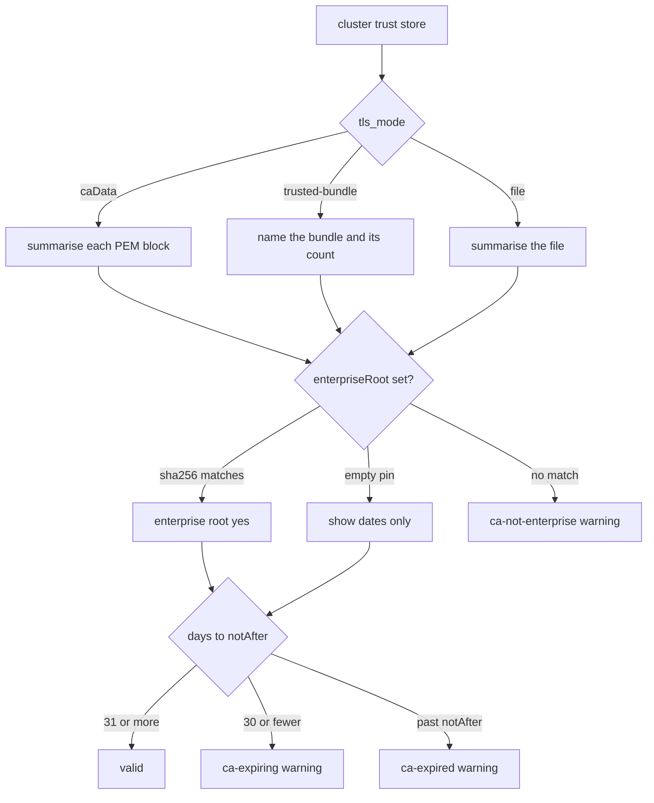

# SPEC D5 — CA visibility: is this the enterprise root, and is it still valid? (#244)

| | |
|---|---|
| Programme | Epic D (#384), Reconnect a cluster from the screen — the CA an operator must choose, inspect and keep current |
| Batch | D — reconnect |
| Release | — (post-programme; Epic D, after D4) |
| Version on release | app and chart minor bumps, assigned at the implementing PR |
| Issue | [#244](https://github.com/ephico2real2/group-sync-dashboard/issues/244) |
| Status | specified |
| Source | Written by the implementer from #244 and its comments, measured on this machine against main `268ea63` (application 1.6.0). No cluster access. |

## How to read this spec

Each section opens with its point in one bold line. §1 is the whole change in one table. §2 is what was
read and measured. §3 is the design. §4 maps every test. §5 is the page. §6 is the change as
implementation blocks (`docs/specs/README.md`, "Implementation blocks"), in apply order:

    python3 local-development/apply-spec-blocks.py docs/specs/SPEC_D5_ca_visibility.md . --apply

Citations use `file#name`. Upstream pages are linked, not backticked. Phase 1 writes this file, its
index row and the tests that hold the document; it applies no block.

## Orchestrator's notes

- **Phase 1 is the spec.** No production code is applied. Versions stay where they are; the
  implementing PR takes the next free MINOR.
- **The operator's rulings (comments of 2026-09-27) are not re-opened.** A CA is public PKI. A Secret
  or a ConfigMap is equally fine. What counts: is it the enterprise's valid root, and is it inside
  its validity dates? The warning before expiry reuses #314's `warnings` channel.
- **Review of the spec (OB2, 2026-09-28), the blocks applied to a copy and the suite run.** Six
  corrections, each a block here, none a design change: (1) `gsd/api.py`'s verify-failure hunk bound a
  local named `store`, which shadowed the closure's `store` read earlier in `list_cluster_configs` —
  every `GET /api/clusterconfigs` raised `UnboundLocalError`; (2) `test_ca_visibility.py` imported
  `test_connection` by name, which pytest collects as a test; (3) its empty-pin test generated a
  30-day certificate, which is `expiring` by §3.3's own rule; (4) its log assertion read `store=…`
  where `events._format_value` quotes a value with a space (`store="the system trust store"`);
  (5) two existing exact-shape assertions (`test_clusterconfig_tab.py`'s Test answer,
  `test_clusterconfig.py`'s row) needed the new keys; (6) `apiSend` rendered the §3.6 object detail as
  `[object Object]`, and no block painted `certificates` on the Test panel §5 promised. Added: a
  bundle-file cache in `ca.py` (a 128-block bundle costs 17 ms to decode and the API decoded it
  twice per live cluster per read), a three-mode test for the action text (the DoD names three
  modes), and a phase-aware `test_ca_visibility_spec.py` (after the apply it holds the tree to the
  blocks instead of failing on the created file).
- **Review of the spec (Codex, 2026-09-28), applied on top of OB2's patch.** Accepted: (1) the
  trusted-bundle summary must be the store the verifier actually uses — `gsd/config.py#_trusted_ca_context`
  starts from `ssl.create_default_context()` and loads every mounted path on top, so the count is
  that union, deduplicated by sha256, and a system root gets a real fingerprint from its DER so a
  pin can match it (OB2's `summarise_file` cache is kept for the mounted paths); (2) a bundle that
  is not UTF-8 must not break the inventory — `summarise_file` treats `UnicodeDecodeError` and
  `ValueError` like `OSError`, returns `[]` for that file, and never caches a failure; (3) the
  warning threshold compares remaining seconds, not floored days — "thirty days or fewer remain"
  means remaining ≤ 30 days exactly, and 30 days + 1 second is still `valid`; (4) §4 no longer
  claims every behaviour already has a fail-before/pass-after result — phase 1 holds the document,
  the behaviour tests are specified here and run in phase 2, and an anchor check is not behavioural
  evidence. Four of Codex's regressions live in the `test_ca_visibility.py` block:
  `test_system_root_can_match_enterprise_fingerprint`,
  `test_mounted_bundle_count_includes_system_roots` (compares against the real verifier's count),
  `test_non_text_bundle_does_not_crash_inventory`,
  `test_warning_does_not_start_a_fractional_day_early`. Rejected: Codex's phase-1 DoD ledger and
  `test_phase_one_lists_every_pending_dod_gate`, because the issue's Definition of Done already
  tracks those gates; Codex's store-shadow rename, `test_connection` alias, empty-pin isolation,
  quoted-store parse, exact-shape assertion edits, and Node UI test, because OB2's patch already
  covers each (one-line `store` assignment, `probe_connection` alias, a 365-day empty-pin cert,
  quoted-or-plain store assertion, shape-not-count trust keys, and a Playwright Test-panel test).
  Threshold disagreement: OB2 read `(end - now).days <= 30` as designed (30 days 23:59:59 left is
  `expiring`); Codex read it as a day early. Ruled by §3.3's own sentence: "Do not warn the day
  before that window" — remaining is compared in seconds, so 30 days + 1 second is `valid`.

## 1. The point, in one table

**The page will answer, per cluster, whether the trusted CA is this estate's root and whether that
certificate is still inside `notBefore`–`notAfter`. A warning fires thirty days before expiry. The
raw TLS error stays as evidence.**

| | |
|---|---|
| **What is missing** | A verify failure prints OpenSSL's sentence and nothing else. A pasted PEM shows no subject. A pinned CA expires with no warning. |
| **What counts** | Is this the enterprise root? Is it inside its dates? Warn before it expires. Where the PEM lives does not count. |
| **The pin** | `trustedCA.enterpriseRoot.sha256` — SHA-256 of the DER certificate, empty by default. `subject` is the fallback when only a DN is known. |
| **The warning** | `ca-expiring` on #314's `warnings` list. Not a finding. Nothing is refused. |
| **What does not change** | The three trust modes, their refusals, retired-row wording, RBAC, and the scrub of tokens and passwords. CA material is not scrubbed. |

## 2. Read and measured

### 2.1 Where the dashboard reads a CA today

**One function builds the verify context. The HTTP client only consumes it. The page only prints the mode word.**

| place | what it does |
|---|---|
| `gsd/config.py#_trusted_ca_context` | Loads every path in `GSD_TRUSTED_CA_FILE` (colon-separated) in turn. Cached on the env value plus each file's inode, mtime and size. A missing path is skipped. An empty result is not cached. |
| `gsd/config.py#ClusterConfig.verify` | `insecure` → `False`. `ca_data` → `ssl.create_default_context(cadata=…)`. `ca_bundle_file` → that file. Else the trusted-CA context, else Python's default store (`True`). |
| `gsd/config.py#ClusterConfig.tls_mode` | The word the API already serves: `caData`, `caBundleFile`, `serviceAccount`, `trusted-bundle`, or `insecure`. Never the PEM. |
| `gsd/kube.py#ClusterClient._client` | Calls `cluster.verify()` and passes the result to httpx. An unreadable bundle is `UNREACHABLE`, not `AUTH_FAILED`. |
| `gsd/clusterconfig/parser.py#parse_secret` | Decodes `tlsClientConfig.caData` and runs `ssl.create_default_context(cadata=…)` at parse. A bundle that does not load is `ca-data-invalid`. |
| `gsd/clusterconfig/writer.py#validate` | Same parse, before any write. A `ca-data-invalid` refusal names the field. It does not return the certificates. |
| `gsd/clusterconfig/writer.py#test_connection` | Validates, then probes `/version` and `users/~`. The answer is `{reachable, server_version, identity, error}`. No certificate summary. |
| `gsd/poller.py#_log_poll_failure` | On a verify failure, logs `store=` and `action=`. `store.record_poll` keeps only `exc.message`. The API serves that as `error`. |
| `gsd/api.py#list_cluster_configs` | Serves `tls` and `error`. No `action`, no `store`, no certificate list. `warnings` is only `gsd/clusterconfig/warnings.py#shared_api_warnings`. |
| the card (`ccTls`, `ccConnection`) | Prints `ca: trusted-bundle` / `ca: caData`. Prints the raw error. Retired: "unknown — its source no longer describes it". |

The chart already mounts two ConfigMaps into `GSD_TRUSTED_CA_FILE`
(`charts/group-sync-dashboard/values.yaml#trustedCA`, `charts/group-sync-dashboard/templates/trusted-ca.yaml`):
the OpenShift-injected bundle, and an optional `existingConfigMap` named `enterprise-ca` by default,
key `ca-bundle.crt`. `cryptography` is not a dependency (`local-development/pyproject.toml`) and is
not installed in the venv.

### 2.2 OpenShift's trusted-CA ConfigMap

**The cluster's extra roots live in a ConfigMap. The key is `ca-bundle.crt`. They are public.**

Red Hat, OpenShift 4.18, *Configuring certificates*
([docs.redhat.com](https://docs.redhat.com/en/documentation/openshift_container_platform/4.18/html/security_and_compliance/configuring-certificates)):

1. Create a ConfigMap in `openshift-config` from the root PEM: `--from-file=ca-bundle.crt=…`.
2. Point `proxy/cluster` `.spec.trustedCA.name` at that ConfigMap.
3. Nodes receive `/etc/pki/ca-trust/source/anchors/openshift-config-user-ca-bundle.crt`.

A ConfigMap labelled `config.openshift.io/inject-trusted-cabundle: "true"` is filled with the system
store merged with that trustedCA. That is method 1 of this chart (`trustedCA.injected`). Method 2 is
a ConfigMap the operator creates in the release namespace. Both are ConfigMaps. Neither is a secret
in the PKI sense.

### 2.3 cert-manager trust-manager

**trust-manager distributes a CA bundle as a ConfigMap by default, and as a Secret if you turn that
on. The source may be either kind. The bytes are the same.**

[cert-manager.io/docs/trust/trust-manager](https://cert-manager.io/docs/trust/trust-manager/):

- A `Bundle` reads ConfigMaps, Secrets, an inline PEM, or the default public CAs.
- The default target is a ConfigMap (`root-certs.pem` or similar) in selected namespaces.
- Secret targets exist from v0.7.0 and must be enabled on the controller.

That is the ecosystem's answer to "Secret or ConfigMap?": it does not matter. This spec does not
prefer one. `sourceKind` on the wire is a fact for the reader, never a scrub rule.

trust-manager's own docs warn against pinning an intermediate (it becomes a de-facto root). This
spec pins a root, by fingerprint.

### 2.4 Python `ssl`: dates, the leaf gap, the bundle cost

**The standard library can read `notBefore` and `notAfter`. It cannot list a CA:FALSE leaf through
`get_ca_certs()`. No new dependency.**

Measured on this machine, 2026-09-28, Python 3.14.7 / OpenSSL 3.6.4, venv without `cryptography`:

| measurement | result |
|---|---|
| default bundle `/etc/ssl/cert.pem` | 333 483 bytes, 128 PEM blocks |
| `create_default_context(); load_verify_locations(cafile=…); get_ca_certs()` | 219 certs in **0.0039** seconds |
| `create_default_context()` alone | 193 certs in 0.0042 seconds |
| keys on each dict | `subject`, `issuer`, `notBefore`, `notAfter`, `serialNumber`, `version` (and sometimes `subjectAltName`) |
| sample dates | `notBefore 'Jul 14 22:29:07 2026 GMT'`, `notAfter 'Jul 14 22:29:07 2027 GMT'` |
| parsed ISO-8601 UTC | `2027-07-14T22:29:07Z` via `" ".join(s.split())` then `"%b %d %H:%M:%S %Y %Z"` |
| SHA-256 of DER | `hashlib.sha256(ssl.PEM_cert_to_DER_cert(pem)).hexdigest()` equals `openssl x509 -noout -fingerprint -sha256` without colons |

The three-mock shapes, generated the same way as
`local-development/mock-app/deploy/tls-modes/pki-privateca.yaml` (a `isCA: true` root) and a
CA:FALSE leaf:

| PEM | `basicConstraints` | `ssl.create_default_context(cadata=pem).get_ca_certs()` |
|---|---|---|
| enterprise root (`CN=ldap-enterprise-ca`) | `CA:TRUE` | **1** — subject, issuer, dates |
| leaf signed by that root (`CN=mock-privateca`) | `CA:FALSE` | **0** — missing |
| `openssl req -x509` self-signed server | `CA:TRUE` (OpenSSL's default) | **1** |
| root + leaf concatenated | mixed | **1** — the root only |

`ctx.load_verify_locations(cadata=pem)` on a default context **merges** the system store, so
`get_ca_certs()[0]` is some public CA, not the pasted one. Summaries must use
`ssl.create_default_context(cadata=one_block)` for a CA, never a merge.

The leaf gap is why a pasted server certificate can vanish from the card. The decoder that still
sees it is `ssl._ssl._test_decode_cert(path)` — the same decoder `getpeercert` uses. It needs a
path, so each PEM block is written to a temp file and unlinked. That is the fallback when
`get_ca_certs()` is empty. It is not a new dependency.

A 219-certificate public bundle is cheap to read (four milliseconds) and too noisy to print. The
card for `trusted-bundle` names the store and the **count**. It lists a certificate only when that
certificate is the configured enterprise root.

Summarising is dearer than loading: one `create_default_context(cadata=block)` per block, 128
blocks of `/etc/ssl/cert.pem`, measured **0.017 s** (the leaf fallback: 100 decodes in 0.026 s).
`GET /api/clusterconfigs` summarises every live cluster twice (the row's `trust` and `ca_warnings`),
and the poller once per cycle, so `ca.py#summarise_file` caches a bundle file's list on its
`(mtime_ns, size)`, the way `config.py#_trusted_ca_context` caches its context. A pasted `caData` is
small and is decoded each time.

### 2.5 #314's warnings channel

**Advisories that refuse nothing. One list on `GET /api/clusterconfigs`. A banner on the tab. A log
line on appear and on clear.**

`gsd/clusterconfig/warnings.py#shared_api_warnings` returns
`{code, clusters, detail}`. Findings stay in `FINDING_CODES`. The poller announces a group once
when it appears and once when it clears (`gsd/poller.py#_announce_shared_api_urls`). Disabled
entries are skipped. This spec adds codes to the same list, not to `FINDING_CODES`.

## 3. The design

### 3.1 A Secret and a ConfigMap are equal

**The bytes are public trust material. The Kubernetes kind is a fact, not a rule.**

- The page and the logs may show subject, issuer, fingerprint, `notBefore` and `notAfter`.
- No scrub applies to CA PEM, `caData`, or a bundle path. Tokens, passwords and client keys stay
  secret. This matches the reviews of #434 and #316, which declined adding `ca_data` to the scrub
  list.
- `sourceKind` is `secret`, `configmap`, `file` or `system`. It never changes verification.

### 3.2 How 'the enterprise's root' is configured

**Pin the certificate by SHA-256 of its DER encoding. Leave the pin empty until the estate names
one. Subject is a fallback, not the default.**

```yaml
trustedCA:
  enterpriseRoot:
    sha256: ""          # 64 hex digits; colons optional. openssl x509 -noout -fingerprint -sha256
    subject: ""         # RFC4514 DN or a CN=… suffix. Used only when sha256 is empty.
  expiryWarningDays: 30
```

Why fingerprint, and why empty:

1. Two CAs can share a subject (a reissue). One fingerprint names one certificate.
2. Browsers, OpenSSL's `-fingerprint`, and trust-manager's "copy the root" advice all identify a
   certificate this way.
3. This chart already has `trustedCA.existingConfigMap.subjectHash`. That is OpenSSL's **eight-hex**
   hashed-directory name for curl's `capath`. It is not an identity pin. Do not reuse `subjectHash`.
4. Every estate's root is different. A shipped fingerprint would be someone else's CA. Empty is the
   only honest default: the page still shows dates, and `enterpriseRoot` on the wire is `null`.

A certificate matches when its SHA-256 equals the configured digest. If only `subject` is set, it
matches when `subject` equals the configured string, or ends with it (`CN=ldap-enterprise-ca`).
When either is set and no certificate in the store matches: `enterpriseRoot: false` and a
`ca-not-enterprise` warning. The cluster is still polled.

A non-empty `sha256` that is not 64 hex digits (after stripping colons) is refused at load, naming
the key. `expiryWarningDays` is 1..3650; anything else falls back to 30 with a warning.

Env overrides, same pattern as the other settings: `GSD_ENTERPRISE_CA_SHA256`,
`GSD_ENTERPRISE_CA_SUBJECT`, `GSD_CA_EXPIRY_WARNING_DAYS`.

### 3.3 Validity and the thirty-day warning

**Warn when thirty days or fewer remain. Do not warn the day before that window. Never refuse.**

`validity` on each listed certificate is one of `valid`, `expiring`, `expired`, `not-yet-valid`.

| remaining time | word | warning code |
|---|---|---|
| `now < notBefore` | `not-yet-valid` | `ca-not-yet-valid` |
| `now > notAfter` | `expired` | `ca-expired` |
| 0 to 30 days left (the threshold) | `expiring` | `ca-expiring` |
| 31 days left (the day before) | `valid` | none |

Thirty days is Let's Encrypt's neighbourhood and the common operational default. A ten-year root
still gets a month of notice. The value lives in `values.yaml` as `trustedCA.expiryWarningDays`.

Who is watched:

- `caData`, `caBundleFile`, `serviceAccount`: every certificate in that pin.
- `trusted-bundle`: only the configured enterprise root. A 219-certificate public bundle is not
  a chore list.
- `insecure`: nothing. There is no CA.

Warnings join `shared_api_warnings` on the same list. Each item is
`{code, clusters, detail}`. `detail` names the cluster, the subject and the date, and says the
cluster is still polled. The poller logs appear/clear the way it does for `shared-api-url`.
Disabled entries are skipped. These codes are **never a finding** and do not join `FINDING_CODES`.

### 3.4 One function for the verify-failure sentence

**`gsd/clusterconfig/ca.py#tls_verify_failure` returns `(action, store)`. The poller and the API
both call it. The two cannot drift.**

The words are today's words from `gsd/poller.py#_log_poll_failure`, moved, not rewritten:

| mode | `store` | `action` |
|---|---|---|
| `caData` | `secret:<name>/tlsClientConfig.caData` | replace that `caData` with the CA that signs the API server |
| `trusted-bundle` | `$GSD_TRUSTED_CA_FILE` or `the system trust store` | add the CA to `trustedCA.existingConfigMap`, or set this cluster's `caData` |
| file / serviceAccount | the file path | point it at the CA that signs this API server |

The API adds `action` and `store` on a live row whose `error` is a verify failure
(`gsd/clusterconfig/events.py#is_verify_failure`). The raw `error` stays. The card prints the
action under the error. `store.record_poll` is unchanged: no schema migration.

The log line and the API field are the same two strings. A test compares them.

### 3.5 The `trust` object

**Every live row gains `trust`. A retired row does not: its source no longer describes it.**

```json
{
  "store": "/etc/pki/…/injected/ca-bundle.crt:/etc/pki/…/enterprise/ca-bundle.crt",
  "sourceKind": "configmap",
  "count": 148,
  "enterpriseRoot": true,
  "certificates": [
    {"subject": "CN=ldap-enterprise-ca,O=Ephico",
     "issuer": "CN=ldap-enterprise-ca,O=Ephico",
     "notBefore": "2026-01-01T00:00:00Z",
     "notAfter": "2036-01-01T00:00:00Z",
     "sha256": "2b7201606a256b8b02fa38ccf229f73867aa4430515c16ea8ad146025c5ff934",
     "enterpriseRoot": true,
     "validity": "valid"}
  ]
}
```

`enterpriseRoot` on the object is `true` / `false` when a pin is set, else `null`.
`certificates` for `trusted-bundle` is the matching enterprise root, or `[]`.
`certificates` for `caData` is every PEM block that decoded, leaf included.

### 3.6 The Test response and a `ca-data-invalid` refusal

**Both return the summary the pasted PEM resolved to.**

`POST /api/clusterconfigs/test` gains `certificates` (the same dicts, without requiring a pin).

A `ca-data-invalid` refusal that decoded at least one block answers

```json
{"detail": {"code": "ca-data-invalid", "message": "…", "certificates": […]}}
```

A refusal that decoded nothing keeps today's string `ca-data-invalid: …`, so existing tests that
read `detail.startswith("ca-data-invalid:")` still pass for an empty or non-PEM paste. The one
test that covers every refusal accepts either a string or that object.

The page's `apiSend` turns an object detail into the message `code: message` and keeps the object
on `err.detail`; the Test panel paints `certificates` the way the card does (`.cc-ca-cert`).

### 3.7 Must not change

- The three modes and their refusals (`insecure-with-ca`, `ca-data-invalid`, empty `caData`), at
  parse, not at first poll.
- The raw exception, visible under the new sentence.
- Retired rows: "unknown — its source no longer describes it".
- No new Python dependency.
- No RBAC change. No version field in this spec's blocks.
- Tokens, passwords and client keys stay scrubbed.



## 4. Tests

**The table describes proposed behavioural coverage, not measured fail-before/pass-after
results. Phase 1 holds the document. The behaviour tests are specified here and run in
phase 2. An anchor check is not behavioural evidence.**

| behaviour | test |
|---|---|
| a CA PEM lists subject, issuer, both dates, sha256 | `test_ca_visibility.py::test_a_ca_pem_lists_subject_issuer_dates_and_fingerprint` |
| a CA:FALSE leaf is still listed | `test_ca_visibility.py::test_a_leaf_pasted_as_cadata_is_listed` |
| `create_default_context(cadata=)` does not merge the system store | `test_ca_visibility.py::test_a_pasted_bundle_is_not_merged_with_the_system_store` |
| fingerprint matches openssl | `test_ca_visibility.py::test_sha256_matches_openssl` |
| enterprise match by sha256, not by a colliding subject | `test_ca_visibility.py::test_enterprise_root_matches_fingerprint_not_a_colliding_subject` |
| empty pin → `enterpriseRoot` is null, no `ca-not-enterprise` | `test_ca_visibility.py::test_an_empty_pin_does_not_claim_an_enterprise_root` |
| warning at 30 days, not at 31 | `test_ca_visibility.py::test_expiring_at_the_threshold_and_not_the_day_before` |
| trusted-bundle expiry watches only the enterprise root | `test_ca_visibility.py::test_trusted_bundle_expiry_watches_only_the_enterprise_root` |
| warnings are not findings | `test_ca_visibility.py::test_ca_warnings_are_not_findings` |
| action text is identical in the log and the API | `test_ca_visibility.py::test_the_action_text_is_identical_in_the_log_and_the_api` |
| Test response carries the summary | `test_ca_visibility.py::test_the_test_response_carries_the_certificate_summary` |
| `ca-data-invalid` with a decoded block carries the summary | `test_ca_visibility.py::test_ca_data_invalid_returns_what_decoded` |
| Secret and ConfigMap are equal sources | `test_ca_visibility.py::test_a_secret_and_a_configmap_are_equal_sources` |
| a bundle file is decoded once until it changes | `test_ca_visibility.py::test_a_bundle_file_is_decoded_once_until_it_changes` |
| action and store agree in the log and the API for `trusted-bundle`, `caData` and a file | `test_ca_visibility.py::test_the_action_and_store_agree_in_the_log_and_the_api_for_every_mode` |
| a system-trusted enterprise root can match the pin | `test_ca_visibility.py::test_system_root_can_match_enterprise_fingerprint` |
| a mounted bundle's count is the verifier's union with the system roots | `test_ca_visibility.py::test_mounted_bundle_count_includes_system_roots` |
| a non-UTF-8 bundle file does not crash the inventory | `test_ca_visibility.py::test_non_text_bundle_does_not_crash_inventory` |
| the warning does not start a fractional day early | `test_ca_visibility.py::test_warning_does_not_start_a_fractional_day_early` |
| the Test panel paints the certificates; an object refusal reads as text | `test_ui.py::test_the_test_result_paints_the_certificates_and_a_refusal_object_reads_as_text` |
| card shows action and store per mode | `test_ui.py::test_a_verify_failure_shows_the_store_and_the_fix` |
| card lists a pasted CA | `test_ui.py::test_a_cadata_card_lists_subject_and_expiry` |
| banner uses the warnings channel | `test_ui.py::test_ca_expiring_uses_the_warnings_banner` |
| this document | `test_ca_visibility_spec.py` |

The browser tests live in `local-development/tests/test_ui.py`. Phase 1 cannot run them: they need
the applied page. Phase 2 runs them with the rest of the browser suite.

## 5. The page

**The tls row grows the store, the count, the enterprise chip, and each listed certificate. A
verify failure keeps the raw error and adds the fix under it. Warnings use the existing banner.**

- Retired wording is unchanged.
- `ca-expiring` / `ca-expired` / `ca-not-yet-valid` / `ca-not-enterprise` get their own banner
  title, the way `shared-api-url` already does.
- The form's Test result paints the same certificate lines.

Docs the implementing PR updates (in the blocks): `docs/DESIGN_cluster_connection_flows.md` §2,
`charts/group-sync-dashboard/README.md` (the threshold and the pin), `local-development/API.md`.

## 6. Implementation blocks

<!-- block: local-development/gsd/clusterconfig/ca.py | create -->
```python
"""Read a cluster's trusted certificates and say whether they are the enterprise root (#244).

A CA is public PKI. A Secret and a ConfigMap are equal sources. Nothing here is scrubbed.
"""
from __future__ import annotations

import hashlib
import os
import re
import ssl
import tempfile
from datetime import datetime, timezone
from pathlib import Path

from ..config import SA_CA_PATH, ClusterConfig, Settings

PEM_BLOCK = re.compile(r"-----BEGIN CERTIFICATE-----.*?-----END CERTIFICATE-----", re.S)

VALID = "valid"
EXPIRING = "expiring"
EXPIRED = "expired"
NOT_YET = "not-yet-valid"


def openssl_time(value: str) -> datetime:
    """OpenSSL's `Dec 31 08:38:15 2030 GMT` (or a double-spaced day) as UTC."""
    return datetime.strptime(" ".join(value.split()), "%b %d %H:%M:%S %Y %Z").replace(tzinfo=timezone.utc)


def iso_utc(value: datetime) -> str:
    return value.astimezone(timezone.utc).strftime("%Y-%m-%dT%H:%M:%SZ")


def dn_text(name: object) -> str:
    """get_ca_certs() subject/issuer tuples as a readable DN."""
    if isinstance(name, str):
        return name
    parts = []
    for rdn in name or ():
        for key, val in rdn:
            short = {"commonName": "CN", "organizationName": "O", "organizationalUnitName": "OU",
                     "countryName": "C", "stateOrProvinceName": "ST", "localityName": "L"}.get(key, key)
            parts.append(f"{short}={val}")
    return ",".join(parts)


def sha256_of_pem(pem: str) -> str:
    return hashlib.sha256(ssl.PEM_cert_to_DER_cert(pem.strip() + "\n")).hexdigest()


def normalise_sha256(value: str) -> str:
    return re.sub(r"[^0-9a-fA-F]", "", value or "").lower()


def pem_blocks(text: str) -> list[str]:
    return [m.group(0) for m in PEM_BLOCK.finditer(text or "")]


def _from_info(info: dict, pem: str | None) -> dict:
    return {
        "subject": dn_text(info.get("subject")),
        "issuer": dn_text(info.get("issuer")),
        "notBefore": iso_utc(openssl_time(info["notBefore"])),
        "notAfter": iso_utc(openssl_time(info["notAfter"])),
        "sha256": sha256_of_pem(pem) if pem else "",
    }


def decode_one(pem: str) -> dict | None:
    """One PEM block: get_ca_certs() for a CA, the private decoder for a leaf.

    create_default_context(cadata=) with a CA:FALSE leaf returns an empty list
    (measured on Python 3.14.7 / OpenSSL 3.6.4). _test_decode_cert is the same
    decoder getpeercert uses; it needs a path, so the block is written to a temp file.
    """
    try:
        listed = ssl.create_default_context(cadata=pem).get_ca_certs()
    except ssl.SSLError:
        listed = []
    if listed:
        return _from_info(listed[0], pem)
    try:
        with tempfile.NamedTemporaryFile("w", suffix=".crt", delete=False) as tmp:
            tmp.write(pem if pem.endswith("\n") else pem + "\n")
            path = tmp.name
        try:
            info = ssl._ssl._test_decode_cert(path)
        finally:
            os.unlink(path)
    except (OSError, ValueError, ssl.SSLError):
        return None
    return _from_info(info, pem)


def summarise_pem(pem: str) -> list[dict]:
    """Every certificate in a PEM bundle, including a pasted leaf."""
    out = []
    for block in pem_blocks(pem):
        cert = decode_one(block)
        if cert:
            out.append(cert)
    return out


_BUNDLE_CACHE: dict[str, tuple[tuple[int, int], list[dict]]] = {}


def summarise_file(path: str) -> list[dict]:
    """One bundle file's certificates, cached on (mtime_ns, size) the way `config._trusted_ca_context`
    caches its context: the API summarises every live cluster on every read and the poller on every
    cycle, and a 128-block bundle costs 17 ms to decode (measured, Python 3.14.7 / OpenSSL 3.6.4).
    A stale hit is impossible without a same-size same-mtime rewrite; a race between the API thread
    and the poller costs one redundant decode, never a wrong list."""
    try:
        st = os.stat(path)
    except OSError:
        return []
    key = (st.st_mtime_ns, st.st_size)
    hit = _BUNDLE_CACHE.get(path)
    if hit is not None and hit[0] == key:
        return hit[1]
    try:
        certs = summarise_pem(Path(path).read_text())
    except (OSError, UnicodeDecodeError, ValueError):
        return []  # never cache a failure: a later readable file must be retried
    _BUNDLE_CACHE[path] = (key, certs)
    return certs


def summarise_paths(paths: list[str]) -> list[dict]:
    out, seen = [], set()
    for path in paths:
        for cert in summarise_file(path):
            if cert["sha256"] in seen:
                continue
            seen.add(cert["sha256"])
            out.append(cert)
    return out


def trusted_paths() -> list[str]:
    paths = []
    for part in os.environ.get("GSD_TRUSTED_CA_FILE", "").split(":"):
        path = part.strip()
        if path and Path(path).is_file():
            paths.append(path)
    return paths


def match_enterprise(cert: dict, sha256: str, subject: str) -> bool:
    want = normalise_sha256(sha256)
    if want:
        return normalise_sha256(cert.get("sha256") or "") == want
    if subject:
        got = cert.get("subject") or ""
        return got == subject or got.endswith(subject)
    return False


def validity_word(not_before: str, not_after: str, now: datetime, warn_days: int) -> str:
    start = datetime.fromisoformat(not_before.replace("Z", "+00:00"))
    end = datetime.fromisoformat(not_after.replace("Z", "+00:00"))
    if now.tzinfo is None:
        now = now.replace(tzinfo=timezone.utc)
    if now < start:
        return NOT_YET
    if now > end:
        return EXPIRED
    if (end - now).total_seconds() <= warn_days * 86400:
        return EXPIRING
    return VALID


def tls_verify_failure(cluster: ClusterConfig) -> tuple[str, str]:
    """The one (action, store) pair for a cert-verify-failed line and the card."""
    mode = cluster.tls_mode
    if mode["ca"] == "caData":
        secret = cluster.source.split(":", 1)[-1]
        action = (f"this cluster pins its own CA: replace tlsClientConfig.caData in Secret "
                  f"{secret} with the CA that signs its API server")
        store = f"secret:{secret}/tlsClientConfig.caData"
    elif mode["ca"] == "trusted-bundle":
        action = ("add the CA to the chart's trustedCA.existingConfigMap (fleet-wide), or set "
                  "tlsClientConfig.caData on this cluster's Secret (this cluster only)")
        store = os.environ.get("GSD_TRUSTED_CA_FILE") or "the system trust store"
    else:
        action = (f"the CA comes from {mode['ca']}: point it at the CA that signs this "
                  f"cluster's API server")
        store = cluster.ca_bundle_file or mode["ca"]
    return action, store


def store_of(cluster: ClusterConfig) -> tuple[str, str]:
    """(store label, sourceKind). Kind is a fact, never a security distinction."""
    mode = cluster.tls_mode
    if mode["insecure"]:
        return "insecure", "none"
    if mode["ca"] == "caData":
        secret = cluster.source.split(":", 1)[-1]
        return f"secret:{secret}/tlsClientConfig.caData", "secret"
    if mode["ca"] == "serviceAccount":
        return SA_CA_PATH, "file"
    if mode["ca"] == "caBundleFile":
        return cluster.ca_bundle_file or "caBundleFile", "file"
    if trusted_paths():
        return os.environ.get("GSD_TRUSTED_CA_FILE") or "the trusted bundle", "configmap"
    return "the system trust store", "system"


def annotate(certs: list[dict], settings: Settings, now: datetime | None = None) -> list[dict]:
    now = now or datetime.now(timezone.utc)
    pinned = bool(settings.enterprise_ca_sha256 or settings.enterprise_ca_subject)
    out = []
    for cert in certs:
        row = dict(cert)
        row["enterpriseRoot"] = (match_enterprise(row, settings.enterprise_ca_sha256,
                                                  settings.enterprise_ca_subject) if pinned else None)
        row["validity"] = validity_word(row["notBefore"], row["notAfter"], now,
                                        settings.ca_expiry_warning_days)
        out.append(row)
    return out


def summarise_cluster(cluster: ClusterConfig, settings: Settings,
                      now: datetime | None = None) -> dict:
    now = now or datetime.now(timezone.utc)
    store, kind = store_of(cluster)
    mode = cluster.tls_mode
    if mode["insecure"]:
        return {"store": store, "sourceKind": kind, "count": 0, "enterpriseRoot": None,
                "certificates": []}
    if cluster.ca_data:
        certs = summarise_pem(cluster.ca_data)
    elif cluster.ca_bundle_file:
        certs = summarise_paths([cluster.ca_bundle_file])
    else:
        # verify() merges the default store with these mounted paths. Preserve
        # that union and each root's DER fingerprint in the displayed inventory.
        context = ssl.create_default_context()
        by_digest = {}
        for der in context.get_ca_certs(binary_form=True):
            cert = decode_one(ssl.DER_cert_to_PEM_cert(der))
            if cert:
                by_digest[cert["sha256"]] = cert
        for cert in summarise_paths(trusted_paths()):
            by_digest[cert["sha256"]] = cert
        certs = list(by_digest.values())
    shown = annotate(certs, settings, now)
    pinned = bool(settings.enterprise_ca_sha256 or settings.enterprise_ca_subject)
    enterprise = any(c["enterpriseRoot"] for c in shown) if pinned else None
    if mode["ca"] == "trusted-bundle":
        listed = [c for c in shown if c["enterpriseRoot"]] if pinned else []
    else:
        listed = shown
    return {"store": store, "sourceKind": kind, "count": len(shown),
            "enterpriseRoot": enterprise, "certificates": listed}
```

<!-- block: local-development/gsd/clusterconfig/warnings.py | edit -->
```python
from ..config import ClusterConfig
from ..fleetlookup import CredentialGate
```
```python
from datetime import datetime, timezone

from ..config import ClusterConfig, Settings
from ..fleetlookup import CredentialGate
from .ca import EXPIRED, EXPIRING, NOT_YET, summarise_cluster
```

<!-- block: local-development/gsd/clusterconfig/warnings.py | after:             for url, names in shared_api_urls(clusters).items()] -->
```python


def ca_warnings(clusters: list[ClusterConfig], settings: Settings,
                now: datetime | None = None) -> list[dict]:
    """Expiry and enterprise-root advisories; these never refuse a configuration."""
    now = now or datetime.now(timezone.utc)
    words = {EXPIRING: "ca-expiring", EXPIRED: "ca-expired", NOT_YET: "ca-not-yet-valid"}
    out: list[dict] = []
    for cluster in clusters:
        if not cluster.enabled:
            continue
        trust = summarise_cluster(cluster, settings, now)
        if trust["enterpriseRoot"] is False:
            pin = settings.enterprise_ca_sha256 or settings.enterprise_ca_subject
            out.append({"code": "ca-not-enterprise", "clusters": [cluster.name],
                        "detail": f"{cluster.name} does not trust the configured enterprise root "
                                  f"({pin}). The cluster is still polled."})
        for cert in trust["certificates"]:
            code = words.get(cert["validity"])
            if not code:
                continue
            when = cert["notBefore"] if cert["validity"] == NOT_YET else cert["notAfter"]
            out.append({"code": code, "clusters": [cluster.name],
                        "detail": f"{cluster.name}'s CA {cert['subject']} is "
                                  f"{cert['validity'].replace('-', ' ')} ({when}). "
                                  f"The cluster is still polled."})
    return out
```

<!-- block: local-development/gsd/config.py | after:     fleet_ping_interval_seconds: int = 86400 -->
```python
    # #244: the estate's root CA, pinned by SHA-256 of the DER certificate. Empty: the page
    # still shows dates and does not claim any certificate is the enterprise root.
    enterprise_ca_sha256: str = ""
    enterprise_ca_subject: str = ""
    ca_expiry_warning_days: int = 30
```

<!-- block: local-development/gsd/config.py | after:         fleet_ping_interval_seconds=_num_setting(raw, "GSD_FLEET_PING_INTERVAL_SECONDS", "fleetPingIntervalSeconds", 86400, int), -->
```python
        enterprise_ca_sha256=_enterprise_sha256(raw),
        enterprise_ca_subject=_str_setting(raw, "GSD_ENTERPRISE_CA_SUBJECT", "enterpriseCaSubject", ""),
        ca_expiry_warning_days=_ca_expiry_days(raw),
```

<!-- block: local-development/gsd/config.py | after:     return str(default if source is None else source).strip() -->
```python


def _enterprise_sha256(raw: dict) -> str:
    """64 hex digits after stripping colons; empty is the default. A typo is refused by name."""
    value = _str_setting(raw, "GSD_ENTERPRISE_CA_SHA256", "enterpriseCaSha256", "")
    if not value:
        return ""
    hexed = re.sub(r"[^0-9a-fA-F]", "", value)
    if len(hexed) != 64:
        raise ConfigError("enterpriseCaSha256 must be a SHA-256 hex digest (64 digits, colons optional)")
    return hexed.lower()


def _ca_expiry_days(raw: dict) -> int:
    days = _num_setting(raw, "GSD_CA_EXPIRY_WARNING_DAYS", "caExpiryWarningDays", 30, int)
    if not 1 <= days <= 3650:
        log.warning("caExpiryWarningDays=%r is outside 1..3650; using 30", days)
        return 30
    return days
```

<!-- block: local-development/gsd/poller.py | edit -->
```python
    from .clusterconfig.events import failure, is_verify_failure
```
```python
    from .clusterconfig.ca import tls_verify_failure
    from .clusterconfig.events import failure, is_verify_failure
```

<!-- block: local-development/gsd/poller.py | edit -->
```python
        if mode["ca"] == "caData":
            secret = cluster.source.split(":", 1)[-1]
            action = (f"this cluster pins its own CA: replace tlsClientConfig.caData in Secret "
                      f"{secret} with the CA that signs its API server")
            store = f"secret:{secret}/tlsClientConfig.caData"
        elif mode["ca"] == "trusted-bundle":
            action = ("add the CA to the chart's trustedCA.existingConfigMap (fleet-wide), or set "
                      "tlsClientConfig.caData on this cluster's Secret (this cluster only)")
            store = os.environ.get("GSD_TRUSTED_CA_FILE") or "the system trust store"
        else:
            action = (f"the CA comes from {mode['ca']}: point it at the CA that signs this "
                      f"cluster's API server")
            # `store=` MUST name what this cluster actually used (Codex C3): reporting the
            # fleet's colon-separated bundle for a cluster reading its own file sent the reader
            # to the wrong object entirely.
            store = cluster.ca_bundle_file or mode["ca"]
        failure(log, "cluster-unreachable", phase="tls", outcome="cert-verify-failed",
```
```python
        action, store = tls_verify_failure(cluster)
        failure(log, "cluster-unreachable", phase="tls", outcome="cert-verify-failed",
```

<!-- block: local-development/gsd/poller.py | after:         self._shared_api_urls: set[tuple[str, tuple[str, ...]]] = set() -->
```python
        self._ca_warning_keys: set[tuple] = set()
```

<!-- block: local-development/gsd/poller.py | edit -->
```python
        self._shared_api_urls = groups
```
```python
        self._shared_api_urls = groups
        from .clusterconfig.warnings import ca_warnings
        keys = {(w["code"], tuple(w["clusters"]), w["detail"]) for w in ca_warnings(
            self.settings.effective_clusters(), self.settings)}
        for state, transitions in (("cleared", self._ca_warning_keys - keys),
                                   ("appeared", keys - self._ca_warning_keys)):
            for code, names, detail in sorted(transitions):
                event(discovery_log, logging.WARNING if state == "appeared" else logging.INFO,
                      code, clusters=",".join(names), state=state, detail=detail,
                      cycle=self._discovery_cycle)
        self._ca_warning_keys = keys
```

<!-- block: local-development/gsd/clusterconfig/writer.py | edit -->
```python
    def __init__(self, code: str, detail: str, *, conflict: bool = False):
        super().__init__(f"{code}: {detail}")
        self.code, self.detail, self.conflict = code, detail, conflict
```
```python
    def __init__(self, code: str, detail: str, *, conflict: bool = False, certificates: list | None = None):
        super().__init__(f"{code}: {detail}")
        self.code, self.detail, self.conflict = code, detail, conflict
        self.certificates = certificates or []
```

<!-- block: local-development/gsd/clusterconfig/writer.py | edit -->
```python
    if req.tls_mode == "caData":
        if not req.ca_data:
            raise WriteRefused("ca-data-invalid", "tls.mode caData needs tls.caData (a base64 PEM bundle)")
        try:
            base64.b64decode(req.ca_data, validate=True)
        except (binascii.Error, ValueError):
            raise WriteRefused("ca-data-invalid", "tls.caData must be a base64 PEM bundle") from None
```
```python
    summary: list = []
    if req.tls_mode == "caData":
        if not req.ca_data:
            raise WriteRefused("ca-data-invalid", "tls.mode caData needs tls.caData (a base64 PEM bundle)")
        try:
            pem = base64.b64decode(req.ca_data, validate=True).decode("utf-8")
        except (binascii.Error, ValueError, UnicodeDecodeError):
            raise WriteRefused("ca-data-invalid", "tls.caData must be a base64 PEM bundle") from None
        from .ca import summarise_pem
        summary = summarise_pem(pem)
```

<!-- block: local-development/gsd/clusterconfig/writer.py | edit -->
```python
    if isinstance(parsed, Finding):
        raise WriteRefused(parsed.code, parsed.detail)
```
```python
    if isinstance(parsed, Finding):
        raise WriteRefused(parsed.code, parsed.detail, certificates=summary)
```

<!-- block: local-development/gsd/clusterconfig/writer.py | after:     out["error"] = None if exc is None else _scrub(f"{exc.outcome}: {exc.message}", req.token) -->
```python
    from .ca import summarise_pem
    out["certificates"] = summarise_pem(parsed.ca_data or "")
```

<!-- block: local-development/gsd/api.py | edit -->
```python
        from .clusterconfig.warnings import shared_api_warnings
```
```python
        from .clusterconfig.ca import summarise_cluster, tls_verify_failure
        from .clusterconfig.events import is_verify_failure
        from .clusterconfig.warnings import ca_warnings, shared_api_warnings
```

<!-- block: local-development/gsd/api.py | edit -->
```python
                "status": row.get("status"), "last_poll": row.get("last_poll"), "error": row.get("message"),
                "retired": False, "onboarding_configmap": c.onboarding[0] if c.onboarding else None,
```
```python
                "status": row.get("status"), "last_poll": row.get("last_poll"), "error": row.get("message"),
                "retired": False, "onboarding_configmap": c.onboarding[0] if c.onboarding else None,
                "trust": summarise_cluster(c, settings),
```

<!-- block: local-development/gsd/api.py | edit -->
```python
                "rejoinable": rejoin_refusal(c, settings) is None,
            })
```
```python
                "rejoinable": rejoin_refusal(c, settings) is None,
            })
            if row.get("message") and is_verify_failure(row["message"]) and not c.insecure_skip_verify:
                # one line, no local named `store`: list_cluster_configs reads the closure's `store` above
                clusters[-1]["action"], clusters[-1]["store"] = tls_verify_failure(c)
```

<!-- block: local-development/gsd/api.py | edit -->
```python
            "warnings": shared_api_warnings(effective),
```
```python
            "warnings": shared_api_warnings(effective) + ca_warnings(effective, settings),
```

<!-- block: local-development/gsd/api.py | edit -->
```python
        if isinstance(exc, WriteRefused):
            return HTTPException(status_code=409 if exc.conflict else 422, detail=f"{exc.code}: {exc.detail}")
```
```python
        if isinstance(exc, WriteRefused):
            if exc.certificates:
                return HTTPException(status_code=409 if exc.conflict else 422,
                                     detail={"code": exc.code, "message": exc.detail,
                                             "certificates": exc.certificates})
            return HTTPException(status_code=409 if exc.conflict else 422, detail=f"{exc.code}: {exc.detail}")
```

<!-- block: local-development/gsd/static/index.html | edit -->
```javascript
  return t.insecure ? ccBadge("warning", "insecure") : `${ccBadge("ok", "verified")} <span class="mono">ca: ${esc(t.ca || "")}</span>`;
}
```
```javascript
  let out = t.insecure ? ccBadge("warning", "insecure") : `${ccBadge("ok", "verified")} <span class="mono">ca: ${esc(t.ca || "")}</span>`;
  const trust = c.trust || {};
  if (trust.store && !t.insecure) {
    out += `<div class="cc-hint cc-trust-store">store ${esc(trust.store)} · ${trust.count || 0} certificate${trust.count === 1 ? "" : "s"}</div>`;
  }
  if (trust.enterpriseRoot === true) out += ` ${ccBadge("ok", "enterprise root")}`;
  if (trust.enterpriseRoot === false) out += ` ${ccBadge("warning", "not enterprise root")}`;
  for (const cert of (trust.certificates || [])) {
    const extra = cert.validity && cert.validity !== "valid" ? ` · ${esc(cert.validity)}` : "";
    out += `<div class="cc-hint cc-ca-cert" data-cc-ca="${esc(cert.sha256 || "")}">${esc(cert.subject)} · issuer ${esc(cert.issuer)} · ${esc(cert.notAfter)}${extra}</div>`;
  }
  return out;
}
```

<!-- block: local-development/gsd/static/index.html | after:   if (c.error) out += `<div class="err">${esc(c.error)}</div>`; -->
```javascript
  if (c.action) out += `<div class="cc-consq" data-cc-tls-action>${esc(c.action)}</div>`;
  if (c.store && c.action) out += `<div class="cc-hint" data-cc-tls-store>store ${esc(c.store)}</div>`;
```

<!-- block: local-development/gsd/static/index.html | edit -->
```javascript
    ${(d.warnings || []).map((w) => `<div class="cc-warn" role="status" data-cc-warning="${esc(w.code)}"><span aria-hidden="true">⚠️</span> <strong>${w.code === "shared-api-url" ? "Shared API URL." : "Configuration warning."}</strong> ${esc(w.detail)}</div>`).join("")}
```
```javascript
    ${(d.warnings || []).map((w) => `<div class="cc-warn" role="status" data-cc-warning="${esc(w.code)}"><span aria-hidden="true">⚠️</span> <strong>${({ "shared-api-url": "Shared API URL.", "ca-expiring": "CA expiring.", "ca-expired": "CA expired.", "ca-not-yet-valid": "CA not yet valid.", "ca-not-enterprise": "Not the enterprise root." }[w.code] || "Configuration warning.")}</strong> ${esc(w.detail)}</div>`).join("")}
```

<!-- block: local-development/gsd/static/index.html | edit -->
```javascript
    const err = new Error(payload && payload.detail ? String(payload.detail) : `${res.status} ${res.statusText}`);
    err.status = res.status; throw err;
```
```javascript
    // #244: a `ca-data-invalid` refusal that decoded some blocks answers an object {code, message, certificates};
    // every other refusal is still a string. The message reads the same either way; the object stays on `err.detail`.
    const detail = payload && payload.detail;
    const text = detail && typeof detail === "object" ? `${detail.code}: ${detail.message}` : detail ? String(detail) : `${res.status} ${res.statusText}`;
    const err = new Error(text);
    err.status = res.status; err.detail = detail; throw err;
```

<!-- block: local-development/gsd/static/index.html | edit -->
```javascript
        ${test.error ? `<div class="err">${esc(test.error)}</div>` : ""}</div>`;
```
```javascript
        ${test.error ? `<div class="err">${esc(test.error)}</div>` : ""}
        ${(test.certificates || []).map((cert) => `<div class="cc-hint cc-ca-cert" data-cc-ca="${esc(cert.sha256 || "")}">${esc(cert.subject)} · issuer ${esc(cert.issuer)} · ${esc(cert.notAfter)}</div>`).join("")}</div>`;
```

<!-- block: charts/group-sync-dashboard/values.yaml | after:     subjectHash: "" -->
```yaml

  # #244: which certificate is this estate's root, and when to warn that it will expire.
  # A CA is public PKI. The pin is the SHA-256 of the DER certificate (`openssl x509
  # -noout -fingerprint -sha256`), 64 hex digits, colons optional. Empty: the page
  # still shows subject, issuer and dates, and does not claim any certificate is
  # the enterprise root. subject is the fallback when only a DN is known; two CAs
  # can share a subject, so the fingerprint is the one that names one certificate.
  # Do not reuse existingConfigMap.subjectHash: that is OpenSSL's 8-hex hashed
  # directory name for curl, not an identity pin.
  enterpriseRoot:
    sha256: ""
    subject: ""
  # Days before notAfter at which a ca-expiring warning is emitted. 30 is Let's
  # Encrypt's neighbourhood and the common operational default. A ten-year root
  # still gets a month of notice. The warning fires at this many days remaining,
  # not the day before (31 days with the default).
  expiryWarningDays: 30
```

<!-- block: charts/group-sync-dashboard/templates/configmap.yaml | after:     fleetPingIntervalSeconds: {{ .Values.clusterConfig.fleetAccount.ping.intervalSeconds }} -->
```yaml
    enterpriseCaSha256: {{ .Values.trustedCA.enterpriseRoot.sha256 | quote }}
    enterpriseCaSubject: {{ .Values.trustedCA.enterpriseRoot.subject | quote }}
    caExpiryWarningDays: {{ .Values.trustedCA.expiryWarningDays }}
```

<!-- block: charts/group-sync-dashboard/README.md | after: | `trustedCA.existingConfigMap.subjectHash` | `""` | `openssl x509 -noout -subject_hash` of that CA, optionally with a `.N` collision suffix; when set, it is also mounted as `/etc/pki/tls/certs/<hash>.0` (or `.N`) so curl in the pod trusts it | -->
```markdown
| `trustedCA.enterpriseRoot.sha256` | `""` | SHA-256 of the estate's root CA (DER), 64 hex digits; empty means the page does not claim any certificate is that root |
| `trustedCA.enterpriseRoot.subject` | `""` | fallback DN / `CN=…` when only a subject is known; ignored when sha256 is set |
| `trustedCA.expiryWarningDays` | `30` | days before `notAfter` at which a `ca-expiring` warning is emitted |
```

<!-- block: docs/DESIGN_cluster_connection_flows.md | after: a cluster already running `insecure` cannot be failing verification at all. -->
```markdown

The page half of that sentence is #244 (`docs/specs/SPEC_D5_ca_visibility.md`). `action` and `store`
are the same two strings the log already carries, built by one function
(`gsd/clusterconfig/ca.py#tls_verify_failure`). Beneath them the card lists the trusted
certificates' subject, issuer and dates, and #314's `warnings` channel announces `ca-expiring`
thirty days before `notAfter`. A CA is public PKI; a Secret or a ConfigMap is equally fine.
```

<!-- block: local-development/API.md | edit -->
```markdown
This warning changes no polling, counts, binding findings, alerts or metrics. Different URLs reaching
one physical cluster are not detected.
```
```markdown
This warning changes no polling, counts, binding findings, alerts or metrics. Different URLs reaching
one physical cluster are not detected.
`ca-expiring`, `ca-expired`, `ca-not-yet-valid` and `ca-not-enterprise` use the same list (#244).
They never refuse a configuration. `ca-expiring` fires at `trustedCA.expiryWarningDays` (default 30)
days remaining, not the day before.

A live row also carries `trust`: `{store, sourceKind, count, enterpriseRoot, certificates}`.
`certificates` is each pinned PEM's subject, issuer, `notBefore`, `notAfter`, sha256, and validity
word. For `trusted-bundle` it is only the configured enterprise root, or empty. `action` and `store`
appear on a verify failure; they are the same strings as the poller's line. The raw `error` stays.
A retired row has no `trust`.
```

<!-- block: local-development/tests/test_clusterconfig_tab.py | edit -->
```python
        assert r.status_code == status and r.json()["detail"].startswith(code + ":"), r.text
```
```python
        detail = r.json()["detail"]
        text = detail if isinstance(detail, str) else f"{detail.get('code')}: {detail.get('message')}"
        assert r.status_code == status and text.startswith(code + ":"), r.text
```

<!-- block: local-development/tests/test_clusterconfig_tab.py | edit -->
```python
        assert out == {"reachable": True, "server_version": "v1.31.6", "identity": "system:serviceaccount:ns:reader", "error": None}
```
```python
        assert out == {"reachable": True, "server_version": "v1.31.6", "identity": "system:serviceaccount:ns:reader", "error": None,
                       "certificates": []}   # #244: the Test response carries the pasted PEM's summary; a bearer request pastes none
```

<!-- block: local-development/tests/test_clusterconfig.py | edit -->
```python
        by = {x["id"]: x for x in body["clusters"]}
        assert by["c1"]["host"] is True and by["c1"]["source"] == "values" and by["c1"]["credential"] == "file"
        assert by["east"] == {"id": "east", "source": "secret:gsd-cluster-east", "host": False,
```
```python
        by = {x["id"]: x for x in body["clusters"]}
        assert by["c1"]["host"] is True and by["c1"]["source"] == "values" and by["c1"]["credential"] == "file"
        # #244: every live row carries `trust`; its count is the host's own store, so the shape is held, not the number
        trust = by["east"].pop("trust")
        assert trust["sourceKind"] in ("system", "configmap") and trust["certificates"] == [] and trust["enterpriseRoot"] is None
        assert isinstance(trust["count"], int) and trust["count"] >= 0 and trust["store"]
        assert by["east"] == {"id": "east", "source": "secret:gsd-cluster-east", "host": False,
```

<!-- block: local-development/tests/test_ui.py | edit -->
```python
        assert page.evaluate("() => view.clusterRejoin.east.outcome") == "unknown"


class TestKyvernoPage:
```
```python
        assert page.evaluate("() => view.clusterRejoin.east.outcome") == "unknown"

    def test_a_cadata_card_lists_subject_and_expiry(self, page, cc_rig, tmp_path):
        """#244: a pasted CA shows subject, issuer and notAfter on the card."""
        import subprocess
        from gsd.clusterconfig import parse_secret
        from test_clusterconfig import _secret
        crt = tmp_path / "pin.crt"
        subprocess.run(["openssl", "req", "-x509", "-newkey", "rsa:2048", "-nodes", "-days", "90",
                        "-subj", "/CN=mock-privateca-root", "-keyout", str(tmp_path / "pin.key"),
                        "-out", str(crt)], check=True, capture_output=True)
        pem = crt.read_text()
        import base64, json
        cfg = {"bearerToken": "t" * 20, "tlsClientConfig": {"insecure": False,
               "caData": base64.b64encode(pem.encode()).decode()}}
        east = parse_secret(_secret(config=cfg), host_name="crc-local")
        base, _, settings = cc_rig
        settings.cluster_registry.replace([east], [], at="now")
        page.set_extra_http_headers({"X-Forwarded-User": "root"})
        page.goto(f"{base}/#page=clusters")
        page.wait_for_selector("#cc-cluster-east")
        card = page.locator("#cc-cluster-east").inner_text()
        assert "ca: caData" in card
        assert "mock-privateca-root" in card
        assert page.locator("#cc-cluster-east .cc-ca-cert").count() == 1

    def test_a_verify_failure_shows_the_store_and_the_fix(self, page, cc_rig):
        """#244: each mode's card shows the same action and store the log line carries."""
        base, _, _settings = cc_rig
        store = _SCOPED_APP.state.store
        store.upsert_cluster("east", "https://api.east.example:6443", True,
                             source="secret:gsd-cluster-east", credential="bearer")
        store.record_poll(
            "east", "unreachable",
            "ConnectError: [SSL: CERTIFICATE_VERIFY_FAILED] certificate verify failed: "
            "self-signed certificate in certificate chain (_ssl.c:1082)")
        page.set_extra_http_headers({"X-Forwarded-User": "root"})
        page.goto(f"{base}/#page=clusters")
        page.wait_for_selector("#cc-cluster-east")
        card = page.locator("#cc-cluster-east")
        assert card.locator("[data-cc-tls-action]").count() == 1
        assert "trustedCA.existingConfigMap" in card.locator("[data-cc-tls-action]").inner_text()
        assert card.locator("[data-cc-tls-store]").count() == 1

    def test_ca_expiring_uses_the_warnings_banner(self, page, cc_rig, tmp_path, monkeypatch):
        """#244: the expiry warning reuses #314's banner, not the findings list."""
        import subprocess
        from datetime import datetime, timedelta, timezone
        from gsd.clusterconfig import parse_secret
        from test_clusterconfig import _secret
        import base64
        crt = tmp_path / "soon.crt"
        subprocess.run(["openssl", "req", "-x509", "-newkey", "rsa:2048", "-nodes", "-days", "10",
                        "-subj", "/CN=soon-root", "-keyout", str(tmp_path / "soon.key"),
                        "-out", str(crt)], check=True, capture_output=True)
        pem = crt.read_text()
        cfg = {"bearerToken": "t" * 20, "tlsClientConfig": {"insecure": False,
               "caData": base64.b64encode(pem.encode()).decode()}}
        east = parse_secret(_secret(config=cfg), host_name="crc-local")
        base, _, settings = cc_rig
        settings.cluster_registry.replace([east], [], at="now")
        page.set_extra_http_headers({"X-Forwarded-User": "root"})
        page.goto(f"{base}/#page=clusters")
        banner = page.locator('#cc-head [data-cc-warning="ca-expiring"]')
        banner.wait_for()
        assert "CA expiring" in banner.inner_text()
        assert "soon-root" in banner.inner_text()
        assert "ca-expiring" not in page.locator("#cc-findings").inner_text()

    def test_the_test_result_paints_the_certificates_and_a_refusal_object_reads_as_text(self, page, cc_rig):
        """#244 (OB2, not asked): the Test panel lists what the pasted PEM resolved to, and a `ca-data-invalid`
        refusal that answers an object {code, message, certificates} reads as `code: message`, never
        `[object Object]`."""
        base, _, _settings = cc_rig
        cert = {"subject": "CN=form-ca", "issuer": "CN=form-ca", "notBefore": "2026-01-01T00:00:00Z",
                "notAfter": "2036-01-01T00:00:00Z", "sha256": "ab" * 32, "enterpriseRoot": None, "validity": "valid"}
        answers = iter([
            (200, {"reachable": True, "server_version": "v1.31.6", "identity": "system:serviceaccount:ns:sa",
                   "error": None, "certificates": [cert]}),
            (422, {"detail": {"code": "ca-data-invalid", "message": "tlsClientConfig.caData does not decode to a PEM "
                              "bundle that loads: SSLError", "certificates": [cert]}}),
        ])
        import json
        page.route("**/api/clusterconfigs/test", lambda route: (lambda status, body: route.fulfill(
            status=status, content_type="application/json", body=json.dumps(body)))(*next(answers)))
        _open_as(page, base, "root")
        page.click("#tab-clusters"); page.wait_for_selector("#cc-form")
        page.fill("#cc-name", "west"); page.fill("#cc-server", "https://api.west.example:6443")
        page.fill("#cc-token", "tok-west-1234"); page.click("#cc-ca-trustedBundle")
        page.click("#cc-test")
        page.wait_for_selector("#cc-test-result .cc-ca-cert")
        assert "CN=form-ca · issuer CN=form-ca · 2036-01-01T00:00:00Z" in page.locator("#cc-test-result").inner_text()
        page.click("#cc-test")
        page.wait_for_function("() => document.getElementById('cc-form-msg').innerText.includes('ca-data-invalid')")
        msg = page.locator("#cc-form-msg").inner_text()
        assert msg.startswith("ca-data-invalid: tlsClientConfig.caData does not decode"), msg
        assert "[object Object]" not in msg


class TestKyvernoPage:
```

<!-- block: local-development/tests/test_ca_visibility.py | create -->
```python
"""#244 CA visibility: the enterprise root, validity dates, and the #314 warnings channel."""
from __future__ import annotations

import base64
import hashlib
import logging
import os
import ssl
import subprocess
from datetime import datetime, timedelta, timezone
from pathlib import Path

from fastapi.testclient import TestClient

from gsd.api import build_app
from gsd.clusterconfig import FINDING_CODES
from gsd.clusterconfig.ca import (match_enterprise, sha256_of_pem, summarise_cluster,
                                  summarise_pem, tls_verify_failure, validity_word)
from gsd.clusterconfig.warnings import ca_warnings
from gsd.clusterconfig.writer import CreateRequest, WriteRefused, validate
from gsd.clusterconfig.writer import test_connection as probe_connection   # not a test: pytest would collect the name
from gsd.config import ClusterConfig, Settings
from gsd.kube import ClusterError, UNREACHABLE
from gsd.poller import _log_poll_failure
from gsd.store import Store
from test_visibility import H, _MapResolver


def _cert(tmp_path: Path, cn: str, days: int, *, ca: bool = True) -> Path:
    crt = tmp_path / f"{cn}.crt"
    if ca:
        subprocess.run(["openssl", "req", "-x509", "-newkey", "rsa:2048", "-nodes", f"-days", str(days),
                        "-subj", f"/CN={cn}", "-keyout", str(tmp_path / f"{cn}.key"),
                        "-out", str(crt)], check=True, capture_output=True)
        return crt
    ca_crt = _cert(tmp_path, f"{cn}-ca", 3650, ca=True)
    cnf = tmp_path / f"{cn}.cnf"
    cnf.write_text("[v3]\nbasicConstraints=CA:FALSE\nsubjectAltName=DNS:leaf\n")
    subprocess.run(["openssl", "req", "-new", "-newkey", "rsa:2048", "-nodes",
                    "-subj", f"/CN={cn}", "-keyout", str(tmp_path / f"{cn}.key"),
                    "-out", str(tmp_path / f"{cn}.csr")], check=True, capture_output=True)
    subprocess.run(["openssl", "x509", "-req", "-in", str(tmp_path / f"{cn}.csr"),
                    "-CA", str(ca_crt), "-CAkey", str(tmp_path / f"{cn}-ca.key"),
                    "-CAcreateserial", "-days", str(days), "-extfile", str(cnf), "-extensions", "v3",
                    "-out", str(crt)], check=True, capture_output=True)
    return crt


def test_a_ca_pem_lists_subject_issuer_dates_and_fingerprint(tmp_path):
    crt = _cert(tmp_path, "ldap-enterprise-ca", 365)
    pem = crt.read_text()
    certs = summarise_pem(pem)
    assert len(certs) == 1
    assert certs[0]["subject"] == "CN=ldap-enterprise-ca"
    assert certs[0]["issuer"] == "CN=ldap-enterprise-ca"
    assert certs[0]["notAfter"].endswith("Z") and "T" in certs[0]["notAfter"]
    assert certs[0]["notBefore"].endswith("Z")
    assert certs[0]["sha256"] == sha256_of_pem(pem)


def test_a_leaf_pasted_as_cadata_is_listed(tmp_path):
    crt = _cert(tmp_path, "mock-privateca", 90, ca=False)
    certs = summarise_pem(crt.read_text())
    assert len(certs) == 1
    assert certs[0]["subject"] == "CN=mock-privateca"
    assert ssl.create_default_context(cadata=crt.read_text()).get_ca_certs() == []


def test_a_pasted_bundle_is_not_merged_with_the_system_store(tmp_path):
    crt = _cert(tmp_path, "only-this", 30)
    certs = summarise_pem(crt.read_text())
    assert [c["subject"] for c in certs] == ["CN=only-this"]
    assert len(certs) == 1


def test_sha256_matches_openssl(tmp_path):
    crt = _cert(tmp_path, "fp", 30)
    pem = crt.read_text()
    openssl = subprocess.run(["openssl", "x509", "-noout", "-fingerprint", "-sha256", "-in", str(crt)],
                             check=True, capture_output=True, text=True).stdout
    hexed = openssl.split("=", 1)[1].replace(":", "").strip().lower()
    assert sha256_of_pem(pem) == hexed
    assert hashlib.sha256(ssl.PEM_cert_to_DER_cert(pem.strip() + "\n")).hexdigest() == hexed


def test_enterprise_root_matches_fingerprint_not_a_colliding_subject(tmp_path):
    first = _cert(tmp_path, "shared-dn", 40)
    other = tmp_path / "other"
    other.mkdir()
    second = _cert(other, "shared-dn", 40)
    fa, fb = sha256_of_pem(first.read_text()), sha256_of_pem(second.read_text())
    assert fa != fb
    ca, cb = summarise_pem(first.read_text())[0], summarise_pem(second.read_text())[0]
    assert ca["subject"] == cb["subject"]
    assert match_enterprise(ca, fa, "") and not match_enterprise(cb, fa, "")
    assert match_enterprise(cb, "", "CN=shared-dn")


def test_an_empty_pin_does_not_claim_an_enterprise_root(tmp_path):
    crt = _cert(tmp_path, "any", 365)
    cluster = ClusterConfig("east", "https://api.east.example:6443", token_env="X",
                            ca_data=crt.read_text())
    trust = summarise_cluster(cluster, Settings())
    assert trust["enterpriseRoot"] is None
    assert trust["certificates"][0]["enterpriseRoot"] is None
    assert ca_warnings([cluster], Settings()) == []


def test_expiring_at_the_threshold_and_not_the_day_before():
    now = datetime(2026, 9, 28, tzinfo=timezone.utc)
    def word(days):
        end = now + timedelta(days=days)
        return validity_word("2020-01-01T00:00:00Z", end.strftime("%Y-%m-%dT%H:%M:%SZ"), now, 30)
    assert word(30) == "expiring"
    assert word(31) == "valid"
    # exactly notAfter: 0 days left → expiring; one second past → expired
    assert validity_word("2020-01-01T00:00:00Z", "2026-09-28T00:00:00Z", now, 30) == "expiring"
    assert validity_word("2020-01-01T00:00:00Z", "2026-09-27T23:59:59Z", now, 30) == "expired"
    assert validity_word("2026-10-01T00:00:00Z", "2027-01-01T00:00:00Z", now, 30) == "not-yet-valid"


def test_trusted_bundle_expiry_watches_only_the_enterprise_root(tmp_path, monkeypatch):
    root = _cert(tmp_path, "enterprise", 10)
    other = _cert(tmp_path, "public-ca", 5)
    bundle = tmp_path / "bundle.pem"
    bundle.write_text(root.read_text() + other.read_text())
    monkeypatch.setenv("GSD_TRUSTED_CA_FILE", str(bundle))
    settings = Settings(enterprise_ca_sha256=sha256_of_pem(root.read_text()), ca_expiry_warning_days=30)
    cluster = ClusterConfig("east", "https://api.east.example:6443", token_env="X")
    trust = summarise_cluster(cluster, settings)
    assert trust["count"] == len(cluster.verify().get_ca_certs())
    assert [c["subject"] for c in trust["certificates"]] == ["CN=enterprise"]
    codes = {w["code"] for w in ca_warnings([cluster], settings)}
    assert codes == {"ca-expiring"}
    assert all("public-ca" not in w["detail"] for w in ca_warnings([cluster], settings))


def test_ca_warnings_are_not_findings():
    for code in ("ca-expiring", "ca-expired", "ca-not-yet-valid", "ca-not-enterprise"):
        assert code not in FINDING_CODES


def test_the_action_text_is_identical_in_the_log_and_the_api(tmp_path, caplog):
    cluster = ClusterConfig("east", "https://api.east.example:6443", token_env="X",
                            source="secret:gsd-cluster-east")
    action, store = tls_verify_failure(cluster)
    with caplog.at_level(logging.WARNING, logger="gsd.poller"):
        _log_poll_failure(cluster, ClusterError(
            UNREACHABLE, "ConnectError: [SSL: CERTIFICATE_VERIFY_FAILED] certificate verify failed"))
    line = caplog.messages[-1]
    # events._format_value quotes a value with a space: store="the system trust store", store=/a/path
    assert action in line and (f"store={store}" in line or f'store="{store}"' in line)
    db = str(tmp_path / "a.db")
    store_db = Store(db)
    store_db.upsert_cluster("east", "https://api.east.example:6443", True,
                            source="secret:gsd-cluster-east", credential="bearer")
    store_db.record_poll("east", "unreachable",
                         "ConnectError: [SSL: CERTIFICATE_VERIFY_FAILED] certificate verify failed")
    settings = Settings(clusters=[cluster], db_path=db, oauth_proxy_enabled=True)
    app = build_app(settings, run_poller=False)
    app.state.cluster_admin_resolver = _MapResolver({"root": "all"})
    app.state.tier_resolver = _MapResolver({"root": "all"})
    with TestClient(app) as client:
        row = client.get("/api/clusterconfigs", headers=H("root")).json()["clusters"]
    east = next(c for c in row if c["id"] == "east")
    assert east["action"] == action and east["store"] == store
    assert east["error"].startswith("ConnectError:")


def test_the_test_response_carries_the_certificate_summary(tmp_path, monkeypatch):
    import gsd.clusterconfig.writer as writer
    crt = _cert(tmp_path, "form-ca", 60)
    pem = crt.read_text()
    req = CreateRequest(name="west", server="https://api.west.example:6443",
                        credential_kind="bearerToken", token="t" * 20, tls_mode="caData",
                        ca_data=base64.b64encode(pem.encode()).decode())
    monkeypatch.setattr(writer, "_probe",
                        lambda *a, **k: ({"reachable": True, "server_version": "v1.0",
                                          "identity": "system:serviceaccount:ns:sa"}, None))
    out = probe_connection(req, "ns", host_name="host", timeout=1, viewer="root")
    assert [c["subject"] for c in out["certificates"]] == ["CN=form-ca"]
    assert out["certificates"][0]["notAfter"].endswith("Z")


def test_ca_data_invalid_returns_what_decoded(tmp_path):
    good = _cert(tmp_path, "half-good", 30).read_text()
    pem = good + "-----BEGIN CERTIFICATE-----\nnot-a-cert\n-----END CERTIFICATE-----\n"
    req = CreateRequest(name="west", server="https://api.west.example:6443",
                        credential_kind="bearerToken", token="t" * 20, tls_mode="caData",
                        ca_data=base64.b64encode(pem.encode()).decode())
    try:
        validate(req, "ns", host_name="host", taken={})
    except WriteRefused as exc:
        assert exc.code == "ca-data-invalid"
        assert [c["subject"] for c in exc.certificates] == ["CN=half-good"]
    else:
        raise AssertionError("expected WriteRefused")


def test_a_secret_and_a_configmap_are_equal_sources(tmp_path, monkeypatch):
    """The same PEM is listed the same way; the Kubernetes kind is a fact, not a scrub."""
    pem = _cert(tmp_path, "shared-root", 365).read_text()
    digest = sha256_of_pem(pem)
    secret = ClusterConfig("from-secret", "https://api.a.example:6443", token_env="X",
                           ca_data=pem, source="secret:gsd-cluster-from-secret")
    bundle = tmp_path / "from-cm.pem"
    bundle.write_text(pem)
    monkeypatch.setenv("GSD_TRUSTED_CA_FILE", str(bundle))
    declared = ClusterConfig("from-cm", "https://api.b.example:6443", token_env="X",
                             source="configmap:declare:0")
    settings = Settings(enterprise_ca_sha256=digest)
    a, b = summarise_cluster(secret, settings), summarise_cluster(declared, settings)
    assert a["certificates"][0]["sha256"] == b["certificates"][0]["sha256"] == digest
    assert a["sourceKind"] == "secret" and b["sourceKind"] == "configmap"
    assert a["certificates"][0]["subject"] == b["certificates"][0]["subject"] == "CN=shared-root"


def test_a_bundle_file_is_decoded_once_until_it_changes(tmp_path, monkeypatch):
    """Not asked (OB2): the API summarises every live cluster on every read; a bundle is decoded once per
    (mtime, size), like config._trusted_ca_context, and again when the file changes."""
    import os
    import gsd.clusterconfig.ca as ca
    bundle = tmp_path / "bundle.pem"
    bundle.write_text(_cert(tmp_path, "first", 365).read_text())
    os.utime(bundle, ns=(1_000_000_000, 1_000_000_000))
    decoded = []
    real = ca.summarise_pem
    monkeypatch.setattr(ca, "summarise_pem", lambda pem: decoded.append(1) or real(pem))
    monkeypatch.setattr(ca, "_BUNDLE_CACHE", {}, raising=False)
    first = ca.summarise_paths([str(bundle)])
    again = ca.summarise_paths([str(bundle)])
    assert [c["subject"] for c in first] == ["CN=first"] and again == first
    assert len(decoded) == 1, "the second read of an unchanged bundle decodes nothing"
    bundle.write_text(_cert(tmp_path, "second", 365).read_text())
    os.utime(bundle, ns=(2_000_000_000, 2_000_000_000))
    assert [c["subject"] for c in ca.summarise_paths([str(bundle)])] == ["CN=second"]
    assert len(decoded) == 2, "a changed bundle is decoded again"


def test_the_action_and_store_agree_in_the_log_and_the_api_for_every_mode(tmp_path, caplog):
    """Not asked (OB2): the DoD names three modes (trusted-bundle, caData, a file); the spec's test held only
    the first. Each mode's poller line carries exactly the pair the API row carries."""
    pem = _cert(tmp_path, "pin", 365).read_text()
    modes = {
        "trusted-bundle": ClusterConfig("east", "https://api.east.example:6443", token_env="X",
                                        source="secret:gsd-cluster-east"),
        "caData": ClusterConfig("east", "https://api.east.example:6443", token_env="X",
                                source="secret:gsd-cluster-east", ca_data=pem),
        "caBundleFile": ClusterConfig("east", "https://api.east.example:6443", token_env="X",
                                      source="values", ca_bundle_file=str(tmp_path / "pin.crt")),
    }
    for mode, cluster in modes.items():
        assert cluster.tls_mode["ca"] == mode
        action, store = tls_verify_failure(cluster)
        caplog.clear()
        with caplog.at_level(logging.WARNING, logger="gsd.poller"):
            _log_poll_failure(cluster, ClusterError(
                UNREACHABLE, "ConnectError: [SSL: CERTIFICATE_VERIFY_FAILED] certificate verify failed"))
        line = caplog.messages[-1]
        assert action in line and (f"store={store}" in line or f'store="{store}"' in line), mode
        db = str(tmp_path / f"{mode}.db")
        store_db = Store(db)
        store_db.upsert_cluster("east", "https://api.east.example:6443", True,
                                source=cluster.source, credential="bearer")
        store_db.record_poll("east", "unreachable",
                             "ConnectError: [SSL: CERTIFICATE_VERIFY_FAILED] certificate verify failed")
        settings = Settings(clusters=[cluster], db_path=db, oauth_proxy_enabled=True)
        app = build_app(settings, run_poller=False)
        app.state.cluster_admin_resolver = _MapResolver({"root": "all"})
        app.state.tier_resolver = _MapResolver({"root": "all"})
        with TestClient(app) as client:
            east = next(c for c in client.get("/api/clusterconfigs", headers=H("root")).json()["clusters"]
                        if c["id"] == "east")
        assert (east["action"], east["store"]) == (action, store), mode


def test_system_root_can_match_enterprise_fingerprint(tmp_path, monkeypatch):
    root = _cert(tmp_path, "system-root", 365)
    monkeypatch.delenv("GSD_TRUSTED_CA_FILE", raising=False)
    monkeypatch.setenv("SSL_CERT_FILE", str(root))
    monkeypatch.setenv("SSL_CERT_DIR", str(tmp_path / "absent"))
    settings = Settings(enterprise_ca_sha256=sha256_of_pem(root.read_text()))
    cluster = ClusterConfig("east", "https://unused.invalid")
    trust = summarise_cluster(cluster, settings)
    assert trust["enterpriseRoot"] is True
    assert trust["certificates"][0]["sha256"] == settings.enterprise_ca_sha256


def test_mounted_bundle_count_includes_system_roots(tmp_path, monkeypatch):
    system = _cert(tmp_path, "system", 365)
    mounted = _cert(tmp_path, "mounted", 365)
    monkeypatch.setenv("SSL_CERT_FILE", str(system))
    monkeypatch.setenv("SSL_CERT_DIR", str(tmp_path / "absent"))
    monkeypatch.setenv("GSD_TRUSTED_CA_FILE", str(mounted))
    cluster = ClusterConfig("east", "https://unused.invalid")
    trust = summarise_cluster(cluster, Settings())
    assert trust["count"] == len(cluster.verify().get_ca_certs()) == 2


def test_non_text_bundle_does_not_crash_inventory(tmp_path):
    path = tmp_path / "malformed-ca.pem"
    path.write_bytes(bytes([255]))
    cluster = ClusterConfig("east", "https://unused.invalid", ca_bundle_file=str(path))
    assert summarise_cluster(cluster, Settings())["count"] == 0


def test_warning_does_not_start_a_fractional_day_early():
    now = datetime(2026, 1, 1, tzinfo=timezone.utc)
    end = now + timedelta(days=30, seconds=1)
    assert validity_word("2020-01-01T00:00:00Z", end.isoformat(), now, 30) == "valid"
```
