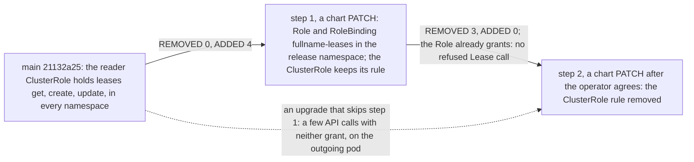

# SPEC G4 — the Lease grant namespaced: a Role and RoleBinding in the release namespace, shipped in a chart release before the one that removes the ClusterRole's Lease rule (#420)

| | |
|---|---|
| Programme | Epic G (#387), access declared and platform identities configured: build step 4 of 4, the dashboard's Lease grant narrowed from the whole cluster to its own namespace. Its second step narrows the dashboard ServiceAccount's permissions and waits on the operator's agreement |
| Batch | G — access declared |
| Release | — (post-programme; two pull requests, each with its own review) |
| Version on release | chart 0.60.3 (step 1, adds the Role) and 0.60.4 (step 2, removes the ClusterRole rule), chart only |
| Version note | No application change: `appVersion` and `pyproject.toml` do not move. Each step is a chart PATCH: no value is added. The rungs follow SPEC_E5's version rule (`docs/specs/SPEC_E5_offsite_on_by_default.md`, its Version note): a spec still `specified` names a chart version above `Chart.yaml` and above every other `specified` spec's claim. On origin/main `6d532178` the index claims chart 0.59.26 (SPEC_E4), 0.60.0 (SPEC_E2, SPEC_G2, SPEC_E5) and 0.60.1 (SPEC_G3); SPEC_E3 (merged at `6d532178`) also claims 0.59.26; SPEC_E5's blocks move SPEC_E4 to 0.60.2 when E5 ships; so step 1 takes 0.60.3 and step 2 0.60.4. Blocks 8 and 24 write those into `Chart.yaml` and blocks 7 and 23 name them in the CHANGELOG. Blocks 8g to 8n move the six `specified` specs whose chart version is not above 0.60.4 to the next free rung above it, keeping their MINOR or PATCH and their application version (SPEC_E2, SPEC_G2 and SPEC_E5 to 0.61.0, SPEC_G3 to 0.60.5, SPEC_E4 to 0.60.6, and blocks 8m and 8n move SPEC_E3 to 0.60.7), so `tests/test_specs_index.py`'s version-ladder test holds on both steps (§4.3). If another of them is implemented first, its pull request moves this spec's two cells instead, and this spec's implementing pull requests re-derive blocks 7, 8, 8g to 8n, 23 and 24 before applying, with the reason under these notes (`docs/specs/README.md`, "Implementation blocks"). |
| Issue | [#420](https://github.com/ephico2real2/group-sync-dashboard/issues/420) |
| Status | specified |
| Source | OB1-lite's research and specification of 2026-10-01, written before any code from the issue's body of 2026-10-01 and its "Decisions and corrections (2026-10-01)", the epic (#387) and the orchestrator's mandate (the upgrade window T420-8 is to be designed away). Measured on main `21132a25` on this machine (Helm v4.3.0, Python 3.14 with the repository's venv), on the CRC lab read-only (2026-10-01T14:55Z to 15:19Z, `oc` as `kubeadmin`: `get`, `auth can-i`, nothing written), and against upstream source read raw: Helm v4.3.0, Argo CD v3.4.7 (the lab's OpenShift GitOps 1.21.4 runs `argocd: v3.4.7+7b6113c`), client-go v0.34.0, kubernetes/website `980792fa`, helm-www `f32ec4dc`. §7's blocks were applied to a throwaway worktree of `21132a25` and to a copy of its step-1 result, and the suite ran on each. Revised the same day on the reviews of `6e08e561` (OB3 in Grok's seat, OB2 in Codex's), decided by the orchestrator (Orchestrator's notes, 8), rebased onto origin/main `f1423143`, then merged with origin/main `6d532178` (SPEC_E3), and every block, test and count proved again on that merge in git worktrees (§4.3) |

## How to read this spec

The plain point first. The dashboard writes two kinds of Lease: the elector's, and one per fleet account. It writes
both in its own namespace and nowhere else. Its permission to write them, though, sits in a ClusterRole, so on the lab
today its ServiceAccount may create or update a Lease in **every** namespace — including `kube-node-lease`, where every
Lease is a node's heartbeat, and the control plane's own election namespaces. This spec moves that permission to a
Role and a RoleBinding in the dashboard's own namespace, named `<fullname>-leases`, with the same three verbs and the
same render condition.

It does so in two chart releases, so that no upgrade ever runs without the permission. Step 1 adds the Role and keeps
the ClusterRole's rule: nothing is removed, so it needs no one's agreement. Step 2, in a later release, removes the
ClusterRole's rule: that narrows the ServiceAccount, so it waits on the operator's agreement on #420. Doing both in one
release would leave a gap of a few API calls in which neither grant exists, because Helm and Argo CD both update a
ClusterRole before they create a Role (§2.6, §2.7); two releases close that gap by construction.

§1 is the mandate. §2 is the research: each finding names its source (a primary document with the date it was
fetched, upstream code read from the raw file with its line numbers, a probe run on main, or a read-only command on the
lab) and quotes what it relies on. §2a weighs the alternatives and reconciles each external claim with the line here
that behaves accordingly. Line citations into upstream code and into main at `21132a25` are written as plain text,
never as backticked `path:line`, to keep them apart from the maintained `path#anchor` citations. §3 is the design, one
rule per subsection with its reason, and the budget. §4 maps every test case of the issue (T420-1 to T420-9) to a test
and shows each failing without the change. §5 is the walk on the lab. §6 is what an operator sees and what it costs.
§7 is the whole change as implementation blocks (`docs/specs/README.md`, "Implementation blocks"): blocks T1 to T5 and 1
to 8n are step 1 and carry `block` markers; blocks 9 to 24 are step 2 and carry `deferred-block` markers, which
`local-development/apply-spec-blocks.py` leaves alone and counts once blocks T1 to T5 teach it to (Orchestrator's notes,
2, says how step 2's pull request turns them on). Step 1 is applied to a clean tree with

    python3 local-development/apply-spec-blocks.py docs/specs/SPEC_G4_namespaced_lease_grant.md . --apply

This spec's own row in the index moves through the lifecycle by the orchestrator's hand: `in progress` once step 1 is
on main and step 2 is not (`docs/specs/README.md`'s lifecycle), `merged` once both are.

## Orchestrator's notes

Decisions made on "easy to manage, best practice", corrections to the issue, and what only the operator can answer.

1. **Two releases, expand then contract (the mandate's T420-8).** Helm v4.3.0 applies an upgrade one object at a time
   in kind order, `ClusterRole` before `Role` and `RoleBinding` (§2.6), and Argo CD v3.4.7 applies one kind group at a
   time in the same order (§2.7). In a single release the ClusterRole loses its rule before the RoleBinding exists, so
   a Lease call that falls between the two is refused. The probe in §2.9 measures what one refused round costs the
   elector on main: leadership for that round, one ERROR line, then the next round renews its own Lease with
   `leaseTransitions` unchanged. Two releases make the count zero for every upgrade that passes through step 1, which
   is the textbook "parallel change" (§2.5) and costs one more small pull request. Step 1 removes nothing (REMOVED 0),
   so it needs no agreement and can merge as soon as it is reviewed; only step 2 waits on the operator. Chosen.
   **A fact the issue did not have, and the fallback it allows.** Every chart version changes the pod template's
   `checksum/config` annotation, because the ConfigMap carries the `helm.sh/chart` label (§2.8), so every chart
   upgrade also replaces the dashboard pod, and in a single release only the outgoing pod could meet the gap. If the
   orchestrator prefers one pull request for that reason, it is still the narrowing: it may be opened only after the
   operator's agreement is quoted on #420, like step 2, and every estate's upgrade to it is §3.4's skip row. Then turn
   blocks 9 to 24 into `block` before applying: the checker applies the 43 blocks in order on main
   (`43 blocks check out across 20 files`, §4.3), and the result is step 2's tree. The design and the tests are the same either way; only
   T420-8's expectation changes (§4.1).
2. **How step 2's pull request applies its blocks.** It is the "stacked PRs" case of
   `.claude/skills/adversarial-review/SKILL.md` ("the later PR writes its version blocks as `deferred-block` … After
   the rebase, turn them into `block`, commit, and apply only them"), as SPEC_L1 did. Step 2's first commit edits this
   spec only: step 1's twenty-seven markers (blocks T1 to T5 and 1 to 8n) become `applied-block` and step 2's sixteen
   become `block`, so the checker, which knows both words from block T1 on, reads step 2 alone against main as step 1
   left it and says how many it left alone. Development form of that edit (macOS `sed`):

       sed -i '' -e 's/^<!-- block: /<!-- applied-block: /' -e 's/^<!-- deferred-block: /<!-- block: /' docs/specs/SPEC_G4_namespaced_lease_grant.md

   Measured on a copy of step 1's result: `16 blocks check out across 9 files; left alone: 27 applied-block` (§4.3). Step 2's pull request is opened only after the
   operator's agreement is quoted on #420, and its body quotes it again. After step 2 merges the spec keeps
   `applied-block` on step 1's markers and `block` on step 2's; like every merged spec, its blocks no longer check
   against main, and the index row moves to `merged`.
3. **Settled in the issue and followed.** The Role and its RoleBinding are named `<fullname>-leases`, after
   `<fullname>-grafana-discovery`; they sit under `rbac.create` like the chart's other RBAC; one Role serves both
   Leases; the render condition is exactly the ClusterRole rule's (`leaderElection.enabled`, or a fleet account in use,
   `charts/group-sync-dashboard/templates/rbac.yaml#gsd.fleetAccountInUse`); the template comment that called the rule
   "scoped to one object the dashboard owns" is corrected in step 1 (block 8a); `docs/reference-architecture.md` gets
   the condition right in step 1 (block 8e); the lab check reads "the elector's Lease renews, and the fleet Lease is
   read and written on the next fleet path" (§5).
4. **Decided here.** The Role lives in `templates/rbac.yaml`, beside the ClusterRole it replaces, so the citations
   `templates/rbac.yaml#leases` in `docs/api-contract.md` and the chart README keep resolving. It carries the
   `gsd.rbacLabels` labels and no `app.kubernetes.io/component`, as `-grafana-discovery` does. It sets no
   `resourceNames` (§3.2). It carries no Argo CD annotation: Argo CD is a conduit here and nothing in the design depends
   on it (§2.7).
5. **Corrections to the issue, measured.**
   - T420-4's diff splits across the two steps: step 1 REMOVED 0, ADDED 4 (the Role's three verbs and the RoleBinding's
     subject); step 2 REMOVED 3, ADDED 0; together the issue's 3 and 4, in the six renders where the rule renders and 0
     in the other two (§4.2).
   - T420-8 is no longer "at most one failed renewal": through step 1 the expectation is zero refused Lease calls, and
     the walk measures it (§5, step 2). The bound for an upgrade that skips step 1 is a unit test (§4.1).
   - T420-6 named regression guards that did not exist on main; blocks 4 and 5 add them.
   - The chart README's "Three rules in the ClusterRole are conditional" was wrong before this change: `identities`,
     `oauths`, `namespaces` and the Kyverno reads are conditional too (`charts/group-sync-dashboard/templates/rbac.yaml#rbac.identities`,
     `#discoverFromOAuth`, `#rbac.namespaces`, `#kyverno.enabled`). Block 8c drops the count in step 1,
     and block 17 rewrites the paragraph in step 2.
   - Two more sentences put the grant in the ClusterRole and are not in the issue's list: `values.yaml`'s
     `rbac.create` comment ("The role's only write is get/create/update on the dashboard's own leader-election Lease",
     blocks 8b and 16) and `fleet-account-rbac.yaml`'s "shared with rbac.yaml's Lease rule" (block 12).
6. **Seen and not changed (application code, outside a chart-only issue).** The elector's ERROR line on a 403 says
   "Polling stays stopped until RBAC on coordination.k8s.io/leases is granted; nothing retries its way out of this"
   (`local-development/gsd/leader.py#nothing retries its way out of this`). The loop does retry every
   `renew_seconds`, and the §2.9 probe measures leadership back on the next round once the grant exists. The sentence is
   true of a missing grant and misleading for a transient one; it is recorded here for a later application issue.
7. **Open for the operator** (the issue's own question, unchanged): agree to step 2's narrowing on #420 before step 2's
   pull request — or note 1's single pull request — merges. And, if the orchestrator asks: one pull request instead
   of two (note 1). Step 2's pull request opens once step 1's chart release is published, so the lab and an estate
   that follows the releases pass through it (§5, step 2.1).
8. **The review of `6e08e561` (OB3 in Grok's seat, OB2 in Codex's), decided by the orchestrator on 2026-10-01.** Each
   decision is applied here and measured again (§4.3).
   - **Accepted, OB3 F1:** the documents are true at step 1. Blocks 8a to 8f correct the sentences that were false
     before #420 or become false with the Role ("scoped to one object the dashboard owns", "keeping one object is
     simpler", the README's rule count, the `rbac.create` comment, the election-only condition, "its own
     leader-election Lease"); no block promises "the next release"; block 6 no longer calls the ClusterRole read-only
     while it carries the write; T420-9 (block 14) also catches step 1's own sentences. OB3's `fixes.patch` is this
     revision's base.
   - **Accepted, OB2 F1:** the checker learns `deferred-block` and `applied-block`, counts each aloud, and refuses any
     other marker word (blocks T1 to T5, with their test and the README's "Implementation blocks" bullet; note 2's
     `sed` retires them with the rest of step 1). OB3's "no tool change needed" is not taken: a silent checker hides a
     misspelt marker for every later stacked spec, and the change is fifteen lines. Every "blocks check out" figure in
     this spec is the fixed tool's output.
   - **Merged, F2 (both seats): Argo CD prunes first.** §2.7 names `sync_context.go` lines 1595 to 1627 "prune first"
     and carries OB2's paragraph with OB3's measured numbers; §3.4 is OB2's table (with the in-flight poll's cost) with
     OB3's measurements; §2a's reconciliation keeps OB3's line; §4.1's T420-8 row names the skip row by its content
     (OB3). One correction to OB2's row, traced: the KPI rollup is skipped silently when leadership is gone
     (`local-development/gsd/poller.py#Poller._rollup_kpi` returns), not at WARNING.
   - **Merged, F3 (both seats):** the one-PR fallback is the narrowing and may be opened only after the operator's
     agreement is quoted on #420 (note 1, OB2's text); note 2 states the markers' end state (OB2); step 2's pull
     request opens only once step 1's chart release is published (note 7, OB3's text).
   - **Accepted, OB2 F4:** §5 step 2.5 checks all five namespaces §2.1 measured `yes` in, the two `openshift-kube-*`
     ones included.
   - **Accepted, OB3 F4:** block 4's third test is parametrised over a refused GET and a refused PUT and asserts each
     round's wait; it kills both of OB3's mutants (§4.3).
   - **Accepted, OB3 F5:** with `rbac.create: false`, block 17 states the order: the Role and RoleBinding first, then
     the rule out of the estate's own ClusterRole.
9. **Rebased onto origin/main `f1423143`** (SPEC_E2, G2, E4, G3 and E5 merged since `21132a25`), **then merged with
   origin/main `6d532178`** (SPEC_E3, #302; the orchestrator, 2026-10-01): G4 is the forty-third index row, after E3, excluded from the rising-number assert by its id and pinned to #420 like the others; the
   version cells follow SPEC_E5's rule (Version note). Every file §2 reads is byte-identical at `21132a25` and
   `f1423143` (`git diff --stat 21132a25 f1423143` over the chart's templates, values, README and examples,
   `environments/`, `docs/reference-architecture.md`, `gsd/leader.py`, `gsd/fleetstate.py`, `gsd/poller.py` and
   `gsd/api.py` prints nothing), so §2's line citations into main hold on both; the merge with `6d532178` changed none
   of them either (it added SPEC_E3, its index row and its pin), and no file a block of this spec edits besides the
   index and `SPEC_E3_restore_db.md`, which blocks 8m and 8n now edit.

## 1. The mandate, and what is out of scope

The issue (#420, "What must be accomplished"): no ClusterRole the chart renders carries a `leases` rule, under any
values (T420-1); a Role in the release namespace grants `get`, `create` and `update` on `leases`, bound by a
RoleBinding to the dashboard's ServiceAccount, rendered under exactly today's condition and only when `rbac.create` is
true (T420-2, T420-3); the rendered RBAC changes by exactly the moved atoms (T420-4); election and the fleet Lease keep
working at one replica and above (T420-5, T420-6, T420-7); on the lab the ServiceAccount can no longer create a Lease
outside its own namespace (T420-7); every sentence that describes the grant says where it now lives (T420-9); the
operator's agreement is quoted on the issue before the narrowing merges. The orchestrator's mandate adds: research
Helm v4.3.0's and Argo CD's ordering, measure what the elector does on a 403, and design so there is no upgrade window
(T420-8).

The narrowing is the one stated exception to the standing rule "never reduce the dashboard ServiceAccount's
permissions". This spec is not the implementation: step 2 is implemented only after the operator agrees on #420, and
the Definition of Done records that agreement.

Out of scope: the elector's and the fleet state's code (no application change, Orchestrator's notes, 6); the render
condition itself, which a ConfigMap-declared account does not reach (the chart cannot see it at render; unchanged
today and after, §3.7); the `-cluster-secrets` and `-fleet-account` Roles; and any other namespace for the Leases (the
code takes its namespace from the ServiceAccount mount, not from a value).

## 2. Research, measured

### 2.1 Where the grant is today

On main `21132a25`, `charts/group-sync-dashboard/templates/rbac.yaml` lines 75 to 84 put the rule in the reader
ClusterRole:

```text
  {{- if or .Values.leaderElection.enabled (eq (include "gsd.fleetAccountInUse" .) "true") }}
  ...
  - apiGroups: ["coordination.k8s.io"]
    resources: ["leases"]
    verbs: ["get", "create", "update"]
  {{- end }}
```

and the ClusterRoleBinding `<fullname>-reader` (lines 141 to 153) binds it to the dashboard's ServiceAccount in every
namespace. Rendered with Helm v4.3.0 for the four values sets the issue names, election on and off (the probe
`rbac_atoms.py`, §4.4), the three atoms render in six of the eight renders and nowhere else:

| render | atoms | of which `leases` |
|---|---|---|
| defaults, election on / off | 63 / 60 | 3 / 0 |
| `environments/crc.yaml`, as written (election on) / off | 70 / 70 | 3 / 3 |
| `environments/example-production.yaml`, on / off | 63 / 60 | 3 / 0 |
| `charts/group-sync-dashboard/example-production.yaml`, on / off | 68 / 68 | 3 / 3 |

On the lab (read-only, 2026-10-01T14:55:52Z), `ClusterRole/group-sync-dashboard-reader` carries
`["coordination.k8s.io"] ["leases"] ["get","create","update"]`, and for
`system:serviceaccount:group-sync-dashboard:group-sync-dashboard`, `oc auth can-i` answers:

| namespace | get | create | update | list | delete |
|---|---|---|---|---|---|
| `default` | yes | yes | yes | no | no |
| `kube-system` | yes | yes | yes | no | no |
| `group-sync-dashboard` | yes | yes | yes | no | no |

and at 14:59:04Z `update` answers `yes` in `kube-node-lease` (which holds `lease/crc`), in
`openshift-kube-controller-manager` (which holds `cert-recovery-controller-lock` and `cluster-policy-controller-lock`)
and in `openshift-kube-scheduler`. The release namespace holds three Leases at 14:55:58Z: the elector's
`group-sync-dashboard` (holder `group-sync-dashboard-7b9485f499-jspfl`, `leaseDurationSeconds` 30), the fleet
account's `gsd-fleet-666f1ba7f2fdead0` (no holder, `renewTime` 2026-09-30T17:58:43.902608Z), and the grafana operator's
own election Lease. Its Roles are `-cluster-secrets`, `-grafana-discovery` and `-secrets-mint`; none names `leases`.
Read twice 20 s apart (15:18:35Z and 15:18:55Z), the elector's `renewTime` moved from 15:18:26.430545Z to
15:18:46.491607Z with `leaseTransitions` 8 both times. The Deployment is chart `group-sync-dashboard-0.59.25`,
`Recreate`, one replica, and its Argo CD Application tracks `main` with `ServerSideApply=true` (`Synced`, `Healthy`).

### 2.2 Where the code writes Leases

- The elector takes its namespace from the ServiceAccount mount, `/var/run/secrets/kubernetes.io/serviceaccount/namespace`
  (`local-development/gsd/leader.py#LeaderElector._namespace`, main lines 83 to 88), and every call goes to
  `LEASE_API = "/apis/coordination.k8s.io/v1/namespaces/{ns}/leases"` (line 30): a GET by name, a POST to the
  collection, a PUT by name (lines 137 to 222). It is constructed with the Lease name only
  (`local-development/gsd/api.py#build_app`, `LeaderElector(name=settings.leader_lease_name)`). It renews every
  `renew_seconds = 10` and holds for `lease_seconds = 30` (lines 67 and 68).
- The fleet state's `FleetLease` uses the same `LEASE_API` with the namespace it is given
  (`local-development/gsd/fleetstate.py#FleetLease._call`), and the poller gives it `own_namespace()`
  (`local-development/gsd/poller.py#Poller._host_client`), which is the same mount unless `GSD_NAMESPACE` is set
  (`local-development/gsd/leader.py#own_namespace`); the chart sets no `GSD_NAMESPACE` (`git grep` finds it only in
  the code, its tests and one design note). The poller reads every account's Lease once per discovery cadence, on every
  replica (`local-development/gsd/poller.py#Poller._ping_accounts`, "Every account in use has its Lease read each
  cadence"), and writes it only on a bind attempt or the daily ping.
- Neither path lists, watches or deletes a Lease; the remedy the fleet state prints already says "in this namespace"
  (`local-development/gsd/fleetstate.py#GRANT`).

### 2.3 Kubernetes RBAC: Role, ClusterRole, and what `resourceNames` cannot narrow

Source: kubernetes/website `content/en/docs/reference/access-authn-authz/rbac.md`, `main` at `980792fa`, fetched raw
2026-10-01.

- Lines 60 and 61: "A Role always sets permissions within a particular namespace; when you create a Role, you have to
  specify the namespace it belongs in." Lines 73 and 74: "If you want to define a role within a namespace, use a Role;
  if you want to define a role cluster-wide, use a ClusterRole."
- Lines 109 and 110: "A RoleBinding grants permissions within a specific namespace whereas a ClusterRoleBinding grants
  that access cluster-wide."
- Lines 219 and 220: "You cannot restrict **deletecollection** or top-level **create** requests by resource name. For
  **create**, this limitation is because the name of the new object may not be known at authorization time."
- Lines 855 to 857 (escalation prevention): "You can only create/update a role if at least one of the following things
  is true: 1. You already have all the permissions contained in the role, at the same scope as the object being
  modified". Whoever applies the chart today already holds `leases` create and update cluster-wide (it applies the
  ClusterRole that carries them), so it may create the namespaced Role.

What this settles: a Role and RoleBinding in the release namespace grant exactly the three verbs there and nowhere else;
`create` cannot be name-scoped, so a name list could narrow only `get` and `update` (§2a, A6).

### 2.4 Leases, and what a cluster-wide write reaches

Source: kubernetes/website `content/en/docs/concepts/architecture/leases.md`, `980792fa`, fetched raw 2026-10-01.

- Lines 22 to 26: "For every `Node` , there is a `Lease` object with a matching name in the `kube-node-lease` namespace.
  Under the hood, every kubelet heartbeat is an **update** request to this `Lease` object, updating the
  `spec.renewTime` field for the Lease. The Kubernetes control plane uses the time stamp of this field to determine the
  availability of this `Node`."
- Lines 32 to 35: Leases "ensure only one instance of a component is running at any given time … used by control plane
  components like `kube-controller-manager` and `kube-scheduler`".
- Lines 107 to 110: "Your own workload can define its own use of Leases … You define a Lease so that the controller
  replicas can select or elect a leader, using the Kubernetes API for coordination."

What this settles: today's grant lets the dashboard's ServiceAccount update a node's heartbeat Lease or a control-plane
component's election Lease (§2.1 measured `yes` in both kinds of namespace). The dashboard never does, and after this
change it cannot.

### 2.5 Least privilege, and changing a contract safely

- kubernetes/website `content/en/docs/concepts/security/rbac-good-practices.md`, `980792fa`, fetched raw 2026-10-01,
  lines 31 and 32: "Assign permissions at the namespace level where possible. Use RoleBindings as opposed to
  ClusterRoleBindings to give users rights only within a specific namespace."
- Martin Fowler, "ParallelChange" (martinfowler.com/bliki/ParallelChange.html, fetched 2026-10-01): "Parallel change,
  also known as expand and contract, is a pattern to implement backward-incompatible changes to an interface in a safe
  manner, by breaking the change into three distinct phases: expand, migrate, and contract." Here: expand is step 1
  (the Role beside the rule), migrate is the upgrade itself (the code needs no change, §2.2), contract is step 2.

### 2.6 How Helm v4.3.0 orders an upgrade

Read raw from `github.com/helm/helm` at tag `v4.3.0` (`curl -s <raw-url> | nl -ba`):

- `pkg/release/v1/util/kind_sorter.go` lines 47 to 53 of `InstallOrder`: `"ClusterRole"`, `"ClusterRoleList"`,
  `"ClusterRoleBinding"`, `"ClusterRoleBindingList"`, `"Role"`, `"RoleList"`, `"RoleBinding"`; line 119:
  "Results are sorted by 'ordering', keeping order of items with equal kind/priority".
- `pkg/release/v1/util/manifest_sorter.go` lines 80 to 84: the template files are taken in `sort.Strings` order, and
  line 109 returns `sortManifestsByKind(result.generic, ordering)`.
- `pkg/action/action.go` line 465: `releaseutil.SortManifests(files, nil, releaseutil.InstallOrder)`; the sorted
  manifests become the release's manifest (lines 498 onward).
- `pkg/action/upgrade.go` line 356 builds the target list from that manifest, and lines 469 to 474 call
  `KubeClient.Update(current, target, …)` after the pre-upgrade hooks (lines 459 to 463).
- `pkg/kube/client.go` lines 580 to 648: `targets.Visit(…)`, one target at a time, each a `helper.Get` then either
  `createApplyFunc(target)` (line 595) or `updateApplyFunc(original, target)` (line 640); line 807: "The default is to
  use server-side apply". Only after every target, lines 657 to 700 delete what the old release had and the new one
  does not.

What this settles: in one Helm upgrade the reader ClusterRole is patched (its rule gone) before the `-leases` Role is
created and before its RoleBinding is created, three get-then-apply pairs later. A deletion would come last, but the
rule's removal is a patch of an object that stays. No chart-controlled ordering puts a Role or a RoleBinding before a
ClusterRole: every RBAC kind sorts after `ClusterRole`. The gap's length in seconds was not measured.

### 2.7 How Argo CD v3.4.7 orders a sync (an explanation only)

Read raw from `github.com/argoproj/argo-cd` at `v3.4.7`, whose `go.mod` line 369 replaces the gitops-engine module
with `./gitops-engine`:

- `gitops-engine/pkg/sync/sync_tasks.go` lines 80 to 110: tasks are ordered by phase, wave, kind, then name; the kind
  order (lines 42 to 48) is Helm's: `ClusterRole`, `ClusterRoleList`, `ClusterRoleBinding`, `ClusterRoleBindingList`,
  `Role`, `RoleList`, `RoleBinding`.
- `gitops-engine/pkg/sync/sync_context.go` lines 1665 to 1679: "finally create resources", grouped by kind, each group
  run by `processCreateTasks`, which applies the group's objects concurrently and waits for all of them (lines 1682 to
  1711) before the next kind.
- The same function, lines 1595 to 1627: "prune first" — every prune task of the wave runs, concurrently, and is
  waited for before any of the wave's applies. A pruned object keeps its wave (lines 1075 to 1103 only reverse the
  prune waves among themselves) unless `PruneLast` moves it after the last wave (lines 1105 to 1122). The chart sets
  no wave and no `PruneLast` on its RBAC, and the lab's Application syncs with `prune: true` and no `PruneLast`
  (`gitops/argocd-application-dashboard.yaml`, `syncPolicy`).
- `docs/user-guide/sync-waves.md` lines 116 to 121: "When Argo CD starts a sync, it orders the resources in the
  following precedence: 1. The phase 2. The wave they are in (lower values first) 3. By kind … 4. By name".

What this settles: Argo CD, as the lab and an ApplicationSet use it, meets the same gap as Helm on an upgrade. On a
rollback it does not match Helm: `sync_context.go` line 1569 splits the prune tasks from the rest, lines 1595 to 1627
run them first ("prune first"), and only lines 1665 to 1679 apply ("finally create resources"); Helm deletes last
(`client.go` lines 657 to 700). With `prune: true` (the lab's Application: `automated: {prune: true, selfHeal: true}`,
`ServerSideApply=true`, read 2026-10-01T15:47Z by both reviewers) a rollback to a chart without the Role deletes the
Role and RoleBinding before it patches the rule back (§3.4). OB3 measured it on a throwaway kube-apiserver v1.35.0
with Argo CD v3.4.7's order emulated from this source (not Argo CD itself) and the dashboard's real elector: step 2
rolled back to main refused 35 sampled Lease calls in 53 ms (the Role and RoleBinding pruned at +0 and +2.8 ms, the
reader ClusterRole applied at +56.2 ms) and the elector lost one round; step 2 back to step 1 refused none; a Helm
rollback from step 2 to main refused none. A sync-wave annotation would order an upgrade, but only under Argo CD; the
chart's design must hold under Helm, so nothing here uses one (§2a, A4).

### 2.8 What an upgrade does to the running pod

Rendered with `environments/crc.yaml`, the dashboard Deployment's pod template differs between the chart on
origin/main `f1423143` (0.59.25) and the same chart with step 1 applied (0.60.3) in exactly one line, the
`checksum/config` annotation (`d09643b9…` to `6f8862b7…`), and between step 1 and step 2 (0.60.4) in that line alone
again (`6f8862b7…` to `0322b423…`): the ConfigMap it hashes carries the `helm.sh/chart` label
(`charts/group-sync-dashboard/templates/deployment.yaml#checksum/config`). So every chart release replaces the pod;
with `Recreate` at one replica the old pod is stopped once the Deployment is updated, which Helm and Argo CD do after
the RBAC kinds (§2.6, §2.7). The old pod is the one that runs while the RBAC objects change.

### 2.9 What one refused round costs, on main

The probe `probe_elector_403.py` (§4.4) drives `LeaderElector._run` from main against a stub API server that holds the
Lease for this pod and answers 403 in round 2, with `renew_seconds` shortened. Output:

```text
no 403: is_leader after rounds 1..4 = [True, True, True, True]; transitions in the Lease = 0; holder = me
    INFO became leader (ns-a/gsd as me)
GET 403 in round 2: is_leader after rounds 1..4 = [True, False, True, True]; transitions in the Lease = 0; holder = me
    INFO became leader (ns-a/gsd as me)
    ERROR leader election: forbidden reading lease ns-a/gsd as this ServiceAccount — HTTP 403: forbidden. Polling stays stopped until RBAC on coordination.k8s.i
    WARNING lost leadership; the poller will stop
    INFO became leader (ns-a/gsd as me)
PUT 403 in round 2: is_leader after rounds 1..4 = [True, False, True, True]; transitions in the Lease = 0; holder = me
    INFO became leader (ns-a/gsd as me)
    ERROR leader election: could not renew lease ns-a/gsd — HTTP 403: forbidden
    WARNING lost leadership; the poller will stop
    INFO became leader (ns-a/gsd as me)
```

One refused round costs that round's leadership and three log lines; the next round finds its own Lease (renewed less
than `lease_seconds` ago, so no peer may take it) and renews it. The poller's standby check runs every
`STANDBY_RECHECK_SECONDS = 5` (`local-development/gsd/poller.py#STANDBY_RECHECK_SECONDS`), so at most one poll start
waits. A fleet Lease read that meets a 403 raises `FleetStateUnavailable` (`local-development/gsd/fleetstate.py#FleetLease.read`),
which fails closed: nothing binds, and the sweep reports `fleet-state-unavailable` until its next read
(`local-development/gsd/poller.py#Poller._ping_finding`).

## 2a. Alternatives considered

Nine ways to narrow the grant, or to keep an upgrade from refusing a Lease call, were weighed against the sources above
(the operator's rule of 2026-10-01: verify the alternatives and reconcile the research with the code).

| alternative | source | what it would cost here | decision |
|---|---|---|---|
| **A1. Two chart releases: the Role first, the ClusterRole rule removed in a later release** | Fowler, "expand and contract" (§2.5); Helm's and Argo CD's kind order (§2.6, §2.7) | one more small pull request and chart PATCH; step 2's blocks staged as `deferred-block` (Orchestrator's notes, 2); an upgrade that skips step 1 falls back to A2's gap | **chosen**: zero refused Lease calls for every upgrade through step 1, nothing Argo-specific, and step 1 needs no agreement |
| **A2. One release: add the Role and remove the rule together** | §2.6: the ClusterRole is patched before the Role and RoleBinding are created | the gap of a few API calls in which neither grant exists; measured cost of one refused round in §2.9; only the outgoing pod can meet it (§2.8) | **rejected as the design, kept as the fallback**: it does not meet the mandate's "no window", and the spec can collapse to it by a marker edit (Orchestrator's notes, 1) |
| **A3. Create the Role and RoleBinding in a `pre-upgrade` hook** | helm-www `docs/topics/charts_hooks.md` (`f32ec4dc`, fetched 2026-10-01) lines 94 to 96: "The resources that a hook creates are currently not tracked or managed as part of the release"; lines 204 and 205: "If no hook deletion policy annotation is specified, the `before-hook-creation` behavior applies by default" | the grant would be deleted and re-created before every later upgrade (a gap on every upgrade once the rule is gone), never removed by `helm uninstall`, and converted to an Argo CD PreSync hook | **rejected**: it trades one gap for one per upgrade and leaves orphaned RBAC |
| **A4. Order the objects with an Argo CD sync wave** | `sync-waves.md` lines 116 to 121 (§2.7) | an Argo-only annotation; plain Helm ignores it, so a Helm upgrade keeps the gap | **rejected**: the chart must hold under Helm; Argo CD is a conduit (the operator, 2026-10-01) |
| **A5. Keep the rule while `lookup` does not find the RoleBinding** | Helm's `lookup` returns nothing under `helm template` (`local-development/render-manifests.sh#runs with no cluster connection`); Argo CD renders with `helm template` | under Argo CD the rule would render forever, so the lab and an ApplicationSet would never narrow; T420-1 could not pass on a render | **rejected** |
| **A6. `resourceNames` on `get` and `update`, `create` unnamed** | rbac.md lines 219 and 220 (§2.3) | a fleet Lease's name is `gsd-fleet-<sha256(username)[:16]>` for an account a ConfigMap may declare after the render (`local-development/gsd/poller.py#Poller._declared_accounts` reads the effective clusters), so the list cannot be rendered; and `create` stays namespace-wide either way | **rejected**: it would break the fleet path for ConfigMap-declared accounts and narrow nothing that matters |
| **A7. A `-leases` ClusterRole bound by a RoleBinding in the release namespace** | rbac.md lines 112 and 113: a RoleBinding "can reference a ClusterRole and bind that ClusterRole to the namespace of the RoleBinding" | the same capability with a cluster-scoped object an auditor must read to see it is namespaced | **rejected**: the issue settled on a Role, and a Role says "namespaced" in its kind |
| **A8. Make the elector ride out a refused round, as client-go does with `RenewDeadline`** | client-go `tools/leaderelection/leaderelection.go` (v0.34.0) lines 134 and 135: "RenewDeadline is the duration that the acting master will retry refreshing leadership before giving up" | an application change and an image release in a chart-only issue; the outgoing pod in an upgrade runs the old image anyway | **rejected here**; the misleading log text is recorded (Orchestrator's notes, 6) |
| **A9. Rename the reader ClusterRole so the old one, rule and all, is deleted last** | `pkg/kube/client.go` lines 657 to 700 (§2.6): deletions come after every create and update | every reference to `<fullname>-reader` (docs, tests, the lab's checks) changes, and the RBAC diff becomes the whole role | **rejected**: far larger than the defect |

**Reconciliation: each external claim, and the line here that behaves accordingly.**

- *A Role grants only in its namespace* (rbac.md lines 60 and 61): block 1's Role and RoleBinding carry
  `namespace: {{ .Release.Namespace }}`, and T420-2 asserts both are in the release namespace in all eight renders that
  render them; the lab's `oc auth can-i … -n default` answers `no` after step 2 (§5).
- *`create` cannot be narrowed by name* (rbac.md lines 219 and 220): block 1's rule has no `resourceNames`, and T420-2
  asserts the rule equals exactly `{apiGroups: [coordination.k8s.io], resources: [leases], verbs: [get, create,
  update]}`.
- *The code writes only in its own namespace*: `local-development/gsd/leader.py#LeaderElector._namespace` and
  `local-development/gsd/poller.py#Poller._host_client`; T420-6 (blocks 4 and 5) asserts every GET, POST and PUT path of
  the elector and of `FleetLease` is under `/apis/coordination.k8s.io/v1/namespaces/<the namespace given>/leases`.
- *Helm creates the Role after it patches the ClusterRole* (kind_sorter.go lines 47 to 53, client.go lines 580 to 648):
  step 1's Role exists in an earlier release than the one where step 2 patches the rule away, so step 2's upgrade never runs without a grant;
  the lab walk records zero refused calls (§5).
- *Argo CD prunes before it applies* (sync_context.go lines 1595 and 1665): a sync forward through step 1 prunes
  nothing that grants a Lease, so it meets no gap; a sync from step 2 back to a chart without the Role prunes the
  Role first, which §3.4's rollback rows name.
- *Parallel change*: step 1 changes nothing the code reads (it adds a second grant of the same verbs), and its RBAC
  diff is REMOVED 0 (§4.2), the standing rule.
- *Least privilege, at the namespace level* (rbac-good-practices.md lines 31 and 32): after step 2, no ClusterRole the
  chart renders names `leases` in any of the ten renders T420-1 reads.

## 3. The design



Solid arrows are the two pull requests; the dashed arrow is an upgrade that jumps over step 1. Previewed with
`mermaid-ascii` 1.6.1 (parses, rc 0).

### 3.1 The Role and its RoleBinding

`<fullname>-leases`, a Role and a RoleBinding in `.Release.Namespace`, in `templates/rbac.yaml` inside the
`rbac.create` block, after the reader ClusterRoleBinding (block 1). One rule: `coordination.k8s.io`, `leases`, `get`,
`create`, `update` — the ClusterRole rule's verbs, so the code needs nothing new. The subject is
`gsd.serviceAccountName` in the release namespace, as every other binding the chart renders for the dashboard. Labels
are `gsd.rbacLabels`, which carry `rbac.ocp.io/config-source` (`local-development/tests/test_chart_rbac_provenance.py`
holds every RBAC object the chart ships to it). The reason it is one Role for both Leases: they share the rule today,
and `create` cannot be split by name, so two Roles would add an object and narrow nothing.

### 3.2 No `resourceNames`

`create` cannot be name-scoped (§2.3), and the fleet Leases' names come from accounts a ConfigMap may declare after the
render (§2a, A6). The grant is therefore every Lease in the release namespace. On the lab that namespace also holds the
grafana operator's election Lease (§2.1): the dashboard may write it after this change, as it may today, and may no
longer write any Lease anywhere else. A release namespace shared with another operator's Leases is the estate's
choice; the chart README says the grant covers the namespace (block 17).

### 3.3 The condition, and the atoms

The Role renders under the exact expression that guards the ClusterRole rule, `or .Values.leaderElection.enabled (eq
(include "gsd.fleetAccountInUse" .) "true")`, inside `rbac.create`. Measured (§4.2): step 1 ADDS 4 atoms in the six
renders where the rule renders and 0 in the other two; step 2 REMOVES the rule's 3 atoms in the same six; no other atom
moves in any render.

| step | REMOVED | ADDED |
|---|---|---|
| 1 | 0 | `Role <ns>/<fullname>-leases rule coordination.k8s.io/leases get`, `… create`, `… update`; `RoleBinding <ns>/<fullname>-leases -> Role/<fullname>-leases subject ServiceAccount <ns>/<serviceAccount>` |
| 2 | `ClusterRole <fullname>-reader rule coordination.k8s.io/leases get`, `… create`, `… update` | 0 |

### 3.4 Two releases, and the budget for refused Lease calls

Step 1 (blocks T1 to T5 and 1 to 8n) adds the Role and keeps the rule. Step 2 (blocks 9 to 24) removes the rule. Budget, per
upgrade, per dashboard pod, for Lease calls the API server refuses because neither grant exists:

| upgrade | refused Lease calls | why |
|---|---|---|
| any chart before step 1 → step 1 | 0 | nothing is removed; the Role is added beside the rule |
| step 1 → step 2 | 0 | the Role exists before the ClusterRole patch and after it: the rendered Role and RoleBinding differ between the two releases only in their `helm.sh/chart` label (OB2). Measured by OB3 on a throwaway kube-apiserver: 0 refused in 5379 samples under Helm, 0 in 3756 under Argo CD's order |
| a chart before step 1 → step 2 directly | the elector's and the fleet sweep's calls that fall in the gap between the ClusterRole patch and the RoleBinding create (§2.6): at most one elector round per pod while the gap is shorter than `renew_seconds` (10 s). Measured by OB3 on a throwaway kube-apiserver v1.35.0 with Helm v4.3.0 and the lab's values: 41 to 44 refused sampled calls in a gap of 64 to 92 ms spanning 22 Helm requests (four runs), the real elector one round each time; under Argo CD's order 16 refused in 31 ms. CRC's own gap is not measured (a lab write) | §2.9: that round's leadership, three log lines, and a `fleet-state-unavailable` finding until the next discovery cycle if a sweep read falls there; nothing binds. A poll in flight when leadership drops finishes its reads and skips its tail for that cycle: the reporting snapshot and usage pull with a WARNING each (`local-development/gsd/poller.py#reporting tail skipped`), retention with a WARNING if it was between tables (`local-development/gsd/poller.py#retention stopped before pruning`), and the KPI rollup silently (`local-development/gsd/poller.py#Poller._rollup_kpi`); the next cycle runs them. The same upgrade replaces the pod (§2.8) |
| rollback from step 2 to step 1 | 0 | the Role stays in the desired state; only the rule is patched back. Measured by OB3 under Argo CD's order: 0 refused in 2373 samples |
| rollback from step 2 to a chart before step 1 | under Helm 0 (measured by OB3, `helm rollback` to main): the rule is patched back before the Role is deleted (deletions run last, §2.6). Under Argo CD with `prune: true`: the Role and RoleBinding are pruned BEFORE the ClusterRole is patched back (§2.7, "prune first"), so the skip case's gap in reverse, with the same bound and the same pod replacement; measured by OB3 under Argo CD's order: 35 refused in 53 ms, the real elector one round | the lab's Application prunes (§2.7); an estate that rolls back by reverting both steps at once should revert step 2 first, which is 0 |

Writes are not changed: after step 2 the ServiceAccount may write Leases in exactly one namespace, the release
namespace, at any values; the dashboard writes there the same Leases as before (the elector's, and one per fleet account
in use), with no new retry and no new write.

### 3.5 `rbac.create: false`

Nothing of the chart's RBAC renders, the Role included (T420-3). The chart README lists the two objects an estate
applies itself (block 17) and the `rbac.create` row says so (block 6). An estate that applies its own ClusterRole keeps
the Lease rule until it applies the Role, so step 2 cannot open a gap there: the chart changes neither.

### 3.6 The documents

Every sentence that places the grant is true after each step. Step 1 corrects what was false before it or becomes
false with the Role (blocks 8a to 8f: "scoped to one object the dashboard owns", "keeping one object is simpler",
the README's rule count, the `rbac.create` comment, the reference architecture's election-only condition, the
values file's "its own leader-election Lease"), and promises no particular release for step 2. Step 2 moves the
rest with the grant (T420-9): the template's header and the comment at the old rule (blocks 9 and 10), the Role's
own comment (blocks 1 and 11),
`fleet-account-rbac.yaml` (block 12), both `values.yaml` comments (blocks 15 and 16), the chart README's `rbac.create`
row and RBAC paragraph (blocks 6 and 17), and `docs/reference-architecture.md` §7.1 and §8 (blocks 18 to 22, which
also give the condition in full). `docs/CHANGELOG.md` gets one entry per step naming the moved atoms (blocks 7 and 23),
and `Chart.yaml` one history line per step (blocks 8 and 24). Blocks 8g to 8n move six other specs' version cells
above step 2's chart (the Version note), and blocks T1 to T5 teach the checker the two markers this spec stages its
second step with.

### 3.7 What does not change

No application code, no value, no `appVersion`. The render condition (a ConfigMap-declared account with neither a chart
fleet account nor election still renders no grant, as today). The two write pins of `tests/test_chart_strategy.py`
(`test_the_only_write_in_the_role_is_the_dashboards_own_lease`, `test_the_cluster_secret_writes_are_the_one_opt_in_exception_and_exactly_that`),
which read ClusterRole and Role rules alike and pass unchanged (T420-5). Every other RBAC atom in every render (§4.2).

## 4. Tests

### 4.1 One test per test case of the issue

"Main" is origin/main `6d532178`; "step 1" is main with blocks T1 to T5 and 1 to 8n applied. Each result was measured as §4.3 describes.

| test case | test (block, step) | without the change | with it |
|---|---|---|---|
| T420-1 no ClusterRole carries `leases` | `test_chart_connection_modes.py::TestTheLeaseGrantIsNamespaced::test_no_clusterrole_carries_a_lease_rule`, ten renders (block 13, step 2) | on step 1: 8 failed, 2 passed. The eight renders with a grant list the reader ClusterRole's rule (`assert [('t-group-sync-dashboard-reader', {…'leases'…})] == []`); the two that write no Lease pass | 10 passed |
| T420-2 the Role renders where the grant did, and nowhere else | `…::test_the_lease_role_renders_where_the_grant_did_and_nowhere_else`, ten renders (block 2, step 1) | on main: 8 failed, `assert [] == [('t-group-sync-dashboard-leases', 'gsd-leases')]`; the two no-grant renders pass | 10 passed |
| T420-3 `rbac.create: false` renders no grant | `…::test_rbac_create_false_renders_no_lease_grant` (block 2, step 1) | a regression guard: passes on main (`rbac.yaml`'s first line wraps the ClusterRole) | passes |
| T420-4 the moved atoms | the RBAC diff, §4.2 (evidence in each pull request) | — | step 1: REMOVED 0, ADDED 4; step 2: REMOVED 3, ADDED 0; in six of eight renders, 0 in the other two |
| T420-5 the write pins hold | `test_chart_strategy.py::TestNoPatchVerbAtAnyAuditMode` (both write pins) and `test_chart_connection_modes.py::TestTheCredentialLifecycleInTheChart::test_the_lease_rule_renders_where_a_claim_is_needed_and_stays_the_only_write`, unchanged | pass on main | pass after each step (they read ClusterRole and Role rules alike) |
| T420-6 the code stays in its namespace | `test_leader.py::TestTheLeaseStaysInItsNamespace::test_every_lease_call_is_under_the_namespace_it_was_given` and `::test_without_a_namespace_it_reads_the_service_account_mount` (block 4), `test_fleet_lifecycle.py::test_t420_6_every_fleet_lease_call_is_under_the_namespace_it_was_given` (block 5), step 1 | regression guards: pass on main | pass |
| T420-7 the lab narrows and keeps working | the walk, §5 | — | — |
| T420-8 no refused Lease call during the narrowing | the walk, §5, step 2; and, for an upgrade that skips step 1, `test_leader.py::TestTheLeaseStaysInItsNamespace::test_one_refused_round_costs_that_round_and_no_takeover`, a refused GET and a refused PUT (block 4, step 1) | the unit test is a guard of §3.4's skip row ("a chart before step 1 → step 2 directly"): passes on main; it fails both of OB3's mutants of `gsd/leader.py` (§4.3) | passes |
| (research, OB2's F1) the checker counts the staging markers and refuses an unknown one | `test_apply_spec_blocks.py::test_deferred_and_applied_blocks_are_left_alone_and_counted_aloud` and `::test_a_marker_word_the_tool_does_not_know_is_refused_not_skipped` (block T4, step 1) | on main: 2 failed (main's checker prints no count of what it skipped, and returns 0 on `defered-block`) | 2 passed; the file's other five pass unchanged |
| T420-9 every sentence says where the grant lives | `test_chart_strategy.py::TestTheLeaseGrantIsDescribedWhereItLives`, four files with stale phrases and three that must name the Role (block 14, step 2) | on main: 7 failed; on step 1: 4 failed, 3 passed (the stale-phrase test fails in all four files, on step 1's own sentences; the three files name the Role from blocks 6, 8b and 8e) | 7 passed |

The tests added by block 2 render the chart with Helm into `-n gsd-leases` and read the fullname and the
ServiceAccount from the reader ClusterRoleBinding of the same render, so a values file that overrides either is
measured, not assumed. T420-1 and T420-2 share the renders (`LEASE_RENDERS`): the four inline cases of the existing
credential-lifecycle test, and `environments/crc.yaml`, `environments/example-production.yaml` and
`charts/group-sync-dashboard/example-production.yaml` as written and with `leaderElection.enabled: false`.

### 4.2 The rendered RBAC, every atom (T420-4)

`rbac_atoms.py` (§4.4) renders the chart with Helm v4.3.0 as release `group-sync-dashboard` in namespace
`group-sync-dashboard`, for the four values sets with election on and off, and writes one sorted line per atom (one verb
on one resource in one role, or one subject on one binding). Each side's count is printed first, and no side is empty:

| render | main | step 1 | step 2 | step 1 vs main | step 2 vs step 1 | step 2 vs main |
|---|---|---|---|---|---|---|
| defaults, election on | 63 | 67 | 64 | REMOVED 0, ADDED 4 | REMOVED 3, ADDED 0 | REMOVED 3, ADDED 4 |
| defaults, election off | 60 | 60 | 60 | 0, 0 | 0, 0 | 0, 0 |
| `environments/crc.yaml`, election on | 70 | 74 | 71 | 0, 4 | 3, 0 | 3, 4 |
| `environments/crc.yaml`, election off | 70 | 74 | 71 | 0, 4 | 3, 0 | 3, 4 |
| `environments/example-production.yaml`, election on | 63 | 67 | 64 | 0, 4 | 3, 0 | 3, 4 |
| `environments/example-production.yaml`, election off | 60 | 60 | 60 | 0, 0 | 0, 0 | 0, 0 |
| `charts/group-sync-dashboard/example-production.yaml`, election on | 68 | 72 | 69 | 0, 4 | 3, 0 | 3, 4 |
| `charts/group-sync-dashboard/example-production.yaml`, election off | 68 | 72 | 69 | 0, 4 | 3, 0 | 3, 4 |

The atoms that move, for `environments/crc.yaml` with election on (`comm` of the sorted files; the other five renders
that move list the same lines):

```text
REMOVED (step 2)
ClusterRole -/group-sync-dashboard-reader rule coordination.k8s.io/leases[*] create
ClusterRole -/group-sync-dashboard-reader rule coordination.k8s.io/leases[*] get
ClusterRole -/group-sync-dashboard-reader rule coordination.k8s.io/leases[*] update
ADDED (step 1)
Role group-sync-dashboard/group-sync-dashboard-leases rule coordination.k8s.io/leases[*] create
Role group-sync-dashboard/group-sync-dashboard-leases rule coordination.k8s.io/leases[*] get
Role group-sync-dashboard/group-sync-dashboard-leases rule coordination.k8s.io/leases[*] update
RoleBinding group-sync-dashboard/group-sync-dashboard-leases -> Role/group-sync-dashboard-leases subject ServiceAccount group-sync-dashboard/group-sync-dashboard
```

The standing rule is REMOVED 0. Step 1 holds it; step 2 is the stated exception and waits on the operator's agreement.

### 4.3 The proof

The blocks were not written from memory: each was applied and its tests run.

| check | command | result |
|---|---|---|
| step 1 checks on main | main's `apply-spec-blocks.py`, on a throwaway worktree of this spec's merge commit (main `6d532178` with the spec) | `27 blocks check out across 18 files` (main's checker reads `block` only and says nothing of the sixteen `deferred-block`) |
| the same, with step 1's checker | the tool as blocks T1 to T3 leave it, against the same tree | `27 blocks check out across 18 files; left alone: 16 deferred-block` |
| step 1's new tests, before | blocks 2 to 5 and T4 only, applied to a copy of main | `10 failed, 8 passed` among the new tests: T420-2's eight renders with a grant and T4's two fail; T420-2's two without a grant, T420-3 and the five guards of blocks 4 and 5 pass (the test file's five existing tests pass too) |
| step 1 applied | `--apply` into the worktree; the touched files: `test_chart_connection_modes.py`, `test_leader.py`, `test_fleet_lifecycle.py`, `test_chart_strategy.py`, `test_chart_rbac_provenance.py`, `test_chart_fleet_account_rbac.py`, `test_kyverno.py`, `test_chart_versions.py`, `test_chart_grafana_dashboard.py`, `test_apply_spec_blocks.py`, `test_specs_index.py`, `test_docs_citations.py` | `2005 passed, 23 skipped` |
| OB3's mutants of block 4's test (F4) | `gsd/leader.py` in a copy of step 1: MUT-PUT `return updated.status_code in (200, 403)`; MUT-WAIT `self._stop.wait(self.renew_seconds if held else self.lease_seconds)`; the test alone | unmutated `2 passed`; MUT-PUT `1 failed, 1 passed`; MUT-WAIT `2 failed` |
| step 2 checks on step 1 | note 2's `sed`, then step 1's checker against step 1's tree | `16 blocks check out across 9 files; left alone: 27 applied-block` |
| step 2's new tests, before | blocks 13 and 14 only, on a copy of step 1 | `12 failed, 5 passed` (§4.1, T420-1 and T420-9) |
| step 2 applied | all 43 blocks live (note 1's form) into a second throwaway worktree of the same commit; the same touched files | `2024 passed, 23 skipped`; that tree is identical (`diff -rq`) to step 1's tree with note 2's swapped spec applied |
| the version ladder with step 1 applied | `test_specs_index.py::test_a_spec_the_changelog_has_not_begun_names_versions_the_tree_has_not_reached` on step 1 and on step 2; and on step 1 with blocks 8m and 8n undone | `1 passed` on each; without 8m and 8n `AssertionError: ('E3', 'app 2.1.0, chart 0.59.26', 'Chart.yaml is already 0.60.3')` |
| one pull request instead of two | all 43 blocks live, against main | `43 blocks check out across 20 files` |
| a misspelt marker | step 1's checker on this spec with one `deferred-block` misspelt `defered-block` | rc 1: `unknown block marker(s) ['defered-block']: this tool reads `block` and leaves `deferred-block` and `applied-block` alone …` |
| hermetic suite | `pytest tests/ -q -p no:cacheprovider --deselect tests/test_ui.py --deselect tests/test_live_smoke.py`, `PYTHONPATH` at each tree's `local-development`, each tree a git worktree of this spec's commit | this spec's merge commit (main `6d532178` with the spec): `6365 passed, 26 skipped, 655 deselected, 5 xfailed`; step 1: `6383 passed`, the same plus T420-2's 10, T420-3's 1, block 4's 4, block 5's 1 and T4's 2; step 2 (all 43 blocks): `6402 passed`, plus block 13's 10, block 14's 7 and the two citations block 19 adds; 26 skipped, 0 failed on each |
| index pin | `test_specs_index.py` with G4's row and header both mistyped `#421` | unmutated `92 passed`; mistyped `1 failed, 91 passed`, `AssertionError: ('G4 is #420', '421')`; mistyped with the pin deleted `92 passed`, so the pin is what catches it |
| chart | `helm lint` on step 1 and step 2 | `1 chart(s) linted, 0 chart(s) failed`, both |
| pod template | §2.8, `environments/crc.yaml` | only `checksum/config` differs, main to step 1 and step 1 to step 2 |
| markdown | `markdownlint-cli2` on the chart README, `docs/CHANGELOG.md`, `docs/reference-architecture.md`, `docs/specs/README.md` | 24 findings on main, on step 1 and on step 2, the same per file and rule (MD004, MD040, MD012, MD014), none new |
| diagram | `mermaid-ascii` 1.6.1 on §8's topology after block 21 and 22, and on §3's picture | both parse, rc 0 |

### 4.4 The probes

The probes ran in this spec's scratch directory against copies of the tree and are not committed; the two that
decided the design are here as they ran.

probe_elector_403.py (§2.9), run with `PYTHONPATH` at main's `local-development`:

```text
"""#420 research: what the elector does when ONE round of its Lease calls meets a 403 (the RBAC window an
upgrade could open), on main's gsd/leader.py. A stub API holds the Lease as this pod; rounds are driven by
LeaderElector._run with renew_seconds shortened, and each round's outcome and log lines are printed."""
from __future__ import annotations

import logging
import threading
import time
from datetime import UTC, datetime

import gsd.leader as leader
from gsd.leader import LeaderElector


class Resp:
    def __init__(self, code: int, body: dict | None = None):
        self.status_code, self._body, self.text = code, body or {}, "forbidden" if code == 403 else ""

    def json(self):
        return self._body


class StubAPI:
    """The Lease held by `me`; `forbid` is the set of round numbers whose calls answer 403."""

    def __init__(self, forbid_get: set[int], forbid_put: set[int]):
        self.round, self.forbid_get, self.forbid_put, self.rv = 0, forbid_get, forbid_put, 1
        now = datetime.now(UTC).strftime("%Y-%m-%dT%H:%M:%S.%f") + "Z"
        self.lease = {"metadata": {"name": "gsd", "namespace": "ns-a", "resourceVersion": "1"},
                      "spec": {"holderIdentity": "me", "leaseDurationSeconds": 30, "acquireTime": now,
                               "renewTime": now, "leaseTransitions": 0}}
        self.paths: list[str] = []

    def __enter__(self):
        return self

    def __exit__(self, *a):
        return False

    def get(self, path):
        self.round += 1
        self.paths.append(f"GET {path}")
        return Resp(403) if self.round in self.forbid_get else Resp(200, self.lease)

    def put(self, path, json):
        self.paths.append(f"PUT {path}")
        if self.round in self.forbid_put:
            return Resp(403)
        self.rv += 1
        json["metadata"]["resourceVersion"] = str(self.rv)
        self.lease = json
        return Resp(200)


class Lines(logging.Handler):
    def __init__(self):
        super().__init__()
        self.lines: list[str] = []

    def emit(self, record):
        self.lines.append(f"{record.levelname} {record.getMessage()[:150]}")


def run(label: str, forbid_get: set[int], forbid_put: set[int], rounds: int = 4) -> None:
    api = StubAPI(forbid_get, forbid_put)
    handler = Lines()
    leader.log.addHandler(handler)
    leader.log.setLevel(logging.DEBUG)
    elector = LeaderElector(name="gsd", namespace="ns-a", identity="me", renew_seconds=0.05)
    elector._client = lambda: api
    states: list[bool] = []
    thread = threading.Thread(target=elector._run, daemon=True)
    thread.start()
    seen = 0
    while seen < rounds:
        time.sleep(0.01)
        if api.round > seen:
            time.sleep(0.02)                     # let the round finish and set or clear the flag
            seen = api.round
            states.append(elector.is_leader)
    elector._stop.set()
    thread.join(timeout=1)
    leader.log.removeHandler(handler)
    print(f"{label}: is_leader after rounds 1..{rounds} = {states}; transitions in the Lease = "
          f"{api.lease['spec']['leaseTransitions']}; holder = {api.lease['spec']['holderIdentity']}")
    for line in handler.lines:
        print("   ", line)


print("gsd imported from", leader.__file__)
run("no 403", set(), set())
run("GET 403 in round 2", {2}, set())
run("PUT 403 in round 2", set(), {2})
```

rbac_atoms.py (§2.1, §4.2), run with the venv's Python; argv: the chart directory, the repository root, the output
directory:

```text
"""#420 research: every RBAC atom the chart renders (SPEC_S4c §8.3: one verb on one resource in one role, or one
subject on one binding), for the four values sets with election on and off. argv: <chart dir> <repo root> <out dir>.
Writes one sorted atom file per render and prints each file's line count, so an empty side is visible."""
from __future__ import annotations

import pathlib
import subprocess
import sys

import yaml

chart, repo, out = pathlib.Path(sys.argv[1]), pathlib.Path(sys.argv[2]), pathlib.Path(sys.argv[3])
out.mkdir(parents=True, exist_ok=True)
SETS = {"defaults": [], "crc": ["-f", str(repo / "environments/crc.yaml")],
        "env-production": ["-f", str(repo / "environments/example-production.yaml")],
        "chart-production": ["-f", str(repo / "charts/group-sync-dashboard/example-production.yaml")]}
ELECTION = {"election-on": ["--set", "leaderElection.enabled=true"], "election-off": ["--set", "leaderElection.enabled=false"]}


def atoms(text: str) -> list[str]:
    rows = []
    for d in yaml.safe_load_all(text):
        if not d or d.get("kind") not in ("Role", "ClusterRole", "RoleBinding", "ClusterRoleBinding"):
            continue
        where = f"{d['kind']} {d['metadata'].get('namespace', '-')}/{d['metadata']['name']}"
        if d["kind"] in ("Role", "ClusterRole"):
            for rule in d.get("rules") or []:
                names = ",".join(rule.get("resourceNames") or []) or "*"
                for group in rule.get("apiGroups") or [""]:
                    for resource in rule.get("resources") or []:
                        for verb in rule.get("verbs") or []:
                            rows.append(f"{where} rule {group or 'core'}/{resource}[{names}] {verb}")
        else:
            ref = d["roleRef"]
            for s in d.get("subjects") or []:
                rows.append(f"{where} -> {ref['kind']}/{ref['name']} subject {s['kind']} {s.get('namespace', '-')}/{s['name']}")
    return sorted(rows)


for set_name, set_args in SETS.items():
    for el_name, el_args in ELECTION.items():
        done = subprocess.run(["helm", "template", "group-sync-dashboard", str(chart), "-n", "group-sync-dashboard",
                               *set_args, *el_args], capture_output=True, text=True)
        if done.returncode != 0:
            print(f"{set_name} {el_name}: RENDER FAILED: {done.stderr.strip()[-300:]}")
            continue
        rows = atoms(done.stdout)
        (out / f"{set_name}.{el_name}.txt").write_text("\n".join(rows) + "\n")
        leases = [r for r in rows if "leases" in r or "-leases" in r]
        print(f"{set_name:17} {el_name:12} {len(rows):3} atoms; lease atoms: {len(leases)}")
```

## 5. On the lab (the implementing pull requests)

Not run in this phase: the lab is read-only here; the reads it took are in §2.1. Each pull request deploys its reviewed
head with `local-development/release-crc.sh` (Helm with the Application's auto-sync paused, or `--argocd`), as every
reviewed head is, and commits its evidence under `reports/<date>_<slug>/`. The commands are the walk's, a development
task; nothing here is how an estate rolls the chart out (it sets values in the release's values file and rolls them out
through its deployment pipeline).

**Before either step:** record the UIDs of `group-sync-dashboard-data` and `group-sync-dashboard-report-artifacts`
(2026-10-01: `f065b7a4-535c-4ef1-868c-58f5afee4953` and `08c7d45c-a3eb-47be-8506-f24ea7a3e0e3`), and again after;
they must be equal. Never log in as the fleet account, never place a wrong fleet password, never touch the Secret
`gsd-cluster-shared-qa`, never print a token.

**Step 1 (no agreement needed).**

1. Deploy step 1's head.
2. `oc get roles.rbac.authorization.k8s.io,rolebindings.rbac.authorization.k8s.io -n group-sync-dashboard` lists
   `group-sync-dashboard-leases` twice; the Role's `rules` are exactly the one rule of §3.1 and the RoleBinding's
   `subjects` the dashboard's ServiceAccount in `group-sync-dashboard`.
3. The ClusterRole still carries the rule, so `oc auth can-i create leases.coordination.k8s.io --as
   system:serviceaccount:group-sync-dashboard:group-sync-dashboard` still answers `yes` in `default`: nothing narrowed.
4. The elector's Lease renews (`renewTime` read twice, 20 s apart), and the dashboard container's log since its start
   has 0 lines matching `forbidden reading lease`, `could not renew lease`, `lost leadership` or
   `fleet-state-unavailable`.

**Step 2 (after the operator's agreement is quoted on #420).**

1. Confirm step 1 is live: `oc get roles.rbac.authorization.k8s.io group-sync-dashboard-leases -n group-sync-dashboard`
   answers. If it does not, stop: the upgrade would be §3.4's skip case.
2. Arm the issue's T420-8 recorders before the deploy, both in the background: `renewTime` and `holderIdentity` of
   `leases.coordination.k8s.io/group-sync-dashboard` every 2 s into a file, and `oc logs -f` of the running dashboard
   container (it ends when the old pod stops) into another.
3. Deploy step 2's head.
4. **T420-8:** the old pod's followed log and the new pod's log since its start have 0 lines matching the four
   patterns of step 1.4. The `renewTime` trace shows renewals every 10 s up to the old pod's stop, and the new pod
   taking the Lease once the old one's 30 s have run out (`leaseTransitions` +1): today's behaviour on every
   upgrade at one replica with `Recreate`, unchanged here.
5. **T420-7, the narrowing:** `oc get clusterrole group-sync-dashboard-reader -o jsonpath='{.rules[*].resources}'`
   names no `leases`. `oc auth can-i {get,create,update} leases.coordination.k8s.io --as
   system:serviceaccount:group-sync-dashboard:group-sync-dashboard` answers `no` in `default`, `kube-system`,
   `kube-node-lease`, `openshift-kube-controller-manager` and `openshift-kube-scheduler` (the five §2.1 measured
   `yes` in), and `yes` in `group-sync-dashboard` for each verb. On 2026-10-01 the only binding on the lab that
   grants the ServiceAccount a Lease verb anywhere is `ClusterRoleBinding group-sync-dashboard-reader` (every
   ClusterRoleBinding and RoleBinding naming the ServiceAccount, `system:serviceaccounts`,
   `system:serviceaccounts:group-sync-dashboard` or `system:authenticated` was read, OB2 and OB3), so nothing else can
   answer `yes`.
6. **T420-7, still working:** the elector's `renewTime` advances twice, 20 s apart. The fleet Lease is read on the next
   discovery cadence (300 s): no `fleet-state-unavailable` line and no such finding on `GET /api/clusterconfigs`.
   It is written on the next fleet path the walks already use: a ConfigMap-declared `saTokenLookup` entry, the shape
   of `reports/2026-09-28_gitops-404-walk/scripts/cm.yaml` with a new name and a run label, makes the dashboard
   claim the fleet Lease and look up the remote token. Record the fleet Lease's `resourceVersion` before and after
   (it moves) and the lookup's line, then delete the ConfigMap by its label and see its generated Secret pruned.
7. The PVC UIDs again: unchanged.

## 6. What an operator sees, and what it costs

- **Step 1:** two new objects in the release namespace, `Role` and `RoleBinding` `<fullname>-leases`; nothing else
  changes, and the dashboard's permissions are a superset of before (REMOVED 0). One CHANGELOG entry. An estate with
  `rbac.create: false` sees nothing render and may apply the two objects (chart README) whenever it chooses.
- **Step 2:** the reader ClusterRole loses its `leases` rule; `oc auth can-i create leases.coordination.k8s.io` for the
  dashboard's ServiceAccount answers `no` outside the release namespace. The dashboard behaves exactly as before: the
  same Leases, in the same namespace, renewed on the same cadence. The chart README lists the Role and RoleBinding for
  an estate that applies its own RBAC, and says what an upgrade that skips step 1 can cost.
- **Upgrades:** through step 1, zero refused Lease calls; skipping step 1, at most §3.4's bound, on the pod the same
  upgrade replaces.
- **Code:** no application change. Lines added and removed, from `git diff --numstat` on the applied trees:

| file | step 1 added / removed | step 2 added / removed |
|---|---|---|
| `charts/group-sync-dashboard/templates/rbac.yaml` | 46 / 6 | 14 / 23 |
| `charts/group-sync-dashboard/templates/fleet-account-rbac.yaml` | — | 1 / 1 |
| `charts/group-sync-dashboard/values.yaml` | 7 / 3 | 7 / 7 |
| `charts/group-sync-dashboard/README.md` | 7 / 3 | 25 / 12 |
| `charts/group-sync-dashboard/Chart.yaml` | 4 / 1 | 4 / 1 |
| `docs/reference-architecture.md` | 3 / 3 | 14 / 7 |
| `docs/CHANGELOG.md` | 14 / 0 | 11 / 0 |
| `docs/specs/README.md` (T5's bullet, 8g's five cells, 8m's one) | 11 / 6 | — |
| `docs/specs/SPEC_E2_*`, `SPEC_G2_*`, `SPEC_E4_*`, `SPEC_G3_*`, `SPEC_E5_*`, `SPEC_E3_*` (one cell each) | 1 / 1 each | — |
| `local-development/apply-spec-blocks.py` | 15 / 2 | — |
| `local-development/tests/test_apply_spec_blocks.py` | 31 / 0 | — |
| `local-development/tests/test_chart_connection_modes.py` | 65 / 0 | 8 / 0 |
| `local-development/tests/test_leader.py` | 74 / 0 | — |
| `local-development/tests/test_fleet_lifecycle.py` | 24 / 0 | — |
| `local-development/tests/test_chart_strategy.py` | — | 40 / 0 |

## 7. Implementation blocks

Step 1 is blocks T1 to T5 and 1 to 8n, with `block` markers: the checker's two new marker words (T1 to T5), the Role
and RoleBinding, their tests, the README row, the CHANGELOG entry, the chart PATCH, the sentences that are false at
step 1 without a correction (blocks 8a to 8f), and six other specs' version cells (8g to 8n). Step 2 is blocks 9 to 24,
with `deferred-block` markers that the checker leaves alone, and counts, until step 2's pull request turns them on
(Orchestrator's notes, 2): the ClusterRole rule removed, the comments and documents
that place the grant, T420-1 and T420-9, the CHANGELOG entry and the chart PATCH. Each step's blocks are applied in
order.

### Step 1, the checker — blocks T1 to T5 (applied with blocks 1 to 8n)

OB2's F1, verbatim from its review (Orchestrator's notes, 8). The checker on main reads only `block`, so on main it
says nothing about step 2's sixteen `deferred-block` markers; from these blocks on it counts both staging words
aloud and refuses any other word in a marker's place.

#### Block T1 — local-development/apply-spec-blocks.py: the two markers the checker leaves alone, by name

<!-- block: local-development/apply-spec-blocks.py | edit -->

Old text:

```python
MARK = re.compile(r"^<!-- block: (?P<path>[^|]+?) \| (?P<kind>edit|create|after: .+?) -->$", re.M)
FENCE = re.compile(r"^```[\w-]*\n(?P<body>.*?)^```$", re.M | re.S)
```

New text:

```python
MARK = re.compile(r"^<!-- block: (?P<path>[^|]+?) \| (?P<kind>edit|create|after: .+?) -->$", re.M)
FENCE = re.compile(r"^```[\w-]*\n(?P<body>.*?)^```$", re.M | re.S)
# A change that ships in two pull requests (SPEC_G4, #420) stages the later one's blocks as `deferred-block`
# (their Old text cannot exist yet) and, once the earlier one is on main, retires its markers to `applied-block`.
# Neither is applied, but both are counted and said aloud, so "8 blocks check out" cannot hide sixteen more; any
# other word in a marker's place is a typo and is refused rather than skipped.
MARKER = re.compile(r"^<!-- (?P<word>\S*block\S*): ", re.M)
LEFT_ALONE = ("deferred-block", "applied-block")
```

#### Block T2 — local-development/apply-spec-blocks.py: count the markers once, refuse an unknown word

<!-- block: local-development/apply-spec-blocks.py | edit -->

Old text:

```python
    files: dict[str, str] = {}
    for b in blocks(spec.read_text()):
```

New text:

```python
    source = spec.read_text()
    words = [m.group("word") for m in MARKER.finditer(source)]
    unknown = sorted({w for w in words if w not in ("block", *LEFT_ALONE)})
    if unknown:
        raise SystemExit(f"unknown block marker(s) {unknown}: this tool reads `block` and leaves `deferred-block` and "
                         "`applied-block` alone (docs/specs/README.md, \"Implementation blocks\")")
    files: dict[str, str] = {}
    for b in blocks(source):
```

#### Block T3 — local-development/apply-spec-blocks.py: the report line names what was left alone

<!-- block: local-development/apply-spec-blocks.py | edit -->

Old text:

```python
    print(f"{len(blocks(spec.read_text()))} blocks check out across {len(files)} files")
```

New text:

```python
    left = ", ".join(f"{words.count(w)} {w}" for w in LEFT_ALONE if words.count(w))
    print(f"{len(blocks(source))} blocks check out across {len(files)} files" + (f"; left alone: {left}" if left else ""))
```

#### Block T4 — local-development/tests/test_apply_spec_blocks.py: the two markers are left alone and counted; a misspelt word is refused

<!-- block: local-development/tests/test_apply_spec_blocks.py | edit -->

Old text:

```python
def test_a_dirty_git_tree_is_refused(tmp_path):
```

New text:

```python
FENCE = "`" * 3
# The two markers and the fences are assembled here, never written at column 0, so a specification can quote
# this file in a block of its own without the checker reading them as that block's markers or its fences.
STACKED = SPEC + "\n".join([
    "<!-- " + "deferred-block: pkg/a.py | edit -->", FENCE + "python", "gamma", FENCE, FENCE + "python", "GAMMA", FENCE, "",
    "<!-- " + "applied-block: pkg/done.py | create -->", FENCE + "python", 'print("already on main")', FENCE, "",
])


def test_deferred_and_applied_blocks_are_left_alone_and_counted_aloud(tmp_path):
    """A change that ships in two pull requests (SPEC_G4, #420) stages the later one's blocks as `deferred-block`
    and, once the earlier one is on main, retires its markers to `applied-block`. The tool applies neither, and
    says how many it left alone, so a check that reads "8 blocks check out" cannot hide sixteen more."""
    tree = tmp_path / "tree"
    write(tree / "pkg/a.py", "alpha\nbeta\ngamma\n")
    done = run(write(tmp_path / "spec.md", STACKED), tree, "--apply")
    assert done.returncode == 0, done.stderr
    assert "3 blocks check out across 2 files; left alone: 1 deferred-block, 1 applied-block" in done.stdout, done.stdout
    assert (tree / "pkg/a.py").read_text() == "alpha\ninserted\nBETA\ngamma\n"
    assert not (tree / "pkg/done.py").exists()


def test_a_marker_word_the_tool_does_not_know_is_refused_not_skipped(tmp_path):
    tree = tmp_path / "tree"
    write(tree / "pkg/a.py", "alpha\nbeta\ngamma\n")
    typo = SPEC.replace("<!-- block: pkg/new.py | create -->", "<!-- " + "defered-block: pkg/new.py | create -->")
    done = run(write(tmp_path / "spec.md", typo), tree)
    assert done.returncode == 1 and "unknown block marker" in done.stderr, done.stderr
    assert "defered-block" in done.stderr


def test_a_dirty_git_tree_is_refused(tmp_path):
```

#### Block T5 — docs/specs/README.md: the two markers, under "Implementation blocks"

<!-- block: docs/specs/README.md | edit -->

Old text:

```text
- `<!-- block: <path> | after: <line> -->` and one fence: inserted after that exact line, which must occur once.

`local-development/apply-spec-blocks.py <spec> <tree>` checks every block against a tree and, with `--apply`,
```

New text:

```text
- `<!-- block: <path> | after: <line> -->` and one fence: inserted after that exact line, which must occur once.
- `<!-- deferred-block: … -->` and `<!-- applied-block: … -->`: the same three forms, NOT applied. A change that
  ships in two pull requests stages the later one's blocks as `deferred-block` (their Old text cannot exist yet)
  and, once the earlier one is on main, retires its markers to `applied-block`; the later pull request's first
  commit turns `deferred-block` into `block` and applies only those (SPEC_G4, #420). The checker says how many of
  each it left alone, and refuses any other word in a marker's place.

`local-development/apply-spec-blocks.py <spec> <tree>` checks every block against a tree and, with `--apply`,
```

### Step 1 — blocks 1 to 8n

#### Block 1 — charts/group-sync-dashboard/templates/rbac.yaml: the `-leases` Role and RoleBinding (step 1)

Inside the `rbac.create` block, after the reader ClusterRoleBinding, under the condition the ClusterRole's Lease rule
has (§3.1, §3.2). The ClusterRole keeps its rule in this step (§3.4).

<!-- block: charts/group-sync-dashboard/templates/rbac.yaml | edit -->

Old text:

```yaml
subjects:
  - kind: ServiceAccount
    name: {{ include "gsd.serviceAccountName" . }}
    namespace: {{ .Release.Namespace }}
{{- end }}

{{- if .Values.oauthProxy.enabled }}
```

New text:

```yaml
subjects:
  - kind: ServiceAccount
    name: {{ include "gsd.serviceAccountName" . }}
    namespace: {{ .Release.Namespace }}
{{- if or .Values.leaderElection.enabled (eq (include "gsd.fleetAccountInUse" .) "true") }}
---
# The dashboard's Leases (#420, SPEC_G4): the elector's (leaderElection.leaseName) and one per fleet
# account (gsd-fleet-<hash>, SPEC_S4c §3.3). The code writes them in the pod's own namespace only —
# gsd/leader.py reads it from the ServiceAccount mount — so the grant is a Role there. A rule in the
# ClusterRole reaches every namespace: kube-node-lease, whose Leases are the nodes' heartbeats, and
# the control plane's own election Leases included. No resourceNames: Kubernetes cannot narrow
# `create` by name, and a fleet Lease's name comes from an account a ConfigMap may declare after
# this render. Rendered under the condition of the ClusterRole's Lease rule above, which a later
# chart release removes once the operator agrees (#420): this Role ships first, so an upgrade that
# passes through a release carrying both never loses the grant (SPEC_G4 §3.4).
apiVersion: rbac.authorization.k8s.io/v1
kind: Role
metadata:
  name: {{ include "gsd.fullname" . }}-leases
  namespace: {{ .Release.Namespace }}
  labels: {{- include "gsd.rbacLabels" . | nindent 4 }}
rules:
  - apiGroups: ["coordination.k8s.io"]
    resources: ["leases"]
    verbs: ["get", "create", "update"]
---
apiVersion: rbac.authorization.k8s.io/v1
kind: RoleBinding
metadata:
  name: {{ include "gsd.fullname" . }}-leases
  namespace: {{ .Release.Namespace }}
  labels: {{- include "gsd.rbacLabels" . | nindent 4 }}
roleRef:
  apiGroup: rbac.authorization.k8s.io
  kind: Role
  name: {{ include "gsd.fullname" . }}-leases
subjects:
  - kind: ServiceAccount
    name: {{ include "gsd.serviceAccountName" . }}
    namespace: {{ .Release.Namespace }}
{{- end }}
{{- end }}

{{- if .Values.oauthProxy.enabled }}
```

#### Block 2 — local-development/tests/test_chart_connection_modes.py: the Role renders where the grant did (T420-2, T420-3)

The ten renders of §4.1, and the `rbac.create: false` guard. The fullname and the ServiceAccount are read from the
reader ClusterRoleBinding of the same render, so a values file that renames either is measured, not assumed.

<!-- block: local-development/tests/test_chart_connection_modes.py | after:         assert all(set(r.get("resources") or []) == {"leases"} for r in rules if set(r.get("verbs") or []) & writes) -->

```python


#: #420 (SPEC_G4): the renders the Lease grant is measured on — the four cases of the credential-lifecycle test above,
#: and the chart's three values files as written and with election off — and whether the grant renders in each.
_SL = {"name": "shared-rnd", "apiUrl": "https://api.crc.testing:6443", "userSelfLogin": True}
_OFF = {"leaderElection": {"enabled": False}}
LEASE_RENDERS = [
    pytest.param({"clusters": [HOME, _SL], **_OFF}, None, True, id="mode-in-use-election-off"),
    pytest.param({"clusters": [HOME], **_OFF, "clusterConfig": {"fleetAccount": {"username": "svc-gsd"}}}, None, True,
                 id="username-election-off"),
    pytest.param({"clusters": [HOME], **_OFF}, None, False, id="no-account-election-off"),
    pytest.param({"clusters": [HOME]}, None, True, id="election-on"),
    pytest.param({}, "environments/crc.yaml", True, id="crc"),
    pytest.param(_OFF, "environments/crc.yaml", True, id="crc-election-off"),
    pytest.param({}, "environments/example-production.yaml", True, id="env-production"),
    pytest.param(_OFF, "environments/example-production.yaml", False, id="env-production-election-off"),
    pytest.param({}, "charts/group-sync-dashboard/example-production.yaml", True, id="chart-production"),
    pytest.param(_OFF, "charts/group-sync-dashboard/example-production.yaml", True, id="chart-production-election-off"),
]


class TestTheLeaseGrantIsNamespaced:
    """#420 (SPEC_G4): the dashboard's Leases are granted by a Role and RoleBinding in the release namespace,
    `<fullname>-leases`, rendered exactly where the Lease grant always rendered — election on, or a fleet account in
    use — and only with rbac.create. The code reads and writes Leases in its own namespace only (T420-6, in
    tests/test_leader.py and tests/test_fleet_lifecycle.py), so this Role is the whole grant it needs."""

    NS = "gsd-leases"

    @classmethod
    def _docs(cls, tmp_path, values: dict, values_file: str | None) -> list[dict]:
        mine = tmp_path / "values.yaml"
        mine.write_text(yaml.safe_dump(values, sort_keys=False))
        files = ["-f", str(CHART.parents[1] / values_file)] if values_file else []
        done = subprocess.run(["helm", "template", "t", str(CHART), "-n", cls.NS, *files, "-f", str(mine)],
                              capture_output=True, text=True)
        assert done.returncode == 0, done.stderr[-600:]
        return [d for d in yaml.safe_load_all(done.stdout) if d]

    @pytest.mark.parametrize("values,values_file,renders", LEASE_RENDERS)
    def test_the_lease_role_renders_where_the_grant_did_and_nowhere_else(self, tmp_path, values, values_file, renders):
        """T420-2: one Role with exactly get, create, update on leases and no resourceNames, and its RoleBinding to the
        dashboard's ServiceAccount, both in the release namespace — or neither, where no Lease is written."""
        docs = self._docs(tmp_path, values, values_file)
        reader = next(d for d in docs if d["kind"] == "ClusterRoleBinding" and d["metadata"]["name"].endswith("-reader"))
        name = reader["metadata"]["name"].removesuffix("-reader") + "-leases"
        roles = [d for d in docs if d["kind"] == "Role" and any("leases" in (r.get("resources") or []) for r in d.get("rules") or [])]
        bindings = [d for d in docs if d["kind"] == "RoleBinding" and d["metadata"]["name"] == name]
        if not renders:
            assert roles == [] and bindings == [], "a Lease grant where nothing writes a Lease"
            return
        assert [(r["metadata"]["name"], r["metadata"]["namespace"]) for r in roles] == [(name, self.NS)]
        assert roles[0]["rules"] == [{"apiGroups": ["coordination.k8s.io"], "resources": ["leases"],
                                      "verbs": ["get", "create", "update"]}]
        assert len(bindings) == 1 and bindings[0]["metadata"]["namespace"] == self.NS
        assert bindings[0]["roleRef"] == {"apiGroup": "rbac.authorization.k8s.io", "kind": "Role", "name": name}
        assert bindings[0]["subjects"] == reader["subjects"] == [
            {"kind": "ServiceAccount", "name": reader["subjects"][0]["name"], "namespace": self.NS}]

    def test_rbac_create_false_renders_no_lease_grant(self, tmp_path):
        """T420-3: with rbac.create false the estate applies its own RBAC, the Lease Role included (chart README)."""
        docs = self._docs(tmp_path, {"clusters": [HOME], "rbac": {"create": False},
                                     "clusterConfig": {"fleetAccount": {"username": "svc-gsd"}}}, None)
        rbac = [(d["kind"], d["metadata"]["name"]) for d in docs if d["kind"] in ("ClusterRole", "Role", "RoleBinding")]
        assert not [n for n in rbac if n[1].endswith(("-reader", "-leases"))], rbac
```

#### Block 3 — local-development/tests/test_leader.py: `json` for the stub API server

<!-- block: local-development/tests/test_leader.py | edit -->

Old text:

```python
from __future__ import annotations

import re
from datetime import UTC, datetime
```

New text:

```python
from __future__ import annotations

import json
import re
from datetime import UTC, datetime
```

#### Block 4 — local-development/tests/test_leader.py: the elector stays in its namespace, and one refused round costs one round (T420-6, §3.4)

<!-- block: local-development/tests/test_leader.py | after:         assert min(1, STANDBY_RECHECK_SECONDS) == 1 -->

```python


class TestTheLeaseStaysInItsNamespace:
    """#420 (SPEC_G4): the grant is a Role in the release namespace, which is enough only because the elector never
    leaves the namespace it runs in. T420-6 pins that premise; the last test pins what an upgrade that skips step 1
    can cost the running pod (§3.4)."""

    def test_every_lease_call_is_under_the_namespace_it_was_given(self):
        e = LeaderElector(name="gsd", namespace="ns-a", identity="pod-a", lease_seconds=30)
        calls, stored = [], {}

        def handler(request):
            calls.append((request.method, request.url.path))
            if request.method == "GET":
                return httpx.Response(200, json=stored["lease"]) if stored else httpx.Response(404)
            body = json.loads(request.read())
            body["metadata"]["resourceVersion"] = str(len(calls))
            stored["lease"] = body
            return httpx.Response(201 if request.method == "POST" else 200, json=body)

        with _client(handler) as c:
            assert e._try_acquire(c) is True      # absent: created
            assert e._try_acquire(c) is True      # held by this pod: renewed
        assert {m for m, _ in calls} == {"GET", "POST", "PUT"}
        assert all(p.startswith("/apis/coordination.k8s.io/v1/namespaces/ns-a/leases") for _, p in calls), calls

    def test_without_a_namespace_it_reads_the_service_account_mount(self, tmp_path, monkeypatch):
        mount = tmp_path / "namespace"
        mount.write_text("ns-from-the-mount\n")
        monkeypatch.setattr("gsd.leader.SA_NAMESPACE", str(mount))
        assert LeaderElector(name="gsd", identity="pod-a").namespace == "ns-from-the-mount"

    @pytest.mark.parametrize("refused", ["GET", "PUT"])
    def test_one_refused_round_costs_that_round_and_no_takeover(self, caplog, refused):
        """A 403 in one round — an RBAC update landing between two grants, on the read or on the renewal — stands the
        pod down for that round only: one renew interval later the next round finds its own unexpired Lease and renews
        it, with leaseTransitions unchanged."""
        e = LeaderElector(name="gsd", namespace="ns-a", identity="pod-a", lease_seconds=30, renew_seconds=0.01)
        now = e._now()
        lease = {"metadata": {"name": "gsd", "namespace": "ns-a", "resourceVersion": "1"},
                 "spec": {"holderIdentity": "pod-a", "leaseDurationSeconds": 30, "acquireTime": now,
                          "renewTime": now, "leaseTransitions": 0}}
        leading_before_each_get, waits = [], []
        wait = e._stop.wait
        e._stop.wait = lambda timeout=None: waits.append(timeout) or wait(timeout)   # what each round waits

        def handler(request):
            if request.method == "GET":
                leading_before_each_get.append(e.is_leader)
                if len(leading_before_each_get) == 4:
                    e._stop.set()                  # the fourth round is the last
                if refused == "GET" and len(leading_before_each_get) == 2:
                    return httpx.Response(403, text="leases.coordination.k8s.io is forbidden")
                return httpx.Response(200, json=lease)
            if refused == "PUT" and len(leading_before_each_get) == 2:
                return httpx.Response(403, text="leases.coordination.k8s.io is forbidden")
            body = json.loads(request.read())
            body["metadata"]["resourceVersion"] = str(int(lease["metadata"]["resourceVersion"]) + 1)
            lease.clear()
            lease.update(body)
            return httpx.Response(200, json=lease)

        e._client = lambda: _client(handler)
        with caplog.at_level("INFO", logger="gsd.leader"):
            e._run()
        assert leading_before_each_get == [False, True, False, True]
        assert lease["spec"]["holderIdentity"] == "pod-a" and lease["spec"]["leaseTransitions"] == 0
        refusal = {"GET": "leader election: forbidden reading lease ns-a/gsd",
                   "PUT": "leader election: could not renew lease ns-a/gsd"}[refused]
        assert len([m for m in caplog.messages if m.startswith(refusal)]) == 1
        assert len([m for m in caplog.messages if m.startswith("lost leadership")]) == 1
        assert len([m for m in caplog.messages if m.startswith("became leader")]) == 2
        assert waits == [e.renew_seconds] * 4, waits      # the refused round waits one renew interval, no longer
```

#### Block 5 — local-development/tests/test_fleet_lifecycle.py: the fleet Lease stays in its namespace (T420-6)

<!-- block: local-development/tests/test_fleet_lifecycle.py | edit -->

Old text:

```python
    wire.answers = [login_302(), login_302()]
    q = process(tmp_path, monkeypatch, host, stanza("l1"), discovered=[retrieved("r1")], name="q")
    q._retrieve_pending(); q._ping_accounts()
    assert host.leases.annotations()[PREFIX + "ping-last-outcome"] == "ok"
```

New text:

```python
    wire.answers = [login_302(), login_302()]
    q = process(tmp_path, monkeypatch, host, stanza("l1"), discovered=[retrieved("r1")], name="q")
    q._retrieve_pending(); q._ping_accounts()
    assert host.leases.annotations()[PREFIX + "ping-last-outcome"] == "ok"


# ── #420 (SPEC_G4): the grant is a Role in the release namespace ─────────────────────────────────────

def test_t420_6_every_fleet_lease_call_is_under_the_namespace_it_was_given():
    """The poller gives `FleetLease` the pod's own namespace (`Poller._host_client`, from the ServiceAccount mount);
    every read, create and update stays under it, so a Role there is the whole grant the fleet Lease needs."""
    calls = []

    class Recording(LeaseHost):
        def _get(self, client, path, params):
            calls.append(("GET", path))
            return super()._get(client, path, params)

        def _send(self, client, method, path, *, json=None, secrets=()):
            calls.append((method, path))
            return super()._send(client, method, path, json=json, secrets=secrets)

    lease = FleetLease(Recording(), "ns", USER, claim_seconds=195, identity="pod-a")
    lease.read()
    lease.claim()
    lease.release()
    assert {m for m, _ in calls} == {"GET", "POST", "PUT"}, calls
    assert all(p.startswith(LEASES) for _, p in calls), calls
```

#### Block 6 — charts/group-sync-dashboard/README.md: the `rbac.create` row names the Role

<!-- block: charts/group-sync-dashboard/README.md | edit -->

Old text:

```text
| `rbac.create` | `true` | ClusterRole + binding, read-only, no `watch` |
```

New text:

```text
| `rbac.create` | `true` | ClusterRole + binding, no `watch`, and no write verb on anything the dashboard reports on; and, when `leaderElection.enabled` or a fleet account is in use, the `<fullname>-leases` Role + RoleBinding in the release namespace: `get`, `create`, `update` on `coordination.k8s.io/leases` (#420). `false` renders none of them, and the dashboard then needs that Role and RoleBinding applied beside the ClusterRole |
```

#### Block 7 — docs/CHANGELOG.md: step 1's entry

<!-- block: docs/CHANGELOG.md | after: ## Unreleased -->

```text

- **The dashboard's Leases are also granted in its own namespace (#420 step 1, Epic G #387,
  `docs/specs/SPEC_G4_namespaced_lease_grant.md`; chart 0.60.3, no application change).** A Role and a RoleBinding,
  `<fullname>-leases`, in the release namespace grant the dashboard's ServiceAccount `get`, `create` and `update` on
  `coordination.k8s.io/leases`, under the condition the ClusterRole's Lease rule has (`leaderElection.enabled`, or a
  fleet account in use) and only with `rbac.create`. The ClusterRole keeps its rule in this release; a later release
  removes it once the operator agrees on #420, so the namespaced grant exists before the cluster-wide one goes and no
  upgrade through this release refuses the running pod a Lease call. Rendered RBAC: REMOVED 0; ADDED 4 atoms wherever
  the rule renders (the Role's three verbs and the RoleBinding's subject). With `rbac.create: false`, apply the two
  objects yourself (chart README, `rbac.create`). Corrected because they were false: the template comment that called
  the ClusterRole's Lease rule "scoped to one object the dashboard owns" (it has no `resourceNames` and reaches every
  namespace), the reference architecture's condition for it (election alone), the chart README's count of three
  conditional rules, and the values file's "its own leader-election Lease" as the only object it writes (the fleet
  account's Lease is one too).
```

#### Block 8 — charts/group-sync-dashboard/Chart.yaml: step 1's chart PATCH

<!-- block: charts/group-sync-dashboard/Chart.yaml | edit -->

Old text:

```yaml
# are the last poll's, not Refresh's (Epic D composition review, K5).
version: 0.59.25
```

New text:

```yaml
# are the last poll's, not Refresh's (Epic D composition review, K5).
# CHART 0.60.3 (2026-10-01), PATCH: the dashboard's Leases are also granted by a Role and RoleBinding,
# `<fullname>-leases`, in the release namespace, beside the ClusterRole's rule (#420 step 1, SPEC_G4).
# RBAC REMOVED 0, ADDED 4 atoms; no value or appVersion change.
version: 0.60.3
```

#### Block 8a — charts/group-sync-dashboard/templates/rbac.yaml: the ClusterRole's Lease comments, true while the rule stays (step 1)

The rule's own comment says one object is simpler, which step 1's Role makes false, and the comment under it calls the
rule "scoped to one object the dashboard owns", which was false before this change (the issue's correction 3). Both are
corrected here, where they stop being true, and not with the narrowing: step 2 (block 10) rewrites them again when the
rule goes.

<!-- block: charts/group-sync-dashboard/templates/rbac.yaml | edit -->

Old text:

```yaml
  # Leader election, and the fleet-account claim (SPEC_S4c §3.3): a second Lease under the same rule,
  # still the one resource this application writes. It renders when a fleet account is in use even with
  # election off, because above one replica election MUST be off and that is where a claim the API
  # server arbitrates matters most. Namespaced, so it belongs in a Role rather than the ClusterRole —
  # but keeping one object is simpler; `create` cannot be narrowed by resourceNames, so none is set.
  - apiGroups: ["coordination.k8s.io"]
    resources: ["leases"]
    verbs: ["get", "create", "update"]
  {{- end }}
  # NO WRITE VERB ON ANYTHING THE DASHBOARD REPORTS ON, at any value, and it stays that
  # way. The `create`/`update` on leases directly above is the sole write in this role and it
  # is scoped to one object the dashboard owns — say "reports on", not "anywhere", because an
  # absolute claim sitting three lines below its own counter-example teaches a reader to stop
  # trusting the comments.
```

New text:

```yaml
  # Leader election, and the fleet-account claim (SPEC_S4c §3.3): a second Lease under the same rule,
  # still the one resource this application writes. It renders when a fleet account is in use even with
  # election off, because above one replica election MUST be off and that is where a claim the API
  # server arbitrates matters most. The same three verbs, in the release namespace only, are the
  # `-leases` Role below (#420): this rule stays beside it until a later chart release removes it, once
  # the operator agrees, so no upgrade takes the old grant away before the new one exists (SPEC_G4
  # §3.4). `create` cannot be narrowed by resourceNames, so none is set.
  - apiGroups: ["coordination.k8s.io"]
    resources: ["leases"]
    verbs: ["get", "create", "update"]
  {{- end }}
  # NO WRITE VERB ON ANYTHING THE DASHBOARD REPORTS ON, at any value, and it stays that
  # way. The `create`/`update` on leases directly above is the sole write in this role, and it is
  # not scoped to one object: with no resourceNames it reaches every Lease in every namespace, which
  # is why #420 grants it again in the `-leases` Role below — say "reports on", not "anywhere",
  # because an absolute claim sitting three lines below its own counter-example teaches a reader to
  # stop trusting the comments.
```

#### Block 8b — charts/group-sync-dashboard/values.yaml: what `rbac.create` renders from step 1 (step 1)

<!-- block: charts/group-sync-dashboard/values.yaml | edit -->

Old text:

```yaml
  # Creates a ClusterRole + binding granting get/list on groupsyncs, groups, users,
  # rolebindings and clusterrolebindings. No watch, and no write verb on any of them. The
  # role's only write is get/create/update on the dashboard's own leader-election Lease.
  create: true
```

New text:

```yaml
  # Creates a ClusterRole + binding granting get/list on groupsyncs, groups, users,
  # rolebindings and clusterrolebindings. No watch, and no write verb on any of them. The
  # role's only write is get/create/update on the dashboard's own Leases (the elector's and one
  # per fleet account), when leaderElection.enabled or a fleet account is in use; under the same
  # condition it also creates the `<fullname>-leases` Role and RoleBinding, the same grant in the
  # release namespace only (#420). A later chart release removes the ClusterRole's copy.
  create: true
```

#### Block 8c — charts/group-sync-dashboard/README.md: the RBAC paragraph without the wrong count (step 1)

Orchestrator's notes, 5: `identities`, `oauths`, `namespaces` and the Kyverno reads are conditional too, so the
count goes; the paragraph names the Role step 1 adds and the opt-in Secrets writes.

<!-- block: charts/group-sync-dashboard/README.md | edit -->

Old text:

```text
Three rules in the ClusterRole are conditional. `coordination.k8s.io/leases`
(`get`, `create`, `update`) renders when `leaderElection.enabled` or a fleet account is in use
(`clusterConfig.fleetAccount.username`, or a stanza declaring a mode) — the election Lease and the
fleet account's claim (#285) —
`rolebindings`/`clusterrolebindings` (`get`, `list`) only when `rbac.bindings`, and
`users` (`get`, `list`) only when `rbac.users`. Everything
else in it is `get`/`list`, and that pair of Leases — the dashboard's own, which grant nobody
access to anything — are the only objects it writes on any cluster.
```

New text:

```text
In the ClusterRole, `coordination.k8s.io/leases`
(`get`, `create`, `update`) renders when `leaderElection.enabled` or a fleet account is in use
(`clusterConfig.fleetAccount.username`, or a stanza declaring a mode) — the election Lease and the
fleet account's claim (#285) —
`rolebindings`/`clusterrolebindings` (`get`, `list`) only when `rbac.bindings`, and
`users` (`get`, `list`) only when `rbac.users`. Everything
else in it is `get`/`list`, and that pair of Leases — the dashboard's own, which grant nobody
access to anything — are the only objects it writes on any cluster unless
`clusterConfig.secrets.writes.enabled` is on. The Lease rule has no `resourceNames`, so it reaches
every namespace; under the same condition the `<fullname>-leases` Role and RoleBinding grant the
same three verbs in the release namespace only (#420), and a later chart release removes the rule
from the ClusterRole once the operator agrees.
```

#### Block 8d — docs/reference-architecture.md: §7.1's opening sentence names both Leases (step 1)

Scoped to the reader ClusterRole, as block 18 scopes it at step 2: `templates/rbac.yaml` also binds
`system:auth-delegator`, which grants `create` on token and subject access reviews.

<!-- block: docs/reference-architecture.md | edit -->

Old text:

```text
`templates/rbac.yaml` grants `get` and `list` and nothing else, except on the Lease it needs to
elect a leader:
```

New text:

```text
The reader ClusterRole in `templates/rbac.yaml` grants `get` and `list` and nothing else, except on the
Leases the dashboard writes — the elector's and one per fleet account:
```

#### Block 8e — docs/reference-architecture.md: the Lease row's condition (step 1)

The issue's correction 4: the condition was given as `leaderElection.enabled` alone.

<!-- block: docs/reference-architecture.md | edit -->

Old text:

```text
| `coordination.k8s.io` | `leases` | get, create, update — only when `leaderElection.enabled` |
```

New text:

```text
| `coordination.k8s.io` | `leases` | get, create, update — when `leaderElection.enabled` or a fleet account is in use; the same grant in the release namespace only is the `<fullname>-leases` Role (#420), and a later chart release removes this rule |
```

#### Block 8f — charts/group-sync-dashboard/values.yaml: what the dashboard writes, both Leases (step 1)

The fleet account's Lease (chart 0.59.0, SPEC_S4c) made "its own leader-election Lease" the wrong count; block 15 adds
where the grant lives when it moves.

<!-- block: charts/group-sync-dashboard/values.yaml | edit -->

Old text:

```yaml
  # Unmanaged-grant DISCOVERY. This feature writes nothing — and to be exact about the
  # dashboard as a whole, the only object it writes on any cluster is its own
  # leader-election Lease, which is its coordination and not anything it reports on.
```

New text:

```yaml
  # Unmanaged-grant DISCOVERY. This feature writes nothing — and to be exact about the
  # dashboard as a whole, the only objects it writes on any cluster by default are its own
  # Leases, the elector's and one per fleet account, which are its coordination and not
  # anything it reports on.
```

#### Block 8g — docs/specs/README.md: five `specified` specs' version cells move above step 2's chart (the Version note)

SPEC_E5's version rule (the Version note): step 1 takes chart 0.60.3 and step 2 0.60.4, so the five `specified` specs whose chart version is not above 0.60.4 move to the next free rung above it, keeping their MINOR or PATCH and their application version. Blocks 8h to 8l move their headers to match (`tests/test_specs_index.py` holds the two equal).

<!-- block: docs/specs/README.md | edit -->

Old text:

```text
| E2 | [`SPEC_E2_recovery_mode.md`](SPEC_E2_recovery_mode.md) — recovery mode: `recovery.enabled` runs the chart's stdlib recovery script instead of uvicorn on the same pod and `/data` volume, with no liveness probe, a readiness probe that cannot pass and the offsite claim read-only; `recovery.ttl` kept in the pod's `/tmp` across restarts, counted on the node's monotonic clock, then CrashLoopBackOff, the log saying how to extend or leave in the release's values file | E — restore tools and release safety | — | chart 0.60.0 (chart only) | [#303](https://github.com/ephico2real2/group-sync-dashboard/issues/303) | specified |
| G2 | [`SPEC_G2_platform_users.md`](SPEC_G2_platform_users.md) — platform users in the values file (`platformUsers`), classified in the poller so one list feeds the direct-user view, its alert and the unmanaged finding; either platform list from an existing ConfigMap, mounted as a file, refused beside an inline list | G — access declared | — | app 2.1.0, chart 0.60.0 | [#255](https://github.com/ephico2real2/group-sync-dashboard/issues/255) | specified |
| E4 | [`SPEC_E4_per_pod_backup_rotation.md`](SPEC_E4_per_pod_backup_rotation.md) — per-pod backup rotation: above one replica each pod names its scheduled backups `gsd-<stamp>-<pod>.db` in the shared `config.backup.dir`, keeps `keep` of its own and deletes no other pod's, and the backup gauge reads its own; one replica unchanged | E — restore tools and release safety | — | app 2.1.0, chart 0.59.26 | [#391](https://github.com/ephico2real2/group-sync-dashboard/issues/391) | specified |
| G3 | [`SPEC_G3_acknowledged_direct_grants.md`](SPEC_G3_acknowledged_direct_grants.md) — acknowledged direct grants: a direct user grant whose binding carries the operator's `rbac.ocp.io/config-source` label or exception annotation leaves the worklist, its counts, the alert and the reports' review figures, counted and listed; `group-sync-operator-helm` is a chart's provenance in the Group gate; no migration | G — access declared | — | app 2.2.0, chart 0.60.1 | [#503](https://github.com/ephico2real2/group-sync-dashboard/issues/503) | specified |
| E5 | [`SPEC_E5_offsite_on_by_default.md`](SPEC_E5_offsite_on_by_default.md) — the off-volume backup on by default: `backup.offsite.enabled` read as a word (`""` on wherever the copy can work and nothing where it cannot, `true` refusing what cannot work, `false` off), one helper deciding for the CronJob and its two alerts (and for SPEC_E2's recovery mount), and the newest pre-upgrade copy shipped to `/offsite/pre-upgrade` at one replica | E — restore tools and release safety | — | chart 0.60.0 (chart only) | [#304](https://github.com/ephico2real2/group-sync-dashboard/issues/304) | specified |
```

New text:

```text
| E2 | [`SPEC_E2_recovery_mode.md`](SPEC_E2_recovery_mode.md) — recovery mode: `recovery.enabled` runs the chart's stdlib recovery script instead of uvicorn on the same pod and `/data` volume, with no liveness probe, a readiness probe that cannot pass and the offsite claim read-only; `recovery.ttl` kept in the pod's `/tmp` across restarts, counted on the node's monotonic clock, then CrashLoopBackOff, the log saying how to extend or leave in the release's values file | E — restore tools and release safety | — | chart 0.61.0 (chart only) | [#303](https://github.com/ephico2real2/group-sync-dashboard/issues/303) | specified |
| G2 | [`SPEC_G2_platform_users.md`](SPEC_G2_platform_users.md) — platform users in the values file (`platformUsers`), classified in the poller so one list feeds the direct-user view, its alert and the unmanaged finding; either platform list from an existing ConfigMap, mounted as a file, refused beside an inline list | G — access declared | — | app 2.1.0, chart 0.61.0 | [#255](https://github.com/ephico2real2/group-sync-dashboard/issues/255) | specified |
| E4 | [`SPEC_E4_per_pod_backup_rotation.md`](SPEC_E4_per_pod_backup_rotation.md) — per-pod backup rotation: above one replica each pod names its scheduled backups `gsd-<stamp>-<pod>.db` in the shared `config.backup.dir`, keeps `keep` of its own and deletes no other pod's, and the backup gauge reads its own; one replica unchanged | E — restore tools and release safety | — | app 2.1.0, chart 0.60.6 | [#391](https://github.com/ephico2real2/group-sync-dashboard/issues/391) | specified |
| G3 | [`SPEC_G3_acknowledged_direct_grants.md`](SPEC_G3_acknowledged_direct_grants.md) — acknowledged direct grants: a direct user grant whose binding carries the operator's `rbac.ocp.io/config-source` label or exception annotation leaves the worklist, its counts, the alert and the reports' review figures, counted and listed; `group-sync-operator-helm` is a chart's provenance in the Group gate; no migration | G — access declared | — | app 2.2.0, chart 0.60.5 | [#503](https://github.com/ephico2real2/group-sync-dashboard/issues/503) | specified |
| E5 | [`SPEC_E5_offsite_on_by_default.md`](SPEC_E5_offsite_on_by_default.md) — the off-volume backup on by default: `backup.offsite.enabled` read as a word (`""` on wherever the copy can work and nothing where it cannot, `true` refusing what cannot work, `false` off), one helper deciding for the CronJob and its two alerts (and for SPEC_E2's recovery mount), and the newest pre-upgrade copy shipped to `/offsite/pre-upgrade` at one replica | E — restore tools and release safety | — | chart 0.61.0 (chart only) | [#304](https://github.com/ephico2real2/group-sync-dashboard/issues/304) | specified |
```

#### Block 8h — docs/specs/SPEC_E2_recovery_mode.md: SPEC_E2's version cell, 0.60.0 to 0.61.0 (a MINOR, as before)

<!-- block: docs/specs/SPEC_E2_recovery_mode.md | edit -->

Old text:

```text
| Batch | E — restore tools and release safety |
| Release | — (post-programme; Epic E's release, milestone 3.0.0) |
| Version on release | chart 0.60.0 (chart only) |
```

New text:

```text
| Batch | E — restore tools and release safety |
| Release | — (post-programme; Epic E's release, milestone 3.0.0) |
| Version on release | chart 0.61.0 (chart only) |
```

#### Block 8i — docs/specs/SPEC_G2_platform_users.md: SPEC_G2's version cell, 0.60.0 to 0.61.0 (a MINOR, as before)

<!-- block: docs/specs/SPEC_G2_platform_users.md | edit -->

Old text:

```text
| Batch | G — access declared |
| Release | — (post-programme; its own PR and its own review) |
| Version on release | app 2.1.0, chart 0.60.0 |
```

New text:

```text
| Batch | G — access declared |
| Release | — (post-programme; its own PR and its own review) |
| Version on release | app 2.1.0, chart 0.61.0 |
```

#### Block 8j — docs/specs/SPEC_E4_per_pod_backup_rotation.md: SPEC_E4's version cell, 0.59.26 to 0.60.6 (a PATCH, as before)

<!-- block: docs/specs/SPEC_E4_per_pod_backup_rotation.md | edit -->

Old text:

```text
| Batch | E — restore tools and release safety |
| Release | — (post-programme; Epic E's release, milestone 3.0.0) |
| Version on release | app 2.1.0, chart 0.59.26 |
```

New text:

```text
| Batch | E — restore tools and release safety |
| Release | — (post-programme; Epic E's release, milestone 3.0.0) |
| Version on release | app 2.1.0, chart 0.60.6 |
```

#### Block 8k — docs/specs/SPEC_G3_acknowledged_direct_grants.md: SPEC_G3's version cell, 0.60.1 to 0.60.5 (a PATCH, as before)

<!-- block: docs/specs/SPEC_G3_acknowledged_direct_grants.md | edit -->

Old text:

```text
| Batch | G — access declared |
| Release | — (post-programme; its own PR and its own review) |
| Version on release | app 2.2.0, chart 0.60.1 |
```

New text:

```text
| Batch | G — access declared |
| Release | — (post-programme; its own PR and its own review) |
| Version on release | app 2.2.0, chart 0.60.5 |
```

#### Block 8l — docs/specs/SPEC_E5_offsite_on_by_default.md: SPEC_E5's version cell, 0.60.0 to 0.61.0 (a MINOR, as before)

<!-- block: docs/specs/SPEC_E5_offsite_on_by_default.md | edit -->

Old text:

```text
| Batch | E — restore tools and release safety |
| Release | — (post-programme; Epic E's release, milestone 3.0.0) |
| Version on release | chart 0.60.0 (chart only) |
```

New text:

```text
| Batch | E — restore tools and release safety |
| Release | — (post-programme; Epic E's release, milestone 3.0.0) |
| Version on release | chart 0.61.0 (chart only) |
```

#### Block 8m — docs/specs/README.md: SPEC_E3's version cell moves above step 2's chart (the Version note)

SPEC_E3 (#302) merged after blocks 8g to 8l were written; the same rule moves its chart claim, 0.59.26, to the next free PATCH above 0.60.4, after 8k's 0.60.5 and 8j's 0.60.6: 0.60.7. Its application version stays. Block 8n moves its header.

<!-- block: docs/specs/README.md | edit -->

Old text:

```text
| E3 | [`SPEC_E3_restore_db.md`](SPEC_E3_restore_db.md) — `restore-db.sh`: from the laptop, list every copy the recovery pod can restore by `<user_version>-<stamp>` ID, and restore one with the checks, the loss window, the live set kept and an atomic swap; the helper is streamed into the pod over `oc exec -i`, so it runs under the image a rollback targets | E — restore tools and release safety | — | app 2.1.0, chart 0.59.26 | [#302](https://github.com/ephico2real2/group-sync-dashboard/issues/302) | specified |
```

New text:

```text
| E3 | [`SPEC_E3_restore_db.md`](SPEC_E3_restore_db.md) — `restore-db.sh`: from the laptop, list every copy the recovery pod can restore by `<user_version>-<stamp>` ID, and restore one with the checks, the loss window, the live set kept and an atomic swap; the helper is streamed into the pod over `oc exec -i`, so it runs under the image a rollback targets | E — restore tools and release safety | — | app 2.1.0, chart 0.60.7 | [#302](https://github.com/ephico2real2/group-sync-dashboard/issues/302) | specified |
```

#### Block 8n — docs/specs/SPEC_E3_restore_db.md: SPEC_E3's version cell, 0.59.26 to 0.60.7 (a PATCH, as before)

<!-- block: docs/specs/SPEC_E3_restore_db.md | edit -->

Old text:

```text
| Batch | E — restore tools and release safety |
| Release | — (post-programme; Epic E's release, milestone 3.0.0) |
| Version on release | app 2.1.0, chart 0.59.26 |
```

New text:

```text
| Batch | E — restore tools and release safety |
| Release | — (post-programme; Epic E's release, milestone 3.0.0) |
| Version on release | app 2.1.0, chart 0.60.7 |
```

### Step 2 — blocks 9 to 24 (`deferred-block` until step 2's pull request; after the operator's agreement)

#### Block 9 — charts/group-sync-dashboard/templates/rbac.yaml: the ClusterRole's header says it holds no write (step 2)

<!-- deferred-block: charts/group-sync-dashboard/templates/rbac.yaml | edit -->

Old text:

```yaml
# Read-only on everything it reports on: no watch, and no verb that can change a Group, a
# GroupSync CR or a binding. The ONE exception is the dashboard's own leader-election Lease
# below, which is its coordination and not an object it observes. Cluster-scoped because
# Groups are cluster-scoped and GroupSync CRs may live in any namespace.
```

New text:

```yaml
# Read-only on everything it reports on: no watch, and no verb that can change a Group, a
# GroupSync CR or a binding — no write verb in this role at all. The dashboard's own Leases, its
# coordination and not objects it observes, are granted by the `-leases` Role below, in the
# release namespace only (#420). Cluster-scoped because Groups are cluster-scoped and GroupSync
# CRs may live in any namespace.
```

#### Block 10 — charts/group-sync-dashboard/templates/rbac.yaml: the Lease rule leaves the ClusterRole (step 2)

The three atoms REMOVED (§3.3), with the two comments block 8a corrected for step 1 (the issue's correction 3).

<!-- deferred-block: charts/group-sync-dashboard/templates/rbac.yaml | edit -->

Old text:

```yaml
  {{- if or .Values.leaderElection.enabled (eq (include "gsd.fleetAccountInUse" .) "true") }}
  # Leader election, and the fleet-account claim (SPEC_S4c §3.3): a second Lease under the same rule,
  # still the one resource this application writes. It renders when a fleet account is in use even with
  # election off, because above one replica election MUST be off and that is where a claim the API
  # server arbitrates matters most. The same three verbs, in the release namespace only, are the
  # `-leases` Role below (#420): this rule stays beside it until a later chart release removes it, once
  # the operator agrees, so no upgrade takes the old grant away before the new one exists (SPEC_G4
  # §3.4). `create` cannot be narrowed by resourceNames, so none is set.
  - apiGroups: ["coordination.k8s.io"]
    resources: ["leases"]
    verbs: ["get", "create", "update"]
  {{- end }}
  # NO WRITE VERB ON ANYTHING THE DASHBOARD REPORTS ON, at any value, and it stays that
  # way. The `create`/`update` on leases directly above is the sole write in this role, and it is
  # not scoped to one object: with no resourceNames it reaches every Lease in every namespace, which
  # is why #420 grants it again in the `-leases` Role below — say "reports on", not "anywhere",
  # because an absolute claim sitting three lines below its own counter-example teaches a reader to
  # stop trusting the comments.
```

New text:

```yaml
  # NO WRITE VERB ON ANYTHING THE DASHBOARD REPORTS ON, at any value, and it stays that
  # way. Since #420 this role holds no write verb at all: the `create`/`update` on leases that
  # sat here reached every namespace, so it moved to the `-leases` Role below, in the release
  # namespace. Still "reports on", not "anywhere": the dashboard writes its own Leases, and the
  # opt-in `-cluster-secrets` writes, and an absolute claim beside its own counter-example
  # teaches a reader to stop trusting the comments.
```

#### Block 11 — charts/group-sync-dashboard/templates/rbac.yaml: the Role's comment, once the rule is gone (step 2)

<!-- deferred-block: charts/group-sync-dashboard/templates/rbac.yaml | edit -->

Old text:

```yaml
# this render. Rendered under the condition of the ClusterRole's Lease rule above, which a later
# chart release removes once the operator agrees (#420): this Role ships first, so an upgrade that
# passes through a release carrying both never loses the grant (SPEC_G4 §3.4).
```

New text:

```yaml
# this render. Rendered when election is on or a fleet account is in use — the condition the
# ClusterRole's Lease rule had — because above one replica election MUST be off, and that is where a
# claim the API server arbitrates matters most. The rule left the ClusterRole in a later chart release
# than this Role, so an upgrade that passes through a release carrying both never loses the grant
# (SPEC_G4 §3.4).
```

#### Block 12 — charts/group-sync-dashboard/templates/fleet-account-rbac.yaml: what the condition is shared with (step 2)

<!-- deferred-block: charts/group-sync-dashboard/templates/fleet-account-rbac.yaml | edit -->

Old text:

```yaml
{{- /* In use: `gsd.fleetAccountInUse`, shared with rbac.yaml's Lease rule (SPEC_S4c §3.8). */ -}}
```

New text:

```yaml
{{- /* In use: `gsd.fleetAccountInUse`, shared with rbac.yaml's `-leases` Role (SPEC_S4c §3.8, #420). */ -}}
```

#### Block 13 — local-development/tests/test_chart_connection_modes.py: no ClusterRole carries a Lease rule (T420-1, step 2)

<!-- deferred-block: local-development/tests/test_chart_connection_modes.py | edit -->

Old text:

```python
        rbac = [(d["kind"], d["metadata"]["name"]) for d in docs if d["kind"] in ("ClusterRole", "Role", "RoleBinding")]
        assert not [n for n in rbac if n[1].endswith(("-reader", "-leases"))], rbac
```

New text:

```python
        rbac = [(d["kind"], d["metadata"]["name"]) for d in docs if d["kind"] in ("ClusterRole", "Role", "RoleBinding")]
        assert not [n for n in rbac if n[1].endswith(("-reader", "-leases"))], rbac

    @pytest.mark.parametrize("values,values_file,renders", LEASE_RENDERS)
    def test_no_clusterrole_carries_a_lease_rule(self, tmp_path, values, values_file, renders):
        """T420-1: a Lease rule in any ClusterRole reaches every namespace; the grant is the Role above, or nothing."""
        docs = self._docs(tmp_path, values, values_file)
        held = [(d["metadata"]["name"], r) for d in docs if d["kind"] == "ClusterRole"
                for r in d.get("rules") or [] if "leases" in (r.get("resources") or [])]
        assert held == [], held
```

#### Block 14 — local-development/tests/test_chart_strategy.py: every sentence says where the grant lives (T420-9, step 2)

In the file CI's chart job runs by name. Each stale phrase is one the chart carried on main `21132a25`, or one of
step 1's sentences (blocks 8a to 8f) that still place the grant in the ClusterRole.

<!-- deferred-block: local-development/tests/test_chart_strategy.py | after:                     assert set(rule.get("resources") or []) == {"leases"}, (name, rule) -->

```python


class TestTheLeaseGrantIsDescribedWhereItLives:
    """#420 (SPEC_G4, T420-9): the Lease grant left the reader ClusterRole for the `<fullname>-leases` Role in the
    release namespace. No sentence may still put it in the ClusterRole, and each document that tabulates the chart's
    RBAC names the Role. Wrapped lines and `#` comment markers are folded first, so a sentence split across lines is
    one string; each stale phrase below is one the chart carried before #420 (main 21132a25) or in #420's step 1."""

    STALE = {
        "charts/group-sync-dashboard/templates/rbac.yaml": (
            "scoped to one object the dashboard owns",
            "Namespaced, so it belongs in a Role rather than the ClusterRole",
            "this rule stays beside it until a later chart release removes it"),
        "charts/group-sync-dashboard/README.md": (
            "Three rules in the ClusterRole are conditional. `coordination.k8s.io/leases`",
            "In the ClusterRole, `coordination.k8s.io/leases`"),
        "charts/group-sync-dashboard/values.yaml": (
            "The role's only write is get/create/update on the dashboard's own",),
        "docs/reference-architecture.md": (
            "except on the Lease it needs to elect a leader",
            "except on the Leases the dashboard writes",
            "| `coordination.k8s.io` | `leases` | get, create, update —"),
    }
    NAMED = ("charts/group-sync-dashboard/README.md", "charts/group-sync-dashboard/values.yaml",
             "docs/reference-architecture.md")

    @staticmethod
    def _prose(path: str) -> str:
        import re
        return re.sub(r"\s*\n\s*(?:#\s*)?", " ", (CHART.parents[1] / path).read_text())

    @pytest.mark.parametrize("path", sorted(STALE))
    def test_no_sentence_puts_the_lease_grant_in_the_clusterrole(self, path):
        text = self._prose(path)
        kept = [phrase for phrase in self.STALE[path] if phrase in text]
        assert not kept, f"{path} still says: {kept}"

    @pytest.mark.parametrize("path", NAMED)
    def test_each_rbac_description_names_the_lease_role(self, path):
        assert "<fullname>-leases" in self._prose(path), f"{path} does not name the `<fullname>-leases` Role"
```

#### Block 15 — charts/group-sync-dashboard/values.yaml: the dashboard's writes, under the unmanaged-audit comment (step 2)

<!-- deferred-block: charts/group-sync-dashboard/values.yaml | edit -->

Old text:

```yaml
  # Unmanaged-grant DISCOVERY. This feature writes nothing — and to be exact about the
  # dashboard as a whole, the only objects it writes on any cluster by default are its own
  # Leases, the elector's and one per fleet account, which are its coordination and not
  # anything it reports on.
```

New text:

```yaml
  # Unmanaged-grant DISCOVERY. This feature writes nothing — and to be exact about the
  # dashboard as a whole, the only objects it writes on any cluster by default are its own
  # Leases, in its own namespace under the `<fullname>-leases` Role (#420), which are its
  # coordination and not anything it reports on.
```

#### Block 16 — charts/group-sync-dashboard/values.yaml: what `rbac.create` renders (step 2)

<!-- deferred-block: charts/group-sync-dashboard/values.yaml | edit -->

Old text:

```yaml
  # Creates a ClusterRole + binding granting get/list on groupsyncs, groups, users,
  # rolebindings and clusterrolebindings. No watch, and no write verb on any of them. The
  # role's only write is get/create/update on the dashboard's own Leases (the elector's and one
  # per fleet account), when leaderElection.enabled or a fleet account is in use; under the same
  # condition it also creates the `<fullname>-leases` Role and RoleBinding, the same grant in the
  # release namespace only (#420). A later chart release removes the ClusterRole's copy.
  create: true
```

New text:

```yaml
  # Creates a ClusterRole + binding granting get/list on groupsyncs, groups, users,
  # rolebindings and clusterrolebindings. No watch, and no write verb in it. The dashboard's
  # Lease write (get/create/update on its own Leases) is the `<fullname>-leases` Role and
  # RoleBinding in the release namespace, rendered when leaderElection.enabled or a fleet
  # account is in use (#420). With false, none of them renders: apply that Role and
  # RoleBinding yourself beside the ClusterRole (the chart README lists both).
  create: true
```

#### Block 17 — charts/group-sync-dashboard/README.md: the RBAC paragraph, the objects for `rbac.create: false`, and the upgrade (step 2)

<!-- deferred-block: charts/group-sync-dashboard/README.md | edit -->

Old text:

```text
In the ClusterRole, `coordination.k8s.io/leases`
(`get`, `create`, `update`) renders when `leaderElection.enabled` or a fleet account is in use
(`clusterConfig.fleetAccount.username`, or a stanza declaring a mode) — the election Lease and the
fleet account's claim (#285) —
`rolebindings`/`clusterrolebindings` (`get`, `list`) only when `rbac.bindings`, and
`users` (`get`, `list`) only when `rbac.users`. Everything
else in it is `get`/`list`, and that pair of Leases — the dashboard's own, which grant nobody
access to anything — are the only objects it writes on any cluster unless
`clusterConfig.secrets.writes.enabled` is on. The Lease rule has no `resourceNames`, so it reaches
every namespace; under the same condition the `<fullname>-leases` Role and RoleBinding grant the
same three verbs in the release namespace only (#420), and a later chart release removes the rule
from the ClusterRole once the operator agrees.
```

New text:

```text
Every rule in the ClusterRole is a read (`get`, `list`); `rolebindings`/`clusterrolebindings`
render only when `rbac.bindings`, and `users` only when `rbac.users`. The dashboard's Leases — the
election Lease and the fleet account's claim (#285), its own, which grant nobody access to anything —
are the only objects it writes on any cluster unless `clusterConfig.secrets.writes.enabled` is on,
and their grant is not in the ClusterRole: it is the `<fullname>-leases` Role and RoleBinding in the
release namespace (#420). A ClusterRole rule reached every namespace, the nodes' heartbeat Leases in
`kube-node-lease` and the control plane's election Leases included; the dashboard writes Leases only
in its own. The Role renders when `leaderElection.enabled` or a fleet account is in use
(`clusterConfig.fleetAccount.username`, or a stanza declaring a mode), and only with `rbac.create`.
With `rbac.create: false`, apply these two objects in the release namespace, beside the ClusterRole
and its binding, and remove the Lease rule from your own ClusterRole only after they exist — the
order of #420's two releases, so the running pod is never refused a Lease call:

| Kind (`rbac.authorization.k8s.io/v1`) | Name | Content |
|---|---|---|
| `Role` | `<fullname>-leases` | one rule: `apiGroups: ["coordination.k8s.io"]`, `resources: ["leases"]`, `verbs: ["get", "create", "update"]`, and no `resourceNames` (Kubernetes cannot narrow `create` by name) |
| `RoleBinding` | `<fullname>-leases` | `roleRef`: `Role` `<fullname>-leases`; `subjects`: the ServiceAccount the dashboard's Deployment runs as, in the release namespace |

The rule left the ClusterRole in a later chart release than the Role (#420's two steps), so an
upgrade that passes through a release carrying both never loses the grant. An upgrade from a chart without the Role straight
to one without the rule can refuse the running pod's Lease calls for the few API calls between the
ClusterRole's update and the RoleBinding's creation; the same upgrade then replaces that pod. An
election round that falls there logs `forbidden reading lease` (or `could not renew lease`) and stands
the poller down until the next round, 10 s later, renews the pod's own Lease; a fleet Lease read there
is reported as `fleet-state-unavailable` until the next discovery cycle, and nothing binds meanwhile.
```

#### Block 18 — docs/reference-architecture.md: §7.1's opening sentence (step 2)

<!-- deferred-block: docs/reference-architecture.md | edit -->

Old text:

```text
The reader ClusterRole in `templates/rbac.yaml` grants `get` and `list` and nothing else, except on the
Leases the dashboard writes — the elector's and one per fleet account:
```

New text:

```text
The reader ClusterRole in `templates/rbac.yaml` grants `get` and `list` and nothing else:
```

#### Block 19 — docs/reference-architecture.md: the Lease row leaves the ClusterRole's table for its own paragraph (step 2)

The row block 8e corrected for step 1 (the issue's correction 4) leaves the table.

<!-- deferred-block: docs/reference-architecture.md | edit -->

Old text:

```text
| core (`""`) | `namespaces` | get, list — only when `rbac.namespaces` (the namespace report attests absence with it) |
| `coordination.k8s.io` | `leases` | get, create, update — when `leaderElection.enabled` or a fleet account is in use; the same grant in the release namespace only is the `<fullname>-leases` Role (#420), and a later chart release removes this rule |

```

New text:

```text
| core (`""`) | `namespaces` | get, list — only when `rbac.namespaces` (the namespace report attests absence with it) |

The dashboard's Leases — the elector's (`leaderElection.leaseName`) and one per fleet account — are granted by a
Role and RoleBinding, `<fullname>-leases`, in the release namespace: `get`, `create`, `update` on
`coordination.k8s.io/leases`, rendered when `leaderElection.enabled` or a fleet account is in use, and only with
`rbac.create` (#420). The code reads and writes Leases in its own namespace only
(`local-development/gsd/leader.py#LeaderElector._namespace`, `local-development/gsd/leader.py#own_namespace`); the
ClusterRole rule that held this grant before #420 reached every namespace, the nodes' heartbeat Leases in
`kube-node-lease` and the control plane's election Leases included.

```

#### Block 20 — docs/reference-architecture.md: what the ServiceAccount can change (step 2)

<!-- deferred-block: docs/reference-architecture.md | edit -->

Old text:

```text
No `watch`, and no write verb on anything the dashboard reports on. The Lease is its own
coordination object; it is the only thing in the cluster the ServiceAccount can change.
```

New text:

```text
No `watch`, and no write verb on anything the dashboard reports on. The Leases are its own
coordination objects, in its own namespace; with the default values they are the only thing in the
cluster the ServiceAccount can change.
```

#### Block 21 — docs/reference-architecture.md: §8's topology, the ClusterRole node (step 2)

<!-- deferred-block: docs/reference-architecture.md | edit -->

Old text:

```text
    cr["ClusterRole + Binding<br/>read-only + own Lease"]
```

New text:

```text
    cr["ClusterRole + Binding<br/>read-only"]
```

#### Block 22 — docs/reference-architecture.md: §8's topology, the Lease node (step 2)

<!-- deferred-block: docs/reference-architecture.md | edit -->

Old text:

```text
    lease["Lease<br/>coordination.k8s.io"]
```

New text:

```text
    lease["Leases<br/>granted by Role + Binding -leases"]
```

#### Block 23 — docs/CHANGELOG.md: step 2's entry

<!-- deferred-block: docs/CHANGELOG.md | after: ## Unreleased -->

```text

- **The Lease grant leaves the ClusterRole (#420 step 2, Epic G #387, `docs/specs/SPEC_G4_namespaced_lease_grant.md`;
  chart 0.60.4, no application change; the narrowing the operator agreed to on #420).** The reader ClusterRole no
  longer carries `get`, `create`, `update` on `coordination.k8s.io/leases`; step 1's `<fullname>-leases` Role and
  RoleBinding in the release namespace are the grant. The dashboard's ServiceAccount can no longer create or update a
  Lease outside its own namespace; before, it could in every namespace, `kube-node-lease`'s node heartbeats and the
  control plane's election Leases included (measured on the lab, `oc auth can-i`). Rendered RBAC: REMOVED the 3 atoms
  `ClusterRole <fullname>-reader: coordination.k8s.io/leases get, create, update` wherever they rendered; ADDED 0. The
  template comments, the values file, the chart README and `docs/reference-architecture.md` say where the grant lives.
  Upgrade through a release that carries both grants (chart 0.60.3, or a later one before this) first; an upgrade
  that skips them can refuse the outgoing pod one round of Lease calls (chart README, RBAC).
```

#### Block 24 — charts/group-sync-dashboard/Chart.yaml: step 2's chart PATCH

<!-- deferred-block: charts/group-sync-dashboard/Chart.yaml | edit -->

Old text:

```yaml
# RBAC REMOVED 0, ADDED 4 atoms; no value or appVersion change.
version: 0.60.3
```

New text:

```yaml
# RBAC REMOVED 0, ADDED 4 atoms; no value or appVersion change.
# CHART 0.60.4 (2026-10-01), PATCH: the reader ClusterRole's leases rule is removed; the `<fullname>-leases`
# Role is the Lease grant (#420 step 2, SPEC_G4, the operator's agreement on #420). RBAC REMOVED 3 atoms
# (leases get, create, update on the reader ClusterRole), ADDED 0; no value or appVersion change.
version: 0.60.4
```
